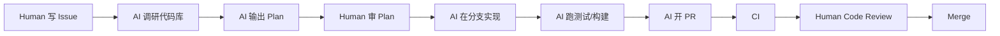
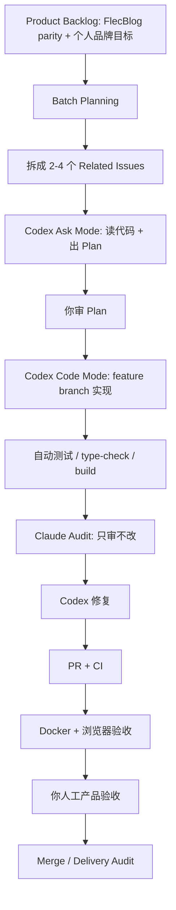

## 结论

实际官方案例、技术社区、企业内部的 AI coding 项目开发，**不是“让 AI 从 0 到 1 自己把整个项目做完”**，而是逐渐收敛成一套更接近传统软件工程的模式：

> **人类负责产品边界、架构决策、验收标准和最终合并；AI 负责局部实现、代码理解、测试补齐、重构迁移、样板代码、低风险 bug 修复和候选方案生成。**

你自己摸索出的 Batch 方法，方向和主流实践是接近的，但官方和企业内部更强调几件事：

```text
1. 任务必须像 GitHub Issue 一样清晰
2. 大变更先 Ask / Plan，不直接 Code
3. 每个任务有 Done When / Acceptance Criteria
4. Agent 必须能跑测试、lint、type-check、构建
5. 每个 AI 任务最好进入独立分支 / sandbox / PR
6. 人类必须 code review 和产品验收
7. AI 不替代 CI、Review、安全审查、上线流程
```

---

# 1. OpenAI 自己怎么用 Codex？

OpenAI 公开说，Codex 是 cloud-based software engineering agent，可以并行处理多个任务，每个任务运行在独立 sandbox 里，能读写文件、运行测试、lint、type-check，并在完成后给出 terminal logs 和 test outputs，供人类追踪验证；同时 OpenAI 明确说，用户仍然需要人工 review 和 validate agent 生成的代码。([OpenAI](https://openai.com/index/introducing-codex/ "Introducing Codex | OpenAI"))

这几个点很关键：

## 1.1 OpenAI 不是让 Codex 直接接管整个项目

OpenAI 内部使用 Codex 的高频场景包括：

|场景|Codex 适合做什么|
|---|---|
|代码理解|找核心逻辑、梳理数据流、理解陌生模块|
|重构 / 迁移|多文件一致性修改、老模式迁移到新模式|
|性能优化|找重复 DB 调用、低效循环、缓存机会|
|测试补齐|给低覆盖模块补 unit/integration tests|
|开发提速|scaffold API route、telemetry hook、配置脚本|
|保持心流|把碎片任务、顺手修复、低优先级任务交给 Codex|
|探索方案|比较不同架构方案、找相似 bug、分析 trade-off|

OpenAI 的案例里，Codex 经常被用来做“一个工程师原本要花几十分钟到几小时的局部任务”，而不是“完整重写一个产品”。OpenAI 的最佳实践还明确建议：大改动先用 Ask mode 让 Codex 生成实现计划，再切到 Code mode；任务最好是一个工程师约一小时能完成，或几百行代码级别的工作。

**这对你的博客项目非常有启发：**

你之前的问题不是“博客后端重写不适合 AI”，而是你把任务边界给得太大：

```text
错误方式：
基于 FlecBlog，前端复用，Java 后端重写，做完整博客系统。

更接近 OpenAI 用法：
实现文章详情页真实 API 闭环。
实现访问统计采集与后台 dashboard 聚合。
将 mock notification 改成真实数据库通知。
为现有评论 API 补 integration tests。
把旧上传逻辑迁移到新的 storage service pattern。
```

---

# 2. OpenAI 推荐的任务写法：像 GitHub Issue，不像愿望清单

OpenAI Codex best practices 说，一个好的 prompt 默认包含四件事：

```text
Goal：要改什么 / 建什么
Context：哪些文件、目录、文档、错误相关
Constraints：架构、安全、代码规范、约束
Done when：什么条件满足才算完成
```

OpenAI 还建议把 prompt 写得像 GitHub Issue，包括文件路径、组件名、diff、文档片段，并使用“照着 module X 的模式实现”这类约束。([OpenAI开发者](https://developers.openai.com/codex/learn/best-practices "Best practices – Codex | OpenAI Developers"))

换成你博客项目的写法，不应该是：

```text
把后台统计做完整。
```

而应该是：

```text
Goal:
实现后台访问统计真实闭环，替换当前 hardcode / empty response。

Context:
- backend/src/main/java/.../StatsController.java
- backend/src/main/java/.../VisitLogRepository.java
- admin/src/views/dashboard/...
- 参考 FlecBlog 统计展示字段

Constraints:
- Java 21 + Spring Boot
- 不允许 mock / hardcode / 固定 0 冒充真实数据
- Controller 不直接写 SQL，遵循现有 service/repository 分层
- 字段无法真实支持时返回 unsupported，而不是 fake value

Done when:
- POST /api/v1/collect 写入 visit_log
- 后台 dashboard totalViews/todayViews 来源于真实聚合
- 刷新页面数据不丢失
- 后端 integration test 通过
- admin type-check 通过
- DELIVERY_AUDIT.md 记录验证证据
```

这才是官方案例里的 AI coding 任务颗粒度。

---

# 3. Anthropic / Claude Code 怎么建议企业使用？

Anthropic 的企业级 agentic coding 指南非常接近你这次踩坑后的结论。它明确提醒不要落入 “do everything trap”：新用户经常给 Claude Code 巨大、无边界的任务，结果很差；解决方式是测试驱动、从测试规格开始、把请求拆成小的可测试块、每一步验证后再继续。

Anthropic 推荐的工作方式大概是：

```text
1. 先让 Claude 写测试规格
2. 再让它实现刚好能通过测试的代码
3. 每个 checkpoint 运行测试并 review diff
4. 核心功能稳定后再逐步扩展范围
5. 用连续的小命令，而不是一个巨大的“build everything”
```

它给的例子也很典型：

```text
不要：
Build a complete user authentication system.

应该：
Write tests for user registration.
Implement registration logic to pass these tests.
Add password hashing.
Add session management.
Add edge case tests.
```

映射到你的博客项目：

```text
不要：
复刻 FlecBlog 后端全部功能。

应该：
Write tests for article publish/read/update/delete.
Implement article persistence to pass these tests.
Add markdown rendering metadata.
Add category/tag relation tests.
Add admin article list filtering.
Add browser validation script.
```

---

# 4. GitHub Copilot Coding Agent 的官方模式

GitHub 官方也不建议把模糊大任务直接丢给 coding agent。它说 Copilot cloud agent 更适合清晰、范围明确的任务；理想任务要包含问题描述、完整 acceptance criteria、需要改哪些文件。它还明确列出不适合直接交给 agent 的任务：复杂宽泛任务、需要跨仓库知识的大重构、深业务逻辑、生产关键任务、安全/认证/隐私、模糊需求。([GitHub Docs](https://docs.github.com/copilot/how-tos/agents/copilot-coding-agent/best-practices-for-using-copilot-to-work-on-tasks "Best practices for using GitHub Copilot to work on tasks - GitHub Docs"))

GitHub 还建议：复杂任务不要一上来让 agent 开 PR，而是先让它 research repository、create implementation plan、在分支上迭代，等人类 review diff 后再决定是否开 PR。([GitHub Docs](https://docs.github.com/copilot/how-tos/agents/copilot-coding-agent/best-practices-for-using-copilot-to-work-on-tasks "Best practices for using GitHub Copilot to work on tasks - GitHub Docs"))

这说明企业里的 AI coding 更像这样：

```text
Issue → Agent 调研 → Plan → Branch → Commit → Test → PR → Human Review → CI → Merge
```

而不是：

```text
Prompt → Agent 改一堆 → Agent 说完成 → 人打开网页才发现没做
```

---

# 5. DORA / Google 对企业 AI 软件开发的判断

DORA 2025 对 AI-assisted software development 的核心结论很重要：AI 的主要角色是 amplifier，会放大组织已有的优势和问题；最大收益不来自工具本身，而来自对底层组织系统的战略性改进。([Dora](https://dora.dev/dora-report-2025/ "DORA | State of AI-assisted Software Development 2025"))

翻译成你的情况就是：

> 如果原项目本来就有清晰架构、测试、CI、Issue、验收标准，AI 会放大效率。  
> 如果原项目本来就边界混乱、文档失控、测试不足、验收口径不清，AI 会更快制造假完成。

所以你这次踩坑很正常。不是因为博客项目特别难，而是 AI 把软件工程里本来就存在的管理缺口暴露得更快。

---

# 6. 企业内部实际一般会形成哪几种 AI coding 模式？

公开资料不会暴露太多公司内部细节，但从 OpenAI、Anthropic、GitHub、DORA 的材料，以及技术社区实践，可以归纳出 6 种主流模式。

---

## 模式一：Issue-to-PR 模式

这是现在最标准、最像企业工程流程的模式。



适合：

```text
- bug fix
- 小功能
- 测试补齐
- 文档更新
- UI 小调整
- API 字段补齐
- 重构中的局部迁移
```

不适合：

```text
- 整个系统重写
- 架构大迁移
- 安全认证核心改造
- 数据库大范围改模型
- 产品需求还没想清楚的功能
```

你博客项目应该把每个 Batch 拆成 1 个 parent issue + 2-4 个 child issue，而不是让 Codex 直接吃掉整个项目。

---

## 模式二：AI Pair Programming 模式

这是开发者和 AI 在 IDE/CLI 里实时协作：

```text
人类：描述当前小目标
AI：改代码
人类：看 diff / 运行测试 / 指出问题
AI：修复
人类：继续收窄
```

适合：

```text
- 前端页面调样式
- 后端接口补字段
- SQL / DTO / Mapper 修改
- 单个 bug 定位
- 小范围重构
```

优点是反馈快，缺点是容易产生“长会话污染”。Anthropic 指出上下文管理很重要，错误反馈要具体：不能说“按钮怪怪的”，而要说“移动端下登录按钮超出容器 20px”。

你的项目里，Claude Code 更适合这种模式：  
**你亲自看页面，发现问题，截图/错误日志给 Claude，让它定点修。**

---

## 模式三：Test-first Agent 模式

这是 Anthropic 特别强调的模式：

```text
先写测试 → 确认测试失败 → 实现 → 测试通过 → review diff
```

适合：

```text
- 后端业务逻辑
- API 行为闭环
- 数据持久化
- 权限校验
- 边界条件
- bug regression
```

你的博客项目后端尤其应该走这个模式。

例如“访问统计”：

```text
1. 写 integration test：
   collect 一次 PV 后，dashboard totalViews 增加。

2. 测试先失败：
   当前返回 0 或 empty list。

3. 实现 visit_log 写入和聚合。

4. 测试通过。

5. 再浏览器验收后台 dashboard。
```

这个模式最能防止 AI 假完成。

---

## 模式四：Agent as Reviewer / Auditor 模式

很多团队不会只让 AI 写代码，还会让另一个 AI 审代码：

```text
AI A：实现
AI B：审查 diff，找假实现、测试缺口、风险
Human：最终判断
```

适合：

```text
- AI 写完后的二次审计
- 检查是否 hardcode / mock / TODO
- 检查异常处理
- 检查测试是否只测 HTTP 200
- 检查是否改了无关文件
```

你已经自然摸到了这个模式：  
Codex 写完后，Claude Code 审计发现很多 STOP / 未实现 / 前后端不闭环。

但要制度化：

```text
每个 Batch 完成后，让另一个 agent 只做 audit，不允许改代码。
输出：
- 已闭环功能
- 疑似假实现
- 测试缺口
- 前后端断点
- 数据持久化风险
- 必须人工验收路径
```

---

## 模式五：AI for Legacy Migration / Refactor 模式

OpenAI 内部很常用 Codex 做跨文件重构、迁移老模式、更新 API、拆 oversized modules。

这个模式适合你的“复用 FlecBlog 前端，Java 后端重写”的项目，但要注意：

```text
不要让 AI 自由发挥新架构。
要给它一个已有模块作为 template。
```

例如：

```text
Follow the implementation pattern in ArticleModule.
Implement CategoryModule with the same controller-service-repository-test structure.
Do not invent a new architecture.
```

AI 最擅长“按已有模式复制并适配”，不擅长“自己定义完整产品架构后长期保持一致”。

---

## 模式六：Human Product Owner + AI Dev Team 模式

这是个人开发者、一人公司最可能落地的模式：

```text
你 = PM + 架构师 + QA Lead + Release Owner
Codex = 实现工程师
Claude = 审计工程师 / 结对调试
ChatGPT = 产品规划 / prompt / 架构复盘
CI = 冷酷裁判
浏览器 = 最终现实检验
```

这个模式里，AI 不是替代你，而是把你逼到更高层：

```text
你不再主要写代码
你主要设计：
- 做什么
- 不做什么
- 怎么验收
- 怎么分批
- 怎么防止假完成
- 怎么上线
```

这和你文章里的“把自己升级成设计工作系统的人”是一致的。

---

# 7. 技术社区里比较成熟的共识

综合官方和社区，目前共识大概是这些：

## 7.1 AI coding 最适合“窄任务”，不适合“宽目标”

好的 AI 任务：

```text
- 范围小
- 上下文明确
- 有相似代码可参考
- 有测试能验证
- 改动可 review
- 失败可回滚
```

坏的 AI 任务：

```text
- 做一个完整系统
- 你自己也没想清楚
- 没有验收标准
- 没有测试
- 多个模块耦合
- 涉及安全/认证/数据迁移/上线风险
```

## 7.2 AI 写代码前，最好先让它读代码和写计划

主流做法不是直接：

```text
implement this
```

而是：

```text
inspect the codebase
identify affected files
propose implementation plan
list risks and tests
wait for approval
```

OpenAI 的 Ask mode → Code mode，本质就是这个流程。

## 7.3 AI 生成代码后，必须进入普通工程流程

也就是：

```text
diff review
unit test
integration test
lint/type-check
CI
PR review
security check
manual QA
```

AI 代码不应该拥有特殊豁免权。GitHub 官方也说，Copilot 创建的 PR 走向 mergeable 的过程，和人类开发者创建 PR 后需要继续修正的过程一样。([GitHub Docs](https://docs.github.com/copilot/how-tos/agents/copilot-coding-agent/best-practices-for-using-copilot-to-work-on-tasks "Best practices for using GitHub Copilot to work on tasks - GitHub Docs"))

## 7.4 企业会把“AI 使用规范”写进仓库

比如：

```text
AGENTS.md
CLAUDE.md
.github/copilot-instructions.md
.prompt.md
.agent.md
```

里面写：

```text
- 项目架构
- 代码风格
- 测试命令
- 禁止事项
- 安全规则
- 数据库规范
- API 约定
- PR 规范
```

OpenAI 明确建议用 AGENTS.md 提供持久上下文，说明项目结构、测试命令、标准实践。([OpenAI](https://openai.com/index/introducing-codex/ "Introducing Codex | OpenAI"))  
GitHub 也建议用 repository custom instructions 指导 Copilot 如何理解项目、构建、测试、验证变更；如果 agent 能在自己的环境里 build/test/validate，产出的 PR 更容易快速合并。([GitHub Docs](https://docs.github.com/copilot/how-tos/agents/copilot-coding-agent/best-practices-for-using-copilot-to-work-on-tasks "Best practices for using GitHub Copilot to work on tasks - GitHub Docs"))

---

# 8. 和你现在的 Batch 方法对比

你的方法：

```text
一次做 2-4 个相关 feature
组成 Batch
最后 Docker、浏览器、人工验收
```

和主流实践的关系：

|维度|你的 Batch 方法|官方/企业更成熟做法|差距|
|---|---|---|---|
|任务拆分|2-4 个相关 feature|well-scoped issue / PR|需要 issue 化|
|上下文管理|一批共享上下文|AGENTS.md + task prompt + branch context|需要更制度化|
|开发顺序|feature 批量推进|plan first / test first / incremental|需要强制 Plan 和测试|
|验收|Batch 末尾验收|每步自动验证 + PR 级 CI + 末尾人工验收|不能只靠末尾|
|文档|唯一执行锁|repo instructions + PR + audit log|方向正确|
|人工参与|最后浏览器验收|plan review、diff review、product QA|人不能只在最后出现|
|风险控制|不允许假完成|sandbox、branch、PR、CI、human review|需要 Git 工作流承接|

我的判断：

> **你的 Batch 方法是一个适合个人项目的经验版；官方和企业内部则会把它进一步制度化成 Issue → Plan → Branch → Test → PR → Review → CI → Merge 的工程流水线。**

---

# 9. 对你的博客项目，最接近“企业内部 AI coding”的流程应该这样设计

## 9.1 总体流程



## 9.2 每个 Batch 的标准产物

```text
1. Batch Brief
   - 目标
   - 包含 feature
   - 不包含什么
   - 风险

2. Feature Issues
   - 背景
   - affected files
   - acceptance criteria
   - test requirements

3. Implementation Plan
   - Codex 先输出，不直接改

4. PR
   - 小 diff
   - 测试证据
   - 截图或浏览器验收记录

5. Audit Report
   - Claude 或另一个 Agent 检查假实现

6. Delivery Audit
   - 人类最终确认
```

---

# 10. 给你一个更真实的“企业版 Batch 模板”

你可以直接交给 Codex / Claude Code：

```text
You are working on Batch 1: Admin Data Truthfulness.

Goal:
Remove fake or misleading admin data. Visit stats, notifications, and system info must be backed by real data or explicitly marked unsupported/disabled.

Scope:
1. VISIT-STATS-CLOSED-LOOP
2. NOTIFICATIONS-CLOSED-LOOP
3. SYSTEM-INFO-HONESTY-CLOSED-LOOP

Out of scope:
- Elasticsearch
- RSS Reader
- Email delivery
- OAuth
- Deployment optimization
- UI redesign

Required workflow:
1. First inspect the codebase and produce an implementation plan.
2. Do not modify code until the plan is approved.
3. For each feature, create the smallest failing test that proves the current gap.
4. Implement only enough code to satisfy the test and real product behavior.
5. Run targeted tests after each feature.
6. At batch end, run:
   - backend tests
   - frontend type-check/build
   - docker compose validation
   - browser smoke test
7. Update only:
   - EXECUTION_LOCK.md
   - DELIVERY_AUDIT.md

Definition of Done:
- No hardcoded counters.
- No empty arrays pretending success.
- No TODO/STOP implementation in completed paths.
- Real browser path works.
- Data survives refresh and restart.
- Unsupported fields are explicitly marked unsupported/disabled.
- Test outputs and commands are recorded.

Audit:
After implementation, another agent should review the diff for:
- fake implementation
- missing persistence
- tests that only assert HTTP 200
- frontend/backend contract mismatch
- accidental unrelated changes
```

---

# 11. 最关键的认知修正

你原来可能把 AI coding 理解成：

```text
我给 AI 一个完整目标
AI 自己分解、实现、测试、交付
我最后看结果
```

真实的成熟实践更像：

```text
我把工程系统设计好
AI 在系统里承担局部开发任务
每一步都有边界、证据、测试、审查、回滚
```

一句话：

> **AI coding 不是弱化软件工程，而是要求你把软件工程显式化、流程化、可验证化。**

你的 Batch 方法不是错，而是还停留在“个人摸索版”。  
真正成熟的版本应该升级为：

```text
Batch = 业务目标分组
Issue = 最小可实现任务
Plan = AI 改代码前的设计检查
Test = 防幻觉机制
PR = 变更边界
CI = 机器裁判
Audit = 第二视角
Browser QA = 产品现实检验
Human Review = 最终责任
```

这样才是官方案例、技术社区、企业内部更接近真实生产的 AI coding 项目开发方式。