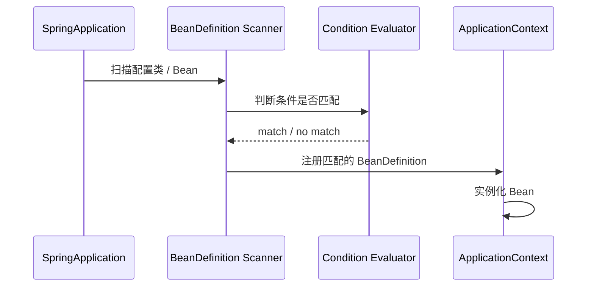

```
随着深入体验，用chatgpt生成内容辅助学习

有一些痛点：

1.生成内容很容易太长，内容确实丰富，但是太费时间精力，不可能什么东西都那么深入的去学习。但是如果内容没那么长，我又害怕深度不够，没学到位

2.很容易分20多个章节，标题也眼花缭乱，这也可能是因为内容确实丰富，但是我读起来真的很费劲（但是我也想不到什么好解决办法）

3.大量的文字，读完就忘，把握不住文章脉络，建立不起来整体认知，还是需要多一些mermaid图

4.chatgpt生成的内容无法直接嵌入图片，我想的是每次回答完后，让chatgpt生成一些辅助理解的图片，然后插在合适的位置，最终作为我的学习笔记
```

[[Spring Condition第一版]]
[[Spring Condition第二版]]
[[Spring Condition第三版]]

---
你这个痛点非常真实，而且不是“你读不下去”的问题，而是 **AI 生成学习内容天然容易过度展开、线性堆料、缺少结构锚点**。

我建议以后把 ChatGPT 当成一个 **分层学习内容生成器**，而不是一次性让它写“完整讲解”。

## 一、核心解决方案：不要生成“文章”，生成“学习包”

以后每个技术点都按这个结构来：

```text
1. 3分钟总览：这个东西解决什么问题？
2. 知识地图：它和哪些概念有关？
3. 实际用法：3~6个高频用法，每个配代码
4. 判断标准：什么时候用，什么时候不用？
5. 常见误区：初学者最容易错在哪里？
6. Mermaid图：流程图 / 关系图 / 调用链路图
7. 一页总结：可以直接放进笔记
8. 可选深挖：只有需要时再展开
```

这样你不会被迫从头读到尾，而是先建立整体认知，再决定哪些部分值得深入。

---

## 二、内容长度问题：用“三层深度”解决

你现在的矛盾是：

> 太长，学不动；太短，又怕没学透。

解决办法不是选长或短，而是分层。

### 推荐三层结构

|层级|目标|长度|适合内容|
|---|--:|--:|---|
|L1 总览层|建立整体认知|300~600字|是什么、为什么、解决什么问题|
|L2 实战层|真正会用|1500~3000字|常见用法、代码案例、使用场景|
|L3 深挖层|面试/源码/架构理解|按需展开|原理、源码、设计取舍、边界问题|

以后你可以要求我：

```text
请按 L1/L2/L3 三层讲解。
先给 L1 和 L2，L3 只列出可深挖目录，不展开。
```

这样既不会浅，也不会一次性爆炸。

---

## 三、章节标题问题：不要“概念标题”，要“问题标题”

很多 AI 内容难读，是因为标题像这样：

```text
1. Condition 概述
2. Condition 接口
3. Conditional 注解
4. ConditionalOnBean
5. ConditionalOnClass
6. ConditionalOnMissingBean
...
```

这类标题的问题是：**你必须读完才知道它们有什么用**。

更好的标题应该是：

```text
1. Condition 是 Spring 判断“要不要装配 Bean”的开关
2. @Conditional：自己写判断逻辑，适合框架扩展
3. @ConditionalOnClass：类存在才装配，常用于 starter
4. @ConditionalOnBean：已有某个 Bean 才装配，常用于增强功能
5. @ConditionalOnMissingBean：用户没定义时才给默认实现
6. @Profile：按环境切换配置，本质是特定场景的条件装配
7. 实战判断：我到底该用哪个条件注解？
```

这种标题的好处是：**标题本身就能传递知识**。

以后可以固定要求：

```text
章节标题必须是“结论式标题”，不要用泛泛的概念标题。
读标题就要能看懂文章脉络。
```

---

## 四、大量文字读完就忘：每篇必须有“骨架图”

你说得对，Mermaid 图非常重要。

以后每个技术点至少配两类图：

### 1. 概念关系图

适合理清楚“这个东西在体系里处于什么位置”。

```mermaid
flowchart TD
    A[Spring Bean 装配] --> B[普通装配]
    A --> C[条件装配]

    C --> D[@Conditional]
    C --> E[@Profile]
    C --> F[Spring Boot 条件注解]

    F --> G[@ConditionalOnClass]
    F --> H[@ConditionalOnBean]
    F --> I[@ConditionalOnMissingBean]
    F --> J[@ConditionalOnProperty]
```

### 2. 执行流程图

适合理清楚“它运行时到底怎么工作”。



你以后可以直接要求：

```text
每个核心概念必须配：
1. 一张概念关系 Mermaid 图
2. 一张执行流程 Mermaid 图
3. 一张实战选择决策图
```

---

## 五、图片嵌入问题：分成“Mermaid图”和“AI教学图”

你说“ChatGPT 生成的内容无法直接嵌入图片”，这个确实是工作流问题。

比较实用的方式是：

### 方案 A：正文里先放 Mermaid

优点：

- 直接能进 Markdown 笔记
    
- Obsidian、Typora、很多博客都支持
    
- 可维护，可修改
    
- 适合知识结构、流程、调用链路
    

### 方案 B：每篇文章最后生成 1~3 张“教学图 Prompt”

例如每次技术讲解结束后，让我输出：

```text
【配图1：概念地图】
适合插入在“概述”之后。

【配图2：调用链路图】
适合插入在“原理流程”之后。

【配图3：实战选择图】
适合插入在“如何选择用法”之后。
```

然后你可以拿这些 Prompt 去生成图，再插回笔记。

### 方案 C：让我直接生成图

当你需要正式学习笔记配图时，可以直接让我生成：

```text
基于刚才这篇内容，生成一张 16:9 横版技术教学图，主题是……
```

适合做成文章封面、知识卡片、流程图、架构图。

---

## 六、我建议你以后用这个固定 Prompt

你可以把这个作为长期学习模板：

```text
请系统讲解【XXX】。

要求：
1. 不要写成二十多个章节的长文。
2. 采用“学习包”结构，而不是普通文章结构。
3. 先给 3 分钟总览，再给知识地图，再讲实际用法。
4. 内容分为 L1 总览、L2 实战、L3 可选深挖，不要一上来全部深挖。
5. 章节标题必须是结论式标题，读标题就能看懂脉络。
6. 每个重要用法都要有：适用场景、代码案例、注意事项。
7. 必须提供 Mermaid 图，包括概念关系图、执行流程图、选择决策图。
8. 最后给一页总结，方便直接放进我的学习笔记。
9. 如果适合配图，请额外给出 2~3 个高质量技术教学图生成 Prompt，并说明应该插入到文章哪个位置。
```

---

## 七、以后我可以默认按这个风格给你讲技术

以后你问我 Spring、DDD、K8S、Redis、AI 工程、Java 后端这些内容，我会优先按这个结构处理：

```text
先建立整体认知
再讲实际用法
再给代码案例
再给 Mermaid 图
最后给一页总结
深挖内容只列入口，不默认全部展开
```

这样你不会被信息淹没，但也不会学得太浅。


---
# 这种问题有没有什么skill能用？
有，但我建议你不要找一个“万能学习 Skill”，而是做一个 **专门服务你学习笔记工作流的 Skill / Prompt 模板**。

更准确地说，这类问题适合做成：

```text
技术学习笔记生成 Skill
```

它不负责“讲得越多越好”，而是负责 **控制学习内容的结构、长度、图示、可复用性**。

---

# 这个 Skill 应该解决什么？

你的痛点本质上是 4 个：

|痛点|Skill 要做的事|
|---|---|
|内容太长|强制 L1/L2/L3 分层，不一次性爆炸|
|章节太碎|禁止 20+ 章节，改成 5~8 个大模块|
|读完就忘|强制输出 Mermaid 图和一页总结|
|无法插图|自动生成配图 Prompt，并标注插入位置|

---

# 可以直接做一个 `/skill`

比如你以后可以这样用：

```text
/skill 技术学习笔记
主题：Spring Condition 条件装配
要求：偏实战，适合 Java 后端开发者
```

然后这个 Skill 固定输出：

```text
1. 3分钟总览
2. 知识地图
3. 高频实战用法
4. 代码案例
5. 使用决策图
6. 常见误区
7. 一页总结
8. Mermaid 图
9. 配图 Prompt
```

---

# Skill 核心规则可以这样写

你可以保存成一个长期 Prompt：

```text
你是我的“技术学习笔记生成器”。

目标：
把复杂技术主题整理成适合长期学习、复习、沉淀到 Obsidian / DevWiki / 博客里的结构化笔记。

输出要求：

1. 不要写成二十多个章节的长篇百科。
2. 默认使用 5~8 个大模块，每个模块标题必须是“结论式标题”。
3. 先建立整体认知，再讲实际用法，再讲必要原理。
4. 内容按 L1/L2/L3 分层：
   - L1：3分钟总览，帮助快速建立认知
   - L2：实战层，包含使用场景、代码案例、注意事项
   - L3：深挖层，只列可选深挖方向，不默认展开
5. 每个核心概念必须回答：
   - 它解决什么问题？
   - 什么时候用？
   - 怎么用？
   - 容易踩什么坑？
6. 必须包含 Mermaid 图：
   - 概念关系图
   - 执行流程图
   - 使用决策图
7. 最后必须给“一页总结”，方便直接放进学习笔记。
8. 如果适合配图，最后生成 2~3 个高质量技术教学图 Prompt，并说明应该插入到文章哪个位置。
9. 语言风格：
   - 面向 Java 后端 / AI 工程学习者
   - 少废话
   - 重实际用法
   - 保留必要深度
   - 不堆概念名词
```

---

# 我更建议做成 3 个 Skill，而不是 1 个

因为你的学习场景不止一种。

## Skill 1：快速建立认知

适合第一次接触某个概念。

```text
/skill 技术概念速通
主题：限界上下文
目标：让我用 15 分钟建立整体认知
```

输出重点：

```text
是什么
解决什么问题
和相近概念的区别
一张 Mermaid 图
一个实际案例
```

---

## Skill 2：实战用法学习

适合 Spring、Redis、K8S、DDD 这种你要真正会用的主题。

```text
/skill 技术实战用法
主题：Spring Condition
目标：讲清楚实际用法和代码案例
```

输出重点：

```text
常见用法
代码案例
适用场景
踩坑点
选择决策图
```

---

## Skill 3：源码 / 原理深挖

适合你已经会用，但想理解底层机制。

```text
/skill 技术原理深挖
主题：Spring 条件装配的执行流程
目标：理解源码链路和设计思想
```

输出重点：

```text
核心流程
关键类
调用链路
源码阅读路径
Mermaid sequenceDiagram
设计取舍
```

---

# 最适合你的 Skill 名字

我建议叫：

```text
/skill 学习包生成器
```

或者更贴合你的 DevWiki 项目：

```text
/skill DevWiki技术学习包
```

它的核心不是“帮我写文章”，而是：

> 把一个技术主题加工成可学习、可复习、可沉淀、可插图的知识包。

---

# 推荐最终版 `/skill`

你可以直接存这个：

```text
/skill DevWiki技术学习包

你是我的技术学习笔记架构师，负责把复杂技术主题整理成适合 Java 后端 / AI 工程学习者长期沉淀的学习包。

当我给出一个主题时，请按以下结构输出：

# 0. 本篇怎么读
用 5~8 行告诉我：哪些部分必须读，哪些部分可以跳过。

# 1. 3分钟总览
用简洁语言讲清楚：
- 它是什么
- 它解决什么问题
- 它在整个技术体系中的位置
- 不学它会遇到什么问题

# 2. 知识地图
用 Mermaid 画出它和相关概念的关系。

# 3. 实战用法
列出 3~6 个最高频、最值得掌握的用法。
每个用法必须包含：
- 适用场景
- 核心代码
- 注意事项
- 什么时候不要用

# 4. 执行流程
用 Mermaid 画出运行时流程。
只解释关键节点，不要扩散成源码百科。

# 5. 如何选择
用表格或 Mermaid 决策图说明不同方案怎么选。

# 6. 常见误区
列出 3~5 个初学者最容易误解的点。

# 7. 一页总结
生成可以直接放进 Obsidian / DevWiki 的总结笔记。

# 8. 可选深挖
只列出值得深挖的方向，不展开。
格式：
- 深挖点
- 为什么值得学
- 什么时候需要学

# 9. 配图 Prompt
生成 2~3 个技术教学图 Prompt。
每个 Prompt 说明：
- 图片主题
- 适合插入的位置
- 横版/竖版
- 图中应该包含哪些元素

限制：
- 不要超过 8 个一级章节。
- 不要写成百科。
- 标题必须是结论式标题。
- 优先讲实际使用，再讲底层原理。
- 不要为了显得全面而堆概念。
- 默认深度控制在“能用 + 能解释清楚”的程度。
```

---

# 一句话结论

有必要做 Skill，但不是做“更会写长文的 Skill”。

你需要的是：

```text
控制长度 + 强制结构 + 强制图示 + 强制总结 + 可选深挖
```

这种 **学习内容工程化 Skill**。