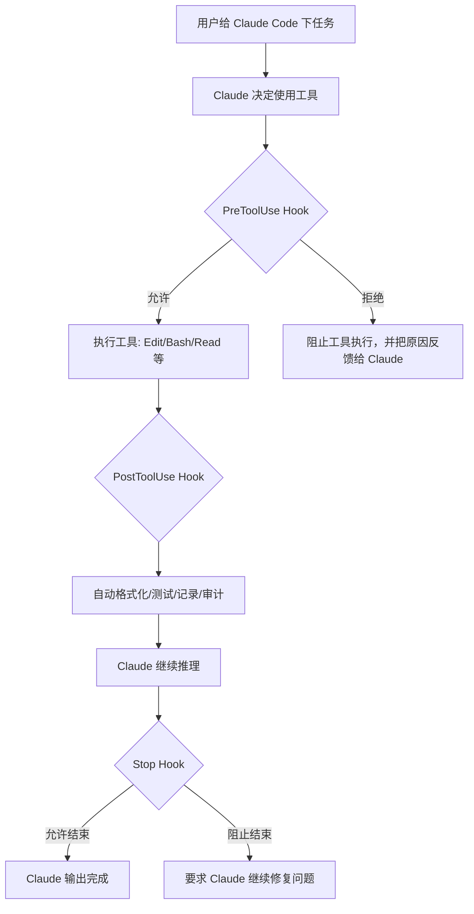

## 结论：Claude Code 的 Hook 是“自动化拦截器 / 质量门禁”

Claude Code 的 **hook（钩子）**，本质上就是：

> 在 Claude Code 执行某些关键动作前后，自动触发你配置的脚本、命令、HTTP 服务或模型判断，用来做拦截、检查、修正、记录、通知。

它和 Git Hook 很像。

比如 Git 里有：

```text
pre-commit   提交前检查代码
pre-push     推送前跑测试
```

Claude Code 里也可以有：

```text
PreToolUse   Claude 执行工具前拦截
PostToolUse  Claude 执行工具后检查
Stop         Claude 准备结束回答时检查
```

官方文档里，Claude Code Hook 支持很多事件，比如 `PreToolUse`、`PostToolUse`、`PermissionRequest`、`Stop`、`SubagentStart`、`SubagentStop`、`FileChanged`、`ConfigChange` 等。最常用的是 `PreToolUse`、`PostToolUse`、`Stop`。([Claude](https://code.claude.com/docs/en/hooks "Hooks reference - Claude Code Docs"))

---

# 1. Hook 解决什么问题？

你之前遇到的 AI coding 典型问题是：

> Codex / Claude Code 说“我完成了”，但其实接口没实现、测试没跑、页面没验收、甚至有假实现。

Hook 的价值就是把“靠 AI 自觉”改成“强制执行规则”。

## 没有 Hook 时

你只能在提示词里写：

```text
每次修改代码后，请记得运行测试。
不要删除重要文件。
不要提交 mock 假实现。
```

问题是：  
提示词是软约束，Claude 可能忘。

## 有 Hook 后

你可以让系统强制执行：

```text
Claude 每次写完 Java 文件后，自动 mvn test
Claude 每次运行 rm 命令前，先检查是否危险
Claude 准备结束任务前，检查是否还有 TODO / mock / pass / throw new UnsupportedOperationException
```

这就是 Hook 的核心价值：

> **把 AI coding 的工程规范，从“建议”变成“机制”。**

---

# 2. Claude Code Hook 的运行机制

可以理解成这个流程：



官方文档明确说明：Hook 会接收 JSON 输入。命令型 hook 通过 `stdin` 接收 JSON，通过 `stdout`、`stderr` 和退出码反馈结果。`exit 0` 通常表示成功，`exit 2` 表示阻断。尤其是 `PreToolUse` 场景下，`exit 2` 可以阻止工具调用。([Claude](https://code.claude.com/docs/en/hooks "Hooks reference - Claude Code Docs"))

---

# 3. 最常用的几个 Hook 事件

## 3.1 `PreToolUse`：工具执行前拦截

这是最重要的 Hook。

适合做：

|场景|作用|
|---|---|
|Claude 准备执行 `rm -rf`|阻止危险命令|
|Claude 准备修改 `.env`|阻止泄露或误改配置|
|Claude 准备提交到 main 分支|阻止直接操作主分支|
|Claude 准备执行长时间命令|要求确认或改成安全命令|

官方说明里，`PreToolUse` 可以返回 `allow`、`deny`、`ask` 等决策；`deny` 会取消工具调用，并把原因反馈给 Claude。([Claude](https://code.claude.com/docs/en/hooks-guide "Automate workflows with hooks - Claude Code Docs"))

### 示例：禁止 Claude 执行危险删除命令

`.claude/settings.json`：

```json
{
  "hooks": {
    "PreToolUse": [
      {
        "matcher": "Bash",
        "hooks": [
          {
            "type": "command",
            "command": "./.claude/hooks/block-dangerous-command.sh"
          }
        ]
      }
    ]
  }
}
```

`.claude/hooks/block-dangerous-command.sh`：

```bash
#!/usr/bin/env bash

# 从 Claude Code 传入的 JSON 中读取 Bash 命令
# 需要本机安装 jq；也可以改成 Python/Node 解析 JSON
command=$(jq -r '.tool_input.command // ""')

# 阻止明显危险的删除命令
if [[ "$command" == *"rm -rf /"* ]] || [[ "$command" == *"rm -rf ~"* ]]; then
  echo "Blocked: dangerous rm command is not allowed." >&2
  exit 2
fi

# 阻止强推 main/master
if [[ "$command" == *"git push"* && "$command" == *"--force"* ]]; then
  echo "Blocked: force push is not allowed." >&2
  exit 2
fi

# 正常放行
exit 0
```

这里最关键的是：

```bash
exit 2
```

在 Claude Code Hook 里，很多事件下 `exit 2` 才表示“阻断”。`exit 1` 往往只是非阻断错误，不一定会阻止 Claude 继续执行。官方文档特别说明了这一点。([Claude](https://code.claude.com/docs/en/hooks "Hooks reference - Claude Code Docs"))

---

## 3.2 `PostToolUse`：工具执行后处理

`PostToolUse` 是工具成功执行之后触发。

适合做：

|场景|作用|
|---|---|
|Claude 修改了 `.java` 文件|自动运行 `mvn test` 或 Checkstyle|
|Claude 修改了 `.ts/.vue` 文件|自动运行 `npm run lint`|
|Claude 写完代码|自动格式化|
|Claude 执行命令后|记录审计日志|

注意：  
`PostToolUse` 是“事后处理”，不能撤销已经发生的操作。官方文档明确说明，`PostToolUse` 触发时工具已经执行完，文件写入、命令执行、网络请求等都已经生效。要阻止动作，应该用 `PreToolUse`。([Claude](https://code.claude.com/docs/en/hooks "Hooks reference - Claude Code Docs"))

### 示例：Claude 修改代码后自动跑 Maven 测试

`.claude/settings.json`：

```json
{
  "hooks": {
    "PostToolUse": [
      {
        "matcher": "Edit",
        "hooks": [
          {
            "type": "command",
            "command": "./.claude/hooks/run-backend-tests.sh"
          }
        ]
      }
    ]
  }
}
```

`.claude/hooks/run-backend-tests.sh`：

```bash
#!/usr/bin/env bash

# 进入项目根目录，避免 Claude 当前工作目录不一致
cd "$CLAUDE_PROJECT_DIR" || exit 2

# 如果后端目录不存在，说明当前项目不是 Java 后端项目，直接放行
if [ ! -d "backend" ]; then
  exit 0
fi

# 执行后端测试
# 这里用 -q 减少日志噪声；真实项目可根据需要调整
cd backend || exit 2
mvn test -q

# 如果测试失败，阻止当前流程继续“假完成”
if [ $? -ne 0 ]; then
  echo "Backend tests failed. Fix the failing tests before marking the task complete." >&2
  exit 2
fi

exit 0
```

这个 Hook 的意义是：

> Claude 不能只说“我改好了”，它必须面对测试结果。

---

## 3.3 `Stop`：Claude 准备结束时检查

`Stop` 在 Claude 准备停止回答时触发。

适合做：

|场景|作用|
|---|---|
|Claude 说任务完成|检查是否还有 TODO / mock / fake implementation|
|Claude 准备结束|检查测试是否通过|
|Claude 准备交付|检查是否生成验收说明|
|Claude 子任务结束|强制要求总结改动和风险|

官方说明：`Stop` hook 可以阻止 Claude 停止，并把原因反馈给 Claude，让它继续工作。不过官方也提醒，`Stop` 会在 Claude 完成一次响应时触发，不一定只代表整个任务完成；如果写得不好，可能导致循环。([Claude](https://code.claude.com/docs/en/hooks "Hooks reference - Claude Code Docs"))

### 示例：结束前检查是否残留假实现

`.claude/settings.json`：

```json
{
  "hooks": {
    "Stop": [
      {
        "hooks": [
          {
            "type": "command",
            "command": "./.claude/hooks/check-fake-implementation.sh"
          }
        ]
      }
    ]
  }
}
```

`.claude/hooks/check-fake-implementation.sh`：

```bash
#!/usr/bin/env bash

cd "$CLAUDE_PROJECT_DIR" || exit 2

# 防止 Stop Hook 无限循环
# stop_hook_active=true 表示当前已经是 Hook 要求 Claude 继续后的再次触发
if jq -e '.stop_hook_active == true' >/dev/null 2>&1; then
  exit 0
fi

# 搜索常见假实现标记
# 根据你的项目情况，可以继续加入 mock、stub、临时返回等关键词
matches=$(grep -RIn \
  --exclude-dir=node_modules \
  --exclude-dir=target \
  --exclude-dir=.git \
  -E "TODO|FIXME|mock implementation|stub|UnsupportedOperationException|return null" .)

if [ -n "$matches" ]; then
  echo "Found possible unfinished or fake implementation. Please inspect and fix before stopping:" >&2
  echo "$matches" >&2
  exit 2
fi

exit 0
```

这个对你很有用，因为你之前最痛的就是：

> AI 明明没做完，却宣称可以进入部署上线。

Stop Hook 就是专门治理这种“假完成”的。

---

# 4. Hook 配置文件放在哪里？

常见位置有两个：

```text
项目级：
.claude/settings.json

用户级：
~/.claude/settings.json
```

官方文档也提到，如果 `/hooks` 看不到配置，需要确认 JSON 合法、路径正确，项目级通常是 `.claude/settings.json`，用户级通常是 `~/.claude/settings.json`。([Claude](https://code.claude.com/docs/en/hooks-guide "Automate workflows with hooks - Claude Code Docs"))

## 建议你的用法

对于你的博客 / DevWiki / Java 项目，建议放在：

```text
项目根目录
└── .claude
    ├── settings.json
    └── hooks
        ├── block-dangerous-command.sh
        ├── run-backend-tests.sh
        ├── run-frontend-check.sh
        └── check-fake-implementation.sh
```

这样有几个好处：

1. 项目级规范可以跟着仓库走。
    
2. 不同项目可以有不同质量门禁。
    
3. Claude Code 每次进入项目，都能复用同一套规则。
    
4. 不依赖 Claude 每次“记住”你的要求。
    

---

# 5. Hook 和 `CLAUDE.md` / `AGENTS.md` 的区别

这是关键。

|对比项|CLAUDE.md / AGENTS.md|Hook|
|---|---|---|
|本质|规则说明 / 上下文文档|自动执行机制|
|约束强度|软约束|硬约束|
|适合内容|项目背景、代码规范、开发流程|安全拦截、自动测试、质量门禁|
|是否一定执行|不一定|匹配事件后必定执行|
|典型用途|告诉 Claude 怎么做|强制 Claude 不能乱做|

一句话：

> `CLAUDE.md` 是“告诉 AI 规则”，Hook 是“让规则自动生效”。

比如：

```text
CLAUDE.md：
每次改后端代码后，请运行 mvn test。

Hook：
只要 Edit 后端代码，就自动执行 mvn test，失败就不允许结束。
```

后者明显更可靠。

---

# 6. 适合你当前项目的 Hook 组合

结合你现在的 AI coding 工作流，我建议不要一上来搞太复杂。先做 4 类 Hook。

## 6.1 安全防护 Hook

目标：防止 AI 误删、误提交、误改敏感文件。

建议拦截：

```text
rm -rf /
rm -rf ~
git push --force
git reset --hard
修改 .env
修改 production 配置
删除 migrations
删除重要文档
```

适合事件：

```text
PreToolUse + Bash
PreToolUse + Edit
```

---

## 6.2 后端质量 Hook

目标：Java 后端不能只改代码不测试。

建议动作：

```text
mvn test
mvn -q -DskipTests=false test
mvn spotless:check
mvn checkstyle:check
```

适合事件：

```text
PostToolUse + Edit
Stop
```

---

## 6.3 前端质量 Hook

目标：避免页面能打开但构建失败。

建议动作：

```text
npm run lint
npm run type-check
npm run build
```

适合事件：

```text
PostToolUse + Edit
Stop
```

---

## 6.4 假实现检测 Hook

目标：治理 AI coding 最常见的“完成幻觉”。

建议扫描：

```text
TODO
FIXME
mock
stub
fake
return null
throw new UnsupportedOperationException
NotImplementedException
临时实现
待实现
```

适合事件：

```text
Stop
```

---

# 7. 一个更完整的项目级配置示例

`.claude/settings.json`：

```json
{
  "hooks": {
    "PreToolUse": [
      {
        "matcher": "Bash",
        "hooks": [
          {
            "type": "command",
            "command": "./.claude/hooks/block-dangerous-command.sh"
          }
        ]
      }
    ],
    "PostToolUse": [
      {
        "matcher": "Edit",
        "hooks": [
          {
            "type": "command",
            "command": "./.claude/hooks/run-project-checks.sh"
          }
        ]
      }
    ],
    "Stop": [
      {
        "hooks": [
          {
            "type": "command",
            "command": "./.claude/hooks/check-before-stop.sh"
          }
        ]
      }
    ]
  }
}
```

`run-project-checks.sh`：

```bash
#!/usr/bin/env bash

cd "$CLAUDE_PROJECT_DIR" || exit 2

# 后端检查：只有 backend 目录存在时才执行
if [ -d "backend" ]; then
  echo "Running backend tests..." >&2
  cd backend || exit 2
  mvn test -q

  if [ $? -ne 0 ]; then
    echo "Backend tests failed. Please fix them." >&2
    exit 2
  fi

  cd ..
fi

# 前端检查：只有 frontend 目录存在时才执行
if [ -d "frontend" ]; then
  echo "Running frontend build..." >&2
  cd frontend || exit 2

  # 如果 node_modules 不存在，可以提示而不是自动 npm install
  # 避免 Hook 过重、过慢
  if [ ! -d "node_modules" ]; then
    echo "node_modules not found. Please run npm install manually first." >&2
    exit 2
  fi

  npm run build

  if [ $? -ne 0 ]; then
    echo "Frontend build failed. Please fix it." >&2
    exit 2
  fi

  cd ..
fi

exit 0
```

---

# 8. Hook 不适合做什么？

Hook 不是万能的。

## 不适合塞太多复杂逻辑

不要把 Hook 写成一个巨大的 AI 项目管理系统。

反例：

```text
每次 Claude 编辑文件后：
1. 自动跑全量测试
2. 自动生成文档
3. 自动做代码审查
4. 自动提交 Git
5. 自动部署
6. 自动通知我
```

这样会导致：

```text
慢
不稳定
调试困难
Claude Code 使用体验下降
```

## 不适合替代 CI/CD

Hook 是本地开发门禁，不是最终交付门禁。

正确分工应该是：

|层级|作用|
|---|---|
|Hook|本地即时拦截|
|Git Hook|提交前检查|
|CI/CD|合并前、部署前最终验证|
|人工验收|页面效果、业务逻辑、产品体验|

Hook 不能替代 GitHub Actions、测试环境验收、人工点击页面。

---

# 9. 你应该怎么用？

结合你当前的 AI coding 场景，我建议这样落地：

## 第一阶段：只做 3 个 Hook

```text
1. PreToolUse：拦截危险 Bash 命令
2. PostToolUse：编辑代码后跑轻量检查
3. Stop：结束前检查假实现关键词
```

不要一开始搞 10 个 Hook。

## 第二阶段：区分前后端

```text
backend 改动 → mvn test
frontend 改动 → npm run build / type-check
docs 改动 → 不跑重检查
```

## 第三阶段：接入项目验收规范

比如你的博客项目可以加入：

```text
不允许新增 controller 但没有 service 实现
不允许新增前端 API 调用但后端没有对应接口
不允许接口返回硬编码 mock 数据
不允许声明完成但没有更新验收记录
```

这就能直接治理你之前遇到的“前端调用 API，后端根本没实现”的问题。

---

# 10. 最关键的理解

Claude Code Hook 不是“插件”，也不是“增强模型能力”。

更准确地说，它是：

> **AI coding 工作流里的自动化治理层。**

它负责把这些事情机械化：

```text
危险操作必须拦截
代码修改必须检查
任务完成必须验收
假实现必须暴露
```

所以对于你这种用 Codex / Claude Code 开发真实项目的人，Hook 的价值很大。

但使用原则是：

> 少而硬，别多而乱。

先用 3 个高价值 Hook：

```text
安全拦截
自动测试
假完成检测
```

这比安装一堆 Skill、插件、复杂工作流更实际。