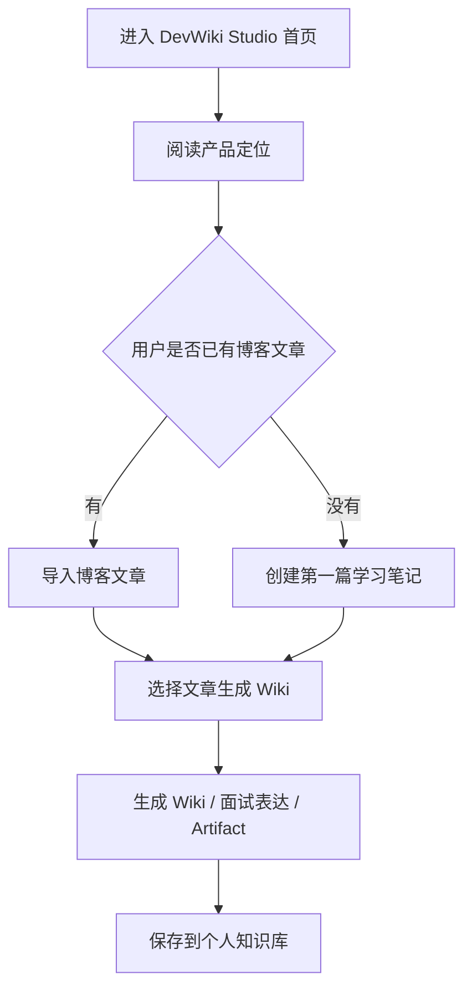
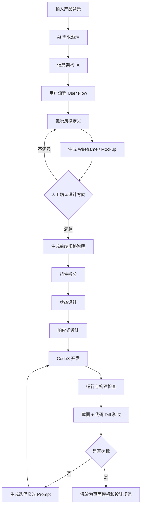

# 结论先说

你之前用 CodeX 直接做前端效果一般，核心原因不是 CodeX 不会写代码，而是：

> **你把“产品定义、交互设计、视觉设计、组件规范、状态设计、响应式策略、验收标准”这些前端开发前置工作，全都隐式交给了 CodeX。**

CodeX 更擅长：

- 根据明确规格写代码；
    
- 修改已有代码；
    
- 接入接口；
    
- 修 bug；
    
- 重构组件；
    
- 补测试；
    
- 做工程化落地。
    

但它不天然擅长在信息不足时自动做出高审美、高完成度、高一致性的 UI。

所以更好的工作流是：

```text
需求澄清
  ↓
页面信息架构 IA
  ↓
用户流程 User Flow
  ↓
视觉风格方向 Visual Direction
  ↓
Mockup / 原型图
  ↓
组件拆分 Component Spec
  ↓
状态设计 State Spec
  ↓
响应式设计 Responsive Spec
  ↓
前端技术规格 Frontend Spec
  ↓
交给 CodeX 实现
  ↓
人工验收 + AI 验收
  ↓
迭代优化
```

一句话：

> **不要让 CodeX 从 0 到 1“猜页面”，而是让设计模型先产出设计规格，再让 CodeX 按规格施工。**

---

# 1. 为什么直接让 CodeX 写前端容易难看？

## 1.1 因为“写前端代码”和“设计页面”不是一回事

后端开发容易把前端理解成：

```text
页面 = HTML + CSS + JS + 接口调用
```

但真实前端页面至少包含：

|层次|关注点|
|---|---|
|产品层|这个页面解决什么问题？主操作是什么？用户下一步去哪？|
|信息架构层|哪些信息最重要？怎么分组？怎么排序？|
|交互层|点击后发生什么？空状态怎么展示？错误怎么恢复？|
|视觉层|字体、间距、颜色、层级、卡片、阴影、留白|
|组件层|Header、Sidebar、Card、Table、Form、Modal 如何复用|
|状态层|loading、empty、error、success、disabled、skeleton|
|工程层|路由、状态管理、API、权限、缓存、构建、部署|

CodeX 直接写页面时，往往只能根据你的文字描述补全这些决策。

一旦输入不完整，它就会走“默认模板风”：

- 大标题；
    
- 几张卡片；
    
- 蓝色按钮；
    
- 表格；
    
- 简单 sidebar；
    
- 大量无设计感的灰色边框；
    
- 不统一的间距；
    
- 页面看起来像后台管理系统 demo。
    

这就是很多 AI 前端页面“能用但普通”的根源。

---

## 1.2 因为你没有给它“审美约束”

例如你只说：

> 帮我做一个 DevWiki Studio 首页。

CodeX 可能理解成：

```text
做一个有标题、有介绍、有按钮、有功能卡片的页面
```

但一个专业设计师会继续追问：

- 是产品官网，还是应用工作台？
    
- 面向开发者、企业客户，还是个人使用？
    
- 风格是 OpenAI 式克制，还是 Linear 式 SaaS，还是 Vercel 式开发者工具？
    
- 首页核心转化目标是什么？
    
- CTA 是“开始使用”“查看文档”“创建 Wiki”还是“导入博客”？
    
- 是否需要展示产品流程？
    
- 是否需要展示代码感、知识库感、AI 感？
    
- 是否需要深色模式？
    
- 移动端优先还是桌面端优先？
    

这些没定义，CodeX 就只能猜。

---

## 1.3 因为 CodeX 容易“工程正确，设计平庸”

CodeX 写出来的前端常见问题：

|问题|表现|
|---|---|
|信息层级弱|所有内容差不多大，不知道看哪里|
|留白差|页面挤、散、空、乱都有可能|
|组件不统一|卡片、按钮、表单、标题风格不一致|
|视觉风格无记忆点|像任意后台模板|
|状态缺失|只写正常数据，不写 loading/error/empty|
|响应式粗糙|桌面还行，手机崩掉|
|缺少真实内容|lorem ipsum 或泛泛文案，导致页面没质感|
|没有设计系统|每个页面单独发挥，越做越乱|

后端项目里，接口没有协议会乱；前端项目里，页面没有设计规格也会乱。

---

# 2. 更好的流程是什么？

## 核心原则

你应该把 AI 分成几个角色使用：

|阶段|适合的 AI 角色|目标|
|---|---|---|
|产品设计|GPT / Claude / Gemini|明确页面目标、用户流程、信息架构|
|UI 设计|GPT / Claude / Gemini / 图像模型|定义风格、布局、mockup|
|前端规格|GPT / Claude|生成可执行的组件、状态、接口、响应式规格|
|代码实现|CodeX|按规格写代码、改代码、接接口|
|验收迭代|GPT / Claude + 你人工检查|对照规格找问题，提出修改任务|

也就是：

```text
设计模型负责“想清楚”
CodeX 负责“做出来”
你负责“判断方向和验收”
```

---

# 3. 是否应该先用 Gemini / Claude / GPT 做 UI 设计和 mockup？

## 是，应该。

尤其你是后端开发者，前端不强，更应该先让大模型帮你产出：

1. **页面目标**
    
2. **信息架构**
    
3. **用户流程**
    
4. **视觉风格**
    
5. **低保真 mockup**
    
6. **高保真 UI 描述**
    
7. **组件拆分**
    
8. **状态设计**
    
9. **响应式规则**
    
10. **CodeX 开发任务书**
    

不要直接进入代码。

更合理的模型分工是：

|工具|更适合做什么|
|---|---|
|GPT / Claude|需求分析、产品逻辑、组件规格、前端开发 prompt|
|Gemini|多模态理解、参考图分析、视觉方向探索|
|图像模型|生成视觉 mockup、页面氛围图、设计参考|
|Figma / v0 / Lovable / Bolt|快速生成可视化原型，视具体习惯使用|
|CodeX|进入真实仓库实现、修复、重构、接接口|

你可以不用真的成为前端专家，但要学会控制这几个关键输入：

```text
页面目标 + 用户路径 + 信息优先级 + 风格参考 + 组件结构 + 状态清单 + 验收标准
```

---

# 4. 标准 SOP：后端开发者用 AI 做前端

下面这套流程可以复用到官网、后台、工作台、博客、AI 应用、知识库产品。

---

## Step 1：需求澄清

### 目标

先把页面“为什么存在”讲清楚。

### 你需要输入什么

```text
我要做什么产品？
这个页面给谁看？
用户进入页面后要完成什么任务？
核心按钮是什么？
有哪些必须展示的信息？
有没有参考网站？
技术栈是什么？
```

以你的 DevWiki Studio 为例：

```text
产品：面向开发者的个人知识库构建平台
页面：产品首页 / 工作台首页
目标用户：Java 后端开发者、AI 辅助学习用户
核心任务：理解产品价值，并开始创建 Wiki
参考风格：OpenAI、Linear、Vercel、Tencent 科技官网
核心 CTA：开始构建知识库 / 导入博客文章
```

### AI 应该输出什么

- 页面目标；
    
- 用户角色；
    
- 核心使用场景；
    
- 页面成功标准；
    
- 主要 CTA；
    
- 不应该出现的内容；
    
- 页面优先级排序。
    

### 你应该如何检查

重点看 3 个问题：

```text
1. 这个页面到底让用户做什么？
2. 首屏是否能讲清产品价值？
3. 主按钮是否明确？
```

### 常见错误

|错误|后果|
|---|---|
|只说“做个好看的页面”|AI 只能套模板|
|不定义用户|页面气质混乱|
|不定义主 CTA|页面没有转化目标|
|参考网站太多且风格冲突|视觉方向漂移|

---

## Step 2：页面信息架构 IA

### 目标

决定页面放什么、不放什么、先放什么、后放什么。

### 你需要输入什么

```text
页面类型：官网首页 / Dashboard / 详情页 / 编辑器页面
必须展示的信息：功能、流程、数据、操作入口、说明
用户最关心的问题：这个东西是什么？怎么用？有什么价值？
```

### AI 应该输出什么

例如首页 IA：

```text
1. Hero 首屏
   - 产品一句话定位
   - 简短价值说明
   - 主 CTA / 次 CTA

2. Problem Section
   - 开发者学习内容分散
   - AI 问答难以沉淀
   - 笔记无法转化为项目证据

3. Workflow Section
   - 写博客
   - 选择文章
   - 生成 Wiki
   - 生成面试表达
   - 沉淀为知识资产

4. Feature Section
   - Source 管理
   - Chunk 拆分
   - Wiki 生成
   - Artifact 输出
   - 面试表达

5. Product Preview
   - 工作台截图 / mockup

6. Final CTA
   - 开始构建你的开发者知识库
```

### 你应该如何检查

看信息是否符合：

```text
先讲价值，再讲功能，最后讲行动。
```

不要一上来堆功能。

### 常见错误

|错误|后果|
|---|---|
|功能堆砌|页面像说明书|
|没有用户痛点|用户不知道为什么要用|
|没有流程解释|产品理解成本高|
|首屏太虚|看起来高级但说不清楚|

---

## Step 3：用户流程 User Flow

### 目标

明确用户从进入页面到完成任务的路径。

### 你需要输入什么

```text
用户从哪里进入？
他第一步看到什么？
点击主按钮后去哪？
成功路径是什么？
失败路径是什么？
```

### AI 应该输出什么

例如：



### 你应该如何检查

重点看：

```text
1. 主路径是否短？
2. 用户是否知道下一步做什么？
3. 异常路径有没有考虑？
```

### 常见错误

|错误|后果|
|---|---|
|只有页面，没有流程|页面像静态展示|
|入口太多|用户不知道点哪里|
|没有完成态|用户不知道操作是否成功|
|忽略新手用户|第一次使用门槛高|

---

## Step 4：视觉风格 Visual Direction

### 目标

定义页面的审美方向，而不是让 CodeX 随机发挥。

### 你需要输入什么

建议用这种格式：

```text
产品气质：专业、克制、开发者工具、AI 感、知识库感
参考风格：OpenAI 官网的克制留白 + Linear 的 SaaS 质感 + Vercel 的开发者工具气质
避免风格：花哨、游戏化、低端后台模板、过度渐变、廉价阴影
颜色倾向：黑白灰为主，少量蓝紫科技色点缀
布局倾向：大留白、强首屏、卡片化、清晰层级
```

### AI 应该输出什么

- 设计关键词；
    
- 配色建议；
    
- 字体层级；
    
- 间距系统；
    
- 圆角和阴影规则；
    
- 页面氛围描述；
    
- 不要做什么。
    

### 你应该如何检查

看是否能形成一句明确的设计方向：

```text
这是一个克制、专业、面向开发者的 AI 知识工作台，而不是普通后台管理系统。
```

### 常见错误

|错误|后果|
|---|---|
|“现代化、科技感、高级感”太空泛|AI 无法稳定执行|
|参考网站风格冲突|页面四不像|
|颜色太多|廉价感强|
|阴影、渐变滥用|像模板站|

---

## Step 5：生成 mockup

### 目标

先看视觉方向，再写代码。

这里可以有三种方式：

|方式|适合情况|
|---|---|
|文本 wireframe|快速确定布局|
|HTML/CSS 静态 mockup|可直接预览|
|图片 mockup|看整体视觉气质|

对你这种后端开发者，我建议：

```text
先让 GPT/Claude 输出文本 wireframe
再让 AI 生成 HTML 静态 mockup
最后满意后交给 CodeX 进入真实项目
```

### 你需要输入什么

```text
页面类型
信息架构
视觉风格
参考网站
技术限制
是否需要深色模式
是否优先桌面端
```

### AI 应该输出什么

- 页面布局草图；
    
- 首屏结构；
    
- 卡片布局；
    
- 按钮位置；
    
- 文案建议；
    
- 静态 HTML mockup；
    
- 或者图片生成 prompt。
    

### 你应该如何检查

重点看：

```text
1. 第一眼是否专业？
2. 首屏是否有记忆点？
3. 信息层级是否清楚？
4. 按钮是否突出？
5. 是否像你想做的产品？
```

### 常见错误

|错误|后果|
|---|---|
|mockup 没过就写代码|后面返工成本高|
|只看单页，不看整体产品风格|多页面不一致|
|只追求炫酷|工程实现困难|
|没有真实文案|页面质感明显下降|

---

## Step 6：组件拆分 Component Spec

### 目标

把页面拆成 CodeX 能实现的组件。

### 你需要输入什么

```text
页面 mockup
技术栈
是否使用组件库
已有项目结构
需要复用哪些组件
```

### AI 应该输出什么

例如：

```text
components/
  MarketingHeader.tsx
  HeroSection.tsx
  ProblemSection.tsx
  WorkflowSection.tsx
  FeatureGrid.tsx
  ProductPreview.tsx
  FinalCTA.tsx
  Footer.tsx

pages/
  HomePage.tsx
```

每个组件应该说明：

|组件|职责|Props|状态|复用性|
|---|---|---|---|---|
|HeroSection|首屏价值表达|title, subtitle, primaryCta|无|高|
|FeatureGrid|功能展示|features[]|无|高|
|ProductPreview|展示工作台预览|image/mock data|loading 可选|中|
|WorkflowSection|解释使用流程|steps[]|无|高|

### 你应该如何检查

看是否符合：

```text
组件边界清晰
数据结构明确
页面不是一个巨大的 JSX 文件
```

### 常见错误

|错误|后果|
|---|---|
|一个页面全写在一个组件里|后期无法维护|
|组件拆太碎|复杂度上升|
|Props 不清楚|CodeX 实现容易乱|
|视觉组件和业务组件混在一起|后续复用困难|

---

## Step 7：状态设计 State Spec

### 目标

不要只设计“成功态”，还要设计真实系统里的各种状态。

### 你需要输入什么

```text
页面是否请求接口？
有哪些列表？
有哪些表单？
有哪些按钮操作？
是否有权限？
是否有异步任务？
```

### AI 应该输出什么

至少包括：

|状态|页面表现|
|---|---|
|loading|Skeleton / Spinner|
|empty|空状态插图 + 引导按钮|
|error|错误提示 + 重试按钮|
|success|Toast / 状态更新|
|disabled|按钮禁用说明|
|submitting|按钮 loading|
|permission denied|无权限提示|
|partial data|局部加载、局部失败|

以 DevWiki Studio 为例：

```text
文章列表为空：
- 展示空状态
- 文案：还没有可用于构建 Wiki 的文章
- CTA：创建第一篇学习笔记 / 导入 Markdown

生成 Wiki 中：
- 展示进度状态
- 禁用重复提交
- 显示当前阶段：解析文章 → 切分 Chunk → 生成 Wiki → 生成 Artifact

生成失败：
- 显示失败原因
- 提供重试按钮
- 保留用户已选择的文章
```

### 你应该如何检查

问自己：

```text
如果接口慢、没数据、报错、用户重复点击，这个页面还能不能正常工作？
```

### 常见错误

|错误|后果|
|---|---|
|只写正常数据态|Demo 感明显|
|loading 用一个全局转圈|体验粗糙|
|error 只 alert|不专业|
|empty 没引导|用户不知道下一步做什么|

---

## Step 8：响应式设计 Responsive Spec

### 目标

提前定义桌面、平板、手机如何变化。

### 你需要输入什么

```text
主要使用设备：桌面端为主 / 移动端为主
页面是否复杂
是否有侧边栏
是否有表格
是否需要移动端完整可用
```

### AI 应该输出什么

例如：

|屏幕|规则|
|---|---|
|≥1280px|最大宽度 1200px，双栏或三栏布局|
|1024px - 1279px|卡片减少列数，保留 sidebar|
|768px - 1023px|两列布局，导航折叠|
|<768px|单列布局，按钮全宽，隐藏复杂预览|

### 你应该如何检查

重点检查：

```text
1. 手机端是否横向溢出？
2. 卡片是否过窄？
3. 表格是否有替代方案？
4. Header 是否能折叠？
5. CTA 是否仍然明显？
```

### 常见错误

|错误|后果|
|---|---|
|只写桌面端|移动端崩坏|
|表格直接塞手机|横向滚动难用|
|字号不适配|首屏拥挤|
|按钮太小|触控体验差|

---

## Step 9：前端技术规格 Frontend Spec

### 目标

把设计稿翻译成 CodeX 能执行的开发说明。

### 你需要输入什么

```text
技术栈
项目结构
路由方案
组件库
样式方案
接口约定
状态管理
构建命令
代码规范
```

例如：

```text
技术栈：
- React + TypeScript
- Vite
- Tailwind CSS
- shadcn/ui
- lucide-react
- React Router
- Zustand 可选
- TanStack Query 可选

要求：
- 组件化
- TypeScript 类型完整
- 不要写死大量重复样式
- 使用 mock data，后续可替换为 API
- 保持桌面端和移动端适配
```

### AI 应该输出什么

- 文件结构；
    
- 组件列表；
    
- 类型定义；
    
- mock data；
    
- API 适配层；
    
- 样式规范；
    
- 开发任务拆分；
    
- 验收标准。
    

### 你应该如何检查

看它是否足够 CodeX 直接开工：

```text
1. 文件要创建在哪里？
2. 每个组件职责是什么？
3. 数据结构是什么？
4. 样式怎么约束？
5. 页面怎么验收？
```

### 常见错误

|错误|后果|
|---|---|
|规格只描述效果，不描述文件结构|CodeX 容易乱改|
|不说明技术栈|容易引入不需要的依赖|
|不说明已有代码约束|容易破坏项目结构|
|不定义验收标准|做完也不知道好不好|

---

## Step 10：CodeX 实现

### 目标

让 CodeX 按规格施工，而不是自由创作。

### 你需要输入什么

给 CodeX 的内容应该包括：

```text
1. 项目背景
2. 当前目标
3. 页面设计规格
4. 组件拆分
5. 状态设计
6. 响应式要求
7. 技术栈限制
8. 禁止事项
9. 验收标准
10. 执行步骤
```

### CodeX 应该输出什么

- 修改文件列表；
    
- 新增组件；
    
- 样式实现；
    
- mock data；
    
- 可运行页面；
    
- 构建通过；
    
- 简短说明。
    

### 你应该如何检查

不要只问“跑没跑起来”。

要检查：

```text
npm run build 是否通过
页面是否符合 mockup
组件是否拆分合理
是否有 loading/empty/error
移动端是否正常
是否破坏已有路由
是否引入无关依赖
是否有大量硬编码
```

### 常见错误

|错误|后果|
|---|---|
|让 CodeX 一次做太多页面|质量下降|
|没有禁止事项|容易乱改架构|
|不要求 build|代码可能跑不起来|
|不做视觉验收|页面能跑但不好看|
|不限制依赖|项目变臃肿|

---

## Step 11：验收和迭代

### 目标

把页面从“能跑”提升到“专业”。

### 你需要输入什么

```text
页面截图
代码 diff
原始设计规格
你觉得不满意的地方
```

### AI 应该输出什么

- 视觉问题清单；
    
- 交互问题清单；
    
- 工程问题清单；
    
- 优先级排序；
    
- 给 CodeX 的修改 prompt。
    

### 你应该如何检查

按照这个顺序验收：

```text
1. 产品目标
2. 信息层级
3. 视觉一致性
4. 交互完整性
5. 响应式
6. 代码质量
7. 构建结果
```

### 常见错误

|错误|后果|
|---|---|
|只凭感觉说“不好看”|AI 无法改准|
|一次要求改 20 个问题|容易引入新问题|
|不分优先级|迭代混乱|
|不保留设计规格|越改越偏|

---

# 5. 推荐的完整工作流

## 版本 A：轻量流程，适合普通页面

```text
1. GPT/Claude：需求澄清
2. GPT/Claude：页面结构 + 视觉方向
3. GPT/Claude：生成 HTML mockup
4. 你人工挑选满意版本
5. GPT/Claude：生成前端规格
6. CodeX：实现
7. GPT/Claude：根据截图和 diff 做验收
8. CodeX：按验收意见修改
```

适合：

- 官网首页；
    
- 项目展示页；
    
- 登录页；
    
- 简单 Dashboard；
    
- 个人博客页面。
    

---

## 版本 B：标准流程，适合正式产品

```text
1. 产品需求说明 PRD
2. 信息架构 IA
3. 用户流程 User Flow
4. 低保真 Wireframe
5. 视觉风格规范
6. 高保真 Mockup
7. 组件规格 Component Spec
8. 状态规格 State Spec
9. 响应式规格 Responsive Spec
10. 前端技术规格 Frontend Spec
11. CodeX 实现
12. 构建检查
13. 截图验收
14. 迭代优化
```

适合：

- DevWiki Studio；
    
- AI 工作台；
    
- SaaS 后台；
    
- 知识库产品；
    
- 有长期维护价值的前端项目。
    

---

# 6. 一套可复用的 AI 前端开发流水线



---

# 7. 你作为后端开发者，最需要补的不是前端语法

你不需要先深入学完整前端体系。

你最需要补的是这 6 个能力：

|能力|你需要掌握到什么程度|
|---|---|
|页面信息架构|能判断页面内容顺序是否合理|
|基础 UI 审美|能识别廉价感、拥挤、层级混乱|
|组件化思维|能把页面拆成 Header/Card/Form/Table/Modal|
|状态意识|能想到 loading/empty/error/success|
|响应式意识|能要求桌面、平板、手机的布局规则|
|验收能力|能对照规格指出具体问题|

你不必一开始就精通：

- CSS 细节；
    
- 动画实现；
    
- 复杂前端性能优化；
    
- 设计系统源码；
    
- Webpack/Vite 深层原理。
    

但你必须学会给 AI 明确规格。

---

# 8. Prompt 模板

下面这些可以直接复制使用。

---

## 8.1 UI 设计 Prompt

```text
你是一名资深产品设计师、UI/UX 设计师和前端架构师。

我正在设计一个前端页面，请先不要写代码，而是帮我完成 UI/UX 设计方案。

【产品背景】
产品名称：
产品定位：
目标用户：
核心使用场景：
用户痛点：
页面类型：首页 / Dashboard / 编辑器 / 详情页 / 登录页 / 其他
页面核心目标：
主 CTA：
次 CTA：

【风格要求】
我希望整体风格：
参考网站：
避免风格：
颜色倾向：
是否需要深色模式：
主要使用设备：桌面端 / 移动端 / 两者都要

【你需要输出】
1. 页面设计目标
2. 用户进入页面后的核心路径
3. 页面信息架构 IA
4. 首屏设计方案
5. 页面分区设计
6. 视觉风格关键词
7. 配色、字体、间距、圆角、阴影建议
8. 关键交互说明
9. loading / empty / error / success 状态建议
10. 响应式设计建议
11. 哪些设计容易显得廉价，需要避免

要求：
- 不要写代码
- 不要泛泛而谈
- 输出要能指导后续 mockup 和前端开发
- 设计风格要专业、现代、有完成度
```

---

## 8.2 生成 Mockup Prompt

```text
你是一名资深 UI 设计师和前端视觉设计师。

请基于下面的页面设计方案，生成一个高质量的页面 mockup 方案。

【页面设计方案】
粘贴上一轮 AI 输出的 UI 设计方案

【要求】
1. 先输出低保真 wireframe，用文本结构描述页面布局
2. 再输出高保真视觉描述，包括：
   - 首屏布局
   - 导航栏
   - 主要内容区
   - 卡片样式
   - 按钮样式
   - 图标使用
   - 背景处理
   - 留白和层级
3. 给出真实可用的页面文案，不要使用 lorem ipsum
4. 给出桌面端和移动端布局差异
5. 给出 3 个不同视觉方向版本：
   - 克制专业版
   - SaaS 产品版
   - 开发者工具版
6. 最后推荐最适合当前产品的版本，并说明理由

暂时不要写 React 代码。
```

---

## 8.3 HTML 静态 Mockup Prompt

```text
你是一名资深前端 UI 工程师。

请基于下面的 UI 方案，生成一个可直接预览的静态 HTML mockup。

【UI 方案】
粘贴设计方案

【技术要求】
- 使用 HTML + CSS
- 不依赖后端接口
- 可以使用少量原生 JavaScript，但不是必须
- 页面需要看起来像真实产品，而不是 demo
- 使用真实文案
- 桌面端优先，同时考虑移动端响应式
- 视觉风格专业、克制、现代
- 注意字体层级、留白、间距、卡片、按钮、hover 状态

【输出要求】
1. 输出完整 HTML 文件
2. CSS 写在 style 标签内
3. 不要省略代码
4. 页面包括：
   - Header
   - Hero
   - 功能区
   - 流程区
   - 产品预览区
   - CTA
   - Footer
5. 加入基础响应式适配
6. 不要使用过度花哨的渐变和阴影
```

---

## 8.4 前端规格说明 Prompt

```text
你是一名资深前端架构师。

请基于下面的 UI/mockup 方案，生成一份可以交给 CodeX 实现的前端开发规格说明。

【项目背景】
项目名称：
技术栈：
当前前端目录结构：
组件库：
样式方案：
路由方案：
是否已有接口：
是否先使用 mock data：

【UI/mockup 方案】
粘贴 UI 方案或 HTML mockup 描述

【请输出】
1. 页面目标
2. 页面路由建议
3. 文件结构建议
4. 组件拆分方案
5. 每个组件的职责
6. TypeScript 类型定义
7. mock data 结构
8. 状态设计：
   - loading
   - empty
   - error
   - success
   - submitting
   - disabled
9. 响应式规则
10. 样式规范：
   - 字体层级
   - 间距
   - 颜色
   - 圆角
   - 阴影
   - hover/active 状态
11. 禁止事项：
   - 不要引入无关依赖
   - 不要破坏已有路由
   - 不要写成一个超大组件
   - 不要硬编码重复样式
12. CodeX 实现步骤
13. 验收标准

要求：
- 这份说明要足够具体，让 CodeX 可以直接进入仓库开发
- 不要只描述视觉效果，要落到组件、文件、状态和验收标准
```

---

## 8.5 CodeX 开发 Prompt

```text
你是当前项目的前端开发工程师。请严格按照下面的前端规格实现页面。

【任务目标】
实现：
页面路由：
目标效果：

【项目技术栈】
- React / Vue / Next.js：
- TypeScript：
- 样式方案：
- 组件库：
- 路由：
- 状态管理：
- 构建命令：

【开发规格】
粘贴前端规格说明

【实现要求】
1. 先阅读现有项目结构，不要盲目新建不符合规范的目录
2. 按规格创建或修改组件
3. 使用 TypeScript，补充必要类型
4. 使用 mock data，后续方便替换为 API
5. 页面必须包含 loading、empty、error 等基础状态
6. 保证桌面端和移动端响应式
7. 不要引入无关依赖
8. 不要破坏已有功能和路由
9. 不要把所有代码写在一个巨大组件中
10. 完成后运行：
   - npm install，如确实需要
   - npm run build
   - npm run lint，如项目已有
11. 如果构建失败，必须修复

【输出要求】
完成后请说明：
1. 修改了哪些文件
2. 新增了哪些组件
3. 如何访问页面
4. 如何运行和验证
5. 是否存在未完成事项
```

---

## 8.6 验收检查 Prompt

```text
你是一名资深 UI/UX 设计师、前端架构师和代码审查者。

我已经让 CodeX 实现了一个前端页面。请帮我做验收。

【原始设计规格】
粘贴设计规格

【CodeX 输出说明】
粘贴 CodeX 的修改说明

【页面截图】
粘贴截图或描述

【代码 diff】
粘贴关键 diff，或说明文件结构

【请从以下维度验收】
1. 产品目标是否达成
2. 信息架构是否清晰
3. 首屏是否有吸引力
4. 视觉风格是否符合要求
5. 字体、间距、颜色、卡片、按钮是否统一
6. 组件拆分是否合理
7. loading / empty / error / success 状态是否完整
8. 响应式是否合理
9. 是否存在明显工程问题
10. 是否存在廉价感、模板感、杂乱感
11. 和原始规格相比有哪些偏差
12. 按 P0 / P1 / P2 给出修改建议

最后请生成一份可以直接交给 CodeX 的修改 prompt。
```

---

## 8.7 迭代优化 Prompt

```text
你是资深前端设计审查者。下面是当前页面存在的问题，请帮我整理成一份高质量的 CodeX 迭代任务。

【当前页面问题】
1.
2.
3.

【原始设计目标】
粘贴原始设计目标

【当前技术栈】
粘贴技术栈

【请输出】
1. 本轮迭代目标
2. 不要改动的内容
3. 需要修改的视觉问题
4. 需要修改的交互问题
5. 需要修改的响应式问题
6. 需要修改的代码结构问题
7. 具体到组件级别的修改要求
8. 验收标准
9. 可直接复制给 CodeX 的 prompt

要求：
- 不要让 CodeX 大范围重写
- 优先做小步、高确定性的修改
- 每个修改点都要具体
- 避免“更好看一点”这种模糊表达
```

---

# 9. 你可以沉淀成自己的前端开发规范

建议你为 DevWiki 这类项目维护一个固定文档：

```text
docs/frontend/
  FRONTEND_WORKFLOW.md
  DESIGN_SYSTEM.md
  PAGE_SPEC_TEMPLATE.md
  COMPONENT_SPEC_TEMPLATE.md
  CODEX_FRONTEND_PROMPT.md
  UI_REVIEW_CHECKLIST.md
```

其中最重要的是：

|文档|作用|
|---|---|
|`FRONTEND_WORKFLOW.md`|固化 AI 辅助前端流程|
|`DESIGN_SYSTEM.md`|固化颜色、字体、间距、组件风格|
|`PAGE_SPEC_TEMPLATE.md`|每个页面开发前先填规格|
|`CODEX_FRONTEND_PROMPT.md`|给 CodeX 的标准施工提示词|
|`UI_REVIEW_CHECKLIST.md`|页面完成后的验收清单|

这会显著提升 CodeX 的稳定性。

---

# 10. 最后给你一版极简工作法

你以后每做一个前端页面，就按这个顺序：

```text
1. 先问：这个页面让用户完成什么？
2. 再问：页面上哪些信息最重要？
3. 再问：用户下一步点哪里？
4. 再问：这个页面应该像哪个成熟产品？
5. 再让 AI 出 mockup。
6. mockup 满意后，再让 AI 出组件和状态规格。
7. 最后交给 CodeX 写代码。
8. 用截图 + 规格 + diff 做验收。
```

真正关键的一句话：

> **CodeX 不是设计师，CodeX 是施工队。你要先让产品经理和设计师 AI 把图纸画清楚，再让 CodeX 施工。**