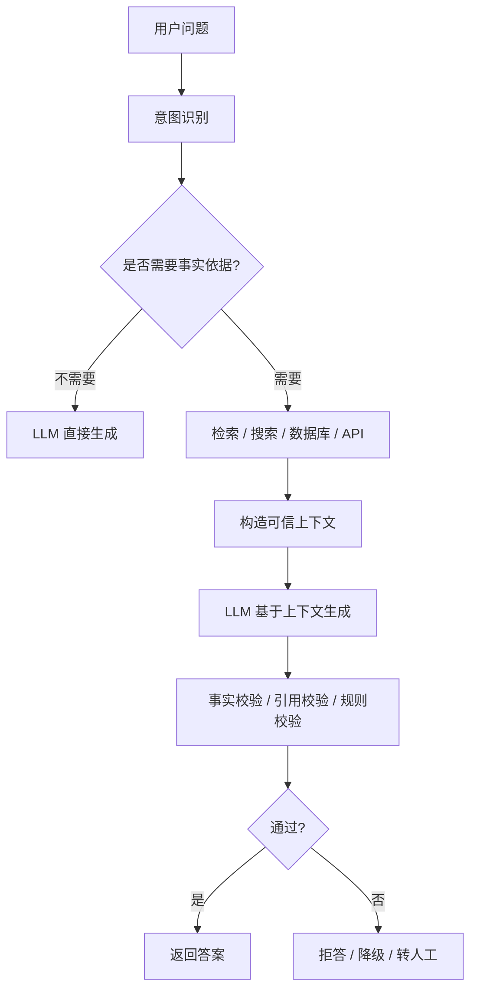
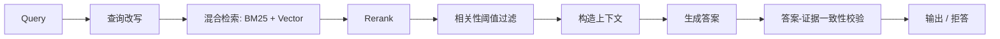
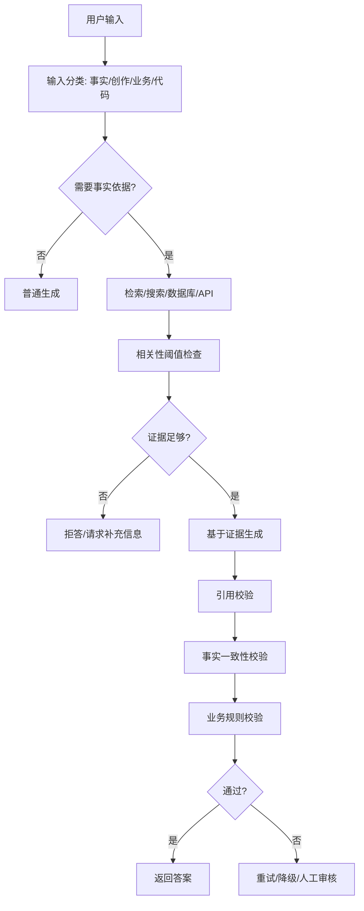

## 结论

**大模型幻觉不能被彻底消灭，只能被工程化压低、隔离和兜底。**

最有效的思路不是“让模型更聪明”，而是把系统从：

> **LLM 自己凭记忆回答**

改造成：

> **LLM 基于可信上下文回答 + 可引用 + 可拒答 + 可校验 + 可评估 + 人工兜底**

Google 对 grounding 的定义也基本是这个方向：把模型输出连接到可验证的数据源，用 RAG、搜索、地图等外部信息源降低模型“编造”的概率。([Google Cloud Documentation](https://docs.cloud.google.com/gemini-enterprise-agent-platform/models/grounding/overview?utm_source=chatgpt.com "Grounding overview | Gemini Enterprise Agent Platform")) 但检索和搜索也不是万能解，OpenAI 相关研究也指出：RAG / Search 能降低幻觉，但不能彻底解决。([arXiv](https://arxiv.org/pdf/2509.04664?utm_source=chatgpt.com "Why Language Models Hallucinate"))

---

# 1. 先搞清楚：幻觉不是一种问题

工程上至少要分 5 类。

|类型|例子|主要治理方式|
|---|---|---|
|**事实幻觉**|编造公司、论文、API、年份|RAG、搜索、引用、事实校验|
|**引用幻觉**|引用一个不存在的 URL / 文献 / 页码|引用约束、source verifier|
|**指令幻觉**|用户没说，模型擅自补需求|严格任务边界、需求确认、JSON schema|
|**代码幻觉**|编造不存在的 API、类、参数|官方文档检索、编译测试、静态检查|
|**业务幻觉**|编造订单状态、库存、用户权限|只允许工具查询业务系统，不允许模型猜|

所以“解决幻觉”不是一个 prompt 能解决的问题，而是一个 **系统可靠性问题**。

---

# 2. 核心原则：不要让 LLM 当事实源

LLM 本质上更像一个：

> **语言推理与生成引擎**

不是：

> **数据库、搜索引擎、事实存储系统、权限系统**

所以正确架构是：



一句话：

> **凡是事实性、时效性、业务状态类问题，都不要让模型凭记忆回答。**

---

# 3. 第一层：Prompt 约束，只能降低轻度幻觉

Prompt 有用，但不是根治方案。

可以加这些规则：

```text
你必须只根据提供的上下文回答。
如果上下文中没有答案，明确说“无法从已知资料确认”。
不要编造来源、链接、数字、API 名称、版本号。
涉及事实结论时，必须标注对应来源。
```

但是注意：

> **Prompt 是软约束，不是硬边界。**

模型仍然可能违反。所以 prompt 只能作为第一层，不要把它当安全机制。

---

# 4. 第二层：RAG / Grounding，让回答有依据

RAG 的核心价值不是“让模型知识更多”，而是：

> **把答案绑定到外部可信资料。**

典型做法：

1. 用户提问
    
2. 查询知识库 / 文档 / 数据库 / 搜索引擎
    
3. 召回相关片段
    
4. 把片段塞给模型
    
5. 要求模型只基于片段回答
    
6. 输出引用
    

Google Cloud 对 RAG 的描述也是把传统信息检索和生成模型结合，用外部信息增强生成。([Google Cloud](https://cloud.google.com/use-cases/retrieval-augmented-generation?utm_source=chatgpt.com "What is Retrieval-Augmented Generation (RAG)?")) 研究和实践也普遍认为，RAG 可以显著降低结构化输出、事实问答、垂直领域问答中的幻觉。([arXiv](https://arxiv.org/abs/2404.08189?utm_source=chatgpt.com "Reducing hallucination in structured outputs via Retrieval-Augmented Generation"))

但 RAG 也有自己的幻觉来源：

|RAG 环节|可能的问题|
|---|---|
|文档切分|chunk 太碎，语义断裂|
|向量检索|找到相似但不相关的内容|
|rerank|排序错误，把错误证据放前面|
|上下文压缩|关键条件被压掉|
|生成阶段|模型没有严格依据上下文|
|引用阶段|模型编造引用编号或链接|

所以生产级 RAG 不能只做“向量库 + LLM”。

更合理的是：



---

# 5. 第三层：可拒答机制，比“强行回答”更重要

很多幻觉来自一个坏习惯：

> **模型觉得自己必须回答。**

OpenAI 相关研究指出，很多评测和训练机制会奖励“猜测”，而不是奖励“承认不知道”；这会诱导模型在不确定时也给出看似自信的答案。([Business Insider](https://www.businessinsider.com/why-ai-chatbots-hallucinate-openai-chatgpt-anthropic-claude-2025-9?utm_source=chatgpt.com "Why AI chatbots hallucinate, according to OpenAI researchers"))

所以系统要明确允许模型拒答。

例如：

```text
如果证据不足，输出：
{
  "answerable": false,
  "reason": "当前资料中没有足够证据",
  "missing_info": ["缺少合同第 7 条", "缺少最新价格数据"]
}
```

这比让模型强行编一个答案可靠得多。

---

# 6. 第四层：引用校验，专门治理“假引用”

很多系统会说“答案带引用”，但引用本身也可能是假的。

正确做法是：

## 不要让模型自由生成引用

错误方式：

```text
请你回答，并附上引用链接。
```

模型可能会编链接。

正确方式：

```text
你只能引用系统提供的 source_id。
禁止输出不存在的 source_id。
每个事实结论必须绑定 source_id。
```

例如上下文传给模型时这样组织：

```json
[
  {
    "source_id": "doc_001_chunk_03",
    "title": "用户协议",
    "content": "会员有效期为付款成功后 365 天..."
  },
  {
    "source_id": "doc_002_chunk_08",
    "title": "退款规则",
    "content": "虚拟服务开通后不支持无理由退款..."
  }
]
```

模型输出：

```json
{
  "answer": "会员有效期为付款成功后 365 天。",
  "citations": ["doc_001_chunk_03"]
}
```

然后程序再检查：

```text
citations 中的 source_id 是否真实存在？
答案中的关键事实是否能被对应 chunk 支持？
```

这一步非常关键。否则所谓“引用”只是装饰。

---

# 7. 第五层：结构化输出 + Schema 约束

对于业务系统，不要让模型输出自由文本后再猜。

例如订单客服场景，应该让模型输出结构化决策：

```json
{
  "intent": "refund_policy_question",
  "need_tool_call": true,
  "tool": "query_order_status",
  "order_id": "123456",
  "confidence": 0.82
}
```

再由程序决定是否调用工具。

不要让模型直接说：

> “您的订单已经退款成功。”

除非它真的调用了订单系统，并拿到了状态。

---

# 8. 第六层：工具调用，把事实查询交给真实系统

对于企业应用，最重要的原则是：

> **模型不能创造业务事实，只能解释业务事实。**

例如：

|场景|错误做法|正确做法|
|---|---|---|
|查订单|LLM 根据用户描述猜状态|调订单 API|
|查库存|LLM 根据历史知识回答|调库存系统|
|查价格|LLM 直接报价格|调价格服务|
|查政策|LLM 凭记忆总结|检索最新政策文档|
|查代码 API|LLM 凭训练知识回答|查官方文档 / 本地源码|

对 AI Agent 来说，工具调用不是炫技，而是防幻觉的基础设施。

---

# 9. 第七层：答案后校验，而不是生成完就直接返回

生产系统一般需要一个 verifier。

可以分几类：

## 9.1 规则校验

适合结构化场景：

```text
价格不能为负数
日期不能早于当前日期
引用 source_id 必须存在
金额必须来自工具返回值
```

## 9.2 证据一致性校验

检查答案是否被上下文支持：

```text
判断 answer 中的每个事实陈述，是否能在 evidence 中找到依据。
如果不能，标记为 unsupported。
```

## 9.3 二次模型校验

用另一个模型做 critic：

```text
你是事实校验器。
请逐条检查答案中的事实是否被证据支持。
只能输出 supported / unsupported / insufficient。
```

## 9.4 程序化校验

对于代码生成、SQL 生成、配置生成尤其重要：

```text
代码必须编译
SQL 必须 explain
配置必须 schema validate
API 参数必须存在于官方 OpenAPI spec
```

这比“让模型自己反思一下”可靠得多。

---

# 10. 第八层：Eval，用数据持续压低幻觉率

没有 Eval，幻觉治理就是玄学。

你至少需要一套 golden set：

```text
问题
标准答案
允许引用的文档
错误答案样例
是否允许拒答
关键事实点
```

评测指标可以这样设计：

|指标|含义|
|---|---|
|Answer Correctness|答案是否正确|
|Faithfulness|答案是否忠于检索证据|
|Citation Accuracy|引用是否真实支持结论|
|Abstention Accuracy|不知道时是否拒答|
|Tool Accuracy|工具调用是否正确|
|Hallucination Rate|无依据断言比例|
|Regression Rate|新版本是否比旧版本退化|

Google 也强调 GenAI Evaluation 要从“看感觉”转向基于数据和指标的评估。([Google Cloud](https://cloud.google.com/blog/topics/developers-practitioners/master-generative-ai-evaluation-from-single-prompts-to-complex-agents?utm_source=chatgpt.com "Master Generative AI Evaluation: From Single Prompts ..."))

---

# 11. 一个生产级防幻觉方案

可以按这个分层做：



---

# 12. 不同场景的治理重点

## 12.1 普通知识问答

重点：

- 搜索 / RAG
    
- 引用来源
    
- 不确定时拒答
    
- 多来源交叉验证
    

## 12.2 企业知识库问答

重点：

- 文档版本管理
    
- chunk 质量
    
- hybrid search
    
- rerank
    
- source_id 引用校验
    
- faithfulness eval
    

## 12.3 AI 客服

重点：

- 业务状态必须调 API
    
- 回复模板化
    
- 高风险问题转人工
    
- 不能承诺退款、赔偿、法律责任
    
- 所有关键结论可审计
    

## 12.4 代码生成

重点：

- 查官方文档
    
- 读取本地源码
    
- 编译 / 测试 / lint
    
- 禁止编造不存在的 API
    
- 小步修改
    
- CI 验证
    

## 12.5 Agent 系统

重点：

- 工具权限控制
    
- tool result 不可被模型篡改
    
- 每一步有 observation
    
- 最终答案必须引用工具结果
    
- 失败时停止，不要继续脑补
    

---

# 13. 最容易犯的错误

## 错误 1：只靠 Prompt

```text
请不要幻觉。
```

这基本没用。

## 错误 2：以为 RAG 一接就稳了

RAG 只是降低幻觉，不是消灭幻觉。检索错了，模型照样会一本正经地答错。

## 错误 3：让模型自己生成引用

引用必须来自系统提供的 source_id，不能让模型自由编。

## 错误 4：没有拒答

没有拒答机制的系统，最后一定会胡说。

## 错误 5：没有 Eval

没有测试集，你根本不知道幻觉率是 5%、20% 还是 50%。

---

# 14. 最简实践清单

真正要落地，可以按这个顺序做：

1. **分类问题**：哪些问题允许模型自由回答，哪些必须查证据。
    
2. **接入可信源**：知识库、数据库、搜索、业务 API。
    
3. **强制引用**：答案必须绑定 source_id。
    
4. **允许拒答**：证据不足时不要回答。
    
5. **结构化输出**：关键决策用 JSON schema。
    
6. **工具调用**：业务事实必须来自真实系统。
    
7. **后置校验**：检查引用、事实、规则、格式。
    
8. **建立 Eval**：用测试集持续评估幻觉率。
    
9. **高风险兜底**：法律、医疗、金融、赔付、权限操作转人工。
    
10. **日志审计**：记录问题、检索结果、模型答案、引用、校验结果。
    

---

## 一句话总结

**解决幻觉的本质，不是“训练一个永远不会胡说的模型”，而是设计一个不允许模型随便胡说的系统。**

对生产系统来说，LLM 应该被放在一个受控 harness 里：

```text
可信数据源 + 检索 + 工具调用 + 引用约束 + 拒答机制 + 校验器 + Eval + 人工兜底
```

这才是大模型幻觉治理的工程答案。