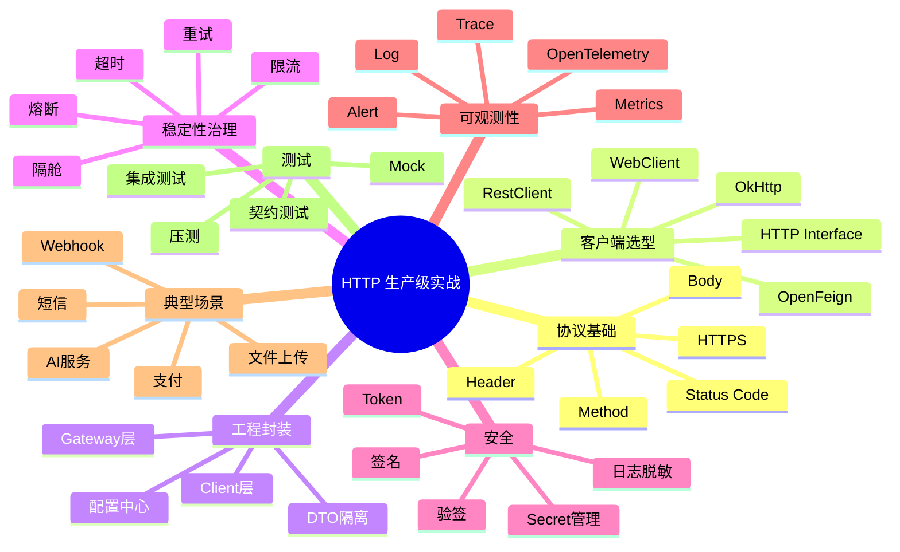

可以直接用下面这个 Prompt。核心是：**明确要求“文章开头总览图”“紧凑 mindmap”“一页内可读”“不要横向过宽/纵向过长”**。

---

# 通用 Prompt 模板

```text
请为下面这篇技术文章生成一张 Mermaid 知识地图，作为文章开头的总览图。

要求：
1. 使用 Mermaid mindmap 语法。
2. 图的目标是帮助读者在阅读正文前快速把握全文结构。
3. 图必须紧凑、清晰、适合一页展示，避免过宽、过长。
4. 不要画复杂流程图、时序图、架构大图，也不要横向展开太多节点。
5. 根节点用文章主题名称。
6. 一级节点控制在 5~8 个以内。
7. 每个一级节点下面只保留最关键的 3~6 个关键词。
8. 节点文字要短，不要写完整句子。
9. 保留技术层次感：场景、核心概念、代码实践、生产治理、常见坑、面试表达/总结。
10. 输出必须是合法 Mermaid 代码，不要额外解释。

文章内容如下：

【粘贴文章全文】
```

---

# 更适合你技术文章风格的 Prompt

```text
你是一名资深 Java 后端架构师和技术课程设计者。

请基于下面这篇文章，生成一张适合放在文章开头的 Mermaid “最终知识地图”。

目标：
让读者在正式阅读正文前，先用一张图把握全文知识结构。

画图要求：
- 使用 Mermaid mindmap。
- 结构要紧凑、漂亮、可读。
- 不要画成过宽的横向图，也不要画成很长的纵向流水账。
- 一级分支控制在 6 个左右。
- 每个分支只提炼关键词，不要写长句。
- 优先体现工程实践结构，而不是百科式概念堆砌。
- 图中要覆盖：问题场景、核心原理、代码实践、生产级治理、常见坑、面试表达/总结。
- 适合 Java 后端技术文章。
- Mermaid 代码必须可直接复制到 Typora / Markdown / Mermaid Live Editor 中渲染。
- 不要输出解释，只输出 Mermaid 代码块。

文章如下：

【粘贴文章全文】
```

---

# 如果文章很长，可以用这个压缩版 Prompt

```text
请阅读下面文章，提炼一张放在文章开头的 Mermaid mindmap 总览图。

要求：
- 一页内可读。
- 紧凑，不要过宽，不要过长。
- 根节点是文章主题。
- 一级节点 5~7 个。
- 每个一级节点 3~5 个短关键词。
- 只输出 Mermaid 代码。
- 不要生成 flowchart、sequenceDiagram、classDiagram。
- 不要解释原文内容。

文章：

【粘贴文章】
```

---

# 针对“HTTP 框架实战”这类文章的示例 Prompt

```text
请为《HTTP 框架使用和场景实战：从能调接口到生产级 HTTP 集成体系》生成一张 Mermaid mindmap 知识地图，放在文章开头作为总览图。

要求：
1. 根节点：HTTP 生产级实战。
2. 一级分支控制在 6~8 个。
3. 覆盖这些方向：
   - 协议基础
   - 客户端选型
   - 工程封装
   - 稳定性治理
   - 安全
   - 可观测性
   - 典型场景
   - 测试
4. 每个分支下面只放关键词，不要写长句。
5. 图要紧凑，适合一页展示。
6. 不要画 flowchart，不要画时序图，不要画复杂架构图。
7. 只输出 Mermaid 代码块。
```

生成效果应类似：



---

# 关键控制词

以后你让 AI 画这种图时，最好明确加上这些词：

```text
紧凑 mindmap
文章开头总览图
一页内可读
不要过宽
不要过长
一级节点 5~8 个
每个节点只写关键词
不要复杂 flowchart
不要时序图
不要解释，只输出 Mermaid
```

---

# 最推荐你保存的最终版 Prompt

```text
你是一名资深 Java 后端架构师和技术课程设计者。

请基于下面这篇技术文章，生成一张适合放在文章开头的 Mermaid “最终知识地图”。

目标：
读者在阅读正文前，通过这张图快速把握全文知识结构。

要求：
1. 使用 Mermaid mindmap 语法。
2. 根节点使用文章主题名称。
3. 一级节点控制在 5~8 个。
4. 每个一级节点下面保留 3~6 个关键短词。
5. 图要紧凑、清晰、漂亮，适合一页展示。
6. 避免过宽、过长、横向展开过多。
7. 不要使用 flowchart、sequenceDiagram、classDiagram。
8. 不要写长句，不要堆砌解释。
9. 优先体现工程实践结构：问题场景、核心概念、代码实践、生产治理、常见坑、面试表达/总结。
10. Mermaid 代码必须合法，可直接复制渲染。
11. 只输出 Mermaid 代码块，不要额外解释。

文章内容如下：

【粘贴文章全文】
```

这个 Prompt 基本可以作为你后续所有技术文章的“开篇知识地图生成器”。