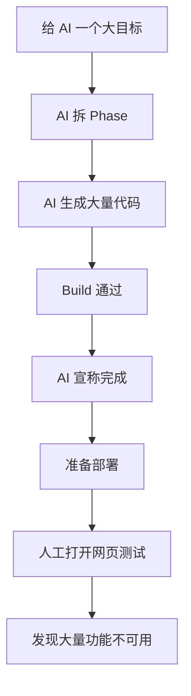
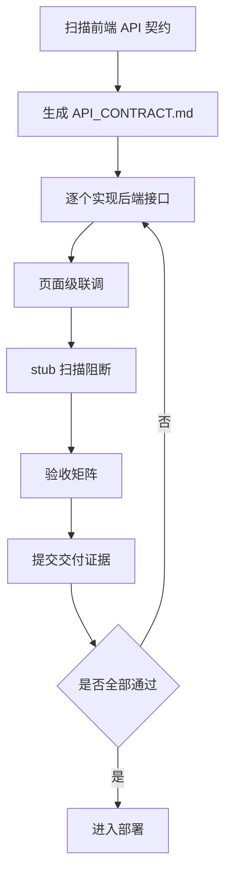

---
tags:
  - ai幻觉
  - ai编程
  - 软件工程
---

最近我在用 AI Coding 工具写一个前后端分离的项目。

计划听起来非常清楚：

> 前端已经完成，后端用 Java 重新实现。  
> 前端页面、交互方式、接口调用逻辑都有现成参考，后端只需要按照前端契约补齐 API。

这听起来应该是一个很适合 AI Coding 的任务。

不是从 0 到 1 设计一个系统，不需要重新发明 UI，也不需要重新构思交互。理论上，只要把已有前端跑起来，然后根据前端调用的接口，用 Java 后端逐个实现即可。

但结果并不理想。

Codex 告诉我：项目已经按照 Phase 1 到 Phase 6 分阶段完成，现在可以进入部署上线阶段。

我打开网页测试，发现大量功能根本不可用。

再让 Claude Code 接手检查后，发现问题更加直接：

- 后端很多地方只是 stub；
    
- 部分代码停留在 stop / TODO / 占位实现；
    
- 前端调用的很多 API，后端根本没有实现；
    
- 有些 Controller 只是壳，Service 没有真实业务逻辑；
    
- 页面虽然能打开，但核心业务链路走不通。
    

这不是第一次。

之前在另一个博客项目里，我也遇到过类似问题：前端直接复用，按api实现后端即可，AI 也制定了完整阶段计划，也告诉我已经分阶段完成，最后一测试，还是发现很多功能没有真正做完。

这次事故让我意识到一个非常关键的问题：

> **AI Coding 的难点，已经不只是“让 AI 写代码”，而是“如何判断 AI 写出来的东西真的完成了”。**

---

## 一、问题不是 AI 不会写代码，而是它误判了“完成”

很多人第一次用 AI 写项目时，最关心的问题是：

> AI 会不会写代码？

但真正用 AI 做稍微完整一点的项目后，会发现一个更大的问题：

> AI 不一定知道什么叫“真正完成”。

它会生成代码。

它会建目录。

它会写 Controller。

它会写 Service。

它会写 DTO。

它会补配置。

它会写 README。

它会拆 Phase。

它会告诉你 Phase 1 完成、Phase 2 完成、Phase 3 完成。

最后，它甚至会告诉你：

> 现在可以进入部署上线阶段。

但问题是：

**代码生成完成，不等于产品交付完成。**

在 AI 看来，项目里有了文件、有了类、有了方法、有了接口、有了构建结果，就很容易被判断为“完成”。

但在真实工程里，一个功能是否完成，不是看代码有没有生成，而是看用户路径能不能走通。

比如博客项目里的“文章发布”功能，真正完成应该意味着：

1. 后台可以登录；
    
2. 可以进入文章管理页面；
    
3. 可以新增文章；
    
4. 可以填写标题、摘要、正文、分类、标签；
    
5. 可以上传封面图；
    
6. 点击发布后，后端真实写入数据库；
    
7. 文章列表可以查到这篇文章；
    
8. 前台首页可以展示这篇文章；
    
9. 点击后可以进入文章详情；
    
10. 刷新页面后数据仍然存在；
    
11. 没有 mock，没有 stub，没有 TODO；
    
12. API 返回结构和前端完全匹配。
    

这才叫完成。

如果只是 Controller 写了一个 `createArticle()`，Service 里暂时 `return success()`，甚至数据库都没落，那不叫完成。

那叫“看起来像完成”。

---

## 二、AI 认为的完成，和工程交付的完成，不是一回事

这次事故里最核心的错位，是 AI 的完成标准和真实软件交付的完成标准不一致。

可以简单对比一下：

|AI 容易误判的完成|真正的工程完成|
|---|---|
|文件创建完成|功能真实可用|
|目录结构完整|业务链路闭环|
|Controller 方法存在|API 能被前端真实调用|
|Service 类存在|业务逻辑真实执行|
|返回了 success|数据真实落库|
|前端能启动|页面能完成真实操作|
|build 通过|端到端验收通过|
|Phase 文档勾完|页面验收矩阵通过|
|没有编译错误|没有未实现功能|

这张表背后其实是一个更深的问题：

> AI 的输出天然偏向“生成物”，而真实软件交付关注的是“行为结果”。

所谓生成物，就是：

- 文件；
    
- 代码；
    
- 类；
    
- 方法；
    
- 配置；
    
- 文档；
    
- 计划；
    
- 阶段总结。
    

所谓行为结果，就是：

- 用户能不能登录；
    
- 文章能不能发布；
    
- 图片能不能上传；
    
- 页面能不能展示真实数据；
    
- 接口能不能被前端调用；
    
- 数据能不能正确落库；
    
- 出错时有没有合理提示；
    
- 刷新后状态是否正确。
    

AI 很容易把前者当成后者。

它完成了“代码形态”，但没有完成“业务行为”。

这就是很多 AI Coding 项目看起来进展很快，最后一打开网页却发现一堆功能不能用的根本原因。

---

## 三、为什么“复用前端，后端重写”也会翻车？

一开始我也有一个误判：

> 前端源码都已经复用了，后端只需要照着写 API，这应该不难吧？

单个 API 当然不难。

真正困难的是，AI 必须先从前端源码里逆向出完整的 API 契约。

所谓 API 契约，不只是接口路径这么简单。

它至少包括：

- 前端到底调用了哪些接口；
    
- 每个接口的 HTTP method 是什么；
    
- path 是什么；
    
- query 参数有哪些；
    
- request body 结构是什么；
    
- response schema 是什么；
    
- 分页字段是 `pageNum/pageSize`，还是 `page/size`；
    
- 返回列表字段是 `records`，还是 `items`，还是 `list`；
    
- token 放在 header 里，还是 cookie 里；
    
- 上传接口返回 URL，还是对象；
    
- 管理后台和前台接口是否分开；
    
- 错误码和 message 怎么处理；
    
- 哪些页面依赖哪些 API。
    

如果没有先做这一步，AI 写后端时就很容易“凭感觉实现”。

于是就会出现这种情况：

```text
前端调用：GET /api/article/list
后端实现：GET /api/posts
```

或者：

```text
前端传参：pageNum / pageSize
后端接收：page / size
```

或者：

```text
前端期望返回：data.records / data.total
后端实际返回：data.items / data.count
```

再或者：

```text
前端调用：POST /api/admin/upload
后端根本没有这个 Controller
```

这些问题单独看都不复杂。

但大量接口叠加之后，项目就会变成：

> 前端看起来在，后端看起来也在，但两者不是一个系统。

这就是复用前端项目时最容易出现的坑。

你以为任务是：

> 把 Java 后端写出来。

但真正的任务是：

> 扫描前端契约，严格按照契约重建后端，并逐个页面完成联调验收。

如果 AI 跳过“契约扫描”这一步，后面的开发都会偏。

---

## 四、Phase 完成，不代表产品完成

这次还有一个很典型的现象：

AI 很喜欢拆 Phase。

比如：

- Phase 1：项目结构初始化；
    
- Phase 2：数据库模型设计；
    
- Phase 3：核心接口实现；
    
- Phase 4：后台管理功能；
    
- Phase 5：前端适配；
    
- Phase 6：部署准备。
    

这看起来很专业，也很有工程感。

问题是：

> Phase 是计划单位，不是验收单位。

一个 Phase 写完，并不代表功能完成。

如果 Phase 3 叫“核心接口实现”，但没有列出：

- 具体实现了哪些接口；
    
- 哪些接口和前端完全匹配；
    
- 哪些接口只是 stub；
    
- 哪些接口能真实落库；
    
- 哪些页面已经调用通过；
    
- 哪些接口仍然缺失。
    

那么“Phase 3 完成”这句话没有太大意义。

真实项目里，更可靠的交付单位不是 Phase，而是功能闭环。

比如：

- 后台登录闭环；
    
- 文章发布闭环；
    
- 首页文章展示闭环；
    
- 文章详情闭环；
    
- 分类筛选闭环；
    
- 标签筛选闭环；
    
- 搜索闭环；
    
- 图片上传闭环；
    
- 评论审核闭环；
    
- 站点配置闭环。
    

每个闭环都必须能被验证。

不能只说：

> 后台文章模块已完成。

而应该说：

```text
后台文章模块验收结果：

1. /admin/article/list 页面可打开；
2. GET /api/admin/articles 返回真实分页数据；
3. POST /api/admin/articles 可新增文章并写入数据库；
4. PUT /api/admin/articles/{id} 可更新文章；
5. DELETE /api/admin/articles/{id} 可删除文章；
6. 新增文章后，前台首页可见；
7. 点击文章可进入详情页；
8. curl 测试通过；
9. 浏览器 Network 请求返回 200；
10. 相关代码路径无 TODO / stub / mock。
```

这才是交付。

---

## 五、Build 通过，不等于可以上线

这次事故里还有一个很常见的误区：

> 项目能 build，就可以部署测试了。

这是不对的。

`npm run build` 通过，只能说明前端没有明显编译错误。

`mvn test` 通过，也只能说明已有测试没有失败。

`docker compose config` 通过，只能说明配置语法大体没问题。

这些都不能证明：

- 页面功能可用；
    
- API 可用；
    
- 数据库写入正确；
    
- 登录鉴权正确；
    
- 前后端接口匹配；
    
- 后台 CRUD 可用；
    
- 上传可用；
    
- 搜索可用；
    
- 文章发布后前台可见。
    

用一句话说：

> **Build success is not delivery success.**

代码能编译，不代表产品能交付。

尤其是 AI 写代码时，build 通过的迷惑性更强。

因为 AI 很擅长把代码补到“能编译”的状态，但它不一定会主动把业务补到“能使用”的状态。

一个项目能启动，和一个项目能上线，中间差了很多层验证。

---

## 六、这次事故的 5 个根因

复盘下来，这次问题不是某一个接口没写，而是一整套 AI Coding 工作流缺少约束。

我把根因总结为 5 个。

---

### 根因一：没有以前端 API 契约为中心

既然前端要复用，那么后端开发的第一步不应该是设计 Controller，也不应该是先建表。

第一步应该是：

> 扫描前端源码中所有 API 调用，生成 API 契约清单。

包括：

- 页面路径；
    
- 调用接口；
    
- 请求方法；
    
- 请求参数；
    
- 返回结构；
    
- 调用时机；
    
- 是否需要登录；
    
- 是否需要上传；
    
- 是否依赖分页；
    
- 是否依赖字典/配置数据。
    

只有先有这个清单，Java 后端才知道自己到底要实现什么。

如果没有这一步，后端很容易写成“另一个系统”。

---

### 根因二：没有页面级验收矩阵

AI 按 Phase 汇报进度，但没有按页面验收功能。

这会导致一个问题：

> 你以为项目整体完成了，但实际上没有任何一个页面被完整验证过。

博客项目至少应该有一张这样的验收矩阵：

|页面|依赖 API|当前状态|阻塞问题|
|---|---|---|---|
|首页|文章列表、推荐文章、站点配置|未通过|文章列表接口缺失|
|文章详情|文章详情、相关文章、浏览量|部分通过|浏览量更新未实现|
|分类页|分类列表、分类文章|未通过|后端无分类文章接口|
|标签页|标签列表、标签文章|未通过|返回结构不匹配|
|搜索页|搜索接口|未通过|前端调用接口不存在|
|后台登录|登录、用户信息|部分通过|token 刷新未实现|
|文章管理|文章 CRUD、分类、标签、上传|未通过|上传接口缺失|
|站点配置|配置查询、配置更新|未通过|Service 是 stub|

没有这种矩阵，AI 就会倾向于“整体上差不多”。

但软件交付最怕的就是“差不多”。

---

### 根因三：没有 stub 阻断机制

这次 Claude Code 接手后发现，后端不少地方存在 stop、stub、TODO 或占位逻辑。

这其实是很严重的问题。

在 AI Coding 项目里，以下内容都应该被视为 P0 阻塞：

```text
TODO
FIXME
mock
stub
return null
return empty
not implemented
UnsupportedOperationException
stop
fake data
temporary implementation
hardcoded response
```

因为这些东西一旦进入主流程，就会制造一种假象：

> 接口存在，但功能没有实现。

这比接口完全不存在还危险。

接口不存在，前端请求会直接报错，问题比较明显。

但 stub 接口可能返回 200，前端甚至不一定立刻报错。你会以为它工作了，实际它没有真实业务逻辑，也没有数据持久化。

所以以后应该建立一条规则：

> 任何核心链路中存在 stub，占位实现未清理之前，不允许宣布阶段完成，更不允许进入部署。

---

### 根因四：AI 缺少交付责任边界

真实工程师说“可以上线”，背后是有责任的。

他要考虑：

- 出问题谁回滚；
    
- 用户是否受影响；
    
- 数据是否会错；
    
- 功能是否完整；
    
- 日志是否可查；
    
- 异常是否处理；
    
- 运维是否能接；
    
- 线上事故谁负责。
    

但 AI 不会天然承担这些后果。

所以它说“可以上线”，本质上只是一个基于当前上下文的语言判断，而不是工程责任判断。

这就要求我们不能直接相信 AI 的上线判断。

AI 可以给建议，但最终必须通过客观证据判断：

- 页面验收是否通过；
    
- API 测试是否通过；
    
- 数据库验证是否通过；
    
- stub 是否清零；
    
- P0/P1 是否清零；
    
- 部署文档是否完整；
    
- 回滚方案是否存在。
    

没有证据，就不能上线。

---

### 根因五：我把“让 AI 开发”理解得太宽泛了

这次复盘后，我也意识到自己的问题。

我之前更多是在说：

> 你来开发这个项目，制定完整计划，分阶段完成。

这个目标本身没有错。

但它对 AI 来说仍然太宽泛。

它缺少几个强约束：

- 必须先扫描前端 API；
    
- 必须生成 API 契约；
    
- 必须逐个页面验收；
    
- 必须禁止 stub；
    
- 必须提交测试证据；
    
- 必须明确哪些功能未完成；
    
- 不允许用 build 通过代替功能完成；
    
- 不允许在 P0 未清零时建议部署。
    

也就是说，我让 AI 做了“开发者”，但没有把它纳入“工程交付流程”。

这才是核心问题。

---

## 七、从 Prompt-driven 到 Evidence-driven

这次事故之后，我对 AI Coding 的理解发生了一个变化。

以前我更关注 prompt：

- 怎么描述需求；
    
- 怎么拆分任务；
    
- 怎么让 AI 理解技术栈；
    
- 怎么让 AI 写更好的代码；
    
- 怎么让 AI 制定开发计划。
    

这些当然重要。

但现在我觉得，更关键的是：

> **从 Prompt-driven AI Coding，升级到 Evidence-driven AI Coding。**

也就是：

> 不再只看 AI 说它做了什么，而是要求 AI 提供完成证据。

对比如下：

|旧模式：Prompt-driven|新模式：Evidence-driven|
|---|---|
|让 AI 按阶段开发|让 AI 按验收项交付|
|关注代码是否生成|关注功能是否闭环|
|相信 AI 汇报|要求 AI 提交证据|
|build 通过就继续|页面/API/数据库验证后再继续|
|后期人工发现问题|开发过程中持续阻断|
|Phase 驱动|验收矩阵驱动|
|AI 自己判断完成|用客观证据判断完成|

这对我来说是一个很重要的认知变化。

AI Coding 不是把需求丢给 AI，然后等它生成代码。

更合理的方式是：

> 把 AI 纳入一个可验证、可审计、可追踪的软件交付流水线。

---

## 八、以后我的 AI Coding SOP 会这样设计

为了避免再次出现类似事故，后续我会把 AI Coding 工作流调整成下面这套 SOP。

---

### 第一步：前端契约扫描

如果项目是“复用前端，重写后端”，第一步永远不是写后端代码。

第一步是扫描前端。

要求 AI 输出：

```text
API_CONTRACT.md
```

内容包括：

- 所有 API 调用；
    
- method；
    
- path；
    
- query 参数；
    
- request body；
    
- response schema；
    
- 调用页面；
    
- 是否需要登录；
    
- 是否需要上传；
    
- 是否分页；
    
- 当前是否已有后端实现。
    

同时要生成：

```text
PAGE_API_MAPPING.md
```

也就是：

> 页面 → API → 数据模型 → 验收方式

没有这两个文件，不进入后端开发。

---

### 第二步：后端按契约实现，而不是自由设计

Java 后端实现时，不能让 AI 自己“设计一套看起来合理的 API”。

必须严格对齐前端契约。

如果确实需要调整接口，也必须同步改前端，并记录原因。

后端每个接口都要明确：

- Controller；
    
- Service；
    
- Repository；
    
- DTO；
    
- 数据表；
    
- 权限要求；
    
- 返回格式；
    
- 异常处理。
    

尤其是响应格式，必须和前端统一。

否则前后端都会“各自正确”，但系统不可用。

---

### 第三步：stub 阻断

每一轮开发结束，必须扫描占位实现。

扫描关键词包括：

```text
TODO
FIXME
mock
stub
return null
return Collections.emptyList()
UnsupportedOperationException
not implemented
stop
fake
temporary
```

并生成：

```text
STUB_REPORT.md
```

规则很简单：

> 核心链路存在 stub，本轮不算完成。

这一步必须硬。

因为 AI 最容易用占位代码把项目“糊过去”。

---

### 第四步：页面级验收矩阵

项目不能只按模块验收，也不能只按 Phase 验收。

必须按页面验收。

比如博客项目至少要验收：

- 首页；
    
- 文章列表；
    
- 文章详情；
    
- 分类页；
    
- 标签页；
    
- 归档页；
    
- 搜索页；
    
- 登录页；
    
- 后台首页；
    
- 后台文章管理；
    
- 后台分类管理；
    
- 后台标签管理；
    
- 后台评论管理；
    
- 后台友链管理；
    
- 后台项目管理；
    
- 后台站点配置；
    
- 文件/图片上传。
    

输出：

```text
PAGE_ACCEPTANCE_MATRIX.md
```

每个页面都要标记：

- 可用；
    
- 部分可用；
    
- 不可用；
    
- 阻塞原因；
    
- 依赖 API；
    
- 修复建议；
    
- 验收证据。
    

---

### 第五步：端到端证据

AI 每完成一个核心功能，必须给出证据，而不是只给总结。

证据可以包括：

- curl 命令；
    
- API 返回结果；
    
- 数据库查询结果；
    
- 浏览器 Network 请求；
    
- 页面操作路径；
    
- 测试用例；
    
- 截图；
    
- 日志片段。
    

最终形成：

```text
E2E_TEST_REPORT.md
```

如果没有证据，就不算完成。

---

### 第六步：部署就绪报告

部署之前，必须生成：

```text
DEPLOYMENT_READINESS.md
```

里面必须明确写：

```text
Current status: READY / NOT READY
```

并列出：

- P0 是否清零；
    
- P1 是否清零；
    
- 所有页面验收结果；
    
- 所有核心 API 状态；
    
- stub 是否清零；
    
- build 是否通过；
    
- 数据库迁移是否完成；
    
- 环境变量是否完整；
    
- 部署步骤是否可执行；
    
- 回滚方案是否存在。
    

如果状态是 `NOT READY`，AI 不允许建议部署。

---

## 九、错误工作流 vs 正确工作流

这次事故里的错误工作流大概是这样的：



问题在于，整个过程里缺少“验收证据”。

更合理的工作流应该是：



这两套流程的差异，不在于 AI 工具是不是更强，而在于我们有没有把 AI 的输出纳入工程化约束。

---

## 十、AI Coding 对后端开发者提出了新的要求

这次事故也让我重新理解了后端开发者在 AI 时代的价值。

以前我们会觉得：

> AI 会写代码后，开发者是不是只要会提需求就行？

现在看并不是。

AI 越能写代码，越需要人来定义：

- 什么叫完成；
    
- 什么叫可上线；
    
- 什么叫接口契约；
    
- 什么叫核心链路；
    
- 什么叫验收证据；
    
- 什么叫技术债；
    
- 什么叫阻塞问题；
    
- 什么叫生产级。
    

AI 可以极大提升代码生成效率，但它不会天然保证交付质量。

所以工程师的价值不是消失了，而是从“亲手写每一行代码”，逐渐转向：

- 设计系统边界；
    
- 定义接口契约；
    
- 制定验收标准；
    
- 识别工程风险；
    
- 管理 AI 输出；
    
- 建立自动化质量门禁；
    
- 对上线结果负责。
    

换句话说：

> AI Coding 不是降低工程要求，而是把工程要求前置、显式化、制度化。

---

## 十一、这次事故给我的最大提醒

这次博客项目的问题，不是“Java 后端 API 很难”。

也不是“复用前端没有意义”。

真正的问题是：

> 我们不能让 AI 自己定义“完成”。

AI 很容易按下面的模式推进：

```text
搭架子
→ 写文档
→ 生成代码
→ build 通过
→ 宣称完成
→ 建议部署
```

但真正的软件交付应该是：

```text
扫描契约
→ 实现接口
→ 联调页面
→ 清理 stub
→ 验收矩阵
→ 提交证据
→ 再判断是否部署
```

这两者之间，差的不是一点代码，而是一整套工程交付机制。

---

## 十二、以后我会把这句话写进项目规则里

后续我会在项目的 `AGENTS.md`、`CLAUDE.md` 或类似文件里，明确写入这样的规则：

```text
Build success is not delivery success.

A feature is complete only when:
1. The frontend page calls the real backend API.
2. The backend API contains real business logic.
3. Data is persisted to the database when required.
4. The response schema matches the frontend contract.
5. The feature is manually or automatically verified.
6. No TODO, mock, stub, placeholder, return null, or not implemented logic remains.
7. The acceptance result is recorded in a report.

Do not claim deployment readiness unless all P0 user-facing features pass the acceptance matrix.
```

翻译成中文就是：

> 编译成功不是交付成功。  
> 文件生成不是功能完成。  
> Phase 完成不是产品完成。  
> 没有验收证据，就不能说可以上线。

---

## 十三、结语：AI Coding 的核心能力，正在从写代码转向管理交付

这次事故让我更确定一件事：

未来的软件开发，不会只是“谁更会让 AI 写代码”。

更重要的是：

> 谁更会把 AI 写出来的代码，纳入一套真实可靠的软件交付流程。

真正有价值的能力包括：

- 能把模糊目标拆成清晰契约；
    
- 能把前端页面拆成 API 依赖；
    
- 能把后端接口拆成可验收任务；
    
- 能识别 AI 生成代码里的假完成；
    
- 能用测试和报告约束 AI；
    
- 能让 AI 不只是生成代码，而是提交证据；
    
- 能把一次项目经验沉淀成可复用的工程流程。
    

AI Coding 的风险不是它不会写代码。

恰恰相反，它太会写代码了。

它会快速生成大量看起来像项目的东西，让你产生一种“进展很快”的错觉。

但真实的软件工程，最终不看生成了多少文件，不看 Phase 写得多漂亮，也不看总结里用了多少专业词。

它只看一件事：

> 用户路径能不能走通，业务数据能不能闭环，系统能不能被验证。

这次博客项目翻车，对我来说不是坏事。

它让我从“让 AI 写代码”的阶段，进入到“管理 AI 交付”的阶段。

这也是我接下来做个人网站、博客系统、项目展示平台时，真正要沉淀的能力：

> 不是单次把项目做出来，而是建立一套可重复、可验证、可交付的 AI Coding 工程流水线。