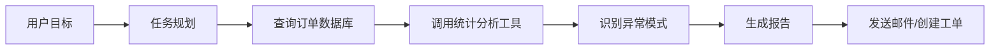

## 先说结论

**AI Agent / AI 应用岗位，本质不是“训练大模型的人”，而是“把大模型接进真实业务系统，并让它稳定产生价值的人”。**

更像是：

> **后端工程师 + LLM 能力 + 产品理解 + 工程化落地 + 评测监控**

对你这种 **Java 后端 + 想做 AI 应用/产品** 的路线来说，这是很匹配的方向。

---

# 1. AI 应用岗位具体干什么？

可以理解成：**用大模型做一个真正可用的软件功能。**

常见交付物包括：

|方向|具体做什么|例子|
|---|---|---|
|AI 对话助手|接入 LLM，做业务问答、流程引导|企业知识库助手、客服机器人|
|RAG 知识库|让模型基于公司文档/数据库回答|“根据合同库回答法务问题”|
|文档智能|解析、抽取、总结、比对文档|简历解析、合同审查、发票识别|
|AI 工作流|把多个 AI 步骤串起来|上传文件 → 提取信息 → 审核 → 入库|
|AI Copilot|嵌入现有系统，辅助用户操作|CRM 销售助手、运营数据分析助手|
|AI 自动化|调用工具完成任务|查数据库、发邮件、创建工单、生成报表|

现在很多 AI Engineer JD 都强调：**构建、部署、维护生产级 AI 系统，而不是只写 Demo 或 Notebook**；职责通常包括 RAG、LLM 应用、数据管道、部署监控、跨团队协作等。([KORE1](https://www.kore1.com/ai-engineer-job-description/?utm_source=chatgpt.com "AI Engineer Job Description Template 2026"))

---

# 2. AI Agent 岗位具体干什么？

AI Agent 比普通 AI 应用更进一步。

普通 AI 应用偏：

```text
用户问一句 → 模型答一句
```

AI Agent 偏：

```text
用户给目标 → Agent 拆任务 → 调工具 → 观察结果 → 继续决策 → 完成任务
```

比如用户说：

> 帮我分析最近 30 天订单异常，找出主要原因，并生成一份报告发给运营负责人。

一个 Agent 系统可能会：



所以 AI Agent 岗位通常做这些：

|模块|你要负责什么|
|---|---|
|Planning|任务拆解、步骤规划、状态流转|
|Tool Calling|让模型安全调用 API、数据库、搜索、代码执行器|
|Memory / State|保存上下文、任务进度、用户偏好|
|Workflow|多步骤流程编排，失败重试，人工确认|
|Guardrails|权限、安全、输出约束、防止乱调用工具|
|Evaluation|测试 Agent 是否真的完成任务，而不是“看起来会说”|
|Observability|日志、链路追踪、token 成本、成功率、错误原因|

一些岗位描述会明确要求构建 **LLM-based agents/services**，让它们安全调用企业工具，例如 ServiceNow、Salesforce、Oracle 等，同时负责 RAG、prompt/agent logic、evaluation hooks、CI/CD、observability 等工程环节。([Stanford University](https://careersearch.stanford.edu/jobs/ai-engineer-30788?utm_source=chatgpt.com "AI Engineer - Stanford University Careers"))

---

# 3. AI 应用工程师 vs AI Agent 工程师 vs 算法工程师

这几个岗位容易混。

|岗位|核心问题|更像谁|
|---|---|---|
|算法工程师 / ML Engineer|怎么训练/微调/优化模型？|算法、机器学习、深度学习|
|AI 应用工程师|怎么把模型做成业务功能？|后端 + AI 产品工程|
|AI Agent 工程师|怎么让模型调用工具完成复杂任务？|后端 + 工作流 + 系统设计|
|AI 平台工程师|怎么支撑多个 AI 应用稳定运行？|基础架构 / 平台工程|
|AI 产品经理|哪些场景适合 AI，怎么定义体验？|产品 + 业务 + AI 理解|

对你来说，最现实的方向不是一上来搞模型训练，而是：

> **AI 应用工程师 → RAG/工作流 → Agent 工程化 → AI 产品/平台能力**

---

# 4. 这个岗位不是“会调 API”就够了

很多人以为 AI 应用开发就是：

```java
String answer = openAIClient.chat(prompt);
```

这只是最表层。

真实项目里难点在这里：

```text
业务问题能不能拆清楚？
知识库数据脏不脏？
检索结果准不准？
模型回答可不可控？
能不能接入权限系统？
延迟和成本能不能接受？
出错后能不能重试/降级？
上线后怎么评测效果？
怎么知道这次回答为什么错？
```

所以现在市场上更重视的是 **production AI system**：有延迟预算、成本约束、监控、降级、模型可替换、稳定上线能力。([KORE1](https://www.kore1.com/ai-engineer-job-description/?utm_source=chatgpt.com "AI Engineer Job Description Template 2026"))

---

# 5. 你需要学习什么？

## 第一层：LLM 应用基础

先掌握这些：

|能力|要学到什么程度|
|---|---|
|Prompt Engineering|不只是写提示词，而是会结构化输入、约束输出、few-shot、角色/任务/格式拆分|
|Function Calling / Tool Calling|让模型调用后端接口、搜索、数据库、文件工具|
|Structured Output|JSON Schema、输出校验、失败重试|
|Streaming|流式输出、SSE、WebSocket、前后端体验|
|Token / Cost|token 计算、上下文窗口、成本优化|
|Model Selection|知道什么时候用 GPT、Claude、Gemini、DeepSeek、本地模型|

你可以把这层理解成：**从“会问 ChatGPT”升级到“会把 ChatGPT 接进系统”。**

---

## 第二层：RAG 知识库

这是 AI 应用岗位最高频的落地点。

你需要学：

```text
文档加载 → 清洗 → 分块 → embedding → 向量库 → 检索 → rerank → 拼 prompt → 生成答案 → 引用来源 → 评测
```

重点不是“会用向量库”，而是理解这些工程问题：

|问题|实际含义|
|---|---|
|chunk 怎么切？|太大召回不准，太小语义不完整|
|embedding 用哪个？|影响语义检索质量|
|metadata 怎么设计？|权限、时间、部门、文档类型过滤|
|rerank 要不要上？|召回多但排序差时需要|
|怎么防幻觉？|引用来源、拒答策略、答案约束|
|怎么评测？|构造问题集，看召回率、准确率、引用正确率|

当前 AI 应用岗位里，RAG、检索、向量库、私有数据问答是非常常见的职责。([AI Shipping Labs](https://aishippinglabs.com/blog/what-is-an-ai-engineer-based-on-job-descriptions?utm_source=chatgpt.com "What Is an AI Engineer? 2026 Role, Skills and ..."))

---

## 第三层：Agent / Workflow 工程

不要一开始就迷信“全自动 Agent”。

你应该先学 **AI 工作流**，再学 Agent。

### 工作流更像确定性编排

```text
步骤 1：解析用户需求
步骤 2：查询知识库
步骤 3：调用业务接口
步骤 4：生成结构化结果
步骤 5：人工确认
步骤 6：执行操作
```

### Agent 更像半自主决策

```text
目标：帮我完成某件事
模型自己决定下一步调用什么工具
```

你需要掌握：

|能力|说明|
|---|---|
|LangGraph / Dify / Coze / n8n|工作流与 Agent 编排工具|
|State Machine|Agent 状态管理，本质非常像后端流程状态机|
|Tool Registry|工具注册、参数 schema、权限控制|
|Human-in-the-loop|高风险操作前让人确认|
|Retry / Fallback|失败重试、切模型、降级处理|
|Memory|短期上下文、长期记忆、任务历史|
|Multi-agent|多 Agent 协作，但别过早复杂化|

一个重要判断：**大多数业务场景先用 Workflow，不要上来就 Multi-Agent。**

---

## 第四层：AI 工程化

这部分是后端开发者的优势区。

你要学：

|工程能力|AI 场景里的体现|
|---|---|
|API 设计|AI 服务接口、会话接口、任务接口|
|异步任务|长文档处理、批量分析、报告生成|
|消息队列|文档入库、向量化、任务编排|
|缓存|prompt cache、embedding cache、答案缓存|
|权限|用户只能检索自己有权限的文档|
|限流|防止 token 爆炸和模型调用雪崩|
|监控|latency、token、cost、error、命中率|
|日志追踪|每次回答用了哪些 prompt、检索了哪些文档|
|灰度发布|prompt 版本、模型版本、RAG 策略版本|
|CI/CD|AI 应用也要测试、发布、回滚|

这就是为什么后端工程师转 AI 应用很有优势：**AI 应用不是孤立模型，而是一个完整在线系统。**

---

# 6. 技术栈建议：你可以按这个学

## Java 后端主线

你不用放弃 Java。

|领域|推荐|
|---|---|
|Java AI 框架|Spring AI、LangChain4j|
|Web 框架|Spring Boot|
|数据库|MySQL / PostgreSQL|
|向量库|Milvus、Qdrant、pgvector、Elasticsearch vector|
|缓存|Redis|
|消息队列|Kafka / RabbitMQ / RocketMQ|
|可观测性|Prometheus、Grafana、OpenTelemetry|
|部署|Docker、K8S|

## Python 辅助线

Python 也要会，但不一定要变成 Python 后端。

重点学：

|领域|推荐|
|---|---|
|快速实验|Python 脚本、Jupyter|
|LLM 框架|LangChain、LlamaIndex、LangGraph|
|数据处理|pandas、BeautifulSoup、unstructured|
|评测|RAGAS、DeepEval、promptfoo|
|Demo 服务|FastAPI|

我的建议是：

> **Java 负责生产系统，Python 负责 AI 实验、数据处理、评测脚本。**

---

# 7. 你最该做的项目

不要只学概念。直接做 5 个项目。

## 项目 1：企业知识库 RAG

做一个类似：

> 上传 PDF / Markdown / 网页 → 自动入库 → 用户提问 → 返回答案 + 引用来源

要包含：

```text
文档解析
chunk 分块
embedding
向量检索
rerank
引用来源
权限过滤
问答日志
效果评测
```

这是 AI 应用岗位的基本盘。

---

## 项目 2：AI 客服 / 工单助手

用户描述问题后，系统自动：

```text
判断问题类型
检索知识库
生成回复
必要时创建工单
标记优先级
推荐处理人
```

这个项目能体现：

```text
LLM + RAG + 业务系统 + 工作流 + 权限 + 人工确认
```

---

## 项目 3：代码库 AI 助手

针对 Java 项目做：

```text
问：这个接口的调用链是什么？
问：这个类是干什么的？
问：这个 bug 可能在哪？
问：帮我生成单元测试
```

这个方向和你自己的技术成长强相关。

可以结合：

```text
代码解析
AST
Git 仓库索引
RAG
调用链分析
LLM 总结
```

这也和你之前想做的 DevWiki / Dendro 很契合。

---

## 项目 4：AI 工作流平台 Mini 版

不要一开始做很大，做一个简化版：

```text
节点 1：用户输入
节点 2：LLM 处理
节点 3：HTTP API 调用
节点 4：条件判断
节点 5：人工确认
节点 6：输出结果
```

目标是理解：

```text
DAG
状态流转
节点执行
失败重试
日志追踪
变量传递
```

这会让你真正理解 AI Workflow。

---

## 项目 5：Agent 调工具完成任务

例如：

> 给 Agent 一个目标：分析数据库里最近 7 天的订单异常。

Agent 可以调用：

```text
queryDatabase()
generateChart()
summarizeResult()
createReport()
sendEmail()
```

但要加上：

```text
工具白名单
参数校验
危险操作确认
执行日志
失败回滚
```

这个项目才是真正的 Agent 工程。

---

# 8. 学习路线：按这个顺序来

## 阶段 1：AI 应用入门

目标：会做一个 LLM 后端接口。

```text
OpenAI-compatible API
Prompt 模板
流式输出
JSON 输出
Function Calling
Spring Boot 接入
```

产出：

```text
一个 AI Chat API 服务
```

---

## 阶段 2：RAG

目标：会做企业知识库。

```text
文档解析
chunk
embedding
vector database
retrieval
rerank
citation
evaluation
```

产出：

```text
一个可上传文档的知识库问答系统
```

---

## 阶段 3：AI 工作流

目标：会把 AI 和业务流程串起来。

```text
工作流节点
状态机
条件分支
人工确认
异步任务
失败重试
```

产出：

```text
一个 Mini AI Workflow Engine
```

---

## 阶段 4：Agent

目标：会让模型安全调用工具。

```text
Tool Calling
Planner
Executor
Memory
Guardrails
Observability
Human-in-the-loop
```

产出：

```text
一个能查库、分析、生成报告的 Agent
```

---

## 阶段 5：AI 工程化

目标：像生产系统一样维护 AI 应用。

```text
prompt version
model version
RAG evaluation
日志追踪
成本统计
权限隔离
限流降级
灰度发布
```

产出：

```text
一个有监控、有评测、有权限的生产级 AI 应用样板
```

---

# 9. 你不需要优先学什么？

这几个可以先不急：

|暂时不优先|原因|
|---|---|
|从零训练大模型|成本高，岗位少，和 AI 应用开发不是一回事|
|深度学习数学推导|有帮助，但不是 AI 应用岗位第一优先级|
|多 Agent 复杂架构|容易陷入概念炫技，先做单 Agent + Workflow|
|私有化大模型部署|可以后学，先把应用链路跑通|
|复杂微调|大多数业务先用 RAG、prompt、工具调用解决|

不是说这些不重要，而是学习顺序上不要本末倒置。

---

# 10. 对你的定位建议

你现在最适合的路线是：

```text
Java 后端工程师
→ AI 应用工程师
→ RAG / Agent 工程师
→ AI 产品型后端 / AI 平台工程师
```

你的优势：

```text
Spring Boot
DDD / 工程建模
数据库
接口设计
系统集成
业务流程理解
后端工程化
```

你要补的短板：

```text
LLM API
RAG
向量数据库
Prompt / Tool Calling
LangGraph / Spring AI / LangChain4j
AI 评测
AI 应用可观测性
```

一句话概括：

> **不要把自己转成“算法研究员”，而是转成“懂 AI 的后端系统工程师”。**

这个方向更现实，也更容易做出产品。