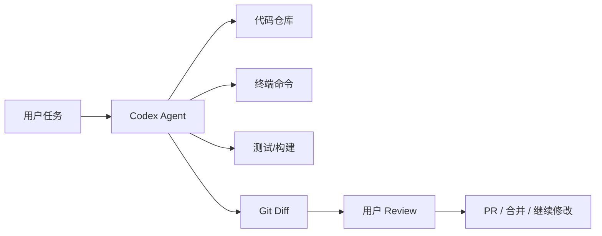
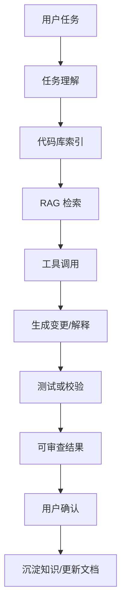

**Codex 可以算是 AI Agent / AI 应用的典范之一**，尤其是对开发者来说，它是目前最值得研究的 **“垂直领域 Agent 产品”**。

但要说得更精确一点：

> **Codex 不是泛用型 Agent 的典范，而是“软件工程 Agent”的典范。**  
> 它代表的是：AI Agent 如何真正嵌入一个专业工作流，并交付可验证的工程结果。

---

# 1. 为什么 Codex 算 AI Agent？

因为它不只是聊天，而是能围绕目标执行一串动作。

OpenAI 官方把 Codex 定义为 **coding agent / software engineering agent**，可以读取、修改、运行代码，帮助构建功能、修复 bug、理解陌生代码；Codex Cloud 还能在云端环境里并行处理任务。([OpenAI开发者](https://developers.openai.com/codex/cli?utm_source=chatgpt.com "Codex CLI"))

普通 ChatGPT 代码问答是：

```text
你问：这个 bug 怎么修？
模型答：建议你改这里。
```

Codex 更像：

```text
你给任务：修复这个 bug
Codex 读取代码
Codex 找相关文件
Codex 修改代码
Codex 运行测试
Codex 生成 diff
Codex 提交 PR / 等你 review
```

这已经具备典型 Agent 特征：

|Agent 能力|Codex 里的体现|
|---|---|
|理解目标|根据自然语言任务理解要做什么|
|使用工具|读文件、改文件、运行命令、跑测试|
|持续执行|不只是回答，而是多步完成任务|
|观察反馈|根据编译结果、测试结果、错误日志继续修改|
|产出结果|diff、代码变更、PR、解释说明|
|人类协作|用户 review、确认、继续迭代|

所以它不是“AI 聊天工具”，而是一个真正嵌入软件开发流程的 **agentic coding system**。

---

# 2. 为什么 Codex 也是 AI 应用的典范？

因为它不是单纯模型能力展示，而是完整产品。

一个成熟 AI 应用通常包含：

```text
模型能力
+ 领域场景
+ 工具系统
+ 权限边界
+ 工作流
+ 可观察结果
+ 人类确认机制
+ 产品交互界面
```

Codex 刚好都有。

OpenAI 的 Codex 产品线包括 CLI、Cloud、IDE 扩展、App 等形态；官方也提到 Codex app 是面向 agentic coding 的 command center，可以通过 worktrees 和 cloud environments 支持多个 agent 并行工作。([OpenAI开发者](https://developers.openai.com/codex?utm_source=chatgpt.com "Codex | OpenAI Developers"))

这说明 Codex 不是一个“模型接口”，而是：



这就是典型 AI 应用工程：**LLM + 工具 + 工作流 + 产品体验 + 安全边界。**

---

# 3. Codex 的典范意义不在“会写代码”，而在“把 Agent 做进工作流”

很多 AI 编程产品都会生成代码，但 Codex 的关键价值是：

> **它围绕真实软件工程工作流设计，而不是围绕聊天窗口设计。**

软件开发天然适合 Agent，因为它有几个特点：

|特点|为什么适合 Agent|
|---|---|
|输入明确|issue、bug、需求、测试失败|
|环境可操作|文件系统、终端、Git、CI|
|结果可验证|编译、测试、diff、review|
|任务可拆解|查代码、改代码、跑测试、修失败|
|人类可审查|PR、diff、commit message|

这点很重要。

很多所谓 AI Agent 场景其实很虚，比如：

```text
帮我管理人生
帮我做商业决策
帮我自动运营公司
```

这些目标太开放，反馈太模糊，验证困难。

但 Codex 处理的是：

```text
修复这个测试
实现这个接口
迁移这个模块
解释这个调用链
补充单元测试
```

这些任务相对可验证，所以更容易做成高质量 Agent 产品。

---

# 4. Codex 是“垂直 Agent”的好样板

你可以把 Agent 分成两类：

## 泛用 Agent

```text
什么都想干
浏览网页
发邮件
做表格
查资料
规划旅行
写代码
操作电脑
```

问题是：边界大、错误多、安全风险高。

## 垂直 Agent

```text
只解决一个专业领域的问题
但把这个领域打穿
```

Codex 属于后者。

它专注在：

```text
软件工程
代码仓库
终端
测试
Git
PR
IDE
开发者工作流
```

所以它更像一个优秀的垂直 Agent 产品样板：

```text
不是“全能助手”
而是“软件工程协作者”
```

这个思路对你做 AI 应用很有启发：

> 不要一上来做“万能 AI Agent”，而是做某个具体领域的垂直 Agent。

例如：

```text
Java 项目理解 Agent
DDD 重构 Agent
MyBatis 插件生成 Agent
企业知识库问答 Agent
订单异常分析 Agent
代码库文档生成 Agent
```

这些都比“万能 Agent 平台”现实得多。

---

# 5. Codex 给 AI 应用开发者的核心启发

## 启发 1：Agent 必须有工具

Codex 不是只靠模型输出文本。

它能：

```text
read file
edit file
run command
run tests
inspect diff
interact with repo
```

对应到普通业务 AI 应用，就是：

```text
查数据库
调接口
搜文档
生成报表
创建工单
发送消息
读取权限
写入业务系统
```

没有工具调用，Agent 就只是聊天机器人。

---

## 启发 2：Agent 必须有环境

Codex 有本地目录、云端沙箱、worktree、repo 环境。OpenAI 介绍 Codex Cloud 时提到，每个任务运行在自己的 cloud sandbox environment，并预加载代码仓库。([OpenAI](https://openai.com/index/introducing-codex/?utm_source=chatgpt.com "Introducing Codex"))

这对业务 Agent 很关键。

例如订单分析 Agent 也应该有自己的运行环境：

```text
用户上下文
数据库只读权限
临时分析结果
可调用工具列表
任务状态
执行日志
权限边界
```

Agent 不是漂在空中的模型，它需要一个受控执行环境。

---

## 启发 3：Agent 的输出要可审查

Codex 的核心输出不是“我觉得你应该这么改”，而是：

```text
代码 diff
测试结果
执行日志
PR
解释说明
```

这非常重要。

优秀 AI 应用的输出也应该可审查：

```text
答案引用了哪些文档？
调用了哪些工具？
查了哪些数据？
生成报告的数据来源是什么？
执行了哪些步骤？
有没有人工确认？
```

所以你以后做 RAG / Agent 时，不能只返回一个自然语言答案。

应该返回：

```json
{
  "answer": "...",
  "sources": ["doc1", "doc2"],
  "tool_calls": ["searchKnowledgeBase", "queryOrderStats"],
  "confidence": "medium",
  "needs_human_review": true
}
```

---

## 启发 4：Agent 要有人类在环

Codex 不是偷偷改完代码直接上线，而是通过 diff、review、PR 让人确认。OpenAI 的 ChatGPT release notes 也提到 Codex app 支持 reviewable diffs，可以编辑、丢弃或转成 pull request。([OpenAI Help Center](https://help.openai.com/en/articles/6825453-chatgpt-release-notes?utm_source=chatgpt.com "ChatGPT — Release Notes"))

这就是典型的 **human-in-the-loop**。

对业务 AI 来说也一样：

|低风险任务|可以自动执行|
|---|---|
|总结文档|可以|
|生成草稿|可以|
|分类工单|可以|

|高风险任务|必须人工确认|
|---|---|
|发邮件|最好确认|
|改数据库|必须确认|
|退款|必须确认|
|删除数据|必须确认|
|合并代码|必须 review|

---

## 启发 5：Agent 产品的关键是“闭环”

Codex 的闭环是：

```text
任务 → 修改 → 测试 → diff → review → 继续修改 → 完成
```

这比单次问答强很多。

你做 AI 应用也要设计闭环。

比如企业知识库助手：

```text
用户提问
→ 检索文档
→ 生成回答
→ 展示引用
→ 用户反馈“有用/没用”
→ 记录 bad case
→ 优化 chunk / prompt / rerank
```

比如工单助手：

```text
用户描述问题
→ 分类
→ 检索方案
→ 生成回复
→ 人工确认
→ 创建工单
→ 跟踪处理结果
```

没有闭环的 AI 应用，长期质量很难提升。

---

# 6. 但 Codex 不是所有 AI Agent 的终极答案

它很强，但不要误解成：

> “Agent 就应该都像 Codex 一样全自动干活。”

Codex 成功有一个重要前提：

**软件工程任务具备较强可验证性。**

代码可以：

```text
编译
跑测试
看 diff
做 review
回滚
用 Git 管理
```

但很多业务场景没这么清晰。

例如：

```text
帮销售判断客户意向
帮老板制定战略
帮运营分析用户心理
帮 HR 判断候选人是否合适
```

这些任务的反馈模糊，评估困难，Agent 更容易幻觉或过度自信。

所以 Codex 的模式不能机械复制。要抽象它的设计原则，而不是照搬形态。

---

# 7. 对你来说，应该重点研究 Codex 的哪些部分？

你不是单纯使用者，而是想做 AI 应用/Agent 的后端开发者。重点看这些：

## 1. Agent Loop

核心循环：

```text
observe → plan → act → observe → revise → finish
```

OpenAI 有文章专门讲 Codex agent loop，提到 Codex harness 负责协调用户、模型、工具调用之间的交互，支撑有意义的软件工作。([OpenAI](https://openai.com/zh-Hant/index/unrolling-the-codex-agent-loop/?utm_source=chatgpt.com "展開Codex 智慧體的運作循環"))

你要理解的不是“它怎么写代码”，而是：

```text
Agent 如何决定下一步？
工具结果如何回灌给模型？
失败后如何继续？
什么时候停止？
什么时候要求用户确认？
```

---

## 2. Tool Calling

Codex 的工具大概可以抽象成：

```text
文件读取工具
文件编辑工具
Shell 工具
测试工具
Git 工具
搜索工具
MCP 外部工具
```

Codex CLI 支持通过 MCP 接入更多工具；官方文档提到可以配置 MCP server，让工具和内置能力一起暴露给 Codex。([OpenAI开发者](https://developers.openai.com/codex/cli/features?utm_source=chatgpt.com "Codex CLI Features"))

对应到你的业务项目，就是：

```text
订单查询工具
用户查询工具
知识库检索工具
报表生成工具
通知工具
审批工具
```

---

## 3. Workspace / Sandbox

Codex 的云端任务在独立环境里执行，App 也强调 isolated worktrees 和 reviewable diffs。([OpenAI Help Center](https://help.openai.com/en/articles/10128477-chatgpt-enterprise-edu-release-notes?utm_source=chatgpt.com "ChatGPT Enterprise & Edu - Release Notes"))

你做业务 Agent 时，也应该考虑：

```text
每个任务是否有独立上下文？
是否隔离用户权限？
是否能记录执行历史？
是否能回滚？
是否能复现？
```

这就是 Agent 后端工程能力。

---

## 4. Reviewable Output

Codex 的结果天然适合 review：

```text
diff
test result
PR
log
summary
```

你做 AI 应用也要学这个思路：

```text
不要只给答案
要给依据、过程、来源、可编辑结果
```

---

# 8. 一个判断：Codex 比很多 Agent 产品高级在哪？

很多 Agent 产品是：

```text
模型 + 一堆工具 + 花哨 UI
```

Codex 更高级的地方是：

```text
模型能力
+ 专业领域环境
+ 可验证任务
+ 工具链
+ 人类 review
+ 多端入口
+ 并行执行
+ 工作流闭环
```

这才是生产级 Agent 的方向。

所以可以说：

> **Codex 是“AI Agent 产品化”的优秀范例。**

但更具体地说：

> **Codex 是“开发者工作流 Agent 化”的优秀范例。**

---

# 9. 你可以如何模仿 Codex 做自己的 AI 应用？

如果你想做一个类似 Dendro / DevWiki 的代码知识库或工程助手，可以借鉴 Codex 的结构：



最小可行版本可以是：

```text
输入：一个 Git 仓库 + 一个问题
能力 1：解释某个接口调用链
能力 2：生成模块文档
能力 3：定位 bug 相关文件
能力 4：生成修改建议
能力 5：输出可 review 的 patch
```

这其实就是垂直版 Codex：

```text
不是通用写代码 Agent
而是 Java 后端项目理解 / 文档 / 重构 Agent
```

这个方向非常适合你。

---

# 10. 最终判断

## Codex 是不是 AI Agent？

**是。**

因为它具备：

```text
目标理解
工具调用
环境交互
多步执行
反馈修正
可审查产出
```

## Codex 是不是 AI 应用？

**是，而且是高质量 AI 应用。**

因为它不是裸模型，而是完整软件产品：

```text
CLI
IDE
Cloud
App
Repo 环境
Diff
PR
多 Agent 并行
权限和隔离
```

## Codex 是不是典范？

**是，但限定在“软件工程垂直 Agent”这个领域。**

最值得你学习的不是“让 AI 写代码”，而是这套产品设计思想：

```text
垂直领域
明确任务
工具系统
沙箱环境
可验证结果
人类 review
持续迭代闭环
```

一句话：

> **Codex 的真正价值，是它证明了 Agent 不应该停留在聊天框里，而应该进入专业工作流，调用工具，产生可验证成果。**