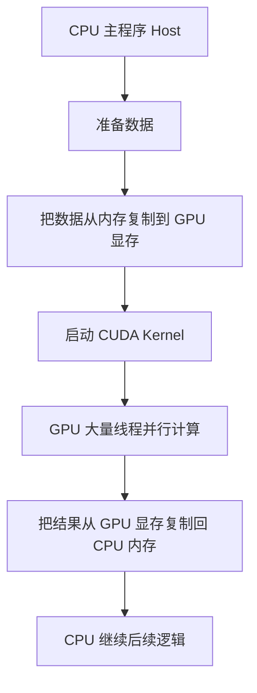
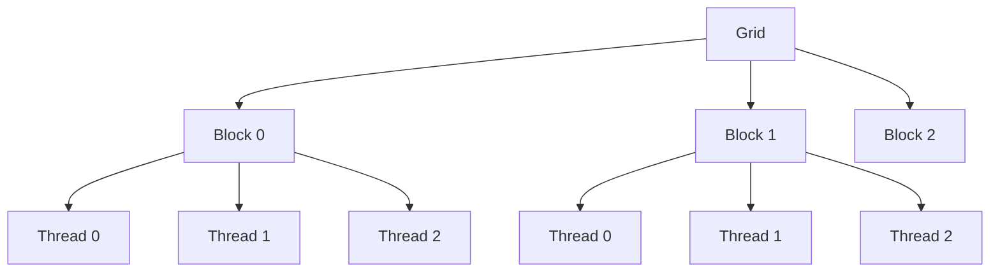
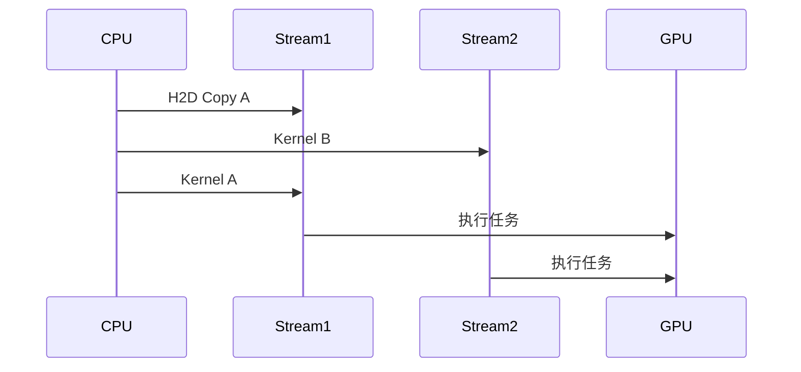
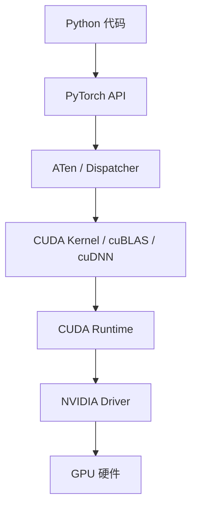
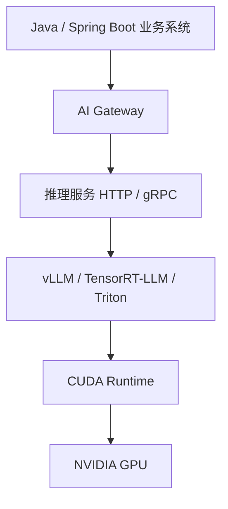
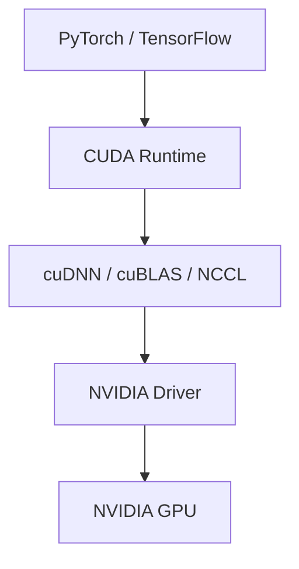
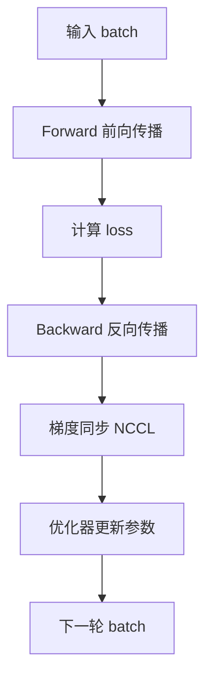
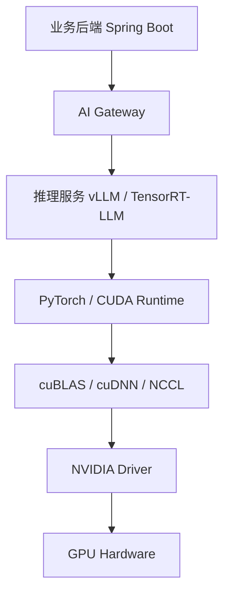

# 1. CUDA 是什么？

**CUDA** 全称：

```text
Compute Unified Device Architecture
```

它是 NVIDIA 推出的 **GPU 通用计算平台和编程模型**。

一句话：

> **CUDA 让程序员可以把 NVIDIA GPU 当成一个并行计算设备来使用，而不只是用来打游戏、渲染图形。**

原来 GPU 主要负责：

```text
图形渲染
游戏画面
3D 建模
视频处理
```

CUDA 出现后，开发者可以用 GPU 做：

```text
矩阵乘法
深度学习
科学计算
图像处理
视频编码
大模型训练
大模型推理
金融计算
物理仿真
```

所以 AI 圈经常说：

> NVIDIA 的护城河不只是 GPU 硬件，而是 CUDA 生态。

---

# 2. 为什么需要 CUDA？

CPU 和 GPU 的编程方式完全不同。

普通 Java / Python / C++ 程序默认跑在 CPU 上：

```text
CPU 执行主程序
CPU 管理内存
CPU 调用系统 API
CPU 处理网络、文件、数据库
```

但 GPU 是另一种设备：

```text
GPU 有自己的计算核心
GPU 有自己的显存
GPU 有自己的执行模型
GPU 不直接运行普通 CPU 程序
```

所以问题来了：

> 程序员怎么让 GPU 帮自己算东西？

CUDA 解决的就是这个问题。

它提供：

|组成|作用|
|---|---|
|CUDA C/C++|让你写 GPU 上运行的函数|
|CUDA Runtime|管理 GPU 内存、启动 GPU 任务|
|CUDA Driver|和 NVIDIA 驱动交互|
|cuBLAS|高性能矩阵运算库|
|cuDNN|深度学习算子库|
|NCCL|多 GPU 通信库|
|Nsight|性能分析工具|
|TensorRT|推理优化框架|

所以 CUDA 不是单个工具，而是一整套 GPU 计算生态。

---

# 3. CUDA 的核心思想

CUDA 的核心思想是：

> **CPU 负责控制流程，GPU 负责大规模并行计算。**

也就是：

```text
CPU：主控端，Host
GPU：计算端，Device
```

在 CUDA 里，经常看到两个词：

|名称|含义|
|---|---|
|Host|CPU 侧|
|Device|GPU 侧|

典型执行流程是：



对应伪代码：

```cpp
// 1. CPU 准备数据
float* h_a = ...;
float* h_b = ...;
float* h_c = ...;

// 2. GPU 分配显存
float* d_a;
float* d_b;
float* d_c;
cudaMalloc(&d_a, size);
cudaMalloc(&d_b, size);
cudaMalloc(&d_c, size);

// 3. CPU 内存 -> GPU 显存
cudaMemcpy(d_a, h_a, size, cudaMemcpyHostToDevice);
cudaMemcpy(d_b, h_b, size, cudaMemcpyHostToDevice);

// 4. 启动 GPU Kernel
vectorAdd<<<numBlocks, threadsPerBlock>>>(d_a, d_b, d_c, n);

// 5. GPU 显存 -> CPU 内存
cudaMemcpy(h_c, d_c, size, cudaMemcpyDeviceToHost);
```

你可以把它理解成：

```text
CPU 发任务
GPU 干重活
CPU 拿结果
```

---

# 4. 什么是 Kernel？

在 CUDA 里，**Kernel** 不是操作系统内核，而是：

> **运行在 GPU 上的函数。**

比如你要让两个数组相加：

```text
c[i] = a[i] + b[i]
```

普通 CPU 写法可能是：

```cpp
for (int i = 0; i < n; i++) {
    c[i] = a[i] + b[i];
}
```

CUDA 写法是：

```cpp
__global__ void vectorAdd(float* a, float* b, float* c, int n) {
    int i = blockIdx.x * blockDim.x + threadIdx.x;

    if (i < n) {
        c[i] = a[i] + b[i];
    }
}
```

这里：

```cpp
__global__
```

表示这个函数是 CUDA Kernel：

```text
由 CPU 发起调用
在 GPU 上执行
由大量 GPU 线程并行运行
```

启动方式是：

```cpp
vectorAdd<<<numBlocks, threadsPerBlock>>>(a, b, c, n);
```

这个语法很特殊：

```cpp
<<<numBlocks, threadsPerBlock>>>
```

它表示：

```text
启动多少个线程块
每个线程块里有多少个线程
```

---

# 5. CUDA 的线程模型

这是 CUDA 最重要的部分。

GPU 不是启动一个线程，而是一次启动海量线程。

CUDA 把线程组织成三级：

```text
Grid 网格
  -> Block 线程块
      -> Thread 线程
```

图示：



对应代码：

```cpp
int i = blockIdx.x * blockDim.x + threadIdx.x;
```

其中：

|变量|含义|
|---|---|
|`threadIdx.x`|当前线程在线程块内的编号|
|`blockIdx.x`|当前线程块在 Grid 中的编号|
|`blockDim.x`|每个线程块有多少线程|
|`gridDim.x`|Grid 中有多少线程块|

比如：

```cpp
int threadsPerBlock = 256;
int numBlocks = (n + threadsPerBlock - 1) / threadsPerBlock;

vectorAdd<<<numBlocks, threadsPerBlock>>>(a, b, c, n);
```

如果 `n = 1,000,000`，那么：

```text
每个 Block 256 个线程
需要约 3907 个 Block
总共约 1,000,000 个逻辑线程
```

GPU 会调度这些线程并行执行。

---

# 6. CUDA 为什么适合 AI？

因为 AI 大量计算都是：

```text
对大量数据执行相同或相似的数学操作
```

例如矩阵乘法：

```text
C = A × B
```

矩阵中每个元素：

```text
C[i][j] = A 的第 i 行 与 B 的第 j 列做点积
```

这些元素之间有大量可并行空间。

比如一个矩阵乘法：

```text
4096 × 4096 矩阵乘法
```

里面有海量独立计算任务。

CUDA 可以把这些任务分给大量 GPU 线程。

---

# 7. 一个简单的 CUDA 例子：向量加法

先看 CPU 写法：

```cpp
void vectorAddCPU(float* a, float* b, float* c, int n) {
    for (int i = 0; i < n; i++) {
        c[i] = a[i] + b[i];
    }
}
```

CUDA 写法：

```cpp
#include <cuda_runtime.h>
#include <iostream>

__global__ void vectorAddGPU(float* a, float* b, float* c, int n) {
    int i = blockIdx.x * blockDim.x + threadIdx.x;

    if (i < n) {
        c[i] = a[i] + b[i];
    }
}

int main() {
    int n = 1 << 20; // 约 100 万个元素
    size_t size = n * sizeof(float);

    float* h_a = new float[n];
    float* h_b = new float[n];
    float* h_c = new float[n];

    for (int i = 0; i < n; i++) {
        h_a[i] = 1.0f;
        h_b[i] = 2.0f;
    }

    float* d_a;
    float* d_b;
    float* d_c;

    cudaMalloc(&d_a, size);
    cudaMalloc(&d_b, size);
    cudaMalloc(&d_c, size);

    cudaMemcpy(d_a, h_a, size, cudaMemcpyHostToDevice);
    cudaMemcpy(d_b, h_b, size, cudaMemcpyHostToDevice);

    int threadsPerBlock = 256;
    int numBlocks = (n + threadsPerBlock - 1) / threadsPerBlock;

    vectorAddGPU<<<numBlocks, threadsPerBlock>>>(d_a, d_b, d_c, n);

    cudaMemcpy(h_c, d_c, size, cudaMemcpyDeviceToHost);

    std::cout << h_c[0] << std::endl; // 3.0

    cudaFree(d_a);
    cudaFree(d_b);
    cudaFree(d_c);

    delete[] h_a;
    delete[] h_b;
    delete[] h_c;

    return 0;
}
```

这段代码展示了 CUDA 最基础的几个动作：

```text
分配 CPU 内存
分配 GPU 显存
CPU 数据复制到 GPU
启动 GPU Kernel
GPU 并行计算
GPU 结果复制回 CPU
释放资源
```

---

# 8. CUDA 内存模型

CUDA 性能优化里，**内存模型极其重要**。

GPU 不是只有一种内存，而是有多层内存。

常见层级：

```text
Global Memory    全局显存
Shared Memory    共享内存
Registers        寄存器
Constant Memory  常量内存
Texture Memory   纹理内存
Local Memory     局部内存
```

简化理解：

|内存|位置|特点|
|---|---|---|
|Global Memory|GPU 显存|容量大，但访问相对慢|
|Shared Memory|SM 内部|容量小，但很快|
|Registers|每个线程私有|最快，但数量有限|
|Constant Memory|只读缓存|适合广播式读取|
|Local Memory|实际可能在显存中|名字叫 local，但可能很慢|

对 AI 来说，最常讨论的是：

```text
显存容量
显存带宽
Shared Memory 使用
KV Cache
Tensor Core 利用率
```

---

# 9. Global Memory：全局显存

Global Memory 就是我们常说的 **GPU 显存**。

比如：

```text
RTX 4090：24GB 显存
A100：40GB / 80GB 显存
H100：80GB 显存
H200：141GB 显存
```

Global Memory 的特点：

```text
容量大
所有线程都能访问
访问延迟相对高
带宽很高但仍然是瓶颈
```

模型参数、输入张量、输出张量、KV Cache，大多都在显存里。

大模型为什么吃显存？

因为至少要放：

```text
模型权重
输入 token embedding
中间激活
KV Cache
batch 数据
运行时 buffer
```

---

# 10. Shared Memory：共享内存

Shared Memory 是线程块内共享的高速内存。

特点：

```text
同一个 Block 内的线程可以共享
速度远快于 Global Memory
容量有限
需要程序员显式管理
```

典型用途：

```text
把 Global Memory 中反复使用的数据加载到 Shared Memory
多个线程复用
减少显存访问
提高性能
```

矩阵乘法优化里，Shared Memory 非常关键。

简化理解：

```text
不优化：
每个线程都直接反复读显存

优化：
先把一小块矩阵搬到 Shared Memory
Block 内线程重复使用这块数据
```

这类似后端里的缓存思想：

```text
频繁访问的数据不要每次都查数据库
先放到 Redis / 本地缓存
```

只不过 GPU 里的 Shared Memory 更底层、更快、更小。

---

# 11. Register：寄存器

Register 是每个线程私有的最快存储。

例如：

```cpp
int i = blockIdx.x * blockDim.x + threadIdx.x;
float value = a[i] + b[i];
```

这里的 `i`、`value` 可能就在寄存器里。

特点：

```text
最快
每个线程私有
数量有限
用多了会影响线程并发度
```

CUDA 优化时，经常要平衡：

```text
寄存器使用量
线程数量
Occupancy
吞吐量
```

---

# 12. Warp 是什么？

CUDA 中还有一个非常重要的概念：**Warp**。

在 NVIDIA GPU 上，线程不是一个一个独立调度的，而是一组一组调度。

通常：

```text
1 个 Warp = 32 个线程
```

一个 Warp 中的 32 个线程执行同一条指令。

这叫 SIMT：

```text
Single Instruction, Multiple Threads
```

也就是：

```text
一条指令，多线程执行
```

例如一个 Warp 里的 32 个线程同时执行：

```cpp
c[i] = a[i] + b[i];
```

每个线程处理不同的 `i`。

---

# 13. 分支发散：GPU 不喜欢复杂 if else

因为一个 Warp 里的 32 个线程通常一起执行同一条指令。

如果出现：

```cpp
if (x > 0) {
    // path A
} else {
    // path B
}
```

假设一个 Warp 里的线程：

```text
16 个走 if
16 个走 else
```

GPU 不能真正同时执行两条不同路径，它通常会：

```text
先执行 if 分支，屏蔽 else 的线程
再执行 else 分支，屏蔽 if 的线程
```

这叫：

```text
Warp Divergence
分支发散
```

结果就是性能下降。

所以 GPU 适合：

```text
规则计算
大量相同逻辑
矩阵运算
向量运算
张量计算
```

不适合：

```text
复杂业务逻辑
大量 if else
链表遍历
递归
随机内存访问
复杂对象模型
```

这也是为什么你不会拿 GPU 跑 Spring Boot、MySQL、Redis 主逻辑。

---

# 14. Coalesced Access：合并内存访问

GPU 很看重内存访问模式。

最理想情况是：

```text
连续线程访问连续内存地址
```

比如：

```cpp
int i = blockIdx.x * blockDim.x + threadIdx.x;
c[i] = a[i] + b[i];
```

线程访问：

```text
Thread 0 -> a[0]
Thread 1 -> a[1]
Thread 2 -> a[2]
Thread 3 -> a[3]
...
```

这种访问可以被 GPU 合并成高效内存事务。

这叫：

```text
Coalesced Memory Access
合并内存访问
```

反过来，如果线程随机访问内存：

```text
Thread 0 -> a[9981]
Thread 1 -> a[12]
Thread 2 -> a[764433]
Thread 3 -> a[5]
```

性能会差很多。

这和数据库也有点像：

```text
顺序扫描比随机 IO 更容易优化
局部性好的访问比乱跳访问更快
```

---

# 15. Tensor Core 是什么？

现代 NVIDIA GPU 里，除了普通 CUDA Core，还有 **Tensor Core**。

CUDA Core 更通用。

Tensor Core 是专门为矩阵乘法和深度学习设计的硬件单元。

它特别擅长：

```text
FP16
BF16
TF32
INT8
FP8
```

这些低精度或混合精度矩阵运算。

大模型训练和推理大量依赖 Tensor Core。

可以粗略理解：

```text
CUDA Core：通用并行计算单元
Tensor Core：矩阵乘法专用加速单元
```

为什么 AI 可以用低精度？

因为神经网络对数值精度有一定容忍度，不一定非要 FP64 双精度。

所以 AI 通常使用：

```text
FP32
TF32
FP16
BF16
FP8
INT8
INT4
```

而不是传统科学计算里非常看重的 FP64。

---

# 16. CUDA、cuBLAS、cuDNN、NCCL 的关系

很多人说“CUDA”，其实可能指整个 NVIDIA AI 软件栈。

几个核心组件如下：

## CUDA Runtime

负责：

```text
分配显存
拷贝数据
启动 Kernel
同步设备
管理 Stream
```

常见 API：

```cpp
cudaMalloc
cudaFree
cudaMemcpy
cudaDeviceSynchronize
```

---

## cuBLAS

BLAS 是基础线性代数库。

cuBLAS 是 NVIDIA 的 GPU 版 BLAS。

主要负责：

```text
矩阵乘法
向量运算
线性代数计算
```

大模型里最核心的 GEMM：

```text
General Matrix Multiplication
C = A × B
```

通常底层就会用到 cuBLAS 或类似高性能 kernel。

---

## cuDNN

cuDNN 是深度学习加速库。

主要负责：

```text
卷积
归一化
激活函数
RNN
部分 Transformer 算子
```

早期 CNN 时代，cuDNN 极其重要。

现在 Transformer 时代，矩阵乘法、Attention、LayerNorm、Softmax 等算子同样重要。

---

## NCCL

NCCL 是多 GPU 通信库。

负责：

```text
多卡通信
AllReduce
Broadcast
ReduceScatter
AllGather
```

大模型训练需要多 GPU 协同。

比如 8 张 GPU 一起训练时，反向传播之后需要同步梯度：

```text
GPU 0 的梯度
GPU 1 的梯度
...
GPU 7 的梯度
```

NCCL 就负责高效通信。

---

# 17. CUDA Stream 是什么？

默认情况下，GPU 任务可能按顺序执行。

CUDA Stream 可以让多个任务并发排队执行。

比如：

```text
Stream 1：拷贝 batch A 数据
Stream 2：计算 batch B
Stream 3：拷贝 batch C 结果
```

目标是：

```text
数据传输和计算重叠
提高 GPU 利用率
```

概念上：



后端类比：

```text
单线程顺序执行任务
vs
多个队列并行调度任务
```

但 CUDA Stream 是 GPU 任务队列，不是 Java 线程池。

---

# 18. CUDA 同步

GPU 计算通常是异步的。

比如你写：

```cpp
vectorAddGPU<<<numBlocks, threadsPerBlock>>>(d_a, d_b, d_c, n);
```

CPU 发起 Kernel 后，可能不会等待 GPU 完成，而是继续往下执行。

如果你要确保 GPU 任务完成，可以调用：

```cpp
cudaDeviceSynchronize();
```

含义：

```text
CPU 等待 GPU 当前任务完成
```

但同步是有成本的。

过多同步会降低并行效率。

这和后端里频繁阻塞等待远程调用有点像：

```text
异步管线被同步点打断
吞吐下降
```

---

# 19. CUDA 编程难在哪里？

CUDA 不是难在语法，而是难在性能模型。

主要难点：

## 1. 并行划分

你要决定：

```text
多少个 Block
每个 Block 多少线程
每个线程干什么
```

## 2. 内存访问

你要考虑：

```text
是否连续访问
是否合并访问
是否重复读显存
是否使用 Shared Memory
```

## 3. 分支发散

要避免：

```text
同一个 Warp 内线程走不同分支
```

## 4. 同步和竞争

Block 内线程共享数据时，要考虑：

```text
同步
竞态条件
原子操作
```

## 5. 多 GPU 通信

大模型训练里，还要考虑：

```text
模型并行
数据并行
流水线并行
张量并行
NCCL 通信
网络拓扑
```

## 6. 调优复杂

性能受很多因素影响：

```text
显存带宽
寄存器数量
Shared Memory 使用量
Occupancy
Tensor Core 利用率
Kernel launch overhead
数据传输开销
```

所以 CUDA 属于典型的：

```text
入门能写，写快很难。
```

---

# 20. CUDA 和 PyTorch 的关系

你平时用 PyTorch：

```python
import torch

x = torch.randn(1024, 1024).cuda()
y = torch.matmul(x, x)
```

你没有写 CUDA，但底层会调用 CUDA 生态。

大概链路：



比如：

```python
torch.matmul(a, b)
```

底层可能调用：

```text
cuBLAS GEMM
```

比如卷积：

```python
torch.nn.Conv2d(...)
```

底层可能调用：

```text
cuDNN convolution kernel
```

所以你作为 AI 应用开发者，多数时候不直接写 CUDA，而是：

```text
PyTorch / TensorFlow / JAX 调 CUDA
CUDA 调 NVIDIA GPU
```

---

# 21. CUDA 和大模型推理框架的关系

现在常见的大模型推理框架包括：

```text
vLLM
TensorRT-LLM
SGLang
llama.cpp
TGI
Triton Inference Server
```

其中很多都高度依赖 CUDA 或 CUDA 生态。

例如 vLLM 这类框架会优化：

```text
KV Cache 管理
PagedAttention
Continuous Batching
CUDA Kernel
显存利用率
吞吐量
流式输出
```

TensorRT-LLM 更进一步，会做：

```text
算子融合
低精度量化
Kernel 自动优化
Tensor Core 利用
多 GPU 推理
```

大模型推理服务不是简单地：

```text
model.forward(input)
```

而是有一整套优化：

```text
请求调度
动态 batch
KV cache 分配
CUDA kernel 执行
Tensor Core 加速
token 流式返回
```

---

# 22. CUDA 和后端服务的关系

你做 Java 后端时，一般不会在业务服务里直接写 CUDA。

更常见架构是：



你的 Java 后端负责：

```text
用户鉴权
限流
业务流程
会话管理
上下文拼装
调用推理服务
流式返回
计费审计
日志监控
```

GPU 推理服务负责：

```text
模型加载
显存管理
batching
KV Cache
CUDA kernel
token generation
```

所以对你来说，CUDA 的价值在于理解：

```text
为什么推理服务会慢
为什么显存会爆
为什么 batch 会影响延迟
为什么长上下文贵
为什么需要流式响应
为什么模型部署要看 CUDA 版本
```

---

# 23. CUDA 版本、驱动、PyTorch 为什么经常搞人？

这是很多人第一次部署 AI 项目会踩的坑。

你经常会看到：

```text
CUDA 11.8
CUDA 12.1
CUDA 12.4
cuDNN 8
cuDNN 9
PyTorch cu121
NVIDIA Driver xxx
```

这些东西有兼容关系。

大致分层：



关键点：

## 1. 驱动要足够新

NVIDIA Driver 需要支持对应 CUDA 版本。

如果驱动太老，可能报错：

```text
CUDA driver version is insufficient for CUDA runtime version
```

## 2. PyTorch 通常自带 CUDA Runtime

很多 PyTorch 安装包已经带了 CUDA Runtime。

比如：

```bash
pip install torch --index-url https://download.pytorch.org/whl/cu121
```

这里 `cu121` 表示 CUDA 12.1 运行时版本。

这不一定要求你系统完整安装 CUDA Toolkit，但需要 NVIDIA Driver 正常。

## 3. 编译自定义 CUDA Kernel 需要 Toolkit

如果只是跑 PyTorch，可能不用完整 CUDA Toolkit。

但如果要编译扩展，例如某些自定义算子：

```text
flash-attn
xformers
vLLM custom ops
```

就可能需要本机 CUDA Toolkit、编译器、头文件。

---

# 24. CUDA Toolkit 是什么？

CUDA Toolkit 是开发 CUDA 程序需要的一整套工具。

包含：

|工具|作用|
|---|---|
|`nvcc`|CUDA 编译器|
|CUDA headers|头文件|
|CUDA libraries|运行库|
|Nsight|调试和性能分析|
|samples|示例代码|
|cuBLAS/cuFFT 等|常用数学库|

如果你写 CUDA C++，需要 CUDA Toolkit。

比如：

```bash
nvcc vector_add.cu -o vector_add
```

`nvcc` 会把 CUDA 代码编译成 GPU 可以执行的代码。

---

# 25. `.cu` 文件是什么？

CUDA 源文件通常是：

```text
xxx.cu
```

里面可以同时包含：

```text
CPU 侧 C++ 代码
GPU 侧 Kernel 代码
```

例如：

```cpp
__global__ void kernel() {
    // GPU 上执行
}

int main() {
    // CPU 上执行
    kernel<<<1, 256>>>();
}
```

编译器 `nvcc` 会区分哪些代码给 CPU，哪些代码给 GPU。

---

# 26. CUDA、OpenCL、ROCm 的区别

## CUDA

```text
NVIDIA 专有生态
成熟度最高
AI 框架支持最好
工业使用最广
```

## OpenCL

```text
开放标准
支持多厂商
生态和性能调优体验通常弱于 CUDA
```

## ROCm

```text
AMD 的 GPU 计算平台
用于 AMD GPU 做 AI 训练/推理
生态在发展
但主流 AI 生态仍以 CUDA 最强
```

为什么 CUDA 成为主流？

核心原因不是语法，而是：

```text
NVIDIA GPU 市占率
CUDA 库成熟
PyTorch 支持好
开发者生态强
性能工具完善
大模型框架优先适配
云厂商支持完善
```

---

# 27. CUDA 和 Java 有关系吗？

直接关系不强。

Java 本身不常直接写 CUDA。

但可以通过几种方式间接使用 GPU：

## 1. Java 调 Python 推理服务

最常见：

```text
Spring Boot -> HTTP/gRPC -> Python vLLM 服务 -> CUDA -> GPU
```

这是最推荐的工程方式。

## 2. Java 调本地 native 库

通过 JNI / JNA 调 CUDA C++。

```text
Java -> JNI -> C++ CUDA
```

这条路复杂，除非你做底层中间件，不建议普通业务使用。

## 3. 使用 DJL

DJL，全称 Deep Java Library。

可以让 Java 调用深度学习模型，底层可能接 PyTorch、TensorFlow、ONNX Runtime 等。

```text
Java -> DJL -> native backend -> CUDA
```

## 4. ONNX Runtime GPU

Java 也可以通过 ONNX Runtime 的 Java API 间接使用 GPU。

但大模型生态上，Python 仍然主导。

---

# 28. CUDA 对大模型训练的意义

训练大模型时，CUDA 支撑：

```text
前向传播
反向传播
梯度计算
矩阵乘法
多 GPU 通信
混合精度训练
显存优化
```

训练过程大概是：



这里面：

```text
矩阵乘法 -> cuBLAS / Tensor Core
深度学习算子 -> cuDNN / 自定义 CUDA Kernel
多卡通信 -> NCCL
混合精度 -> Tensor Core
```

---

# 29. CUDA 对大模型推理的意义

推理时，CUDA 支撑：

```text
模型权重加载到显存
输入 token embedding
Transformer 层计算
Attention
MLP
LayerNorm
Softmax
KV Cache 读写
下一个 token 生成
```

一次生成 token 的过程简化为：

```text
输入 token
 -> embedding
 -> 多层 Transformer
 -> logits
 -> 采样
 -> 输出下一个 token
```

这个过程每生成一个 token 都会重复。

所以推理优化重点是：

```text
降低首 token 延迟
提高 tokens/s
提高 batch 吞吐
降低显存占用
高效管理 KV Cache
减少 kernel launch overhead
提高 Tensor Core 利用率
```

---

# 30. 为什么很多 AI 库安装时要看 CUDA 版本？

因为它们底层可能包含已经编译好的 CUDA 二进制。

例如：

```text
flash-attn
xformers
bitsandbytes
vLLM
torch
tensorflow
onnxruntime-gpu
```

它们要和：

```text
Python 版本
PyTorch 版本
CUDA 版本
GPU 架构
NVIDIA Driver
操作系统
编译器版本
```

兼容。

所以部署 AI 环境时，最常见问题就是：

```text
版本矩阵不匹配
```

例如：

```text
PyTorch 是 cu121
系统 CUDA 是 11.8
驱动太老
flash-attn 编译失败
GPU 架构不支持某个算子
```

这类问题本质上不是业务代码问题，而是 GPU 软件栈兼容问题。

---

# 31. 作为后端开发者，CUDA 学到什么程度够？

你不一定要深入写 CUDA Kernel。

建议分三层。

## 第一层：应用后端必备

你需要理解：

```text
CUDA 是 NVIDIA GPU 的计算平台
PyTorch / vLLM / TensorRT-LLM 依赖 CUDA
CUDA 版本和驱动有兼容关系
显存是大模型部署核心瓶颈
GPU 计算适合矩阵和张量
GPU 不适合普通业务逻辑
```

这层必须掌握。

---

## 第二层：AI Infra / 推理部署

你需要进一步理解：

```text
CUDA Runtime
cuBLAS
cuDNN
NCCL
Tensor Core
KV Cache
batching
显存带宽
多 GPU 通信
CUDA Stream
```

如果你要部署 vLLM、TensorRT-LLM、Triton，这层很有用。

---

## 第三层：底层优化工程师

你需要学习：

```text
CUDA C++
Kernel 编写
Shared Memory 优化
Warp 优化
Memory Coalescing
Occupancy 分析
Nsight 性能分析
Triton Kernel
算子融合
矩阵乘法优化
```

这层适合做：

```text
AI Infra
推理框架
训练框架
高性能计算
底层算子优化
```

普通 Java 后端不必一开始卷到这层。

---

# 32. 推荐你这样理解 CUDA

对你来说，可以用一句工程化的话总结：

> **CUDA 是 AI 推理服务和训练框架调用 NVIDIA GPU 的底层计算体系。Java 后端通常不直接写 CUDA，但你需要理解 CUDA 影响模型部署、推理性能、显存占用、并发能力和版本兼容。**

你以后看 AI 系统架构时，可以这样分层：



真正和你后端工作强相关的是：

```text
AI Gateway 怎么设计
推理服务怎么调用
流式输出怎么处理
GPU 服务怎么限流
请求怎么排队
模型怎么降级
显存不足怎么处理
CUDA 环境怎么部署
```

而不是一开始就手写 CUDA Kernel。

---

# 33. 最小知识闭环

你只要先记住这几个关键词，就能看懂大部分 AI 部署文章：

|关键词|含义|
|---|---|
|CUDA|NVIDIA GPU 通用计算平台|
|Kernel|GPU 上运行的函数|
|Thread / Block / Grid|CUDA 并行线程组织方式|
|Warp|GPU 调度线程的基本单位，通常 32 个线程|
|Global Memory|GPU 显存|
|Shared Memory|Block 内共享的高速内存|
|Tensor Core|矩阵乘法专用加速单元|
|cuBLAS|GPU 线性代数库|
|cuDNN|深度学习算子库|
|NCCL|多 GPU 通信库|
|CUDA Runtime|分配显存、启动 Kernel 的运行时|
|CUDA Toolkit|开发 CUDA 程序的工具包|
|Driver|NVIDIA 驱动|
|Stream|GPU 异步任务队列|
|KV Cache|大模型推理中保存上下文中间结果的缓存|

---

# 34. 最后用一句类比

如果说：

```text
Java 后端生态 = JVM + Spring + Maven + MyBatis + Netty + Redis 客户端
```

那么：

```text
NVIDIA AI 计算生态 = GPU + CUDA + cuBLAS + cuDNN + NCCL + TensorRT + PyTorch
```

CUDA 在这里的地位，类似于：

> **连接上层 AI 框架和底层 GPU 硬件的核心运行时与编程体系。**