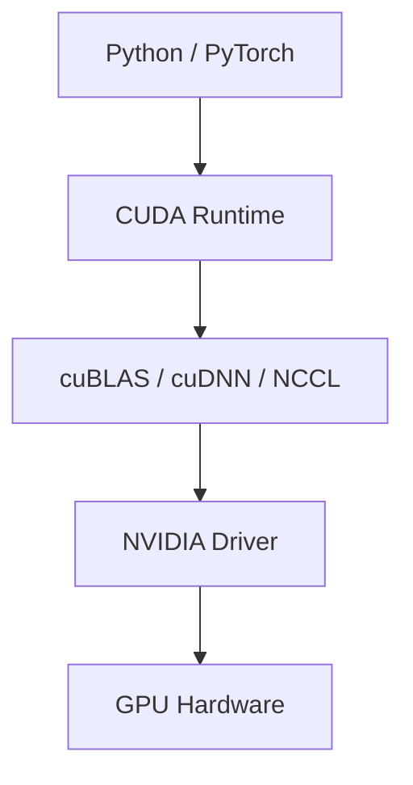

# GPU 是什么？

GPU，全称 **Graphics Processing Unit**，中文叫 **图形处理器**。

最早它主要是为了处理图像、游戏画面、3D 渲染而设计的。但 AI 爆火之后，GPU 的核心价值变成了：

> **非常擅长做大规模并行计算，尤其是矩阵运算。**

而大模型训练、推理、图像生成、视频生成，本质上都需要海量矩阵计算，所以 GPU 成了 AI 时代最关键的硬件资源之一。

---

# 1. 先用一句话区分 CPU 和 GPU

## CPU

CPU 像一个或几个“超级聪明的工人”：

```text
擅长复杂逻辑
擅长分支判断
擅长操作系统调度
擅长跑通用程序
单个核心能力强
核心数量相对少
```

## GPU

GPU 像几千到几万个“简单但数量巨大的工人”：

```text
擅长重复计算
擅长并行计算
擅长矩阵运算
单个核心没 CPU 强
但核心数量极多
```

所以：

```text
CPU 适合复杂控制逻辑
GPU 适合大量重复数学计算
```

---

# 2. 举个直观例子：给 1000 万个数都乘以 2

假设有一个数组：

```text
[1, 2, 3, 4, 5, ... 10000000]
```

你要把每个数都乘以 2。

CPU 可能是：

```text
一个核心处理一部分
几个核心一起处理
```

GPU 更像是：

```text
几千个核心同时开工
每个核心处理一小块数据
```

这种任务的特点是：

```text
每个元素的计算逻辑非常简单
但数据量巨大
每个元素之间互不依赖
```

这正是 GPU 最擅长的场景。

---

# 3. 为什么 AI 特别需要 GPU？

因为 AI 模型的核心计算是：

```text
矩阵乘法
向量运算
张量运算
```

比如神经网络中的一层，简化后可以理解为：

```text
输入向量 × 权重矩阵 = 输出向量
```

再抽象一点：

```text
Y = XW + b
```

其中：

- `X` 是输入
    
- `W` 是模型参数
    
- `b` 是偏置
    
- `Y` 是输出
    

大模型里面这种计算会重复发生无数次。

---

# 4. 大模型其实就是巨大的参数矩阵

比如一个语言模型，它内部有大量参数。

你可以粗略理解为：

```text
模型参数 = 很多很多矩阵
推理过程 = 输入 token 和这些矩阵不断做计算
训练过程 = 反复调整这些矩阵里的数值
```

当你问 ChatGPT 一个问题时，大致发生了：

```text
文字 -> token
token -> 向量
向量进入模型
多层 Transformer 计算
每层大量矩阵乘法
输出下一个 token 的概率
生成一个 token
再生成下一个 token
再生成下一个 token
...
```

而 GPU 最擅长的就是：

```text
把巨大的矩阵计算拆成大量小计算，并行完成。
```

---

# 5. GPU 为什么比 CPU 更适合矩阵运算？

核心原因是架构不同。

## CPU 的设计目标

CPU 追求的是：

```text
低延迟
强分支预测
强缓存
强单线程性能
复杂指令处理能力
```

CPU 要处理很多复杂问题：

- 操作系统调度
    
- IO 中断
    
- 网络请求
    
- 数据库事务
    
- Java 虚拟机
    
- 分支判断
    
- 线程切换
    
- 文件系统
    
- 加密解密
    
- 各种通用逻辑
    

所以 CPU 设计得非常“聪明”，但核心数量不会特别夸张。

---

## GPU 的设计目标

GPU 追求的是：

```text
高吞吐
大规模并行
同一条指令处理大量数据
高内存带宽
```

它不太擅长复杂分支逻辑，但非常擅长这种任务：

```text
对一大批数据执行相同或相似的数学操作
```

这类计算叫：

```text
SIMD / SIMT 风格计算
```

可以粗略理解为：

```text
一条指令，很多数据一起执行。
```

---

# 6. GPU 在游戏里怎么用？

游戏画面里有大量像素、顶点、纹理、光照。

比如一个 4K 画面：

```text
3840 × 2160 ≈ 829 万个像素
```

每一帧都要计算很多东西：

- 每个像素是什么颜色
    
- 光线怎么反射
    
- 阴影怎么生成
    
- 纹理怎么贴上去
    
- 物体怎么变换
    
- 粒子怎么移动
    
- 水面怎么波动
    

游戏如果是 60 FPS：

```text
每秒 60 帧
每帧 829 万像素
```

这就是海量并行计算。

GPU 原本就是为了这种任务诞生的。

后来人们发现：

> 图形渲染需要大量矩阵计算，AI 训练也需要大量矩阵计算。  
> 所以 GPU 很自然地被迁移到了 AI 领域。

---

# 7. GPU 在 AI 里主要做什么？

主要做两类事：

## 1. 训练 Training

训练是“让模型学会东西”。

比如给模型大量文本：

```text
输入：Redis 是一个...
目标：预测下一个 token
```

如果预测错了，就根据误差调整参数。

训练过程包括：

```text
前向传播 forward
计算损失 loss
反向传播 backward
参数更新 update
```

这里面有大量矩阵乘法和梯度计算。

训练非常消耗 GPU。

---

## 2. 推理 Inference

推理是“使用已经训练好的模型”。

比如你问：

```text
什么是 Redis Cluster Gossip？
```

模型根据已有参数生成回答。

推理不需要修改模型参数，但仍然需要大量矩阵运算。

所以：

```text
训练需要 GPU
推理也需要 GPU
```

区别是：

|类型|作用|资源消耗|
|---|---|---|
|训练|学习参数|极高|
|推理|使用模型生成答案|也很高，但通常低于训练|
|微调|在已有模型上继续训练|中到高|
|Embedding|把文本转向量|相对较低|

---

# 8. 为什么大模型公司疯狂买 GPU？

因为 GPU 决定了三个核心能力：

## 1. 能不能训练更大的模型

模型越大，参数越多，需要的 GPU 越多。

```text
小模型：一张或几张 GPU 可能够
大模型：几千、几万、甚至更多 GPU 集群
```

## 2. 能不能服务更多用户

用户越多，同时推理请求越多，需要的 GPU 越多。

比如 ChatGPT 这种产品，不只是训练时需要 GPU，日常用户每问一句，背后也在消耗推理资源。

## 3. 响应速度能不能快

GPU 不够时，请求就要排队。

于是用户会看到：

```text
响应慢
排队
模型暂不可用
速率限制
高级模型额度限制
```

这不是单纯的软件问题，而是硬件资源问题。

---

# 9. AI 里的 GPU 重要指标

作为后端开发者，理解 GPU 不需要一开始看太多硬件细节，但下面几个指标很重要。

---

## 1. 显存 VRAM

显存就是 GPU 自己的内存。

类似：

```text
CPU 使用内存 RAM
GPU 使用显存 VRAM
```

大模型推理时，模型参数、KV Cache、中间计算结果都要放进显存。

显存越大，能放的模型越大，能处理的上下文越长。

比如：

```text
8GB 显存：适合小模型、轻量推理
24GB 显存：可以跑一些中小模型
80GB 显存：数据中心高端 AI GPU
```

对大模型来说，显存经常比算力更先成为瓶颈。

---

## 2. 算力 FLOPS

FLOPS 表示：

```text
Floating Point Operations Per Second
每秒浮点运算次数
```

比如：

```text
TFLOPS = 每秒万亿次浮点运算
PFLOPS = 每秒千万亿次浮点运算
```

AI 训练和推理都需要大量浮点运算。

但注意：

> FLOPS 高不一定实际性能就一定好，还要看显存、带宽、通信、软件栈、模型结构。

---

## 3. 显存带宽 Memory Bandwidth

显存带宽表示：

```text
GPU 从显存读取/写入数据的速度
```

AI 推理时，不只是“算得快”就行，还要“喂数据喂得快”。

如果显存带宽不足，就会出现：

```text
计算单元在等数据
GPU 算力吃不满
```

这类似 Java 后端里：

```text
CPU 很强，但数据库 IO 很慢，整体还是慢。
```

---

## 4. GPU 间通信

大模型经常一张 GPU 放不下，需要多张 GPU 一起跑。

这时候就需要 GPU 之间通信。

比如：

```text
GPU 1 负责一部分模型
GPU 2 负责另一部分模型
GPU 3 负责另一部分模型
```

中间需要频繁交换数据。

所以高端 AI 服务器很看重：

- NVLink
    
- NVSwitch
    
- InfiniBand
    
- RDMA
    
- 高速网络
    

多 GPU 系统的瓶颈经常不是单卡算力，而是：

```text
卡与卡之间、机器与机器之间的数据传输。
```

---

# 10. 常见 GPU 类型

## 消费级 GPU

比如：

```text
NVIDIA RTX 4060 / 4070 / 4080 / 4090 / 5090
```

特点：

```text
适合游戏
适合个人 AI 实验
性价比较高
显存相对有限
不一定适合大规模生产
```

个人开发者本地跑模型，常见就是 RTX 系列。

---

## 数据中心 GPU

比如：

```text
NVIDIA A100
NVIDIA H100
NVIDIA H200
NVIDIA B200
```

特点：

```text
显存大
带宽高
稳定性强
支持多卡高速互联
适合训练和大规模推理
价格极高
```

ChatGPT、Claude、Gemini 这类大模型服务，核心依赖的是这种数据中心级 GPU 集群。

---

## 国产 / 其他 AI 芯片

除了 NVIDIA，还有：

```text
AMD GPU
Google TPU
华为昇腾
寒武纪
Meta MTIA
AWS Trainium / Inferentia
```

但从生态成熟度来说，目前 AI 训练和推理主流仍然高度依赖 NVIDIA 生态，尤其是 CUDA。

---

# 11. CUDA 是什么？

[[CUDA科普]]
谈 GPU 几乎绕不开 CUDA。

CUDA 是 NVIDIA 推出的并行计算平台和编程模型。

你可以粗略理解为：

```text
CUDA = 让开发者用 NVIDIA GPU 做通用计算的编程体系
```

它包括：

- 编程模型
    
- 编译器
    
- 驱动
    
- 运行时
    
- 数学库
    
- 深度学习加速库
    

AI 框架如：

```text
PyTorch
TensorFlow
JAX
```

底层大量依赖 CUDA 生态。

所以很多人说：

> NVIDIA 真正强的不只是 GPU 硬件，而是 CUDA 生态。

这就像 Java 后端里：

```text
JVM + Spring + Maven + MyBatis + 生态工具
```

不只是语言本身，而是一整套工程生态。

---

# 12. AI 框架和 GPU 的关系

你平时写 PyTorch 代码可能是：

```python
import torch

x = torch.tensor([1, 2, 3]).cuda()
y = x * 2
```

这行：

```python
.cuda()
```

意思是把数据放到 GPU 上。

然后：

```python
y = x * 2
```

这个计算就会在 GPU 上执行。

但你并不需要手写 CUDA 内核。因为 PyTorch 底层已经帮你调用了 CUDA、cuDNN、cuBLAS 等库。

关系大概是：



其中：

|层|作用|
|---|---|
|PyTorch|高层 AI 开发框架|
|CUDA|GPU 通用计算平台|
|cuBLAS|矩阵运算库|
|cuDNN|深度学习加速库|
|NCCL|多 GPU 通信库|
|Driver|驱动|
|GPU|硬件|

---

# 13. 为什么后端开发者也要懂 GPU？

你不一定要会写 CUDA，但最好理解 GPU 资源的性质。

因为 AI 应用后端会涉及：

```text
模型调用成本
推理延迟
并发容量
流式响应
队列排队
token 计费
模型选择
降级策略
本地模型部署
Embedding 计算
向量检索
```

比如你做一个 AI 产品后端，需要知道：

```text
为什么高级模型要限流？
为什么长上下文更贵？
为什么图片生成比普通文本贵？
为什么推理有排队？
为什么本地部署模型需要显存？
为什么一个 70B 模型不能随便跑在普通显卡上？
```

这些都和 GPU 直接相关。

---

# 14. 为什么模型越大越吃显存？

假设一个模型有 70B 参数，也就是：

```text
70 billion = 700 亿参数
```

如果每个参数用 FP16 存储：

```text
每个参数 2 bytes
```

那么只存参数就需要：

```text
700 亿 × 2 bytes = 1400 亿 bytes ≈ 140GB
```

这还只是模型权重，不包括：

```text
KV Cache
中间激活值
运行时开销
batch
上下文
框架开销
```

所以一个 70B 模型想完整跑起来，普通 24GB 显卡远远不够。

这就是为什么需要：

- 模型量化
    
- 多 GPU 切分
    
- CPU offload
    
- 分布式推理
    
- 专门的推理框架
    

---

# 15. 什么是量化？

量化就是把模型参数用更低精度表示。

比如原来用：

```text
FP16：每个参数 16 bit
```

量化后用：

```text
INT8：每个参数 8 bit
INT4：每个参数 4 bit
```

好处：

```text
显存占用更低
推理速度可能更快
部署门槛降低
```

坏处：

```text
精度可能下降
复杂任务能力可能变差
某些模型不稳定
```

比如一个 7B 模型：

```text
FP16 大约 14GB 权重
INT4 大约 3.5GB 权重
```

所以很多个人电脑能跑本地模型，是因为用了量化版本。

---

# 16. GPU 和大模型推理的几个核心概念

## 1. Batch Size

多个请求一起送进 GPU 算。

```text
单个请求一个个算：GPU 利用率低
多个请求组成 batch：吞吐量高
```

但 batch 太大也会增加延迟。

所以推理服务要在：

```text
吞吐量
延迟
显存占用
```

之间平衡。

---

## 2. KV Cache

Transformer 生成文本时，需要保存前文的 key/value 中间结果，避免每生成一个 token 都重新算全部上下文。

这个缓存叫：

```text
KV Cache
```

上下文越长，KV Cache 越大。

所以为什么长上下文贵？

```text
不是只是输入文字更多
而是显存占用和计算负担都明显增加
```

---

## 3. Time To First Token

用户点发送之后，到第一个 token 出现的时间。

这是 AI 产品体验的重要指标。

```text
首 token 慢：用户感觉卡住了
后续 token 慢：用户感觉打字慢
```

后端和推理系统都要优化这个指标。

---

## 4. Tokens Per Second

每秒生成多少 token。

```text
tokens/s 越高，回答生成越快
```

这受影响于：

- 模型大小
    
- GPU 性能
    
- batch
    
- 上下文长度
    
- 推理框架
    
- 量化方式
    
- 网络传输
    
- 是否调用工具
    

---

# 17. GPU、NPU、TPU 有什么区别？

## GPU

通用并行计算能力强，生态成熟。

```text
图形渲染 + AI 训练 + AI 推理 + 科学计算
```

## TPU

Google 专门为机器学习设计的芯片。

```text
更偏 AI 矩阵计算
Google 云生态中使用多
```

## NPU

神经网络处理器，常见于手机、边缘设备、部分 AI 芯片。

```text
更偏低功耗 AI 推理
比如手机端图像识别、语音识别、端侧大模型
```

简单说：

```text
GPU：通用并行计算，生态最广
TPU：专用 AI 加速，Google 体系强
NPU：端侧或专用 AI 推理常见
```

---

# 18. 后端开发者应该怎么学习 GPU？

你不需要一上来写 CUDA。建议按这个路径：

## 第一层：概念理解

掌握：

```text
CPU vs GPU
显存
算力
带宽
CUDA
训练
推理
batch
KV Cache
量化
```

这一步足够支撑大部分 AI 后端讨论。

---

## 第二层：能部署本地模型

学习：

```text
Ollama
vLLM
llama.cpp
LM Studio
text-generation-webui
```

你可以体验：

```text
模型大小和显存的关系
量化的影响
上下文长度的影响
推理速度的变化
```

这对理解 AI 系统非常有价值。

---

## 第三层：理解推理服务

重点看：

```text
vLLM
TensorRT-LLM
Triton Inference Server
SGLang
llama.cpp server
```

后端开发者尤其应该关注：

```text
HTTP API
OpenAI-compatible API
流式输出
并发
batching
限流
监控
部署
```
[[后端接入LLM推理服务时的工程关注点]]
---

## 第四层：再考虑 CUDA

如果你未来想做 AI Infra、推理优化、框架底层，再学：

```text
CUDA C++
Triton Language
GPU Kernel
矩阵乘法优化
显存访问优化
NCCL
```

但对普通 AI 应用后端来说，不是第一优先级。

---

# 19. 用 Java 后端类比 GPU

可以这样类比：

|Java 后端概念|GPU / AI 系统类比|
|---|---|
|JVM 堆内存|GPU 显存|
|QPS|推理请求吞吐|
|P99 延迟|首 token / 完整生成延迟|
|线程池|GPU 推理调度队列|
|数据库连接池|GPU worker 池|
|慢 SQL|慢推理请求|
|缓存|KV Cache|
|MQ 削峰|推理请求排队|
|限流|用户/模型/GPU 配额控制|
|服务降级|切换小模型、限制上下文、关闭高成本功能|

这个类比虽然不完全严谨，但很适合理解 AI 后端工程。

---

# 20. 总结

GPU 原本是图形处理器，但它的核心能力是：

```text
大规模并行计算
高吞吐矩阵运算
高显存带宽
适合重复数学计算
```

AI 爆火后，GPU 变成核心基础设施，是因为大模型的训练和推理本质上都是：

```text
海量矩阵乘法 + 张量运算 + 并行计算
```

对后端开发者来说，最关键的理解不是“GPU 怎么画图”，而是：

> GPU 是 AI 系统里的核心计算资源，决定了模型能跑多大、响应能多快、并发能撑多高、成本能压多低。

你以后做 AI 产品后端，真正需要关心的是：

```text
模型选择
显存占用
推理延迟
流式响应
限流配额
成本控制
GPU 资源调度
降级策略
```

这部分会直接影响 AI 产品架构设计。