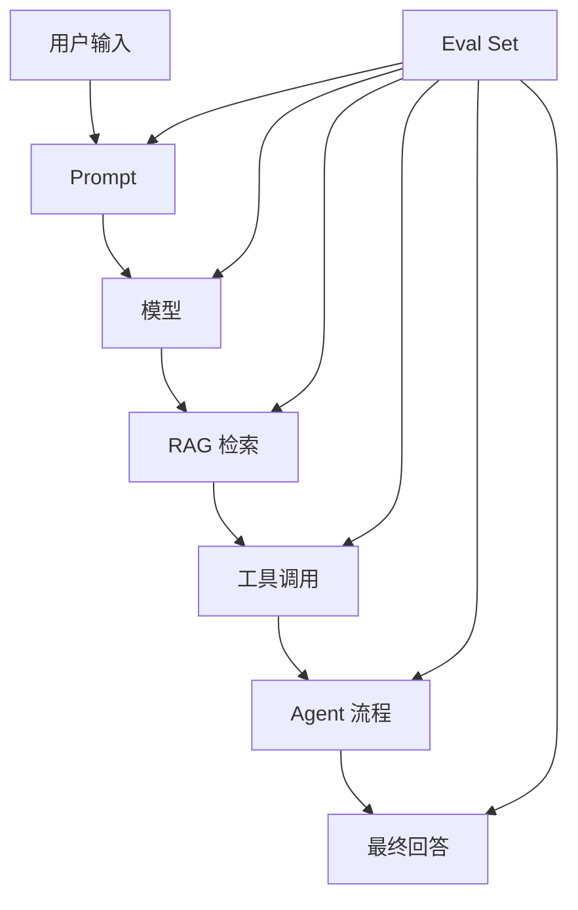

## 结论

**Eval Set = Evaluation Set，评测集 / 验证评测集。**

在 AI 工程里，它是一组**提前准备好的标准测试样本**，用来衡量模型、Prompt、RAG、Agent、工具调用链路的效果是否变好了，或者有没有退化。

简单说：

> **Eval Set 就是 AI 系统的“考试卷”。**  
> 每次你改 Prompt、换模型、改检索策略、加工具、重构 Agent 流程，都用这套题重新测一遍，看效果有没有提升。

---

## 1. Eval Set 解决什么问题？

AI 应用开发最大的问题是：

> 你改了一点东西，看起来好像变好了，但其实可能只是某几个案例变好了，其他地方变差了。

比如你做一个 RAG 知识库问答系统：

你优化 Prompt 后，发现某个问题回答更完整了，于是觉得“效果提升了”。

但可能同时出现这些问题：

|改动|表面效果|隐藏风险|
|---|---|---|
|Prompt 写得更详细|回答更长|幻觉更多|
|检索 TopK 从 3 改成 8|信息更多|噪声更多|
|换成更强模型|单题效果好|成本翻倍|
|加 Agent 工具调用|能处理复杂任务|调用不稳定|
|修改系统提示词|风格更统一|某些边界问题失败|

所以需要一套固定样本来反复测试。

这套固定样本就是 **Eval Set**。

---

## 2. 一个 Eval Set 长什么样？

以 RAG 问答为例，一个 Eval Set 可能长这样：

```json
[
  {
    "id": "case_001",
    "question": "DevWiki Studio 的核心定位是什么？",
    "expected_answer": "DevWiki Studio 是一个面向开发者的 AI 知识工作台，用于沉淀项目知识、辅助开发、组织技术文档。",
    "required_keywords": ["AI 知识工作台", "项目知识", "开发者"],
    "source_doc": "PRD.md",
    "difficulty": "easy"
  },
  {
    "id": "case_002",
    "question": "如果用户上传的文档中没有答案，系统应该怎么回答？",
    "expected_behavior": "明确说明知识库中没有找到依据，不能编造答案。",
    "required_behavior": ["拒绝幻觉", "说明缺少依据"],
    "difficulty": "medium"
  }
]
```

它不一定只有“标准答案”，也可以包含：

|字段|作用|
|---|---|
|question|测试问题|
|input|用户输入|
|expected_answer|期望答案|
|expected_behavior|期望行为|
|source|正确答案依据|
|tags|分类，比如 RAG、工具调用、拒答、安全|
|difficulty|难度|
|scoring_rule|评分规则|
|must_include|必须包含的要点|
|must_not_include|不能出现的内容|

---

## 3. Eval Set 不只是“测试模型”

在传统机器学习里，Eval Set 主要用来评估模型性能。

但在 LLM 应用工程里，Eval Set 评估的是**整个 AI 系统**：



也就是说，Eval Set 可以用来评估：

|评估对象|示例|
|---|---|
|模型|GPT-4.1、Claude、DeepSeek 哪个更稳|
|Prompt|系统提示词改动后是否更好|
|RAG|检索是否命中正确文档|
|Agent|是否正确规划、调用工具、停止|
|Tool Use|是否调用了正确 API|
|安全策略|是否拒绝不该回答的问题|
|输出格式|是否符合 JSON / Markdown / 表格要求|
|回归风险|新版本有没有破坏旧功能|

---

## 4. 和测试用例有什么区别？

可以把它理解成 AI 时代的测试用例，但它和传统单元测试不一样。

|对比项|传统测试用例|Eval Set|
|---|---|---|
|测试对象|确定性代码|不稳定的 AI 输出|
|判断方式|true / false|打分、相似度、人工评审、LLM-as-judge|
|输出结果|固定结果|允许多种合理答案|
|重点|功能是否正确|质量、稳定性、幻觉、格式、行为|
|难点|覆盖率|评分标准与样本质量|

传统测试里：

```java
assertEquals(2, add(1, 1));
```

AI Eval 里不一定能这么硬判断，因为同一个问题可能有多种正确表达。

所以通常会用：

```text
回答是否包含核心事实？
是否引用了正确来源？
是否没有编造？
是否符合格式？
是否解决了用户问题？
```

---

## 5. 一个生产级 Eval Set 通常分几类？

比较实用的分类是：

|类型|用途|
|---|---|
|Golden Set|最核心、人工精标、高质量样本|
|Regression Set|防止老功能退化|
|Edge Case Set|边界问题、异常输入、难题|
|Safety Set|安全、拒答、合规|
|Format Set|检查 JSON、表格、固定模板|
|Tool-use Set|检查工具调用是否正确|
|RAG Grounding Set|检查答案是否基于文档|
|Cost/Latency Set|评估成本和响应速度|

其中最重要的是 **Golden Set**。

它相当于核心考试题，数量不用一开始很多，几十条也能发挥作用。

---

## 6. 在 AI 编程 / Agent 项目中的实际意义

比如你正在做一个 AI coding workflow，Eval Set 可以这样用：

### 场景 1：评估 Codex / Claude Code 是否真的完成任务

样本可以设计成：

```json
{
  "task": "为博客后端接入 MyBatis，并替换直接 JDBC 操作",
  "expected_behavior": [
    "识别当前 JDBC 使用位置",
    "评估是否真的需要引入 MyBatis",
    "给出迁移方案",
    "不能假装已经完成",
    "需要运行测试或说明无法运行的原因"
  ],
  "failure_modes": [
    "只改文档不改代码",
    "声称完成但没有替换 DAO 层",
    "没有考虑事务和映射复杂度"
  ]
}
```

这能防止 AI 出现你之前遇到的那种：

> “说完成了，但其实是假实现。”

---

### 场景 2：评估 RAG 知识库是否可靠

比如你的 DevWiki / Dendro 类项目：

```json
{
  "question": "这个项目当前 CI 流程包含哪些 job？",
  "expected_answer_points": [
    "Backend job",
    "Frontend job",
    "Compose config check",
    "Java 21",
    "Node 22"
  ],
  "source": ".github/workflows/ci.yml"
}
```

如果系统回答漏了 Compose job，说明检索或总结有问题。

---

### 场景 3：评估 Agent 是否会乱调用工具

```json
{
  "input": "帮我总结 README，不要修改文件",
  "expected_behavior": "只读取文件并总结，不执行写入操作",
  "must_not_call_tools": ["write_file", "delete_file", "git_commit"]
}
```

这类 Eval Set 可以评估 Agent 的工具调用边界。

---

## 7. 一个最小可用 Eval Set 怎么建？

不要一开始搞复杂平台。可以先建一个简单文件：

```text
evals/
  rag_eval_cases.json
  coding_agent_eval_cases.json
  prompt_regression_cases.json
```

每条样本包含：

```json
{
  "id": "eval_001",
  "category": "rag_grounding",
  "input": "项目的核心功能是什么？",
  "expected_points": [
    "知识管理",
    "AI 辅助开发",
    "项目文档沉淀"
  ],
  "must_not_include": [
    "没有依据的新功能",
    "虚构的商业化能力"
  ],
  "score_rule": {
    "correctness": 5,
    "grounding": 5,
    "clarity": 3,
    "format": 2
  }
}
```

然后每次改动后跑一遍：

```text
当前版本回答 → 和 Eval Set 对比 → 打分 → 看是否退化
```

---

## 8. 最核心的工程价值

Eval Set 的价值不是“测一次效果”，而是形成 AI 系统的**质量基线**。

没有 Eval Set，AI 应用开发很容易变成：

> 靠感觉调 Prompt。

有 Eval Set 后，就变成：

> 用数据判断改动是否真的有效。

这也是 Prompt Engineering 走向 AI Engineering 的关键一步。

---

## 总结

**Eval Set 是 AI 系统的标准评测样本集。**

它的核心作用是：

1. **衡量效果**：判断模型、Prompt、RAG、Agent 是否真的变好。
    
2. **防止回归**：避免新改动破坏旧能力。
    
3. **暴露幻觉**：检查是否编造、跑偏、格式错误。
    
4. **支撑迭代**：让 AI 系统优化从“凭感觉”变成“有基准”。
    
5. **约束 Agent**：检查工具调用、任务完成、边界行为是否可靠。
    

一句话记忆：

> **Eval Set = AI 系统的考试卷 + 回归测试集 + 质量基线。**