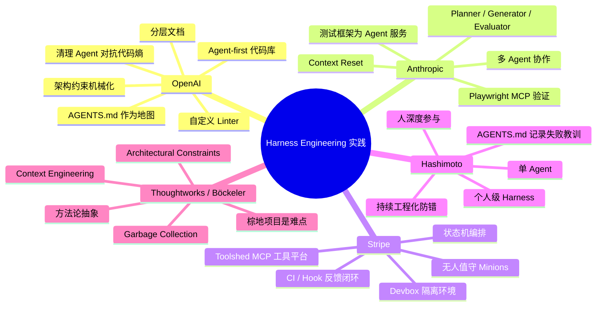

[案例来源参考](https://javaguide.cn/ai/agent/harness-engineering.html#harness-%E8%BF%98%E6%B2%A1%E8%A7%A3%E5%86%B3%E7%9A%84%E9%97%AE%E9%A2%98)

"现在Harness公开案例不少，但真正让人信服的方法论还不多，尤其是落到已有项目时，很多问题仍然悬着。

|问题|现状|谁在关注|
|---|---|---|
|棕地项目怎么改造|公开成功案例几乎都是绿地项目，缺少成熟方法论|Böckeler 把它比作“在从没用过静态分析的代码库上跑静态分析”。她还提出 Ambient Affordances：环境本身的结构特性，比如类型系统、模块边界、框架抽象，会影响 Harness 能做到什么程度|
|怎么验证 Agent 做对了事|大家更擅长限制它别做错，但验证功能正确性还很弱|Böckeler 批评：用 AI 生成的测试来验证 AI 生成的代码，仍然像“用同一双眼睛检查自己的作业”|
|AI 生成代码的长期可维护性|LLM 代码经常重新实现已有功能，长期效果还不好判断|Greg Brockman 提出过这个问题，但目前没有清晰答案|
|Harness 该做厚还是做薄|Manus 五次重写越做越简单，OpenAI 五个月越做越复杂|场景决定。通用产品更追求最小化，特定产品可以高度定制。模型变强后，已有 Harness 也应该定期简化，Anthropic 已经做过类似验证|
|单 Agent 还是多 Agent|Hashimoto 坚持单 Agent，Carlini 使用 16 个并行 Agent|规模决定。小项目单 Agent 往往够用，大项目更容易走向专业化分工|

绿地项目和棕地项目是软件工程里的经典说法。绿地项目指从零开始的新项目，没有历史包袱，就像在空地上盖房子，想怎么设计都比较自由。棕地项目指在已有代码库上改造，里面有历史架构、技术债和遗留逻辑，就像在老旧城区翻新，很多管线不能随便动。

OpenAI、Anthropic、Stripe、Hashimoto 这些案例基本都是在新项目里从零搭 Harness。但现实里，大多数团队面对的是跑了多年的老代码库。一个有十年历史、没有明确架构约束、到处是技术债的项目，怎么引入 Harness？目前还没有公开的成熟方法论。"

**不要把这些案例理解成“AI 很强，所以人不用写代码了”**，更准确的理解是：

> Harness Engineering 的核心不是“让模型更聪明”，而是**把模型放进一个可执行、可观测、可约束、可恢复的工程环境里**。  
> 模型负责生成与推理；Harness 负责边界、工具、状态、验证、恢复和质量治理。


---

# 1. 先用一张图理解这些案例



---

# 2. OpenAI 案例：重点不是“零手写代码”，而是“把仓库设计成 Agent 能理解的世界”

OpenAI 的案例最容易被误读。表面数字很夸张：从 2025 年 8 月开始，三名工程师驱动 Codex，在五个月内生成约 100 万行代码、合并约 1500 个 PR，并且坚持人类不直接手写代码。OpenAI 官方文章也明确说，这不是简单让 Agent 自由发挥，而是工程师转向设计系统、脚手架和约束。([OpenAI](https://openai.com/index/harness-engineering/?utm_source=chatgpt.com "Harness engineering: leveraging Codex in an agent-first ..."))

真正值得学的是三点。

## 2.1 AGENTS.md 不是超级 Prompt，而是“地图”

很多人一听 `AGENTS.md`，第一反应是把所有规范、架构、接口、注意事项都塞进去。这个方向是错的。

OpenAI 的思路是：

```text
AGENTS.md = 入口地图
docs/ = 深层资料库
lint / tests = 机械化约束
repo = 事实来源
```

也就是说，`AGENTS.md` 不负责装下全部知识，而是告诉 Agent：

- 这个仓库是什么；
    
- 你该先看哪些文档；
    
- 不同任务去哪里找规则；
    
- 不能违反哪些硬约束。
    

这就是 **Progressive Disclosure，渐进式披露**。先给 Agent 足够导航的信息，细节按需加载。JavaGuide 原文提到 OpenAI 的 `AGENTS.md` 约 100 行，更像目录，指向更深层的设计文档、架构图、执行计划和质量评级。([JavaGuide](https://javaguide.cn/ai/agent/harness-engineering.html "一文搞懂 Harness Engineering：六层架构、上下文管理与一线团队实战 | JavaGuide"))

对你这种 Codex + Claude Code 的项目，最直接的启发是：

> 不要让 `AGENTS.md` 变成一本大而全的百科。  
> 它应该是“项目作战地图”，不是“项目全量知识库”。

---

## 2.2 文档约束不够，必须机械化执行

OpenAI 案例里很关键的一句话是：**如果约束不能被机械化执行，Agent 就会偏离。**

比如他们定义了类似这样的架构方向：

```text
Types → Config → Repo → Service → Runtime → UI
```

这类依赖方向如果只写在文档里，Agent 迟早会犯错。真正有效的方式是：

- 自定义 Linter；
    
- 架构结构测试；
    
- CI 检查；
    
- 违反规则时给出可操作的修复说明。
    

这点对你的博客项目尤其重要。你之前遇到过“AI 说做完了，但后端 API 假实现/注释没加/结构不符合预期”的问题，本质就是：

> 规范只停留在 Prompt 和文档，没有进入可执行检查系统。

所以你后续要补的是：

```text
文档规范 → 代码规范检查
架构约束 → ArchUnit / 自定义脚本
接口约定 → OpenAPI / Contract Test
功能验收 → Playwright / 接口测试
完成标准 → CI 必须通过
```

---

## 2.3 代码熵要靠清理机制治理

AI 生成速度很快，但副作用是：

- 重复实现；
    
- 文档过期；
    
- 目录膨胀；
    
- 临时代码残留；
    
- 伪实现；
    
- 不一致的命名和抽象。
    

OpenAI 的做法不是相信 Agent 自动变好，而是引入清理机制。JavaGuide 提到他们先手动清理，后来用后台 Agent 定期扫描文档不一致、架构违规和冗余代码，并自动提交清理 PR。([JavaGuide](https://javaguide.cn/ai/agent/harness-engineering.html "一文搞懂 Harness Engineering：六层架构、上下文管理与一线团队实战 | JavaGuide"))

这对你的 AI coding 工作流非常关键。你现在的项目应该有一个固定节奏：

```text
功能开发 Batch
  ↓
自测
  ↓
人工验收
  ↓
代码审查
  ↓
架构清理
  ↓
复盘文档
  ↓
更新 AGENTS.md / 规则 / 测试
```

否则 AI 越帮越多，项目不一定越来越好，可能只是越来越乱。

---

# 3. Anthropic 案例：核心是“把长任务拆成可恢复、可验证的循环”

Anthropic 这组案例更偏“长链路 Agent 怎么稳定跑”。

## 3.1 Carlini 的 C 编译器：测试框架是给 Agent 用的，不是给人看的

Nicholas Carlini 用 16 个并行 Claude 实例、约 2000 个 Claude Code 会话、约 2 万美元 API 成本，做出了一个 10 万行 Rust 实现的 C 编译器；Anthropic 官方文章称它能构建 Linux 6.9，并可编译 QEMU、FFmpeg、SQLite、PostgreSQL、Redis，且在多数编译器测试套件包括 GCC torture test 上达到 99% 通过率。([Anthropic](https://www.anthropic.com/engineering/building-c-compiler?utm_source=chatgpt.com "Building a C compiler with a team of parallel Claudes"))

但重点不是“Claude 写了编译器”。重点是 Harness 设计：

```text
并行 Agent
  ↓
每个 Agent 跑测试子集
  ↓
日志写文件，减少上下文污染
  ↓
错误格式 grep 友好
  ↓
角色逐渐专业化
  ↓
去重 / 性能 / 文档 / 质量治理
```

Carlini 的一句话非常关键：**他是在为 Claude 写测试框架，不是为自己写。** JavaGuide 也引用了这个判断。([JavaGuide](https://javaguide.cn/ai/agent/harness-engineering.html "一文搞懂 Harness Engineering：六层架构、上下文管理与一线团队实战 | JavaGuide"))

这句话的工程含义很深：

> 人类喜欢看的日志，不一定适合 Agent。  
> 人类喜欢的说明文档，不一定适合 Agent。  
> 人类能靠经验跳过的信息，Agent 可能必须显式拿到。

所以 Harness 的设计对象不是“人类工程师体验”单独优化，而是：

```text
Human DX + Agent DX
```

你本地项目里的日志、报错、测试输出、目录结构，都要考虑 Agent 是否能读懂、定位、修复。

---

## 3.2 Anthropic 三智能体：把“做事”和“验收”分开

Anthropic Labs 的另一个案例是长时间应用开发 Harness。官方文章提到他们使用 generator/evaluator loop，并让 evaluator 通过 Playwright MCP 操作真实页面、截图、检查实现并评分。([Anthropic](https://www.anthropic.com/engineering/harness-design-long-running-apps?utm_source=chatgpt.com "Harness design for long-running application development"))

JavaGuide 里归纳成：

```text
Planner → Generator ⇄ Evaluator
```

分别对应：

|角色|职责|工程意义|
|---|---|---|
|Planner|把一句话需求扩展成规格|防止目标太模糊|
|Generator|按 Sprint 实现功能|控制任务粒度|
|Evaluator|用浏览器、测试、评分验证|避免 Agent 自我吹嘘|

这里最重要的是：**不要让同一个 Agent 自己写、自己夸、自己验收。**

你之前遇到的很多 AI coding 问题都属于这个范畴：

```text
Claude Code 实现
  ↓
Claude Code 自己说完成
  ↓
实际 API 没实现 / 前端没接好 / 注释没加 / 测试没跑
```

这不是单纯 Prompt 问题，而是验证架构问题。

更合理的是：

```text
实现 Agent：只负责改代码
审查 Agent：只负责找问题
验收脚本：负责机械化验证
人工：只看关键结果
```

这就是 Harness 的价值。

---

## 3.3 Context Reset：长任务不是一直压缩，而是“交接后重启”

Anthropic 还提到长上下文问题。JavaGuide 原文说，Sonnet 4.5 在上下文快满时会出现“上下文焦虑”，倾向于提前收工；他们采用 context resets：提取结构化交接文档，然后启动新的干净 Agent 继续。([JavaGuide](https://javaguide.cn/ai/agent/harness-engineering.html "一文搞懂 Harness Engineering：六层架构、上下文管理与一线团队实战 | JavaGuide"))

这个点对 Claude Code 非常现实。你已经遇到过 `/compact` 报错、上下文满后工作中断的问题。

更稳的做法不是等到 100% 再 `/compact`，而是主动设计交接机制：

```text
当 Context 达到 40%~60%
  ↓
生成 handoff.md
  ↓
记录：
  - 当前目标
  - 已完成内容
  - 未完成内容
  - 关键文件
  - 当前问题
  - 验收标准
  - 下一步指令
  ↓
新会话继续
```

这比临时压缩更像工程化方案。

---

# 4. Stripe 案例：核心是“Agent 进入企业研发流水线”

Stripe 的 Minions 案例代表另一个方向：高度自动化、无人值守、规模化运行。

Stripe 官方博客提到 Minions 是 one-shot、end-to-end coding agents；开发者可以通过 Slack 触发，Agent 完成理解任务、改代码、跑检查、提 PR 等流程。Stripe 还建设了 Toolshed，作为集中式 MCP 工具服务，提供接近 500 个内部工具。([stripe.dev](https://stripe.dev/blog/minions-stripes-one-shot-end-to-end-coding-agents?utm_source=chatgpt.com "Minions: Stripe's one-shot, end-to-end coding agents"))

它的核心不是“一个 Agent 很聪明”，而是**企业研发基础设施足够成熟**。

## 4.1 Devbox：每个 Agent 都有隔离开发环境

Stripe 的思路可以抽象成：

```text
任务输入
  ↓
分配隔离 Devbox
  ↓
拉取代码和上下文
  ↓
Agent 修改代码
  ↓
本地 lint / hook
  ↓
CI
  ↓
自动修复
  ↓
提交 PR
  ↓
人类 Review
```

这和你本地 Docker / Codex / Claude Code 的体验其实是一条线：

- 环境越标准，Agent 越稳定；
    
- 启动越快，试错成本越低；
    
- 检查越自动化，幻觉越容易暴露；
    
- 反馈越短，修复越高效。
    

所以普通团队不要先学 Stripe 的“每周 1300 PR”，而要学：

> 把 Agent 当成一个正式开发者，给它稳定、隔离、可重复的开发环境。

---

## 4.2 状态机编排：确定的地方别交给模型

Stripe 的 Minions 不是让模型控制所有流程，而是混合编排：

|类型|应该谁做|
|---|---|
|运行 lint|确定性脚本|
|push 代码|确定性流程|
|查询 CI 状态|工具|
|修改业务代码|Agent|
|根据错误修复|Agent|
|是否合并|人类 / 规则|

这点非常重要。

很多人做 Agent 系统会犯一个错误：**所有事情都交给模型判断**。这是不必要的，也不稳定。

正确做法是：

```text
能用程序规则解决的，不要交给 LLM。
需要语义判断、代码修改、方案权衡的，再交给 LLM。
```

这就是 Harness Engineering 和普通 Prompt Engineering 的差异。

---

## 4.3 Toolshed：MCP 工具不是越多越好，而是要筛选上下文

Stripe 的 Toolshed 提供大量内部工具，但每个 Minion 不会一次性拿到全部工具，而是拿到与任务相关的子集。JavaGuide 也提到 Stripe 有接近 500 个 MCP 工具，并给每个 Minion 筛选后的子集。([JavaGuide](https://javaguide.cn/ai/agent/harness-engineering.html "一文搞懂 Harness Engineering：六层架构、上下文管理与一线团队实战 | JavaGuide"))

这说明一个原则：

> 工具系统不是“工具越多越强”，而是“在正确任务里暴露正确工具”。

否则 Agent 会出现：

- 工具选择困难；
    
- 调错工具；
    
- 上下文污染；
    
- 调用成本上升；
    
- 失败路径变多。
    

这和你前面问的 Skill 路由、MCP 副作用入口，本质是同一个问题：**工具/Skill/上下文都需要路由和权限边界**。

---

# 5. Mitchell Hashimoto 案例：个人开发者更应该学这个

如果 OpenAI 和 Stripe 离普通开发者太远，那 Mitchell Hashimoto 的路线更适合你。

JavaGuide 提到他坚持单 Agent，不追求多 Agent 并发；他的 `AGENTS.md` 每一行都对应过去某次 Agent 失败案例。([JavaGuide](https://javaguide.cn/ai/agent/harness-engineering.html "一文搞懂 Harness Engineering：六层架构、上下文管理与一线团队实战 | JavaGuide"))

这个思路非常实用：

```text
Agent 犯错
  ↓
人类定位错误模式
  ↓
补一条规则
  ↓
补一个测试 / hook / checklist
  ↓
下次减少同类错误
```

这不是一次性写完的规范，而是一个**持续进化的防错系统**。

对你的项目，可以直接这么做：

```text
docs/ai-rules/
  ├── AGENTS.md                  # 入口地图
  ├── failure-cases.md           # AI 犯错案例库
  ├── backend-rules.md           # 后端规则
  ├── frontend-rules.md          # 前端规则
  ├── verification-checklist.md  # 验收清单
  └── handoff-template.md        # 上下文交接模板
```

每次 Claude Code / Codex 犯错，不要只骂它，也不要只改 Prompt，而是问：

> 这个错误能不能变成一条规则、一个测试、一个 Hook、一个 CI 检查、一个验收项？

这就是个人级 Harness Engineering。

---

# 6. Böckeler / Thoughtworks 的价值：把案例抽象成三类能力

Birgitta Böckeler 的价值不在于某个具体工具，而在于她把 Harness 能力抽象成三类。JavaGuide 归纳为：Context Engineering、Architectural Constraints、Garbage Collection。([JavaGuide](https://javaguide.cn/ai/agent/harness-engineering.html "一文搞懂 Harness Engineering：六层架构、上下文管理与一线团队实战 | JavaGuide"))

我换成更工程化的话说：

|能力|解决什么问题|你的项目对应做法|
|---|---|---|
|Context Engineering|Agent 该看什么|AGENTS.md、分层文档、handoff、Skill 路由|
|Architectural Constraints|Agent 不能乱改什么|ArchUnit、Checkstyle、ESLint、模块边界、DDD 分层约束|
|Garbage Collection|AI 生成物越来越乱怎么办|定期 code review、重复代码扫描、文档清理、废弃文件清理|

她还指出一个很现实的问题：公开成功案例多数偏绿地项目，而现实公司更多是棕地项目；老项目历史包袱重、模块边界不清、技术债多，接入 Harness 会更难。JavaGuide 对此也有总结。([JavaGuide](https://javaguide.cn/ai/agent/harness-engineering.html "一文搞懂 Harness Engineering：六层架构、上下文管理与一线团队实战 | JavaGuide"))

这点非常关键。你的 ZBlog / DevWiki / FlecBlog 改造就不是完全绿地项目，而是：

```text
已有代码 + 复用开源项目 + AI 增量改造 + 人工验收
```

所以你更需要的是**棕地 Harness**，不是照搬 OpenAI 的“从零 agent-first”。

---

# 7. 把这些案例合起来看：Harness 实践其实分四种路线

## 路线一：Agent-first 代码库

代表：OpenAI。

适合：

- 新项目；
    
- 可以从零设计目录和架构；
    
- 愿意大量投资规则、文档、检查；
    
- 团队目标是探索 AI-native 开发模式。
    

核心方法：

```text
地图式文档 + 机械化架构约束 + 自动清理 + 仓库即事实来源
```

---

## 路线二：多 Agent 长任务系统

代表：Anthropic。

适合：

- 复杂前端应用；
    
- 长链路生成；
    
- 需要主观质量评价；
    
- 单 Agent 容易自嗨的任务。
    

核心方法：

```text
Planner / Generator / Evaluator 分工
Context Reset
Playwright MCP
结构化交接
独立评估
```

---

## 路线三：企业级无人值守流水线

代表：Stripe。

适合：

- 企业内部研发平台；
    
- CI/CD 完善；
    
- 工具链成熟；
    
- 有大量重复性 PR；
    
- 有统一 Devbox 和内部工具平台。
    

核心方法：

```text
隔离环境 + 状态机编排 + MCP 工具平台 + CI 反馈闭环 + 人类最终 Review
```

---

## 路线四：个人开发者渐进式 Harness

代表：Mitchell Hashimoto。

适合：

- 个人项目；
    
- 小团队；
    
- 使用 Claude Code / Codex；
    
- 没有复杂平台能力；
    
- 但希望减少 AI 反复犯错。
    

核心方法：

```text
单 Agent
AGENTS.md
失败案例沉淀
任务交接模板
固定验收清单
小步开发
人类深度把关
```

对你当前最有价值的是**路线四 + 一部分路线一 + 一部分路线二**。

---

# 8. 映射到你的 AI Coding 工作流，应该怎么落地

你现在的问题不是“缺一个更强模型”，而是缺一套更稳定的本地 Harness。

建议你按这个顺序做。

## P0：先补最小 Harness

```text
1. 恢复 AGENTS.md
2. AGENTS.md 只做入口地图，不写成长文档
3. 建立 docs/ai-rules/
4. 建立 docs/ai-handoff.md 模板
5. 每个 batch 必须有验收清单
6. Claude Code 完成后必须跑：
   - 后端测试
   - 前端 build
   - type-check
   - docker compose config
7. Codex 负责审查，不直接相信 Claude Code 的完成声明
```

---

## P1：把规则变成可执行检查

Java 后端可以考虑：

```text
Checkstyle / Spotless      # 代码风格
ArchUnit                   # 分层架构约束
Maven test                 # 单元测试
SpringBootTest             # 集成测试
OpenAPI diff / contract    # 接口契约
```

前端可以考虑：

```text
ESLint
Prettier
vue-tsc / tsc
Vitest
Playwright
```

关键是：**不要只写“请遵守 DDD 架构”。**

要变成：

```text
Controller 不能直接调用 Repository
Application Service 不能依赖 Web 层
Domain 不能依赖 Infrastructure
DTO 不能泄漏到 Domain
```

然后用 ArchUnit 或脚本检查。

---

## P2：引入独立验收 Agent

你可以把 Codex 和 Claude Code 的职责拆开：

```text
Codex
  - 项目负责人
  - 制定计划
  - 拆 batch
  - 审查实现
  - 发现假实现
  - 生成验收标准

Claude Code
  - 按 batch 实现
  - 本地自测
  - 修复编译和测试问题
  - 输出变更说明

人工
  - UI 验收
  - 关键业务验收
  - 合并决策
```

不要让 Claude Code 既当开发，又当最终验收者。

---

# 9. 最后总结

这几个案例真正想说明的不是“AI 能不能替代程序员”，而是：

> AI Coding 的上限越来越取决于 Harness，而不是单次 Prompt。  
> 谁能把文档、工具、测试、环境、状态、反馈和约束组织好，谁就能更稳定地放大 Agent 能力。

对你最有用的结论是：

1. **AGENTS.md 要做成地图，不要做成超长说明书。**
    
2. **所有重要约束都要尽量机械化执行。**
    
3. **不能让实现 Agent 自己验收自己。**
    
4. **长任务要靠 handoff/context reset，而不是等上下文爆掉再补救。**
    
5. **每次 AI 犯错，都要沉淀成规则、测试、Hook 或验收项。**
    
6. **个人项目不要直接模仿 Stripe/OpenAI 的规模，先做个人级 Harness。**
    

一句话概括：

> Prompt 是“告诉 AI 怎么做”；  
> Context 是“给 AI 正确信息”；  
> Harness 是“搭一个系统，让 AI 做错时能被发现、被纠正、被约束、被恢复”。