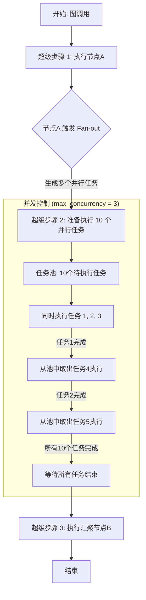

**LangGraph原生支持并发限流**，是其并发执行模型（自`0.1.0`版本起）的内置核心特性。

这个机制的核心是让你通过一个简单的配置参数`max_concurrency`，来控制工作流中并行执行的任务数量，从而防止资源耗尽或超出下游API的速率限制。

下面是核心配置与实现方式：

### 核心：`max_concurrency` 配置参数

LangGraph通过`max_concurrency`参数实现并发限流。它直接限制了在任何给定“超级步骤（Super-step）”中，允许并行运行的最大任务数。

*   **工作原理**：LangGraph的执行是按“超级步骤”进行的。在一个步骤中，所有被调度的节点会并行启动。`max_concurrency`就是作用于这个层面的“阀门”，确保并行任务数不超过设定值。
*   **底层实现**：该功能通过`asyncio.Semaphore`（信号量）实现，这是一种标准的并发控制原语。
*   **生效范围**：该限制不仅适用于通过`Send()` API动态创建的任务，也适用于静态定义的并行节点。

### Python 代码示例

以下是如何在代码中应用`max_concurrency`的两种典型方式：

**1. 在调用图时配置**

最直接的方式是在调用图的`.invoke()`或`.stream()`方法中，通过`config`参数传入：

```python
from langgraph.graph import StateGraph, MessagesState
from langgraph.constants import START

# 假设你已经定义并编译好了你的图
# graph = builder.compile()

# 在调用时通过 config 设置最大并发数
config = {"max_concurrency": 5}  # 限制最大并发数为5

# 调用图
# graph.invoke(initial_state, config=config)
```

**2. 使用 `patch_config` 辅助函数**

LangGraph也提供了`patch_config`函数，用于在已有配置的基础上修改或添加`max_concurrency`参数：

```python
from langgraph._internal._config import patch_config

# 假设你有一个基础配置
base_config = {"some_other_key": "value"}

# 使用 patch_config 添加并发限制
final_config = patch_config(base_config, max_concurrency=10)
```

### 并发执行流程图

下图展示了`max_concurrency`如何在一个Fan-out（扇出）场景中工作：



**流程说明**：
1.  图开始执行，进入第一个超级步骤。
2.  节点A执行完毕后，通过Fan-out产生了10个需要并行处理的任务。
3.  进入下一个超级步骤时，`max_concurrency=3`的限制生效。系统不会同时启动所有10个任务，而是维护一个任务池，始终保持最多3个任务在运行。
4.  每当一个任务完成，系统会立即从任务池中取出下一个任务开始执行。
5.  直到所有10个任务全部完成，才会进入下一个超级步骤，执行汇聚节点B。

### 最佳实践与注意事项

*   **无硬性上限**：LangGraph本身对Fan-out的任务数量没有硬编码限制，你可以通过`max_concurrency`根据实际情况灵活调整。
*   **平台默认值**：在LangGraph云平台或自托管服务中，每个实例默认的并发运行数为10。部署时需留意此默认值。
*   **数据库连接池**：当使用PostgreSQL进行状态持久化时，还可通过环境变量`LANGGRAPH_POSTGRES_POOL_MAX_SIZE`等控制数据库连接池的大小，这是另一层资源保护。
*   **节点级重试**：建议为可能因限流而失败的节点（如LLM调用）配置`RetryPolicy`，提高系统的健壮性。
*   **状态合并**：在并行节点中，如果多个节点要写入同一个状态键，必须定义`Reducer`（归并函数）来合并更新，否则会引发`INVALID_CONCURRENT_GRAPH_UPDATE`错误。

总的来说，LangGraph通过`max_concurrency`参数提供了声明式、原生且高效的并发限流能力，是构建生产级LLM应用的关键特性之一。