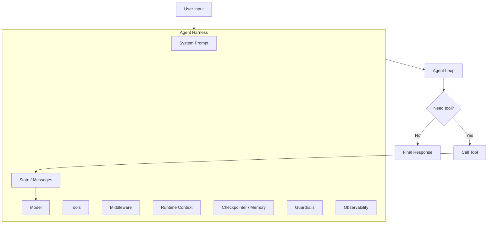

## 1. 一句话解释 Agent Harness

**Agent Harness = Agent 外面的“运行时外壳”。**

LangChain 官方文档直接给了一个很关键的公式：

> **Agent = Model + Harness**

其中 **Agent** 是“模型反复调用工具，直到任务完成”的循环；而 **Harness** 是围绕这个循环的一整套运行机制：模型、提示词、工具、状态、上下文、middleware、错误处理、护栏、人类审批、可观测性等。LangChain 文档明确说，harness 的职责是：**在给定任务中，在正确的时间把正确的上下文交给模型**。([Docs by LangChain](https://docs.langchain.com/oss/python/langchain/agents "Agents - Docs by LangChain"))

---

## 2. 先区分：Agent、Agent Loop、Agent Harness

### Agent

LangChain 官方定义很直接：

**Agent = model calling tools in a loop until a given task is complete.**

也就是：

```text
用户任务
  ↓
模型思考 / 决策
  ↓
决定是否调用工具
  ↓
执行工具
  ↓
工具结果回到模型上下文
  ↓
模型继续决策
  ↓
直到不再调用工具，输出最终答案
```

这个循环本身就是 **Agent Loop**。([Docs by LangChain](https://docs.langchain.com/oss/python/langchain/agents "Agents - Docs by LangChain"))

### Harness

但是生产环境里的 Agent 不可能只有这个裸循环。你还需要：

|问题|Harness 负责的能力|
|---|---|
|模型该用哪个？|model 配置、动态模型选择|
|模型能调用什么？|tools 注册、工具权限、工具选择|
|模型拿到哪些上下文？|system prompt、memory、runtime context|
|上下文太长怎么办？|summarization、short-term memory、long-term memory|
|工具失败怎么办？|retry、fallback、call limit|
|敏感数据怎么办？|PII 检测、guardrails|
|高危操作怎么办？|human-in-the-loop approval|
|怎么调试？|streaming、tracing、LangSmith observability|
|怎么组合复杂流程？|LangGraph workflow / subgraph / multi-agent|

所以 **Harness 不是某个单独类，而是一组围绕 Agent Loop 的工程化机制**。

---

## 3. LangChain 里的 `create_agent` 本质上就是一个可配置 Harness

官方文档里说，`create_agent` 是一个 **highly configurable harness**。最简单的形式是：([Docs by LangChain](https://docs.langchain.com/oss/python/langchain/agents "Agents - Docs by LangChain"))

```python
from langchain.agents import create_agent

agent = create_agent(
    model="openai:gpt-5.5",
    tools=tools,
)
```

这个代码表面看很简单，但它背后已经帮你组装了：

```text
Model
Tools
Messages State
Agent Loop
LangGraph Runtime
Middleware Hooks
Invocation / Streaming
Optional Checkpointer
Optional Runtime Context
```

更完整一点：

```python
from langchain.agents import create_agent
from langchain.tools import tool


@tool
def search(query: str) -> str:
    """Search for information."""
    return f"Results for: {query}"


agent = create_agent(
    model="openai:gpt-5.5",
    tools=[search],
    system_prompt="You are a precise research assistant. Use tools when needed.",
)
```

这里的 `model + tools + system_prompt` 就是最小 Harness。

---

## 4. Agent Harness 的核心结构

可以这样理解：



更口语一点：

> **Agent 是会动脑和调工具的核心循环；Harness 是让这个循环安全、可控、可恢复、可观测、可扩展的工程外壳。**

---

## 5. Harness 的几个关键组成

### 5.1 Model：模型不是 Agent，模型只是决策核心

在 LangChain 里，`model` 可以传字符串，比如 `"provider:model"`，也可以传初始化后的模型实例。官方文档强调，模型只是 Agent 的核心组件之一。([Docs by LangChain](https://docs.langchain.com/oss/python/langchain/agents "Agents - Docs by LangChain"))

```python
agent = create_agent(
    model="openai:gpt-5.5",
    tools=[search],
)
```

模型负责：

```text
理解任务
判断是否需要工具
生成 tool call
读取工具结果
继续推理
输出最终答案
```

但它不负责：

```text
工具执行
状态持久化
重试
审批
PII 脱敏
日志追踪
上下文压缩
```

这些就是 Harness 做的。

---

### 5.2 Tools：Agent 的行动能力

LangChain 支持把 Python callable、LangChain tool、tool dict 传给 Agent。官方文档示例里用 `@tool` 把普通函数包装成工具。([Docs by LangChain](https://docs.langchain.com/oss/python/langchain/agents "Agents - Docs by LangChain"))

```python
from langchain.tools import tool


@tool
def get_order_status(order_id: str) -> str:
    """Get order status by order id."""
    # 真实项目里这里会查数据库或调用订单服务
    return f"Order {order_id} is shipped."


agent = create_agent(
    model="openai:gpt-5.5",
    tools=[get_order_status],
    system_prompt="You are a customer service agent.",
)
```

工具是 Agent 和外部系统的边界。比如：

```text
RAG 检索
数据库查询
HTTP API 调用
MCP Server 工具
发邮件
写文件
执行代码
查订单
创建工单
```

裸模型只能生成文本；加上工具之后，Agent 才能“行动”。

---

### 5.3 System Prompt：控制 Agent 的行为风格和任务边界

官方文档说，`system_prompt` 用来 shape how the agent approaches tasks。静态 prompt 可以直接传字符串；动态 prompt 可以通过 middleware 实现。([Docs by LangChain](https://docs.langchain.com/oss/python/langchain/agents "Agents - Docs by LangChain"))

```python
agent = create_agent(
    model="openai:gpt-5.5",
    tools=[search],
    system_prompt=(
        "You are a backend troubleshooting agent. "
        "Use tools before making claims about system state. "
        "Be concise and include evidence."
    ),
)
```

但要注意：

> **Prompt 不是 Harness 的全部。**

很多生产级约束不能只靠 prompt，比如：

```text
不允许调用高危工具
调用失败自动重试
用户审批后再发邮件
PII 自动脱敏
超过 token 自动总结
```

这些要靠 middleware、runtime、guardrails、workflow 机制实现。

---

### 5.4 State：Agent 不是每一步都从零开始

LangChain Agent 调用时，本质上是给它传一个 state update。官方文档说，所有 agent state 都包含一组 messages；如果要持久化和恢复对话历史，需要配置 checkpointer，并在调用时传 `thread_id`。([Docs by LangChain](https://docs.langchain.com/oss/python/langchain/agents "Agents - Docs by LangChain"))

```python
from langchain.agents import create_agent
from langchain_core.utils.uuid import uuid7
from langgraph.checkpoint.memory import InMemorySaver

agent = create_agent(
    model="openai:gpt-5.5",
    tools=[search],
    checkpointer=InMemorySaver(),
)

config = {
    "configurable": {
        "thread_id": str(uuid7())
    }
}

result = agent.invoke(
    {"messages": [{"role": "user", "content": "帮我查一下这个订单状态"}]},
    config=config,
)
```

这里的 `thread_id` 很重要。它决定这次调用属于哪个会话线程。官方文档明确区分了：

|概念|作用|
|---|---|
|`thread_id`|作用于 conversation history、checkpoint、恢复执行|
|`context`|传递本次运行的用户 ID、API key、feature flags、依赖对象等|

LangChain 文档说，`thread_id` 负责限定对话和 checkpoint 范围，而 `context` 用于工具和 middleware 在调用时读取每次运行的数据。([Docs by LangChain](https://docs.langchain.com/oss/python/langchain/agents "Agents - Docs by LangChain"))

---

## 6. Middleware：Harness 的核心扩展点

如果只记一个重点，记这个：

> **LangChain Agent Harness 的主要扩展机制是 middleware。**

官方文档说，middleware 可以控制和定制 Agent 执行过程的每一步，可用于日志、分析、调试、prompt 转换、工具选择、输出格式化、重试、fallback、提前终止、rate limit、guardrails、PII 检测等。([Docs by LangChain](https://docs.langchain.com/oss/python/langchain/middleware/overview "Overview - Docs by LangChain"))

它不是外置旁路，而是挂在 Agent Loop 里的不同生命周期点上。

简化理解：

```text
before_agent
  ↓
before_model
  ↓
model call
  ↓
after_model
  ↓
tool call
  ↓
after_tool
  ↓
after_agent
```

不是所有名字都必须你手写，但思路就是：**在模型调用前后、工具调用前后、Agent 执行前后插入控制逻辑**。

---

## 7. Harness 具体能配置什么？

LangChain 官方在 Agent 文档里把 harness 的配置能力分成几类：执行环境、上下文管理、规划与委派、容错、护栏、人工干预。([Docs by LangChain](https://docs.langchain.com/oss/python/langchain/agents "Agents - Docs by LangChain"))

### 7.1 Execution Environment：执行环境

Agent 要真正做事，需要 workspace、filesystem、sandbox、code execution、tools。官方文档把这些归到 execution environment。([Docs by LangChain](https://docs.langchain.com/oss/python/langchain/agents "Agents - Docs by LangChain"))

比如一个 coding agent，需要：

```text
读文件
写文件
执行 shell
跑测试
保存中间产物
跨轮次读取工作区状态
```

这就是为什么 Claude Code、Codex 这种产品不只是“模型 + 工具”，而是有完整 Harness：

```text
模型
工具
文件系统
终端
任务状态
权限控制
上下文压缩
diff 展示
人工确认
失败恢复
```

---

### 7.2 Context Management：上下文管理

官方文档说，模型上下文窗口是固定的；Agent 执行过程中会不断积累历史、工具结果、中间步骤，因此需要 summarization、memory、skills、prompt caching 等机制。([Docs by LangChain](https://docs.langchain.com/oss/python/langchain/agents "Agents - Docs by LangChain"))

这就是你之前学的 **Context Engineering** 和 **Agent Harness** 的连接点。

```text
Context Engineering = 研究如何给模型组织上下文
Agent Harness = 在 Agent 运行时把这些上下文机制工程化落地
```

例如：

```python
from langchain.agents import create_agent
from langchain.agents.middleware import SummarizationMiddleware

agent = create_agent(
    model="openai:gpt-5.5",
    tools=[search],
    middleware=[
        SummarizationMiddleware(
            model="openai:gpt-5.5",
            max_tokens_before_summary=4000,
        )
    ],
)
```

上面代码表达的是：当对话或工具结果太长时，由 middleware 对历史进行总结，避免上下文爆掉。

---

### 7.3 Fault Tolerance：容错

Agent 生产环境常见问题：

```text
模型超时
限流
工具 API 失败
网络异常
数据库连接失败
第三方接口 500
工具返回格式异常
```

LangChain 官方文档把 retry、fallback、call limit 放在 fault tolerance 里，并给了 `ModelRetryMiddleware` 和 `ToolRetryMiddleware` 的示例。([Docs by LangChain](https://docs.langchain.com/oss/python/langchain/agents "Agents - Docs by LangChain"))

```python
from langchain.agents import create_agent
from langchain.agents.middleware import ModelRetryMiddleware, ToolRetryMiddleware

agent = create_agent(
    model="openai:gpt-5.5",
    tools=[search],
    middleware=[
        ModelRetryMiddleware(max_retries=3),
        ToolRetryMiddleware(max_retries=2),
    ],
)
```

这就对应你之前那个面试题：

> 工具重试 3 次以上还是失败怎么办？

生产级 Harness 里不能无限重试，而是要：

```text
1. 判断是否是 transient failure
2. 有上限重试
3. 失败后降级 / fallback
4. 给模型返回结构化错误
5. 必要时终止 Agent Loop
6. 记录 trace 和告警
7. 对用户返回可解释失败原因
```

---

### 7.4 Guardrails：安全护栏

官方文档强调，有些 policy 不能只放在 prompt 里，因为需要确定性执行。Guardrails 会拦截 Agent Loop 中的数据流，在工具结果进入模型上下文之前执行合规或内容策略。([Docs by LangChain](https://docs.langchain.com/oss/python/langchain/agents "Agents - Docs by LangChain"))

比如：

```python
from langchain.agents import create_agent
from langchain.agents.middleware import PIIMiddleware

agent = create_agent(
    model="openai:gpt-5.5",
    tools=[search],
    middleware=[
        PIIMiddleware("email")
    ],
)
```

这个思路很关键：

```text
Prompt 约束：软约束，模型可能不遵守
Middleware / Guardrails：硬约束，代码层面强制执行
```

所以面试里可以这样讲：

> 对高风险 Agent，不能只靠 system prompt 说“不要泄露隐私”。需要在 Harness 层加入输入过滤、工具调用权限、PII 脱敏、输出检查、审批流和审计日志。

---

### 7.5 Human-in-the-loop：人工干预

官方文档说，完全自治不总是合适的；对于破坏性写操作、昂贵 API 调用或需要判断的行为，可以在人类审批点暂停 Agent，等人工批准、编辑或拒绝后继续执行。([Docs by LangChain](https://docs.langchain.com/oss/python/langchain/agents "Agents - Docs by LangChain"))

例如：

```python
from langchain.agents import create_agent
from langchain.agents.middleware import HumanInTheLoopMiddleware

agent = create_agent(
    model="openai:gpt-5.5",
    tools=[read_email, send_email],
    middleware=[
        HumanInTheLoopMiddleware(
            interrupt_on={
                "send_email": True
            }
        )
    ],
)
```

这就是典型 Harness 能力：

```text
读邮件：允许自动执行
发邮件：必须人工审批
删数据：必须人工审批
转账：必须人工审批
生产环境写操作：必须审批或二次确认
```

---

## 8. Runtime：Harness 里的依赖注入机制

LangChain 官方文档说，`create_agent` 底层运行在 LangGraph runtime 上；Runtime 里包含 context、store、stream writer、execution info、server info 等信息。([Docs by LangChain](https://docs.langchain.com/oss/python/langchain/runtime "Runtime - Docs by LangChain"))

这很像后端里的：

```text
RequestContext
SecurityContext
TenantContext
TraceContext
Dependency Injection Container
```

比如你希望工具知道当前用户是谁：

```python
from dataclasses import dataclass
from langchain.agents import create_agent
from langchain.tools import tool, ToolRuntime


@dataclass
class Context:
    user_id: str


@tool
def fetch_user_profile(runtime: ToolRuntime[Context]) -> str:
    """Fetch current user's profile."""
    user_id = runtime.context.user_id
    # 真实项目里可以根据 user_id 查数据库
    return f"Profile for user: {user_id}"


agent = create_agent(
    model="openai:gpt-5.5",
    tools=[fetch_user_profile],
    context_schema=Context,
)

result = agent.invoke(
    {"messages": [{"role": "user", "content": "查一下我的资料"}]},
    context=Context(user_id="user-123"),
)
```

重点是：**不要在工具里写死用户 ID、API key、数据库连接。**

应该通过 runtime context 注入：

```text
当前用户
租户 ID
权限范围
feature flag
trace id
数据库连接
业务配置
```

官方文档也明确说，runtime context 提供 dependency injection，避免 hardcoding 或 global state，让工具更可测试、可复用、灵活。([Docs by LangChain](https://docs.langchain.com/oss/python/langchain/runtime "Runtime - Docs by LangChain"))

---

## 9. LangChain Agent Harness 和 LangGraph 的关系

这是很容易混淆的点。

官方 middleware 文档说：**middleware 不是一个独立 runtime；hook 运行在 `create_agent` 返回的已编译 LangGraph 内部。** 你可以把整个 agent，包括 middleware，作为节点或子图放进更大的 `StateGraph` 里。([Docs by LangChain](https://docs.langchain.com/oss/python/langchain/middleware/overview "Overview - Docs by LangChain"))

也就是说：

```text
LangChain create_agent
    ↓
内部基于 LangGraph runtime
    ↓
返回一个可执行 Agent Graph
    ↓
可以单独 invoke
    ↓
也可以嵌入更大的 LangGraph workflow
```

例如：

```text
用户输入
  ↓
分类节点 classify
  ↓
路由 route
  ├── 普通问答 Agent
  ├── 邮件 Agent
  └── 工单 Agent
```

每个 Agent 自己都有 Harness：

```text
邮件 Agent Harness:
- read_email tool
- send_email tool
- send_email 前人工审批
- PII 检测
- retry
- trace

工单 Agent Harness:
- search_ticket tool
- create_ticket tool
- SLA policy
- retry
- trace
```

所以可以这样区分：

|概念|作用|
|---|---|
|`create_agent`|快速创建一个带 Harness 的 Agent|
|Middleware|扩展 Agent Loop 行为|
|Runtime|给工具和 middleware 注入上下文、store、执行信息|
|LangGraph|承载 Agent 的底层图运行时，也可编排更复杂 workflow|
|Harness|上述能力组合起来形成的 Agent 工程外壳|

---

## 10. 用一个订单客服 Agent 例子串起来

假设你要做一个“订单客服 Agent”：

```text
用户：我的订单怎么还没到？
Agent：
1. 识别用户意图
2. 读取当前 user_id
3. 调用订单查询工具
4. 如果工具失败，自动重试
5. 如果发现需要退款，创建退款申请前要求人工审批
6. 如果包含手机号/邮箱，做 PII 处理
7. 输出结果
8. 全链路进入 trace
```

简化代码：

```python
from dataclasses import dataclass

from langchain.agents import create_agent
from langchain.tools import tool, ToolRuntime
from langchain.agents.middleware import (
    ModelRetryMiddleware,
    ToolRetryMiddleware,
    HumanInTheLoopMiddleware,
    PIIMiddleware,
)


@dataclass
class Context:
    user_id: str


@tool
def get_order_status(order_id: str, runtime: ToolRuntime[Context]) -> str:
    """Query order status by order id."""
    user_id = runtime.context.user_id

    # 真实项目里这里应校验：这个订单是否属于当前 user_id
    # 避免用户越权查询别人的订单
    return f"user={user_id}, order={order_id}, status=shipping"


@tool
def create_refund_request(order_id: str, reason: str, runtime: ToolRuntime[Context]) -> str:
    """Create a refund request for the user's order."""
    user_id = runtime.context.user_id

    # 真实项目里这里会写数据库 / 调用退款服务
    return f"refund request created for user={user_id}, order={order_id}, reason={reason}"


agent = create_agent(
    model="openai:gpt-5.5",
    tools=[
        get_order_status,
        create_refund_request,
    ],
    system_prompt=(
        "You are a customer service agent. "
        "Use tools to verify order status before answering. "
        "Do not create refund requests unless the user clearly asks for it."
    ),
    context_schema=Context,
    middleware=[
        # 模型调用失败时重试
        ModelRetryMiddleware(max_retries=3),

        # 工具调用失败时重试
        ToolRetryMiddleware(max_retries=2),

        # 识别和处理 email 这类 PII
        PIIMiddleware("email"),

        # 创建退款申请属于高影响操作，需要人工审批
        HumanInTheLoopMiddleware(
            interrupt_on={
                "create_refund_request": True
            }
        ),
    ],
)


result = agent.invoke(
    {
        "messages": [
            {
                "role": "user",
                "content": "我的订单 O123 怎么还没到？如果丢了就帮我退款。"
            }
        ]
    },
    context=Context(user_id="user-001"),
)
```

这个例子里，真正的 Harness 包括：

```text
model
tools
system_prompt
context_schema
runtime context
retry middleware
PII middleware
human-in-the-loop middleware
agent state
LangGraph runtime
```

这已经不是“调一次大模型 API”了，而是一个可控的 Agent 应用运行框架。

---

## 11. 面试表达：什么是 Agent Harness？

可以这样答：

> Agent Harness 是 Agent 外围的工程运行时，用来支撑模型在多轮循环中安全、稳定、可控地使用工具完成任务。裸 Agent Loop 只是“模型判断是否调用工具，工具结果再回到模型，直到任务完成”；而 Harness 负责把模型、系统提示词、工具、状态、上下文、memory、middleware、重试、fallback、guardrails、human-in-the-loop、streaming、trace 和部署运行时组合起来。以 LangChain 为例，`create_agent` 本质上就是一个可配置 Harness，底层运行在 LangGraph runtime 上，middleware 可以插入模型调用前后、工具调用前后等生命周期，用来做上下文管理、容错、安全护栏和人工审批。生产级 Agent 重点不只是让模型会调用工具，而是让整个工具调用循环可恢复、可观测、可审计、可限制、可扩展。

更短版本：

> Agent Harness 就是围绕 Agent Loop 的工程外壳。Agent Loop 解决“模型如何循环调用工具完成任务”，Harness 解决“这个循环如何在生产环境里安全、稳定、可控、可观测地运行”。

---

## 12. 你可以这样建立知识框架

```text
Agent Harness
├── Agent Loop
│   ├── model call
│   ├── tool selection
│   ├── tool execution
│   └── final response
├── Context
│   ├── messages
│   ├── system prompt
│   ├── runtime context
│   ├── memory
│   └── summarization
├── Tools
│   ├── Python tools
│   ├── API tools
│   ├── MCP tools
│   └── business tools
├── Control
│   ├── middleware
│   ├── retries
│   ├── fallbacks
│   ├── call limits
│   └── early termination
├── Safety
│   ├── guardrails
│   ├── PII detection
│   ├── permission checks
│   └── human approval
└── Production
    ├── streaming
    ├── tracing
    ├── evaluation
    ├── observability
    └── deployment
```

## 13. 最关键的理解

你不要把 Agent Harness 理解成“LangChain 新出了一个叫 Harness 的类”。

更准确的理解是：

> **Harness 是一种架构概念。LangChain 用 `create_agent + middleware + runtime + LangGraph` 这一套机制来实现 Agent Harness。**

裸 Agent 关注的是：

```text
模型能不能调用工具？
```

Agent Harness 关注的是：

```text
模型在什么时候拿到什么上下文？
能调用哪些工具？
失败后怎么处理？
高危操作谁审批？
上下文爆了怎么办？
多轮状态怎么恢复？
调用链怎么追踪？
结果怎么评估？
线上怎么部署和治理？
```

这就是从“会写 Agent Demo”到“能做生产级 Agent 应用”的分水岭。