# LangGraph 工具调用完整流程深度解析

> 本文基于本地 LangGraph 1.x 源代码、官方文档（langchain-ai.github.io/langgraph 与 docs.langchain.com）以及多篇高质量技术文章，系统讲解 LangGraph 工具调用（Tool Calling）的完整流程。适合有一定 Python 与 LLM 应用开发基础的读者参考。
>
> **源码版本**：langgraph 1.x（源码包相对路径根目录：`langgraph/`）
>
> **核心源码文件**：
> - [tool_node.py](langgraph/prebuilt/tool_node.py) — ToolNode 实现
> - [chat_agent_executor.py](langgraph/prebuilt/chat_agent_executor.py) — create_react_agent 实现
> - [message.py](langgraph/graph/message.py) — add_messages reducer
> - [types.py](langgraph/types.py) — Command / interrupt / Send

---

## 目录

- [1. 概述与核心概念](#1-概述与核心概念)
- [2. 整体架构与数据流](#2-整体架构与数据流)
- [3. 初始化配置：模型绑定与 ToolNode 构建](#3-初始化配置模型绑定与-toolnode-构建)
- [4. 节点定义：agent 节点与 tools 节点](#4-节点定义agent-节点与-tools-节点)
- [5. 边连接：普通边与条件边](#5-边连接普通边与条件边)
- [6. 状态管理：MessagesState 与 add_messages reducer](#6-状态管理messagesstate-与-add_messages-reducer)
- [7. 工具调用触发机制：从 AIMessage.tool_calls 到路由](#7-工具调用触发机制从-aimessagetool_calls-到路由)
- [8. 工具执行：ToolNode 内部流程与并行调用](#8-工具执行toolnode-内部流程与并行调用)
- [9. 结果处理：ToolMessage 与 Command](#9-结果处理toolmessage-与-command)
- [10. 错误处理：从工具级到节点级](#10-错误处理从工具级到节点级)
- [11. 人机协作：interrupt 与 Command(resume=...)](#11-人机协作interrupt-与-commandresume)
- [12. 流式输出：stream_mode 与事件流](#12-流式输出stream_mode-与事件流)
- [13. 完整时序图与流程图](#13-完整时序图与流程图)
- [14. 最佳实践与生产建议](#14-最佳实践与生产建议)
- [15. 参考资料速查表](#15-参考资料速查表)

---

## 1. 概述与核心概念

LangGraph 是 LangChain 团队推出的图式工作流编排框架，工具调用（Tool Calling）是其 Agent 能力的核心。一次完整的工具调用闭环涉及以下关键对象：

| 对象 | 作用 | 来源 |
|---|---|---|
| `BaseChatModel.bind_tools()` | 把工具 schema 注册到模型 | LangChain Core |
| `AIMessage.tool_calls` | 模型决策出的工具调用列表 | LangChain Core |
| `ToolCall` | 单次工具调用描述（name/args/id/type） | LangChain Core |
| `ToolNode` | 图节点，解析 tool_calls 并执行工具 | LangGraph prebuilt |
| `ToolMessage` | 工具执行结果消息，通过 `tool_call_id` 配对 | LangChain Core |
| `tools_condition` | 条件边路由函数（判断是否调用工具） | LangGraph prebuilt |
| `Command` | 工具/节点返回值，组合状态更新与跳转 | LangGraph types |
| `interrupt()` | 在节点内暂停图，等待人工恢复 | LangGraph types |
| `add_messages` reducer | 消息列表合并规则（按 ID 替换/追加） | LangGraph graph.message |

**ReAct 循环本质**：模型生成带 `tool_calls` 的 `AIMessage` → `ToolNode` 执行并返回 `ToolMessage` → 模型读取 `ToolMessage` 决定下一步 → 直到模型不再请求工具调用，返回最终 `AIMessage`。

---

## 2. 整体架构与数据流

LangGraph 工具调用是一个由 Pregel 启发的 super-step 执行模型，每个 super-step 内的节点在收到 incoming message 时被激活，处理完成后无 incoming message 时投票 halt。

### 2.1 整体架构图

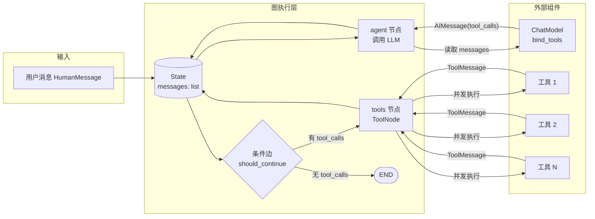

### 2.2 数据流概览

```mermaid
flowchart TD
    H[HumanMessage<br/>'查天气'] --> AI1[AIMessage<br/>content=''<br/>tool_calls=[get_weather]
    AI1 --> TM[ToolMessage<br/>content='晴 25°C'<br/>tool_call_id=xxx]
    TM --> AI2[AIMessage<br/>content='北京今天晴 25°C']
    AI2 --> END_F([最终响应])

    style AI1 fill:#ffe4b5
    style TM fill:#b5ffe4
    style AI2 fill:#ffe4b5
```

---

## 3. 初始化配置：模型绑定与 ToolNode 构建

### 3.1 定义工具

LangGraph 工具调用复用 LangChain 的 `@tool` 装饰器，工具签名通过类型注解自动生成 JSON Schema 供模型使用：

```python
from langchain_core.tools import tool

@tool
def get_weather(location: str) -> str:
    """获取指定城市的当前天气。  # ← docstring 作为工具描述传给 LLM
    Args:
        location: 城市名（支持中英文），例如 '北京' 或 'sf'
    """
    if location.lower() in ["sf", "san francisco"]:
        return "It's 60 degrees and foggy."
    return f"{location}: 晴 25°C"
```

### 3.2 绑定工具到 ChatModel

`bind_tools()` 把工具 schema 注册到模型，模型在推理时可以选择生成 `tool_calls`：

```python
from langchain.chat_models import init_chat_model

# 使用 init_chat_model 统一初始化，避免不同 provider 的差异
model = init_chat_model(model="claude-3-5-haiku-latest")
model_with_tools = model.bind_tools([get_weather])

# 调用后，若模型决定调用工具，返回的 AIMessage 会带 tool_calls 字段
response: AIMessage = model_with_tools.invoke("sf 天气如何？")
# response.tool_calls == [{'name': 'get_weather', 'args': {'location': 'sf'}, 'id': 'toolu_xxx', 'type': 'tool_call'}]
```

### 3.3 构建 ToolNode

`ToolNode` 是 LangGraph 预构建的工具执行节点，源码位于 [tool_node.py](langgraph/prebuilt/tool_node.py)。其构造签名（来自源码 743-757 行）：

```python
class ToolNode(RunnableCallable):
    def __init__(
        self,
        tools: Sequence[BaseTool | Callable],
        *,
        name: str = "tools",
        tags: list[str] | None = None,
        handle_tool_errors: bool | str | Callable[..., str] | type[Exception] | tuple[type[Exception], ...] = _default_handle_tool_errors,
        messages_key: str = "messages",
        wrap_tool_call: ToolCallWrapper | None = None,      # 同步拦截器
        awrap_tool_call: AsyncToolCallWrapper | None = None,  # 异步拦截器
    ) -> None:
```

**关键参数解读**（基于源码 docstring 662-700 行）：

| 参数 | 作用 | 默认值 |
|---|---|---|
| `tools` | 工具列表，支持 `BaseTool` 实例或纯函数（自动转换） | 必填 |
| `name` | 节点名，用于调试与可视化 | `"tools"` |
| `handle_tool_errors` | 错误处理策略（详见第 10 节） | 默认只捕获调用错误，重抛执行错误 |
| `messages_key` | state 中消息列表的键名，便于自定义 schema | `"messages"` |
| `wrap_tool_call` / `awrap_tool_call` | 拦截器，可实现重试、缓存、参数修改 | `None` |

**初始化示例**：

```python
from langgraph.prebuilt import ToolNode

# 简单用法
tool_node = ToolNode([get_weather])

# 自定义错误处理与消息键
def my_error_handler(e: Exception) -> str:
    return f"工具执行失败：{e}，请重试。"

tool_node = ToolNode(
    [get_weather, search_web],
    name="tool_executor",
    handle_tool_errors=my_error_handler,
    messages_key="messages",
)
```

### 3.4 ToolNode 输入输出契约

源码 637-660 行明确了三种输入格式与两种输出格式：

**输入格式**：

1. **图 state（dict）**：`{"messages": [AIMessage(..., tool_calls=[...])]}`，最常见
2. **消息列表**：`[AIMessage(..., tool_calls=[...])]`
3. **直接 ToolCall 列表**：`[{"name": "tool", "args": {...}, "id": "1", "type": "tool_call"}]`

**输出格式**：

- dict 输入 → `{"messages": [ToolMessage(...)]}`
- list 输入 → `[ToolMessage(...)]`
- 若工具返回 `Command`，则输出 `[Command(...)]` 或混合列表

---

## 4. 节点定义：agent 节点与 tools 节点

### 4.1 自定义 agent 节点

`agent` 节点的核心职责是：读取 `state["messages"]`，调用绑定了工具的 LLM，返回新的 `AIMessage`：

```python
from langgraph.graph import StateGraph, MessagesState, START, END
from langchain_core.messages import AIMessage

# model_with_tools 在 3.2 节已构建
def call_model(state: MessagesState) -> dict:
    """agent 节点：调用 LLM 并返回 AIMessage。"""
    messages = state["messages"]
    response: AIMessage = model_with_tools.invoke(messages)
    # 节点返回状态更新（不直接修改 state，交由 reducer 处理）
    return {"messages": [response]}
```

**注意**：节点返回的是**状态更新**（增量），而非完整 state。`messages` 字段会通过 `add_messages` reducer 自动追加。

### 4.2 使用 ToolNode 作为 tools 节点

```python
builder = StateGraph(MessagesState)
builder.add_node("call_model", call_model)
builder.add_node("tools", tool_node)  # ToolNode 实例可直接作为节点
```

### 4.3 使用 create_react_agent 一键构建

对于标准 ReAct 模式，可用预构建的 `create_react_agent`，源码位于 [chat_agent_executor.py](langgraph/prebuilt/chat_agent_executor.py)（278 行起）：

```python
from langgraph.prebuilt import create_react_agent

agent = create_react_agent(
    model="anthropic:claude-3-7-sonnet",
    tools=[get_weather],
    # 可选：自定义 prompt
    prompt="你是一个天气助手，使用工具回答天气问题。",
    # 可选：结构化输出
    # response_format=WeatherResponse,
    # 可选：人机协作断点
    # interrupt_before=["tools"],
    # checkpointer=MemorySaver(),
)

result = agent.invoke({"messages": [{"role": "user", "content": "sf 天气如何？"}]})
```

### 4.4 create_react_agent 内部结构（源码 862-968 行）

源码揭示了 `create_react_agent` 内部构建的完整图结构：

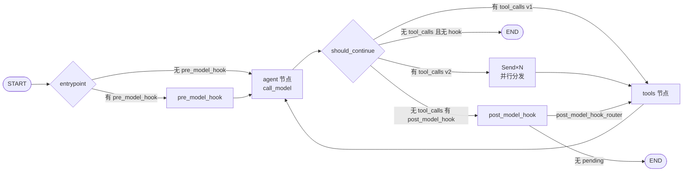

**核心源码片段**（831-859 行，should_continue 函数）：

```python
def should_continue(state: StateSchema) -> str | list[Send]:
    messages = _get_state_value(state, "messages")
    last_message = messages[-1]
    # 没有工具调用 → 准备结束
    if not isinstance(last_message, AIMessage) or not last_message.tool_calls:
        if post_model_hook is not None:
            return "post_model_hook"
        elif response_format is not None:
            return "generate_structured_response"
        else:
            return END
    # 有工具调用 → 进入工具节点
    else:
        if version == "v1":
            return "tools"
        elif version == "v2":
            # v2 版本：用 Send 把每个 tool_call 并行分发
            return [
                Send(
                    "tools",
                    ToolCallWithContext(
                        __type="tool_call_with_context",
                        tool_call=call,
                        state=state,
                    ),
                )
                for call in last_message.tool_calls
            ]
```

**关键发现**：v2 版本（默认）使用 `Send` API 把每个 `tool_call` 独立分发到 tools 节点，从而**原生支持并行工具调用**。这是 v1 与 v2 的核心差异。

### 4.5 防止无限循环：remaining_steps 检查

源码 620-634 行实现了一个重要的安全机制：

```python
def _are_more_steps_needed(state: StateSchema, response: BaseMessage) -> bool:
    has_tool_calls = isinstance(response, AIMessage) and response.tool_calls
    all_tools_return_direct = (
        all(call["name"] in should_return_direct for call in response.tool_calls)
        if isinstance(response, AIMessage) else False
    )
    remaining_steps = _get_state_value(state, "remaining_steps", None)
    if remaining_steps is not None:
        if remaining_steps < 1 and all_tools_return_direct:
            return True
        elif remaining_steps < 2 and has_tool_calls:
            return True
    return False
```

当剩余步数耗尽时，agent 节点会返回一条 `"Sorry, need more steps to process this request."` 消息，防止 ReAct 循环无限执行。默认 `AgentState.remaining_steps = 25`（源码 74 行）。

---

## 5. 边连接：普通边与条件边

LangGraph 提供三种边类型，工具调用图典型用法如下：

### 5.1 三种边类型

```python
from langgraph.graph import StateGraph, MessagesState, START, END

builder = StateGraph(MessagesState)
builder.add_node("call_model", call_model)
builder.add_node("tools", tool_node)

# 1. 普通边：固定转移
builder.add_edge(START, "call_model")   # 入口
builder.add_edge("tools", "call_model") # 工具执行后回到 agent

# 2. 条件边：基于 state 分支
def should_continue(state: MessagesState):
    last_message = state["messages"][-1]
    if last_message.tool_calls:
        return "tools"
    return END

builder.add_conditional_edges(
    "call_model",
    should_continue,
    ["tools", END],  # 路径白名单（可选）
)

graph = builder.compile()
```

### 5.2 预构建 tools_condition 函数

源码 1582-1659 行实现了 `tools_condition`，是上述 `should_continue` 的标准封装，可直接复用：

```python
from langgraph.prebuilt import tools_condition

# 等价于自定义 should_continue
builder.add_conditional_edges(
    "call_model",
    tools_condition,
    {"tools": "tools", "__end__": END},  # 路径映射，把返回值映射到节点名
)
```

**源码核心逻辑**（1648-1659 行）：

```python
def tools_condition(state, messages_key: str = "messages") -> Literal["tools", "__end__"]:
    if isinstance(state, list):
        ai_message = state[-1]
    elif (isinstance(state, dict) and (messages := state.get(messages_key, []))) or (
        messages := getattr(state, messages_key, [])
    ):
        ai_message = messages[-1]
    else:
        raise ValueError(f"No messages found in input state to tool_edge: {state}")
    # 关键判定：AIMessage 是否带 tool_calls
    if hasattr(ai_message, "tool_calls") and len(ai_message.tool_calls) > 0:
        return "tools"
    return "__end__"
```

### 5.3 路径映射字典的作用

当 ToolNode 自定义名字或不需要工具时路由到其他节点（而非 END），必须提供第三个参数：

```python
# 不提供映射时，返回值必须等于节点名
builder.add_conditional_edges("call_model", tools_condition, ["tools", END])

# 提供映射时，返回值通过字典映射到目标节点
builder.add_conditional_edges(
    "call_model",
    tools_condition,
    {"tools": "my_tool_node", "__end__": "summarize_node"},
)
```

### 5.4 错误恢复分支（多条件边）

复杂的错误恢复路由示例：

```python
from typing import Literal
from langchain_core.messages import ToolMessage

def should_fallback(state: MessagesState) -> Literal["agent", "remove_failed_tool_call_attempt"]:
    """检测失败的 tool 调用，路由到恢复节点。"""
    messages = state["messages"]
    failed_tool_messages = [
        msg for msg in messages
        if isinstance(msg, ToolMessage)
        and msg.additional_kwargs.get("error") is not None
    ]
    if failed_tool_messages:
        return "remove_failed_tool_call_attempt"
    return "agent"

builder.add_conditional_edges("tools", should_fallback)
builder.add_edge("remove_failed_tool_call_attempt", "fallback_agent")
builder.add_edge("fallback_agent", "tools")
```

---

## 6. 状态管理：MessagesState 与 add_messages reducer

### 6.1 LangGraph 状态模型

LangGraph 的 `State` 是一个共享数据结构，代表应用当前快照。推荐用 `TypedDict` 定义：

```python
from typing import Annotated, TypedDict
from langgraph.graph.message import add_messages
from langchain_core.messages import AnyMessage

class State(TypedDict):
    # messages 字段使用 add_messages reducer
    messages: Annotated[list[AnyMessage], add_messages]
    # 其他字段默认 last-write-wins（后写覆盖前写）
    user_name: str
    extra_field: int
```

### 6.2 add_messages reducer 源码解析

源码位于 [message.py](langgraph/graph/message.py) 60-244 行。核心合并逻辑（187-234 行）：

```python
@_add_messages_wrapper
def add_messages(left: Messages, right: Messages, *, format=None) -> Messages:
    """按 ID 合并两个消息列表，相同 ID 替换，不同 ID 追加。"""
    remove_all_idx = None
    if not isinstance(left, list):  left = [left]
    if not isinstance(right, list): right = [right]
    # 转换为 BaseMessage 对象
    left = [message_chunk_to_message(cast(BaseMessageChunk, m)) for m in convert_to_messages(left)]
    right = [message_chunk_to_message(cast(BaseMessageChunk, m)) for m in convert_to_messages(right)]
    # 自动补全缺失的 ID
    for m in left:
        if m.id is None: m.id = str(uuid.uuid4())
    for idx, m in enumerate(right):
        if m.id is None: m.id = str(uuid.uuid4())
        # 检测 REMOVE_ALL_MESSAGES 特殊指令
        if isinstance(m, RemoveMessage) and m.id == REMOVE_ALL_MESSAGES:
            remove_all_idx = idx

    # 处理"清空所有消息"指令
    if remove_all_idx is not None:
        return right[remove_all_idx + 1:]

    # 合并：同 ID 替换，否则追加
    merged = left.copy()
    merged_by_id = {m.id: i for i, m in enumerate(merged)}
    ids_to_remove = set()
    for m in right:
        if (existing_idx := merged_by_id.get(m.id)) is not None:
            if isinstance(m, RemoveMessage):
                ids_to_remove.add(m.id)        # 标记删除
            else:
                ids_to_remove.discard(m.id)
                merged[existing_idx] = m        # 替换
        else:
            if isinstance(m, RemoveMessage):
                raise ValueError(f"Attempting to delete a message with an ID that doesn't exist ('{m.id}')")
            merged_by_id[m.id] = len(merged)
            merged.append(m)                    # 追加
    merged = [m for m in merged if m.id not in ids_to_remove]
    return merged
```

### 6.3 合并规则速查

| 新消息 ID | 已存在同 ID | 行为 |
|---|---|---|
| 无 ID | - | 自动生成 UUID，追加 |
| 有 ID | 否 | 追加到末尾 |
| 有 ID | 是 | **替换**旧消息（用于编辑历史） |
| `RemoveMessage(id=X)` | X 存在 | 删除消息 X |
| `RemoveMessage(id="__remove_all__")` | - | 清空所有消息，保留 `__remove_all__` 之后的消息 |

### 6.4 MessagesState 预构建类

源码 372-373 行：

```python
class MessagesState(TypedDict):
    messages: Annotated[list[AnyMessage], add_messages]
```

继承它即可扩展自定义字段：

```python
from langgraph.graph import MessagesState

class MyState(MessagesState):
    user_id: str
    tool_call_count: int = 0
```

### 6.5 节点返回状态更新的关键约束

源码与官方文档反复强调：**节点应直接返回状态更新，而非修改 state**：

```python
# ✅ 正确：返回增量，由 reducer 合并
def call_model(state: MessagesState) -> dict:
    response = model.invoke(state["messages"])
    return {"messages": [response]}  # add_messages 会自动追加

# ❌ 错误：直接修改 state（绕过 reducer，破坏并行与重试语义）
def call_model_bad(state: MessagesState) -> dict:
    state["messages"].append(model.invoke(state["messages"]))
    return state
```

### 6.6 高级：Overwrite 绕过 reducer

LangGraph 1.2+ 引入 `Overwrite`，可在特定场景下绕过 reducer 直接覆盖：

```python
from langgraph.types import Overwrite

def replace_messages(state: State):
    return {"messages": Overwrite(["replacement message"])}
```

**警告**：并行执行时，同一 super-step 内同一 state key 只允许一个节点使用 `Overwrite`，否则抛 `InvalidUpdateError`。

---

## 7. 工具调用触发机制：从 AIMessage.tool_calls 到路由

### 7.1 ToolCall 数据结构

模型生成的 `AIMessage.tool_calls` 是一个列表，每个元素是 `ToolCall` 字典：

```python
{
    "name": "get_weather",           # 工具名
    "args": {"location": "sf"},      # 调用参数
    "id": "toolu_01Pnkgw5...",       # 唯一标识（与 ToolMessage.tool_call_id 配对）
    "type": "tool_call",             # 固定字符串
}
```

### 7.2 手动构造 ToolCall

不依赖 LLM 也能触发工具调用（用于测试或强制路由）：

```python
from langchain_core.messages import AIMessage

message_with_tool_calls = AIMessage(
    content="",
    tool_calls=[
        {"name": "get_weather", "args": {"location": "sf"}, "id": "call_1", "type": "tool_call"},
        {"name": "get_time",    "args": {},                  "id": "call_2", "type": "tool_call"},
    ],
)

# 直接喂给 ToolNode 执行
result = tool_node.invoke({"messages": [message_with_tool_calls]})
```

### 7.3 触发判定时序

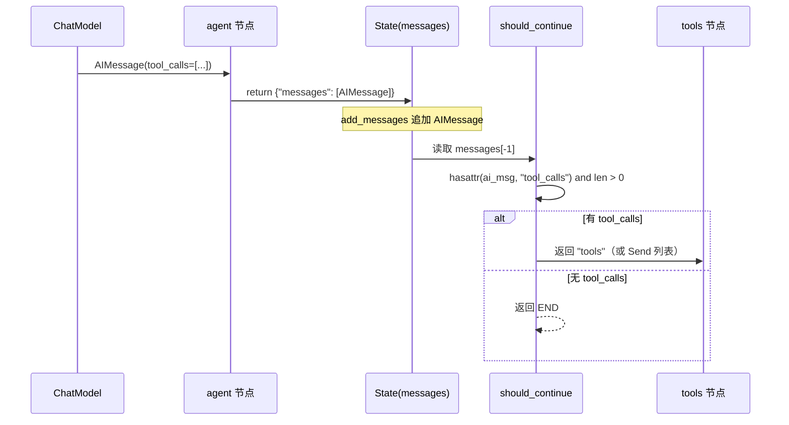

### 7.4 工具调用与上下文注入

工具可声明对图上下文的依赖，ToolNode 会在执行前自动注入：

```python
from typing import Annotated
from langchain_core.tools import tool, InjectedToolCallId
from langgraph.prebuilt import InjectedState, InjectedStore
from langgraph.store.base import BaseStore

class MyState(MessagesState):
    user_id: str

@tool
def smart_search(
    query: str,
    state: Annotated[MyState, InjectedState],                  # 整个 state
    user_id: Annotated[str, InjectedState("user_id")],         # state 的某个字段
    store: Annotated[BaseStore, InjectedStore()],              # 持久化存储
    tool_call_id: Annotated[str, InjectedToolCallId],          # 当前 tool_call ID
) -> str:
    """智能搜索工具（对模型隐藏注入参数）。"""
    history = state["messages"][-5:]
    # store 可跨会话持久化
    store.put(("queries", user_id), tool_call_id, {"query": query})
    return f"基于 {len(history)} 条历史搜索：{query}"
```

**源码机制**：`_get_all_injected_args`（源码 1967-2030 行）在 ToolNode 初始化时一次性分析工具签名，把 `InjectedState` / `InjectedStore` / `ToolRuntime` 标记的参数记录到 `_InjectedArgs`，执行时通过 `_inject_tool_args`（1315-1430 行）自动注入，并**剥离**模型传入的同名参数（防止 LLM 伪造，源码 1421-1429 行）。

---

## 8. 工具执行：ToolNode 内部流程与并行调用

### 8.1 ToolNode._func 同步执行主流程

源码 793-826 行揭示了完整的同步执行流程：

```python
def _func(self, input, config, runtime):
    # 1. 解析输入，提取 tool_calls
    tool_calls, input_type = self._parse_input(input)
    config_list = get_config_list(config, len(tool_calls))

    # 2. 为每个 tool_call 构造 ToolRuntime（含 state/config/store/stream_writer）
    tool_runtimes = []
    for call, cfg in zip(tool_calls, config_list):
        state = self._extract_state(input, cfg)
        tool_runtime = ToolRuntime(
            state=state, tool_call_id=call["id"], config=cfg,
            context=runtime.context, store=runtime.store,
            stream_writer=runtime.stream_writer,
            tools=list(self.tools_by_name.values()),
            execution_info=runtime.execution_info,
            server_info=runtime.server_info,
        )
        tool_runtimes.append(tool_runtime)

    # 3. 并发执行所有 tool_call
    with get_executor_for_config(config) as executor:
        outputs = list(executor.map(self._run_one, tool_calls, [input_type]*len(tool_calls), tool_runtimes))

    # 4. 合并输出（含 Command 处理）
    return self._combine_tool_outputs(outputs, input_type)
```

### 8.2 单个工具调用执行流程

源码 `_execute_tool_sync`（922-1012 行）核心逻辑：

```python
def _execute_tool_sync(self, request, input_type, config):
    call = request.tool_call
    tool = request.tool

    # 1. 校验工具是否存在
    if tool is None:
        if invalid_tool_message := self._validate_tool_call(call):
            return invalid_tool_message   # 工具不存在时返回 error ToolMessage
        raise TypeError(f"Tool {call['name']} is not registered")

    # 2. 注入 state/store/runtime 参数
    injected_call = self._inject_tool_args(call, request.runtime, tool)
    call_args = {**injected_call, "type": "tool_call"}

    try:
        try:
            # 3. 调用工具
            response = tool.invoke(call_args, config)
        except ValidationError as exc:
            # 参数校验失败 → 抛 ToolInvocationError（会被错误处理捕获）
            injected = self._injected_args.get(call["name"])
            filtered_errors = _filter_validation_errors(exc, injected)
            raise ToolInvocationError(call["name"], exc, call["args"], filtered_errors) from exc

        # 4. 规范化响应（Command/ToolMessage/list）
        return self._normalize_tool_response(response, request.tool_call, input_type)

    except GraphBubbleUp:
        # interrupt() 等异常透传，不走错误处理
        raise
    except Exception as e:
        # 5. 错误处理（详见第 10 节）
        # 根据 handle_tool_errors 的类型计算 handled_types
        if isinstance(self._handle_tool_errors, type) and issubclass(
            self._handle_tool_errors, Exception
        ):
            handled_types = (self._handle_tool_errors,)          # 单个异常类型
        elif isinstance(self._handle_tool_errors, tuple):
            handled_types = self._handle_tool_errors              # 元组
        elif callable(self._handle_tool_errors) and not isinstance(
            self._handle_tool_errors, type
        ):
            handled_types = _infer_handled_types(self._handle_tool_errors)  # 推断签名
        else:
            handled_types = (Exception,)                         # bool=True / str → 捕获所有

        if not self._handle_tool_errors or not isinstance(e, handled_types):
            raise
        content = _handle_tool_error(e, flag=self._handle_tool_errors)
        return ToolMessage(content=content, name=call["name"], tool_call_id=call["id"], status="error")
```

### 8.3 并行执行机制

源码 821 行使用 `get_executor_for_config` 构造线程池，并发执行所有 tool_call：

```python
with get_executor_for_config(config) as executor:
    outputs = list(executor.map(self._run_one, tool_calls, input_types, tool_runtimes))
```

异步版本（828-860 行）使用 `asyncio.gather`：

```python
async def _afunc(self, input, config, runtime):
    ...
    coros = [self._arun_one(call, input_type, rt) for call, rt in zip(tool_calls, tool_runtimes)]
    outputs = await asyncio.gather(*coros)
```

**关键特性**：
- 同一 `AIMessage` 中的多个 `tool_calls` **自动并行执行**
- 输出顺序与原始 `tool_calls` 顺序保持一致
- 适合独立、无依赖的工具调用；有依赖关系时应拆分为多步

### 8.4 多工具调用示例

```python
from langchain_core.messages import AIMessage
from langgraph.prebuilt import ToolNode

def get_weather(location: str):
    """Get weather."""
    return "晴" if location.lower() in ["sf"] else "雨"

def get_coolest_cities():
    """Get coolest cities."""
    return "nyc, sf"

tool_node = ToolNode([get_weather, get_coolest_cities])

# 模型一次返回多个 tool_calls
msg = AIMessage(
    content="",
    tool_calls=[
        {"name": "get_coolest_cities", "args": {}, "id": "1", "type": "tool_call"},
        {"name": "get_weather", "args": {"location": "sf"}, "id": "2", "type": "tool_call"},
    ],
)

result = tool_node.invoke({"messages": [msg]})
# 输出（顺序与原始 tool_calls 一致，执行是并发的）：
# {
#     'messages': [
#         ToolMessage(content='nyc, sf', name='get_coolest_cities', tool_call_id='1'),
#         ToolMessage(content='晴', name='get_weather', tool_call_id='2'),
#     ]
# }
```

### 8.5 wrap_tool_call 拦截器

源码 1042-1067 行揭示了可插拔的拦截器机制，支持重试、缓存、参数修改：

```python
# 重试拦截器示例
def retry_wrapper(request: ToolCallRequest, execute):
    """最多重试 3 次。"""
    for attempt in range(3):
        try:
            result = execute(request)
            if isinstance(result, ToolMessage) and result.status != "error":
                return result
            if attempt < 2:
                continue
            return result
        except Exception:
            if attempt == 2:
                raise

# 缓存拦截器示例
def cache_wrapper(request: ToolCallRequest, execute):
    """简单缓存。"""
    cache_key = (request.tool_call["name"], str(request.tool_call["args"]))
    if cached := cache.get(cache_key):
        return ToolMessage(content=cached, tool_call_id=request.tool_call["id"])
    result = execute(request)
    cache[cache_key] = result.content
    return result

tool_node = ToolNode([my_tool], wrap_tool_call=retry_wrapper)
```

---

## 9. 结果处理：ToolMessage 与 Command

### 9.1 ToolMessage 结构

| 字段 | 类型 | 说明 |
|---|---|---|
| `content` | `str \| list[dict]` | 工具执行结果（字符串化或 content blocks） |
| `name` | `str` | 被调用工具名 |
| `tool_call_id` | `str` | 与原始 `tool_call["id"]` 配对，**关键** |
| `status` | `"success" \| "error"` | 执行状态（默认 success） |
| `additional_kwargs` | `dict` | 附加元数据（如 error 详情） |

**`tool_call_id` 配对的必要性**：LLM 上下文必须能找到每个 `tool_call` 对应的 `ToolMessage`，否则模型会报错。

### 9.2 工具返回 Command 更新状态

工具可返回 `Command` 而非普通字符串，实现状态更新 + 路由跳转：

```python
from typing import Annotated
from langgraph.types import Command
from langchain_core.messages import ToolMessage
from langchain_core.tools import tool, InjectedToolCallId

@tool
def update_user_name(
    new_name: str,
    tool_call_id: Annotated[str, InjectedToolCallId],  # 自动注入
) -> Command:
    """更新用户名并返回确认消息。"""
    return Command(update={
        "user_name": new_name,  # 同时更新 user_name 字段
        "messages": [
            ToolMessage(f"用户名已更新为 {new_name}", tool_call_id=tool_call_id)
        ]
    })
```

### 9.3 _validate_tool_command 的约束

源码 1503-1579 行实现了严格的 Command 校验：

```python
def _validate_tool_command(self, command, call, input_type, *, require_terminator=True):
    if isinstance(command.update, dict):
        # dict 模式：必须用 dict 输入
        if input_type not in ("dict", "tool_calls"):
            raise ValueError(...)
        updated_command = deepcopy(command)
        state_update = cast("dict", updated_command.update) or {}
        messages_update = state_update.get(self._messages_key, [])
    elif isinstance(command.update, list):
        # list 模式：必须用 list 输入
        if input_type != "list":
            raise ValueError(...)
        updated_command = deepcopy(command)
        messages_update = updated_command.update
    else:
        return command  # update 为 None 等

    # 转换为消息对象
    messages_update = convert_to_messages(messages_update)

    # 检查是否包含匹配的 ToolMessage（关键约束）
    has_matching_tool_message = False
    for message in messages_update:
        if isinstance(message, ToolMessage) and message.tool_call_id == call["id"]:
            message.name = call["name"]
            has_matching_tool_message = True

    # 如果 Command 发往当前图，必须有匹配的 ToolMessage
    if require_terminator and updated_command.graph is None and not has_matching_tool_message:
        raise ValueError("Expected to have a matching ToolMessage in Command.update ...")
    return updated_command
```

**核心约束**：返回 `Command` 的工具**必须**在 `update["messages"]` 中包含一个 `tool_call_id` 匹配的 `ToolMessage`，否则报错。这是为了保证 LLM 上下文完整性。

### 9.4 Command 跨图通信

`Command(graph=Command.PARENT)` 可让工具影响父图状态（多 Agent 架构常用）：

```python
@tool
def escalate_to_supervisor(query: str) -> Command:
    """把任务上交给 supervisor。"""
    return Command(
        graph=Command.PARENT,  # ← 跳到父图
        update={"escalated_query": query},
        goto="supervisor",
    )
```

### 9.5 Command 数据结构（源码 758-808 行）

```python
@dataclass(**_DC_KWARGS)  # kw_only=True, slots=True, frozen=True
class Command(Generic[N], ToolOutputMixin):
    """组合状态更新与控制流的命令原语。"""
    graph: str | None = None        # None=当前图, "PARENT"=父图
    update: Any | None = None       # dict / list[tuple] / Pydantic model / 标量
    resume: dict[str, Any] | Any | None = None  # 恢复 interrupt 的值
    goto: Send | Sequence[Send | N] | N = ()    # 节点名 / Send 列表

    PARENT: ClassVar[Literal["__parent__"]] = "__parent__"
```

**四种能力**：
- `update`：状态更新
- `goto`：路由跳转（字符串触发 PULL，`Send` 触发 PUSH）
- `resume`：恢复 interrupt
- `graph`：跨图通信

---

## 10. 错误处理：从工具级到节点级

LangGraph 提供三层可组合的错误处理机制。

### 10.1 第一层：ToolNode 的 handle_tool_errors

源码 383-441 行实现了灵活的工具级错误处理。`handle_tool_errors` 支持五种取值：

| 取值 | 行为 |
|---|---|
| `True` | 捕获所有异常，返回默认错误模板 `Error: {error}\n Please fix your mistakes.` |
| `False` | 完全不捕获，异常向上抛出 |
| `str` | 捕获所有异常，返回该字符串 |
| `type[Exception]` / `tuple[type, ...]` | 仅捕获指定类型异常 |
| `Callable[..., str]` | 根据函数签名推断捕获类型，返回 callable 调用结果 |

**默认行为**（`_default_handle_tool_errors`，383-391 行）：仅捕获 `ToolInvocationError`（参数校验错误），其他异常重抛。

```python
def _default_handle_tool_errors(e: Exception) -> str:
    if isinstance(e, ToolInvocationError):
        return e.message
    raise e
```

**关键设计**：默认只捕获**调用错误**（模型传入参数不合法），**忽略**执行错误（让其重抛）。这是因为调用错误可以通过让 LLM 修正参数恢复，而执行错误通常需要人工介入。

### 10.2 错误自我修正流程

默认错误处理让 LLM 自动修正参数：

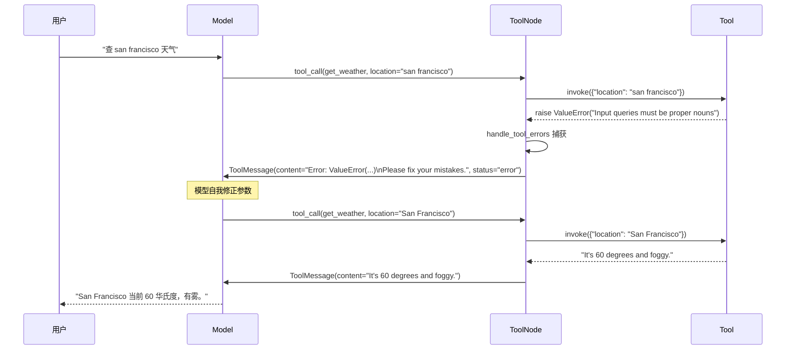

### 10.3 自定义错误处理示例

```python
# 1. 启用默认错误处理（捕获所有异常）
tool_node = ToolNode([my_tool], handle_tool_errors=True)

# 2. 禁用错误处理（异常抛出）
tool_node = ToolNode([my_tool], handle_tool_errors=False)

# 3. 自定义错误消息
tool_node = ToolNode([my_tool], handle_tool_errors="工具调用失败，请稍后重试。")

# 4. 仅捕获特定异常类型
tool_node = ToolNode([my_tool], handle_tool_errors=(ValueError, TypeError))

# 5. 可调用处理器（根据异常类型生成不同消息）
def smart_handler(e: ValueError) -> str:
    return f"参数错误：{e}，请检查后重试。"

tool_node = ToolNode([my_tool], handle_tool_errors=smart_handler)
```

### 10.4 第二层：节点级 retry_policy 与 timeout

LangGraph 1.2+ 提供节点级容错（详见官方文档 fault-tolerance）：

```python
from langgraph.errors import NodeError
from langgraph.types import Command, RetryPolicy

def charge_payment(state: State) -> State:
    raise RuntimeError("payment gateway timeout")

def payment_error_handler(state: State, error: NodeError) -> Command:
    """重试耗尽后的恢复函数：跳转到 finalize 节点。"""
    return Command(
        update={"status": f"compensated: {error.error}"},
        goto="finalize",
    )

graph = (
    StateGraph(State)
    .add_node(
        "charge_payment",
        charge_payment,
        retry_policy=RetryPolicy(
            max_attempts=3,
            retry_on=ConnectionError,  # 仅对 ConnectionError 重试
        ),
        error_handler=payment_error_handler,
    )
    .add_node("finalize", finalize)
    .add_edge(START, "charge_payment")
    .compile()
)
```

**默认重试行为**（`default_retry_on`）：
- 默认重试**任何异常**，除了：`ValueError` / `TypeError` / `ArithmeticError` / `ImportError` / `LookupError` / `NameError` / `SyntaxError` / `RuntimeError` / `ReferenceError` / `StopIteration` / `StopAsyncIteration` / `OSError`
- 对 `requests` / `httpx` 仅在 5xx 状态码重试
- `NodeTimeoutError` 默认可重试

### 10.5 第三层：超时机制

```python
graph = (
    StateGraph(State)
    .add_node(
        "call_external_api",
        call_api,
        run_timeout=30.0,    # 硬性墙上时钟上限（从不刷新）
        idle_timeout=10.0,   # 进度重置上限（节点产生进度时重置）
        retry_policy=RetryPolicy(max_attempts=3),
    )
    .compile()
)
```

**重要警告**：
- 节点超时**仅适用于 async 节点**，sync 节点会在编译时被拒绝
- `interrupt()` 抛出的异常**不会**进入 error_handler（走 `GraphBubbleUp` 机制）
- 子图失败会冒泡到父节点，父节点的 error_handler 会以子图异常为 `error.error` 触发

### 10.6 错误处理流程图

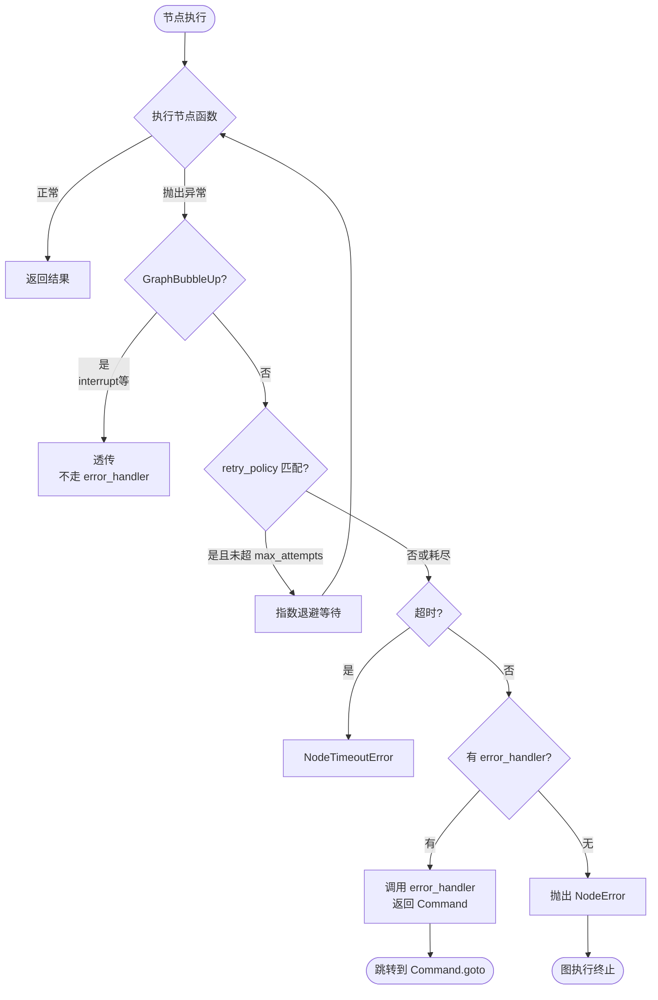

---

## 11. 人机协作：interrupt 与 Command(resume=...)

### 11.1 两种中断机制

| 机制 | 类型 | 适用场景 |
|---|---|---|
| `interrupt_before=["tools"]` | 静态断点 | 节点边界固定中断 |
| `interrupt(value)` | 动态中断 | 节点内部条件性中断 |

### 11.2 静态断点：interrupt_before

```python
from langgraph.checkpoint.memory import MemorySaver

graph = create_react_agent(
    model, tools,
    interrupt_before=["tools"],   # 工具执行前暂停
    checkpointer=MemorySaver(),   # ← 中断必须配 checkpointer
)

config = {"configurable": {"thread_id": "thread-1"}}
inputs = {"messages": [("user", "What's the weather in SF?")]}

# 第一次调用：触发中断
for event in graph.stream(inputs, config, stream_mode="values"):
    print(event)
snapshot = graph.get_state(config)
print("Next step:", snapshot.next)  # ('tools',)

# 检查/修改 tool_call
last_msg = snapshot.values["messages"][-1]
print("Tool calls:", last_msg.tool_calls)

# 恢复执行（传 None 表示继续）
for event in graph.stream(None, config, stream_mode="values"):
    print(event)
```

### 11.3 动态 interrupt() 函数

源码 811 行起，`interrupt()` 在节点内抛出 `GraphInterrupt` 异常暂停图：

```python
from langgraph.types import interrupt, Command

def human_review_node(state: State) -> Command[Literal["proceed", "cancel"]]:
    """请求人工审批。"""
    is_approved = interrupt({
        "question": "是否执行此操作？",
        "details": state["action_details"],
    })
    if is_approved:
        return Command(goto="proceed", update={"approved": True})
    else:
        return Command(goto="cancel", update={"approved": False})
```

### 11.4 interrupt 恢复时序图

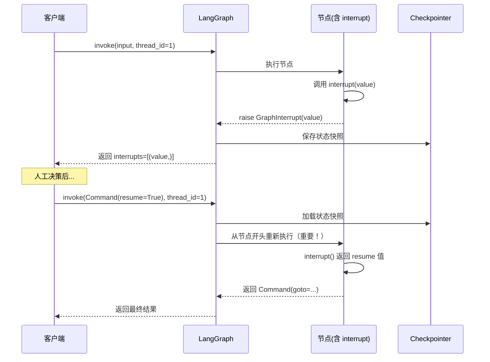

### 11.5 工具内部中断

工具函数本身也可调用 `interrupt()`，常用于审批敏感操作：

```python
from langchain_core.tools import tool
from langgraph.types import interrupt

@tool
def send_email(to: str, subject: str, body: str):
    """发送邮件（需要人工审批）。"""
    response = interrupt({
        "action": "send_email",
        "to": to, "subject": subject, "body": body,
        "message": "是否批准发送此邮件？",
    })
    if response["approved"]:
        return send_email_api(to, subject, body)
    return "邮件发送已取消"
```

### 11.6 interrupt 的六大规则（官方警告）

1. **必须配置 checkpointer**：interrupt 依赖状态持久化
2. **必须设置 thread_id**：状态按 thread 隔离
3. **不要用 try/except 包裹 interrupt()**：会破坏恢复机制
4. **不要在节点内重排 interrupt() 调用顺序**：恢复时按顺序匹配
5. **interrupt 之前的副作用必须幂等**：节点会从头重新执行
6. **interrupt 的值必须 JSON 可序列化**：用于跨进程传递

### 11.7 多中断并发恢复

并行分支同时触发 interrupt 时，按 interrupt ID 映射恢复：

```python
# 假设有两个并行 interrupt 同时触发
stream = graph.stream_events(input, config=config, version="v3")

if stream.interrupted:
    # stream.interrupts 是 (Interrupt(value=...),) 元组
    resume_map = {
        i.id: f"answer for {i.value}"
        for i in stream.interrupts
    }
    resumed = graph.stream_events(
        Command(resume=resume_map),  # 按 ID 映射恢复值
        config=config, version="v3"
    )
```

### 11.8 四种人工决策模式

| 模式 | 含义 | 示例 |
|---|---|---|
| `approve` | 按原参数执行 | 批准发送草稿邮件 |
| `edit` | 修改工具参数后执行 | 修改收件人后发送 |
| `reject` | 跳过此工具调用，返回拒绝反馈 | 拒绝删除文件并解释原因 |
| `respond` | 直接返回人类消息作为合成工具结果 | 回答 `ask_user` 类提示 |

---

## 12. 流式输出：stream_mode 与事件流

### 12.1 七种 stream_mode

LangGraph 流式系统支持三类数据：工作流进度、LLM tokens、自定义更新。

| Mode | 描述 | 适用场景 |
|---|---|---|
| `values` | 每步后的**完整状态** | 查看状态快照 |
| `updates` | 每步后的**状态增量** | 监控节点输出 |
| `messages` | LLM token 流（含 metadata） | 实时打字效果 |
| `custom` | 节点通过 `get_stream_writer()` 发出的自定义数据 | 工具进度通知 |
| `checkpoints` | 检查点事件 | 状态持久化监控 |
| `tasks` | 任务开始/结束事件 | 调试任务调度 |
| `debug` | 所有可用信息（checkpoints + tasks + 元数据） | 完整调试 |

### 12.2 多模式流式

```python
for chunk in graph.stream(
    {"messages": [{"role": "user", "content": "hello"}]},
    stream_mode=["updates", "messages"],
    version="v2",  # 统一输出格式
):
    if chunk["type"] == "updates":
        for node_name, state in chunk["data"].items():
            print(f"[{node_name}] 更新: {state}")
    elif chunk["type"] == "messages":
        message_chunk, metadata = chunk["data"]
        if message_chunk.content:
            print(message_chunk.content, end="|", flush=True)
```

### 12.3 工具内自定义流式输出

工具可通过 `get_stream_writer()` 主动推送进度：

```python
from langgraph.config import get_stream_writer

@tool
def long_running_task(query: str) -> str:
    """长时间运行的工具，主动报告进度。"""
    writer = get_stream_writer()

    writer({"status": "开始检索..."})
    results = search(query)
    writer({"status": f"已检索到 {len(results)} 条结果"})

    writer({"status": "开始分析..."})
    analysis = analyze(results)
    writer({"status": "分析完成"})

    return analysis
```

客户端接收：

```python
for chunk in graph.stream(input, stream_mode="custom"):
    print(f"进度: {chunk['data']}")
# 进度: {'status': '开始检索...'}
# 进度: {'status': '已检索到 42 条结果'}
# 进度: {'status': '开始分析...'}
# 进度: {'status': '分析完成'}
```

### 12.4 按节点过滤 messages

只流式工具节点的输出：

```python
for chunk in graph.stream(inputs, stream_mode="messages", version="v2"):
    if chunk["type"] == "messages":
        msg, metadata = chunk["data"]
        if msg.content and metadata["langgraph_node"] == "tools":
            print(f"[工具输出] {msg.content}")
```

### 12.5 事件流 API（v1.2+）

LangGraph v1.2 引入 `stream_events(version="v3")` 提供独立迭代器：

```python
stream = graph.stream_events(input, config=config, version="v3")

# 独立访问不同维度
async for msg in stream.messages:       # LLM 输出（含子图）
    print(msg.content, end="")
async for val in stream.values:         # 每步后完整状态
    print(val["messages"][-1])
async for sub_msg in stream.subgraphs[0].messages:  # 子图消息
    print(sub_msg.content)

if stream.interrupted:                   # 中断检测
    print(stream.interrupts)
final = stream.output                    # 最终状态
```

---

## 13. 完整时序图与流程图

### 13.1 工具调用完整时序图

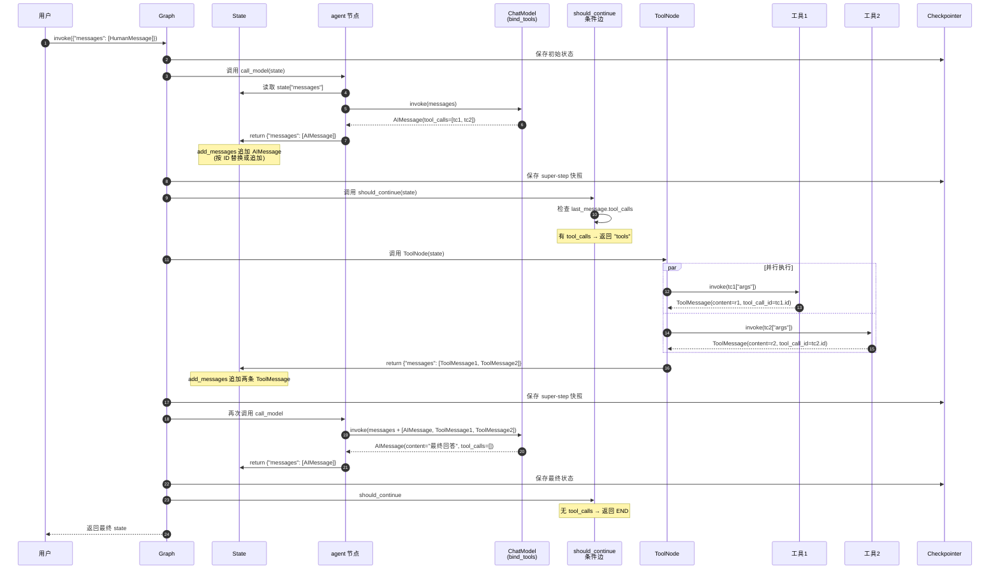

### 13.2 ReAct 循环流程图

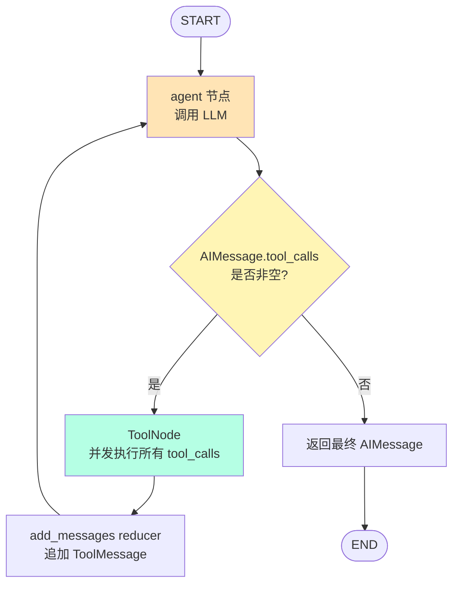

### 13.3 状态转换图

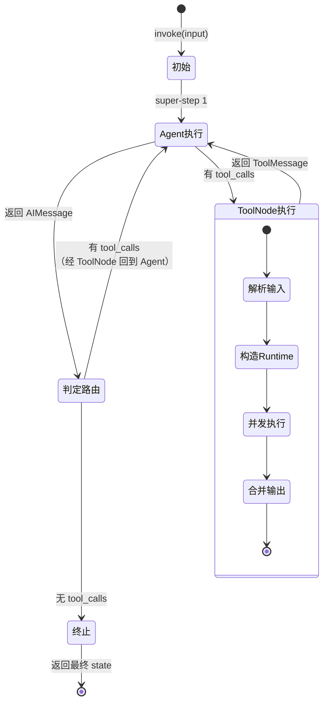

### 13.4 错误处理决策树

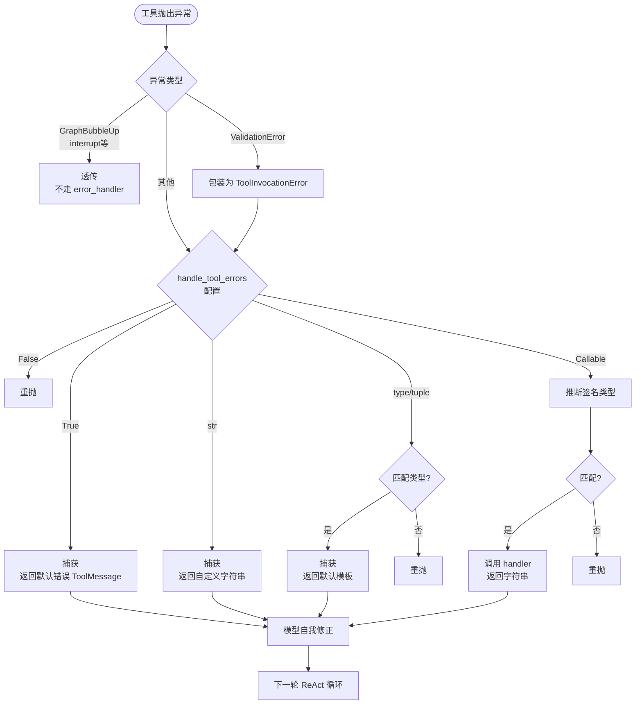

### 13.5 并行工具执行时序图

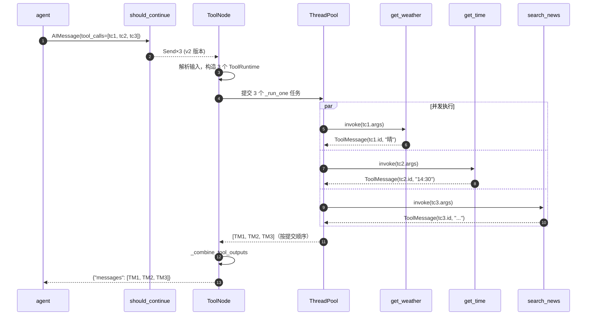

---

## 14. 最佳实践与生产建议

### 14.1 工具设计原则

1. **docstring 要清晰**：模型完全依赖 docstring 决定何时调用工具
2. **参数类型严格**：用 `Annotated[str, "描述"]` 提供字段说明
3. **返回字符串优先**：复杂对象会 JSON 序列化，可能丢失语义
4. **幂等性**：重试机制要求工具可重复调用无副作用
5. **显式超时**：避免单个慢工具阻塞整个图

### 14.2 性能优化

| 优化点 | 做法 |
|---|---|
| 并行工具调用 | 默认自动开启；自定义图时把每个 tool_call 用 `Send` 分发 |
| 并行写入字段必须定义 reducer | `Annotated[list, add]` 否则后写覆盖前写 |
| 控制上下文长度 | 用 `pre_model_hook` 裁剪历史消息 |
| 工具内流式进度 | 用 `get_stream_writer()` 发出自定义事件 |
| 异步优先 | 用 `ainvoke` / `astream`，避免阻塞事件循环 |
| 工具结果缓存 | 用 `wrap_tool_call` 实现缓存拦截器 |

### 14.3 错误处理分层策略

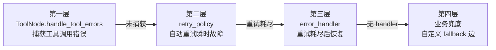

**生产环境关键点**：
- `error_handler` 本身也要用 try-except 包裹，防止恢复逻辑崩溃
- 用结构化日志记录 `NodeError` 的 `node` 与 `error` 字段
- 跨 invoke 不复用 State dict，每次传 fresh state
- 工具实现幂等性，避免重试副作用

### 14.4 状态管理陷阱

1. **节点返回增量，不要修改 state**：避免破坏并行与重试语义
2. **`messages` 字段必须用 `add_messages` reducer**：否则后写覆盖前写
3. **`Command(graph=PARENT)` 的 update 只写父图**：如需同时更新父子，返回两个 Command
4. **`interrupt()` 抛出不进 error_handler**：走 `GraphBubbleUp` 机制
5. **`Overwrite` 并行限制**：同一 super-step 内同一 key 只允许一个节点使用

### 14.5 调试与可观测

| 工具 | 用途 |
|---|---|
| LangSmith 跟踪 | 全链路可视化（推荐生产开启） |
| `stream_mode="debug"` | 完整事件流（含 checkpoints + tasks） |
| `get_state_history(config)` | 回溯所有检查点 |
| `runtime.execution_info.node_attempt` | 查看当前重试次数 |
| `graph.get_state(config).next` | 查看下一步要执行的节点 |

### 14.6 完整生产级示例

```python
from typing import Annotated, Literal
from langchain_core.tools import tool, InjectedToolCallId
from langchain_core.messages import AIMessage, ToolMessage
from langchain.chat_models import init_chat_model
from langgraph.graph import StateGraph, MessagesState, START, END
from langgraph.prebuilt import ToolNode, tools_condition
from langgraph.checkpoint.memory import MemorySaver
from langgraph.types import Command, interrupt


# 1. 定义工具（带错误处理与幂等性）
@tool
def get_weather(location: str) -> str:
    """获取指定城市的天气。"""
    # 实际场景应调用天气 API
    return f"{location}: 晴 25°C"

@tool
def send_email(
    to: str,
    subject: str,
    body: str,
    tool_call_id: Annotated[str, InjectedToolCallId],
) -> Command[Literal["__end__"]]:
    """发送邮件（需人工审批）。"""
    # 工具内 interrupt：发送前必须人工确认
    approval = interrupt({
        "action": "send_email",
        "to": to, "subject": subject, "body": body,
        "message": "是否批准发送此邮件？",
    })
    if not approval.get("approved"):
        return Command(update={
            "messages": [ToolMessage(
                content="邮件发送已被拒绝",
                tool_call_id=tool_call_id,
            )]
        })
    # 实际发送逻辑
    return Command(update={
        "messages": [ToolMessage(
            content=f"邮件已发送至 {to}",
            tool_call_id=tool_call_id,
        )]
    })


# 2. 构建模型与 ToolNode
model = init_chat_model("anthropic:claude-3-5-haiku-latest")
model_with_tools = model.bind_tools([get_weather, send_email])

tool_node = ToolNode(
    [get_weather, send_email],
    handle_tool_errors=lambda e: f"工具调用失败：{e}",  # 自定义错误消息
)


# 3. 定义 agent 节点
def call_model(state: MessagesState):
    response = model_with_tools.invoke(state["messages"])
    return {"messages": [response]}


# 4. 构建图
builder = StateGraph(MessagesState)
builder.add_node("agent", call_model)
builder.add_node("tools", tool_node)

builder.add_edge(START, "agent")
builder.add_conditional_edges("agent", tools_condition, ["tools", END])
builder.add_edge("tools", "agent")

# 5. 编译（必须配 checkpointer 才能用 interrupt）
graph = builder.compile(checkpointer=MemorySaver())


# 6. 使用
config = {"configurable": {"thread_id": "session-1"}}

# 第一次调用：可能触发 interrupt
result = graph.invoke(
    {"messages": [{"role": "user", "content": "给 boss@example.com 发邮件说今天请假"}]},
    config,
)
# 检查是否在等待审批
state = graph.get_state(config)
if state.next == ("tools",):
    print("等待审批中...")
    # 恢复执行
    final = graph.invoke(Command(resume={"approved": True}), config)
    print(final["messages"][-1].content)
```

---

## 15. 参考资料速查表

### 15.1 官方文档

| 主题 | URL |
|---|---|
| Tool Calling How-to（主指南） | <https://langchain-ai.github.io/langgraph/how-tos/tool-calling/> |
| ToolNode Reference | <https://langchain-ai.github.io/langgraph/reference/prebuilt/#langgraph.prebuilt.tool_node.ToolNode> |
| ToolNode 新版 Reference | <https://reference.langchain.com/python/langgraph.prebuilt/tool_node/ToolNode> |
| create_react_agent Reference | <https://langchain-ai.github.io/langgraph/reference/prebuilt/#langgraph.prebuilt.chat_agent_executor.create_react_agent> |
| 工具调用错误处理 How-to | <https://langchain-ai.github.io/langgraph/how-tos/tool-calling-errors/> |
| Review Tool Calls (HITL) | <https://langchain-ai.github.io/langgraph/how-tos/human_in_the_loop/review-tool-calls/> |
| Interrupts（新站） | <https://docs.langchain.com/oss/python/langgraph/interrupts> |
| Streaming（新站） | <https://docs.langchain.com/oss/python/langgraph/streaming> |
| Fault tolerance | <https://docs.langchain.com/oss/python/langgraph/fault-tolerance> |
| Graph API | <https://docs.langchain.com/oss/python/langgraph/graph-api> |
| LangChain Agents (create_agent) | <https://docs.langchain.com/oss/python/langchain/agents> |
| Low-level concepts | <https://langchain-ai.github.io/langgraph/concepts/low_level/> |

### 15.2 本地源代码

| 模块 | 路径 |
|---|---|
| ToolNode | [tool_node.py](langgraph/prebuilt/tool_node.py) |
| create_react_agent | [chat_agent_executor.py](langgraph/prebuilt/chat_agent_executor.py) |
| add_messages reducer | [message.py](langgraph/graph/message.py) |
| Command / interrupt / Send | [types.py](langgraph/types.py) |
| StateGraph | [state.py](langgraph/graph/state.py) |
| Errors | [errors.py](langgraph/errors.py) |

### 15.3 优质技术文章

| 主题 | URL |
|---|---|
| DeepWiki - ReAct Agent 源码深度解析 | <https://deepwiki.com/langchain-ai/langgraph/8.1-react-agent-(create_react_agent)> |
| LangGraph 实战：ToolNode 详解 | <https://blog.csdn.net/weixin_42917352/article/details/157172554> |
| ToolNode 路由规则深度解析 | <https://blog.csdn.net/JaydenAI/article/details/159907351> |
| Command 与高级控制流源码解析 | <https://juejin.cn/post/7628421525705752582> |
| LangGraph Parallel Execution Patterns | <https://markaicode.com/langgraph-parallel-fan-out-fan-in/> |
| LangGraph ReAct Agent from Scratch | <https://markaicode.com/langgraph-react-agent-tool-calling/> |
| LangGraph 生产级最佳实践 | <https://blog.csdn.net/2301_79832637/article/details/160993958> |
| Error Handling in LangGraph | <https://callsphere.ai/blog/langgraph-error-handling-retry-nodes-fallback-paths-recovery> |
| Conditional Routing in LangGraph | <https://callsphere.ai/blog/langgraph-conditional-routing-decision-points-agent-workflows> |
| Global error handler node | <https://theneuralbase.com/langgraph/learn/advanced/global-error-handler-node/> |
| Parallel tool execution | <https://theneuralbase.com/langgraph/learn/intermediate/parallel-tool-execution/> |
| add_conditional_edges 详解 | <https://www.cnblogs.com/studyLog-share/p/19289014> |

---

## 结语

LangGraph 工具调用的完整流程可以归纳为一条主线：**模型决策 → 状态追加 → 条件路由 → 并发执行 → 结果合并 → 回到模型**。围绕这条主线，LangGraph 通过 `add_messages` reducer 保证了消息历史的一致性，通过 `ToolNode` 的并行执行与拦截器机制提供了工具执行的灵活性，通过 `Command` 把状态更新与控制流统一为单一原语，通过 `interrupt` 与 `Command(resume=...)` 实现了人机协作，通过三层错误处理（`handle_tool_errors` / `retry_policy` / `error_handler`）保障了生产可用性。

理解源码层的实现细节（如 `_inject_tool_args` 的参数注入与防伪造、`_validate_tool_command` 的 ToolMessage 配对约束、`should_continue` 在 v2 版本使用 `Send` 实现并行分发）有助于读者在面对真实生产场景时做出正确的设计决策。
