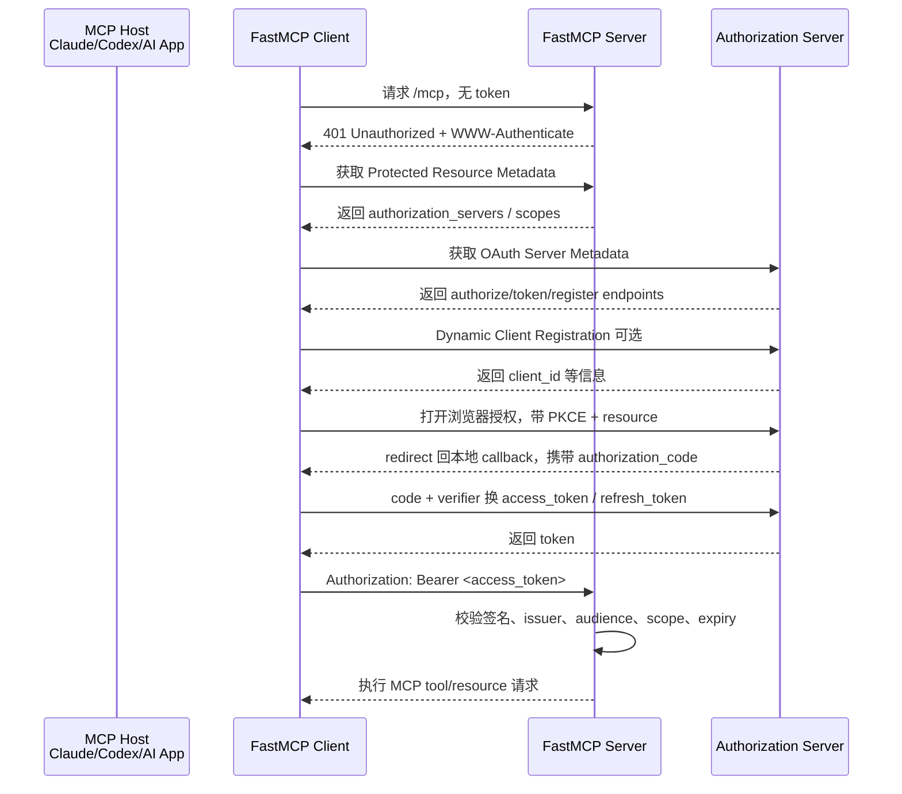

## 结论先说

**FastMCP 本身不是“账号密码系统”，它更像是在 MCP Server / Client 上提供一层认证适配能力。**

从工程角度看，FastMCP 的认证机制分三类：

|场景|FastMCP 机制|适合什么|
|---|---|---|
|简单内部系统|Bearer Token / JWT 校验|服务账号、CI/CD、内网微服务|
|企业级远程 MCP|OAuth 2.1 + PKCE + DCR|用户登录授权、第三方身份提供商|
|传统 OAuth 提供商|OAuthProxy|GitHub / Google / Azure 等不支持 DCR 的 OAuth Provider|

FastMCP 官方明确说明：**认证只适用于 HTTP-based transports，也就是 `http` 和 `sse`；STDIO transport 继承本地执行环境的安全边界**。所以本地 Claude Desktop / Codex 通过 stdio 拉起 MCP Server 时，认证重点通常不在 MCP 协议层，而在“本地进程权限、配置文件、环境变量、文件系统权限”。([FastMCP](https://gofastmcp.com/servers/auth/authentication "Authentication - FastMCP"))

---

# 1. MCP / FastMCP 里的认证边界

MCP 官方授权模型基本沿用 OAuth 2.1 的角色划分：

|角色|在 MCP 里的对应|
|---|---|
|Resource Server|MCP Server，暴露 tools/resources/prompts|
|OAuth Client|MCP Client，代表 Host 去请求 MCP Server|
|Authorization Server|登录、授权、签发 token 的身份系统|
|Resource Owner|用户本人|

MCP 规范要求：受保护的 MCP Server 作为 OAuth 2.1 Resource Server，接收 access token；Authorization Server 负责和用户交互并签发 token。MCP Server 需要通过标准元数据告诉 Client：应该去哪一个 Authorization Server 获取 token。([modelcontextprotocol.io](https://modelcontextprotocol.io/specification/2025-06-18/basic/authorization "Authorization - Model Context Protocol"))

也就是说：

```text
MCP Server 不一定负责登录
MCP Server 主要负责：
1. 声明自己需要认证
2. 暴露认证元数据
3. 校验 Client 带来的 token
4. 根据 token claims / scopes 做授权判断
```

---

# 2. FastMCP 支持的主要认证方式

## 2.1 TokenVerifier：只做 Token 校验

这是最容易理解的一种。

流程是：

```text
外部认证系统签发 JWT
        ↓
MCP Client 请求 FastMCP Server
        ↓
请求头带 Authorization: Bearer <token>
        ↓
FastMCP Server 校验 token 签名、issuer、audience、过期时间、claims
        ↓
通过后执行 tool/resource
```

FastMCP 的 `TokenVerifier` / `JWTVerifier` 负责纯 token 校验，不参与完整 OAuth 登录流程。它会验证 JWT 签名、过期时间、issuer、audience，并从 claims 中提取授权信息。FastMCP 文档也强调，这种模式适合你控制 token 签发和 MCP Server，或者已有 JWT 基础设施的场景。([FastMCP](https://gofastmcp.com/servers/auth/authentication "Authentication - FastMCP"))

典型代码形态是：

```python
from fastmcp import FastMCP
from fastmcp.server.auth.providers.jwt import JWTVerifier

# MCP Server 只负责验证已有 JWT，不负责登录页面、用户注册等流程
auth = JWTVerifier(
    jwks_uri="https://auth.yourcompany.com/.well-known/jwks.json",
    issuer="https://auth.yourcompany.com",
    audience="mcp-production-api",
)

mcp = FastMCP(name="Protected API", auth=auth)
```

如果用 JWKS，FastMCP 会从 JWKS endpoint 获取公钥，支持密钥轮换；只有 issuer 和 audience 正确的 token 才会被接受。([FastMCP](https://gofastmcp.com/servers/auth/token-verification "Token Verification - FastMCP"))

**适合场景：**

```text
内部 MCP Server
公司统一网关已经完成登录
Auth Service 已经签发 JWT
FastMCP Server 只需要做资源服务器校验
```

---

## 2.2 Bearer Token：客户端直接带已有 token

FastMCP Client 也可以直接配置 Bearer token：

```python
from fastmcp import Client

async with Client(
    "https://your-server.fastmcp.app/mcp",
    auth="<your-token>",  # 不需要写 Bearer 前缀，FastMCP 会自动加
) as client:
    await client.ping()
```

FastMCP 文档说明，Bearer Token 认证适合 service accounts、long-lived API keys、CI/CD、认证在别处完成的非交互场景。它最终也是把 token 放到 HTTP 请求头里：`Authorization: Bearer <token>`。([FastMCP](https://gofastmcp.com/clients/auth/bearer "Bearer Token Authentication - FastMCP"))

这类方式可以理解为：

```text
FastMCP Client 不负责登录
你提前拿到了 token
Client 每次请求 MCP Server 时带上 token
Server 侧用 JWTVerifier / 自定义验证器校验
```

---

## 2.3 OAuth：完整用户授权流程

如果是用户面向的远程 MCP，比如：

```text
用户在某个 AI App 里连接 GitHub MCP
用户在某个 Agent 平台里连接 Notion / Google Drive / Slack MCP
用户授权后，Agent 才能访问对应资源
```

这时更适合 OAuth 2.1 授权码流程 + PKCE。

FastMCP Client 支持：

```python
from fastmcp import Client
from fastmcp.client.auth import OAuth

oauth = OAuth(mcp_url="https://your-server.fastmcp.app/mcp")

async with Client(
    "https://your-server.fastmcp.app/mcp",
    auth=oauth,
) as client:
    await client.ping()
```

FastMCP 文档说明，`OAuth` helper 会处理 OAuth 2.1 Authorization Code Grant with PKCE，并实现完整的 `httpx.Auth` 接口。([FastMCP](https://gofastmcp.com/v2/clients/auth/oauth "OAuth Authentication - FastMCP"))

---

# 3. 完整 OAuth 认证流程

可以把流程理解成下面这样：



关键步骤如下。

---

## 3.1 Server 返回 401，并告诉 Client 去哪里发现认证信息

MCP 官方教程描述：当 MCP Client 首次连接受保护 MCP Server 时，Server 会返回 `401 Unauthorized`，并通过 `WWW-Authenticate` header 指向 Protected Resource Metadata 文档。([modelcontextprotocol.io](https://modelcontextprotocol.io/docs/tutorials/security/authorization "Understanding Authorization in MCP - Model Context Protocol"))

形式类似：

```http
HTTP/1.1 401 Unauthorized
WWW-Authenticate: Bearer realm="mcp",
  resource_metadata="https://your-server.com/.well-known/oauth-protected-resource"
```

这一步很重要。

传统 Web 应用常见做法是：

```text
没登录 → 302 跳转登录页
```

但 MCP 更适合：

```text
没 token → 401 + 元数据地址
Client 自己根据元数据完成认证发现
```

因为 MCP Client 往往是程序，不一定是浏览器。

---

## 3.2 Client 获取 Protected Resource Metadata

Client 会读取 MCP Server 的资源元数据，知道：

```json
{
  "resource": "https://your-server.com/mcp",
  "authorization_servers": ["https://auth.your-server.com"],
  "scopes_supported": ["mcp:tools", "mcp:resources"]
}
```

MCP 规范要求 MCP Server 必须实现 OAuth 2.0 Protected Resource Metadata，并且其中必须包含至少一个 `authorization_servers` 字段；MCP Client 必须使用这个元数据来发现授权服务器。([modelcontextprotocol.io](https://modelcontextprotocol.io/specification/2025-06-18/basic/authorization "Authorization - Model Context Protocol"))

这就是 MCP 相比普通 API 调用多出来的一层：

```text
不是你手动写死 auth server
而是 MCP Server 通过标准元数据告诉 MCP Client：
“我受谁保护，你去哪里拿 token”
```

---

## 3.3 Client 获取 Authorization Server Metadata

Client 选择一个 Authorization Server 后，会继续读取 OAuth / OIDC metadata，找到：

```text
authorization_endpoint
token_endpoint
registration_endpoint
jwks_uri
scopes_supported
response_types_supported
grant_types_supported
```

MCP 规范要求 Authorization Server 提供 OAuth 2.0 Authorization Server Metadata，MCP Client 必须使用该元数据。([modelcontextprotocol.io](https://modelcontextprotocol.io/specification/2025-06-18/basic/authorization "Authorization - Model Context Protocol"))

---

## 3.4 Dynamic Client Registration：动态注册客户端

MCP 的特殊点在这里。

普通 OAuth 通常是：

```text
先去 GitHub / Google 后台创建 OAuth App
拿到 client_id / client_secret
写进你的应用配置
```

但 MCP 的生态里，Client 可能临时连接各种 MCP Server，不可能每个都提前人工注册。因此 MCP 规范建议 MCP Client 和 Authorization Server 支持 Dynamic Client Registration，也就是 DCR。([modelcontextprotocol.io](https://modelcontextprotocol.io/specification/2025-06-18/basic/authorization "Authorization - Model Context Protocol"))

FastMCP 的 OAuth flow 里也包含 DCR：如果 OAuth Server 支持，并且客户端还没有注册或没有缓存凭据，Client 会按 RFC 7591 执行动态客户端注册。([FastMCP](https://gofastmcp.com/v2/clients/auth/oauth "OAuth Authentication - FastMCP"))

简化理解：

```text
MCP Client：你好，我是一个新的 MCP Client，我的 callback 地址是 xxx
Auth Server：好的，给你 client_id
MCP Client：拿着 client_id 去发起 OAuth 登录授权
```

---

## 3.5 用户浏览器登录授权 + PKCE

FastMCP Client 会启动一个本地临时 callback server，然后打开用户浏览器，让用户登录并授权 scopes。授权通过后，Authorization Server 会把 `authorization_code` 重定向回本地 callback。FastMCP Client 再用这个 code 和 PKCE verifier 去 token endpoint 换取 access token 和 refresh token。([FastMCP](https://gofastmcp.com/v2/clients/auth/oauth "OAuth Authentication - FastMCP"))

这一步相当于：

```text
用户确认：这个 MCP Client 可以代表我访问这个 MCP Server 暴露的能力
```

例如：

```text
允许访问 GitHub 仓库信息
允许读取某个知识库
允许调用某些内部工具
```

---

## 3.6 Client 每次请求都带 Bearer Token

MCP 规范要求 MCP Client 必须使用：

```http
Authorization: Bearer <access-token>
```

并且授权信息必须出现在每一个从 Client 到 Server 的 HTTP 请求中，不能只在“会话第一次请求”里带一次。规范还明确要求 access token 不能放在 URI query string 里。([modelcontextprotocol.io](https://modelcontextprotocol.io/specification/2025-06-18/basic/authorization "Authorization - Model Context Protocol"))

也就是说：

```text
正确：
Authorization: Bearer eyJ...

错误：
/mcp?access_token=eyJ...
```

---

## 3.7 Server 校验 token

MCP Server 作为 OAuth 2.1 Resource Server，必须校验 access token，并且必须验证 token 确实是签发给当前 MCP Server 这个 audience/resource 的。校验失败时应该返回 401；scope 不足时应该返回 403。([modelcontextprotocol.io](https://modelcontextprotocol.io/specification/2025-06-18/basic/authorization "Authorization - Model Context Protocol"))

校验通常包括：

```text
1. token 签名是否合法
2. token 是否过期
3. issuer 是否可信
4. audience / resource 是否是当前 MCP Server
5. scope / claims 是否允许调用当前 tool/resource
6. 是否存在 token replay / token passthrough 风险
```

---

# 4. FastMCP Server 侧的几种 Provider

FastMCP 官方文档把 Server 认证 Provider 分成几类：

## 4.1 `TokenVerifier`

只校验 token，不暴露完整 OAuth discovery。

适合：

```text
内部系统
已有 JWT
已有 API Gateway / Auth Service
不需要 MCP Client 自动完成 OAuth 登录
```

FastMCP 文档说明，`TokenVerifier` 会处理 JWT 签名验证、过期检查、claims 提取，并验证 issuer 和 audience，避免接受本不该发给当前 Server 的 token。([FastMCP](https://gofastmcp.com/servers/auth/authentication "Authentication - FastMCP"))

---

## 4.2 `RemoteAuthProvider`

用于对接支持 DCR 的外部身份提供商。

它比 `TokenVerifier` 多做一件事：

```text
不仅校验 token
还提供 MCP Client 自动发现 OAuth 认证要求所需的 metadata endpoint
```

FastMCP 文档说明，`RemoteAuthProvider` 结合了 token validation 和 OAuth discovery metadata，MCP Client 可以检查这些端点，知道应该信任哪些身份提供商，以及如何获得有效 token。([FastMCP](https://gofastmcp.com/servers/auth/authentication "Authentication - FastMCP"))

适合：

```text
生产级远程 MCP
企业身份系统
身份提供商支持 Dynamic Client Registration
```

---

## 4.3 `OAuthProxy`

用于对接不支持 DCR 的传统 OAuth Provider。

很多传统 OAuth 系统，例如 GitHub、Google、Azure、AWS，通常要求你提前在后台注册 OAuth App，并配置固定 redirect URI。FastMCP 文档说明，`OAuthProxy` 的作用就是在 MCP Client 需要 DCR 的世界和传统 OAuth Provider 固定注册的世界之间做桥接。([FastMCP](https://gofastmcp.com/servers/auth/authentication "Authentication - FastMCP"))

可以理解为：

```text
MCP Client 以为自己面对的是一个支持 DCR 的 OAuth Server
FastMCP OAuthProxy 在中间接住请求
OAuthProxy 再用你预注册好的 GitHub / Google / Azure OAuth App 去完成上游授权
```

适合：

```text
MCP Server 要对接 GitHub / Google / Azure / AWS
但这些 Provider 不按 MCP 期待的 DCR 模型工作
```

---

# 5. 一句话区分：认证、授权、工具安全

很多 MCP 安全问题容易混在一起。

| 层次                       | 解决什么        | FastMCP / MCP 机制                |
| ------------------------ | ----------- | ------------------------------- |
| Authentication           | 你是谁         | Bearer Token、JWT、OAuth 登录       |
| Authorization            | 你能干什么       | scopes、claims、audience、resource |
| Tool Permission          | 你能调用哪个 tool | Server 侧按 tool/resource 做权限判断   |
| Runtime Safety           | tool 调用是否危险 | 参数校验、沙箱、审批、审计、速率限制              |
| Prompt Injection Defense | 模型是否被工具结果诱导 | tool 输出隔离、内容标记、策略判断             |

**认证成功不等于安全。**

例如用户有 token，但你仍然需要判断：

```text
这个 token 是否允许调用 delete_file？
是否只能读 GitHub issue，不能写 repo？
是否只能访问用户自己的 workspace？
tool 参数是否越权？
tool 返回内容是否可能包含 prompt injection？
```

---

# 6. FastMCP 认证的实际工程流程

## 内部系统简化版

适合教学 demo / 内网服务：

```text
1. 公司 Auth Service 签发 JWT
2. MCP Client 配置 Bearer token
3. FastMCP Server 使用 JWTVerifier
4. 每次 HTTP/SSE 请求带 Authorization header
5. Server 校验 issuer/audience/expiry/scope
6. 根据 claims 控制 tool/resource 权限
```

代码大概是：

```python
from fastmcp import FastMCP
from fastmcp.server.auth.providers.jwt import JWTVerifier

# 只做资源服务器校验，不处理登录流程
auth = JWTVerifier(
    jwks_uri="https://auth.example.com/.well-known/jwks.json",
    issuer="https://auth.example.com",
    audience="my-mcp-server",
)

mcp = FastMCP(
    name="Secure MCP Server",
    auth=auth,
)

@mcp.tool
def query_order(order_id: str) -> dict:
    # 实际生产中还需要在 tool 内部结合用户 claims 做数据权限判断
    return {"order_id": order_id, "status": "PAID"}
```

Client：

```python
from fastmcp import Client

async with Client(
    "https://mcp.example.com/mcp",
    auth="eyJhbGciOi...",  # FastMCP 会自动加 Bearer
) as client:
    result = await client.call_tool("query_order", {"order_id": "123"})
```

---

## 企业远程 MCP 标准版

适合正式产品：

```text
1. MCP Client 请求 MCP Server
2. Server 返回 401 + Protected Resource Metadata
3. Client 发现 Authorization Server
4. Client 做 DCR 或使用已有 client_id
5. 用户浏览器登录授权
6. Client 用 Authorization Code + PKCE 换 token
7. Client 缓存 access_token / refresh_token
8. 后续每次请求带 Authorization: Bearer
9. Server 校验 token + audience + scopes
10. Server 决定是否允许调用对应 tool/resource
```

FastMCP Client 的 OAuth flow 文档中也明确列出了 token check、OAuth server discovery、DCR、本地 callback server、浏览器交互、authorization code exchange、token caching、authenticated requests、refresh token 这些步骤。([FastMCP](https://gofastmcp.com/v2/clients/auth/oauth "OAuth Authentication - FastMCP"))

---

# 7. 实战里最容易忽略的安全点

## 7.1 必须校验 audience / resource

只校验 JWT 签名不够。

错误做法：

```text
只要 token 是公司 Auth Service 签发的，就允许访问 MCP Server
```

正确做法：

```text
token 必须是签发给当前 MCP Server / 当前 resource 的
```

MCP 规范明确要求 MCP Server 验证 access token 是专门为当前 MCP Server 这个目标 audience 签发的。([modelcontextprotocol.io](https://modelcontextprotocol.io/specification/2025-06-18/basic/authorization "Authorization - Model Context Protocol"))

否则会出现：

```text
用户拿着 A 服务的 token
误用或恶意用于 B MCP Server
```

这就是 token audience 混淆。

---

## 7.2 不要做 token passthrough

MCP Server 不应该随便接受或转发不属于自己的 token。MCP 规范要求 MCP Server 不得接受或传递其他 token；MCP Client 也不应该把不是该 MCP Server 授权服务器签发的 token 发给它。([modelcontextprotocol.io](https://modelcontextprotocol.io/specification/2025-06-18/basic/authorization "Authorization - Model Context Protocol"))

简单说：

```text
不要把用户登录 GitHub 的 token 原样传给你的内部 MCP Server
不要让一个 MCP Server 拿到另一个服务的高权限 token 后到处转发
```

---

## 7.3 token 存储要加密

FastMCP Client 默认 token 存在内存里，应用重启后丢失；如果要持久化，需要配置 storage。FastMCP 文档提示，生产环境应使用加密存储，因为 MCP Client 可能积累多个 MCP Server 的 OAuth 凭据，一旦 token store 泄漏，多个服务都会受影响。([FastMCP](https://gofastmcp.com/v2/clients/auth/oauth "OAuth Authentication - FastMCP"))

---

## 7.4 scopes 要和 tools 对齐

不要只做：

```text
登录成功 → 所有 tools 都能调用
```

更合理的是：

```text
mcp:orders:read       → query_order
mcp:orders:write      → update_order
mcp:repo:read         → read_repo
mcp:repo:write        → create_pr
mcp:admin             → dangerous_admin_tool
```

认证只是入口，真正的权限边界应该落到 tool/resource 级别。

---

## 7.5 STDIO MCP 不是没有风险，只是风险在别处

FastMCP 文档说 STDIO transport 继承本地执行环境安全。([FastMCP](https://gofastmcp.com/servers/auth/authentication "Authentication - FastMCP"))

这意味着：

```text
本地 stdio MCP Server 的风险不是 HTTP token
而是：
- 这个本地进程能读哪些文件
- 环境变量里有没有 API key
- MCP Server 是否能执行 shell
- Host 是否允许用户确认危险 tool 调用
- 配置文件是否被恶意篡改
```

所以本地 MCP 的安全重点是：

```text
最小权限
隔离目录
不要暴露高危环境变量
危险 tool 需要人工确认
日志脱敏
```

---

# 8. 你可以这样理解 FastMCP 安全认证

最终可以压缩成一句话：

> **FastMCP 的认证机制，本质是让 MCP over HTTP/SSE 变成一个标准 OAuth 2.1 Resource Server：Client 通过元数据发现认证要求，通过 OAuth / Bearer token 获得访问凭证，然后每次请求带 `Authorization: Bearer <token>`，Server 校验 token 的签名、issuer、audience、scope，再决定是否允许调用具体 tool/resource。**

更工程化一点：

```text
FastMCP 不负责替你“自动安全”
它提供认证接入点：

Client 侧：
- auth="oauth"
- OAuth(...)
- auth="<bearer-token>"
- BearerAuth(...)

Server 侧：
- JWTVerifier
- TokenVerifier
- RemoteAuthProvider
- OAuthProxy
- OAuthProvider
- MultiAuth

真正的安全设计还要你自己补：
- tool 级权限
- 参数校验
- 数据权限
- 审计日志
- token 加密存储
- 高危操作确认
- prompt injection 防护
- 最小权限隔离
```