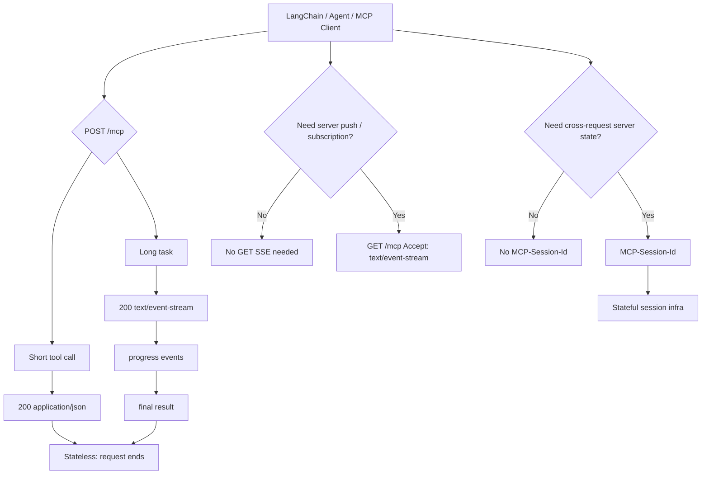

# Streamable HTTP 是什么

**Streamable HTTP 是 MCP 当前用于远程连接的主力 HTTP transport。**

它的核心不是“把 SSE 换了个名字”，而是：

```text
Streamable HTTP
= 单一 HTTP endpoint
+ 每条客户端消息用 HTTP POST
+ 普通结果可直接返回 JSON
+ 长任务 / 多消息场景可返回 request-scoped SSE
+ 可选 GET SSE 流
+ 可选 MCP-Session-Id
+ 支持 stateless 和 stateful 两种部署模型
```

官方规范把 Streamable HTTP 描述为：client 向单一 MCP endpoint 发送 HTTP POST；server 可以返回 `application/json`，也可以返回 `text/event-stream`；同时为想建立有状态 session 的 server 提供 `MCP-Session-Id` 机制。注意措辞是 **to support servers which want to establish stateful sessions**，也就是“支持想建立有状态 session 的 server”，不是强制所有 server 都有状态。([模型上下文协议](https://modelcontextprotocol.io/specification/2025-11-25/basic/transports?utm_source=chatgpt.com "Transports"))

---

# 1. 为什么它要替代旧 HTTP+SSE

旧 HTTP+SSE 的典型结构是：

```text
GET  /sse       # 长连接，server -> client
POST /messages  # client -> server
```

它的问题是：**通信模型天然偏长连接和会话绑定**。

这会带来几个现实缺陷：

|问题|影响|
|---|---|
|两个 endpoint|鉴权、CORS、反向代理、路由更复杂|
|SSE 长连接是主通道|对 serverless、网关、负载均衡不友好|
|会话与连接绑定较强|多副本部署需要 sticky session 或共享状态|
|简单工具调用也绕不开会话模型|对“查订单、算汇率、查库存”这类一次性工具过重|
|断线恢复语义复杂|连接断了、任务是否取消、消息是否重放都要额外处理|

所以 Streamable HTTP 的方向是：

```text
普通 HTTP 请求优先；
需要流式时才 streaming；
需要会话时才 session。
```

---

# 2. Streamable HTTP 的基本协议模型

## 2.1 单一 endpoint

通常只有一个 MCP endpoint：

```text
/mcp
```

它可以支持：

```http
POST /mcp
GET /mcp
DELETE /mcp
```

其中最核心的是 `POST /mcp`。

---

## 2.2 POST：客户端发送 JSON-RPC 消息

MCP 本身使用 JSON-RPC 2.0。客户端把 MCP request / notification / response 通过 HTTP POST 发给 server。

示意：

```http
POST /mcp
Content-Type: application/json
Accept: application/json, text/event-stream
MCP-Protocol-Version: 2025-11-25
```

Body 类似：

```json
{
  "jsonrpc": "2.0",
  "id": 1,
  "method": "tools/call",
  "params": {
    "name": "get_order_status",
    "arguments": {
      "order_id": "A1002"
    }
  }
}
```

server 可以选择两种返回方式。

---

## 2.3 返回方式一：普通 JSON response

适合短任务、一次性工具调用。

```http
HTTP/1.1 200 OK
Content-Type: application/json
```

```json
{
  "jsonrpc": "2.0",
  "id": 1,
  "result": {
    "status": "SHIPPED"
  }
}
```

这就是 Streamable HTTP 支持 stateless 的基础：  
**一次 POST，一次 JSON response，请求结束，server 不需要保存 transport session。**

---

## 2.4 返回方式二：request-scoped SSE stream

适合长任务、进度通知、多条 MCP 消息。

```http
HTTP/1.1 200 OK
Content-Type: text/event-stream
```

```text
event: message
data: {"jsonrpc":"2.0","method":"notifications/progress","params":{"progress":0.3}}

event: message
data: {"jsonrpc":"2.0","id":1,"result":{"done":true}}
```

注意这个 SSE 和旧 HTTP+SSE 的角色不同：

|对比项|旧 HTTP+SSE|Streamable HTTP 中的 SSE|
|---|---|---|
|SSE 地位|主通信通道|可选返回形态|
|连接生命周期|常偏长连接|可以是 request-scoped|
|简单请求是否需要 SSE|通常绕不开|不需要|
|endpoint|独立 SSE endpoint|同一个 `/mcp` endpoint 可返回 SSE|

所以 Streamable HTTP 不是“不要 SSE”，而是把 SSE 从“固定主通道”降级成“按需 streaming 能力”。

---

# 3. Stateless：Streamable HTTP 的关键创新

这是你前面指出的重点。

## 3.1 什么叫 stateless MCP server

这里的 stateless 指的是 **MCP transport 层无状态**：

```text
server 不依赖 MCP-Session-Id 记住某个 client；
每个 HTTP 请求都能独立处理；
请求之间不要求同一个 server 实例接住。
```

典型流程：

```text
Client
  |
  | POST /mcp tools/call get_order_status(order_id=A1002)
  v
Server instance A
  |
  | 200 application/json
  v
Client
```

下一次请求可以打到 instance B：

```text
Client
  |
  | POST /mcp tools/call get_order_status(order_id=A1003)
  v
Server instance B
  |
  | 200 application/json
  v
Client
```

只要请求参数完整，server 就能处理。

---

## 3.2 stateless 适合什么场景

大多数工具型 MCP server 都适合 stateless：

|工具类型|是否适合 stateless|原因|
|---|--:|---|
|查订单|适合|`order_id` 显式传入|
|查库存|适合|`sku` / `warehouse_id` 显式传入|
|查询知识库|适合|query 显式传入|
|调内部 HTTP API|适合|每次请求独立|
|汇率换算|适合|参数完整|
|查询数据库只读视图|适合|条件显式传入|
|生成摘要|适合|输入内容显式传入|

FastMCP 的部署文档也把 stateless HTTP 作为横向扩容的重要配置，指出多实例部署时如果 session 只存在于某个实例内存里，请求路由到另一个实例就会失败；`stateless_http=True` 可以避免 session affinity 依赖。([FastMCP](https://gofastmcp.com/deployment/http?utm_source=chatgpt.com "HTTP Deployment"))

---

## 3.3 stateless 不等于业务没有状态

这个点非常重要。

**transport stateless** 不代表业务系统无状态。

你仍然可以有：

```text
user_id
tenant_id
order_id
task_id
workspace_id
browser_session_id
conversation_id
```

区别是：这些状态应该被**显式建模**，而不是隐式藏在 MCP transport session 里。

例如，不推荐：

```text
第 1 次调用：打开浏览器
第 2 次调用：点击按钮
第 3 次调用：截图

server 靠 MCP-Session-Id 记住浏览器实例
```

更推荐：

```text
create_browser_session() -> browser_id
click(browser_id, selector)
screenshot(browser_id)
close_browser_session(browser_id)
```

这样 MCP transport 仍然可以 stateless，但业务状态由 `browser_id` 显式承载，可以放在 Redis / DB / 浏览器池里。

---

# 4. Stateful：Streamable HTTP 也支持有状态

Streamable HTTP 不是只能 stateless。官方规范保留了 session 机制。

## 4.1 MCP-Session-Id

如果 server 想建立 stateful session，可以在初始化响应里返回：

```http
MCP-Session-Id: 7f3d9a...
```

后续 client 请求要带上：

```http
MCP-Session-Id: 7f3d9a...
```

官方规范里对 session 的描述是：为了支持想建立有状态 session 的 server，server 可以分配 session ID；session ID 应该全局唯一且具备安全随机性；如果 server 要求 session ID 而 client 没有提供，可以返回 `400 Bad Request`。([模型上下文协议](https://modelcontextprotocol.io/specification/2025-11-25/basic/transports?utm_source=chatgpt.com "Transports"))

---

## 4.2 stateful 适合什么场景

stateful 适合这些场景：

|场景|为什么需要 stateful|
|---|---|
|resource subscription|server 要持续推送资源变化|
|server-to-client notification|server 可能主动向 client 发消息|
|server-to-client request|server 需要反向请求 client 能力|
|长任务进度追踪|需要持续 progress、恢复、取消|
|per-client workspace|每个 client 有隔离上下文|
|浏览器自动化|浏览器实例天然跨调用存在|
|交互式 shell / REPL|进程上下文需要保留|
|旧客户端兼容|legacy SSE client 可能依赖会话|

也就是说，**stateful 是增强能力，不是默认心智模型**。

---

# 5. GET /mcp：可选 SSE 流

Streamable HTTP 还允许 client 用 GET 打开 SSE 流：

```http
GET /mcp
Accept: text/event-stream
```

这个流可以用于 server 主动消息，比如：

```text
notifications
logging
progress
resource updates
server-to-client requests
```

但这不是所有 MCP server 都必须实现的。对于纯工具型 stateless server，完全可以不支持 GET SSE 流。

所以可以理解成：

```text
POST /mcp 是主路径；
GET /mcp SSE 是高级能力；
MCP-Session-Id 是可选 session 能力。
```

---

# 6. Streamable HTTP 的三种常见形态

## 6.1 形态 A：Stateless JSON response

最常见，最适合生产工具服务。

```text
POST /mcp
  -> tools/call

200 application/json
  -> result
```

特点：

```text
无 MCP-Session-Id
无长连接
无 sticky session
容易接 API Gateway / K8S / serverless
```

适合：

```text
查订单、查库存、查 CRM、RAG 检索、内部 API wrapper
```

---

## 6.2 形态 B：Stateless request-scoped streaming

一次请求内流式返回，但请求结束后不保存 session。

```text
POST /mcp
  -> long_running_tool()

200 text/event-stream
  -> progress event
  -> progress event
  -> final result
  -> stream close
```

特点：

```text
请求期间 streaming
请求结束即释放
仍不需要跨请求 session
```

适合：

```text
长文档处理
批量分析
代码扫描
RAG 批量检索进度
文件转换
```

---

## 6.3 形态 C：Stateful session

server 分配 `MCP-Session-Id`，后续请求都带 session。

```text
initialize
  <- MCP-Session-Id: abc

tools/call
  -> MCP-Session-Id: abc
```

特点：

```text
可跨请求保存 client 状态
但部署复杂度更高
```

适合：

```text
订阅、推送、交互式环境、浏览器会话、workspace 隔离
```

---

# 7. 和 HTTP+SSE 的本质差异

最关键的差异可以压缩成这张表：

|维度|Legacy HTTP+SSE|Streamable HTTP|
|---|---|---|
|通信入口|SSE endpoint + message endpoint|单一 `/mcp` endpoint|
|主通信模型|长连接优先|HTTP POST 优先|
|简单工具调用|偏重|轻量，一次请求一次响应|
|SSE|主通道|可选 streaming 响应|
|session|更强绑定|可选|
|stateless 部署|不友好|明确支持|
|多副本部署|容易要求 sticky session|stateless 模式更自然|
|serverless|较麻烦|更适合|
|当前地位|legacy / deprecated|当前推荐远程 transport|

一句话：

```text
HTTP+SSE 是“先建立连接，再交换消息”；
Streamable HTTP 是“先按 HTTP 请求处理，必要时再流式化 / 会话化”。
```

---

# 8. LangChain 里的当前实践

LangChain 的 MCP adapter 当前也体现了这个方向：  
`MultiServerMCPClient` 默认是 stateless。官方文档写明：每次 tool invocation 会创建一个新的 MCP `ClientSession`，执行工具，然后清理；如果需要控制 MCP session 生命周期，可以显式使用 `client.session()`。([LangChain 文档](https://docs.langchain.com/oss/python/langchain/mcp?utm_source=chatgpt.com "Model Context Protocol (MCP) - Docs by LangChain"))

也就是说 LangChain 默认心智是：

```text
每次工具调用独立；
不用长期持有 MCP session；
除非你明确需要 stateful server。
```

示意：

```python
from langchain_mcp_adapters.client import MultiServerMCPClient

client = MultiServerMCPClient(
    {
        "order": {
            "transport": "http",
            "url": "http://127.0.0.1:8000/mcp",
        }
    }
)

tools = await client.get_tools()
```

这里的 `"transport": "http"` 对应远程 MCP 的 Streamable HTTP。LangChain 文档也说明 MCP adapter 可以通过 HTTP transport 连接 MCP server。([LangChain 文档](https://docs.langchain.com/oss/python/langchain/mcp?utm_source=chatgpt.com "Model Context Protocol (MCP) - Docs by LangChain"))

---

# 9. FastMCP 里的当前实践

FastMCP 文档把 HTTP transport 描述为 Streamable HTTP，并且提供 `stateless_http` 配置。`stateless_http=True` 的含义是每个请求使用新的 transport context，避免多副本部署时依赖 session affinity。([FastMCP](https://gofastmcp.com/deployment/http?utm_source=chatgpt.com "HTTP Deployment"))

典型 server：

```python
from fastmcp import FastMCP

mcp = FastMCP("order-mcp")


@mcp.tool()
def get_order_status(order_id: str) -> dict:
    """Query order status by explicit order_id."""
    return {
        "order_id": order_id,
        "status": "SHIPPED",
    }


if __name__ == "__main__":
    # HTTP transport 使用 Streamable HTTP。
    # stateless_http=True 更适合多副本、网关、serverless 等部署。
    mcp.run(
        transport="http",
        host="127.0.0.1",
        port=8000,
        stateless_http=True,
    )
```

调用侧：

```python
import asyncio
from langchain_mcp_adapters.client import MultiServerMCPClient


async def main():
    client = MultiServerMCPClient(
        {
            "order": {
                "transport": "http",
                "url": "http://127.0.0.1:8000/mcp",
            }
        }
    )

    tools = await client.get_tools()

    for tool in tools:
        print(tool.name, tool.description)


if __name__ == "__main__":
    asyncio.run(main())
```

---

# 10. 生产设计建议

## 10.1 默认优先 stateless

对于大多数企业内部 MCP tool server，优先：

```python
stateless_http=True
```

工具参数显式化：

```python
@mcp.tool()
def query_order(order_id: str, user_id: str) -> dict:
    ...
```

不要依赖隐式 session：

```python
# 不推荐：靠“当前 session 用户”隐式判断
def query_current_order() -> dict:
    ...
```

---

## 10.2 业务状态显式外置

如果有状态，就显式给 ID：

```text
create_job() -> job_id
get_job_status(job_id)
cancel_job(job_id)
get_job_result(job_id)
```

而不是：

```text
start_job()
get_current_job_status()
cancel_current_job()
```

这样更利于：

```text
水平扩容
重试
审计
幂等
故障恢复
权限校验
```

---

## 10.3 确实需要 stateful 时，要配套基础设施

如果使用 `MCP-Session-Id`，就要考虑：

|事项|说明|
|---|---|
|session store|内存、Redis、数据库还是分布式状态|
|session affinity|是否需要 sticky session|
|session timeout|长时间不用是否回收|
|resource cleanup|浏览器、进程、文件句柄如何释放|
|auth binding|session 是否绑定 user / tenant|
|replay 防护|session id 泄漏后的风险|
|observability|session 级别 trace / audit|
|failover|实例挂了 session 怎么迁移|

---

## 10.4 不要把 MCP 当裸 API 网关

MCP tool 是给 LLM / Agent 调用的，风险比普通 API 更高。尤其要防：

```text
prompt injection
tool poisoning
越权参数
过宽工具权限
任意 SQL / 任意命令
跨租户数据泄漏
```

所以工具设计要窄：

```python
# 推荐：语义明确、参数受控
@mcp.tool()
def get_customer_recent_orders(customer_id: str, limit: int = 10) -> list[dict]:
    ...

# 不推荐：把危险自由度交给模型
@mcp.tool()
def execute_sql(sql: str) -> str:
    ...
```

---

# 11. 一张总览图



---

# 12. 最终版心智模型

你可以这样记：

```text
Streamable HTTP 不是“新版 SSE”。
它是 MCP 的 HTTP-native transport。
```

更完整地说：

```text
1. 主路径是 POST /mcp。
2. 普通工具调用直接 JSON 返回。
3. 需要流式时，当前请求可以返回 SSE。
4. 需要 server 主动消息时，可以 GET /mcp 打开 SSE。
5. 需要跨请求状态时，才使用 MCP-Session-Id。
6. 不需要跨请求状态时，可以完全 stateless。
```

工程上优先级：

```text
默认：stateless Streamable HTTP
需要流式：request-scoped SSE
需要推送/订阅/跨调用上下文：stateful session
兼容老客户端：legacy SSE fallback
```

所以，当前更准确的结论是：

> **Streamable HTTP 的核心价值，是把 MCP 远程 transport 从“长连接/会话优先”改成“HTTP 请求优先、stateless 友好、streaming 和 session 按需启用”的模型。**