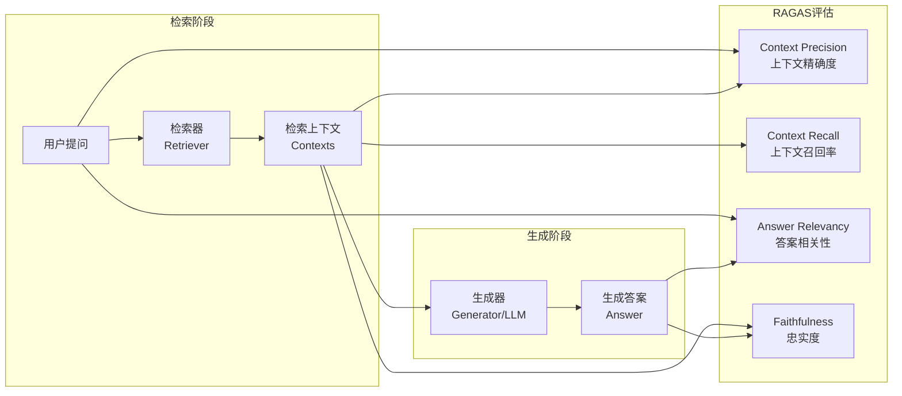
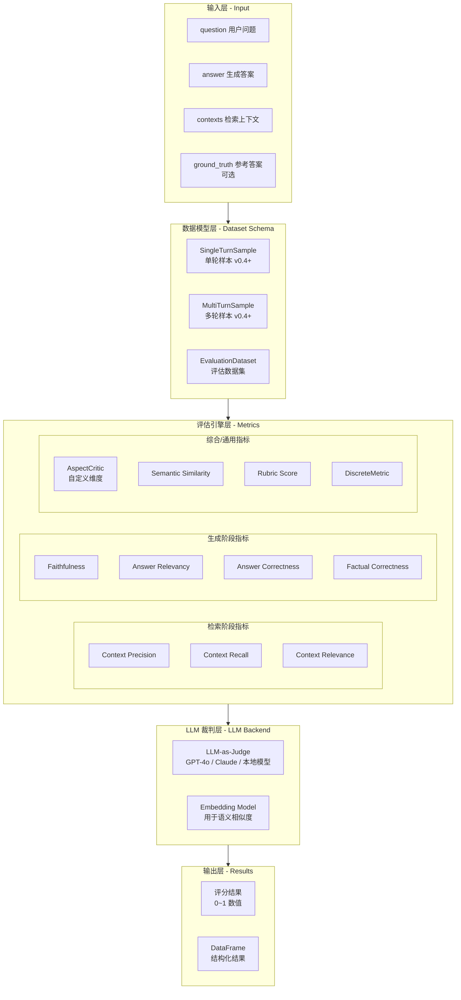
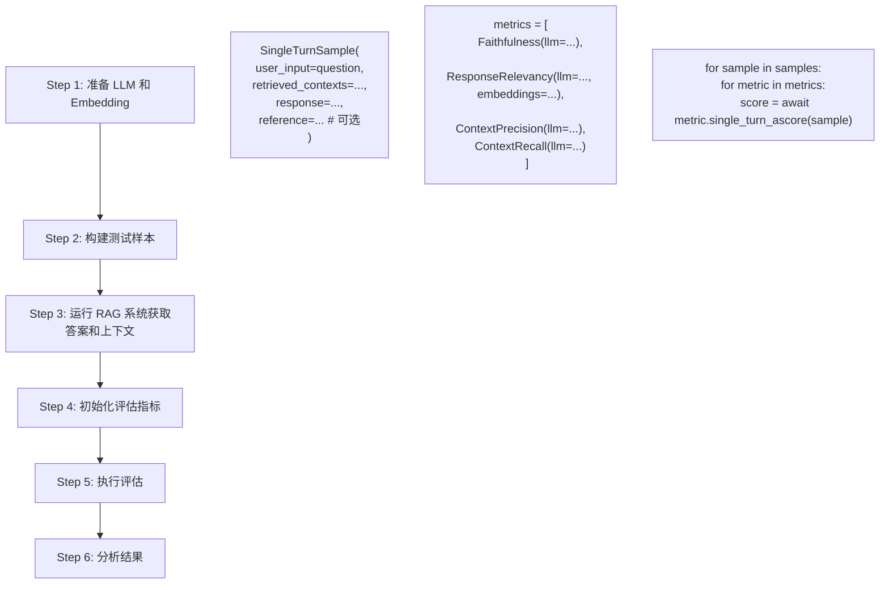
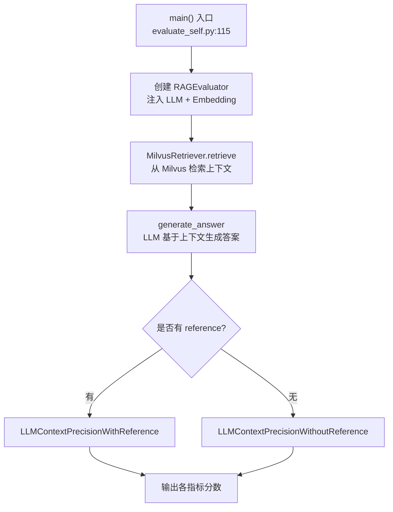
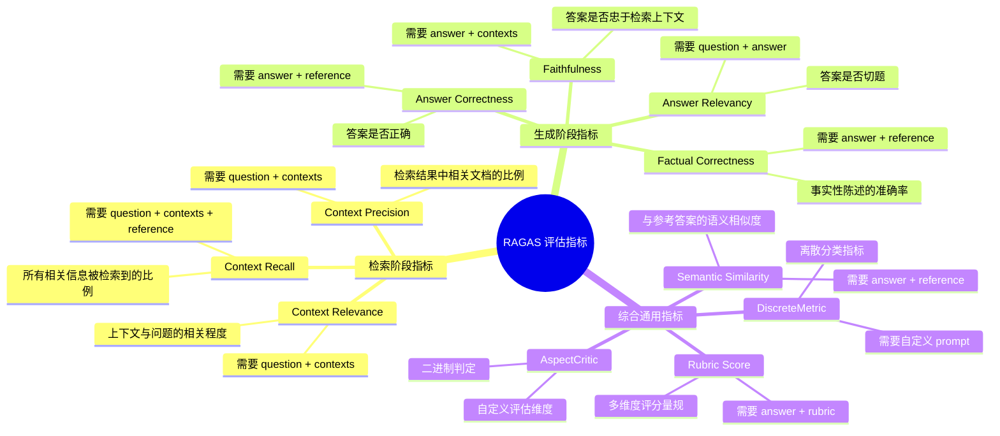
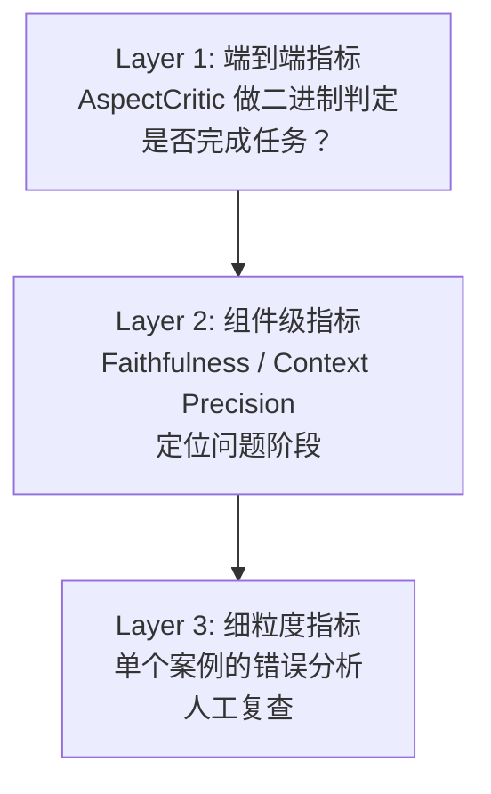

# RAGAS 评估框架系统性学习指南

> 文档定位：面向入门到进阶的 RAGAS（Retrieval-Augmented Generation Assessment）框架系统性学习文档。基于 RAGAS 官方文档（v0.3.x / v0.4.x）、arXiv 论文及社区最佳实践编写，涵盖基本概念、核心功能、架构设计、安装配置、API 使用、评估指标体系、应用场景与最佳实践。

---

## 一、RAGAS 基本概念

### 1.1 什么是 RAGAS

RAGAS（**R**etrieval **A**ugmented **G**eneration **As**sessment）是专为 RAG 系统设计的开源评估框架，由 Exploding Gradients 团队开发维护。其核心思想可概括为：**用 LLM 作为裁判，自动判断 RAG 系统的输出质量**。

RAGAS 的学术论文发表于 arXiv（2309.15217）[^1]，其核心贡献是：

> "We put forward a suite of metrics which can be used to evaluate different dimensions without having to rely on ground truth human annotations."

即：**无需人工标注参考答案，即可对 RAG 系统进行多维度自动评估**。

### 1.2 为什么需要 RAGAS

传统 NLP 评估指标（BLEU、ROUGE、METEOR）在 RAG 场景下几乎完全失效[^6]：

| 传统指标 | 失效原因 |
| --- | --- |
| **BLEU** | 基于 n-gram 重叠，完全不懂语义。BLEU 0.78 的系统可能仍幻觉财务数据 |
| **ROUGE** | 仅做字符串匹配，无法判断"这个答案是否基于检索上下文" |
| **Exact Match** | RAG 答案天然具有多样性表达，"准确但写法不同"被误判为错误 |

RAGAS 的解决方案是 **LLM-as-Judge**：用一个能力较强的 LLM（如 GPT-4o）充当"裁判"，从多个维度评分。

### 1.3 RAGAS 评估的核心理念

```
传统评估：    参考答案 + 生成答案 → BLEU/ROUGE → 分数
RAGAS 评估：  问题 + 检索上下文 + 生成答案 → LLM 裁判 → 多维度分数
```

RAGAS 评估覆盖 RAG 系统的两个关键阶段：



---

## 二、架构设计

### 2.1 RAGAS 系统架构



### 2.2 版本演进：v0.3 → v0.4+ 的关键变化

RAGAS 在 v0.4.0 进行了重大 API 重构[^4]。需要特别注意版本差异，网上大量旧教程使用的是已废弃的 API。

| 特性 | v0.3.x（旧版，已废弃） | v0.4.x+（新版，推荐） |
| --- | --- | --- |
| **数据模型** | `dict` 字典 | `SingleTurnSample` / `MultiTurnSample` |
| **批量评估** | `evaluate(dataset, metrics)` | `evaluate(dataset, metrics)` 保持兼容 |
| **单样本评估** | 无 | `scorer.single_turn_ascore(sample)` |
| **指标初始化** | `ResponseRelevancy()` 无常量注入 | `ResponseRelevancy(llm=..., embeddings=...)` 显式注入 |
| **LLM 包装** | 自动检测 | `LangchainLLMWrapper(llm)` 显式包装 |
| **数据集** | HuggingFace `Dataset` | `EvaluationDataset` + `SingleTurnSample` 列表 |
| **新模型支持** | 仅 OpenAI | 支持 GPT-5 / o-series + Anthropic / Gemini / Ollama |


---

## 三、安装配置步骤

### 3.1 基础安装

```bash
# 稳定版
pip install ragas

# 最新特性版
pip install git+https://github.com/vibrantlabsai/ragas.git

# 如果使用 LangChain 集成，显式安装兼容版本
pip install -U "langchain-core>=0.2,<0.3" "langchain-openai>=0.1,<0.2" openai
```

### 3.2 快速初始化项目

RAGAS v0.4+ 提供了 `ragas quickstart` 命令，一键生成评估项目脚手架：

```bash
# 方式一：使用 uvx（推荐，无需预装 ragas）
uvx ragas quickstart rag_eval
cd rag_eval

# 方式二：先安装 ragas 再创建
pip install ragas
ragas quickstart rag_eval
cd rag_eval
```

生成的目录结构：

```
rag_eval/
├── README.md
├── pyproject.toml
├── rag.py           # 你的 RAG 应用
├── evals.py          # 评估工作流
├── evals/
│   ├── datasets/     # 测试数据
│   ├── experiments/  # 评估结果
│   └── logs/         # 运行日志
```

### 3.3 LLM 与 Embedding 配置

RAGAS 用 LLM 做评分裁判，用 Embedding 模型做语义相似度计算。配置方式因后端而异：

```python
# ===== 方式一：OpenAI（最简单）=====
import os
from openai import AsyncOpenAI
from ragas.llms import llm_factory

client = AsyncOpenAI()
llm = llm_factory("gpt-4o-mini", client=client)

# ===== 方式二：LangChain 包装=====
from ragas.llms import LangchainLLMWrapper
from ragas.embeddings import LangchainEmbeddingsWrapper
from langchain_openai import ChatOpenAI, OpenAIEmbeddings

evaluator_llm = LangchainLLMWrapper(ChatOpenAI(
    model="gpt-4o",
    temperature=0.6,
))
evaluator_embeddings = LangchainEmbeddingsWrapper(OpenAIEmbeddings(
    model="text-embedding-v4",
    dimensions=1024,
))

# ===== 方式三：Anthropic Claude =====
from anthropic import Anthropic
client = Anthropic(api_key=os.environ["ANTHROPIC_API_KEY"])
llm = llm_factory("claude-3-5-sonnet-20241022", provider="anthropic", client=client)

# ===== 方式四：本地 Ollama =====
from openai import OpenAI
client = OpenAI(api_key="ollama", base_url="http://localhost:11434/v1")
llm = llm_factory("mistral", provider="openai", client=client)
```

---

## 四、使用方法：RAGAS 评估流程

### 4.1 评估流程概览



### 4.2 完整代码示例：单样本评估

以下是最简洁的单样本评估流程：

```python
from ragas import SingleTurnSample
from ragas.llms import LangchainLLMWrapper
from ragas.embeddings import LangchainEmbeddingsWrapper
from ragas.metrics import Faithfulness, ResponseRelevancy, ContextPrecision, ContextRecall

# Step 1: 准备 LLM 和 Embedding
evaluator_llm = LangchainLLMWrapper(llm)           # llm 是你的 LangChain ChatOpenAI 实例
evaluator_embeddings = LangchainEmbeddingsWrapper(embedding)

# Step 2: 构建评估样本
sample = SingleTurnSample(
    user_input="有界流和无界流有什么区别？",
    retrieved_contexts=[
        "有界流数据是指有明确的开始和结束的数据集...",
        "无界流数据是指持续不断产生、没有明确结束点的数据...",
    ],
    response="有界流有开始和结束，无界流是持续不断的数据流。",
    reference="有界流(bounded stream)具有明确的起止边界，无界流(unbounded stream)则没有。",  # 可选
)

# Step 3: 初始化指标并评估
metrics = [
    Faithfulness(llm=evaluator_llm),
    ResponseRelevancy(llm=evaluator_llm, embeddings=evaluator_embeddings),
    ContextPrecision(llm=evaluator_llm),
]

import asyncio
async def run():
    for metric in metrics:
        score = await metric.single_turn_ascore(sample)
        print(f"{metric.name}: {score:.4f}")

asyncio.run(run())
```

### 4.3 批量评估示例

```python
from ragas import evaluate, EvaluationDataset

# 构建批量样本
samples = [
    SingleTurnSample(
        user_input="什么是RAG？",
        retrieved_contexts=["RAG即检索增强生成..."],
        response="RAG是一种结合检索和生成的AI技术。",
    ),
    SingleTurnSample(
        user_input="RAGAS有哪些核心指标？",
        retrieved_contexts=["RAGAS的核心指标包括..."],
        response="包含Faithfulness、Answer Relevancy等。",
    ),
]

# 创建数据集
dataset = EvaluationDataset(samples=samples)

# 批量评估
results = evaluate(
    dataset=dataset,
    metrics=[
        Faithfulness(llm=evaluator_llm),
        ResponseRelevancy(llm=evaluator_llm, embeddings=evaluator_embeddings),
        ContextPrecision(llm=evaluator_llm),
    ],
)

# 导出为 DataFrame
df = results.to_pandas()
print(df)

# 保存为 CSV
df.to_csv("evaluation_results.csv", index=False)
```

### 4.4 实际用法参考

完整的 RAG 评估流程：



---

## 五、评估指标体系完整解析

RAGAS 的评估指标分为三个大类，覆盖 RAG 系统的检索和生成两个阶段。

### 5.1 指标全景图



### 5.2 检索阶段指标详解

#### Context Precision（上下文精确度）

> **通俗理解**：检索回来的东西里，有多少是**真正有用**的？

- **核心问题**：检索系统中，相关文档是否排在不相关文档前面？
- **计算逻辑**：LLM 逐条判断每个上下文与问题的相关性，计算 precision@k
- **分数范围**：0~1，越高越好（理想值 ≥ 0.8）
- **所需字段**：`question` + `contexts`
- **优化方向**：分数低 → 调整 Embedding 模型或检索策略

```python
# 使用示例
from ragas.metrics import LLMContextPrecisionWithoutReference

sample = SingleTurnSample(
    user_input="有界流和无界流有什么区别？",
    retrieved_contexts=[
        "有界流数据具有明确的开始和结束...",      # 相关
        "Flink 是一个流处理框架...",              # 部分相关
        "Python 的安装教程...",                   # 不相关
        "计算机发展史..."                          # 不相关
    ],
)
scorer = LLMContextPrecisionWithoutReference(llm=evaluator_llm)
score = await scorer.single_turn_ascore(sample)
# 预期：约 0.5（4条中2条相关，但无关排在后面拖累 precision@k）
```

#### Context Recall（上下文召回率）

> **通俗理解**：正确答案需要的所有信息，检索到了多少？

- **核心问题**：检索有没有遗漏关键信息？
- **计算逻辑**：LLM 将 ground_truth 分解为原子陈述，逐条检查能否从 contexts 中找到依据
- **分数范围**：0~1，越高越好（理想值 ≥ 0.9）
- **所需字段**：`question` + `contexts` + `reference`（必须有参考答案）
- **优化方向**：分数低 → 增大 top_k / 调整 chunk_size

```python
from ragas.metrics import ContextRecall

sample = SingleTurnSample(
    user_input="有界流和无界流有什么区别？",
    retrieved_contexts=["有界流有开始和结束..."],
    reference="有界流有明确起止边界，无界流没有。两者的核心区别在于数据是否有边界。",
)
scorer = ContextRecall(llm=evaluator_llm)
score = await scorer.single_turn_ascore(sample)
# 如果 context 只覆盖了 reference 的一部分 —— 分数不会太高
```

> **Precision vs Recall 关系**：Precision 衡量检索"纯不纯"，Recall 衡量检索"全不全"。两者通常存在权衡——增大 top_k 提高 Recall 但降低 Precision。

#### Context Relevance（上下文相关性）

> **通俗理解**：检索到的内容是否**仅包含**回答问题所需的信息，有没有废话？

- 该指标惩罚冗余信息

```python
from ragas.metrics import ContextRelevance

sample = SingleTurnSample(
    user_input="有界流和无界流有什么区别？",
    retrieved_contexts=contexts,
)
scorer = ContextRelevance(llm=evaluator_llm)
score = await scorer.single_turn_ascore(sample)
```

### 5.3 生成阶段指标详解

#### Faithfulness（忠实度）

> **通俗理解**：答案有没有在**胡说八道**（幻觉）？答案的每一句话都能在上下文中找到依据吗？

- **计算逻辑**（两步走）：
  1. **Claim Extraction**：LLM 将答案拆解为原子陈述（如 "系统耗时 8 周，67% 的参与者有改善" → ["耗时 8 周", "67% 参与者改善"]）
  2. **Entailment Checking**：逐条检查每个陈述是否能从 contexts 中推断出来
  3. **Score** = 能证实陈述数 / 总陈述数
- **分数范围**：0~1，越高越好（理想值 ≥ 0.85）
- **所需字段**：`answer` + `contexts`

```python
from ragas.metrics import Faithfulness

sample = SingleTurnSample(
    user_input="流处理有哪些特点？",
    retrieved_contexts=["流处理实时性高，适合实时数据分析场景。"],
    response="流处理实时性高，适合实时数据分析，并且可以处理PB级数据。",
    #                                        ↑ 这部分上下文里没有 → 幻觉！
)
scorer = Faithfulness(llm=evaluator_llm)
score = await scorer.single_turn_ascore(sample)
# 预期：~0.5（"实时性高"有依据，"PB级数据"无依据）
```

#### Answer Relevancy（答案相关性）

> **通俗理解**：答案是不是在**答非所问**？

- **计算逻辑**：LLM 根据答案反向生成若干问题变体，然后计算这些变体与原始问题的 Embedding 余弦相似度，取平均
- **分数范围**：0~1，越高越好（理想值 ≥ 0.9）
- **所需字段**：`question` + `answer`（需要 Embedding 模型）

$$
AR = \frac{1}{n} \sum_{i=1}^{n} \text{sim}(q, q_i)
$$

```python
from ragas.metrics import ResponseRelevancy

sample = SingleTurnSample(
    user_input="如何学习Python？",
    retrieved_contexts=["...(各种Python教程内容)..."],
    response="Java是一种面向对象的编程语言，广泛应用于企业开发...",
    # ↑ 内容没错，但完全答非所问！
)
scorer = ResponseRelevancy(llm=evaluator_llm, embeddings=evaluator_embeddings)
score = await scorer.single_turn_ascore(sample)
# 预期：很低，因为根据"Java"答案反向生成的问题与"Python"不相似
```

#### Answer Correctness（答案正确性）

- 需要 `ground_truth`（参考答案）
- 结合语义相似度与事实正确性两个维度
- 适用于有明确标准答案的场景

#### Factual Correctness（事实正确性）

- 评估回答中事实性陈述的准确率
- 结合外部知识库验证关键事实
- 理想值 ≥ 0.85

### 5.4 综合通用指标

#### AspectCritic（自定义维度评分）

最灵活的指标，可定义任意评估维度，返回二进制结果[^5]：

```python
from ragas.metrics import AspectCritic
from ragas.dataset_schema import MultiTurnSample
from ragas.messages import HumanMessage, AIMessage

# 自定义评估维度
critic = AspectCritic(
    name="response_completeness",
    definition="AI是否完整回答了用户所有问题？不遗漏任何一个。"
)

sample = MultiTurnSample(
    user_input=[
        HumanMessage(content="帮我查询余额和最近的交易"),
        AIMessage(content="好的，您的余额是5000元。还有其他问题吗？"),
        # ↑ 遗漏了"最近交易" → 不完整
    ]
)
score = await critic.single_turn_ascore(sample)
# 预期：0（不完整）
```

#### DiscreteMetric（离散分类）

```python
from ragas.metrics import DiscreteMetric

quality_metric = DiscreteMetric(
    name="answer_quality",
    prompt="评估回答质量: {response}。返回 'excellent', 'good', 'fair', 'poor'。",
    allowed_values=["excellent", "good", "fair", "poor"],
)
```

### 5.5 指标选择速查表

| 你有的数据 | 可用的指标 |
| --- | --- |
| question + contexts | Context Precision, Context Relevance |
| question + contexts + reference | Context Recall |
| question + answer | Answer Relevancy |
| answer + contexts | Faithfulness |
| answer + reference | Answer Correctness, Semantic Similarity |
| 全部都有 | 全指标体系 |

---

## 六、常见应用场景

### 6.1 场景一：RAG 系统上线前的质量评估

**问题**：新搭建了一个 RAG 系统，如何量化评估其质量？

**方案**：

1. 准备 20-50 个典型测试问题
2. 人工编写每个问题的参考答案（ground_truth）
3. 运行 RAG 系统获取 answers 和 contexts
4. 用 RAGAS 四大核心指标（Faithfulness / Answer Relevancy / Context Precision / Context Recall）全量评估
5. 低于阈值（如 Faithfulness < 0.8）的样本单独分析

### 6.2 场景二：检索策略对比选择

**问题**：用稠密检索、稀疏检索还是混合检索？top_k 取多少？chunk_size 多大合适？

**方案**：

```python
# 策略 A：稠密检索 + top_k=3 + chunk_size=300
results_a = evaluate_with_config(dense_only=True, top_k=3, chunk_size=300)

# 策略 B：稠密检索 + top_k=5 + chunk_size=500
results_b = evaluate_with_config(dense_only=True, top_k=5, chunk_size=500)

# 策略 C：混合检索 + top_k=3
results_c = evaluate_with_config(hybrid=True, top_k=3)

# 对比 Context Precision 和 Context Recall
```

重点关注 **Context Precision**（检索"纯度"）和 **Context Recall**（检索"完整度"）。混合检索通常在这两项上都优于纯稠密检索。

### 6.3 场景三：Embedding 模型选型

**问题**：`text-embedding-v4` 和 `BGE-M3` 哪个更适合你的场景？

用同一个 RAG pipeline，只更换 Embedding 模型，通过 RAGAS 指标对比。

### 6.4 场景四：Prompt 迭代优化

**问题**：修改了 RAG 的 Prompt 模板，效果好还是坏了？

用同一套测试集，对比两次评估结果的 Faithfulness 和 Answer Relevancy。

### 6.5 场景五：多轮对话评估

RAGAS v0.4+ 支持多轮对话评估[^5]：

```python
from ragas.dataset_schema import MultiTurnSample
from ragas.messages import HumanMessage, AIMessage
from ragas.metrics import AspectCritic

sample = MultiTurnSample(
    user_input=[
        HumanMessage(content="我需要提高信用额度"),
        AIMessage(content="好的，您的信用评分为740，可以提升$2000额度。"),
        HumanMessage(content="那帮我查一下之前沃尔玛的拒付原因"),
        AIMessage(content="11月20日沃尔玛$234.56的交易因余额不足被拒。"),
        HumanMessage(content="不可能，我账户里有钱。"),
        AIMessage(content="当时有一笔$800的酒店预订冻结，导致可用余额不足。"),
    ]
)

checker = AspectCritic(
    name="task_completion",
    definition="AI是否完成了用户要求的所有任务？(提高额度 + 查拒付原因)"
)
```

### 6.6 场景六：CI/CD 集成

将 RAGAS 评估集成到 CI/CD 流程中，每次代码变更自动运行评估：

```yaml
# .github/workflows/rag_eval.yml
- name: Run RAGAS Evaluation
  run: |
    python -m evaluate.evaluate_self

- name: Check Thresholds
  run: |
    python -c "
    import pandas as pd
    df = pd.read_csv('eval_results.csv')
    assert df['faithfulness'].mean() >= 0.80, 'Faithfulness below threshold!'
    assert df['context_precision'].mean() >= 0.75, 'Context Precision below threshold!'
    "
```

---

## 七、最佳实践

### 7.1 测试集构建原则

1. **数量**：至少 20 个测试样本，建议 50-100 个
2. **代表性**：覆盖不同类型的查询（事实型、推理型、对比型、开放型）
3. **参考答案质量**：ground_truth 决定了 Context Recall 等指标的准确性，务必人工认真编写

### 7.2 LLM-as-Judge 的选择

裁判 LLM 的能力直接影响评分质量。根据官方建议和社区经验[^6]：

| 裁判 LLM | 适用场景 | 成本 |
| --- | --- | --- |
| GPT-4o | 高精度需求 | $$$ |
| GPT-4o-mini | 日常迭代（推荐） | $ |
| Claude 3.5 Sonnet | 需要推理深度的场景 | $$ |
| 本地模型（Mistral/Llama） | 对成本敏感的离线评估 | 免费 |

> **原则**：裁判 LLM 应**强于**你的目标 RAG 系统所使用的 LLM，否则裁判自己的理解能力会成为瓶颈。

### 7.3 关注指标间的关联

```
Context Recall 低 + Faithfulness 高 = 检索漏了信息，但 LLM 没有瞎编（安全但不够好）
Context Recall 低 + Faithfulness 低 = 检索漏了信息，LLM 开始编造（危险！）
Context Precision 低 = 检索混入了噪声，需优化检索策略
Answer Relevancy 低 + Faithfulness 高 = 答案忠于上下文，但上下文本身不切题（检索方向错了）
```

### 7.4 评估频率建议

| 阶段 | 频率 | 指标范围 |
| --- | --- | --- |
| 开发调试 | 每次代码变更 | 全量四大核心指标 |
| CI/CD 流水线 | 每次 PR | 精简指标（Faithfulness + Context Precision） |
| 生产监控 | 每日/每周抽样 | 关键指标 + 自定义业务指标 |

### 7.5 避免的坑

1. **用弱 LLM 做裁判**：GPT-3.5 做裁判的评分与 GPT-4o 可能有 0.2 以上的偏差
2. **只用单一指标**：Faithfulness 高不等于系统好，可能 Context Recall 极低
3. **测试集与训练集重叠**：确保评估数据未被用于构建知识库
4. **忽略版本差异**：网上大量教程使用 v0.3 旧 API，注意使用 v0.4+，API 差异显著
5. **过度依赖自动化**：RAGAS 给出的是参考分数，最终质量判断仍需人工抽检

### 7.6 评估指标的分层策略

借鉴 Hamel 的建议[^5]，推荐分层评估策略：



---

## 八、总结

| 维度 | 要点 |
| --- | --- |
| **核心价值** | RAGAS 提供无需人工标注的多维度 RAG 系统自动评估能力 |
| **关键创新** | LLM-as-Judge 代替传统字符串匹配指标 |
| **四大核心指标** | Faithfulness / Answer Relevancy / Context Precision / Context Recall |
| **版本注意** | v0.4+ 使用 `SingleTurnSample` + 显式 LLM 注入；旧版 API 已废弃 |
| **进阶方向** | 多轮对话评估、Agent 工具调用评估、测试数据自动生成、CI/CD 集成 |

---

## 参考资料

[^1]: RAGAS 学术论文 — "Ragas: Automated Evaluation of Retrieval Augmented Generation", arXiv:2309.15217, https://arxiv.org/pdf/2309.15217
[^2]: RAGAS 官方文档 — https://docs.ragas.io/en/stable/
[^3]: RAGAS GitHub 仓库 — https://github.com/vibrantlabsai/ragas
[^4]: RAGAS v0.4.0 更新与 GPT-5 支持（2025-12）— https://tech-lab.sios.jp/archives/50772
[^5]: RAGAS 多轮对话评估 — https://docs.ragas.io/en/v0.3.3/howtos/applications/evaluating_multi_turn_conversations/
[^6]: RAG Evaluation Guide（2026-02）— https://au1206.github.io/posts/rag-evaluation-guide/
[^7]: RAGAS 核心指标解析（CSDN, 2025-09）— https://blog.csdn.net/gitblog_00041/article/details/152068869
[^8]: RAG 评估体系——用数据说话（掘金, 2026-05）— https://juejin.cn/post/7636615193972523054
[^9]: Amazon Bedrock Knowledge Bases を RAGAS で評価（Qiita）— https://qiita.com/ntw/items/47f4e2610bf4fe5b69f2
