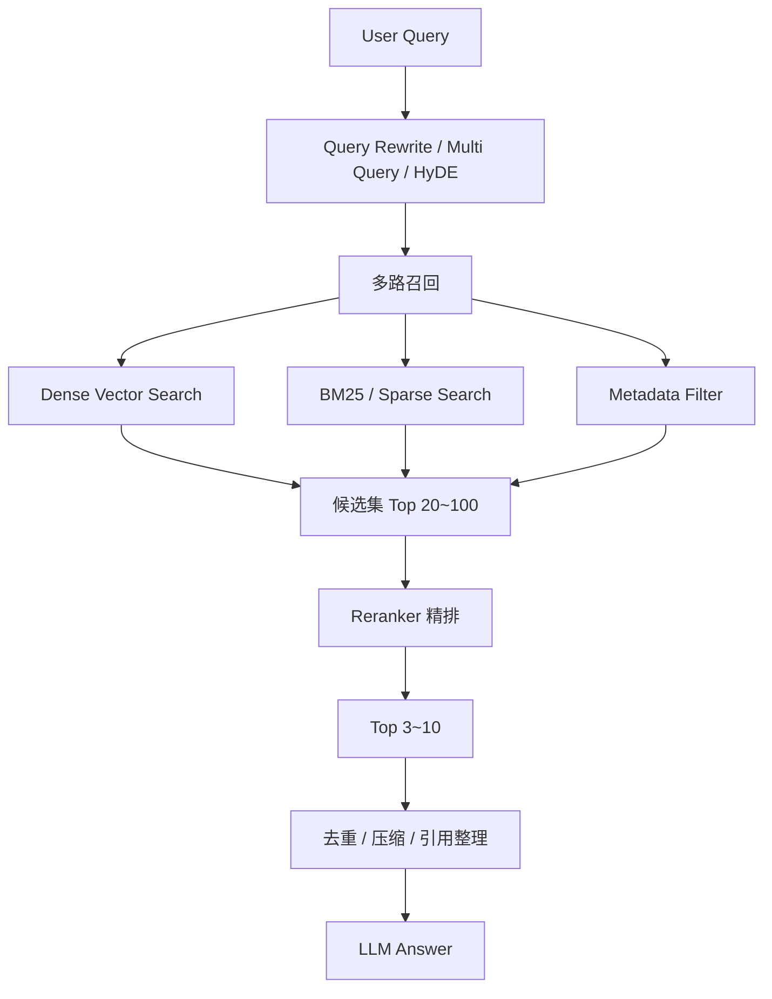

下面按 **RAG 工程视角** 系统讲一遍 ReRank。结论先放前面：

> **ReRank 是 RAG 检索链路里的“精排层”：先用向量检索、BM25、Hybrid Search 找出一批候选 chunk，再用更强但更慢的模型重新判断“哪些 chunk 真正能回答用户问题”。**

它解决的不是“找不到文档”的问题，而是：

> **找到了很多看似相关的文档，但真正该喂给 LLM 的不一定排在前面。**

---

# 1. ReRank 到底解决什么问题？

## 1.1 RAG 的核心矛盾：召回多了噪声大，召回少了容易漏

一个普通 RAG 链路是：

```text
用户问题
  ↓
Retriever 检索 Top-K 文档
  ↓
拼进 Prompt
  ↓
LLM 生成答案
```

但这里有一个硬问题：

|检索策略|问题|
|---|---|
|Top-K 取太少|真正有用的 chunk 可能没进上下文|
|Top-K 取太多|Prompt 噪声变大、成本上升、模型更容易答偏|
|只用向量检索|语义相似不等于能回答问题|
|只用 BM25|关键词匹配强，但语义泛化弱|
|Hybrid Search|召回更全，但排序仍然不一定准|

ReRank 的位置就是：

```text
先宽召回，再精排序
```

---

## 1.2 向量检索和 ReRank 的判断逻辑不同

### 向量检索：bi-encoder

向量检索一般是：

```text
query  → embedding
chunk  → embedding
然后算相似度
```

优点是快，可以大规模搜索。

缺点是它更多判断：

> query 和 chunk 在语义空间里像不像。

但它不一定能判断：

> 这个 chunk 是否真的能回答这个 query？

---

### ReRank：cross-encoder / reranker

ReRank 一般是：

```text
输入：
(query, chunk)

输出：
relevance score
```

也就是把 **用户问题和候选 chunk 放在一起**，让模型直接判断：

> 这段内容对回答这个问题有多有用？

Voyage 官方 Python 库 README 也把 reranker 定义为：输出 query 与多个 document 之间 relevance scores 的神经网络，常见做法是用这些分数重排由 embedding 检索或 BM25/TF-IDF 初步检索出来的文档。([GitHub](https://github.com/voyage-ai/voyageai-python "GitHub - voyage-ai/voyageai-python: Voyage AI Official Python Library · GitHub"))

一句话：

```text
Retriever：这段内容看起来相关。
Reranker：这段内容到底能不能回答问题？
```

---

# 2. ReRank 在 RAG 架构里的位置

一个比较标准的工程链路是：



**重点：ReRank 不是替代向量库，而是接在向量库/搜索引擎后面。**

---

# 3. ReRank 的几类工程实现方式

## 3.1 向量库 / 搜索引擎内置的“融合排序”

这类不一定是神经 reranker，而是 **多路召回结果融合**。

### Milvus

Milvus 官方文档把 reranking 放在 `hybrid_search()` 语境里，作用是把多个 `AnnSearchRequest` 的结果合并并重排；官方列出的策略包括 `WeightedRanker` 和 `RRFRanker`。([Milvus](https://milvus.io/docs/reranking.md "Reranking | Milvus Documentation"))

也就是：

```text
dense vector search
+ sparse vector search
+ 多向量字段 search
  ↓
WeightedRanker / RRFRanker
  ↓
最终排序
```

这类适合：

- 多路向量检索；
    
- dense + sparse hybrid search；
    
- 多字段搜索；
    
- 多模态检索里的分数融合。
    

但它和 Qwen / BGE / Cohere 这种 cross-encoder reranker 不是一回事。

---

## 3.2 搜索引擎内置 semantic reranking

### Elasticsearch

Elasticsearch 已经提供比较产品化的 rerank 能力。官方 `text_similarity_reranker` retriever 说明：它使用 NLP 模型根据 query 的语义相似度重排 top-k 文档；默认可使用 `.rerank-v1-elasticsearch` inference endpoint，也可以接 Cohere、Google Vertex AI 或上传自定义模型。([Elastic](https://www.elastic.co/docs/reference/elasticsearch/rest-apis/retrievers/text-similarity-reranker-retriever "Text similarity re-ranker retriever | Elasticsearch Reference"))

Elastic Rerank 是 Elastic 官方的 cross-encoder reranking model，用于提升 BM25、Hybrid Search、RAG 等场景的搜索质量；但官方也标明该能力处于 technical preview，具体部署和 SLA 要注意版本与订阅限制。([Elastic](https://www.elastic.co/docs/explore-analyze/machine-learning/nlp/ml-nlp-rerank "Elastic Rerank | Elastic Docs"))

适合：

```text
已有 Elasticsearch
+ 需要 BM25 / 向量 / 权限过滤 / 排序一体化
+ 希望在搜索管线里直接做 rerank
```

---

## 3.3 应用层接外部 reranker 模型

这是最通用的工程方案。

```text
Milvus / pgvector / Elasticsearch / FAISS 召回 Top 50
  ↓
应用层调用 reranker 模型
  ↓
按 score 排序
  ↓
取 Top 5 给 LLM
```

典型模型：

|类型|代表|
|---|---|
|开源轻量 reranker|BGE-reranker-v2-m3|
|开源大模型 reranker|Qwen3-Reranker-0.6B / 4B / 8B|
|商业 API reranker|Cohere Rerank、Voyage Rerank、Jina Rerank|
|搜索引擎托管 reranker|Elastic Rerank|
|多模态 reranker|Qwen3-VL-Reranker、Jina multimodal reranker|

LangChain 官方的 cross-encoder reranker 文档明确说明，可以把 `HuggingFaceCrossEncoder`、`CrossEncoderReranker` 和 `ContextualCompressionRetriever` 组合使用，并且适用于 `BAAI/bge-reranker-*`、`Qwen/Qwen3-Reranker-*`、`mixedbread-ai/mxbai-rerank-*` 等 Hugging Face cross-encoder 模型。([LangChain 文档](https://docs.langchain.com/oss/python/integrations/document_transformers/cross_encoder_reranker "Cross encoder reranker integration - Docs by LangChain"))

---

## 3.4 Spring AI 里的位置：DocumentPostProcessor

在 Java / Spring AI 里，ReRank 更像 **Post-Retrieval 阶段的 DocumentPostProcessor**。

Spring AI 官方 RAG 文档说明，可以使用 `DocumentPostProcessor` 在检索文档传给模型前做后处理，例如根据 query 相关性做 reranking、去掉无关/重复文档，或压缩文档内容。([Home](https://docs.spring.io/spring-ai/reference/api/retrieval-augmented-generation.html "Retrieval Augmented Generation :: Spring AI Reference"))

所以 Java 后端里你可以这样理解：

```text
DocumentRetriever
  ↓
DocumentPostProcessor: rerank / dedup / compress
  ↓
QueryAugmenter
  ↓
ChatClient
```

---

# 4. 主流 ReRank 模型怎么选？

## 4.1 Qwen3-Reranker

Qwen3-Reranker 系列现在不算旧。Qwen 官方 Hugging Face 页面显示，Qwen3 Embedding 系列包含 0.6B、4B、8B 三种 reranker 尺寸，支持 100+ 语言，context length 32K，并且支持 instruction-aware ranking。([Hugging Face](https://huggingface.co/Qwen/Qwen3-Reranker-0.6B "Qwen/Qwen3-Reranker-0.6B · Hugging Face"))

简单选型：

|模型|适合场景|
|---|---|
|Qwen3-Reranker-0.6B|本地部署、成本敏感、延迟敏感|
|Qwen3-Reranker-4B|中文 RAG、效果和成本折中|
|Qwen3-Reranker-8B|效果优先、GPU 资源充足|

---

## 4.2 Qwen3-VL-Reranker

如果你的知识库不是纯文本，而是 PDF 截图、图片、表格截图、视频帧、多模态文档，可以关注 Qwen3-VL-Reranker。官方模型卡说明它是 multimodal rerank，支持文本、图片、截图、视频和混合输入，8B 版本 context length 32K，支持 30+ 语言。([Hugging Face](https://huggingface.co/Qwen/Qwen3-VL-Reranker-8B "Qwen/Qwen3-VL-Reranker-8B · Hugging Face"))

适合：

```text
PDF 页面检索
截图问答
图文混合知识库
产品手册 / 财报 / 医疗影像报告
视觉文档 RAG
```

---

## 4.3 Cohere / Voyage API

Cohere 官方 LangChain 集成文档给出的典型用法是：先用向量库做 base retriever，再用 `CohereRerank` 包进 `ContextualCompressionRetriever`，对返回结果做 rerank。([Cohere 文档](https://docs.cohere.com/docs/rerank-on-langchain "Cohere Rerank on LangChain (Integration Guide) | Cohere"))

Voyage reranker API 文档说明，接口输入 query、documents、model 等参数，返回 reranking results；推荐模型包括 `rerank-2.5` 和 `rerank-2.5-lite`。([Voyage AI](https://docs.voyageai.com/reference/reranker-api "Rerankers"))

适合：

- 不想自己部署模型；
    
- 需要快速验证效果；
    
- 企业内部可以接受外部 API；
    
- 对稳定性、模型维护要求高。
    

---

# 5. 生产级 RAG 里 ReRank 怎么落地？

## 5.1 最常见架构

```text
用户问题
  ↓
Query Rewrite
  ↓
Hybrid Search：BM25 + dense vector
  ↓
候选 Top 50
  ↓
Reranker：Qwen / BGE / Cohere / Voyage
  ↓
Top 5
  ↓
Context Compression
  ↓
LLM Answer
```

这个架构背后的原则是：

|阶段|目标|常用技术|
|---|---|---|
|预处理|把问题变得更适合检索|Query rewrite、multi-query、HyDE|
|召回|尽量别漏|向量检索、BM25、Hybrid Search|
|融合|合并多路候选|RRF、weighted score|
|精排|把真正有用的排前面|Cross-encoder reranker|
|压缩|降低上下文噪声|chunk compression、dedup|
|生成|基于证据回答|citation、grounded prompt|

一个 2026 年 SemEval 多轮检索系统案例采用了三阶段管线：query rewriting、BM25+dense hybrid retrieval with RRF、再用 BGE-reranker-v2-m3 做 cross-encoder reranking；该系统在官方测试集 nDCG@5 达到 0.531，排名 8/38，比 organizer baseline 高 10.7%。([arXiv](https://arxiv.org/abs/2605.12028 "Caraman at SemEval-2026 Task 8: Three-Stage Multi-Turn Retrieval with Query Rewriting, Hybrid Search, and Cross-Encoder Reranking"))

这说明当前工程实践里，**query rewrite + hybrid search + cross-encoder rerank** 是很主流的组合。

---

## 5.2 一个推荐默认配置

中小型中文知识库可以这样起步：

```yaml
retrieval:
  dense_top_k: 30
  bm25_top_k: 30
  fusion: rrf
  candidate_top_k: 50

rerank:
  model: Qwen3-Reranker-0.6B 或 BGE-reranker-v2-m3
  top_n: 5
  score_threshold: 0.2

generation:
  max_context_chunks: 5
  cite_sources: true
  empty_context_policy: refuse_or_clarify
```

如果效果不够，再升级：

```text
Qwen3-Reranker-0.6B → Qwen3-Reranker-4B
Top 30 → Top 80
单向量召回 → BM25 + dense hybrid
无评估 → 加 nDCG / Recall / faithfulness eval
```

---

# 6. 代码怎么写？

下面给你三种代码：**Python 本地 reranker、LangChain、Java/Spring AI 风格**。

---

## 6.1 最小版：Python + sentence-transformers 做 rerank

适合先理解原理。

```python
from sentence_transformers import CrossEncoder

# 1. 加载 reranker 模型
# 中文/多语言可以用 BGE 或 Qwen3-Reranker 系列
model = CrossEncoder("BAAI/bge-reranker-v2-m3")

query = "RAG 里为什么需要 rerank？"

# 2. 假设这些文档是向量库 / BM25 先召回出来的候选 chunk
documents = [
    "RAG 是检索增强生成，包含检索和生成两个阶段。",
    "Rerank 会对初步召回的候选文档重新打分，提升最终上下文相关性。",
    "Embedding 模型会把文本转换成向量，用于相似度检索。",
    "向量检索召回率较高，但排序不一定准确，因此常在召回后使用 cross-encoder reranker 精排。"
]

# 3. reranker 的输入是 query-document pair
pairs = [(query, doc) for doc in documents]

# 4. 输出每个候选文档的相关性分数
scores = model.predict(pairs)

# 5. 按分数排序
ranked = sorted(
    zip(documents, scores),
    key=lambda x: x[1],
    reverse=True
)

for i, (doc, score) in enumerate(ranked, start=1):
    print(f"Rank {i} | score={score:.4f} | {doc}")
```

核心就是这句：

```python
scores = model.predict([(query, doc) for doc in documents])
```

这就是 cross-encoder rerank 的本质。

---

## 6.2 LangChain：Retriever + CrossEncoderReranker

LangChain 官方示例也是这个模式：base retriever 先取一批结果，再用 `CrossEncoderReranker` 和 `ContextualCompressionRetriever` 精排。([LangChain 文档](https://docs.langchain.com/oss/python/integrations/document_transformers/cross_encoder_reranker "Cross encoder reranker integration - Docs by LangChain"))

```python
from langchain_huggingface import HuggingFaceEmbeddings, HuggingFaceCrossEncoder
from langchain_classic.retrievers.document_compressors import CrossEncoderReranker
from langchain_classic.retrievers.contextual_compression import ContextualCompressionRetriever
from langchain_community.vectorstores import FAISS
from langchain_core.documents import Document

# 1. 准备一些示例文档
docs = [
    Document(page_content="RAG 是检索增强生成，核心是先检索外部知识，再让 LLM 基于证据回答。"),
    Document(page_content="Rerank 会对初步召回结果重新打分，提升最终进入 Prompt 的上下文质量。"),
    Document(page_content="Embedding 用于把文本变成向量，支持相似度搜索。"),
    Document(page_content="BM25 是一种基于关键词和词频统计的传统检索算法。"),
]

# 2. 构建向量库
embedding_model = HuggingFaceEmbeddings(
    model_name="BAAI/bge-m3"
)

vectorstore = FAISS.from_documents(docs, embedding_model)

# 3. base retriever 先召回较多候选
base_retriever = vectorstore.as_retriever(
    search_kwargs={"k": 4}
)

# 4. 加载 cross-encoder reranker
cross_encoder = HuggingFaceCrossEncoder(
    model_name="BAAI/bge-reranker-v2-m3"
)

# 5. 只保留 rerank 后最相关的 top_n 个文档
reranker = CrossEncoderReranker(
    model=cross_encoder,
    top_n=2
)

# 6. ContextualCompressionRetriever = base retriever + reranker
compression_retriever = ContextualCompressionRetriever(
    base_retriever=base_retriever,
    base_compressor=reranker
)

query = "RAG 里 rerank 的作用是什么？"

result_docs = compression_retriever.invoke(query)

for doc in result_docs:
    print(doc.page_content)
```

这个代码表达的工程思想是：

```text
FAISS / Milvus / pgvector / ES 负责召回
CrossEncoderReranker 负责精排
ContextualCompressionRetriever 负责把它们串起来
```

---

## 6.3 Cohere Rerank：API 型方案

Cohere 官方和 LangChain 文档都是类似写法：`CohereRerank` 作为 compressor，包在 `ContextualCompressionRetriever` 上。([LangChain 文档](https://docs.langchain.com/oss/python/integrations/retrievers/cohere-reranker "Cohere reranker integration - Docs by LangChain"))

```python
from langchain_cohere import CohereRerank
from langchain_classic.retrievers.contextual_compression import ContextualCompressionRetriever

# base_retriever 可以来自 FAISS / Milvus / Chroma / Elasticsearch 等
base_retriever = vectorstore.as_retriever(
    search_kwargs={"k": 30}
)

# CohereRerank 会调用 Cohere 的 rerank endpoint
compressor = CohereRerank(
    model="rerank-english-v3.0"
)

rerank_retriever = ContextualCompressionRetriever(
    base_retriever=base_retriever,
    base_compressor=compressor
)

docs = rerank_retriever.invoke("What problem does reranking solve in RAG?")
```

实际项目里只要替换 base_retriever：

```text
FAISS → Milvus
FAISS → pgvector
FAISS → Elasticsearch
```

整体思想不变。

---

## 6.4 Java / Spring AI 风格：DocumentPostProcessor

Spring AI 官方目前给出的抽象位置是 `DocumentPostProcessor`，可以在 retrieved documents 进入模型前做 rerank、去重、压缩。([Home](https://docs.spring.io/spring-ai/reference/api/retrieval-augmented-generation.html "Retrieval Augmented Generation :: Spring AI Reference"))

下面给一个工程化伪代码，重点是结构，不是绑定某个具体 SDK。

```java
/**
 * RerankDocumentPostProcessor
 *
 * 作用：
 * 1. 接收 Retriever 初步召回的 documents
 * 2. 调用外部 reranker 服务打分
 * 3. 按 score 排序
 * 4. 返回 topN 文档给后续 QueryAugmenter / ChatClient
 */
public class RerankDocumentPostProcessor implements DocumentPostProcessor {

    private final RerankerClient rerankerClient;
    private final int topN;
    private final double minScore;

    public RerankDocumentPostProcessor(
            RerankerClient rerankerClient,
            int topN,
            double minScore
    ) {
        this.rerankerClient = rerankerClient;
        this.topN = topN;
        this.minScore = minScore;
    }

    @Override
    public List<Document> process(Query query, List<Document> documents) {
        if (documents == null || documents.isEmpty()) {
            return List.of();
        }

        // 1. 调用 reranker，对每个 query-document pair 打相关性分数
        List<RerankScore> scores = rerankerClient.score(
                query.text(),
                documents.stream()
                        .map(Document::getText)
                        .toList()
        );

        // 2. 把 score 写回文档 metadata，便于日志、调试、引用展示
        List<ScoredDocument> scoredDocuments = new ArrayList<>();
        for (RerankScore score : scores) {
            Document doc = documents.get(score.index());

            doc.getMetadata().put("rerank_score", score.score());

            scoredDocuments.add(new ScoredDocument(doc, score.score()));
        }

        // 3. 过滤低分文档，排序后取 TopN
        return scoredDocuments.stream()
                .filter(item -> item.score() >= minScore)
                .sorted(Comparator.comparingDouble(ScoredDocument::score).reversed())
                .limit(topN)
                .map(ScoredDocument::document)
                .toList();
    }

    private record ScoredDocument(Document document, double score) {
    }
}
```

`RerankerClient` 可以对接：

```text
本地 Python reranker 服务
vLLM 部署的 Qwen3-Reranker
Cohere Rerank API
Voyage Rerank API
Elasticsearch inference endpoint
公司内部模型服务
```

---

## 6.5 Java 调外部 reranker API 的简化版

```java
public class RerankerClient {

    private final WebClient webClient;

    public RerankerClient(String baseUrl) {
        this.webClient = WebClient.builder()
                .baseUrl(baseUrl)
                .build();
    }

    /**
     * 调用 reranker 服务。
     *
     * 请求格式示例：
     * {
     *   "query": "...",
     *   "documents": ["doc1", "doc2"],
     *   "top_k": 5
     * }
     */
    public List<RerankScore> score(String query, List<String> documents) {
        RerankRequest request = new RerankRequest(query, documents);

        RerankResponse response = webClient.post()
                .uri("/rerank")
                .bodyValue(request)
                .retrieve()
                .bodyToMono(RerankResponse.class)
                .block();

        if (response == null || response.results() == null) {
            return List.of();
        }

        return response.results();
    }

    public record RerankRequest(String query, List<String> documents) {
    }

    public record RerankResponse(List<RerankScore> results) {
    }

    public record RerankScore(int index, double score) {
    }
}
```

---

# 7. 关键工程参数怎么调？

## 7.1 Top-K 参数

常见配置：

|参数|推荐起步值|含义|
|---|--:|---|
|dense_top_k|20~50|向量召回候选数|
|bm25_top_k|20~50|关键词召回候选数|
|candidate_top_k|30~100|进入 rerank 的候选数|
|rerank_top_n|3~10|最终给 LLM 的文档数|
|score_threshold|视模型而定|低于阈值直接丢弃|

不要一上来就：

```text
向量检索 Top 5 → 直接给 LLM
```

更合理的是：

```text
召回 Top 50 → rerank → Top 5
```

---

## 7.2 分数不要盲目跨模型比较

不同 reranker 的 score 分布不同：

```text
BGE score
Qwen score
Cohere relevance_score
Voyage relevance_score
Elastic rerank score
```

不能简单认为：

```text
0.8 一定好
0.3 一定差
```

更可靠的方式是：

```text
在自己的数据集上观察 score 分布
再定阈值
```

---

## 7.3 延迟优化

ReRank 会变慢，因为它要对每个 query-document pair 做模型推理。

优化手段：

|问题|优化|
|---|---|
|候选太多|candidate_top_k 控制在 30~100|
|模型太大|0.6B / base 版本起步|
|API 慢|batch rerank|
|重复查询|query + doc ids 做缓存|
|长 chunk 太多|控制 chunk size，必要时先压缩|
|线上成本高|热门问题缓存最终 topN|
|GPU 不足|量化、vLLM、TEI、Triton、ONNX|

---

## 7.4 不要把 ReRank 当万能药

ReRank 解决的是 **候选集排序**，不是所有 RAG 问题。

|问题|ReRank 能不能解决|
|---|---|
|检索结果排序不准|能|
|召回里有正确文档但排得靠后|能|
|正确文档根本没被召回|不能|
|文档切分太烂|只能部分缓解|
|元数据过滤错误|不能|
|问题需要多跳推理|只能部分帮助|
|LLM 生成幻觉|间接缓解，但不能根治|
|知识库本身没有答案|不能|

一句话：

> **ReRank 的前提是：正确答案至少进入了候选集。**

---

# 8. 实际案例怎么理解？

## 8.1 企业知识库问答

问题：

```text
公司年假政策里，入职未满一年怎么计算年假？
```

向量检索可能召回：

```text
员工福利总览
年假政策说明
入职流程
考勤制度
法定节假日安排
```

ReRank 会把真正包含“入职未满一年 + 年假折算”的 chunk 排到前面。

---

## 8.2 技术文档问答

问题：

```text
LangChain ToolStrategy 为什么和 thinking mode 冲突？
```

向量检索可能召回一堆：

```text
structured output
tool calling
agent
thinking mode
provider strategy
```

ReRank 会更偏向：

```text
明确解释 tool_choice / thinking mode / structured output 限制的文档片段
```

这类问题只靠 embedding 很容易排错，因为关键词都相关，但真正能解释冲突的 chunk 可能只有一两段。

---

## 8.3 医疗 / 法律 / 金融 RAG

这类场景对证据相关性要求高，通常会用：

```text
Hybrid Search
+ Rerank
+ Claim-level grounding evaluation
```

一个 2026 年医疗健康 RAG 研究案例使用 OpenSearch Serverless 做 hybrid retrieval，再用 Cohere reranking 排序证据 chunks，最后用 judge model 对生成答案中的 factual claims 做证据支持判断。([arXiv](https://arxiv.org/abs/2605.01664 "A Hybrid Retrieval and Reranking Framework for Evidence-Grounded Retrieval-Augmented Generation"))

这类系统里 ReRank 的价值不是“让回答更自然”，而是：

```text
减少无关证据进入上下文
提高答案可溯源性
降低幻觉风险
```

---

# 9. ReRank 怎么评估？

不要只靠“看起来回答更好”。要分两层评估。

## 9.1 检索层评估

常用指标：

|指标|含义|
|---|---|
|Recall@K|正确文档有没有被召回|
|Precision@K|Top-K 里有多少是相关文档|
|MRR|第一个正确文档排第几|
|nDCG@K|排序质量，越相关越靠前越好|
|Hit Rate|Top-K 是否命中答案证据|

ReRank 最应该提升的是：

```text
MRR
nDCG@K
Precision@K
```

不一定提升 Recall@K，因为 Recall 更多取决于前面的召回阶段。

---

## 9.2 生成层评估

RAG 最终还要看答案：

|指标|含义|
|---|---|
|Faithfulness|答案是否被上下文支持|
|Answer Correctness|答案是否正确|
|Citation Accuracy|引用是否真的支持结论|
|Context Relevance|上下文是否相关|
|Latency / Cost|延迟和成本是否可接受|

实际工程里可以做 A/B：

```text
方案 A：vector top5 直接生成
方案 B：vector top50 + rerank top5
方案 C：hybrid top80 + rerank top5
```

然后比较：

```text
答案正确率
引用准确率
平均延迟
平均成本
用户满意度
```

---

# 10. 面试怎么回答？

## 10.1 面试题：RAG 中 ReRank 是什么？

可以这样答：

> ReRank 是 RAG 检索链路中的精排阶段。通常先用向量检索、BM25 或 Hybrid Search 从知识库中召回一批候选文档，例如 Top 50；然后用 cross-encoder reranker 或商业 rerank API 对 query-document pair 逐一打相关性分数，重新排序后选 Top 3~5 进入 Prompt。它解决的是初始检索排序不准、噪声 chunk 进入上下文、真正答案 chunk 排名靠后的问题。

---

## 10.2 面试题：向量检索和 ReRank 有什么区别？

可以这样答：

> 向量检索一般是 bi-encoder，query 和 document 分别编码成 embedding，然后计算相似度，优点是快，适合大规模召回。ReRank 多用 cross-encoder，把 query 和候选 document 一起输入模型，直接输出相关性分数，判断更细，但成本更高。所以工程上通常是“两阶段检索”：第一阶段高召回，第二阶段高精度排序。

---

## 10.3 面试题：为什么不直接用 ReRank 全库检索？

答：

> 因为 ReRank 要对 query-document pair 做逐对推理，复杂度太高，无法对百万级 chunk 全量扫描。向量检索可以提前离线建立 embedding 索引，适合大规模候选召回；ReRank 适合只处理 Top 20~100 的候选集。两者不是替代关系，而是召回和精排的关系。

---

## 10.4 面试题：Milvus / Elasticsearch / pgvector 里怎么做 ReRank？

答：

> Milvus 更常见的是 hybrid search 里的结果融合 reranking，例如 WeightedRanker 和 RRFRanker，用于合并多个 ANN 检索结果。Elasticsearch 有更产品化的 semantic reranking，例如 `text_similarity_reranker` 和 inference endpoint，可以接 Elastic Rerank、Cohere 或自定义模型。pgvector 本身主要做向量召回，通常在应用层调用 Qwen、BGE、Cohere、Voyage 等 reranker 模型完成精排。

---

## 10.5 面试题：ReRank 一定能提升 RAG 效果吗？

答：

> 不一定。ReRank 的前提是正确文档已经进入候选集。如果召回阶段没有找到正确 chunk，reranker 没法凭空产生答案。此外，文档切分、metadata 过滤、query rewrite、embedding 模型、知识库质量都会影响效果。ReRank 通常提升的是排序质量，比如 MRR、nDCG@K、Precision@K，而不是解决所有 RAG 问题。

---

## 10.6 面试题：生产环境怎么控制 ReRank 成本和延迟？

答：

> 一般会控制进入 rerank 的候选数量，比如 Top 30~100；使用轻量 reranker，如 BGE-reranker-v2-m3 或 Qwen3-Reranker-0.6B；对热门 query 做缓存；batch 推理；限制 chunk 长度；必要时模型量化或用 vLLM/TEI/Triton 部署。对于高价值查询可以用更强模型，普通查询用轻量模型，形成分层策略。

---

# 11. 一套可落地的 Java 后端 RAG ReRank 方案

你可以把它设计成这样：

```text
Controller
  ↓
RagApplicationService
  ↓
QueryRewriteService
  ↓
HybridRetriever
    ├── VectorRetriever: Milvus / pgvector
    └── KeywordRetriever: Elasticsearch / BM25
  ↓
FusionService: RRF
  ↓
RerankService: Qwen / BGE / Cohere / Voyage
  ↓
ContextBuilder
  ↓
ChatModel
  ↓
Answer + Citations
```

核心接口可以这样设计：

```java
public interface Retriever {
    List<Chunk> retrieve(String query, int topK);
}

public interface Reranker {
    List<ScoredChunk> rerank(String query, List<Chunk> candidates, int topN);
}

public interface ContextBuilder {
    String buildContext(List<ScoredChunk> chunks);
}
```

这样好处是：

|模块|可替换实现|
|---|---|
|Retriever|Milvus / pgvector / Elasticsearch|
|Fusion|RRF / weighted score|
|Reranker|BGE / Qwen / Cohere / Voyage|
|ContextBuilder|普通拼接 / 压缩 / 引用格式化|
|ChatModel|OpenAI / Qwen / DeepSeek / Claude|

这就是比较干净的工程分层。

---

# 12. 最终总结

你可以把 ReRank 记成这几句话：

1. **Rerank 是召回后的精排，不是替代向量库。**
    
2. **向量检索负责快速找候选，Reranker 负责判断候选是否真正能回答问题。**
    
3. **生产 RAG 常见做法是：Hybrid Search Top 50 → Rerank Top 5 → LLM。**
    
4. **Milvus 的 rerank 多偏结果融合；Elasticsearch 已经有 semantic reranking 管线；PostgreSQL/pgvector 通常应用层接 reranker。**
    
5. **Qwen3-Reranker、BGE、Cohere、Voyage、Elastic Rerank 都是当前可用方案。**
    
6. **评估 ReRank 要看 nDCG、MRR、Precision@K、答案 faithfulness，而不是只凭肉眼。**
    
7. **ReRank 不能解决召回缺失、知识库缺失、切分错误、权限过滤错误这些问题。**
    

最实用的默认架构：

```text
BM25 + 向量召回 Top 50
↓
RRF 融合
↓
Qwen3-Reranker / BGE-reranker 精排
↓
Top 5 进入 Prompt
↓
LLM 基于证据回答
```

这就是 ReRank 在 RAG 里的工程本质。