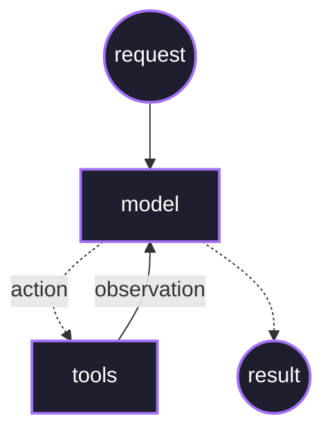
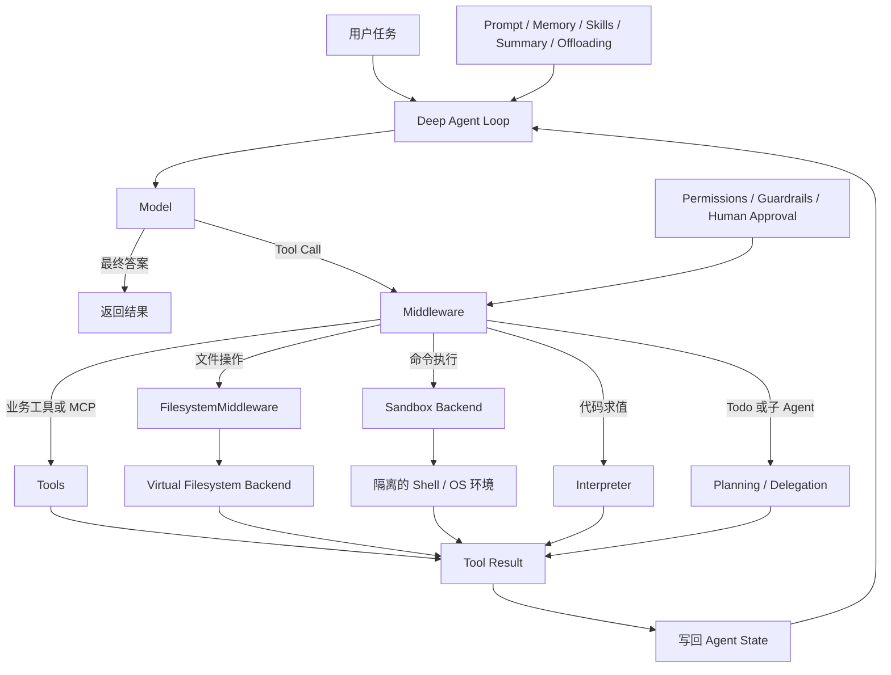

Agent=model+harness model是个无状态的决策大脑，解释agent重点要解释harness

harness简而言之就是在合适的时间给model提供合适的上下文来完成任务

从业务角度讲，agent就是为了让LLM的决策能力真正工程化落地去干活，在长期的各种复杂环境里解决实际问题。

---

## 通用定义的agent

Agent 本质上是一个能够围绕目标持续进行“感知、决策、调用工具、获取结果、更新状态”的软件系统。它不只是调用一次大模型，而是由模型负责推理和决策，由工具连接外部世界，由状态和记忆保存上下文，再通过运行时控制循环、权限、重试、暂停和人工介入。

在生产环境中，Agent 的核心不只是模型能力，更是 `harness engineering`，也就是围绕模型构建可靠运行环境。它包括工具与运行时、上下文和状态管理、权限与沙箱、工作流编排、评测与可观测性、回放调试、重试恢复和安全控制，以及subagent skill mcp等扩展能力。可以说，模型决定 Agent 能否做出好的判断，而 harness 决定它能否稳定、可控、可审计地完成任务。

**核心组成：**

- **模型**：理解任务、制定计划、选择工具。
- **工具**：访问数据库、搜索、API、代码执行环境等。
- **状态**：保存当前任务进度、工具结果和中间结论。
- **记忆**：保存跨会话的用户偏好或业务信息。
- **工作流**：控制步骤、分支、循环、审批和人工介入。
- **运行时**：限制权限、执行超时、重试、取消和资源消耗。
- **评测与观测**：记录轨迹、工具调用、延迟、成本和最终结果。

**和普通调用的区别：**

- 简单链式调用：步骤固定，适合稳定流程。
- 图式工作流：有明确分支、重试和人工节点，适合生产业务。
- Agent：部分步骤由模型根据目标和环境动态决定，适合开放性较强的问题，但需要更严格的边界控制。

**常见风险：**

Agent 可能出现无限循环、错误调用工具、状态污染、成本和延迟不可控，以及 Prompt Injection、越权访问和敏感数据泄露。因此生产系统通常需要工具白名单、最小权限、沙箱、最大步数、超时、幂等、人工审批、完整调用日志和可回放轨迹。

一句话总结：**Agent 是“模型驱动的任务执行系统”，而 harness engineering 是让它具备可靠性、可控性和生产可用性的工程基础。**

后续可以继续追问：

- Agent 和 Workflow 的边界是什么？
- 如何设计一个生产级 Agent Runtime？ (langraph)
- Agent 如何做状态管理、记忆和故障恢复？
- 如何评测 Agent 是否真的完成了任务？(eval observation)


---

## langchain的agent

可以把 LangChain 中的 Agent 分成三层理解：

1. **Agent Loop：负责动态决策**
2. **Harness：负责给模型提供上下文、能力和约束**
3. **LangGraph Runtime：负责状态、持久化和执行控制**

LangChain 官方的核心表述是：

> **An agent is a model calling tools in a loop until a given task is complete.**

同时，官方将其概括为：

> **Agent = Model + Harness**

Harness 的职责是：**在正确的时间，为模型提供完成任务所需的正确上下文。**  
参考：[LangChain Agents 官方文档](https://docs.langchain.com/oss/python/langchain/agents)

### **一、Agent Loop 由什么组成**

一个完整的 Agent Loop 大致是：





因此，Agent 的核心运行单元包括：

- **Model**：决定下一步是调用哪个工具，还是直接结束。
- **Tools**：模型可以调用的外部能力，例如搜索、数据库、API、文件系统和代码执行。
- **Tool Results**：工具执行结果，作为下一轮模型调用的输入。
- **Agent State**：保存消息序列、工具调用结果和中间状态。LangChain Agent 默认至少包含消息状态。
- **Loop Control**：判断继续调用工具，还是返回最终结果。
- **Stop Condition**：任务完成、没有更多工具调用、达到最大调用次数、发生错误或被人工中断。

关键点是：**下一步由模型动态决定**。如果步骤完全固定，就更接近 Chain 或 Workflow，而不是典型的 Agent Loop。

### **二、LangChain 中 Harness 的组成**

LangChain 官方对 Harness 的狭义定义包括：

|组成部分|作用|
|---|---|
|Model|执行推理和工具选择|
|Prompt|规定 Agent 的角色、目标和行为方式|
|Tools|为模型提供执行外部操作的能力|
|Middleware|在 Agent Loop 的关键阶段插入控制逻辑|

在 `create_agent` 中，这些能力通过配置组合起来：

```
create_agent(
    model,
    tools,
    system_prompt,
    middleware,
    response_format,
    state_schema,
    context_schema,
    checkpointer,
    store,
    ...
)
```

其中：

- `model`：必需，使用模型标识或已经初始化的模型对象。
- `tools`：工具集合，可以是 Python 函数、LangChain Tool 或工具定义。
- `system_prompt`：控制模型如何理解和执行任务。
- `middleware`：在 Agent、Model、Tool 调用前后修改行为。
- `response_format`：约束最终输出为结构化数据。
- `state_schema`：扩展 Agent 的运行状态，例如增加用户信息、任务进度或审批状态。
- `context_schema`：定义本次运行的上下文，例如用户 ID、权限、API Key 或功能开关。
- `checkpointer`：保存同一个 thread 的状态，用于对话历史、暂停和恢复。
- `store`：保存跨 thread、跨会话的数据，例如用户长期记忆。
- `name`：为 Agent 命名，便于作为多 Agent 系统中的子图使用。
- `interrupt` 配置：在高风险工具调用前后暂停，等待人工确认。

`create_agent` 本身不是简单的模型包装器，而是一个高度可配置的 Harness，最终生成可执行的状态图。参考：[create_agent API](https://reference.langchain.com/python/langchain/agents/factory/create_agent)。

### **三、Middleware 是 Harness 的核心扩展机制**

在 LangChain 中，Middleware 是 Harness Engineering 的主要实现方式。官方文档将它归纳为几类能力：

- **Execution environment**：工具、文件系统、沙箱、代码执行。
- **Context management**：历史压缩、记忆、Skills、Prompt Cache。
- **Planning and delegation**：Todo、子 Agent、并行任务和任务委派。
- **Fault tolerance**：模型重试、工具重试、Fallback、调用次数限制。
- **Guardrails**：PII 检测、内容安全、工具调用限制。
- **Steering**：Human-in-the-loop，在高风险操作前暂停并等待批准。
- **Dynamic behavior**：动态 Prompt、动态模型选择、动态工具选择。
- **Observability**：通过 LangSmith 追踪每一步模型调用、工具调用和状态变化。

这说明 Harness Engineering 的重点不是再写一段更复杂的 Prompt，而是控制：

```
模型看到什么
模型能调用什么
模型什么时候可以调用
工具结果如何进入上下文
失败后如何恢复
高风险动作是否需要审批
整个过程如何持久化、追踪和评测
```

### **四、一个完整的 LangChain Agent 可以这样概括**

> 在 LangChain 中，一个完整的 Agent 是以 Model 为决策核心、以 Tools 为行动能力、以 State 为运行记忆、以 Agent Loop 为执行机制的系统。它的 Harness 则负责组织 Prompt 和上下文，注册和约束 Tools，通过 Middleware 实现重试、动态上下文、记忆压缩、权限控制、Guardrails 和人工审批，并通过 Checkpointer、Store 和 LangSmith 提供持久化、恢复和可观测性。`create_agent` 将这些组件组合成一个基于状态图的可执行 Agent。Deepagent则是进一步的封装，提供开箱即用的Agent Harness，可以用于快速开发。

最值得记住的一句话是：

**Agent 解决“下一步做什么”，Harness 解决“模型在什么上下文、以什么权限、通过什么工具、按照什么规则去做”。**


---


## Deepagent的agent

Deep Agents 不是一种新的 Agent Loop，而是 LangChain 体系中一个开箱即用的 **agent harness**。

官方定义可以概括为：Deep Agent 仍然是 Model 调用 Tools 的循环，但 Deep Agents 预置了面向复杂、长期任务的规划、文件系统、上下文管理、子 Agent 和人工介入能力。



### 一、Deep Agent 的 Agent 部分

Deep Agent 的核心仍然是标准的 Agent Loop：

1. Model 读取当前 State 和 Harness 提供的上下文。
2. Model 决定直接回答，或者生成 Tool Call。
3. Harness 检查 Tool Call，并执行对应工具。
4. 工具结果写回 State。
5. Model 读取新的 State，继续下一轮决策。
6. 直到模型返回最终答案、任务失败、被中断或达到运行限制。

所以 Deep Agent 的 Agent 部分主要包括：

- **Model**：决定下一步行动。
- **Agent Loop**：在 Model 和 Tools 之间循环。
- **Agent State**：保存消息、Todo、工具结果以及 Middleware 扩展的状态。
- **Stop Condition**：任务完成、错误、中断或达到限制时结束。

Deep Agents 的“Deep”主要不在于 Agent Loop 发生了变化，而在于 Loop 外面装配了更完整的 Harness。

### 二、Deep Agents Harness 的组成

#### 1. Model 和 Prompt

Harness 负责把以下内容组合成一次 Model 调用的上下文：

- Deep Agents 的默认基础 Prompt；
- 用户传入的 `system_prompt`；
- 当前消息和工具调用历史；
- 工具描述和工具使用约束；
- Memory 和 Skills；
- 历史压缩结果；
- 当前运行上下文，例如用户 ID、权限和功能开关。

因此，Model 只负责根据输入生成下一步决策，如何组装输入由 Harness 负责。

#### 2. Tools 和 MCP

Deep Agent 的工具来源包括：

- 用户通过 `tools=` 传入的业务工具；
- Deep Agents 内置工具；
- MCP Server 提供的外部工具。

常见的内置工具包括：

- `write_todos`：维护任务列表；
- `task`：创建和调用子 Agent；
- `ls`、`read_file`、`write_file`、`edit_file`、`glob`、`grep`：文件操作；
- `delete`：删除文件，是否暴露取决于 Backend 能力；
- `execute`：在 Sandbox 中执行 Shell 命令；
- `eval`：在 Interpreter 中执行代码，是否启用取决于配置。

#### 3. Virtual Filesystem 和 Backend

Deep Agent 的文件工具通常不是直接操作真实磁盘，而是经过一个虚拟文件系统：

```text
read_file / write_file / edit_file
                |
                v
      FilesystemMiddleware
                |
                v
              Backend
```

`Backend` 是文件系统的数据后端，负责实现列目录、读取、写入、编辑、删除、Glob 和 Grep 等操作。

官方支持的后端形态包括：

- **`StateBackend`**：文件保存在 Agent State 中，适合短期任务；
- **`FilesystemBackend`**：连接本地或其他文件系统；
- **`StoreBackend`**：连接 LangGraph Store，适合跨会话数据；
- **`CompositeBackend`**：根据路径把不同目录路由到不同后端；
- **Custom Backend**：连接对象存储、数据库或远程文件服务。

例如可以把 `/workspace/` 路由到 StateBackend，把 `/memories/` 路由到 StoreBackend，把 `/project/` 路由到本地或远程文件系统。

Backend 解决的是：**文件存在哪里，以及文件如何被读写和持久化。**

#### 4. Sandbox

Sandbox 和 Backend 不是同一个概念。

| 能力 | Backend | Sandbox |
|---|---|---|
| 主要职责 | 提供虚拟文件系统 | 提供隔离的代码和命令执行环境 |
| 典型操作 | 读写、编辑、搜索文件 | Shell、安装依赖、运行测试、调用 CLI |
| 对应工具 | `read_file`、`write_file`、`edit_file` | `execute` |
| 解决的问题 | 文件数据放在哪里 | 命令在哪里执行以及如何隔离 |
| 典型持久化 | State、Store、本地磁盘或自定义服务 | Sandbox 自己的运行环境和文件系统 |

当配置 Sandbox Backend 后，Harness 才会向 Model 暴露 `execute` 工具。Model 生成 `execute` 调用后，命令会进入隔离的 Shell 或操作系统环境，执行结果再作为 Tool Result 写回 Agent State。

Sandbox 适合：

- 安装依赖；
- 执行测试和构建；
- 运行脚本；
- 调用 Git 或其他 CLI；
- 处理需要操作系统环境的工程任务。

文件权限规则主要约束内置文件工具。对于 Sandbox 中的任意命令执行，还需要依赖 Sandbox 自身的隔离能力、资源限制和执行策略，不能只依赖文件路径权限。

#### 5. Interpreter

Interpreter 是另一种代码执行能力，通常通过 `eval` 工具提供受控的解释器环境。

它适合：

- 轻量计算；
- 批量数据处理；
- 循环和确定性转换；
- 编排多次工具调用。

Interpreter 通常不提供 Shell、依赖安装、操作系统文件系统和任意网络访问；这些属于 Sandbox 的职责。

#### 6. Context Management

Deep Agents 通过 Harness 管理长期运行时不断增长的上下文：

- **Memory**：通过 `AGENTS.md` 加载项目规则、用户偏好和长期约定；
- **Skills**：通过 `SKILL.md` 按需加载领域知识和工作流，采用渐进式披露；
- **Summarization**：历史过长时压缩消息；
- **Context Offloading**：把大型工具结果和中间产物放到文件系统，只把必要内容带回上下文；
- **Subagent Isolation**：把重型子任务放到独立上下文中；
- **Prompt Caching**：缓存稳定的基础 Prompt、Memory 和 Skills。

Memory 更偏向长期规则和偏好，Skills 更偏向按需加载的知识与操作流程。

#### 7. Planning 和 Subagents

Deep Agents 默认提供两层委派能力：

- `write_todos`：记录任务拆解、当前状态和完成情况；
- `task`：将子任务交给子 Agent 执行。

子 Agent 通常具有独立上下文、独立执行过程和独立的工具调用历史，完成后将最终报告返回主 Agent。这样可以把大型任务隔离，避免主 Agent 的上下文被大量中间过程占满。

#### 8. Permissions、Guardrails 和 Human-in-the-loop

Harness 负责限制 Model 的能力边界：

- 文件路径级的读写权限；
- 工具白名单；
- Sandbox 的资源和执行限制；
- PII 和内容安全检查；
- 高风险工具调用拦截；
- `interrupt_on` 配置；
- 人工批准、修改或拒绝工具调用。

例如，执行 `edit_file`、`delete` 或高成本 API 调用前，可以暂停 Agent，等待人工确认后再继续。

### 三、Deep Agents 的默认 Middleware

当前官方文档中，主 Agent 的默认 Middleware 大致包括：

1. `TodoListMiddleware`
2. `SkillsMiddleware`，传入 `skills` 时启用
3. `FilesystemMiddleware`
4. `SubAgentMiddleware`
5. `SummarizationMiddleware`
6. `PatchToolCallsMiddleware`
7. 用户传入的自定义 Middleware
8. Provider Profile Middleware
9. Prompt Caching Middleware
10. `MemoryMiddleware`，传入 `memory` 时启用
11. `HumanInTheLoopMiddleware`，传入 `interrupt_on` 时启用

这些 Middleware 会在 Agent、Model 和 Tool 调用的不同阶段插入逻辑，例如动态修改 Prompt、过滤工具、压缩上下文、重试调用、执行权限检查或暂停等待人工审批。

### 四、LangGraph Runtime 与 Harness 的边界

Deep Agents 是建立在 LangGraph Runtime 之上的 Harness：

| 组件 | 主要职责 |
|---|---|
| `State` | 保存当前运行的消息、Todo、工具结果和中间状态 |
| `checkpointer` | 保存同一个 thread 的检查点，用于暂停和恢复 |
| `store` | 保存跨 thread、跨会话的数据 |
| `backend` | 为文件工具提供文件系统数据后端 |
| `sandbox` | 为 `execute` 提供隔离的代码和命令执行环境 |
| `context_schema` | 定义本次运行的用户、权限和功能开关等上下文 |
| `state_schema` | 扩展 Agent 的运行状态 |

所以这几个概念不能混为一谈：

```text
Backend      = Agent 的文件工具操作什么文件
Sandbox      = Agent 在哪里执行命令
State        = 当前执行携带哪些状态
Checkpointer = 当前执行如何暂停和恢复
Store        = 跨会话数据如何保存
```

`create_deep_agent` 会把 Model、Tools、默认 Prompt、Middleware、Backend、Subagents、State Schema 和 Runtime 配置组装成一个可执行的 `CompiledStateGraph`。

它的关键配置包括：

```text
model
tools
system_prompt
middleware
subagents
skills
memory
permissions
backend
interrupt_on
response_format
state_schema
context_schema
checkpointer
store
name
cache
```

### 五、面试总结

> Deep Agent 的 Agent 部分仍然是 Model 调用 Tools 的循环；Deep Agents Harness 则为这个循环提供完整的执行环境。这个环境不仅包括 Prompt、Tools 和 Middleware，还包括虚拟文件系统、Backend、Sandbox、Interpreter、文件权限、代码执行、上下文压缩、Memory、Skills、Todo、Subagents、AysncSubAgent 和 Human-in-the-loop。底层 LangGraph Runtime 再负责 State、Checkpointer、Store、持久化、恢复、流式和中断。

最准确的一句话是：

> **Model 决定下一步做什么，Harness 决定模型能看到什么、能调用什么、文件和命令在哪里执行，以及整个过程如何被约束、保存和恢复。**

参考：

- [Deep Agents 官方概览](https://docs.langchain.com/oss/python/deepagents/overview)
- [Deep Agents 自定义与完整参数](https://docs.langchain.com/oss/python/deepagents/customization)
- [Deep Agents Backends](https://docs.langchain.com/oss/python/deepagents/backends)
- [LangChain、LangGraph 与 Deep Agents 的分层关系](https://docs.langchain.com/oss/python/concepts/products)
