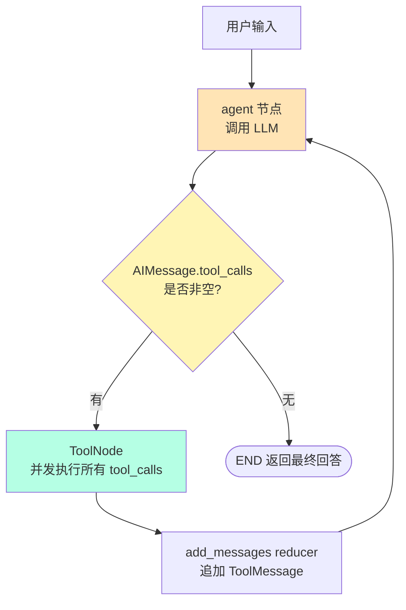
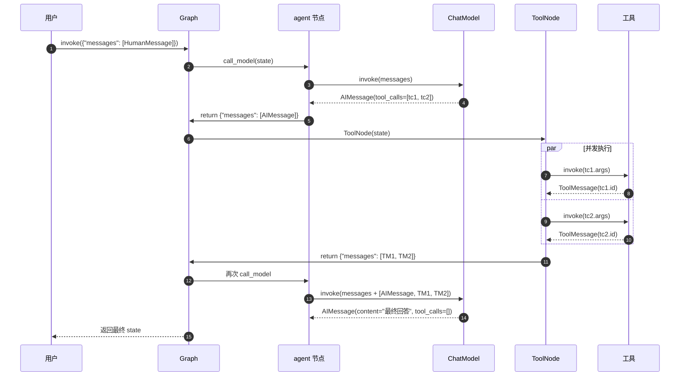
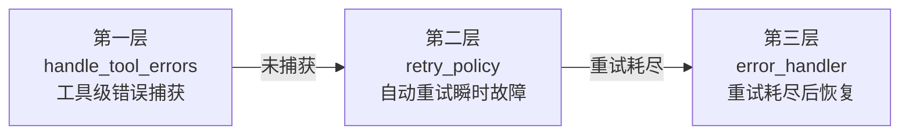
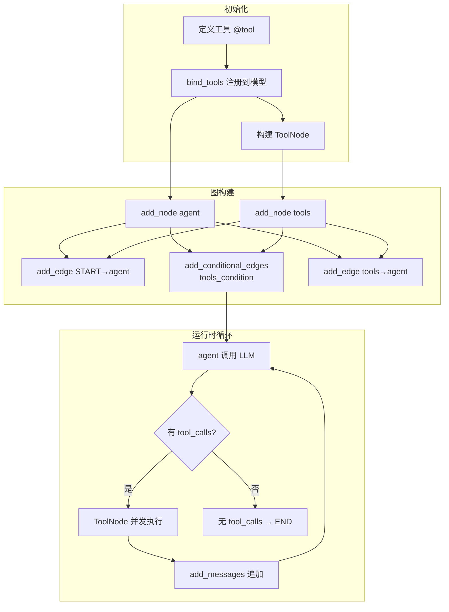

**注意以下几点：**

**一、工具的定义与封装：**  
在定义工具时，为其提供清晰、具体的描述至关重要，这直接决定了 Agent 能否在正确的场景下选择并调用它。对于复杂工具，可以使用 Pydantic 数据模型类明确定义输入参数的结构和类型，这能极大提高参数传递的准确性。而且可以自动做类型转换。对于工具数量超过 30 个以上的场景下，需要对 Agent 进行任务拆分，变成多个子 Agent 分别管理不同的工具列表。

**二、一般我们都会采用 langchain 提供的 ReAct 范式的 Agent，**  
LangChain 将工具的描述信息动态地构建到提示词中，引导 LLM 进行推理实现意图识别和决策，LLM 首先分析用户输入，判断是否需要调用工具以及需要调用哪个工具；如果决定调用工具，LLM 会根据工具的要求，从输入中提取或生成合适的参数。然后执行工具，工具的执行结果会被添加回对话上下文中，LLM 会根据当前所有信息（包括原始问题、之前的思考和工具结果）决定下一步是继续调用工具还是给出最终答案。对于，依赖网络请求的工具（如调用外部 API），网络不稳定是常见错误源。需要设置合理的超时 (Timeout) 时间 和重试机制。对于其他工具的错误，一定要捕获异常，并设置合理的自动重试机制和备用的返回提醒。


---

## 🎯 一句话回答

> **LangGraph 工具调用 = 模型决策(`AIMessage.tool_calls`) → 条件路由(`tools_condition`) → 并发执行(`ToolNode`) → 结果回填(`ToolMessage` via `add_messages` reducer) → 回到模型，循环直到无 tool_calls 即终止。**

---

## 📦 核心组件速记（5 个必背）

| 组件 | 作用 | 一句话记忆 |
|---|---|---|
| `bind_tools()` | 把工具 schema 注册到模型 | 模型才知道有哪些工具可用 |
| `AIMessage.tool_calls` | 模型决策出的调用列表 | `[{name, args, id, type}]` |
| `ToolNode` | 解析并执行 tool_calls | 自动并行 + 自动错误处理 |
| `ToolMessage` | 工具执行结果 | 必须带 `tool_call_id` 配对 |
| `tools_condition` | 条件边路由函数 | 有 tool_calls → "tools"，否则 → END |

---

## 🔄 完整流程图（必背）



### 消息流转链（4 步）

```
HumanMessage → AIMessage(tool_calls=[...]) → ToolMessage(结果) → AIMessage(最终回答)
```

---

## 🎬 时序图（面试加分项）



---

## 💻 最小可运行代码骨架（背下来）

```python
from langchain_core.tools import tool
from langchain.chat_models import init_chat_model
from langgraph.graph import StateGraph, MessagesState, START, END
from langgraph.prebuilt import ToolNode, tools_condition

# 1. 定义工具
@tool
def get_weather(location: str) -> str:
    """获取天气。"""
    return f"{location}: 晴 25°C"

# 2. 绑定工具到模型
model = init_chat_model("anthropic:claude-3-5-haiku-latest")
model_with_tools = model.bind_tools([get_weather])

# 3. 定义 agent 节点
def call_model(state: MessagesState):
    response = model_with_tools.invoke(state["messages"])
    return {"messages": [response]}  # ← 返回增量，不修改 state

# 4. 构建图
builder = StateGraph(MessagesState)
builder.add_node("agent", call_model)
builder.add_node("tools", ToolNode([get_weather]))

builder.add_edge(START, "agent")
builder.add_conditional_edges("agent", tools_condition, ["tools", END])
builder.add_edge("tools", "agent")  # ← 工具执行后回到 agent

graph = builder.compile()

# 5. 调用
result = graph.invoke({"messages": [{"role": "user", "content": "sf 天气?"}]})
```

---

## ❓ 高频面试问答

### Q1: ToolNode 的输入输出契约是什么？

**输入**：`MessagesState`，最后一条必须是带 `tool_calls` 的 `AIMessage`
**输出**：`{"messages": [ToolMessage(...)]}`，每个 ToolMessage 通过 `tool_call_id` 与原始 tool_call 配对

### Q2: 多个 tool_calls 是顺序还是并行执行？

**并行**。ToolNode 使用 `get_executor_for_config` 构造线程池（异步用 `asyncio.gather`）并发执行所有 tool_calls，输出顺序与原始 tool_calls 顺序一致。

### Q3: add_messages reducer 的合并规则？

- **同 ID 替换**：新消息 ID 与旧消息 ID 相同 → 替换
- **不同 ID 追加**：无 ID 自动生成 UUID，追加到末尾
- **RemoveMessage**：按 ID 删除消息
- **REMOVE_ALL_MESSAGES**：清空所有消息

### Q4: handle_tool_errors 的 5 种取值？

| 取值 | 行为 |
|---|---|
| `True` | 捕获所有异常，返回默认错误模板 |
| `False` | 不捕获，异常抛出 |
| `str` | 捕获所有异常，返回该字符串 |
| `type/tuple` | 仅捕获指定类型异常 |
| `Callable` | 根据函数签名推断捕获类型 |

**默认行为**：只捕获 `ToolInvocationError`（参数校验错误），执行错误重抛。让 LLM 自我修正参数。

### Q5: 工具如何返回 Command 更新状态？

```python
@tool
def update_user_name(new_name: str, tool_call_id: Annotated[str, InjectedToolCallId]) -> Command:
    return Command(update={
        "user_name": new_name,
        "messages": [ToolMessage(f"已更新 {new_name}", tool_call_id=tool_call_id)]
    })
```

**关键约束**：返回 Command 的工具**必须**在 `update["messages"]` 中包含 `tool_call_id` 匹配的 ToolMessage，否则报错。

### Q6: 工具调用中断（HITL）怎么实现？

两种方式：
1. **静态断点**：`interrupt_before=["tools"]`，工具执行前暂停
2. **动态中断**：工具内调用 `interrupt(value)`，抛出 `GraphInterrupt`

恢复方式：`graph.invoke(Command(resume=value), config)`

### Q7: interrupt 的 6 大规则？

1. 必须配置 checkpointer
2. 必须设置 thread_id
3. **不要**用 try/except 包裹 interrupt()
4. **不要**重排 interrupt() 调用顺序
5. interrupt 之前的副作用必须幂等
6. interrupt 的值必须 JSON 可序列化

### Q8: Command 的四种能力？

| 字段 | 作用 |
|---|---|
| `update` | 状态更新 |
| `goto` | 路由跳转（字符串=PULL，Send=PUSH） |
| `resume` | 恢复 interrupt |
| `graph` | 跨图通信（`Command.PARENT`） |

### Q9: create_react_agent v1 和 v2 的区别？

**v2（默认）**：`should_continue` 返回 `[Send("tools", ...) for call in tool_calls]`，每个 tool_call 独立分发，**原生并行**。

**v1**：`should_continue` 返回 `"tools"`，所有 tool_calls 在一个 ToolNode 调用中执行。

### Q10: 如何防止 ReAct 循环无限执行？

`AgentState.remaining_steps = 25`，每轮递减。当 `remaining_steps < 2` 且仍有 tool_calls 时，返回 `"Sorry, need more steps..."` 终止。

---

## ⚠️ 易错点 TOP 5

### 1. 节点返回增量，不要修改 state

```python
# ✅ 正确
return {"messages": [response]}

# ❌ 错误（破坏 reducer 语义）
state["messages"].append(response)
return state
```

### 2. ToolMessage 必须带 tool_call_id

LLM 上下文必须能找到每个 tool_call 对应的 ToolMessage，否则报错。

### 3. interrupt() 不进 error_handler

`interrupt()` 抛出 `GraphInterrupt`（继承 `GraphBubbleUp`），**绕过** error_handler，直接暂停图。

### 4. 并行写入必须定义 reducer

```python
# ✅ 并行节点写入同字段必须有 reducer
analyses: Annotated[list, add]
```

### 5. Command(resume=...) 是唯一可作为 invoke 输入的 Command

其他 Command（update/goto/graph）只能从节点函数**返回**，不能作为 invoke 输入。

---

## 🎨 错误处理三层架构（必背）



| 层级 | 机制 | 默认行为 |
|---|---|---|
| 工具级 | `ToolNode(handle_tool_errors=...)` | 只捕获 ToolInvocationError |
| 节点级重试 | `add_node(retry_policy=RetryPolicy(...))` | 重试所有异常，排除 12 种 |
| 节点级恢复 | `add_node(error_handler=...)` | 无默认，需自定义 |

**默认不重试的 12 种异常**：ValueError、TypeError、ArithmeticError、ImportError、LookupError、NameError、SyntaxError、RuntimeError、ReferenceError、StopIteration、StopAsyncIteration、OSError

---

## 🚀 一图流总结



---

## 📝 关键术语英中对照

| 英文 | 中文 | 备注 |
|---|---|---|
| ReAct | Reasoning + Acting | 推理-行动循环 |
| tool_calls | 工具调用列表 | AIMessage 字段 |
| ToolMessage | 工具消息 | 含 tool_call_id |
| reducer | 归约器 | 状态合并函数 |
| super-step | 超步 | Pregel 执行单元 |
| checkpointer | 检查点器 | 状态持久化 |
| HITL | Human-in-the-Loop | 人机协作 |
| interrupt | 中断 | 暂停图执行 |
| Command | 命令 | 控制+更新原语 |
| Send | 发送 | 并行分发原语 |

---

## 🎯 面试结尾金句

> LangGraph 工具调用的精髓在于：**用 `add_messages` reducer 保证消息一致性，用 `ToolNode` 的并发执行提升效率，用 `Command` 统一状态更新与控制流，用 `interrupt` 实现人机协作，用三层错误处理保障生产可用性。**

记住这句，面试基本稳了。
