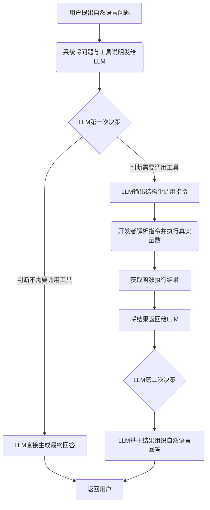
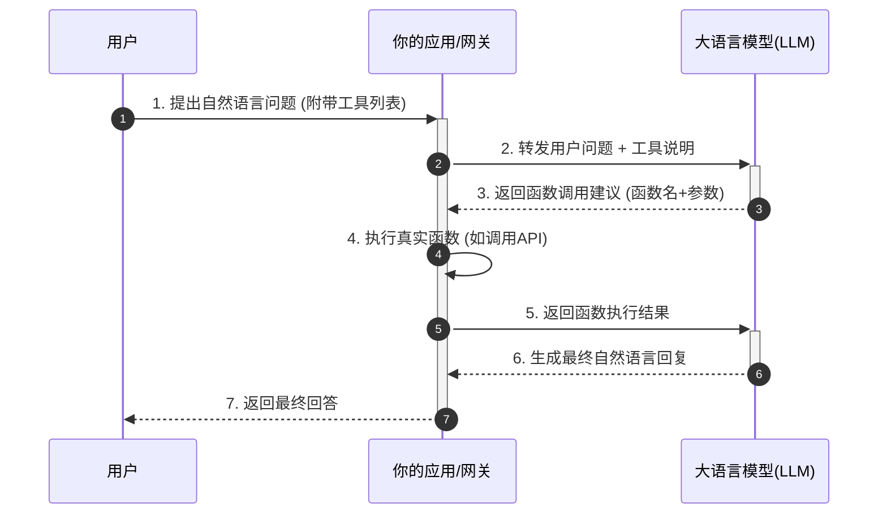

简答

我理解的 Function Calling（函数调用） Function Calling 是基础协议：它是由 OpenAI、Anthropic、智谱 AI 等模型提供商在其 API 层面实现的标准化功能。它规定了模型如何接收工具描述以及如何返回结构化调用请求。它的本质是让 LLM 扮演一个“决策大脑”的角色，而实际的工具执行则由外部代码环境完成。其工作流程遵循一个清晰的“思考-行动-观察”循环。（上面的题里面有图）模型本身不执行代码，它只负责理解意图和生成结构化的调用指令。实际执行发生在我们自己的代码环境中，这既保障了安全，也使得模型能够处理它本无法完成的任务（如实时数据查询、复杂计算等）。

在 LangChain 中开发的 Agent 调用工具，其底层机制就是 Function Calling。LangChain 在底层模型协议之上，构建了一层抽象和封装，提供了一套统一、便捷的接口来使用这些功能。工具（Tools） 就是封装好的 Function。Agent 利用 LLM 的 Function Calling 能力，自动管理了上图所示的“思考-行动-观察”循环。它会自动判断何时调用工具、调用哪个工具，并自动将工具结果反馈给模型，直到得出最终答案。

---

详细

Function Calling 的核心原理，可以理解为 **“让大模型（LLM）从‘只会说’，进化到‘能指挥做事’”** 。

大模型本身是一个静态的知识库，无法获取实时信息或执行具体操作。Function Calling 提供了一个标准化的桥梁：开发者把“工具”（如查询天气的API）的使用说明书（名称、参数等）提前告诉模型。当用户提问后，模型会判断是否需要使用工具，如果需要，它不会直接操作，而是输出一个结构化的“调用指令”（告诉开发者该调哪个函数、传什么参数）。开发者拿到指令后，在外部执行真实的函数（如调用天气API），再把结果传回给模型，模型最终整合成自然语言回复给用户。

### ⚙️ 核心工作流程（四步法）

Function Calling的完整流程可以分为四个核心步骤：

1.  **📝 定义工具（注册）**：开发者用JSON Schema格式定义好可用的“工具”，包括函数名称、功能描述、以及每个参数的名字、类型和描述。这份“工具说明书”是模型进行决策的依据。

2.  **🤔 模型决策（第一次调用）**：用户提问时，系统会将用户问题和所有“工具说明书”一起发给LLM。模型分析后，如果判断需要调用工具，会返回一个结构化的调用指令，指明要调用的函数和参数。如果不需要，则直接生成回答。

3.  **⚡️ 执行函数（开发者行动）**：开发者的应用程序解析模型返回的指令，并根据函数名，在代码里找到并执行对应的真实函数（如调用第三方API、查数据库等）。

4.  **💬 生成回复（第二次调用）**：开发者将函数的执行结果返回给LLM。LLM拿到结果后，会结合上下文，将其组织成用户易懂的自然语言回答，完成整个交互。

### 📊 流程图（思想与行动的解耦）

下图清晰地展示了整个流程中“模型思考”与“系统行动”的分离：

### ⏱️ 时序图（系统间的交互顺序）

这个时序图能更清晰地看到用户、网关/应用、LLM之间的交互顺序：

### 🌰 一个具体的例子：天气查询

假设用户问：“北京今天天气怎么样？”

1.  **定义工具**：开发者预先定义了一个名为 `get_weather` 的工具，并告诉模型：这个工具需要一个 `city` (城市) 参数。

2.  **模型决策**：模型收到问题后，判断需要调用 `get_weather` 工具，于是返回一个结构化的指令，例如：`{"name": "get_weather", "arguments": {"city": "北京"}}`。

3.  **执行函数**：你的应用程序解析这个指令，调用真实的天气API，传入参数“北京”，获取到“晴，25°C”的实时数据。

4.  **生成回复**：应用程序将“晴，25°C”这个结果返回给模型。模型组织语言后，向用户回复：“北京今天天气晴朗，气温25°C。”

### 💎 总结

Function Calling的本质，是**一个将自然语言意图转化为结构化程序指令的“翻译”过程**。它巧妙地让擅长**理解与决策**的LLM，与擅长**执行与操作**的代码各自发挥所长，从而让AI应用具备了连接真实世界、解决实际问题的能力。