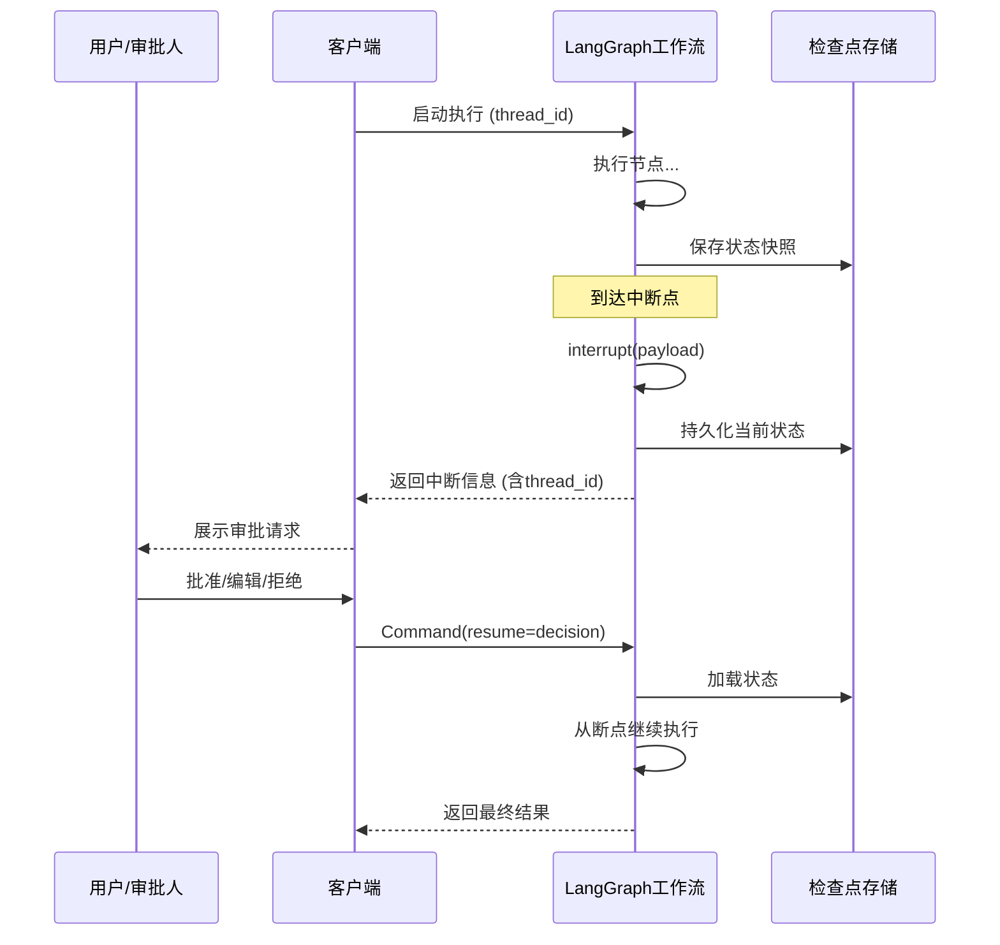
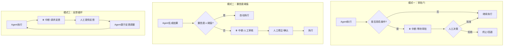
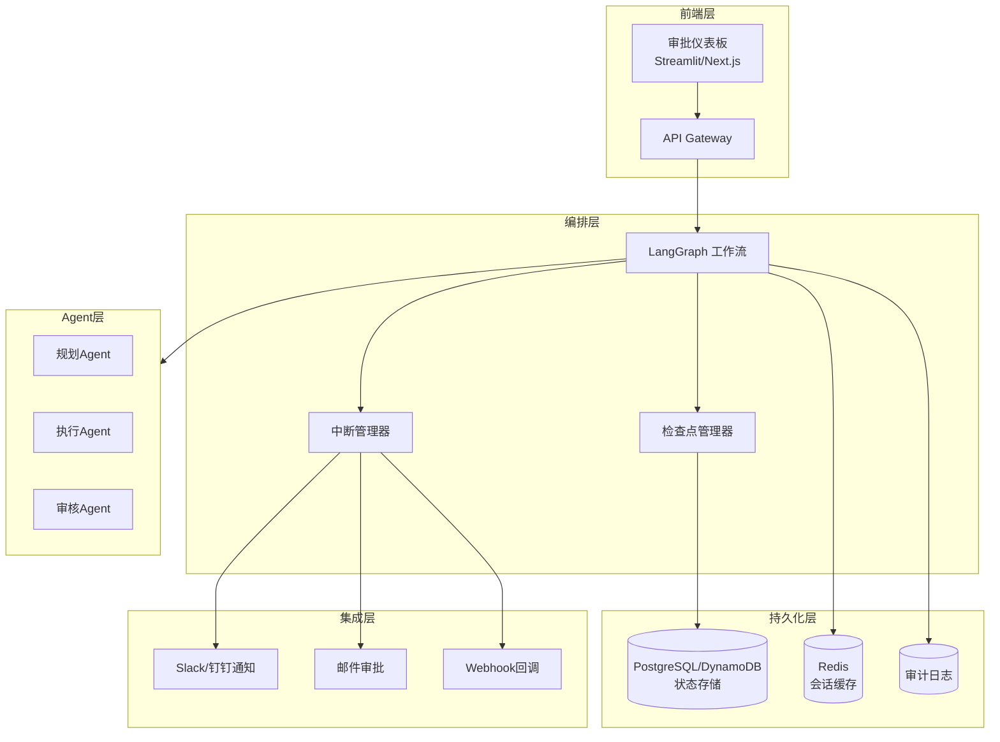
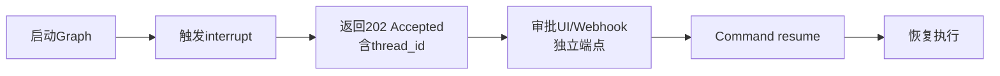
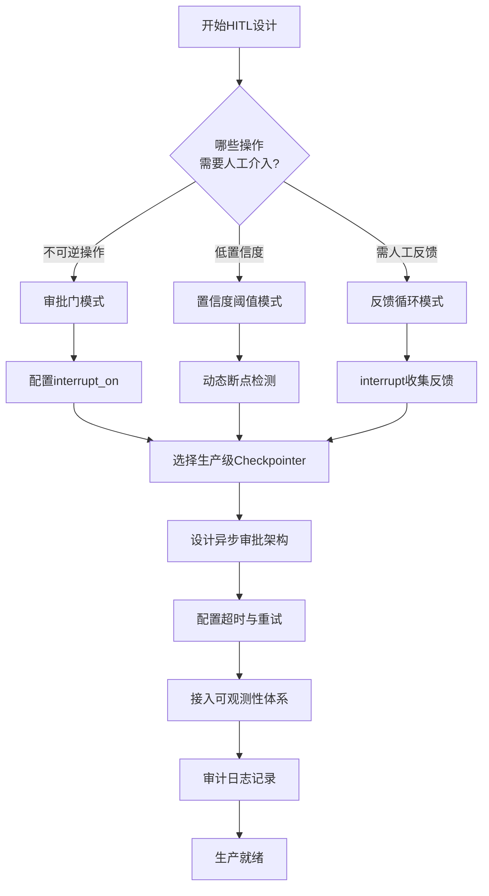

```
在 LangGraph 中，Human-in-the-loop（HITL，人机协同）的目的是，对于关键节点引入人类监督和干预，从而在保持效率的同时，显著提升系统的可靠性、安全性与合规性。

LangGraph 主要通过 **中断机制**、**状态管理** 和 **恢复命令** 三者协同来实现 Human-in-the-loop。

1. **中断 (Interrupt)**：这是触发人工干预的起点。在定义的工作流节点中，可以调用 `interrupt()` 函数。一旦执行到此，整个图的工作流会立即暂停，并将预设的信息（如需要审核的内容、待决策的问题）返回给调用方。同时，LangGraph 会抛出一个特殊的 `GraphInterrupt` 异常。
    
2. **检查点与状态管理 (Checkpointer)**：为了实现“断点续跑”，LangGraph 依赖 **检查点 (Checkpoint)** 机制。因为，一个 Checkpointer 会在每个节点执行完毕后，将当前的完整状态 (State) 持久化保存下来。当工作流在某个节点中断时，其状态已被妥善保存，确保人类干预后能够从精确的位置恢复执行。
    
3. **恢复 (Resume)**：当人类做出决策（如“批准”或“拒绝”又或者输入新的其他信息）后，需要通过 `Command` 原语来恢复工作流。LangGraph 会根据 `thread_id` 找到对应的检查点，然后从触发中断的那个节点的开头重新执行该节点的函数。当重新执行的代码再次运行到 `interrupt()` 语句时，这次它不会真正中断，而是直接将 `Command(resume=...)` 中提供的值作为“返回值”注入，然后节点函数继续执行后续逻辑。
    
```

## 一、概述：为什么企业需要 HITL？

Human-in-the-Loop（HITL）是一种AI系统设计模式，允许人类在AI Agent的决策过程中介入并提供反馈或决策。在金融交易、数据库管理、医疗诊断等高危场景中，AI Agent的自主决策存在两类核心风险：不可逆操作（如删除数据库记录、大额转账）和模糊决策场景（如医疗方案推荐）。

传统全流程人工审批会导致效率骤降50%以上，而HITL架构通过精准断点控制，仅在关键节点引入人工介入，实现效率与安全的动态平衡。LangGraph将HITL作为**一等公民**设计，通过`interrupt()`机制和检查点（checkpoint）系统，让开发者能在图的任意节点插入中断点，执行流到达时停下来等待人类介入。


## 二、核心架构：中断与恢复机制

### 2.1 核心组件

LangGraph的HITL架构由以下核心组件构成：

| 组件                 | 功能                                   | 企业级考量                   |
| -------------------- | -------------------------------------- | ---------------------------- |
| **interrupt()**      | 在节点内暂停执行，向调用方暴露数据     | 支持任意JSON可序列化数据传递 |
| **Checkpointer**     | 在每个超步（super-step）后保存状态快照 | 需替换为生产级持久化存储     |
| **Command(resume=)** | 携带人工输入恢复执行                   | 支持从任意断点精确恢复       |
| **thread_id**        | 标识独立的检查点序列                   | 用于跨请求的状态隔离         |

### 2.2 执行流程



### 2.3 中断的三种实现方式

LangGraph提供了三种互补的HITL实现模式：

**模式一：自定义多步中断图（`graph.py`）**

- 适用于有多个明确决策点的工作流
- 例：审批计划 → 选择方向 → 选择格式
- 开发者显式控制每个中断点的位置和逻辑

**模式二：审批/编辑/拒绝工作流（`approval_workflow.py`）**

- 适用于“草稿→审核”模式
- AI生成草稿，人工批准、编辑或拒绝（拒绝时重新生成）

**模式三：Agent + HITL中间件（`agent.py`）**

- 适用于工具型Agent，仅在高危操作前审批
- 代码量最小：`create_agent` + `HumanInTheLoopMiddleware`


## 三、企业级实践模式

### 3.1 三种核心HITL模式

基于企业落地实践，HITL可归纳为三种核心模式：



### 3.2 企业级参考架构



### 3.3 实战案例：金融交易审批链

在金融交易场景中，当转账金额超过阈值时触发人工审批：

```python
# 动态断点检测
def should_continue(state):
    last_msg = state["messages"][-1]
    if last_msg.tool_calls and last_msg.tool_calls[0]["name"] == "bank_transfer":
        transfer_amount = parse_amount(last_msg.tool_calls[0]["args"])
        if transfer_amount > 100000:  # 动态阈值
            return "require_approval"
    return "continue"

# 图配置
workflow.add_conditional_edges(
    "agent", 
    should_continue,
    {
        "require_approval": "approval_node",
        "continue": "action"
    }
)
```

**执行流程**：

1. 用户输入“向账户6217转账150万元”
2. Agent解析请求，识别为`bank_transfer`工具调用
3. 动态断点检测金额超阈值 → 暂停并保存状态
4. 风控人员收到审批请求（含转账详情/风险评估）
5. 人工决策后更新状态：批准或拒绝
6. Agent从断点继续执行或终止


## 四、关键技术实现

### 4.1 interrupt() 基本用法

```python
from langgraph.types import interrupt, Command
from langgraph.checkpoint.memory import MemorySaver

class State(TypedDict):
    some_text: str

def human_node(state: State):
    # 中断执行，向调用方暴露待修订文本
    value = interrupt({"text_to_revise": state["some_text"]})
    return {"some_text": value}

# 编译时必须传入checkpointer
graph = builder.compile(checkpointer=MemorySaver())

# 恢复执行
await client.runs.wait(
    thread_id,
    assistant_id,
    command=Command(resume="修订后的文本")
)
```

**关键点**：

- `interrupt()`抛出特殊的`GraphInterrupt`错误，应避免用`try/catch`包裹
- 恢复时从触发最后一个interrupt的节点开头重新执行
- Checkpointer是**必需**的

### 4.2 HITL中间件配置

通过`HumanInTheLoopMiddleware`实现工具级审批控制：

```python
from langchain.agents import create_agent
from langchain.agents.middleware import HumanInTheLoopMiddleware

agent = create_agent(
    model="gpt-4",
    tools=[remove_file, fetch_file, send_email],
    middleware=[
        HumanInTheLoopMiddleware({
            "remove_file": True,  # 允许approve/edit/reject/respond
            "send_email": {"allowed_decisions": ["approve", "reject"]},  # 不允许编辑
            "fetch_file": False,  # 无需审批
        })
    ],
    checkpointer=MemorySaver()
)
```

**决策类型**：

| 决策类型    | 说明                         | 适用场景         |
| ----------- | ---------------------------- | ---------------- |
| **approve** | 按原参数执行工具             | 发送邮件草稿     |
| **edit**    | 修改工具参数后执行           | 修改收款人后转账 |
| **reject**  | 跳过执行，返回拒绝反馈       | 拒绝删除文件     |
| **respond** | 直接返回人工消息作为工具结果 | “询问用户”类工具 |


## 五、企业级落地关键考量

### 5.1 持久化存储

生产环境必须将MemorySaver替换为企业级持久化存储：

| 存储方案        | 适用场景     | 特点                      |
| --------------- | ------------ | ------------------------- |
| PostgreSQL      | 通用生产环境 | JSONB原生支持，成熟稳定   |
| Amazon DynamoDB | AWS生态      | AWS维护的DynamoDBSaver    |
| Oracle DB       | 金融/政企    | OracleSaver支持跨进程恢复 |
| Aerospike       | 高性能场景   | 低延迟状态读写            |

### 5.2 异步审批架构

正确的异步HITL模式是：



核心原则：

- 启动侧采用**fire-and-forget**模式
- 立即返回`thread_id`，不阻塞等待
- 审批通过**独立API端点**完成，可由UI或Webhook触发

### 5.3 并发中断处理

当多个子Agent并行调用需要审批的工具时，LangGraph会将所有中断合并为一次中断请求，必须按顺序为每个工具提供决策。生产环境需注意：

```python
# 获取所有待处理中断
state = agent.get_state(config)
pending_interrupts = state.values.get("__interrupt__", [])
# 按顺序逐一决策
for interrupt in pending_interrupts:
    decision = await get_human_decision(interrupt)
    # 按顺序提交决策
```

### 5.4 可观测性

企业级HITL系统需要全链路可观测性：

- **指标采集**：响应延迟、调用成功率、审批等待时长
- **链路追踪**：每个节点处理耗时、错误率实时可见
- **审计日志**：所有人工决策记录（谁、何时、做了什么决策）
- **监控集成**：Datadog等APM工具

### 5.5 超时与容错

- **审批超时**：配置审批超时策略，超时后自动升级或执行默认策略
- **节点重试**：LangGraph提供内置重试机制处理瞬态故障
- **状态恢复**：工作流被中断（系统故障或人工干预）后，可从最后记录的状态恢复


## 六、企业级最佳实践总结



**核心原则**：

1. **精准断点**：仅在关键节点介入，避免过度审批导致效率下降
2. **状态持久化**：生产环境必须使用PostgreSQL/DynamoDB等持久化Checkpointer
3. **异步解耦**：采用fire-and-forget + 独立恢复端点模式
4. **分级管控**：不同工具配置不同审批策略（approve/edit/reject/respond）
5. **可观测性**：全链路监控 + 审计日志，满足合规要求
6. **容错设计**：超时处理、重试机制、状态恢复三位一体

HITL的本质是**增强而非削弱**自动化——让人类在最关键的环节行使判断权，既保证了AI的效率和规模效应，又在高风险节点保留了人类的决策权威。