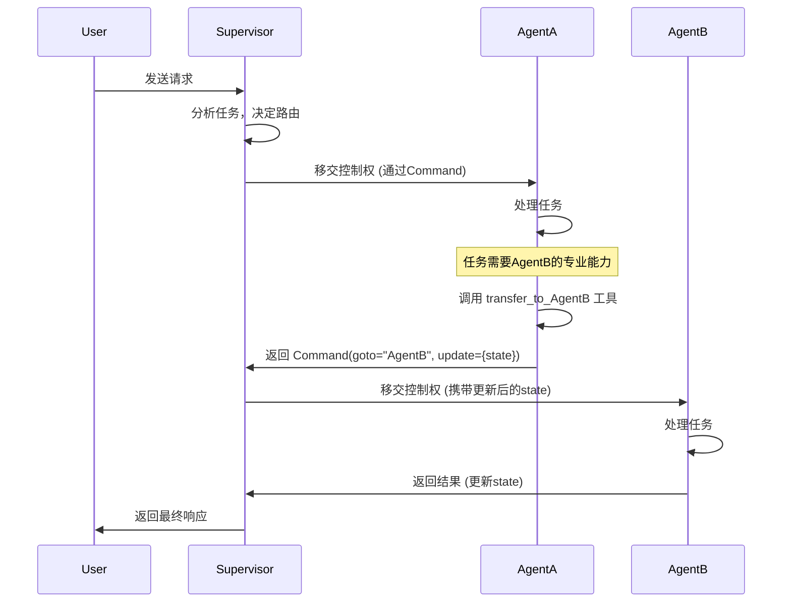
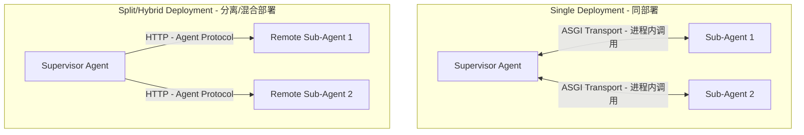
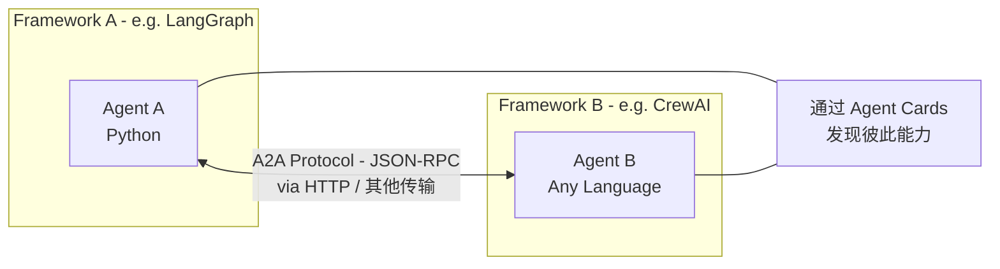

```
原始问题：框架是LangGraph，Agent之间交互的协议是什么？

回答:
在 LangGraph 框架中，Agent 之间的交互并不依赖外部通信协议（如 HTTP、gRPC 或 MCP），而是通过 **框架内部的状态驱动消息传递机制** 实现的，简称 handoff。其“协议”本质是 **基于共享状态 (State) 的结构化消息流转**。

每个智能体都是图中的一个独立节点。交接通过图的边来控制。具体又可分为两种方法：

1. **条件边**：在某个节点（如监督者智能体）执行完毕后，由一个条件函数根据当前状态决定下一个要执行的节点。这种方式类似于传统的流程图，路由逻辑是预定义且相对静态的。
2. **Command 对象**：节点在执行后可以直接返回一个 Command 对象，该对象既能更新全局状态，又能通过 goto 参数显式指定下一个要执行的节点。这种方式将路由逻辑放在节点内部，更加动态和灵活。所以第二种方式更加通用，在我之前的 Multi_agent 项目中，由于我采用的是 langgraph==0.6，和 langgraph-supervisor 库，所以，我采用 Python 的闭包，动态的为每个 agent 之间都创建一个 handoff 工具，handoff 工具中通过返回 Command 对象，把需要交接的上下文数据封装到一个 ToolMessage 中，传递给下一个 Agent。当需要进行 Agent 的交接时，LLM 基于上下文和用户输入的指令，来动态意图识别决策调用某个 handoff 工具，最终完成交接过程。
```


LangGraph的原生多智能体交互确实更侧重于**模式（Pattern）** 而非严格意义上的协议（Protocol）。

在深入探讨具体技术前，先明确两个核心概念：

*   **交互模式 (Interaction Patterns)**：指在**同一框架内部**，Agent之间如何协作和传递控制权的方式（如LangGraph的Handoff）。
*   **通信协议 (Communication Protocols)**：指**跨框架、跨语言、跨网络**的Agent之间如何进行标准化通信的规则（如A2A）。

下面，从这两个维度展开，详细介绍三个方向及其他重要方式。

---

### 1. LangGraph 原生交互模式

LangGraph本质上是一个用于构建有状态、多角色Agent应用的编排框架。其多Agent交互并非依赖外部协议，而是通过框架内置的机制实现。

*   **核心机制一：Handoff (控制权移交)**
    Handoff是多Agent系统中最常见的模式，即一个Agent将控制权显式地"移交"给另一个。
    *   **实现方式**：通常通过创建特殊的`transfer_to_xxx`工具。当Agent调用该工具时，会返回一个`Command`对象，指定要跳转到的目标Agent节点(`goto`)，并可将当前状态(`state`)作为负载传递过去。
    *   **架构模式**：
        *   **Supervisor (主管模式)**：由一个中央主管Agent负责调度，根据任务将工作委派给其他专业Agent。(来自langgraph-supervisor库)
        *   **Swarm (群组模式)**：去中心化，Agent之间根据各自的专长动态地相互移交控制权。

*   **核心机制二：State (共享状态)**
    这是LangGraph实现上下文传递的基础。所有Agent节点共享一个全局状态图(`StateGraph`)。当一个Agent通过Handoff将控制权交给另一个时，整个`state`对象都会被传递，确保上下文的连续性。

下图展示了LangGraph中基于`Command`的Handoff流程：



---

### 2. DeepAgent 的 AsyncSubAgent (异步子Agent)

这是LangChain生态中DeepAgent项目提供的一种高级交互模式，支持**异步、非阻塞**的子Agent调用。

*   **核心价值**：主管Agent可以启动一个子Agent作为后台任务，并立即返回继续与用户交互，子Agent则在后台并发工作。主管可以随时查询任务状态、更新甚至取消任务。
*   **通信方式**：
    *   **ASGI Transport (同部署)**：当主管和子Agent部署在**同一服务器**时，它们通过**ASGI**进行通信，本质上是进程内的函数调用，**零网络开销**。这是默认且最高效的方式。
    *   **HTTP Transport (远程)**：子Agent也可以部署在**远程服务器**上。此时，它们通过**HTTP**协议进行通信，具体是遵循 **Agent Protocol** 标准。任何实现了该协议的服务器（如LangSmith部署或自托管服务）都可以作为远程子Agent接入。

下图展示了AsyncSubAgent的两种部署与通信拓扑：



---

### 3. Google 的 A2A (Agent2Agent) 协议

A2A是一个**开放标准**，旨在解决不同语言、不同框架构建的Agent之间的**互操作性**问题。

*   **核心价值**：可以将其视为"Agent世界的HTTP"。它让一个用Python (LangGraph) 写的Agent能够无缝调用一个用Go写的Agent。
*   **工作机制**：
    *   **发现 (Discovery)**：Agent通过一个标准的JSON文件（`/.well-known/agent.json`）来发布自己的能力。
    *   **通信 (Communication)**：基于**JSON-RPC**进行结构化消息交换。核心概念包括`Message`（用于一般信息交换）和`Task`（用于表示一个需要完成的工作单元）。
*   **生态定位**：A2A与MCP（模型上下文协议）形成互补——**MCP连接Agent与工具/数据**，而**A2A连接Agent与Agent**。A2A v1.0已于2026年发布，并由Linux基金会管理，标志着其已成为一个稳定的行业标准。

下图展示了A2A协议如何桥接异构Agent：



---

### 4. 其他重要的交互方式/协议

除了上述三种，多Agent通信领域还有多种协议和模式，它们各有侧重：

| 协议/模式                        | 核心定位                            | 关键特点                                                     |
| :------------------------------- | :---------------------------------- | :----------------------------------------------------------- |
| **MCP (Model Context Protocol)** | Agent到**工具/数据**的标准化连接    | 为LLM提供统一的接口访问外部资源，与A2A形成互补的协议栈。     |
| **ANP (Agent Network Protocol)** | 构建开放、去中心化的**Agent互联网** | 旨在成为"Agentic Web时代的HTTP"，支持使用DID（去中心化ID）进行身份认证和安全协作。 |
| **Agora**                        | 异构LLM之间的**高效通信**元协议     | 通过"协商"机制，对高频通信使用标准化例程，对低频通信使用自然语言，以平衡效率与灵活性。 |
| **CNP (Contract Net Protocol)**  | 经典的任务**分配与协商**协议        | 基于"招标-投标-中标"的合同网模式，一个Manager广播任务，其他Agent投标，Manager选择中标者执行。 |
| **IoA (Internet of Agents)**     | 异构Agent的**互联互通**框架         | 定义了包括Agent集成协议、任务协议等在内的协议套件，旨在构建一个大规模的Agent互联网。 |

### 总结

多Agent系统的交互方式是一个从"框架内协作"到"跨框架互联"的频谱。

*   **内部协作**：在**LangGraph**等框架内部，主要依靠**Handoff**和**共享State**等模式进行紧密协作。
*   **异步与分布式**：**DeepAgent的AsyncSubAgent**通过ASGI（同进程）和HTTP+Agent Protocol（远程）提供了灵活的异步子Agent编排能力。
*   **标准化互通**：**Google的A2A协议**作为行业标准，是实现Agent跨语言、跨框架通信的关键。
*   **未来趋势**：此外，还有**ANP**、**Agora**、**IoA**等一系列新兴协议，它们从不同角度（如去中心化、高效协商、大规模互联）探索Agent间通信的更多可能性，共同构成了一个快速发展的技术生态。