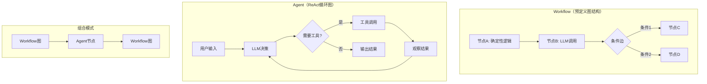
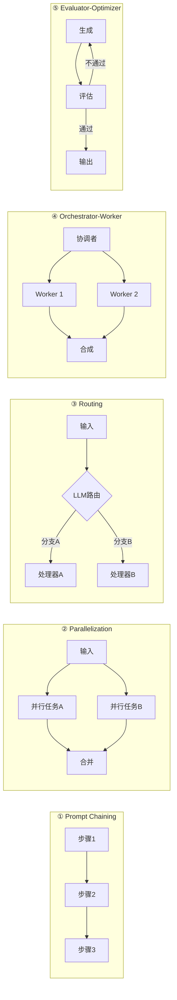

速答

由于在项目中，我一般都是采用 langchain 和 LangGraph 框架。在这两个框架中：agent 本质就是 workflow 的一共特殊方式，而且底层也是由 langgraph 框架定义一个 graph 实现的。但是二者在编程设计理念、适用场景这几个方面还是有区别的。

**第一：编程设计思路方面。**

- **workflow (Graph 架构)：** 流程由开发者预定义（通过图结构中的节点与边来构建一个 Graph）其运行逻辑是“输入→按预设步骤处理→输出”，相同输入必然执行相同的路径（确定性）。很多人说在 graph 中就没有大模型的意图识别和决策了，我认为这个观点是有瑕疵的。我们可以把大模型和工具列表进行绑定，作为一个节点。这种情况下大模型也可以根据上下文和用户指令 决策出具体调用某一个工具。
- **agent：** 流程由 LLM 动态控制，LLM 可根据环境反馈（如工具调用结果、用户输入）自主决定下一步动作（如调用工具、调整策略）。其运行逻辑是“输入→LLM 决策→执行→反馈→再决策”（动态性）。

**第二：适用场景方面。**

- **workflow** 适合流程固定、可拆解的，有一定的确定性任务，即任务的步骤和逻辑可以预先定义。
- **agent** 适合功能单一、需工具协作的不确定性任务，即任务的步骤和逻辑无法预先定义，需要 LLM 根据实时反馈动态调整。

其实啊，LangGraph 框架还支持“**workflow + agent**”的混合模式（如在 workflow 中嵌入 agent 节点），以满足更复杂的场景需求（如“先按固定流程生成内容，再由 agent 动态优化”）。我简历中的第 2 个项目，由于也是采用了多智能体的方案设计。所以我用的是“**workflow + agent**”的混合模式。

---


详细

## 一、核心定义

在 LangGraph 的语境下，两者的边界清晰但并非割裂：

| 维度 | Workflow（工作流） | Agent（智能体） |
|------|-------------------|----------------|
| **本质** | 开发者预定义的、结构化的执行图 | LLM 动态驱动的决策循环 |
| **控制权** | 开发者通过图结构控制流程走向 | LLM 自主决定下一步动作（调用工具/结束） |
| **决策者** | 开发者编写的节点逻辑和条件边 | LLM 在 ReAct 循环中实时推理决策 |
| **流程确定性** | 路径可预测、步骤固定 | 路径动态，随输入和中间结果变化 |
| **典型场景** | 报告生成、多语言翻译、内容校验 | 智能客服、复杂计算、动态数据查询 |

**最精炼的概括**：Workflows 是“结构化执行者”，Agents 是“自主决策者”。

---

## 二、LangGraph 视角下的关系：不是非此即彼

LangGraph 的核心思想是将 **Agent 工作流建模为有向图**。图由 State（状态）、Node（节点）和 Edge（边）构成。

在这个框架下：

1. **Agent 本身就是一种特殊的 Workflow**：官方文档给出的 Agent 工作流程图（Request → ReAct 模式 → LLM 决策 → 工具调用 → 观察 → 循环 → 输出结果），本质上就是一个带有循环的图结构。

2. **Workflow 的节点可以是 Agent**：在自定义工作流中，每个节点可以是一个简单函数、一次 LLM 调用，也可以是一个完整的 Agent。你可以将多智能体系统作为一个节点嵌入更大的工作流中。

3. **图不一定是 Agent**：例如，一个只支持来回对话的简单聊天机器人，虽然也是图结构，但并不具备 Agent 的自主决策能力。



---

## 三、Workflow 的典型模式

LangGraph 官方文档归纳了以下几种典型 Workflow 模式：



---

## 四、代码示例

### 4.1 Workflow：预定义流程的 RAG 管道

以下示例构建了一个三节点的 RAG 工作流，流程由开发者完全控制：

```python
from typing_extensions import TypedDict
from langgraph.graph import StateGraph, START, END
from langchain_openai import ChatOpenAI
from langchain_core.vectorstores import VectorStore

class State(TypedDict):
    query: str
    rewritten_query: str
    retrieved_docs: list
    answer: str

llm = ChatOpenAI(model="gpt-4o")
vector_store: VectorStore = ...  # 你的向量数据库

# 节点1: 重写查询（LLM调用）
def rewrite_query(state: State) -> dict:
    """LLM重写用户查询以优化检索"""
    msg = llm.invoke(f"Rewrite this query for better search: {state['query']}")
    return {"rewritten_query": msg.content}

# 节点2: 检索（纯确定性逻辑，无LLM）
def retrieve_docs(state: State) -> dict:
    """执行向量相似度搜索"""
    docs = vector_store.similarity_search(state["rewritten_query"], k=5)
    return {"retrieved_docs": docs}

# 节点3: 生成答案（LLM调用）
def generate_answer(state: State) -> dict:
    """基于检索结果生成答案"""
    context = "\n".join([doc.page_content for doc in state["retrieved_docs"]])
    msg = llm.invoke(f"Based on this context, answer: {state['query']}\n\nContext: {context}")
    return {"answer": msg.content}

# 构建工作流 - 流程完全由开发者定义
workflow = StateGraph(State)
workflow.add_node("rewrite", rewrite_query)
workflow.add_node("retrieve", retrieve_docs)
workflow.add_node("generate", generate_answer)

workflow.add_edge(START, "rewrite")
workflow.add_edge("rewrite", "retrieve")
workflow.add_edge("retrieve", "generate")
workflow.add_edge("generate", END)

app = workflow.compile()
```

### 4.2 Agent：自主决策的 ReAct 智能体

以下示例构建了一个自主决策的 Agent，LLM 动态决定调用哪些工具以及何时结束：

```python
from langchain_openai import ChatOpenAI
from langchain_core.tools import tool
from langgraph.prebuilt import create_react_agent
from langgraph.checkpoint.memory import MemorySaver

# 定义工具
@tool
def search(query: str) -> str:
    """搜索实时信息"""
    return f"Search results for: {query}"

@tool
def calculate(expression: str) -> str:
    """执行数学计算"""
    return str(eval(expression))

@tool
def get_weather(city: str) -> str:
    """获取城市天气"""
    return f"Weather in {city}: Sunny, 25°C"

# 创建Agent - LLM自主决定工具调用顺序和时机
model = ChatOpenAI(model="gpt-4o")
tools = [search, calculate, get_weather]
memory = MemorySaver()

agent = create_react_agent(
    model=model,
    tools=tools,
    checkpointer=memory,
)

# 运行Agent - LLM自主决策整个执行路径
result = agent.invoke(
    {"messages": [{"role": "user", "content": "What's the weather in Beijing and 100 + 200?"}]},
    config={"configurable": {"thread_id": "1"}}
)
```

### 4.3 组合模式：Workflow 中嵌入 Agent 作为节点

这是最体现 LangGraph 灵活性的模式——Workflow 的某个节点本身就是一个完整的 Agent：

```python
from langgraph.graph import StateGraph, START, END
from typing_extensions import TypedDict
from langgraph.prebuilt import create_react_agent

class OverallState(TypedDict):
    user_query: str
    research_result: str
    final_report: str

# 这是一个完整的Agent - 将在Workflow中作为一个节点运行
research_agent = create_react_agent(
    model=ChatOpenAI(model="gpt-4o"),
    tools=[search, get_weather],
)

# Workflow节点1: 调用Agent进行自主研究
def research_node(state: OverallState) -> dict:
    """这个节点内部是一个完整的Agent，自主决定工具调用"""
    result = research_agent.invoke(
        {"messages": [{"role": "user", "content": state["user_query"]}]}
    )
    return {"research_result": result["messages"][-1].content}

# Workflow节点2: 确定性报告生成（无LLM自主决策）
def generate_report(state: OverallState) -> dict:
    """纯格式化逻辑，流程固定"""
    report = f"""
    === RESEARCH REPORT ===
    Query: {state['user_query']}
    Findings: {state['research_result']}
    === END REPORT ===
    """
    return {"final_report": report}

# 构建混合Workflow - 一个节点是Agent，其余是确定性逻辑
workflow = StateGraph(OverallState)
workflow.add_node("research", research_node)      # Agent节点
workflow.add_node("report", generate_report)      # 确定性节点

workflow.add_edge(START, "research")
workflow.add_edge("research", "report")
workflow.add_edge("report", END)

app = workflow.compile()
```

---

## 五、工程实践中的选择指南

| 场景 | 推荐方案 | 理由 |
|------|---------|------|
| 流程固定、步骤可预测（如数据清洗→分析→生成报告） | Workflow | 成本可控、延迟可预测、易于调试 |
| 需要多轮工具调用、路径动态变化 | Agent | LLM 自主决定下一步，灵活性高 |
| 混合场景：大部分流程固定，某一步需要自主决策 | **组合模式** | Workflow 节点中嵌入 Agent |
| 需要人工审批环节 | Workflow + HITL | LangGraph 原生支持 Human-in-the-Loop |
| 多智能体协作 | Agent 作为子图 | 每个 Agent 是一个图节点，可组合成更大的图 |

**核心决策逻辑**：

- **流程确定性高 → Workflow**：开发者控制每一步，LLM 只在特定节点被调用
- **路径依赖 LLM 推理 → Agent**：LLM 在 ReAct 循环中自主决策
- **两者都要 → 组合**：LangGraph 的图结构天然支持这种混合

---

## 六、总结

1. **Workflow 和 Agent 不是二选一的对立概念**，而是同一图谱上的不同设计选择。

2. **在 LangGraph 中，一切都是图**：Agent 是带有 ReAct 循环的图，Workflow 是开发者预定义路径的图。

3. **组合是 LangGraph 的核心优势**：你可以将 Agent 作为节点嵌入 Workflow，也可以将多个 Agent 组合成更大的图。

4. **选择依据是“谁做决策”**：开发者控制流程 → Workflow；LLM 控制流程 → Agent；混合控制 → 组合模式。