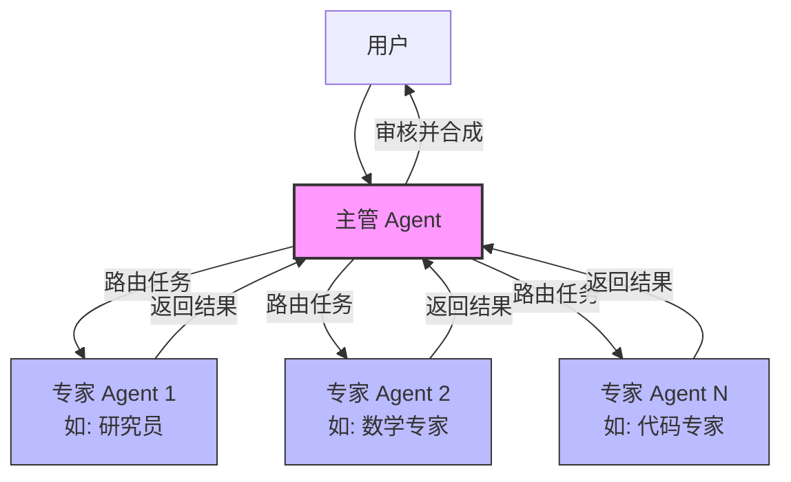
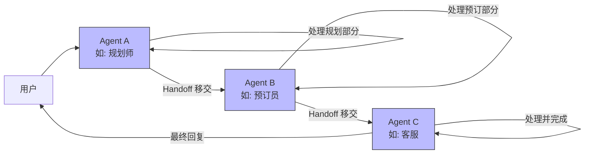
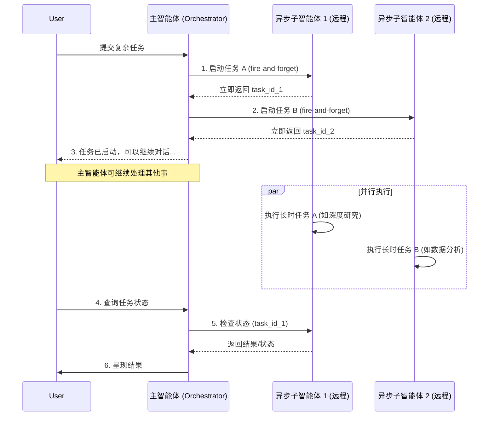

注意问题的时效性 可以谈谈multi agent架构的演进，体现技术进步思维

我一共会三种不同的 Multi-Agent 的架构，分别是：

1. **LangGraph-Swarm**：基于 LangGraph 的分布式多 Agent 协作框架，强调去中心化架构和动态任务分配。
2. **LangGraph-Supervisor**：采用集中式监督模式的框架，通过 Supervisor Agent 协调多个 Worker Agent。
3. **DeepAgents** 作为 LangChain 1.0 后推出的框架，主要特点是提供了更强大的任务规划能力和子 Agent 管理机制。

> **注意**：`langgraph-supervisor` 和 `langgraph-swarm` 这两个独立库已**不再被积极维护**。官方推荐的演进路径是使用 **Deep Agents** 库中的 `subagents` 和 `handoffs` 模式，尤其是asyncsubagent这个新特性非常重要

---

**langgraph-swarm**：去中心化协作，自主决策，采用网状拓扑结构，每个 Agent 均有机会成为“活跃节点”，负责：接收用户请求或来自其他 Agent 的 Handoff（交接）；根据自身能力决定是否处理任务，或将任务转交给更合适的 Agent；处理完成后，将结果返回给发起者或下一个 Agent。核心逻辑：通过 Handoff 机制实现 Agent 间的自主协作，无固定中心，对于开发来说不好管理和控制。

**langgraph-supervisor**：集中式控制，全局协调：通过中心化 Supervisor 的主管 Agent 统一调度任务。采用星型拓扑结构，Supervisor 主管 Agent 作为中心节点，其他功能和子任务都是 Worker Agent。接收用户请求，分析任务类型；将任务分配给对应的 Worker Agent；收集 Worker 的执行结果，整合后返回给用户。核心逻辑：所有决策均由 Supervisor 做出，Worker 仅负责执行具体任务，无自主决策权限。

**DeepAgents 架构** ：用分层规划 + 子 Agent 委派的架构，核心是 DeepAgents Core（决策中心）。通过规划工具（如 write_todos）将隐式思维转化为显式任务清单，通过子 Agent 实现任务分治，通过自我评估保证结果质量。


---
supervisor和swarm不用细看

### 1. Supervisor 模式（主管模式）

这是最经典的多智能体协作模式，采用**中心化协调**方式。一个主管（Supervisor）智能体负责接收任务、分析并分发给最合适的专家智能体，然后审核结果，决定是继续迭代还是结束。

#### Mermaid 流程图



#### 代码示例（推荐方式：工具封装）

当前推荐的实现方式是将每个专家 Agent 封装成一个工具（`@tool`），供主管 Agent 调用。

```python
from langchain.agents import create_agent
from langchain.tools import tool
from langchain_openai import ChatOpenAI
from langgraph.checkpoint.memory import InMemorySaver

model = ChatOpenAI(model="gpt-4o")

# 1. 定义工具
def web_search(query: str) -> str:
    """搜索网络信息"""
    return f"关于 '{query}' 的搜索结果：..."

def add(a: float, b: float) -> float:
    """两数相加"""
    return a + b

# 2. 创建专家 Agent（每个 Agent 有自己的工具和提示词）
research_agent = create_agent(
    model=model,
    tools=[web_search],
    system_prompt="你是一位世界级的研究专家，擅长网络搜索。"
)

math_agent = create_agent(
    model=model,
    tools=[add],
    system_prompt="你是一位数学专家，擅长计算。"
)

# 3. 将专家 Agent 封装为工具
@tool("research_expert", description="研究专家，用于当前事件和网络查询。")
def call_research_agent(query: str) -> str:
    result = research_agent.invoke({"messages": [{"role": "user", "content": query}]})
    return result["messages"][-1].content

@tool("math_expert", description="数学专家，用于计算。")
def call_math_agent(query: str) -> str:
    result = math_agent.invoke({"messages": [{"role": "user", "content": query}]})
    return result["messages"][-1].content

# 4. 创建主管 Agent（它将专家 Agent 作为工具调用）
supervisor = create_agent(
    model=model,
    tools=[call_research_agent, call_math_agent],
    system_prompt="你是一位主管，负责将任务分配给合适的研究或数学专家。"
)

# 5. 编译并运行
checkpointer = InMemorySaver()
app = supervisor.compile(checkpointer=checkpointer)

# 执行任务
result = app.invoke({
    "messages": [{"role": "user", "content": "Meta 公司 2024 年的员工数是多少？"}]
})
print(result["messages"][-1].content)
```

### 2. Swarm 模式（群组/移交模式）

Swarm 模式采用**去中心化协调**方式。没有中央主管，每个智能体都是对等的。一个智能体在处理完自己能做的部分后，可以通过 **Handoff（移交）** 工具将任务主动移交给另一个更合适的智能体。流程像“专家转诊”一样灵活。

#### Mermaid 流程图



#### 代码示例

在 LangGraph 中，Swarm 模式通过 `Command` 对象实现智能体间的跳转。

```python
from typing import Literal
from langgraph.graph import StateGraph, END, MessagesState
from langgraph.types import Command
from langchain_openai import ChatOpenAI
from langchain_core.messages import SystemMessage

model = ChatOpenAI(model="gpt-4o")

# 定义状态（继承消息列表）
class State(MessagesState):
    pass

# --- 定义各个 Agent 节点 ---

def agent_planner(state: State) -> Command[Literal["agent_booker", "agent_support"]]:
    """规划专家：处理行程规划后移交给预订专家"""
    system_prompt = SystemMessage(content="你是行程规划专家。规划完成后，将任务移交给预订专家。")
    response = model.invoke([system_prompt] + state["messages"])
    # 规划完成后，通过 Command 跳转到预订专家
    return Command(
        update={"messages": [response]},
        goto="agent_booker"  # 移交到预订专家
    )

def agent_booker(state: State) -> Command[Literal["agent_planner", "agent_support", END]]:
    """预订专家：处理预订后移交给客服或结束"""
    system_prompt = SystemMessage(content="你是酒店/机票预订专家。")
    response = model.invoke([system_prompt] + state["messages"])
    # 假设预订完成后，移交给客服
    return Command(
        update={"messages": [response]},
        goto="agent_support"  # 移交到客服专家
    )

def agent_support(state: State) -> Command[Literal["agent_planner", "agent_booker", END]]:
    """客服专家：处理售后问题后结束流程"""
    system_prompt = SystemMessage(content="你是客服专家，负责处理用户售后问题。")
    response = model.invoke([system_prompt] + state["messages"])
    # 客服处理完毕，结束流程
    return Command(
        update={"messages": [response]},
        goto=END
    )

# --- 构建图 ---
builder = StateGraph(State)
builder.add_node("agent_planner", agent_planner)
builder.add_node("agent_booker", agent_booker)
builder.add_node("agent_support", agent_support)

# 设置入口点为规划专家
builder.set_entry_point("agent_planner")

# 编译图
app = builder.compile()

# 运行
result = app.invoke({
    "messages": [{"role": "user", "content": "帮我规划一次去北京的3天旅行并预订酒店。"}]
})
print(result["messages"][-1].content)
```

### 3. Async Subagent（异步子智能体）

这是 **Deep Agents v0.5** 引入的重要特性。与阻塞式的同步子智能体不同，异步子智能体是非阻塞的：主智能体启动任务后立即获得一个任务 ID，可以继续处理其他工作（如响应用户），稍后再回来检查或收集结果。

#### 核心特性
*   **非阻塞与并行**：主管可以同时启动多个异步子智能体执行不同的长时任务。
*   **状态保持**：异步子智能体有独立的线程，主管可以中途发送追加指令。
*   **远程部署**：子智能体可以运行在不同的服务器上，使用不同的模型和工具。

#### Mermaid 时序图



#### 代码示例

```python
from deepagents import create_deep_agent, AsyncSubAgent

# 定义异步子智能体（指向远程 Agent Protocol 服务器）
agent = create_deep_agent(
    model="openai:gpt-4o",
    subagents=[
        AsyncSubAgent(
            name="deep_researcher",
            description="执行深度网络研究，处理复杂查询。",
            url="https://my-research-agent-server.dev",  # 远程服务器地址
            graph_id="research_agent",                   # 远程 Graph ID
        ),
        AsyncSubAgent(
            name="data_analyzer",
            description="执行大规模数据分析。",
            url="https://my-data-agent-server.dev",
            graph_id="data_analysis_agent",
        ),
    ]
)

# 主智能体现在拥有了管理异步任务的工具（如 start_async_task, check_async_task 等）
# 它可以启动任务，然后继续对话，稍后再检查结果
```

### 4. 对比与选择指南

| 维度 | Supervisor 模式 | Swarm 模式 | Async Subagent |
| :--- | :--- | :--- | :--- |
| **控制方式** | 中央协调（一个主管决策） | 分布式移交（Agent 间互相移交） | 主智能体发起并监控 |
| **适用场景** | 任务类型明确，需要统一调度和入口 | 流程灵活，有明确阶段顺序 | 长时任务、需并行处理 |
| **执行方式** | 同步（主管等待结果） | 同步（移交后等待） | **异步、非阻塞** |
| **部署方式** | 通常在同一进程 | 通常在同一进程 | **支持远程、异构部署** |
| **推荐库/方式** | `create_agent` + `@tool` 封装 | LangGraph `Command` 跳转 | `deepagents.AsyncSubAgent` |

### 总结

LangChain 生态为构建多智能体系统提供了从简单到复杂的完整模式：

1.  **Supervisor 模式**：通过将专家 Agent 封装为工具，由主管 Agent 统一调度，适合有明确入口和任务分类的场景。
2.  **Swarm 模式**：通过 `Command` 实现智能体间的自由移交，适合流程灵活、步骤明确的复杂工作流。
3.  **Async Subagent**：作为 Deep Agents 的高级特性，实现了**非阻塞的并行任务处理**，是构建高性能、可扩展生产级多智能体系统的关键。