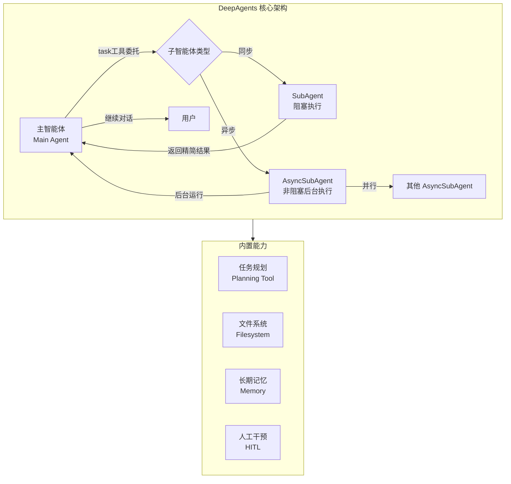
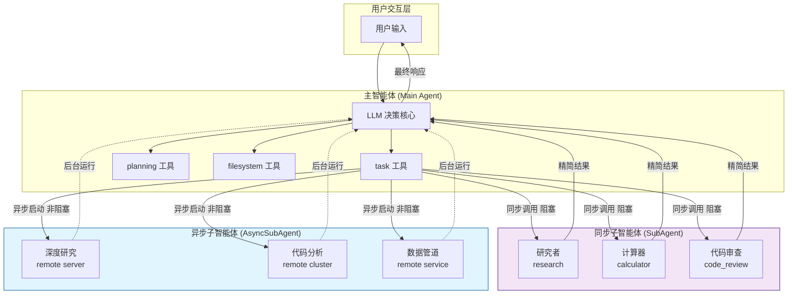

## 一、重要背景：官方推荐已转向 Subagents 模式

LangChain 官方已明确宣布，`langgraph-supervisor` 和 `langgraph-swarm` 这两个包**不再积极维护**。官方推荐使用 **Subagents 模式**：主智能体通过将专门的子智能体包装为工具（Tools）来协调它们。

这意味着当前 LangChain/LangGraph 生态中，Multi-Agent 架构的核心范式已统一为 **Subagents（子智能体）模式**——DeepAgents 框架正是这一模式的官方实现。

---

## 二、DeepAgents：新一代 Multi-Agent 框架

DeepAgents 是 LangChain 团队于 2025 年 11 月推出的框架，专门用于构建能够处理复杂、长周期任务的智能体。它建立在 LangGraph 之上，提供更高层次的委托模型——智能体可以将工作移交给子智能体。

DeepAgents 内置的核心能力包括：

- **任务规划**：内置 planning tool，支持多步骤任务分解
- **子智能体生成**：将工作委托给通用或专用子智能体，在隔离的上下文中运行
- **文件系统**：用于上下文管理的虚拟文件系统
- **长期记忆**：支持记忆、技能和提示词根据使用情况持续改进



---

## 三、子智能体的两种类型：同步 vs 异步

DeepAgents 提供两种子智能体模式，可根据任务特点灵活选择。

### 3.1 同步子智能体（Sync Subagent）

**核心机制**：主智能体调用子智能体后，**阻塞等待**子智能体完成，然后继续执行。

**适用场景**：短时、聚焦的任务，如代码审查、单步数据查询。

**关键特征**：
- 主智能体阻塞等待，执行循环暂停
- 子智能体返回**精简的最终结果**，而非中间过程
- **上下文隔离**：子智能体的工具调用不会污染主智能体的上下文窗口

```python
from deepagents import create_deep_agent
from langchain.agents import create_agent
from langchain_openai import ChatOpenAI

model = ChatOpenAI(model="gpt-4o")

# 定义同步子智能体（字典形式）
subagents = [
    {
        "name": "researcher",
        "description": "深度研究专家，负责调研复杂主题",
        "system_prompt": "你是研究专家，负责深入调研并返回简洁的总结。",
        "model": "openai:gpt-4o",
        "tools": [web_search_tool, read_file_tool],
    },
    {
        "name": "calculator",
        "description": "数学计算专家，负责复杂计算",
        "system_prompt": "你是数学专家，负责精确计算。",
        "model": "openai:gpt-4o",
        "tools": [calculate_tool],
    }
]

# 创建 Deep Agent，子智能体作为 task 工具自动注入
agent = create_deep_agent(
    model="openai:gpt-4o",
    system_prompt="你是协调者，将任务委托给合适的专家。",
    subagents=subagents,  # 同步子智能体列表
)

# 主智能体会自动获得 task 工具，可调用 researcher 和 calculator
result = agent.invoke({
    "messages": [{
        "role": "user",
        "content": "调研量子计算的现状，并计算 2^100 的值"
    }]
})
```

### 3.2 异步子智能体（Async Subagent）

**核心机制**：主智能体将任务委托给远程 Agent 后**立即返回任务 ID**，子智能体在后台独立执行，主智能体可继续与用户对话或启动其他任务。

**关键特征**：
- **非阻塞**：主智能体可继续响应用户
- **有状态**：子智能体跨交互维护自己的线程，主智能体可发送后续指令或中途纠正
- **异构部署**：轻量级协调者可委托给运行在不同硬件、使用不同模型、维护各自工具集的远程智能体
- **并行执行**：可同时启动多个异步子智能体

**DeepAgents v1.9.0** 正式引入异步子智能体支持。

```python
from deepagents import AsyncSubAgent, create_deep_agent

# 定义异步子智能体 - 指向远程 Agent Protocol 服务器
async_subagents = [
    AsyncSubAgent(
        name="deep_researcher",
        description="执行深度研究，运行在专用 GPU 服务器上",
        url="https://my-research-server.dev",  # 远程 Agent 服务地址
        graph_id="research_agent",              # LangGraph 部署的图 ID
    ),
    AsyncSubAgent(
        name="code_analyzer",
        description="大规模代码分析，运行在独立集群",
        url="https://code-analysis-cluster.dev",
        graph_id="code_agent",
    ),
]

agent = create_deep_agent(
    model="openai:gpt-4o",
    subagents=async_subagents,  # 可与同步子智能体混合使用
)

# 主智能体获得五个管理后台任务的工具:
# - launch_task: 启动异步任务
# - get_task_status: 查询任务状态
# - get_task_result: 获取任务结果
# - cancel_task: 取消任务
# - list_tasks: 列出所有任务
```

**远程 Agent 协议**：任何实现了 [Agent Protocol](https://github.com/langchain-ai/agent-protocol) 的远程 Agent 都是 AsyncSubAgent 的有效目标，包括 LangSmith 部署的 Agent、自定义 FastAPI 服务等。

### 3.3 同步 vs 异步：选型对比

| 维度 | 同步子智能体 | 异步子智能体 |
|------|------------|------------|
| **执行模式** | 阻塞主智能体 | 非阻塞，后台运行 |
| **状态管理** | 无状态，单次返回 | 有状态，可跨交互维持线程 |
| **部署方式** | 与主智能体同进程 | 远程服务器（Agent Protocol） |
| **并行能力** | 串行执行 | 可并行启动多个 |
| **适用任务** | 秒级任务（代码审查、单步查询） | 分钟级任务（深度研究、大规模代码分析） |
| **用户交互** | 等待期间无法响应 | 可继续对话 |

---

## 四、从 Supervisor/Swarm 迁移

### 4.1 Supervisor 迁移

`langgraph-supervisor` 的 `create_supervisor` 已被弃用。迁移到 Subagents 模式的核心变化：

| 旧方式（Supervisor） | 新方式（Subagents） |
|---------------------|-------------------|
| Worker agents 作为图节点 | 子智能体包装为 `@tool` 函数 |
| Supervisor 通过 handoff tools 路由 | 主 Agent 通过 `task` 工具调用子智能体 |
| `create_supervisor([agents])` | `create_agent()` + `subagents` 参数 |

```python
# ❌ 旧方式 - langgraph-supervisor（已弃用）
from langgraph_supervisor import create_supervisor

supervisor = create_supervisor(
    [research_agent, math_agent],
    model=model,
    prompt="将任务分配给合适的专家。"
)

# ✅ 新方式 - Subagents 模式
from langchain.agents import create_agent
from deepagents import create_deep_agent

# 方式1：使用 create_agent + SubAgentMiddleware
agent = create_agent(
    model="openai:gpt-4o",
    middleware=[
        SubAgentMiddleware(
            backend=my_backend,
            subagents=[
                {
                    "name": "researcher",
                    "description": "研究专家",
                    "system_prompt": "你是研究专家。",
                    "model": "openai:gpt-4o",
                    "tools": [web_search],
                }
            ],
        )
    ],
)

# 方式2：使用 create_deep_agent（推荐，更简洁）
agent = create_deep_agent(
    model="openai:gpt-4o",
    subagents=[
        {
            "name": "researcher",
            "description": "研究专家",
            "system_prompt": "你是研究专家。",
            "model": "openai:gpt-4o",
            "tools": [web_search],
        }
    ],
)
```

### 4.2 Swarm 迁移

OpenAI 已于 2025 年 3 月归档 Swarm 仓库。LangChain 生态中，`langgraph-swarm` 同样不再积极维护。Swarm 的"智能体间动态移交"模式在 DeepAgents 中可通过以下方式实现：

1. **同步子智能体**：主智能体通过 `task` 工具调用子智能体，子智能体返回结果后主智能体决定下一步
2. **异步子智能体**：支持"发射后不管"模式，主智能体可后续查询结果或发送纠正指令

---

## 五、DeepAgents 子智能体架构全景



---

## 六、工程实践建议

### 6.1 何时使用同步 vs 异步子智能体

| 场景 | 推荐 | 理由 |
|------|------|------|
| 代码审查（< 5 秒） | **同步** | 延迟可接受，实现简单 |
| 单步数据查询 | **同步** | 快速返回，无需复杂状态管理 |
| 深度研究（数分钟） | **异步** | 不阻塞用户交互 |
| 大规模代码分析 | **异步** | 可并行执行，支持中途纠正 |
| 多数据源并行采集 | **异步** | 同时启动多个子智能体 |
| 异构部署需求 | **异步** | 不同硬件/模型独立运行 |

### 6.2 关键设计原则

1. **上下文隔离**：子智能体的核心价值是隔离中间工具调用，主智能体只接收精简结果

2. **默认子智能体**：DeepAgents 自动添加一个名为 `general-purpose` 的同步子智能体，默认带有文件系统工具。如不需要，可通过 `GeneralPurposeSubagentProfile(enabled=False)` 禁用。

3. **混合使用**：同步和异步子智能体可在同一个 `subagents` 参数中混合配置，`create_deep_agent` 会根据类型自动路由到对应的中间件。

4. **从 LangGraph 图开始**：DeepAgents 基于 LangGraph 构建。对于完全自定义的复杂流程，可先用 `StateGraph` 构建基础图，再将整个 Agent 作为节点嵌入更大的工作流。

---

## 七、总结

1. **Supervisor 和 Swarm 已不再维护**，官方推荐使用 **Subagents 模式**。

2. **DeepAgents 是当前 Multi-Agent 架构的官方框架**，提供任务规划、文件系统、子智能体生成和长期记忆等内置能力。

3. **两种子智能体**：
   - **同步（Sync Subagent）**：阻塞执行，适合短时任务，上下文隔离
   - **异步（Async Subagent）**：非阻塞后台执行，适合长时任务，支持并行和状态管理

4. **AsyncSubAgent 的核心突破**：主智能体可"发射后不管"，继续与用户对话，支持多任务并行和异构部署——这是 DeepAgents 相比旧 Supervisor/Swarm 模式的根本性进步。