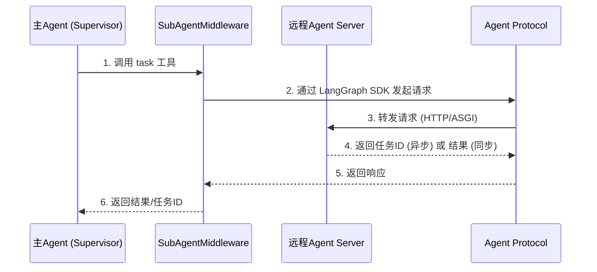

和05一样，注意问题的时效性 以下是旧版简答 新版重点答deepagent


在 LangChain 与 LangGraph 的多 Agent 方案中，Agent 间的对接与通信管理主要围绕任务交接 (Handoffs)，核心目标是实现 Agent 间的有序协作与状态一致性。我在项目中是，采用 Python 的闭包，动态的为每个 agent 之间的交接都创建一个 handoff 工具函数，该工具函数中封装了目标 agent 名字，和要传递给该智能体的信息。当需要进行 Agent 的交接时，通过提示词和 LLM 来动态决策调用某个 handoff 工具，最终完成交接过程。

**第一：通信方式。**  
在 handoff 的工具函数中，通过 Command 对象实现多 Agent 之间的数据通信。Command 对象包含以下关键信息：目标 Agent (goto)：指定要切换到的 Agent；状态更新 (update)：传递需要更新的状态信息（如任务进度、中间结果），通过 update 参数传递状态信息，确保下一个 Agent 能获取足够的上下文；当然，每个子 Agent 处理完之后也是通过调用 handoff 工具来，并通过 Command 将结果返回给 Supervisor，Supervisor 更新状态。

**第二：多 agent 之间，还有一个非常麻烦的状态管理：集中式与分层式两种。**  
我的项目由于采用了 supervisor 架构，所有的 Agent 共享同一个状态对象：SupervisorState。它继承了 MessagesState，同时还定义了很多和业务有关的状态数据。但是，我还知道，可以采用分层式状态管理，通过自定义状态模型，给每个 Agent 都定义一个单独的 state_schema，来实现不同 worker agent 的状态隔离。

**第三：多 agent 的路由逻辑。**  
Supervisor 的多 Agent 架构是通过主管 Agent 中的 LLM 来做意图识别和决策的，也采用 ReAct 范式。迭代的执行：思考，行动 观察各个步骤来实现路由交接。


---


下面重点介绍
DeepAgents 中 Agent 之间的通信管理，核心是基于 **Agent Protocol** 的标准化通信机制，并区分**同步**与**异步**两种模式。

### DeepAgents两种通信模式对比

| 维度 | 同步子智能体 (Inline Subagent) | 异步子智能体 (Async Subagent) |
| :--- | :--- | :--- |
| **执行模型** | **阻塞**：主Agent通过`task`工具调用后，必须等待子Agent完成全部工作才能继续。 | **非阻塞**：主Agent调用后立即返回任务ID，可继续与用户交互或启动其他任务。 |
| **并发能力** | 可并行，但会阻塞主Agent的执行循环。 | 真正的并行且非阻塞，支持同时运行多个任务。 |
| **通信协议** | **进程内通信**，通过LangGraph的状态图（StateGraph）传递数据。 | **Agent Protocol**，通过HTTP/ASGI与远程服务器通信。 |
| **状态管理** | **无状态**：每次调用独立，不维持跨交互的状态。 | **有状态**：维护自己的线程（thread），支持中途发送跟进指令或纠正。 |
| **适用场景** | 短时、聚焦的任务（如代码审查、单步查询）。 | 长时运行的任务（如深度研究、大规模代码分析），或需要并行处理的任务。 |

---

### 核心通信机制：Agent Protocol

Agent Protocol 是 LangChain 定义的**标准化通信协议**，是所有 Agent 间通信的基石。



任何实现了 Agent Protocol 的服务器都可以成为 DeepAgents 的通信目标，包括 LangSmith 部署的 Agent、自定义的 FastAPI 服务等。在部署上，子Agent既可以通过 ASGI 与主Agent同进程部署，也可以通过 HTTP 跨进程、跨机器通信。

### 同步通信：基于 LangGraph 状态图

同步子智能体的通信完全在**进程内**完成，通过 LangGraph 的状态机制进行。

核心是 `SubAgentMiddleware`，它为 Agent 注入一个 `task` 工具。主Agent调用此工具时，中间件会：

1.  在内部启动一个子Agent的图（Graph）执行。
2.  主Agent的执行循环被**阻塞**，等待子图完成。
3.  子Agent完成后，将 `structured_response` 字段序列化为 JSON，作为精简结果返回给主Agent。

```python
from deepagents.middleware import SubAgentMiddleware
from langchain.agents import create_agent

agent = create_agent(
    model="openai:gpt-4o",
    middleware=[
        SubAgentMiddleware(
            backend=my_backend,  # 文件系统后端
            subagents=[
                {
                    "name": "researcher",
                    "description": "研究专家，用于信息检索和总结",
                    "system_prompt": "你是一个研究助手。",
                    "model": "openai:gpt-4o",
                    "tools": [search_tool],
                }
            ],
        )
    ],
)
```

### 异步通信：基于 Agent Protocol 的远程调用

异步子智能体通过 `AsyncSubAgentMiddleware` 实现非阻塞通信。

```python
from deepagents import AsyncSubAgent, create_deep_agent

agent = create_deep_agent(
    model="openai:gpt-4o",
    subagents=[
        AsyncSubAgent(
            name="deep_researcher",
            description="执行深度研究，运行在远程服务器",
            graph_id="research_agent",  # 远程Agent的图ID
            url="https://my-research-server.dev",  # 远程Agent Protocol服务器地址
        ),
        # 可混合使用同步与异步子智能体
    ],
)
```

异步通信提供了五个管理工具：

- **`launch_task`**：启动异步任务
- **`get_task_status`**：查询任务状态
- **`get_task_result`**：获取任务结果
- **`cancel_task`**：取消任务
- **`list_tasks`**：列出所有任务

其通信流程是“发射后管理”（fire-and-steer）：主Agent启动任务后即可继续工作，并通过上述工具在任务执行中查询进度、发送跟进指令或取消任务。

### 扩展：A2A (Agent-to-Agent) 协议

除了 DeepAgents 内置的机制，Google 开源的 **A2A 协议** 也是多智能体通信的重要方式。它提供了一种**智能体间的通用通信总线**，允许不同框架（如 LangGraph、CrewAI）构建的智能体相互通信。LangChain 的 Agent Server 也已支持 A2A 端点。

---

### 通信架构总览

![[deepseek_mermaid_20260718_162b33.svg]]

### 总结

DeepAgents 的 Agent 间通信分为两个层面：

1.  **同步通信**：基于 LangGraph 状态图的**进程内通信**，通过 `SubAgentMiddleware` 实现，主Agent阻塞等待结果。
2.  **异步通信**：基于 **Agent Protocol** 的**标准化远程通信**，通过 `AsyncSubAgentMiddleware` 实现，主Agent非阻塞地管理后台任务，支持跨进程、跨机器部署。

这两种模式可以混合使用，为构建复杂、高效的多智能体系统提供了灵活的通信基础。