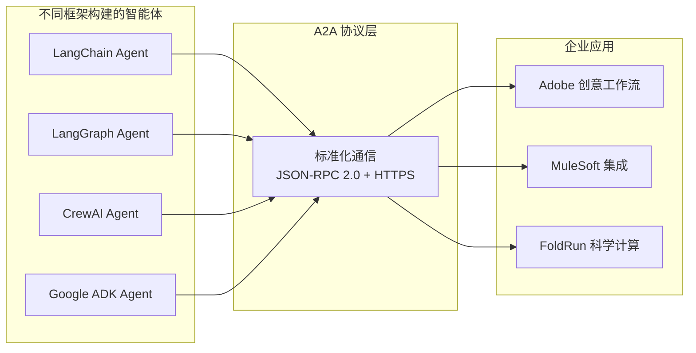
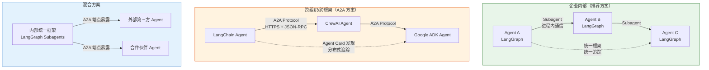

关键点：如果是企业内部，统一langchain体系来开发agent，是不存在A2A的，不需要过度设计，引入不必要的系统复杂度

## 一、A2A 协议：智能体的"通用语言"

Agent-to-Agent (A2A) 协议是由 Google 发起、现已捐赠给 Linux 基金会管理的**开放标准**。它的核心目标是让**不同框架、不同团队、甚至不同组织**构建的 AI 智能体能够相互发现、通信和协作。

| 维度 | 说明 |
|------|------|
| **协议 vs 框架** | 框架（如 LangChain）定义"如何构建智能体"，协议（如 A2A）定义"智能体如何相互通信" |
| **与 MCP 的关系** | MCP 标准化"智能体→工具"的通信，A2A 标准化"智能体↔智能体"的协作 |
| **传输层** | 基于 HTTPS + JSON-RPC 2.0 |
| **核心机制** | Agent Card（能力发现）→ 任务委托 → 消息交换 → 结果返回 |

---

## 二、LangChain Agent Server 对 A2A 的支持

LangSmith Agent Server 原生实现了 A2A 协议支持。任何部署到 Agent Server 的智能体都会**自动**通过 A2A 端点对外暴露。

### 2.1 端点与支持的方法

```
┌─────────────────────────────────────────────────────────────┐
│                    Agent Server                             │
│                                                             │
│  ┌─────────────────────────────────────────────────────┐    │
│  │  A2A 端点: /a2a/{assistant_id}                     │    │
│  │                                                     │    │
│  │  支持的方法:                                        │    │
│  │  • message/send  → 发送消息，等待完整响应  │    │
│  │  • message/stream → 发送消息，SSE 流式响应 │    │
│  │  • tasks/get     → 查询长时任务状态   │    │
│  └─────────────────────────────────────────────────────┘    │
│                                                             │
│  ┌─────────────────────────────────────────────────────┐    │
│  │  Agent Card 发现端点:                               │    │
│  │  /.well-known/agent-card.json?assistant_id={id}    │    │
│  │  返回: 名称、描述、技能、I/O模式、通信URL│    │
│  └─────────────────────────────────────────────────────┘    │
└─────────────────────────────────────────────────────────────┘
```

### 2.2 身份标识映射

A2A 协议使用两个标识符维护对话连续性：
- **`contextId`** → 映射到 LangGraph 的 `thread_id`（会话级）
- **`taskId`** → 映射到 LangGraph 的每次请求（请求级）

LangSmith 会自动将 `contextId` 转换为 `thread_id`，实现分布式追踪。

### 2.3 代码示例：创建 A2A 兼容的 Agent

```python
from __future__ import annotations
import os
from dataclasses import dataclass
from typing import Any, Dict, List, TypedDict
from langgraph.graph import StateGraph
from langgraph.runtime import Runtime
from openai import AsyncOpenAI

class Context(TypedDict):
    """Agent 的上下文参数"""
    my_configurable_param: str

@dataclass
class State:
    """A2A 对话消息的输入状态"""
    messages: List[Dict[str, Any]]  # 必须包含 messages 字段

async def call_model(state: State, runtime: Runtime[Context]) -> Dict[str, Any]:
    """处理对话消息并返回 OpenAI 响应"""
    client = AsyncOpenAI(api_key=os.getenv("OPENAI_API_KEY"))
    
    # 获取最后一条用户消息
    last_msg = state.messages[-1]["content"] if state.messages else ""
    
    # 调用 LLM
    response = await client.chat.completions.create(
        model="gpt-4o",
        messages=[{"role": "user", "content": last_msg}]
    )
    
    # 返回符合 A2A 格式的响应
    return {
        "messages": state.messages + [{
            "role": "assistant",
            "content": response.choices[0].message.content
        }]
    }

# 构建图
builder = StateGraph(State)
builder.add_node("call_model", call_model)
builder.set_entry_point("call_model")
builder.set_finish_point("call_model")

# 编译后部署到 Agent Server，自动暴露 A2A 端点
app = builder.compile()
```

### 2.4 调用示例：JSON-RPC 请求

```bash
curl --request POST \
  --url https://api.example.com/a2a/{assistant_id} \
  --header 'Content-Type: application/json' \
  --data '{
    "jsonrpc": "2.0",
    "id": "1",
    "method": "message/send",
    "params": {
      "message": {
        "role": "user",
        "parts": [
          { "kind": "text", "text": "Hello from A2A" },
          { "kind": "data", "data": { "locale": "en-US" } }
        ],
        "messageId": "msg-1",
        "contextId": "f5bd2a40-74b6-4f7a-b649-ea3f09890003"
      }
    }
  }'
```

响应（任务完成）：
```json
{
  "jsonrpc": "2.0",
  "id": "1",
  "result": {
    "kind": "task",
    "id": "run-uuid",
    "contextId": "f5bd2a40-74b6-4f7a-b649-ea3f09890003",
    "status": { "state": "completed" },
    "artifacts": [{
      "artifactId": "artifact-uuid",
      "name": "Assistant Response",
      "parts": [{ "kind": "text", "text": "Hello back" }]
    }]
  }
}
```

---

## 三、A2A 的核心价值（为什么需要它）

### 3.1 四大架构优势

| 优势 | 说明 |
|------|------|
| **安全边界（黑箱移交）** | 主Agent将任务委托给专用内部Agent，专有数据和"如何做"的逻辑保持封装，请求方只获得高价值输出 |
| **零上下文污染** | 专门Agent处理自己的复杂依赖和内部状态，不污染主Agent的上下文窗口 |
| **动态自主性** | 接收Agent能理解意图、优化计划、对不完整请求提出澄清问题 |
| **工作负载分布** | 不同团队、供应商可以独立构建和维护各自的Agent组件 |

### 3.2 跨框架互操作性

A2A 允许不同框架构建的Agent相互协作——LangChain、CrewAI、Google ADK 等。截至 2026 年，已有 **150+ 组织**参与 A2A 生态建设，包括 Adobe、MuleSoft 等。



---

## 四、A2A 的局限与挑战（为什么企业不一定用它）

### 4.1 技术层面的缺陷

| 问题 | 详情 |
|------|------|
| **安全漏洞** | 处理支付凭证、身份文件等敏感信息时存在不足：token生命周期控制不足、缺乏强客户认证、权限范围过宽、缺少同意流程 |
| **概念模糊** | `Message` 和 `Artifact` 边界不清，导致不同实现产生不兼容的模式 |
| **架构简化** | 将Agent交互视为简单API集成问题，而非复杂的分布式系统挑战 |
| **协议不成熟** | 仍处于演进中，schema演进、多租户认证、语义互操作性等企业级问题尚未完全解决 |

### 4.2 企业落地的基础设施噩梦

有团队在生产部署中花费 **47,000 美元** 才深刻体会到 A2A/MCP 的基础设施痛点：

1. **NAT 穿透问题**：内网Agent无法直接互联
2. **无限通信循环**：Agent间可能陷入死循环
3. **状态持久化**：长时任务的状态管理复杂
4. **审计与权限**：企业级细粒度权限控制和审计能力不足
5. **安全未经验证**：MCP 和 A2A 的安全模型尚不成熟

---

## 五、企业内部真实选择：A2A 还是统一框架？

### 5.1 核心决策逻辑

```
┌─────────────────────────────────────────────────────────────────┐
│                    企业 Multi-Agent 架构决策                    │
├─────────────────────────────────────────────────────────────────┤
│                                                                 │
│  问题1: 多个Agent是否由不同团队/不同框架构建？                   │
│          │                                                     │
│          ├── 是 → 问题2: 是否需要跨组织/跨供应商协作？          │
│          │         │                                          │
│          │         ├── 是 → 【A2A】                            │
│          │         └── 否 → 【同一框架 + 内部契约】            │
│          │                                                     │
│          └── 否 → 【同一框架（LangGraph Subagents）】           │
│                                                                 │
│  问题3: 是否需要暴露Agent给外部第三方调用？                     │
│          │                                                     │
│          ├── 是 → 【A2A】                                      │
│          └── 否 → 【内部框架】                                 │
└─────────────────────────────────────────────────────────────────┘
```

### 5.2 两种路径的对比

| 维度 | **统一框架（LangGraph Subagents）** | **A2A 协议** |
|------|-----------------------------------|--------------|
| **通信方式** | 进程内/图内状态传递 | HTTP + JSON-RPC（网络开销） |
| **性能** | 低延迟，无序列化开销 | 高延迟，需序列化/反序列化 |
| **调试** | 统一追踪，端到端可见 | 分布式追踪，跨服务协调复杂 |
| **安全** | 进程内隔离，可控 | 依赖 OAuth2/OIDC，尚不成熟 |
| **开发效率** | 高（同一框架、同一代码库） | 低（需处理协议兼容性） |
| **互操作性** | 仅限同一框架 | 跨框架、跨组织 |
| **成熟度** | 生产就绪（DeepAgents 官方推荐） | 演进中（v1.0 刚发布） |

### 5.3 实际企业实践

**大多数企业内部项目**选择**统一框架 + 内部通信契约**，而非 A2A：

1. **同一套 LangGraph/DeepAgents**：所有Agent使用相同的框架构建，通过 Subagent 模式实现通信，无需引入额外的网络协议层

2. **内部 API 契约**：即使不同团队分别构建Agent，也倾向于定义内部 REST/gRPC 接口，而非采用仍在演进中的 A2A 标准

3. **A2A 的典型使用场景**：
   - **跨组织协作**：如 FoldRun 与 Gemini Enterprise 的集成
   - **多框架混用**：部分模块用 LangChain，部分用 CrewAI
   - **对外暴露 Agent 能力**：作为服务提供给外部客户

---

## 六、架构全景图



---

## 七、总结

| 问题 | 答案 |
|------|------|
| **LangChain Agent Server 支持 A2A 吗？** | 是。Agent Server 原生支持，部署即暴露 `/a2a/{assistant_id}` 端点 |
| **企业内部项目真的会用 A2A 吗？** | **大多数不会**。除非有跨框架或跨组织的刚性需求，否则统一框架（LangGraph Subagents）更低成本、更可控 |
| **什么时候应该用 A2A？** | 需要与外部第三方Agent协作、不同团队使用不同框架、或需要将Agent能力作为开放服务暴露时 |
| **A2A 的致命缺陷是什么？** | 安全模型不成熟、基础设施复杂、协议仍在演进——对于内部项目，这些成本远高于收益 |

**一句话总结**：A2A 是智能体领域的"HTTP"——它解决的是**跨平台互操作性**问题，而非**内部系统集成**问题。企业内部如果不存在"异构框架"或"跨组织协作"的刚性需求，A2A 带来的复杂度远大于价值。LangGraph Subagents 仍然是企业内部 Multi-Agent 架构的最优解。