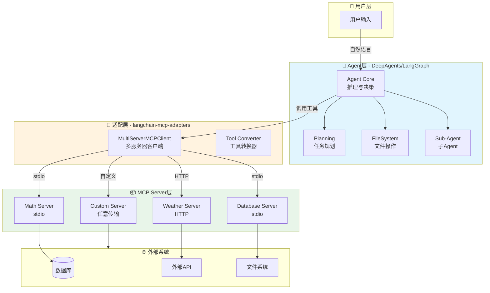
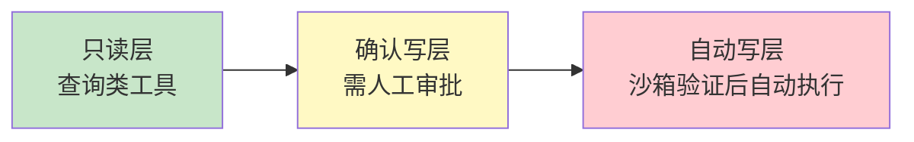

简答(没有deepagent，看下面的详解部分deepagent)

由于，我在项目开发过程中都是采用 LangChain 与 LangGraph，所以我是通过 langchain-mcp-adapters 库，将 MCP 兼容的外部工具转换为 Agent 可直接调用的 LangChain Tool。我认为：MCP 的本质是 Agent 与外部工具之间的标准化通信协议，其核心目标是解耦 Agent 与工具：对工具提供者：只需按照 MCP 规范封装工具（定义工具名称、描述、输入/输出格式），即可被任何支持 MCP 的 Agent 调用；对 Agent 开发者：无需关心工具的内部实现，只需通过 MCP 接口即可发现、调用工具，大幅降低适配成本。这种“标准化”让 Agent 的工具调用从“一对一适配”转变为“一对多兼容”，为多 Agent 系统的工具复用与扩展奠定了基础。

我在项目开发过程中，MCP 和 Agent 的结合有三步：首先：工具提供者封装 MCP 工具并对外发布服务，我用 FastMCP 框架开发过 MCP 的服务端。我也用过互联网对外提供的 MCP 服务，比如高德地图的 MCP 服务和搜狗的网络搜索 MCP 服务。步骤 2：初始化 MCP 适配器的客户端 MultiServerMCPClient，需要配置各个 MCP 服务的 URL 和 transport。步骤 3：调用 MultiServerMCPClient.get_tools 函数，得到我想要的工具列表，并传给 Agent 做下一步开发。

MCP 与 Agent 的结合，本质上是将 Agent 的“认知大脑”（LLM）与“行动手脚”（工具）通过标准化协议连接起来。


## 一、技术演进：从"手写工具"到"标准化协议"

在MCP（Model Context Protocol）出现之前，Agent接入外部工具的方式是**定制化集成**——每接入一个数据库、API或文件系统，都需要为Agent手写一套工具封装代码。这种方式产生了著名的 **"M×N问题"** ：10个AI应用连接100个工具需要1000套集成代码。

MCP于2026年6月发布1.0正式版，由Anthropic联合微软、OpenAI等厂商共同推动，被业界称为 **"AI时代的USB-C接口"** 。它的核心价值在于：**将工具提供方（MCP Server）与工具消费方（Agent）彻底解耦**，Agent通过标准协议动态发现和调用工具，无需预先编写任何定制代码。

2026年的技术栈演进呈现出三大特征：
- **模块化架构**：LangChain提供基础框架与工具抽象，LangGraph实现流程编排，MCP解决工具接入的标准化问题
- **工程化突破**：通过标准化接口协议，开发者可自由组合不同来源的LLM服务和工具
- **效率跃升**：行业基准测试显示，采用新架构的Agent开发周期缩短60%，维护成本降低45%

## 二、MCP与Agent的核心集成方式

MCP与Agent的结合主要有**三个集成层次**：

### 2.1 基础层：LangChain + MCP Adapters

`langchain-mcp-adapters` 是官方提供的适配器库，将MCP Server暴露的工具转换为LangChain可识别的Tool对象：

```python
from langchain_mcp_adapters.client import MultiServerMCPClient
from langchain.agents import create_agent

async def main():
    client = MultiServerMCPClient({
        "math": {
            "transport": "stdio",
            "command": "python",
            "args": ["/path/to/math_server.py"],
        },
        "weather": {
            "transport": "http",
            "url": "http://localhost:8000/mcp",
        }
    })
    tools = await client.get_tools()
    agent = create_agent("claude-sonnet-4-6", tools)
    response = await agent.ainvoke({
        "messages": [{"role": "user", "content": "what's (3 + 5) x 12?"}]
    })
```

### 2.2 编排层：LangGraph + MCP

LangGraph通过StateGraph构建有向图，将MCP工具作为节点嵌入到Agent的推理-行动循环（ReAct Loop）中。MCP提供"手"（工具），LangGraph提供"大脑"（推理循环）。

### 2.3 高级层：DeepAgents + MCP（2026年主流范式）

**DeepAgents是LangChain在2026年推出的高级Agent框架**，在LangGraph基础上内置了规划（Planning）、文件系统（Filesystem）和子Agent（Sub-agent）能力。DeepAgents与MCP的集成最为深度——它不仅支持加载MCP工具，还能通过`.mcp.json`配置文件**零代码接入**任意MCP Server。

| 集成方式 | 适用场景 | 特点 |
|---|---|---|
| LangChain + MCP | 简单Agent、快速原型 | 轻量、直接 |
| LangGraph + MCP | 需要流程控制的复杂Agent | 可视化编排、状态管理 |
| DeepAgents + MCP | 生产级复杂任务 | 内置规划、文件系统、子Agent |

## 三、核心实战：基于DeepAgents + MCP的完整实现

### 3.1 环境准备

```bash
pip install langchain-mcp-adapters langgraph deepagents fastmcp
```

### 3.2 创建MCP Server（工具提供方）

```python
# math_server.py
from fastmcp import FastMCP

mcp = FastMCP("Math")

@mcp.tool()
def add(a: int, b: int) -> int:
    """Add two numbers"""
    return a + b

@mcp.tool()
def multiply(a: int, b: int) -> int:
    """Multiply two numbers"""
    return a * b

@mcp.tool()
def divide(a: int, b: int) -> float:
    """Divide two numbers"""
    return a / b

if __name__ == "__main__":
    mcp.run(transport="stdio")
```

### 3.3 DeepAgents + MCP 集成（推荐方式）

DeepAgents支持通过`.mcp.json`配置文件自动发现和加载MCP工具：

```json
// .mcp.json (项目根目录)
{
  "mcpServers": {
    "math": {
      "type": "stdio",
      "command": "python",
      "args": ["/path/to/math_server.py"]
    },
    "docs-langchain": {
      "type": "http",
      "url": "https://docs.langchain.com/mcp"
    }
  }
}
```

启动DeepAgents时自动加载MCP工具：

```bash
dcode run
# 输出: ✓ Loaded 3 MCP tools from math server
```

在代码中显式使用MCP工具：

```python
from deepagents import create_deep_agent
from langchain_mcp_adapters.client import MultiServerMCPClient
import asyncio

async def main():
    # 连接MCP Server并加载工具
    client = MultiServerMCPClient({
        "math": {
            "transport": "stdio",
            "command": "python",
            "args": ["/path/to/math_server.py"],
        }
    })
    tools = await client.get_tools()
    
    # 创建DeepAgent —— 内置planning、filesystem、sub-agent能力
    agent = create_deep_agent(
        model="openai:gpt-5.5",  # 支持多种模型
        tools=tools,              # MCP工具 + 自定义工具
        # DeepAgents内置工具自动包含：文件系统、TODO规划、子Agent等
    )
    
    # 执行任务
    response = await agent.ainvoke({
        "messages": [{
            "role": "user",
            "content": "计算 (3 + 5) x 12，然后把结果保存到文件 result.txt"
        }]
    })
    print(response)

if __name__ == "__main__":
    asyncio.run(main())
```

### 3.4 LangGraph + MCP 实现（更细粒度的控制）

```python
from langgraph.graph import StateGraph, END
from langchain_mcp_adapters.client import MultiServerMCPClient
from langchain.agents import create_agent

async def build_graph():
    # 1. 加载MCP工具
    client = MultiServerMCPClient({
        "math": {
            "transport": "stdio",
            "command": "python",
            "args": ["/path/to/math_server.py"],
        }
    })
    tools = await client.get_tools()
    
    # 2. 创建Agent
    agent = create_agent("openai:gpt-4.1", tools)
    
    # 3. 构建LangGraph工作流
    workflow = StateGraph(dict)
    
    async def agent_node(state):
        result = await agent.ainvoke({"messages": state["messages"]})
        return {"messages": result["messages"]}
    
    workflow.add_node("agent", agent_node)
    workflow.set_entry_point("agent")
    workflow.add_edge("agent", END)
    
    graph = workflow.compile()
    return graph
```

## 四、系统架构图



## 五、工程实践与最佳实践（2026年）

### 5.1 工具分层接入策略

根据2026年的工程实践，应对MCP工具实施**三级防护体系**：



- **只读层**：优先接入查询类工具（数据库查询、日志检索），使用缓存降低调用频率
- **确认写层**：对创建订单、修改配置等操作增加人工确认环节
- **自动写层**：仅在沙箱环境测试通过后开放自动执行权限

某云厂商实践显示，该策略使生产环境事故率下降82%。

### 5.2 业务语义封装

将底层API参数转化为模型可理解的业务语义，可使工具调用准确率提升37%：

```python
# ❌ 不推荐：暴露原始API
@mcp.tool()
def get_usage(start_timestamp: int, end_timestamp: int) -> dict:
    pass

# ✅ 推荐：业务语义封装
@mcp.tool()
def query_api_usage_last_7_days() -> dict:
    """
    查询最近7天的API调用量统计
    返回: 包含每日调用量、总量、阈值告警的结构化数据
    """
    return {
        "task_type": "query_usage",
        "data": {
            "time_range": "2026-07-11 to 2026-07-18",
            "total_calls": 1250,
            "daily_breakdown": [...],
            "threshold_alert": False
        }
    }
```

### 5.3 DeepAgents配置自动发现

DeepAgents会按优先级自动发现`.mcp.json`配置文件：

| 优先级 | 位置 | 作用域 |
|---|---|---|
| 最低 | `~/.deepagents/.mcp.json` | 用户级，所有项目生效 |
| 中 | `<project>/.deepagents/.mcp.json` | 项目级，存放于.deepagents子目录 |
| 最高 | `<project>/.mcp.json` | 项目级，与Claude Code兼容 |

如果已有Claude Code的`.mcp.json`配置，DeepAgents会自动识别，无需额外设置。

### 5.4 状态管理

`MultiServerMCPClient`默认是**无状态**的——每次工具调用创建新的MCP会话，执行后清理。对于需要保持状态的场景（如数据库事务），需要显式管理会话：

```python
from mcp import ClientSession, StdioServerParameters
from mcp.client.stdio import stdio_client
from langchain_mcp_adapters.tools import load_mcp_tools

async def stateful_session():
    server_params = StdioServerParameters(
        command="python",
        args=["/path/to/math_server.py"],
    )
    async with stdio_client(server_params) as (read, write):
        async with ClientSession(read, write) as session:
            await session.initialize()
            tools = await load_mcp_tools(session)
            # 同一session中多次调用共享上下文
            agent = create_agent("openai:gpt-4.1", tools)
            # ...
```

## 六、总结

2026年，MCP与Agent的结合已从"实验性探索"演进为"生产级标配"。三者形成清晰的分工：

- **MCP**：标准化工具接入协议，解决"如何连接"的问题
- **LangChain**：工具抽象与Agent基础框架
- **LangGraph**：流程编排与状态管理
- **DeepAgents**：在LangGraph之上提供规划、文件系统和子Agent等高级能力

DeepAgents + MCP是2026年的**主流生产级方案**——通过`.mcp.json`零代码接入任意MCP Server，结合内置的规划与子Agent能力，可快速构建能处理复杂任务的自主Agent系统。