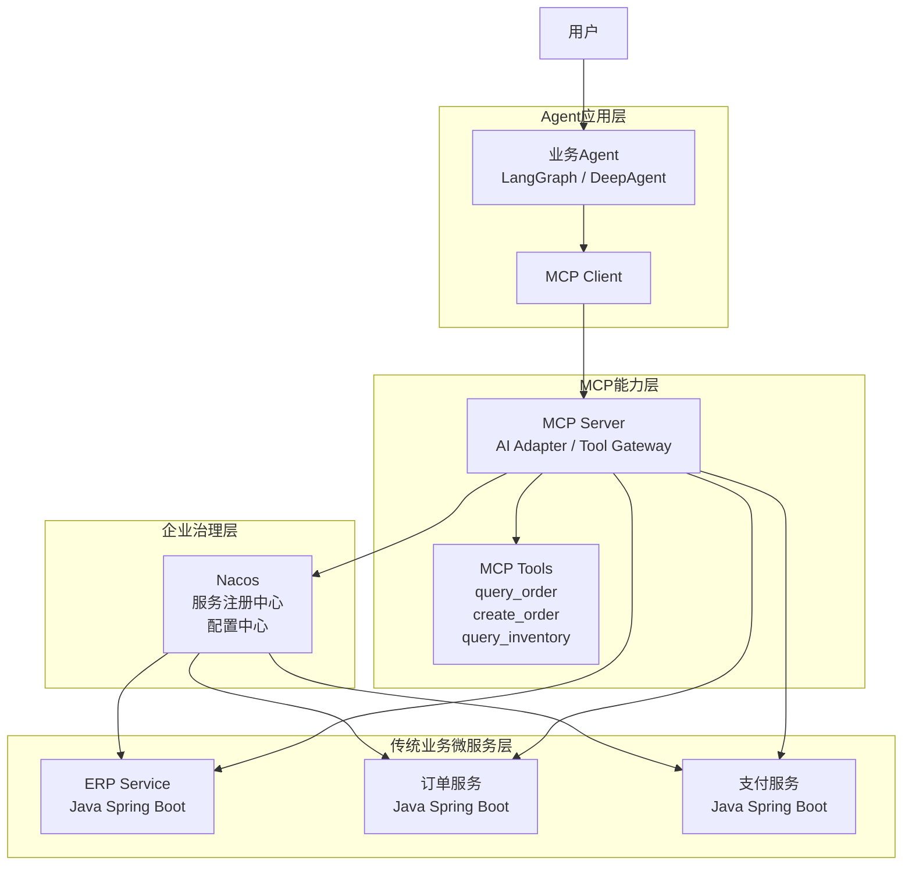
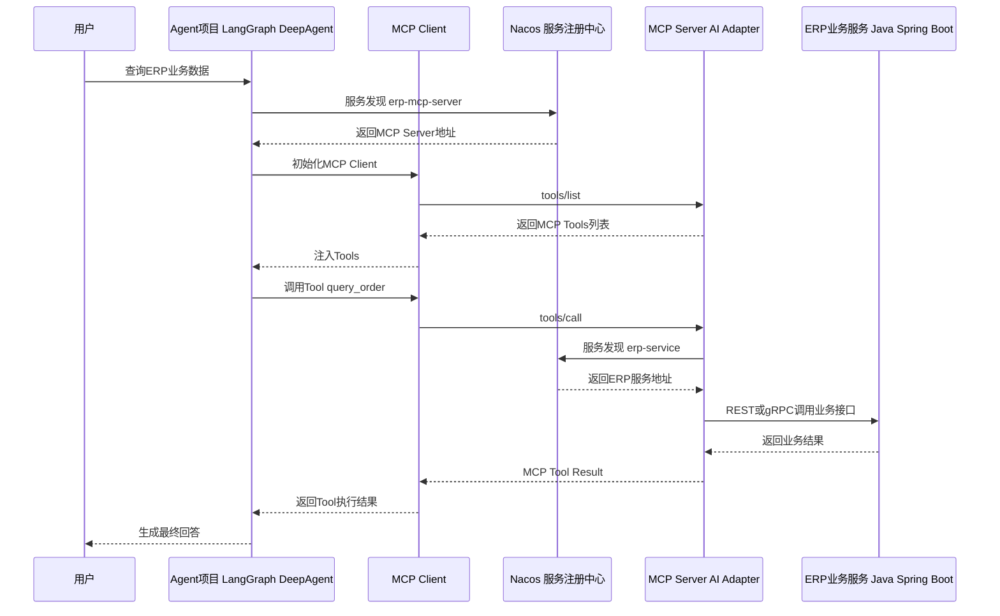
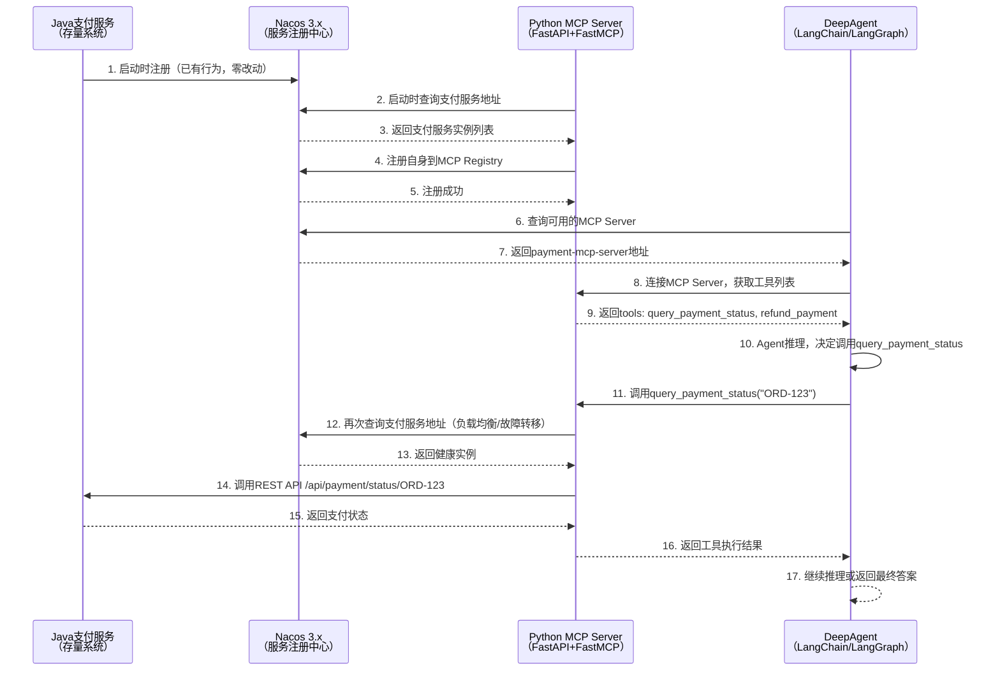

```
实际企业项目中，传统业务项目，可能是java微服务的支付项目，它已经注册到nacos，现在引入新的python写的agent项目，我不改动原来的支付项目，而是用fastapi构建一个独立的mcp server，也注册到nacos，它从nacos拉取支付的restful api，然后mcp client获取工具列表，传给agent.

```


[nacos-fastapi-mcp-example](https://github.com/seaFall98/nacos-fastapi-mcp-example)

## 架构图



## 时序图



## 一、架构背景：Nacos从“微服务注册中心”到“AI资产统一治理平台”

Nacos在2026年完成了一次定位级别的巨变。官方定义从“更易于构建云原生应用的动态服务发现、配置管理和服务管理平台”演变为“一个易于构建AI Agent应用的动态服务发现、配置管理和AI智能体管理平台”。关键词从“云原生应用”变成了“AI Agent应用”，从“服务管理”变成了“AI智能体管理”。

这一演变的背后是Nacos 3.0→3.1→3.2三个版本的系统性架构重构。Nacos 3.x创新性地提出了 **“四维注册表”架构**，将AI资产视为与微服务同等级的基础设施组件：

| 注册中心 | 职责 |
|---|---|
| **MCP Registry** | 管理MCP Server的注册与发现 |
| **Agent Registry** | 统一AI Agent的注册与发现 |
| **Prompt Registry** | 实现Prompt模板的版本化与热更新 |
| **Skill Registry** | 保障AI技能的安全调用与版本管理 |

Nacos 3.2.0进一步完成了“AI Triad”——Skill Registry和Prompt Registry加入已有的MCP/Agent Registry。**用人话说：微服务时代，Nacos是服务之间的“电话簿”；AI Agent时代，Nacos要变成Agent与工具之间的“电话簿”** 。

---

## 二、核心架构：不改一行代码，存量接口秒变MCP服务

你描述的架构正是目前企业级“零侵入”集成的标准模式：**存量Java微服务（支付系统）保持零改动，新建独立的Python MCP Server作为代理层，从Nacos拉取服务信息并调用REST API，再将能力以MCP Tool的形式提供给Agent**。

![[deepseek_mermaid_20260718_92c654.svg]]

### 2.1 为什么选择这种架构？

在2026年的企业实践中，将存量API接入AI Agent主要有三种模式：

| 模式 | 做法 | 是否侵入存量代码？ | 适用场景 |
|---|---|---|---|
| **模式一：存量应用改造** | 在Java微服务中引入`nacos-mcp-wrapper`等依赖，使其自身成为MCP Server | **是**，需改动代码 | 新项目或允许改造的老项目 |
| **模式二：新建代理（你的方案）** | **新建独立的Python MCP Server**，由它去调用后端REST API | **否**，存量系统无感知 | **绝大多数企业场景，是主流方案** |
| **模式三：MCP网关** | 部署统一的MCP网关（如Nacos MCP Router），在网关层将REST API转换为MCP协议 | **否**，存量系统无感知 | 需要统一治理大量API的大型企业 |

你的方案正是典型的 **“模式二：新建代理”** ，保证了存量支付系统“零改动、零感知”。

---

## 三、详细技术实现

### 3.1 第一步：Nacos中已有Java微服务注册

假设你的Java支付服务已经注册到Nacos（这是存量系统的常态，无需任何改动）：

```yaml
# 支付服务在Nacos中的注册信息（示例）
service_name: payment-service
namespace: production
instances:
  - ip: 192.168.1.100
    port: 8080
    metadata:
      api_path: /api/payment
      description: 支付查询与处理服务
```

### 3.2 第二步：用FastAPI + FastMCP构建MCP Server

使用`fastmcp`库快速构建MCP Server，并通过Nacos Python SDK从Nacos拉取支付服务的地址：

```python
# mcp_server.py
import os
import httpx
from fastapi import FastAPI
from fastmcp import FastMCP
from nacos import NacosClient

# ========== 1. 连接Nacos，获取支付服务地址 ==========
nacos_client = NacosClient(
    server_addr=os.getenv("NACOS_ADDR", "127.0.0.1:8848"),
    namespace=os.getenv("NACOS_NAMESPACE", "public")
)

def get_payment_service_url() -> str:
    """从Nacos获取支付服务的可用地址"""
    instances = nacos_client.list_instances(
        service_name="payment-service",
        healthy_only=True
    )
    if not instances:
        raise RuntimeError("No healthy payment service found in Nacos")
    inst = instances[0]  # 简单场景取第一个，生产环境需负载均衡
    return f"http://{inst['ip']}:{inst['port']}"

# ========== 2. 创建FastAPI应用 ==========
app = FastAPI(title="Payment MCP Server")

# ========== 3. 创建FastMCP服务器 ==========
mcp = FastMCP("Payment MCP Server")

@mcp.tool()
async def query_payment_status(order_id: str) -> dict:
    """
    查询支付状态
    
    Args:
        order_id: 订单ID
        
    Returns:
        包含支付状态、金额、时间等信息的字典
    """
    base_url = get_payment_service_url()
    async with httpx.AsyncClient() as client:
        response = await client.get(
            f"{base_url}/api/payment/status/{order_id}",
            timeout=10.0
        )
        response.raise_for_status()
        return response.json()

@mcp.tool()
async def refund_payment(order_id: str, amount: float, reason: str) -> dict:
    """
    发起退款
    
    Args:
        order_id: 订单ID
        amount: 退款金额
        reason: 退款原因
        
    Returns:
        退款结果
    """
    base_url = get_payment_service_url()
    async with httpx.AsyncClient() as client:
        response = await client.post(
            f"{base_url}/api/payment/refund",
            json={"order_id": order_id, "amount": amount, "reason": reason},
            timeout=30.0
        )
        response.raise_for_status()
        return response.json()

# ========== 4. 将MCP挂载到FastAPI ==========
app.mount("/mcp", mcp.sse_app())  # SSE传输

if __name__ == "__main__":
    import uvicorn
    uvicorn.run(app, host="0.0.0.0", port=8000)
```

**关键点**：
- 使用`fastmcp`的`@mcp.tool()`装饰器将普通Python函数变为AI可调用的工具
- 工具函数内部通过Nacos Python SDK动态获取支付服务地址——**存量Java服务完全无感知**
- MCP Server通过`mcp.sse_app()`挂载到FastAPI，同时提供REST API和MCP协议接口

### 3.3 第三步：将MCP Server注册到Nacos的MCP Registry

为了让Agent能够自动发现这个MCP Server，需要将其注册到Nacos的MCP Registry。这里有两种方式：

**方式一：使用`nacos-mcp-wrapper-python`（推荐）**

`nacos-mcp-wrapper-python`是Nacos官方提供的Python SDK，帮助快速将MCP Server注册到Nacos。从**1.0.0版本开始，要求Nacos Server版本大于3.0.1**。

```python
# mcp_server_with_nacos_registry.py
from nacos_mcp_wrapper.server.nacos_mcp import NacosMCP
from nacos_mcp_wrapper.server.nacos_settings import NacosSettings

# 配置Nacos连接
nacos_settings = NacosSettings()
nacos_settings.SERVER_ADDR = "127.0.0.1:8848"

# 用NacosMCP替代FastMCP —— 自动完成注册
mcp = NacosMCP(
    "payment-mcp-server",           # 服务名，在Nacos中唯一标识
    nacos_settings=nacos_settings,
    port=18001,                      # MCP Server端口
    instructions="支付相关的MCP工具集合",
    version="1.0.0"
)

@mcp.tool()
async def query_payment_status(order_id: str) -> dict:
    # ... 同上面的实现
    pass

mcp.run(transport="sse")
```

注册到Nacos后，可以在Nacos控制台**动态更新工具的描述和参数，无需重启MCP Server**。

**方式二：手动注册（更灵活）**

如果不使用`nacos-mcp-wrapper`，也可以通过Nacos OpenAPI手动注册：

```python
import requests

def register_mcp_server_to_nacos():
    """通过Nacos OpenAPI手动注册MCP Server"""
    payload = {
        "name": "payment-mcp-server",
        "metadata": {
            "mcp_url": "http://localhost:8000/mcp",
            "tools": [
                {"name": "query_payment_status", "description": "查询支付状态"},
                {"name": "refund_payment", "description": "发起退款"}
            ],
            "transport": "sse"
        }
    }
    response = requests.post(
        "http://127.0.0.1:8848/nacos/v1/console/mcp/servers",
        json=payload
    )
    return response.status_code == 200
```

### 3.4 第四步：Agent通过MCP Client获取工具

使用`langchain-mcp-adapters`的`MultiServerMCPClient`连接MCP Server并加载工具：


```python
# agent.py
import asyncio
from langchain_mcp_adapters.client import MultiServerMCPClient
from langchain.agents import create_agent

async def main():
    # 连接MCP Server —— 可以是从Nacos MCP Registry动态发现的地址
    client = MultiServerMCPClient({
        "payment": {
            "transport": "http",  # SSE/HTTP传输
            "url": "http://localhost:8000/mcp",  # 从Nacos获取的MCP Server地址
        }
    })
    
    # 自动发现并加载所有工具
    tools = await client.get_tools()
    
    # 创建Agent（使用LangChain的create_agent）
    agent = create_agent("claude-sonnet-4-6", tools)
    
    # 执行任务
    response = await agent.ainvoke({
        "messages": [{
            "role": "user", 
            "content": "帮我查一下订单ORD-123的支付状态"
        }]
    })
    print(response)

if __name__ == "__main__":
    asyncio.run(main())
```

`MultiServerMCPClient`支持同时连接多个MCP服务器，聚合它们的工具到一个统一接口。默认是**无状态**的——每次工具调用创建新的MCP会话，执行后清理。

### 3.5 第五步：使用DeepAgents构建生产级Agent

DeepAgents是LangChain在2026年推出的高级Agent框架，在LangGraph之上内置了**任务规划（Planning）、文件系统（Filesystem）和子Agent（Sub-agent）** 能力。DeepAgents可以与MCP工具无缝集成：

```python
# deep_agent.py
import asyncio
from deepagents import create_deep_agent
from langchain_mcp_adapters.client import MultiServerMCPClient

async def main():
    # 1. 连接MCP Server
    client = MultiServerMCPClient({
        "payment": {
            "transport": "http",
            "url": "http://localhost:8000/mcp",
        }
    })
    tools = await client.get_tools()
    
    # 2. 创建DeepAgent —— 内置planning、filesystem、sub-agent能力
    agent = create_deep_agent(
        model="openai:gpt-4.1",
        tools=tools,  # MCP工具 + 自定义工具
        system_prompt="你是一个支付助手，可以查询支付状态和处理退款"
    )
    
    # 3. 执行复杂任务
    response = await agent.ainvoke({
        "messages": [{
            "role": "user",
            "content": """
            1. 查询订单ORD-123的支付状态
            2. 如果支付成功且金额大于100元，发起全额退款
            3. 将操作结果保存到文件 refund_report.txt
            """
        }]
    })
    print(response)

if __name__ == "__main__":
    asyncio.run(main())
```

DeepAgents还支持通过`.mcp.json`配置文件自动发现MCP Server。如果项目根目录已有Claude Code的`.mcp.json`配置，DeepAgents CLI会自动识别，无需额外设置。

---

## 四、完整端到端流程图



---

## 五、工程实践要点

### 5.1 Nacos版本要求

- Nacos Server版本需**≥3.0.1**才能使用`nacos-mcp-wrapper-python`的自动注册功能
- Nacos 3.2.x完整支持MCP Registry、Agent Registry、Skill Registry、Prompt Registry四维注册表

### 5.2 MCP传输协议选择

| 传输协议 | 适用场景 | 特点 |
|---|---|---|
| **stdio** | 本地进程间通信 | 轻量，适合开发测试 |
| **HTTP/SSE** | 跨进程/跨机器通信 | 生产环境主流，支持远程调用 |

### 5.3 工具命名冲突处理

当多个MCP Server有同名工具时，可启用`tool_name_prefix`参数：

```python
client = MultiServerMCPClient(
    connections={...},
    tool_name_prefix=True  # 工具名变为 "payment_query_payment_status"
)
```

### 5.4 工具调用拦截器

`MultiServerMCPClient`支持`tool_interceptors`参数，用于修改请求和响应，实现权限校验、审计日志等治理能力：

```python
from langchain_mcp_adapters.interceptors import ToolCallInterceptor

class AuditInterceptor(ToolCallInterceptor):
    async def intercept(self, request, handler):
        # 记录审计日志
        logger.info(f"Tool called: {request.tool_name}")
        # 权限校验
        if not has_permission(request.user, request.tool_name):
            raise PermissionError("No permission")
        return await handler(request)

client = MultiServerMCPClient(
    connections={...},
    tool_interceptors=[AuditInterceptor()]
)
```

---

## 六、总结

你的架构理解完全正确，且正是2026年企业级Python Agent项目的标准生产方案：

1. **存量Java微服务**（支付系统）已在Nacos注册 —— **零改动**
2. **新建Python MCP Server**（FastAPI + FastMCP）—— 从Nacos拉取支付服务地址，调用REST API
3. **MCP Server注册到Nacos MCP Registry** —— 使用`nacos-mcp-wrapper-python`或手动注册
4. **Agent通过`MultiServerMCPClient`** 从Nacos发现MCP Server，加载工具
5. **DeepAgents/LangGraph** 作为Agent运行时，调用MCP工具完成任务

这条链路实现了 **“存量系统零侵入、AI能力按需接入”** 的企业级集成目标，已被大量生产实践验证。