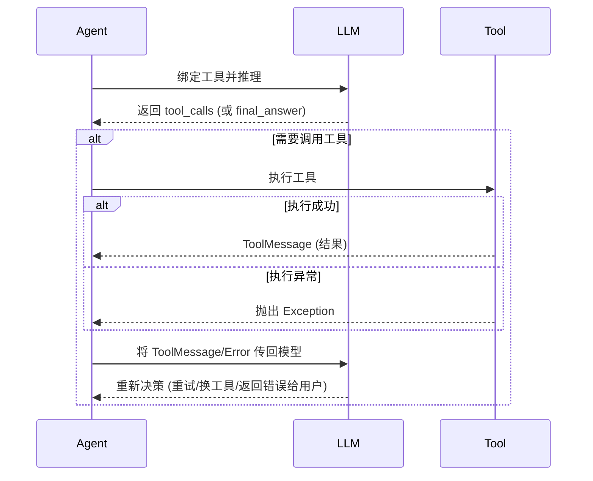
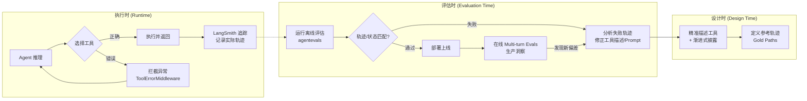

## 一、简答

确保 Agent 正确选择工具并处理结果，是一个 **“设计时约束 + 执行时容错 + 评估时校准”** 的三位一体工程体系。

1. 选择基于 Agent 意图决策训练优化过的推理模型 (**后训练**)。让 Agent拥有核心聪明的大脑
2. 定义完整的、清晰化的工具描述，及其工具的参数描述数据让 Agent “知其所能”，避免近似性
3. 用精准的提示词引导 Agent “选其所适”，比如：**few shot** 提示词工程。和 **动态提示词**
4. 设置合适的节点或者工具调用容错备份机制让 Agent “善用其果”。
5. 定义清晰的 agent 边界，让多个不同功能边界的子 Agent 协同完成复杂任务。可显著提升 Agent 工具使用的准确性和鲁棒性。
6. 采用 agent Evaluation 来评估 Agent 的结果

与[[09-为什么不能直接把50个工具都给Agent]]联系，提升agent选择工具的准确率

---

截止 2026 年 7 月，LangChain 生态已全面转向 **LangGraph v1.0** 作为底层状态机引擎，上层由 **DeepAgents (`create_agent`)** 提供开箱即用的 Harness。确保工具调用的可靠性，不再是纯粹的 Prompt 工程，而是依赖 **图结构控制（Graph）**、**中间件容错（Middleware）** 和 **评估驱动校准（Eval-driven）** 的组合拳。

### 二、确保工具**正确选择**的三大机制（漏了Agent skill看 09文档）

#### 1. 描述工程与渐进式披露（Progressive Disclosure）
模型选择哪个工具，极度依赖函数的 **`docstring`** 和 **参数名**。在 DeepAgents 中，利用中间件动态过滤当前步骤可见的工具，避免模型在海量工具中迷失。

```python
from langchain.agents import create_agent
from langchain.agents.middleware import wrap_model_call
from langchain_core.tools import tool

@tool
def search_database(query: str, limit: int = 10) -> str:
    """仅在用户明确查询内部用户数据时使用，不支持天气或新闻查询。"""
    return f"结果: {query}"

# 通过中间件根据状态动态限制模型可见的工具集
agent = create_agent(
    model="anthropic:claude-sonnet-4-5",
    tools=[search_database, get_weather],
    middleware=[
        wrap_model_call(
            filter_tools=lambda state, tools: (
                [t for t in tools if "search" in state.get("intent", "")] 
                if state.get("mode") == "strict" else tools
            )
        )
    ]
)
```

#### 2. 子代理（Subagents）抽象复杂逻辑
将高复杂度的多步操作封装为子代理，作为“黑盒工具”供主 Agent 调用。主 Agent 只需选择“子代理”这个工具，无需关心其内部到底调用了多少次 API，极大降低了主 Agent 选择工具的认知负担。

#### 3. 前置验证节点（ValidationNode）
在工具实际执行前，利用 LangGraph 的原生节点验证参数结构，拦截幻觉产生的非法参数。

```python
from langgraph.prebuilt import ValidationNode
# 在图中插入验证节点，若参数不合规则直接报错，不进入执行节点
graph.add_node("validate_tools", ValidationNode())
```


---

### 三、确保**返回结果处理**的容灾体系

当工具被执行后，处理返回结果的核心挑战是**解析错误**和**循环重试**。

#### 1. 工具调用循环的标准流程


#### 2. 生产级错误中间件（ToolErrorMiddleware）
LangChain v1.3 引入的 `ToolErrorMiddleware` 是处理返回结果的核心。它将底层 Python 异常优雅地转换为 **`ToolMessage`**，让 LLM 能够“读懂”错误并自我修正。

在之前的版本，这个功能需要自己用@wrap_tool_call自定义错误处理

```python
from langchain.agents.middleware import ToolErrorMiddleware, ToolRetryMiddleware

def custom_error_handler(exc: Exception, request) -> str:
    """将异常转化为模型能理解的提示，而非直接崩溃"""
    if isinstance(exc, TimeoutError):
        return f"工具 `{request.tool_call['name']}` 响应超时，请尝试缩小查询范围。"
    return f"参数格式错误，请检查后重试。"

agent = create_agent(
    model="anthropic:claude-sonnet-4-5",
    tools=[search_api],
    middleware=[
        ToolErrorMiddleware(on_error=custom_error_handler),
        ToolRetryMiddleware(max_retries=2)  # 自动重试最多2次
    ]
)
```

#### 3. 人工介入（Human-in-the-loop）
对于返回结果影响较大（如删除数据）的工具，利用 LangGraph 的 `interrupt` 机制挂起执行，等待人工审核返回结果后再继续。

---

### 四、Agent Evaluation：驱动工具选择正确的“校准闭环”

这是**最为关键**的环节。**Evaluation 不仅仅是上线前的质检，它是发现“工具选择偏差”并反向优化系统提示词和工具描述的核心引擎**。

在 DeepAgents 团队实践中，每一个失败的 Eval 都是一个“行为修正向量”。

#### 1. 评估的三个层次与工具选择的映射
| 评估层次 | 检查对象 | 如何确保工具选择正确 |
| :--- | :--- | :--- |
| **单步评估 (Single-step)** | Agent 在当前轮次返回的 `tool_calls` | 直接验证是否调用了**预期**的工具，且参数是否正确。 |
| **轨迹评估 (Trajectory)** | 多步工具调用的**顺序**和**组合** | 防止 Agent “绕路”（如明明有直达工具，却先用搜索再提取）。 |
| **状态转换评估 (State Transition)** | LangGraph 状态机的变更 | 确保选择了正确的条件边（Conditional Edge），避免走错分支。 |

#### 2. 轨迹匹配（Trajectory Match）的具体实现
使用 `agentevals` 包，我们可以设定参考轨迹（Gold Path）。如果 Agent 选择了错误的工具或顺序，Eval 将直接失败。

```python
from agentevals.trajectory.match import create_trajectory_match_evaluator

# 设定预期的正确调用轨迹：必须先查权限（check_permission），再查数据库（query_db）
reference_trajectory = [
    HumanMessage(content="查询用户A的数据"),
    AIMessage(content="", tool_calls=[{"name": "check_permission", "args": {"user": "A"}}]),
    ToolMessage(content="允许访问", tool_call_id="1"),
    AIMessage(content="", tool_calls=[{"name": "query_db", "args": {"user": "A"}}])
]

# 创建评估器（采用宽松模式，允许多余的安全调用，但必须包含核心工具）
evaluator = create_trajectory_match_evaluator(
    trajectory_match_mode="superset"  # Agent 必须调用参考中的工具，可多不可少
)

# 集成到 LangSmith 离线评估中
from langsmith import evaluate
results = evaluate(
    lambda inputs: agent.invoke(inputs),
    data="agent_tool_selection_dataset", # 包含各种易混淆的查询
    evaluators=[evaluator],
    max_concurrency=5
)
```

#### 3. 从失败的 Eval 反推优化
当 Eval 失败（例如模型在查询天气时错误选择了 `search_database`）时，流程如下：
1. 查看 LangSmith 追踪轨迹。
2. 发现失败根因：`search_database` 的描述中包含了“查询信息”等宽泛词汇。
3. 修改 `@tool` 的 docstring，加上排除条件：`"""... 严禁用于查询实时天气。"""`。
4. 重新运行 Eval，直到通过。

---

### 五、端到端最佳实践闭环图（Mermaid）



---

### 六、总结

在 2026 年的 LangGraph + Python 技术栈下，确保 Agent 正确选择工具并处理返回结果，已形成一套完整闭环：

1. **选对**：靠 **精确的 Docstring**、**动态工具过滤（Middleware）** 和 **子代理封装** 降低模型选择难度。
2. **处理对**：靠 **LangGraph 的状态机循环** 结合 **ToolErrorMiddleware** 将异常转义为模型可读的 ToolMessage，并配合自动重试。
3. **持续对**：靠 **Agent Evaluation** 作为基准线，通过轨迹匹配（Trajectory Match）和状态转换测试，将每次生产故障转化为离线 Eval 用例，反向驱动 Prompt 和工具描述迭代升级。

**切记**：永远不要只依赖“最终答案”是否正确来判断工具选择好坏——通过 Evaluation 检查**执行路径（Trajectory）** 才是最核心的工程实践。