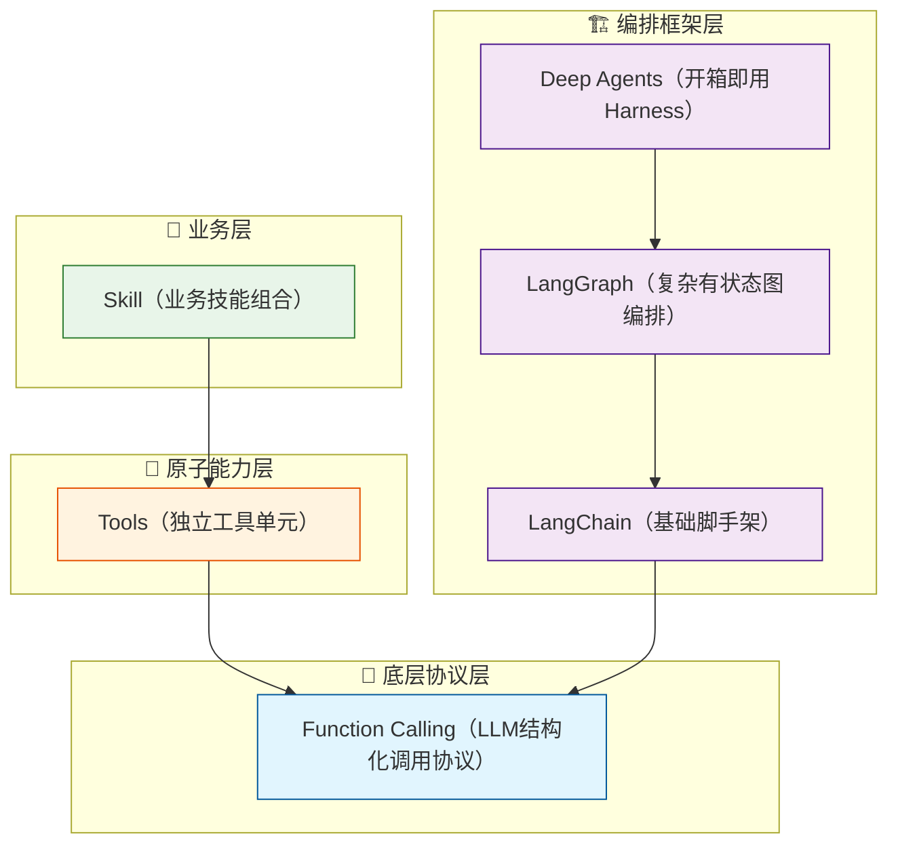
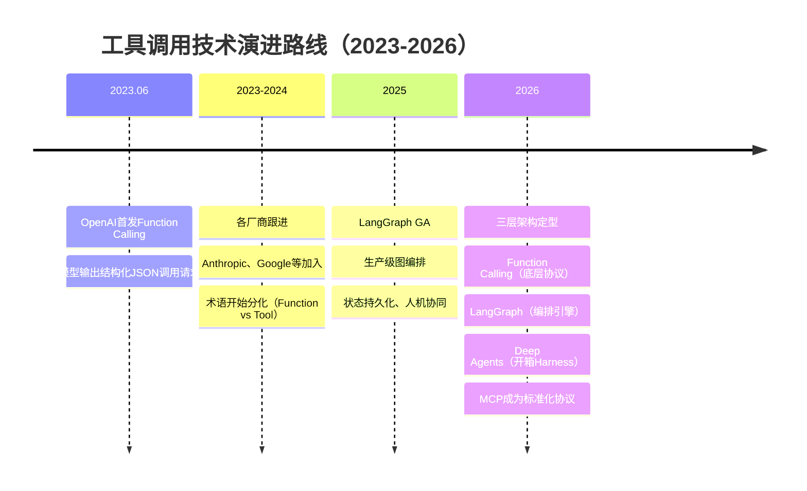

1. **定义上的区别：** 
   
   Function Calling 是大模型原生支持的结构化工具调用能力，是模型通过预训练或微调获得的“本能”，具体来说，LLM 理解用户需求，生成符合预定义格式的工具调用请求（如 JSON），但不会直接执行工具。执行由应用程序完成。而且，Function Calling 的上下文管理仅限于单次请求：模型的工具调用请求仅包含当前用户需求的上下文，不会跟踪历史对话或工具执行结果。
   
   Agent 中的工具调用是由框架（langgraph）主导：Agent 通过调用 LLM 做出意图识别和决策选择工具，通过执行器（ToolExecutor）调用工具，通过状态管理跟踪流程。并且不断迭代直到给出答案。
   
2. **适用场景上的区别：** Function Calling 适用于简单、单步任务，Agent 中的工具调用适用于复杂、多步骤、需要自适应调整的任务。

Function Calling 是 Agent 工具调用的基础：Agent 的工具调用依赖于模型生成的工具调用请求，没有 Function Calling，Agent 无法理解用户需求并选择工具。我认为：Agent 工具调用是 Function Calling 的扩展与增强：Agent 通过框架封装的状态管理、流程控制、多轮交互，解决了 Function Calling 无法处理的复杂任务（如多步骤协作、自适应调整）。


---

## 一、概念溯源：从Function Calling到Tool Calling

要理解两者的区别，首先需要厘清一个关键事实：**Function Calling和Tool Calling在2026年的语境下，已经从“同义词”演变为“不同层级的两个概念”** 。

2023年6月，OpenAI首次在LLM API中加入了function calling能力。彼时，Function Calling指的是**模型输出结构化调用请求的能力**——模型不直接输出自然语言，而是输出一个JSON格式的“我想调用某个函数，参数是xxx”的意图。

到了2026年，Tool Calling已经演变为一个更宽泛的**伞状概念（umbrella concept）** ，而Function Calling则特指OpenAI风格的具体实现。在LangChain生态中，**Tool Calling是通用术语**，描述“模型发出工具调用意图”这一行为。

## 二、核心区别：底座能力 vs 编排系统

两者的本质差异可以用一句话概括：**Function Calling是LLM的“底座能力”，Agent工具调用是“编排系统”** 。

| 维度 | Function Calling | Agent工具调用（Tool Calling by Agent） |
|------|------------------|----------------------------------------|
| **所属层级** | LLM原生能力（底层协议） | Agent框架的编排能力 |
| **决策模式** | 一次性输出调用意图 | 循环决策（思考→行动→观察→再思考） |
| **工具数量** | 通常单工具或固定多工具 | 动态选择，可多工具组合 |
| **执行逻辑** | 模型不执行，只输出JSON请求 | 框架负责解析、执行、回传结果 |
| **灵活性** | 低，格式固定 | 高，可编排、可路由、可中断 |
| **适用场景** | 简单结构化任务 | 复杂多步骤任务 |

**Function Calling本质上解决的是“让LLM输出结构化内容”的问题**。它不包含任何执行逻辑——模型只是生成了一张“任务单”（JSON格式的调用请求），外部运行时（你的代码或框架）需要解析这个JSON、实际调用函数、再把结果传回模型。

**Agent工具调用则是一个完整的闭环**：Agent会思考（“我需要调用工具吗？”）→ 决定调用哪个工具 → 执行工具 → 观察结果 → 再次思考下一步。这是一个循环，不是一次性的。

## 三、LangChain/LangGraph生态中的层级关系

在2026年的LangChain生态中，从底到顶的层级关系如下：



**Function Call是底座**，是所有工具调用的底层协议。**Tools是原子能力单元**，是被调用的对象。**LangChain提供基础封装**（@tool装饰器、bind_tools等）。**LangGraph提供生产级图编排**——支持状态持久化、人机协同、断点恢复等。**Deep Agents是在LangGraph之上的“开箱即用”Harness**，自带规划、文件系统、子Agent等内置能力。

## 四、代码示例：三个层级的实现对比

### 4.1 纯Function Calling（底层协议）

```python
from openai import OpenAI

client = OpenAI()

# 定义工具schema
tools = [{
    "type": "function",
    "function": {
        "name": "get_weather",
        "description": "获取指定城市的天气",
        "parameters": {
            "type": "object",
            "properties": {
                "city": {"type": "string", "description": "城市名称"}
            },
            "required": ["city"]
        }
    }
}]

# 模型只输出调用意图，不执行
response = client.chat.completions.create(
    model="gpt-4",
    messages=[{"role": "user", "content": "北京天气怎么样？"}],
    tools=tools,
    tool_choice="auto"
)

# 需要自己解析JSON、执行函数、回传结果
tool_call = response.choices[0].message.tool_calls[0]
# 手动执行 get_weather(city="北京")...
# 手动把结果作为ToolMessage回传...
```

### 4.2 LangChain Tool Calling（基础封装）

```python
from langchain.tools import tool
from langchain_openai import ChatOpenAI
from langchain.agents import create_tool_calling_agent, AgentExecutor

@tool
def get_weather(city: str) -> str:
    """获取指定城市的天气"""
    return f"{city}今天晴，25°C"

model = ChatOpenAI(model="gpt-4")
tools = [get_weather]

# Agent自动处理：解析→执行→回传→循环
agent = create_tool_calling_agent(model, tools, prompt)
executor = AgentExecutor(agent=agent, tools=tools)
result = executor.invoke({"input": "北京天气怎么样？"})
```

**Tool Calling Agent是LangChain官方推荐的首选方案**。

### 4.3 LangGraph ToolNode（精细控制）

```python
from langgraph.prebuilt import ToolNode, create_react_agent
from langchain.tools import tool

@tool
def get_weather(city: str) -> str:
    """获取指定城市的天气"""
    return f"{city}今天晴，25°C"

tools = [get_weather]

# 使用create_react_agent构建ReAct循环
# 注意：create_react_agent在最新版中已deprecated，推荐使用create_agent
agent = create_react_agent(model, tools)
result = agent.invoke({"messages": [("user", "北京天气？")]})
```

LangGraph的**ToolNode**负责执行工具调用：

```python
from langgraph.prebuilt import ToolNode

tool_node = ToolNode(tools)  # 专门执行工具调用的节点
```

### 4.4 Deep Agents（最高层封装）

```python
from deepagents import create_deep_agent
from langchain.tools import tool

@tool
def get_weather(city: str) -> str:
    """获取指定城市的天气"""
    return f"{city}今天晴，25°C"

# Deep Agents自带规划、文件系统、子Agent等内置能力
agent = create_deep_agent(
    model="openai:gpt-4",
    tools=[get_weather],
)
result = agent.invoke({"messages": [{"role": "user", "content": "北京天气？"}]})
```

Deep Agents可以调用任何你定义的工具、任何LangChain工具，以及任何MCP服务器的工具。

## 五、演进路线：从2023到2026



关键里程碑：

- **2023年6月**：OpenAI首次引入Function Calling
- **2025年5月**：LangGraph正式GA（General Availability），近400家公司（LinkedIn、Uber、Replit等）在生产环境使用
- **2026年**：Deep Agents成为LangChain生态最高层封装；MCP（Model Context Protocol）成为跨提供商工具调用的标准化协议

## 六、选型建议

| 场景 | 推荐方案 |
|------|----------|
| 只需模型输出结构化JSON | 直接使用Function Calling API |
| 轻量级工具调用，无需复杂状态 | LangChain Tool Calling Agent |
| 多步骤、有状态、需人机协同 | LangGraph |
| 复杂长任务、需规划/子Agent | Deep Agents |
| 多模型、多工具、生产级治理 | MCP + LangGraph |

**核心结论**：Function Calling是“模型怎么说话”的底层协议，Agent工具调用是“系统怎么思考和行动”的编排能力。前者是后者的基础设施，但远不等于后者。大多数教程把两者混为一谈，但在生产级Agent开发中，这个区分至关重要——**Function Calling解决的是“能不能调”，Agent解决的是“什么时候调、调哪个、调完怎么办”** 。


