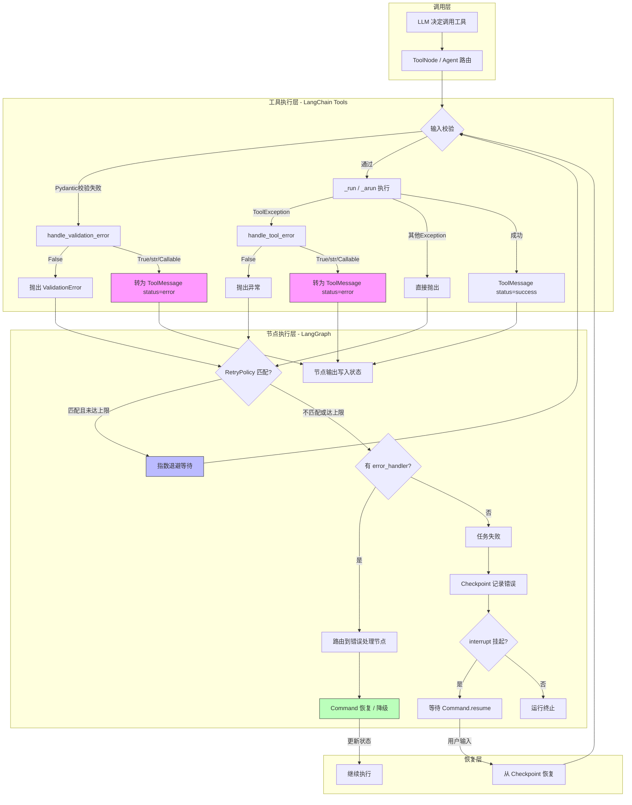

# Agent 工具执行错误处理机制：从原理到企业级实践

> 基于 LangChain 1.3.11 / LangGraph 1.2.8 / DeepAgents 0.6.12 源码与官方文档，2026年7月


---

## 一、错误分类体系：从第一性原理出发

工具错误不是笼统的"出错了"，需要按**谁来修复**分类：

| 错误类别 | 谁来修复 | 错误特征 | 处理策略 |
|---|---|---|---|
| **瞬态错误** | 系统自动 | 网络超时、API 429/5xx、连接重置 | `RetryPolicy` 指数退避重试 |
| **LLM可恢复错误** | LLM自身 | 工具参数格式错误、工具输出解析失败 | 转 `ToolMessage(status="error")` 返回模型 |
| **用户可修复错误** | 人类 | 缺少必填字段、信息模糊 | `interrupt()` 挂起等待人工输入 |
| **不可预期错误** | 开发者 | TypeError、schema不匹配、逻辑bug | 向外抛出，记录trace，触发告警 |

**核心洞察**：Agent 系统中，错误是**信息**而非终点。与传统应用不同，LLM 可以理解错误消息并调整行为——这是 Agent 错误处理的独特优势。

减少错误的三个前置设计原则：
- **输入校验前置**：Pydantic schema 约束 + `handle_validation_error`，不让无效参数进入工具体
- **输出结构约束**：`response_format` 让模型输出结构化 JSON，减少下游解析失败
- **幂等设计**：工具尽可能设计为幂等（如按 ID 操作而非追加），重试不产生副作用

---

## 二、错误处理机制全景架构



---

## 三、LangChain 工具层错误处理

### 3.1 核心机制：`handle_tool_error` 与 `handle_validation_error`

`BaseTool` 有两个关键字段决定错误处理策略：

| 字段 | 默认值 | 控制内容 |
|---|---|---|
| `handle_tool_error` | `False` | `ToolException` 的处理方式 |
| `handle_validation_error` | `False` | Pydantic `ValidationError` 的处理方式 |

值语义：
- `False`：重新抛出异常（默认，fail-fast）
- `True`：用异常的原始消息作为 `ToolMessage` 的 content
- `str`：用该固定字符串作为 content
- `Callable`：调用回调函数，返回值作为 content

**执行流程**（`BaseTool.run()` 源码核心逻辑）：

```python
# 简化的三级异常捕获链
try:
    tool_args, tool_kwargs = self._to_args_and_kwargs(tool_input)
    content = self._run(*tool_args, **tool_kwargs)
    status = "success"
except ValidationError as e:
    if not self.handle_validation_error:
        raise                          # 直接抛出
    content = _handle_validation_error(e, flag=...)  # 转字符串
    status = "error"
except ToolException as e:
    if not self.handle_tool_error:
        raise                          # 直接抛出
    content = _handle_tool_error(e, flag=...)
    status = "error"
except Exception:
    raise                              # 未预期错误总是抛出

return ToolMessage(content, tool_call_id=..., status=status)
```

### 3.2 `ToolException` —— 工具业务错误的信号标记

```python
class ToolException(Exception):
    """工具执行中发生的可预期业务错误。

    抛出此异常告诉 Agent '工具失败了，但这是可处理的业务错误'，
    不会被当做系统级崩溃。由 handle_tool_error 控制最终行为。
    """
```

在工具中主动抛出：
```python
@tool
def search(query: str) -> str:
    if not query.strip():
        raise ToolException("搜索关键词不能为空")
    # ...正常逻辑...
```

### 3.3 代码示例

**基础用法**：

```python
from langchain_core.tools import tool, ToolException

# 方式1：用原始异常消息作为错误输出
@tool(handle_tool_error=True)
def risky_api(query: str) -> str:
    if "bad" in query:
        raise ToolException("API 返回 500 错误")
    return f"结果: {query}"

# 方式2：固定错误消息
@tool(handle_tool_error="服务暂时不可用，请稍后重试")
def flaky_search(query: str) -> str:
    ...

# 方式3：自定义错误处理函数
def detail_handler(e: ToolException) -> str:
    return f"[{type(e).__name__}] {e}"

@tool(handle_tool_error=detail_handler)
def another_tool(x: int) -> str:
    ...

# 方式4：输入校验处理
@tool(handle_validation_error="请提供有效的参数格式")
def calculate(expression: str) -> str:
    return eval(expression)
```

---

## 四、LangGraph 图级错误处理

### 4.1 RetryPolicy —— 节点级自动重试

LangGraph 1.2.8 的 `RetryPolicy` 参数：

| 参数 | 默认值 | 说明 |
|---|---|---|
| `initial_interval` | 0.5s | 首次重试等待 |
| `backoff_factor` | 2.0 | 退避乘数 |
| `max_interval` | 128s | 最大等待上限 |
| `max_attempts` | 3 | 总尝试次数（含首次） |
| `jitter` | True | 随机抖动防惊群 |
| `retry_on` | 默认谓词 | 匹配的异常类型或 Callable |

**默认 `retry_on` 行为**：重试 `ConnectionError` 和 HTTP 5xx，不重试 `ValueError`/`TypeError`（编程错误重试无意义）。

```python
from langgraph.types import RetryPolicy
from langgraph.graph import StateGraph

# 针对外部API的激进重试
api_retry = RetryPolicy(
    max_attempts=5,
    initial_interval=1.0,
    backoff_factor=2.0,
    retry_on=(ConnectionError, TimeoutError),
)

# 针对LLM的保守重试（调用贵）
llm_retry = RetryPolicy(
    max_attempts=3,
    initial_interval=0.5,
)

graph = StateGraph(State)
graph.add_node("call_api", api_node, retry_policy=api_retry)
graph.add_node("call_llm", model_node, retry_policy=llm_retry)
```

### 4.2 TimeoutPolicy —— 节点超时管控

```python
from langgraph.types import TimeoutPolicy

# 组合：总时长120s + 空闲30s无进度则超时
graph.add_node(
    "long_task",
    long_task_fn,
    timeout=TimeoutPolicy(run_timeout=120, idle_timeout=30),
)

# 空闲超时需信号
def long_task(state, runtime):
    for chunk in stream_large_file():
        runtime.heartbeat()  # 每次IO后刷新空闲时钟
        process(chunk)
```

### 4.3 Node Error Handler —— 重试耗尽后的补偿逻辑

重试全部失败后，不是终止整个运行，而是路由到错误处理节点进行**补偿或降级**：

```python
from langgraph.types import Command
from langgraph.errors import NodeError

def payment_error_handler(state, error: NodeError):
    """重试耗尽后执行的补偿逻辑"""
    # error.node: 失败节点名
    # error.error: 异常对象
    return Command(
        update={"status": "payment_failed", "error_detail": str(error.error)},
        goto="notify_user"  # 跳转到通知用户的节点
    )

graph = StateGraph(State)
graph.add_node("charge", charge_node, error_handler=payment_error_handler)
graph.add_node("notify_user", notify_node)
```

### 4.4 Checkpoint 持久化 —— 失败后的状态恢复

LangGraph 在执行每一步时自动保存 checkpoint。错误状态通过特殊通道持久化：

- `__error__` 通道：存储异常对象
- `__interrupt__` 通道：存储中断信息
- `__resume__` 通道：存储恢复值

恢复流程：
```
节点失败 → 保存错误到 checkpoint → 
用户修复后通过 Command(resume=...) 恢复 → 
从 checkpoint 重新执行失败节点
```

```python
from langgraph.types import interrupt, Command

def approval_node(state):
    """需要人工审批的节点"""
    decision = interrupt(f"请审批订单 {state['order_id']}")  # 挂起
    return {"approved": decision == "yes"}

# 首次调用 → 遇到 interrupt 挂起，返回中断状态
graph.invoke({"order_id": "123"}, config)

# 恢复执行
graph.invoke(Command(resume="yes"), config)

# 多个中断需指定 id
graph.invoke(Command(resume={"interrupt_id_1": "yes", "interrupt_id_2": "no"}), config)
```

### 4.5 ToolNode 内置错误处理

`ToolNode` 原生支持三种错误处理模式，无需额外包装：

```python
from langgraph.prebuilt import ToolNode

# 默认：参数校验错误转友好消息，其他异常抛出
tool_node = ToolNode([my_tool])

# 捕获所有异常，默认消息返回
tool_node = ToolNode([my_tool], handle_tool_errors=True)

# 仅捕获特定类型
tool_node = ToolNode([my_tool], handle_tool_errors=(ValueError, ToolException))
```

---

## 五、DeepAgent 异常处理架构

### 5.1 SubAgent（同步）vs AsyncSubAgent（异步）核心差异

这是 DeepAgent 架构中最关键的区分：

| 维度        | SubAgent（同步）        | AsyncSubAgent（异步）                                       |
| --------- | ------------------- | ------------------------------------------------------- |
| **错误传播**  | 异常直接向上冒泡到父代理        | 异常被吞噬，转为状态字符串                                           |
| **父代理感知** | 捕获异常或检查 ToolMessage | 通过 `check_async_task` 获取 `status`/`error` 字段            |
| **任务状态**  | 一次调用，一次结果           | 完整状态机：`running`→`success`/`error`/`cancelled`/`timeout` |
| **恢复方式**  | 父代理重新发起 task 调用     | 可通过 `update_async_task` 在同一线程重建 run                     |
| **适用场景**  | 短生命周期、需立即结果的委托      | 长时间运行、需监控的后台任务                                          |

**源码关键行对比**：
- 同步 SubAgent：`subagent.invoke(subagent_state, config)` 无 try/except 包裹
- 异步 SubAgent：所有 SDK 调用都被 `except Exception as e` 包裹

### 5.2 三层防御体系

```
┌──────────────────────────────────────────────┐
│  接口层 (BackendProtocol)                     │
│  • Result(error=str|None) 统一退出约定        │
│  • 标准化错误码: file_not_found, permission_   │
│    denied, is_directory, invalid_path         │
│  • NotImplementedError 缺省实现                │
├──────────────────────────────────────────────┤
│  中间件层 (Middleware)                        │
│  • FilesystemMiddleware: 所有文件操作错误      │
│    转为 ToolMessage(status="error")            │
│  • AsyncSubAgentMiddleware: 远程通信全捕获     │
│  • Summarization: 图片卸载失败用占位符替换     │
├──────────────────────────────────────────────┤
│  运行时层 (SubAgent)                          │
│  • 同步: 异常传播（fail-fast）                 │
│  • 异步: 状态机 + 错误吞噬（fail-safe）         │
│  • DeltaChannel: 减少 checkpoint 41× 存储      │
└──────────────────────────────────────────────┘
```

### 5.3 Backend 错误契约示例

```python
from deepagents.backends import StateBackend

backend = StateBackend()

# 统一 Result 模式：所有操作返回 error + 数据
result = backend.read("/config.json")
if result.error:
    # error 可能是 "file_not_found" / "permission_denied" 等
    # LLM 可直接理解这些语义化的错误码
    print(f"操作失败: {result.error}")
else:
    content = result.file_data["content"]

# 批量操作也是逐项的 error 字段
for resp in backend.download_files(["/a.txt", "/b.txt"]):
    if resp.error:
        print(f"{resp.path} 下载失败: {resp.error}")
```

### 5.4 异步子代理错误处理示例

```python
from deepagents import create_deep_agent

agent = create_deep_agent(
    model="openai:gpt-4.1",
    subagents=[{
        "name": "worker",
        "description": "后台 Worker",
        "graph_id": "worker_agent",
        "url": "https://my-deployment.langsmith.dev",
    }],
)

# AsyncSubAgent 所有错误都转为 ToolMessage 文本
# - 启动失败: "Failed to launch async subagent 'worker': ..."
# - 状态检查失败: "Failed to get run status: ..."
# - 子代理执行错误: check 结果的 error 字段
result = agent.invoke({"messages": [{"role": "user", "content": "Start task"}]})

# 父代理（LLM）会自动理解错误文本，决定重试或降级
```

---

## 六、重试策略与回退机制

### 6.1 重试策略选择矩阵

| 场景 | 策略 | max_attempts | 退避 | 原因 |
|---|---|---|---|---|
| LLM API调用 | 保守 | 3 | 0.5s→1s→2s | 调用昂贵，大部分超时是瞬时 |
| 外部HTTP API | 激进 | 5 | 1s→2s→4s→8s→16s | 外部不稳定，值得多次尝试 |
| 数据库操作 | 适中 | 3 | 0.1s→0.2s→0.4s | DB通常很稳定，重试间隔短 |
| 工具参数错误 | 不重试 | - | - | 重试相同参数无意义 |

### 6.2 `with_retry` + `with_fallbacks` 组合

LangChain Runnable 层面可组合重试与回退：

```python
from langchain_core.tools import tool
import httpx

@tool(handle_tool_error=True)
def primary_search(query: str) -> str:
    """主搜索（贵但准）"""
    resp = httpx.get("https://api.premium.com/search", params={"q": query})
    resp.raise_for_status()
    return resp.text

@tool
def cheap_search(query: str) -> str:
    """备选搜索（便宜但粗）"""
    return f"备选结果: {query}"

# 重试3次 → 全部失败 → 切换到备选工具
robust_search = (
    primary_search
    .with_retry(
        retry_if_exception_type=(httpx.HTTPStatusError, ConnectionError),
        stop_after_attempt=3,
    )
    .with_fallbacks([cheap_search])
)
```

### 6.3 `exception_key` 传递错误上下文

```python
from langchain_core.runnables import RunnableLambda

def smart_fallback(input_dict: dict) -> str:
    last_error = input_dict.get("last_error")
    if last_error:
        return f"主工具失败（{last_error}），使用缓存结果: ..."
    return "正常执行"

search_with_context = primary_search.with_fallbacks(
    [RunnableLambda(smart_fallback)],
    exception_key="last_error",  # 异常自动注入到 input
)
```

---

## 七、演进路线：传统 vs 当前

| 维度 | 传统做法（2024前） | 当前主流（2025-2026） |
|---|---|---|
| 异常处理 | try/except 手动遍布每个节点 | `RetryPolicy` + `error_handler` 声明式配置 |
| 重试逻辑 | 手写退避循环在每个函数里 | `with_retry()` 一行包装 |
| 失败处理 | 整个运行崩溃/重头开始 | checkpoint 持久化 + 精确恢复失败节点 |
| 人机协作 | 抛异常等人工介入后手动重启 | `interrupt()` + `Command.resume` 无缝恢复 |
| 错误对LLM的反馈 | 不反馈，或原始 traceback | `ToolMessage(status="error")` 结构化错误信息 |
| 存储开销 | 每步全量快照 (O(N²) 存储) | DeltaChannel 增量存储 (减少 41×) |
| 子代理错误 | 全部向上传播或无处理 | 同步 fail-fast / 异步 fail-safe 双模式 |
| 超时控制 | `asyncio.wait_for` 手动包裹 | `TimeoutPolicy` 节点级声明，含 idle_timeout |

---

## 八、最佳实践总结

1. **错误即数据**：捕获后转为 `ToolMessage(content=error_msg, status="error")`，让 LLM 自己理解并修正。
2. **分层处理**：瞬态用重试，业务用 ToolException + handle_tool_error，致命用 error_handler 补偿。
3. **重试要分类型**：只重试网络/超时类异常，不重试编程错误。
4. **状态即保险**：打开 checkpoint 持久化，任何失败都有恢复路径。
5. **子代理双模式**：短任务用同步 SubAgent（异常传播），长任务用 AsyncSubAgent（状态机+容错）。
6. **减少错误优于处理错误**：Pydantic 校验前置、结构化输出约束、幂等设计、限流熔断。

---

## 可扩展项（留白）

- 分布式 Agent 的跨节点错误传播与事务补偿
- 基于 LLM 自省的错误根因分析（调用链路追踪 → LLM 分析 trace → 自动修正）
- 错误预算（error budget）驱动的动态降级策略
- 工具调用的可视化 Playground 调试（MCP Playwright 截图 + 错误复现）
- AGENTS.md 规范：定义每个子代理的错误处理契约

---

> **版本信息**：基于 LangChain 1.3.11 / langchain-core 1.4.8 / LangGraph 1.2.8 / DeepAgents 0.6.12，2026年7月验证
