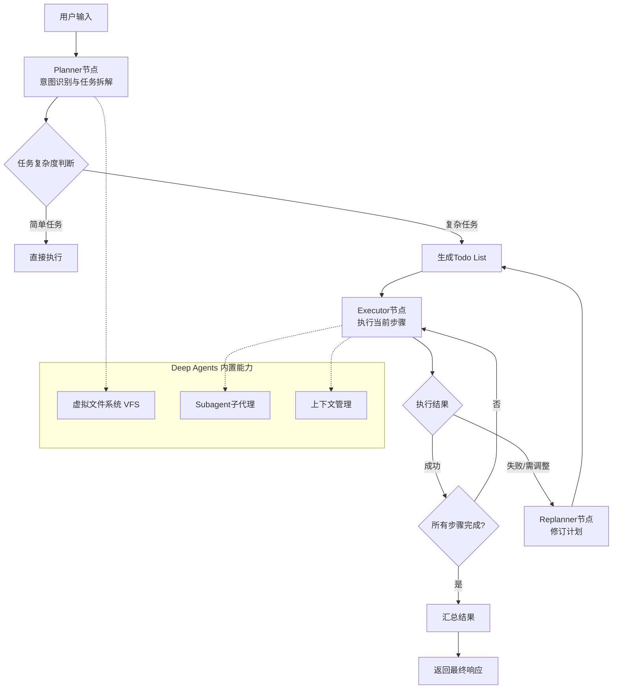

DeepAgent内置planner，开箱即用

如果想自己做，也是多agent架构和Agent skill架构，需要关注：更好的提示词 精细的状态管理 子任务的交接和校验

---

基于最新的LangChain、LangGraph及Deep Agents技术栈，构建Planner层的核心思路已从“手动编排”演进为“内置能力+灵活定制”。

以下是当前主流的技术实现方案与工程实践。

### 一、技术演进：从ReAct到显式规划

回顾Agent架构的演进，有助于理解Planner层设计的出发点：

*   **ReAct模式**：早期Agent采用“思考-行动-观察”的循环，每一步都需调用LLM决策。这在长链路任务中会导致**步骤遗漏、成本线性增长**等问题。
*   **Plan-and-Execute模式**：为解决上述问题，业界将“规划”与“执行”解耦。Planner先生成完整的步骤清单，Executor再依次执行，大幅降低了延迟和成本。
*   **ReWOO与LLMCompiler**：在Plan-and-Execute基础上，ReWOO引入变量传递依赖，LLMCompiler则支持并行执行DAG任务，进一步提升了效率。
*   **Deep Agents Harness**：LangChain官方推出的“开箱即用”型Agent框架，将**Planner、Subagent、VFS**等能力作为内置组件，代表了当前生产级应用的主流选择。

### 二、核心设计模式：Plan-and-Execute

当前构建Planner层最经典的模式仍是**Plan-and-Execute**。其核心流程如下：

1.  **Planner（规划器）**：接收用户复杂需求，拆解为有序的步骤清单（Todo List）。
2.  **Executor（执行器）**：专注于执行当前步骤，调用工具完成任务。
3.  **Replanner（重规划器）**：执行结果若不满足要求，则触发重新规划，修订计划。

这种架构的核心优势在于**将"思考"和"行动"解耦**，使规划和执行可使用不同规格的模型，从而节约成本。

### 三、基于LangGraph的Planner实现（自定义方案）

如果你需要精细控制流程，可以使用**LangGraph**从零构建Planner层。LangGraph通过**节点（Nodes）、状态（State）和条件边（Conditional Edges）** 使循环成为架构的自然部分。

以下是一个基于LangGraph的Plan-and-Execute核心实现示例：

```python
from typing import List, TypedDict, Literal
from langgraph.graph import StateGraph, END
from langchain_core.messages import AIMessage
from langchain.agents import create_agent

# 1. 定义状态
class PlanExecuteState(TypedDict):
    input: str
    plan: List[str]
    past_steps: List[tuple]
    response: str

# 2. 定义Planner节点
def planner_node(state: PlanExecuteState):
    # 使用LLM生成步骤列表
    prompt = f"将以下任务分解为最多5个步骤：{state['input']}"
    # 此处调用LLM生成结构化计划，返回步骤列表
    plan = ["步骤1", "步骤2", "步骤3"]  # 示意
    return {"plan": plan}

# 3. 定义Executor节点
def executor_node(state: PlanExecuteState):
    # 获取当前待执行的步骤
    plan = state["plan"]
    past_steps = state.get("past_steps", [])
    # 执行第一个未完成的步骤
    step_to_execute = plan[len(past_steps)]
    # 调用工具执行该步骤...
    result = f"执行结果: {step_to_execute} 已完成"
    past_steps.append((step_to_execute, result))
    return {"past_steps": past_steps}

# 4. 定义路由逻辑
def should_end(state: PlanExecuteState) -> Literal["executor", "respond"]:
    plan = state["plan"]
    past_steps = state.get("past_steps", [])
    if len(past_steps) >= len(plan):
        return "respond"
    else:
        return "executor"

# 5. 构建图
builder = StateGraph(PlanExecuteState)
builder.add_node("planner", planner_node)
builder.add_node("executor", executor_node)
builder.add_node("respond", lambda state: {"response": "所有步骤执行完毕"})

builder.set_entry_point("planner")
builder.add_edge("planner", "executor")
builder.add_conditional_edges("executor", should_end, {
    "executor": "executor",
    "respond": "respond"
})
builder.add_edge("respond", END)

graph = builder.compile()
```

### 四、Deep Agents内置Planner（推荐方案）

对于大多数生产场景，更推荐直接使用**Deep Agents**。它是一个基于LangGraph构建的“Batteries-included” Agent Harness，内置了Planner等核心能力。

其Planner组件的特点包括：

*   **自动拆解**：将用户目标自动拆分为结构化的待办清单（Todo List）。
*   **状态跟踪**：每条任务附带 `pending`、`in_progress`、`completed`、`failed` 等状态。
*   **动态迭代**：任务失败或需求变更时，可自动调整计划，而非盲目重试。
*   **显式优于隐式**：将计划、步骤、状态显性化，可查看、可干预、可回溯。

使用Deep Agents构建带Planner能力的Agent非常简单：

```python
from deepagents import create_deep_agent
from langchain.agents import tool

# 1. 定义工具
@tool
def get_weather(city: str) -> str:
    """获取指定城市的天气"""
    return f"{city}的天气是晴朗的"

# 2. 创建Deep Agent（Planner能力已内置）
agent = create_deep_agent(
    tools=[get_weather],
    system_prompt="你是一个研究助手，请将复杂任务拆解为步骤并逐一完成。"
)

# 3. 执行任务
result = agent.invoke({
    "messages": [{"role": "user", "content": "研究东京的天气并生成报告"}]
})
```

Deep Agents的核心设计理念是**分层解耦**：主代理（含Planner）负责统筹规划，子代理（Subagent）负责专项执行，上下文相互隔离。这种架构使得复杂任务可以委派给专门的子代理并行处理。

### 五、工程实践与高级模式

#### 1. 协调器-工作者模式
这是一种在LangGraph中实现Planner的高级模式。**协调器（Planner）** 负责任务分解和分发，**工作者（Workers）** 负责执行。Exa公司的深度研究Agent即采用此模式：Planner分析查询并动态生成多个并行任务，每个任务都是独立的研究单元。

#### 2. TODO List驱动的规划
Deep Agents官方深度研究Agent示例中，Agent使用**TODO列表**来规划研究角度。执行过程中，Agent会评估搜索结果并规划下一步，实现了**动态迭代**的规划能力。

#### 3. 意图拆分的Prompt工程
Planner层的核心是**意图解析**，这依赖于提示词工程和结构化输出的配合。系统提示需要明确定义任务拆解的规范格式，要求模型输出JSON结构的任务清单，每个子任务包含任务ID、描述、依赖关系和预估工具等字段。

#### 4. 多Agent协作中的Planner
在Minimal公司的客服系统中，**Planner Agent**负责将每个查询拆解为子问题（如“退货政策” vs. “前端问题排查”），然后与专门的研究Agent通信。这种模式将Planner作为**编排层**，实现了意图的精细拆分和专业化处理。

### 六、架构流程图

下图展示了基于LangGraph + Deep Agents的Planner层架构：



### 七、选型建议

| 场景 | 推荐方案 | 理由 |
|------|----------|------|
| 快速构建生产级应用 | **Deep Agents** | 开箱即用，内置Planner、Subagent、VFS等能力 |
| 需要精细控制流程 | **LangGraph自定义** | 灵活编排节点、状态和路由 |
| 简单任务、快速验证 | **ReAct Agent** | 实现简单，适合短链路任务 |
| 工具调用密集、需并行 | **LLMCompiler** | 支持DAG并行执行，最大化吞吐量 |

### 总结

构建Planner层的最新实践是：**优先使用Deep Agents的开箱即用能力**，在需要精细控制时再基于LangGraph自定义实现。核心设计模式已从早期的ReAct演进为**Plan-and-Execute及其变体**，强调“先规划、再执行、动态修正”。通过Planner层进行意图拆分，不仅能降低延迟和成本，还能提升复杂任务的处理可靠性和可观测性。