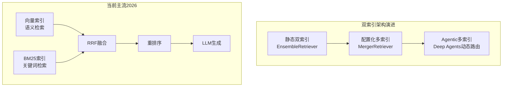
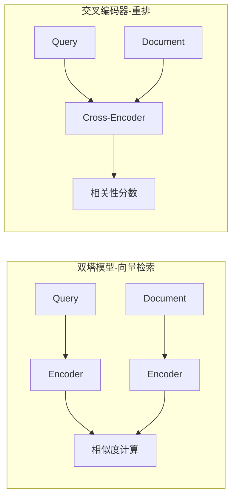
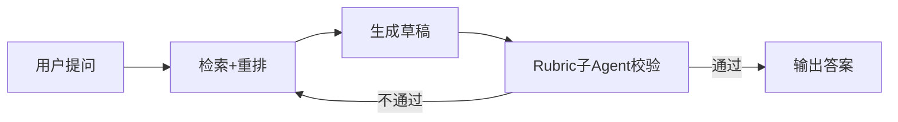
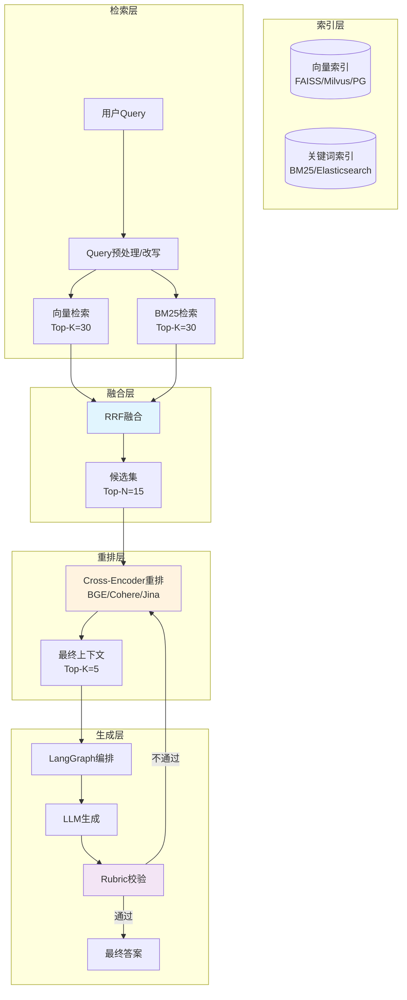

我在项目中采用的向量知识库 Milvus 是支持双索引架构的，利用不同索引的优势捕获不同类型的信息。其他，ES，PostgreSQL 也是可以的。有以下四个步骤：

**第一（双索引架构）：**由 Embedding 模型生成稠密向量，在数据库中设计稠密向量字段，并添加**稠密向量索引**：捕获语义相似性，解决同义词、语义关联问题。  
由 Milvus 自带的 BM25 函数，针对文本分块 chunk，生成稀疏向量，新增一个稀疏向量字段保存，并添加**稀疏向量索引**，擅长精确匹配关键词、专有名词和术语；适用于包含明确实体、编号或特定技术术语的查询。

**第二（混合检索+过滤检索）：**对同一查询，同时使用密集向量的语义检索和稀疏向量的关键词检索，并且基于元数据做过滤检索，实现基于混合检索的多路召回。各自返回一个候选列表。

**第三（融合排序）：** 我们通过 PyMilvus 提供的 `RRFRanker`，将两路召回的候选列表进行合并与重排。它的核心思想是**完全不看原始分数，而是基于排名进行融合**。具体做法是把文档在每一路检索中的排名位置代入公式 `1/(k + rank)` 进行计算并求和。这种方式最大的优势是，它巧妙地避开了不同检索路（比如向量检索和关键词检索）分数量纲不一致的问题，不需要做任何分数归一化（可以提到为什么不选WeightedRanker），既简单又非常稳健。

**第四（精细重排序）：**对融合后的候选集进行精细化相关性排序。将查询到 文档 拼接后输入模型（如 BGE-Reranker, Qwen3-Reranker），直接输出相关性分数。能深度理解上下文，排序精度最高的。

双索引与混合检索的多路融合重排策略，本质上是将检索过程划分为“广撒网”和“精捕捞”两个阶段。通过**双索引**保证召回广度，**混合检索**实现优势互补，最后用**重排模型**进行精细化筛选，从而系统性地提升提供给大模型的上下文质量，最终生成更准确、可靠的答案。


---
## 一、搜索到的Top 5技术文章

### 1. LangChain官方博客：《Announcing the LangChain + MongoDB Partnership》（2026年3月31日）
> https://www.langchain.com/blog/announcing-the-langchain-mongodb-partnership

LangChain与MongoDB的深度合作，将MongoDB Atlas打造成完整的AI Agent后端平台。**核心内容**：Atlas Vector Search原生集成到LangChain中，支持语义搜索、**混合搜索（BM25 + Vector）** 、GraphRAG和预过滤查询。关键亮点是**无需额外基础设施**——向量数据与业务数据同库存储，无需同步作业和跨系统一致性维护。此外，LangSmith集成了RAG评估流水线用于追踪检索质量。

### 2. LangChain官方参考文档：《MongoDBAtlasHybridSearchRetriever》
> https://reference.langchain.com/python/langchain-mongodb/retrievers/hybrid_search

官方API文档，详细说明了**MongoDBAtlasHybridSearchRetriever**的实现细节。该检索器通过**RRF（Reciprocal Rank Fusion）算法**融合向量检索和全文检索。关键参数包括`vector_weight`、`fulltext_weight`控制两路权重，以及`rerank_model`、`num_docs_to_rerank`支持在融合后调用Voyage AI等重排模型进行精排。

### 3. 百度开发者中心：《动态知识库RAG系统混合检索架构部署与性能调优实践》（2026年7月1日）
> https://developer.baidu.com/article/detail.html?id=7837458

中文社区的高质量工程实践文章。**核心内容**：采用**双引擎并行检索设计**——BM25引擎（倒排索引关键词匹配）+ 稠密向量引擎（BERT语义向量），通过**RRF重排序层**融合两路结果。文章提供了完整的环境配置（检索集群4核16GB×3节点、GPU实例T4/A100）、软件依赖安装和网络策略配置。

### 4. CSDN：《LangChain 混合检索实战：六大场景调参指南》（2026年5月28日）
> https://blog.csdn.net/m0_59162248/article/details/159614451

深入拆解混合检索的架构设计与场景调参。**核心内容**：详细对比了向量检索和BM25各自的盲区——向量检索对产品编号、SKU等**领域外数据（OOD）失效**，BM25对语义近义词失效。提出了完整的混合检索架构图（关键词检索→向量检索→结果融合RRF→重排序→LLM生成），并强调了**“先召回，再精排”** 的黄金原则。

### 5. CSDN：《第22课：LangChain｜RAG进阶优化【重排序、上下文压缩、混合检索策略】》（2026年5月20日）
> https://blog.csdn.net/SearchB/article/details/160982239

系统讲解RAG进阶优化的三大核心技术。**核心内容**：重排序通过**Cross-Encoder模型**对检索结果精准再打分，修正向量检索的排序偏差。混合检索的标准落地方法：**BM25词频索引 + 向量数据库并行召回，通过加权融合（RRF）合并结果并注入重排序精排**。课程还涵盖`ContextualCompressionRetriever`结合各种文档压缩器的用法。

---

## 二、我的回答

### 演进脉络：从Naive RAG到多阶检索架构

2026年，LangChain已明确以**LCEL + LangGraph**作为构建Agent与RAG的主流范式。RAG的演进可以概括为三个阶段：

| 阶段 | 检索方式 | 排序方式 | 代表技术 |
|------|---------|---------|---------|
| **Naive RAG** | 单路向量检索 | 相似度分数排序 | FAISS + Embedding |
| **Hybrid RAG** | 双路并行（向量+关键词） | RRF融合 | EnsembleRetriever |
| **Agentic RAG** | 多索引+多策略动态路由 | 重排+Rubric校验 | LangGraph + Deep Agents |

下面逐一深入三个核心议题。

---

### 一、双索引架构：不止是“两个索引”

#### 1.1 什么是双索引架构

双索引架构是指在RAG系统中同时维护**两种或以上不同性质的索引**，以应对不同类型的查询需求。2026年主流的双索引形态包括：

**形态一：向量索引 + 关键词索引（BM25/倒排索引）**
这是最经典的双索引形态。向量索引负责语义匹配，关键词索引负责精确词汇匹配。

**形态二：多向量索引（Multi-Vector）**
针对不同粒度的信息建立独立的向量索引。例如：Parent-Child架构中，父块索引存摘要、子块索引存细节。

**形态三：跨模态双索引（文本向量 + 图片向量）**
如迪士尼问答助手的实践：文本向量索引处理文本查询，图片向量索引处理视觉检索。

#### 1.2 LangChain中的实现方式

在LangChain生态中，实现双索引架构主要有两种路径：

**路径一：使用`EnsembleRetriever`组合多个检索器**

```python
from langchain.retrievers import EnsembleRetriever
from langchain_community.retrievers import BM25Retriever
from langchain_community.vectorstores import FAISS

# 向量检索器
vector_retriever = vector_store.as_retriever(search_kwargs={"k": 10})

# BM25关键词检索器
bm25_retriever = BM25Retriever.from_documents(documents, k=10)

# 组合为双索引检索器
ensemble_retriever = EnsembleRetriever(
    retrievers=[bm25_retriever, vector_retriever],
    weights=[0.5, 0.5]  # 可动态调整权重
)
```

`EnsembleRetriever`能够将多个检索器的结果按权重做RRF融合排序。

**路径二：使用`MergerRetriever`合并多路结果**

```python
from langchain_classic.retrievers import MergerRetriever

merger = MergerRetriever(
    retrievers=[retriever1, retriever2, retriever3]
)
# 合并所有检索器的结果，去重后返回
```

`MergerRetriever`负责合并多个检索器的结果，适合多路召回场景。

#### 1.3 2026年的新趋势：Deep Agents中的多索引编排

LangChain在2026年7月发布的**Deep Agents**文档中，提出了更高级的多索引编排模式：

- **Skills-guided retrieval**：Agent根据技能描述决定使用哪个索引、如何构造查询
- **Todo-driven investigation**：Agent将复杂查询拆解为多个检索任务，分别在不同索引中执行
- **Retrieve, offload, and delegate**：检索后将结果卸载到文件系统，由子Agent并行分析

这意味着双索引架构正在从“静态配置”演进为“Agent动态路由”。



---

### 二、混合检索的多路融合策略

#### 2.1 为什么要多路融合

单一检索方式存在明显盲区：

| 查询类型 | 向量检索 | BM25 |
|---------|---------|------|
| 语义近义词（“修复慢查询” vs “数据库性能优化”） | ✅ 优秀 | ❌ 失效 |
| 精确标识符（“IPH-15-PRO-256”） | ❌ 语义漂移 | ✅ 优秀 |
| 领域外新词（OOD） | ❌ 失效 | ✅ 可命中 |
| 代码/函数名 | ❌ 语义漂移 | ✅ 精确命中 |

两者在表示空间上存在根本差异：关键词检索是**稀疏表示**（词汇空间维度~50,000+，绝大多数维度为0），向量检索是**稠密表示**（嵌入空间维度768/1536，所有维度均有值）。多路融合的本质是**取长补短**。

#### 2.2 主流融合算法：RRF（Reciprocal Rank Fusion）

RRF是目前LangChain官方和社区最主流的融合算法。

**核心公式**：

$$RRF\_score(d) = \sum_{r \in R} \frac{1}{k + rank_r(d)}$$

其中 $k$ 是常数（通常取60），$rank_r(d)$ 是文档 $d$ 在第 $r$ 路检索结果中的排名。

**RRF的优势**：
- 不依赖原始分数（不同检索器的分数尺度不同，无法直接比较）
- 对排名靠前的文档给予更高权重
- 实现简单，LangChain原生支持

#### 2.3 LangChain中的多路融合实践

**方式一：EnsembleRetriever（最常用）**

```python
from langchain.retrievers import EnsembleRetriever

ensemble_retriever = EnsembleRetriever(
    retrievers=[bm25_retriever, vector_retriever],
    weights=[0.4, 0.6]  # 权重分配
)
# weights影响RRF融合时的加权系数
```

**方式二：MongoDBAtlasHybridSearchRetriever（企业级）**

```python
from langchain_mongodb import MongoDBAtlasHybridSearchRetriever

retriever = MongoDBAtlasHybridSearchRetriever(
    vectorstore=vectorstore,
    search_index_name="hybrid_index",
    k=4,
    vector_weight=1.0,      # 向量检索权重
    fulltext_weight=1.0,    # 全文检索权重
    vector_penalty=60.0,    # 向量惩罚因子
    fulltext_penalty=60.0,  # 全文惩罚因子
    rerank_model="voyage-2", # 可选的精排模型
    num_docs_to_rerank=10    # 精排候选数
)
```

该检索器通过**RRF算法**融合向量和全文检索，并支持在融合后调用重排模型进行精排。

**方式三：MilvusCollectionHybridSearchRetriever（多字段混合检索）**

```python
from langchain_milvus import MilvusCollectionHybridSearchRetriever

retriever = MilvusCollectionHybridSearchRetriever(
    # 基于多个字段进行混合检索
)
```

支持基于Collection中**多个字段**的混合检索。

#### 2.4 融合策略的选择建议

| 场景 | 推荐融合方式 |
|------|------------|
| 通用知识问答 | EnsembleRetriever + RRF |
| 企业文档（含大量专有名词） | BM25权重 > 向量权重 |
| 语义密集型（如法律文书） | 向量权重 > BM25权重 |
| 已有MongoDB/ Milvus基础设施 | 使用原生HybridSearchRetriever |

---

### 三、重排策略优化

#### 3.1 为什么需要重排

向量检索的排序基于**双塔Embedding的相似度**，这种“形似”不一定等于“最相关”。典型问题：
- 语义相似但答非所问
- 向量索引算法（HNSW等）存在近似随机性，真正相关的文档可能排在第3或第4位

**重排的核心逻辑**：向量检索做**粗筛**（高效、低成本），重排模型做**精排**（精准、高成本）。

#### 3.2 重排模型的选型（2026年）

| 模型 | 特点 | 适用场景 |
|------|------|---------|
| **BGE-reranker-base** | 开源，HuggingFace集成 | 本地部署，隐私敏感 |
| **Cohere Rerank** | API服务，多语言支持 | 云原生，快速集成 |
| **Jina Rerank** | API级精排，返回rerank_score | 需要可视化排序分数 |
| **gte-rerank-v2** | DashScope提供，中文优化 | 中文场景 |
| **Voyage AI** | MongoDB原生集成 | MongoDB生态 |
| **NVIDIA NeMo Reranker** | 企业级，NIM部署 | 已有NVIDIA基础设施 |

**Cross-Encoder vs Bi-Encoder的本质区别**：



Cross-Encoder同时看Query和Document，判断真实相关性，比双塔Embedding的相似度更准确，但**推理慢、成本高**，只适合在候选集较小的情况下做精排。

#### 3.3 LangChain中的重排实现

**方式一：使用`ContextualCompressionRetriever`包装**

```python
from langchain.retrievers import ContextualCompressionRetriever
from langchain_community.document_compressors import JinaRerank

# 基础检索器（先粗筛）
base_retriever = vector_store.as_retriever(search_kwargs={"k": 20})

# 重排压缩器
compressor = JinaRerank(
    model="jina-reranker-v2-base-multilingual",
    top_n=5
)

# 组合：先检索20个，重排后取Top 5
compression_retriever = ContextualCompressionRetriever(
    base_compressor=compressor,
    base_retriever=base_retriever
)
```

**方式二：使用`JinaRerank.rerank`方法直接重排**

```python
from langchain_community.document_compressors import JinaRerank

reranker = JinaRerank(model="jina-reranker-v2-base-multilingual", top_n=5)

# 对已有的文档列表进行重排
reranked_docs = reranker.rerank(
    query="用户问题",
    documents=retrieved_docs,  # 已检索到的文档列表
    model="jina-reranker-v2-base-multilingual",
    top_n=5
)
```

`rerank`方法返回按相关性排序的文档列表。

**方式三：DashScope Rerank（中文场景）**

```python
from langchain_community.document_compressors import DashScopeRerank

reranker = DashScopeRerank(
    model="gte-rerank-v2",
    top_n=5,
    dashscope_api_key="your-api-key"
)

compression_retriever = ContextualCompressionRetriever(
    base_compressor=reranker,
    base_retriever=base_retriever
)
```

实践中，向量Top-K初筛后用`gte-rerank-v2`重排候选，能显著提高上下文精准度。

#### 3.4 重排策略优化要点

**1. 黄金原则：先召回，再精排**
> Reranker只能对已检索到的文档重排。宁可多召回，不要漏。

建议配置：
- 向量检索 `k=20~50`（粗筛）
- 重排后取 `top_n=3~5`（精排）

**2. 重排位置的选择**

| 策略 | 流程 | 适用场景 |
|------|------|---------|
| **检索后重排** | 检索→重排→生成 | 标准RAG，最常用 |
| **融合后重排** | 多路检索→RRF融合→重排→生成 | 混合检索场景 |
| **多阶段重排** | 检索→轻量重排→生成→校验重排 | 高精度要求 |

**3. 2026年新趋势：Rubric校验 + 迭代修正**

LangChain Deep Agents引入了**RubricMiddleware**，由子Agent评估回答是否基于检索到的源材料，不通过则迭代修正：



这是一种**重排后置校验**的新范式，将重排从“一次性操作”扩展为“迭代优化闭环”。

---

### 四、完整架构图：双索引 + 混合检索 + 重排



### 五、总结

2026年LangChain生态中，RAG检索优化已形成清晰的**三层架构**：

1. **双索引层**：从静态的`EnsembleRetriever`演进到Agent动态路由的Deep Agents模式，多索引不再是“配置”而是“策略”
2. **融合层**：RRF已成为事实标准，`MongoDBAtlasHybridSearchRetriever`和`MilvusCollectionHybridSearchRetriever`等原生支持使企业级落地更简单
3. **重排层**：从单纯的Cross-Encoder精排扩展到“重排+Rubric校验+迭代修正”的闭环模式

核心原则始终不变：**粗筛保召回，精排提精度，闭环保质量**。