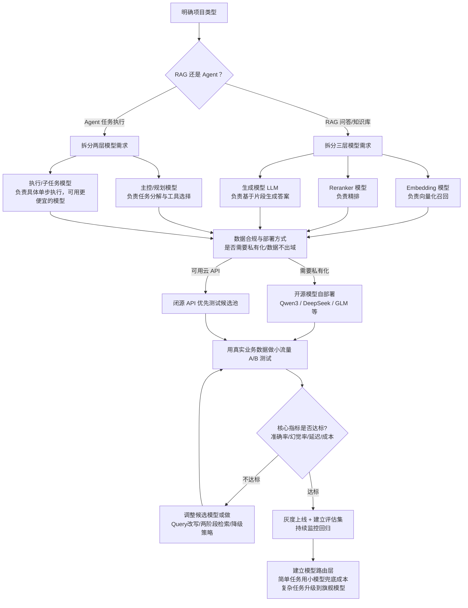

# 面试题：做 RAG / Agent 项目时，怎么做大模型选型？

## 一、面试思路：先破题

这道题的陷阱在于候选人容易回答成"哪个模型最强"。2026 年的行业共识已经很明确：<cite index="7-1">大模型的格局不再是单维的强弱比较，而是不同厂商在不同维度建立了各自的护城河——有的擅长长上下文，有的稳在编程，有的便宜，有的搜索能力强，问题不再是"哪个最强"，而是"在你的工作流里，哪个最省心"</cite>。所以规范的回答结构应该是：

1. **先拆需求**（场景、SLA、成本、合规）
2. **再定维度**（用统一的评估维度打分，而不是迷信榜单）
3. **然后做流程化决策**（给出选型流程图）
4. **落到项目实践**（结合 RAG 的检索链路 / Agent 的工具调用链路分别说明）
5. **最后强调迭代**（选型不是一次性的，要有替换成本兜底）

---

## 二、选型核心维度（先讲维度，面试官最想听这个）

一份靠谱的横评会同时看六个维度，而不是只看"跑分"：<cite index="2-1">价格是 API 选型第一要素；代码生成是当前大模型能力分化最明显的维度</cite>，此外还要看上下文窗口、推理能力、中文/多语言质量、响应速度。

| 维度 | RAG 项目关注点 | Agent 项目关注点 |
|---|---|---|
| **推理/理解能力** | 对检索片段的忠实度、抗幻觉能力、长文摘要质量 | 多步规划、工具选择准确率、错误恢复能力 |
| **上下文窗口** | 能否装下 Top-K 召回片段 + 历史对话 | 能否装下工具定义 + 多轮 trace + 中间结果 |
| **工具调用/结构化输出** | 弱依赖（有的话可做 query rewrite、意图路由） | 强依赖，是核心能力 |
| **延迟/吞吐** | 影响首字时间（TTFB），高并发问答场景敏感 | 多步串行调用会放大延迟，尤其明显 |
| **成本** | 通常调用频次高（每次问答都要跑一次生成），对成本敏感 | 一次任务可能触发几十次模型调用，成本会指数级放大 |
| **中文/领域质量** | 国内客服、政企知识库场景要重点看 | 影响工具参数理解、领域术语的准确抽取 |
| **可控性/合规** | 是否需要私有化部署、数据不出域 | 是否需要审计每一步工具调用 |
| **生态/易迁移性** | 是否兼容 OpenAI SDK，方便切换 | 是否原生支持 MCP / Function Calling 协议 |

> 面试加分点：可以提一句"国内模型基本都兼容 OpenAI SDK 协议"——<cite index="1-1">DeepSeek、Qwen、Kimi、GLM 都兼容 OpenAI SDK，只需要替换 base_url 和 api_key，迁移成本很低</cite>，所以在架构上建议做一层模型网关（Model Gateway），把 model 参数做成可配置项，而不是硬编码某个厂商的 SDK，这样后续选型/换模型的成本会低很多。

---

## 三、选型流程图



**流程图背后的关键逻辑**：RAG 项目的模型选型其实是"三个模型"的选型（Embedding、Reranker、生成 LLM），而不是只选一个生成模型；Agent 项目往往是"主控模型 + 执行模型"的分层选型，因为全用最贵的模型跑多步任务，成本会爆炸。

(RAG还少了个OCR模型)

（小模型兜底，比如codex每个会话会自动生成标题，这个小任务就是gpt-5.4-mini做的，而不会动用gpt-5.6-sol）

---

## 四、RAG 项目：三层模型分别怎么选

### 0） OCR

ocr用 OmniDocBench的数据集和标注答案做测试 [OminiDocBench](https://github.com/opendatalab/OmniDocBench/blob/main/README_zh-CN.md)

### 1）Embedding 模型（决定召回上限）

Embedding 决定了检索的"天花板"，选错了后面 Reranker 和 LLM 都救不回来。业内常见的决策树：

```
是否需要中文优化？
├── 是 → 选择 BGE-M3 或 Qwen3-Embedding
└── 否 → 是否需要多语言？
    ├── 是 → Cohere embed-v4 或 Jina v5
    └── 否 → 是否需要开源自部署？
        ├── 是 → BGE-M3 或 NV-Embed
        └── 否 → OpenAI text-embedding-3-large
```
<cite index="14-1">这是 2026 年 Embedding 选型的一个典型判断路径，最适合中文 RAG 应用、混合检索、边缘部署的组合是 BGE-M3</cite>。工程上一般不会只看 MTEB 榜单分数，还要看向量维度（影响向量库存储成本）、是否支持 instruction prefix（区分对称/非对称检索场景）。

### 2）Reranker 模型（决定精排质量，最容易被忽视）

<cite index="8-1">在 RAG 系统中，Reranker 往往是决定最终检索质量的关键一环，却也是最容易被忽视的模块</cite>。工程实践中的两阶段检索范式是：<cite index="9-1">先用 BM25 + Dense Embedding 做初步召回（比如 Top 50-200 个结果），然后RRFRerank粗排，再用 Reranker 模型对这些结果做精排（比如选出 Top 3-10 个）</cite>。而且这一步的收益会随数据规模放大：<cite index="12-1">知识库数据量大的场景下两阶段的优势非常明显，只用一阶段 embedding 检索，随着数据量增大会出现检索退化，而二阶段 rerank 重排后能实现准确率随数据量增加而稳定增长</cite>。

中文场景目前主流是 BGE-Reranker 和 Qwen3-Reranker 两条线，<cite index="13-1">Qwen3 系列的 4B 参数版本被认为在性能与效率上实现了"黄金平衡"，面向高精度 RAG、长文本检索及跨语言场景，是企业级部署的优选</cite>。

> 面试可以补一句方法论："没有一劳永逸的最佳方案，只有最适合当前业务需求、数据特性、资源限制和维护能力的组合，<cite index="9-1">建议从小处着手，逐步迭代，通过实验验证不同策略组合在具体场景下的表现，多做 AB 测试，用数据说话</cite>。"这句话本身就是很好的面试收尾句。

### 3）生成模型 LLM（决定最终答案质量）

生成端选型看两个东西：**忠实度**（是否会脱离检索片段编造）和**成本**。<cite index="1-1">中文任务不一定非要用最贵模型，客服、摘要、中文技术文档、普通 RAG 场景，国内模型通常更稳、更便宜，也更容易部署</cite>。

---

## 五、Agent 项目：主控模型 vs 执行模型怎么分层

Agent 场景的核心变量是 **工具调用（Function Calling / Tool Use）准确率**，而不是纯文本生成质量。行业里评估这个能力主要靠几个基准：

| 基准 | 关注点 |
|---|---|
| BFCL（Berkeley Function Calling Leaderboard） | <cite index="21-1">评估函数选择、参数填充、模式约束下的结构化生成，是否理解工具规范、判断是否需要调用工具、从候选池中选对函数</cite> |
| τ-bench | <cite index="18-1">评估智能体在多步骤零售、航空等真实场景任务中的端到端任务完成度</cite> |
| MCP-Bench / MCPWorld | 面向 MCP 协议的真实世界 API 集成任务评估 |

工程实践中的分层思路：

- **主控/规划模型**：负责任务拆解、决定调哪个工具、多步推理链路，通常用旗舰模型（如 Claude Opus/Sonnet、GPT 旗舰、DeepSeek-R1 类推理模型）。<cite index="7-1">Claude 在这方面靠 Opus / Sonnet 双线撑住编程与 Agent 场景</cite>。
- **执行/子任务模型**：负责具体的单步执行（比如格式转换、简单信息抽取），可以下沉到更便宜更快的小模型，控制整体成本。

一个常见误区要在面试里主动提出来，体现你踩过坑：<cite index="7-1">很多人迷信 benchmark 排名，但 SWE-bench、MMLU、HumanEval 这些榜单绝不能当选型的唯一依据——模型可能因为训练时见过相似题型在 benchmark 上得分很高，接到实战任务里却完全不行，排行榜真正缺的那条轴是"在你的代码库/业务数据上能不能用"</cite>。所以**任何选型的最后一步都必须是拿自己的真实业务数据做小流量测试**，而不是直接看榜单下结论。

---

## 六、模型横向对比表（结合官方文档，截至可核实的最新数据）

> 价格、参数随时间变化很快，面试时可以说"我会定期去官方定价页核对最新数据"，这本身也是加分项。

| 厂商/模型 | 定位 | 典型优势 | RAG 适用度 | Agent 适用度 |
|---|---|---|---|---|
| Claude（Opus / Sonnet / Haiku） | 分层旗舰体系 | <cite index="26-1">Sonnet 是日常主力，兼顾推理、编码、写作、分析，响应速度足以支撑实时协作；Haiku 快而轻量，适合日常高频请求、简单摘要；Opus 面向最复杂、最重要的任务</cite> | 中文稍弱于国产模型，长文档处理稳 | Agent 编程与工具调用长期第一梯队 |
| GPT 系列 | 生态最完整 | <cite index="6-1">生态最完整、功能最多，通用任务全面，是多数人的首选</cite> | 通用能力强 | 生态成熟，工具链丰富 |
| Gemini 系列 | 多模态强 | <cite index="6-1">与 Google 生态深度整合，多模态能力强</cite> | 图文混合知识库友好 | 多模态 Agent 场景有优势 |
| DeepSeek 系列 | 极致性价比 + 推理 | <cite index="7-1">核心打法是极致性价比 + 深度推理，正在补齐 Agent 能力</cite> | 成本最优，适合高并发生产环境 | 性价比高，复杂推理任务可用 |
| Qwen 系列 | 中文 + 开源全尺寸 | <cite index="7-1">卷开源全尺寸，中文能力强</cite> | 国内首选之一，中文质量与访问稳定性兼顾 | 工具调用与长时程恢复能力受认可（Qwen3-Coder 等） |
| Kimi / GLM 等国产中段 | 细分场景领先 | <cite index="7-1">Kimi 卷长上下文 + 编程，GLM 通用能力仍在调整；策略已从"全面对标 GPT"转向"在某个细分场景做到第一"</cite> | 超长文档场景适合 Kimi | 需结合实测，不能只看 Agent benchmark 分数 |

选型档位参考（源自 2026 年 3 月的行业横评结论）：<cite index="2-1">能力天花板型号在 Agent 编程和数学推理上领先但成本高昂；均衡旗舰型号是性价比最高的旗舰选择；成本最优型号提供最低成本，适合高并发生产环境；国内首选型号兼顾中文质量与访问稳定性</cite>。

---

## 七、结合项目实际怎么讲（面试话术模板）

面试官最想听到的是"你真的做过选型决策，而不是背答案"。可以按这个结构举例：

**案例一：企业内部知识库 RAG 项目**
> "我们的场景是内部文档问答，数据不能出域，QPS 不高但要求准确率高。选型时先排除了必须调用境外 API 的方案，Embedding 用了 BGE-M3 做中文优化和混合检索，因为它同时支持稠密+稀疏向量；Reranker 加了两阶段检索，Top 50 召回后精排到 Top 5，检索准确率有明显提升；生成端一开始用了某个开源模型自部署，但发现在长文档摘要上幻觉率偏高，最后换成推理能力更强的模型做生成，成本涨了但幻觉率降下来了，这是用真实评估集（人工标注的 200 条问答对）跑出来的结论，不是拍脑袋决定的。"

**案例二：客服/工单处理 Agent 项目**
> "这个项目的核心诉求是多步骤工具调用（查订单、查库存、发起退款），对准确率要求极高，一旦调错工具会造成实际业务损失。我们把模型分成了主控层和执行层：主控层用旗舰模型做意图理解和工具选择，执行层用更便宜的模型做参数抽取和格式化。上线前用 BFCL 类似的方法自建了一套针对我们工具集的测试集，跑通过率，而不是直接信任公开榜单，因为公开榜单的工具和我们业务的工具定义完全不一样。"

---

## 八、常见误区（面试加分项，主动提出体现经验）

1. **迷信 benchmark 排名**：<cite index="7-1">一个模型可能因为训练时见过相似题型在 benchmark 上高分，接到实战任务里完全不行</cite>，必须用自己的业务数据验证。
2. **只选一个"全能模型"**：RAG 至少涉及 Embedding、Reranker、生成 LLM 三个模型的选型，不是选一个 LLM 就完事。
3. **Agent 场景全用最贵模型**：多步调用会让成本指数级放大，应该做主控/执行分层。
4. **忽略迁移成本**：<cite index="1-1">建议通过统一推理网关接入多个模型 API，业务代码只切换 model 参数，不需要为每家供应商维护一套调用逻辑</cite>，避免和单一厂商强绑定。
5. **一次性选型，不做持续评估**：模型迭代速度快，需要建立回归评估集，定期复测候选模型。

---

## 九、一句话总结（面试收尾）

> "RAG 和 Agent 项目的模型选型不是找一个最强的模型，而是按场景拆分成多个子模型的组合决策：RAG 看 （多模态+ocr+）Embedding+Reranker+生成模型三层，Agent 看主控+执行两层；用价格、上下文、推理、工具调用、中文质量、延迟六个维度打分，先用公开榜单圈定候选池，再用自己的业务数据做小流量 A/B 测试来最终定夺，并且要留好模型网关，方便后续随时替换。"
