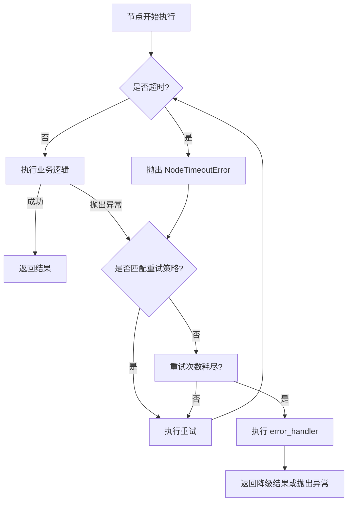

[[09-为什么不能直接把50个工具都给Agent]]
[[10-怎么确保agent能够正确的选择工具，并且处理它的返回结果]] 
生产级错误中间件（ToolErrorMiddleware）

---
简答

我的之前做的项目主要是采用 LangGraph 框架。工具执行报错是我的项目运行中最常见的问题，主要源于工具内部错误、参数不匹配这两种主要错误。我一般首先是根据业务需求判断每个工具的重要度。**根据工具的重要度不同，我们可以设置三层的错误处理策略**，防止由于工具执行报错，造成整个工作流的崩溃。

1. **尽量采用 ToolNode 节点来执行工具**，LangGraph 的 ToolNode 是一个专为工具调用设计的高级抽象节点，它内置了基础的错误处理机制，极大地简化了开发流程。它封装了自动捕获异常机制：任何在工具执行过程中抛出的异常（无论是内部错误还是参数错误）都会被 ToolNode 自动捕获。捕获异常后，ToolNode 不会让整个图崩溃，而是会生成一个特殊的 ToolMessage 对象，其 status 字段被设置为 'error'，并将错误信息填入 content 字段。这个错误消息会被送回给 LLM 来决策，LLM 可以基于错误信息进行自我修正，例如重新生成正确的参数。
    
2. **当 langgraph 内置的 ToolNode 还不能满足需求时**（例如，需要记录日志、触发重试或切换备用工具），可以通过 `.with_fallbacks()` 方法为 ToolNode 添加链式回退策略，这种方法能在 ToolNode 执行失败时，将错误状态传递给一个自定义的回退函数进行处理。
    
3. **最后，针对一些非常重要的工具**，我们还可以通过在 LangGraph 的编译图之前，定义专门的错误处理节点和条件边 (conditional edges)，可以实现精细的流程控制。通过动态路由函数根据状态中的错误信息来判断，决定下一步是否要进入一个专门处理错误信息的节点。在这个专门处理错误信息的节点中，我们可以加入人工介入，来辅助大模型做参数的修正和新的意图识别。


---

详细


在基于LangChain、LangGraph和DeepAgents的Agent系统中，处理Tool执行错误的核心思路是**分层容错**：从最简单的“重试一下”到“换个方式做”，再到“实在不行就交给人工”，形成一个完整的防御体系。

### 🛡️ LangGraph的“容错三件套”

LangGraph从`v1.2.0`开始，在节点层面提供了三个核心容错原语，它们的执行顺序是：`Timeout` -> `RetryPolicy` -> `error_handler`。

1.  **⏱️ 超时 (Timeout)**：为节点执行设置硬性时间上限，防止因外部服务无响应而永久阻塞。
    ```python
    from langgraph.types import TimeoutPolicy
    
    builder.add_node(
        "call_tool",
        call_tool,
        timeout=TimeoutPolicy(run_timeout=30.0)  # 最多执行30秒
    )
    ```
1.  **🔄 重试 (RetryPolicy)**：自动重试因网络抖动、服务暂时不可用等“瞬时错误”而失败的节点。可配置重试次数、指数退避间隔、抖动（Jitter）和针对特定异常的重试。
    ```python
    from langgraph.types import RetryPolicy
    
    retry_policy = RetryPolicy(
        max_attempts=3,           # 最多尝试3次（含首次）
        initial_interval=0.5,     # 首次重试前等待0.5秒
        backoff_factor=2.0,       # 退避倍数
        max_interval=60.0,        # 最大等待间隔
        jitter=True,              # 添加随机抖动，避免"惊群效应" redis里也有这个场景
        retry_on=(ConnectionError, TimeoutError) # 只重试这些异常
    )
    ```

[[12-2-惊群效应 从agent联想到redis再到分布式系统的通用设计]]

1.  **🧑‍⚕️ 错误处理器 (error_handler)**：当所有重试都失败后，执行一个专门的“错误处理节点”来进行恢复。它可以返回兜底数据、记录错误或执行补偿逻辑。
    ```python
    def handle_tool_error(state: State, error: Exception):
        """当工具节点彻底失败时，返回一个友好的错误信息"""
        print(f"工具执行最终失败: {error}")
        # 返回一个错误消息，让 Agent 可以据此进行后续决策
        return {"messages": [("tool", f"抱歉，工具调用失败: {error}")]}

    builder.add_node(
        "call_tool",
        call_tool,
        retry_policy=retry_policy,
        error_handler=handle_tool_error  # 重试耗尽后执行
    )
    ```

#### 执行流程



### 🔧 ToolErrorMiddleware：精细化的工具级错误处理

对于更精细的**工具级别**错误控制，LangChain 提供了 `ToolErrorMiddleware`。

- **核心机制**：它能捕获工具执行过程中的异常，并允许你将其转换为一个 `ToolMessage` 返回给LLM，而不是让整个Agent崩溃。**注意**：它**不负责重试**，重试由 `ToolRetryMiddleware` 处理。
- **使用场景**：当工具因**输入参数错误**（如查询格式不对）而失败时，将错误信息返回给LLM，让LLM自行修正后再次尝试。

```python
from langchain.agents import create_agent
from langchain.agents.middleware import ToolErrorMiddleware

def handle_tool_error(exc: Exception, request) -> str | None:
    if isinstance(exc, ValueError):
        # 将参数错误转为ToolMessage返回给LLM
        return f"工具 '{request.tool_call['name']}' 调用失败，请检查输入参数后重试。错误: {exc}"
    # 对于其他严重错误，直接抛出，中断执行
    return None

agent = create_agent(
    model="your-model",
    tools=[...],
    middleware=[ToolErrorMiddleware(on_error=handle_tool_error)]
)
```

### 🤖 DeepAgents：复杂Agent的错误处理

`deepagents` 构建在LangGraph之上，继承了其容错机制，并针对多Agent协作场景做了扩展。

- **错误传播**：Sub-agent 的错误会向上传播，你需要在主Agent中统一处理。
- **结构化异常**：使用如 `ConfigurationError` 等结构化异常，包含错误代码(`code`)，便于程序化处理。
- **钩子 (Hooks)**：提供 `hooks` 来监听工具执行状态(`tool_status`)，为“成功”或“错误”状态绑定自定义逻辑。

### 📈 最佳实践与演进路线

- **多层防御**：建议采用“即时重试 -> 备用工具 -> 人工干预”的三级策略。
- **智能降级**：当主工具失败时，自动切换到功能相似但更稳定的备用工具。
- **日志与可观测性**：记录完整的错误上下文，对于调试和优化至关重要。LangSmith等工具可以帮助追踪错误根源。
- **演进路线**：
    - **早期**：在节点内部编写大量重复的 `try...except` 代码。
    - **中期**：LangGraph引入 `RetryPolicy`，将重试逻辑从业务代码中解耦。
    - **现在 (`v1.2.0+`)**：提供 `RetryPolicy`, `TimeoutPolicy`, `error_handler` 三件套，实现声明式容错。
    - **未来**：更复杂的补偿逻辑（Saga模式）、与可观测性工具的深度集成等。

总的来说，处理Agent中Tool执行报错，最高效的方式是充分利用LangGraph提供的 **`RetryPolicy`、`TimeoutPolicy` 和 `error_handler`** 这三个原生容错原语，配合 `ToolErrorMiddleware` 进行精细控制，从而构建一个既健壮又智能的Agent系统。