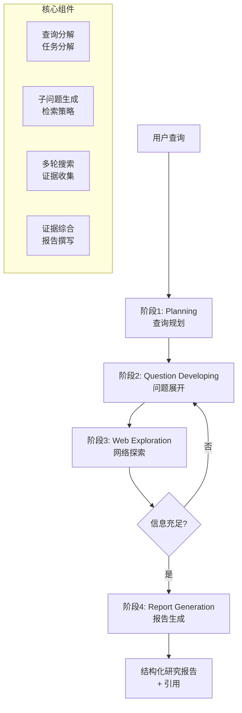
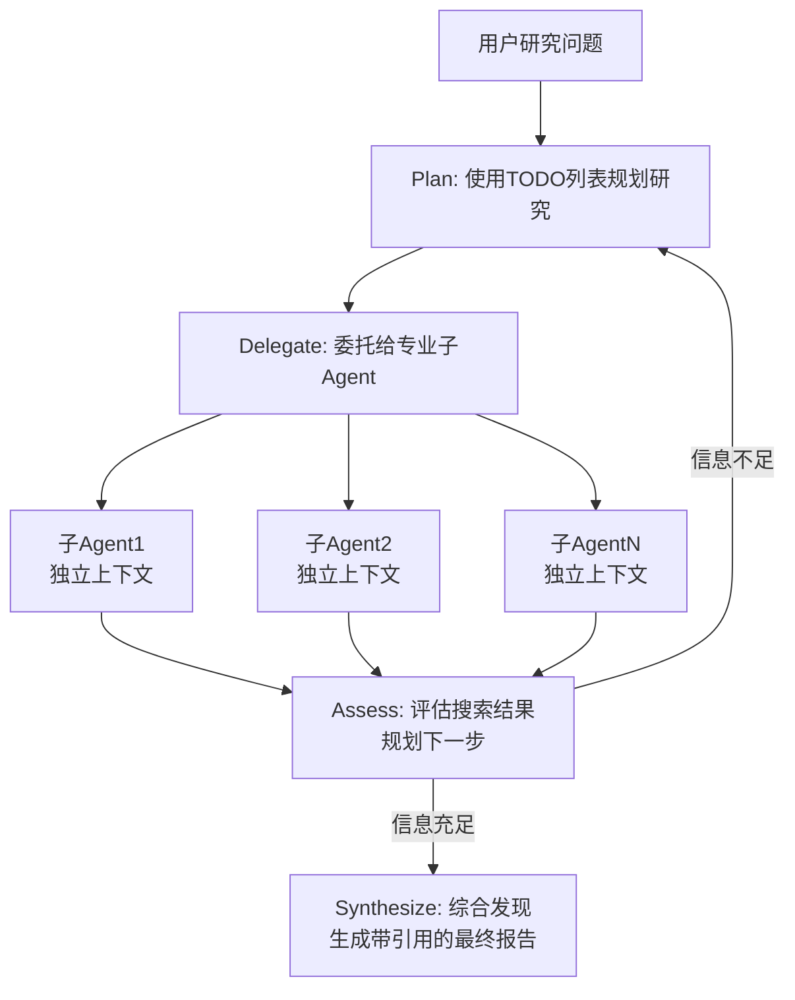

[langchian官方deepresearch教程](https://docs.langchain.com/oss/javascript/deepagents/deep-research)
	

DeepResearch（深度研究）的第一步是深度理解用户的真实意图，接着，把用户输入的提问分解成一系列有逻辑关联的子问题。这个过程可能采用线性的“思维链”（Chain-of-Thought），也可能使用更复杂的“思维树”（Tree-of-Thoughts）来并行探索多条推理路径。

DeepResearch 的实现，其核心是依靠 ReAct 范式的 Agent 框架，即“推理”与“行动”的循环迭代。在一轮 ReAct 循环后，系统并不会直接进入答案生成。Deep Research 的一个关键特性是引入了反思机制。系统会评估已收集信息的充分性，识别知识缺口（Knowledge Gap）。如果发现信息不足、存在矛盾或需要深入，它会自动生成新的、更精准的搜索查询，并开启下一轮 ReAct 循环，直到信息足够完备。这个过程通常有循环次数上限，以避免无限循环。

使用 LangChain 和 LangGraph 是实现 DeepResearch（深度研究）开发是最佳方案。LangChain 提供了与模型、提示词和工具交互的核心组件，而 LangGraph 则擅长编排多步骤的、有状态的智能体工作流。工作流中可以定义引入反思循环的多节点路径。让智能体在获得信息后，评估知识缺口，并自动提出新的搜索问题，进行多轮迭代研究。


## 一、什么是 Deep Research？——从 RAG 到 Agentic Research 的范式转变

### 1.1 核心定义

Deep Research（深度研究）是一种**自主智能体能力**，它使大语言模型能够针对复杂的研究任务，自主进行多步推理和互联网信息检索。与传统的 RAG（检索增强生成）不同，Deep Research 不是被动地消费检索结果，而是**主动的研究 Agent**。

### 1.2 Deep Research vs RAG：本质差异

| 维度 | RAG | Deep Research |
|------|-----|---------------|
| **检索方式** | 单次检索，固定语料库 | 多轮迭代检索，动态开放网络 |
| **工作流** | 静态两阶段流水线（检索→生成） | 动态多步推理，planning→探索→综合循环 |
| **规划能力** | 无自主规划 | 自主分解问题、规划检索路径 |
| **输出** | 基于固定文档的回答 | 带引用的结构化研究报告 |
| **验证机制** | 无 | 多源交叉验证、引用审计 |

传统 RAG 是在预索引语料上做单次检索，工作流是固定管线，输出没有验证机制。而 Deep Research 将 LLM 从被动的信息消费者变成了主动的研究 Agent。

### 1.3 Deep Research 的核心挑战

Deep Research 面临三大核心挑战：

1. **上下文爆炸**：长期研究轨迹超出模型上下文窗口限制
2. **噪声污染**：早期错误与冗余信息层层累积
3. **推理性能下降**：长上下文导致推理质量显著降低

## 二、Deep Research 的核心架构

### 2.1 标准四阶段 Pipeline

根据最新的系统性综述，Deep Research 系统包含四个核心阶段：



### 2.2 四类核心组件

Deep Research 系统包含四个关键组件：

1. **查询规划（Query Planning）** ：将复杂问题分解为可执行的子任务
2. **信息获取（Information Acquisition）** ：通过工具调用（搜索、浏览等）收集证据
3. **记忆管理（Memory Management）** ：管理跨步骤的上下文和检索结果
4. **答案生成（Answer Generation）** ：综合证据生成结构化报告

### 2.3 前沿架构模式

**FS-Researcher（文件系统驱动）** ：

这是一种双 Agent 框架，通过持久化工作区将 Deep Research 扩展到上下文窗口之外：
- **Context Builder Agent**：扮演"图书管理员"，浏览互联网、撰写结构化笔记、将原始资料归档到分层知识库中
- **Report Writer Agent**：逐节撰写最终报告，将知识库作为事实来源

文件系统充当持久的外部记忆和跨 Agent、跨会话的共享协调媒介。

**Argus（证据拼图模式）** ：

将深度研究任务重新建模为从互补性证据碎片中拼合拼图的过程，而非依赖大规模并行计算对答案进行暴力穷举。


## 四、基于 Deep Agents 构建 Deep Research Agent

### 4.1 标准工作流

LangChain 官方 Deep Research 教程的核心流程：



### 4.2 代码示例：构建 Deep Research Agent（Python）

以下基于 LangChain 官方最新文档（2026年7月）：

```python
import os
from typing import Literal
from tavily import TavilyClient
from deepagents import create_deep_agent

# ============ Step 1: 初始化搜索客户端 ============
tavily_client = TavilyClient(api_key=os.environ["TAVILY_API_KEY"])

# ============ Step 2: 定义搜索工具 ============
def internet_search(
    query: str,
    max_results: int = 5,
    topic: Literal["general", "news", "finance"] = "general",
    include_raw_content: bool = False,
):
    """运行网络搜索，获取完整网页内容供Agent分析"""
    return tavily_client.search(
        query,
        max_results=max_results,
        include_raw_content=include_raw_content,
        topic=topic,
    )

# ============ Step 3: 配置系统提示词 ============
research_instructions = """
You are an expert researcher. Your job is to conduct thorough research 
and then write a polished report.

You have access to an internet search tool as your primary means of 
gathering information.

## `internet_search`
Use this to run an internet search for a given query. You can specify 
the max number of results to return, the topic, and whether raw content 
should be included.

## Research Process
1. First, decompose the research question into focused sub-questions
2. Use the TODO list to track your research progress
3. For each sub-question, delegate to specialized sub-agents
4. Synthesize findings with proper citations
5. Write a comprehensive, well-structured report
"""

# ============ Step 4: 创建 Deep Agent ============
agent = create_deep_agent(
    model="google_genai:gemini-3.5-flash",  # 或 "anthropic:claude-sonnet-4-20260514"
    tools=[internet_search],
    system_prompt=research_instructions,
)

# ============ Step 5: 执行研究 ============
result = agent.invoke({
    "messages": [{
        "role": "user",
        "content": "请对GraphRAG技术进行深度研究，涵盖2025-2026年的最新进展、核心论文和开源项目"
    }]
})

print(result["messages"][-1].content)
```

### 4.3 子 Agent 委托模式

Deep Agents 的核心能力之一是**子 Agent 委托**——将专注的研究任务委托给具有独立上下文的子 Agent。

```python
from deepagents import create_deep_agent
from deepagents.middleware.subagents import SubAgentMiddleware

# 定义专门的研究子Agent
research_subagent = {
    "name": "research_specialist",
    "description": "用于深度研究特定子主题的专业研究员",
    "system_prompt": "你是一名专业研究员，专注于深入挖掘特定主题的详细信息。",
    "tools": [internet_search],
}

# 创建带有子Agent中间件的主Agent
agent = create_deep_agent(
    model="anthropic:claude-sonnet-4-20260514",
    tools=[internet_search],
    middleware=[
        SubAgentMiddleware(
            default_tools=[internet_search],
            subagents=[research_subagent],
        )
    ],
    system_prompt="你是研究主管，负责将复杂研究问题分解并委托给专业子Agent。"
)
```

### 4.4 远程子 Agent（Deep Agents v0.5 新特性）

2026年4月，Deep Agents v0.5 引入了**远程子 Agent**能力：

- 与阻塞主 Agent 直到完成的内联子 Agent 不同，远程子 Agent 在后台运行
- 适合需要数分钟而非数秒的任务——如深度研究、大规模代码分析、多步数据管道
- 支持非阻塞后台任务，用户可在子 Agent 并发工作时继续与主 Agent 交互

## 五、Deep Research 的前沿优化技术

### 5.1 Test-Time Scaling（测试时扩展）

Test-Time Scaling 已成为增强 Deep Research 能力的关键范式：

- **顺序扩展**：延长生成过程
- **并行扩展**：验证并选择多个候选输出

FS-Researcher 的实证分析表明，**最终报告质量与分配给 Context Builder 的计算量呈正相关**，验证了文件系统范式下的有效测试时扩展。

### 5.2 Agentic RL 与多智能体蒸馏

O-Researcher（2026年2月）提出了通过**多智能体驱动的合成数据生成工作流**来训练 Deep Research 模型：

- 多 Agent 协作模拟复杂的工具集成推理
- 两阶段训练策略：监督微调 + 新型强化学习方法
- 使开源模型在 Deep Research 基准测试中达到 SOTA

### 5.3 认知脚手架（Cognitive Scaffold）

2026年 ACL 论文提出了 **"从流体上下文到结晶记忆"** 的认知脚手架框架，用于长周期 Deep Research Agent，通过将临时上下文转化为持久记忆来解决上下文爆炸问题。

## 六、评估与基准

Deep Research Agent 的评估标准包括：

| 评估维度 | 说明 |
|---------|------|
| 整体质量（Overall Quality） | 报告的整体有用性和完整性 |
| 相关性（Relevance） | 内容与问题的相关程度 |
| 结构（Structure） | 报告组织的逻辑性 |
| 正确性（Correctness） | 事实准确性 |
|  groundedness | 内容是否有证据支撑 |
| 完整性（Completeness） | 是否覆盖了所有重要方面 |

主流基准包括 **DeepResearch Bench** 和 **DeepResearch Bench II**。NVIDIA AI-Q 是目前在这两个榜单上排名前列的 Deep Research Agent。

## 七、总结

Deep Research 代表了从传统 RAG 到**自主研究 Agent** 的范式转变。基于 LangChain/LangGraph/Deep Agents 技术栈的实现，核心在于：

1. **Planning（规划）** ：使用 TODO 列表和结构化任务分解
2. **Delegation（委托）** ：通过子 Agent 实现并行、上下文隔离的研究
3. **Context Management（上下文管理）** ：通过文件系统、摘要和卸载管理长上下文
4. **Synthesis（综合）** ：带引用的结构化报告生成

随着 Deep Agents v0.5 的远程子 Agent、Agentic RL 训练技术以及 Test-Time Scaling 等前沿方法的不断演进，Deep Research Agent 的能力边界正在持续扩展。