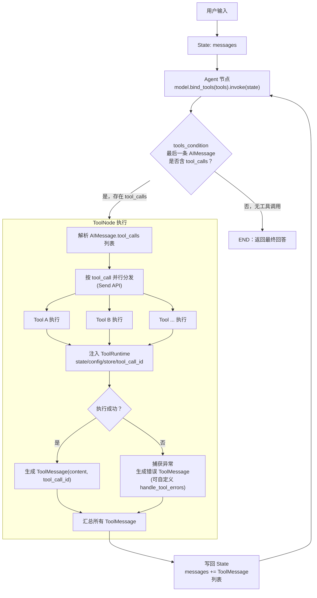
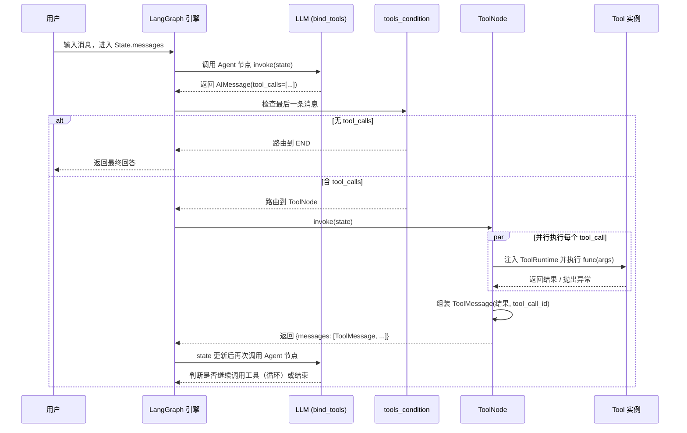

**注意以下几点：**

**一、工具的定义与封装：**  
在定义工具时，为其提供清晰、具体的描述至关重要，这直接决定了 Agent 能否在正确的场景下选择并调用它。对于复杂工具，可以使用 Pydantic 数据模型类明确定义输入参数的结构和类型，这能极大提高参数传递的准确性。而且可以自动做类型转换。对于工具数量超过 30 个以上的场景下，需要对 Agent 进行任务拆分，变成多个子 Agent 分别管理不同的工具列表。

**二、一般我们都会采用 langchain 提供的 ReAct 范式的 Agent，**  
LangChain 将工具的描述信息动态地构建到提示词中，引导 LLM 进行推理实现意图识别和决策，LLM 首先分析用户输入，判断是否需要调用工具以及需要调用哪个工具；如果决定调用工具，LLM 会根据工具的要求，从输入中提取或生成合适的参数。然后执行工具，工具的执行结果会被添加回对话上下文中，LLM 会根据当前所有信息（包括原始问题、之前的思考和工具结果）决定下一步是继续调用工具还是给出最终答案。对于，依赖网络请求的工具（如调用外部 API），网络不稳定是常见错误源。需要设置合理的超时 (Timeout) 时间 和重试机制。对于其他工具的错误，一定要捕获异常，并设置合理的自动重试机制和备用的返回提醒。


# LangGraph 最新版工具调用（Tool Calling）流程详解

LangGraph 最新版（`langgraph.prebuilt` + `create_agent`）的工具调用机制核心组件是：`@tool` 装饰器、`bind_tools()`、`ToolNode`、`tools_condition`，以及新引入的 `ToolRuntime`。整体是一个"LLM 决策 → Graph 路由 → ToolNode 执行 → 结果回流"的循环。

## 核心概念

**两步式调用模式**：LLM 本身**不执行**工具，它只是返回一条包含 `tool_calls` 字段的 `AIMessage`，说明"我要调用哪个工具、传什么参数"。真正的执行由图中独立的 `ToolNode` 负责，执行结果封装成 `ToolMessage` 送回状态（state），再交给 LLM 判断是否继续调用或给出最终回答。工具调用在 LangGraph 中遵循两步模式：第一步，LLM 决定调用哪个工具及参数，但并不亲自执行，而是返回一条包含工具调用请求的消息；第二步，由单独的 tools 节点执行这些请求并将结果作为 tool 消息返回。结果流回 LLM 后，LLM 可以决定继续调用更多工具或生成最终回复；LLM 负责推理和工具选择，tools 节点负责执行，二者之间的条件边构成了 agent 循环。

`ToolNode` 本身的职责：在 LangGraph 工作流中执行工具的节点，处理函数调用、状态注入、持久化存储和控制流等工具执行模式，并管理并行执行与错误处理。官方建议：当需要对工具执行进行精细控制（例如自定义路由逻辑、专门的错误处理或非标准 agent 架构）时使用 ToolNode 搭建自定义工作流；对于标准 ReAct 风格的 agent，建议直接用 create_agent，它内部已经用 ToolNode 搭配好了 agent 循环、条件路由和错误处理的合理默认值。

新版还引入了 `ToolRuntime`（区别于 `langgraph.runtime.Runtime`），在工具函数参数里声明 `runtime: ToolRuntime` 即可自动注入：当前图状态 `state`、当前调用 ID `tool_call_id`、`config`、共享的 `context`/`store`/`stream_writer`，以及全部可用工具列表 `tools`——不再需要 `Annotated` 包装。

## 流程图（Mermaid Flowchart）



## 时序图（Mermaid Sequence Diagram）



## 代码示例（体现流程）

```python
from typing import Annotated
from typing_extensions import TypedDict
from langgraph.graph import StateGraph, START, END
from langgraph.graph.message import add_messages
from langgraph.prebuilt import ToolNode, tools_condition, ToolRuntime
from langchain_core.tools import tool
from langchain_openai import ChatOpenAI

class State(TypedDict):
    messages: Annotated[list, add_messages]

@tool
def get_weather(location: str, runtime: ToolRuntime) -> str:
    """查询指定地点的天气。"""
    # runtime.state / runtime.store / runtime.tool_call_id 均可用
    return f"{location} 今天晴，25°C"

tools = [get_weather]
model = ChatOpenAI(model="gpt-4o").bind_tools(tools)

def call_model(state: State):
    return {"messages": [model.invoke(state["messages"])]}

graph = StateGraph(State)
graph.add_node("agent", call_model)
graph.add_node("tools", ToolNode(tools))
graph.add_edge(START, "agent")
graph.add_conditional_edges("agent", tools_condition)  # 有 tool_calls → "tools"，否则 → END
graph.add_edge("tools", "agent")  # 执行完工具后回到 agent，形成循环

app = graph.compile()
```

## 几个关键设计点

- **`tools_condition`**：实现了 ReAct 风格 agent 的标准条件逻辑——如果最后一条 AIMessage 包含 tool_calls，就路由到工具执行节点，否则结束流程；这一模式是绝大多数工具调用 agent 架构的基础。
- **并行执行**：一条 `AIMessage` 里可能同时包含多个 `tool_calls`，`ToolNode` 通过 Send API 将工具调用并行分发，这也是 create_agent 中用来支持并行工具调用以及人在环（human-in-the-loop）场景（图执行可能被无限期暂停）的机制。
- **错误处理**：如果调用参数不合法，这类异常仅在通过 ToolNode 调用工具时才会被抛出。默认情况下 `ToolNode` 会把异常捕获并转成一条错误 `ToolMessage` 返回给模型，而不是让整个图崩溃，也可以自定义处理逻辑。
- **`create_agent` vs `ToolNode` 手搭**：如果只是标准 ReAct agent，直接用高层的 `create_agent` 即可，内部已经封装好上述整套循环；只有需要自定义路由/错误处理/非标准架构时才建议手动组装 `ToolNode`。

需要我针对某个具体场景（比如人在环审批、状态注入、多 agent 工具路由）再展开一张更细的图吗？