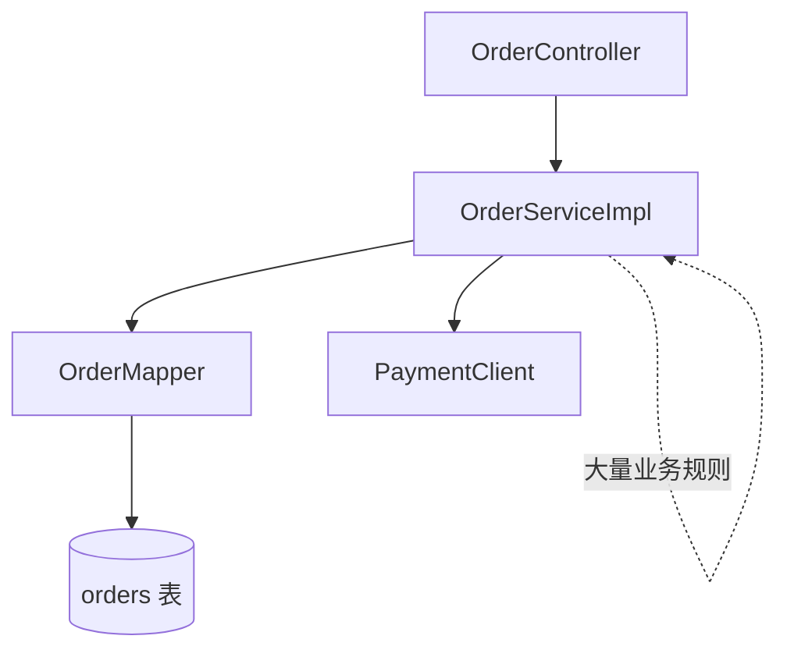
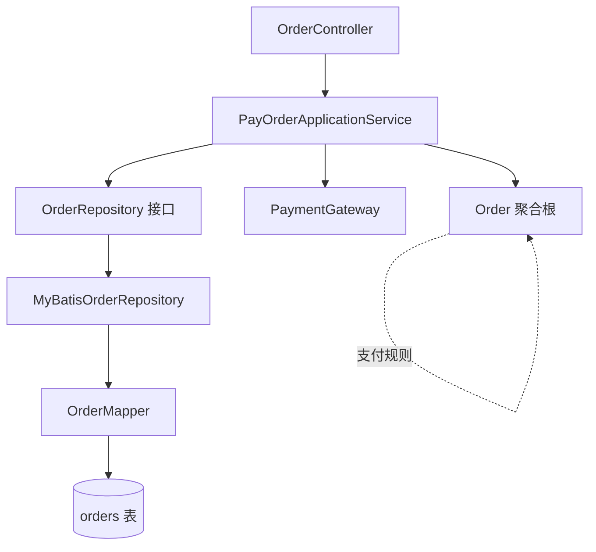

先不谈抽象概念，用一个“小型电商下单/支付”例子来演示：先给出典型 MVC 写法，再一步步拆出 Command、应用服务、领域模型、Repository、基础设施实现。重点不是追求完整项目，而是让你看到“业务逻辑从 Service 搬进领域模型”的过程。

![[DDD电商案例.png]]

---
# 把一个 MVC 项目重构成 DDD：以“订单支付”为例

我们用一个非常典型的后端场景：

> 用户创建订单，然后支付订单。

假设原来是一个传统 Spring Boot + MyBatis-Plus 的 MVC 项目。

---

# 1. 原始 MVC 项目结构

很多项目一开始是这样：

```text
com.example.shop
├── controller
│   └── OrderController.java
├── service
│   ├── OrderService.java
│   └── impl
│       └── OrderServiceImpl.java
├── mapper
│   └── OrderMapper.java
├── entity
│   └── Order.java
├── dto
│   ├── CreateOrderRequest.java
│   └── PayOrderRequest.java
└── common
    └── Result.java
```

这种结构很常见：

```text
Controller -> Service -> Mapper -> Database
```

---

# 2. 原始 MVC 代码

## 2.1 Order 实体

```java
@Data
@TableName("orders")
public class Order {

    private Long id;

    private Long userId;

    private BigDecimal totalAmount;

    /**
     * 1 = 待支付
     * 2 = 已支付
     * 3 = 已取消
     */
    private Integer status;

    private LocalDateTime createdAt;

    private LocalDateTime paidAt;
}
```

这个 `Order` 本质上是数据库表映射对象。

它没有业务行为，只有字段。

---

## 2.2 Controller

```java
@RestController
@RequestMapping("/orders")
@RequiredArgsConstructor
public class OrderController {

    private final OrderService orderService;

    @PostMapping
    public Result<Long> createOrder(@RequestBody CreateOrderRequest request) {
        Long orderId = orderService.createOrder(request);
        return Result.ok(orderId);
    }

    @PostMapping("/{orderId}/pay")
    public Result<Void> payOrder(
            @PathVariable Long orderId,
            @RequestBody PayOrderRequest request
    ) {
        orderService.payOrder(orderId, request);
        return Result.ok();
    }
}
```

Controller 看起来还可以，主要问题在 Service。

---

## 2.3 Service

```java
@Service
@RequiredArgsConstructor
public class OrderServiceImpl implements OrderService {

    private final OrderMapper orderMapper;
    private final PaymentClient paymentClient;

    @Override
    @Transactional
    public Long createOrder(CreateOrderRequest request) {
        if (request.getUserId() == null) {
            throw new RuntimeException("用户不能为空");
        }

        if (request.getTotalAmount() == null ||
            request.getTotalAmount().compareTo(BigDecimal.ZERO) <= 0) {
            throw new RuntimeException("订单金额必须大于 0");
        }

        Order order = new Order();
        order.setUserId(request.getUserId());
        order.setTotalAmount(request.getTotalAmount());
        order.setStatus(1);
        order.setCreatedAt(LocalDateTime.now());

        orderMapper.insert(order);

        return order.getId();
    }

    @Override
    @Transactional
    public void payOrder(Long orderId, PayOrderRequest request) {
        Order order = orderMapper.selectById(orderId);

        if (order == null) {
            throw new RuntimeException("订单不存在");
        }

        if (!order.getStatus().equals(1)) {
            throw new RuntimeException("只有待支付订单可以支付");
        }

        if (order.getTotalAmount().compareTo(BigDecimal.ZERO) <= 0) {
            throw new RuntimeException("订单金额异常");
        }

        boolean success = paymentClient.pay(
                request.getPaymentMethod(),
                order.getTotalAmount()
        );

        if (!success) {
            throw new RuntimeException("支付失败");
        }

        order.setStatus(2);
        order.setPaidAt(LocalDateTime.now());

        orderMapper.updateById(order);
    }
}
```

这就是典型的 MVC + 事务脚本风格。

---

# 3. 这个 MVC 项目的问题在哪里？

表面看没什么问题。

但是随着业务增长，它会变成这样：

```java
public void payOrder(Long orderId, PayOrderRequest request) {
    // 查订单
    // 判断订单是否存在
    // 判断订单是否待支付
    // 判断订单金额
    // 判断用户状态
    // 判断优惠券
    // 判断库存
    // 调支付接口
    // 更新订单状态
    // 记录支付流水
    // 发积分
    // 发 MQ
    // 通知用户
    // 同步 ERP
    // 写操作日志
}
```

`OrderServiceImpl` 会越来越胖。

问题本质是：

> 业务规则全部堆在 Service 里，Order 对象自己不知道什么叫“支付”。

---

# 4. DDD 重构目标

我们不是为了“换包名”。

我们要做的是：

```text
原来：
Service 判断订单能不能支付，然后 setStatus(2)

重构后：
Order 自己知道能不能支付，外部只能调用 order.pay(...)
```

也就是从：

```java
if (order.getStatus().equals(1)) {
    order.setStatus(2);
}
```

变成：

```java
order.pay(paymentId);
```

这一步是 DDD 最关键的体感。

---

# 5. 重构后的 DDD 包结构

可以改成这样：

```text
com.example.shop.order
├── interfaces
│   ├── OrderController.java
│   ├── request
│   │   ├── CreateOrderRequest.java
│   │   └── PayOrderRequest.java
│   └── response
│       └── CreateOrderResponse.java
│
├── application
│   ├── CreateOrderApplicationService.java
│   ├── PayOrderApplicationService.java
│   └── command
│       ├── CreateOrderCommand.java
│       └── PayOrderCommand.java
│
├── domain
│   ├── model
│   │   ├── Order.java
│   │   ├── OrderId.java
│   │   ├── UserId.java
│   │   ├── Money.java
│   │   └── OrderStatus.java
│   ├── repository
│   │   └── OrderRepository.java
│   └── event
│       └── OrderPaidEvent.java
│
└── infrastructure
    ├── persistence
    │   ├── OrderDO.java
    │   ├── OrderMapper.java
    │   ├── MyBatisOrderRepository.java
    │   └── OrderConverter.java
    └── payment
        ├── PaymentGateway.java
        └── MockPaymentGateway.java
```

先不用害怕结构多。

核心分成四层：

|层|作用|
|---|---|
|interfaces|接收 HTTP 请求|
|application|编排业务用例|
|domain|放核心业务模型和规则|
|infrastructure|数据库、MyBatis、支付接口等技术实现|

---

# 6. 第一步：把数据库 Entity 改名为 DO

原来的 `Order` 其实不是领域对象，而是数据库对象。

所以先把它改名为 `OrderDO`。

```java
@Data
@TableName("orders")
public class OrderDO {

    private Long id;

    private Long userId;

    private BigDecimal totalAmount;

    private Integer status;

    private LocalDateTime createdAt;

    private LocalDateTime paidAt;
}
```

Mapper 也改成操作 `OrderDO`：

```java
@Mapper
public interface OrderMapper extends BaseMapper<OrderDO> {
}
```

这一步的目的：

> 先把“数据库模型”和“领域模型”分开。

---

# 7. 第二步：建立领域对象 Order

现在我们重新创建一个真正的领域模型：

```java
public class Order {

    private final OrderId id;
    private final UserId userId;
    private final Money totalAmount;
    private OrderStatus status;
    private final LocalDateTime createdAt;
    private LocalDateTime paidAt;

    private Order(
            OrderId id,
            UserId userId,
            Money totalAmount,
            OrderStatus status,
            LocalDateTime createdAt,
            LocalDateTime paidAt
    ) {
        this.id = id;
        this.userId = userId;
        this.totalAmount = totalAmount;
        this.status = status;
        this.createdAt = createdAt;
        this.paidAt = paidAt;
    }

    public static Order create(UserId userId, Money totalAmount) {
        if (userId == null) {
            throw new DomainException("用户不能为空");
        }

        if (totalAmount == null || totalAmount.isZeroOrNegative()) {
            throw new DomainException("订单金额必须大于 0");
        }

        return new Order(
                null,
                userId,
                totalAmount,
                OrderStatus.PENDING_PAYMENT,
                LocalDateTime.now(),
                null
        );
    }

    public void pay(PaymentId paymentId) {
        if (this.status != OrderStatus.PENDING_PAYMENT) {
            throw new DomainException("只有待支付订单可以支付");
        }

        if (this.totalAmount.isZeroOrNegative()) {
            throw new DomainException("订单金额异常");
        }

        this.status = OrderStatus.PAID;
        this.paidAt = LocalDateTime.now();
    }

    public OrderId id() {
        return id;
    }

    public UserId userId() {
        return userId;
    }

    public Money totalAmount() {
        return totalAmount;
    }

    public OrderStatus status() {
        return status;
    }

    public LocalDateTime createdAt() {
        return createdAt;
    }

    public LocalDateTime paidAt() {
        return paidAt;
    }
}
```

注意这里的变化。

原来是：

```java
order.setStatus(2);
```

现在是：

```java
order.pay(paymentId);
```

这就是 DDD 的核心收益：

> 状态变化不再是裸字段修改，而是有业务含义的行为。

---

# 8. 第三步：引入值对象

## 8.1 OrderId

```java
public record OrderId(Long value) {

    public OrderId {
        if (value == null || value <= 0) {
            throw new IllegalArgumentException("订单 ID 非法");
        }
    }
}
```

## 8.2 UserId

```java
public record UserId(Long value) {

    public UserId {
        if (value == null || value <= 0) {
            throw new IllegalArgumentException("用户 ID 非法");
        }
    }
}
```

## 8.3 Money

```java
public record Money(BigDecimal amount) {

    public Money {
        if (amount == null) {
            throw new IllegalArgumentException("金额不能为空");
        }
    }

    public boolean isZeroOrNegative() {
        return amount.compareTo(BigDecimal.ZERO) <= 0;
    }
}
```

## 8.4 OrderStatus

```java
public enum OrderStatus {

    PENDING_PAYMENT(1),
    PAID(2),
    CANCELLED(3);

    private final int code;

    OrderStatus(int code) {
        this.code = code;
    }

    public int code() {
        return code;
    }

    public static OrderStatus fromCode(Integer code) {
        for (OrderStatus status : values()) {
            if (status.code == code) {
                return status;
            }
        }
        throw new IllegalArgumentException("未知订单状态：" + code);
    }
}
```

这样代码里不再到处出现：

```java
1
2
3
```

而是：

```java
OrderStatus.PENDING_PAYMENT
OrderStatus.PAID
OrderStatus.CANCELLED
```

---

# 9. 第四步：定义 Repository 接口

Repository 接口放在 domain 层。

```java
public interface OrderRepository {

    Order save(Order order);

    Optional<Order> findById(OrderId orderId);
}
```

注意：

> domain 层只定义接口，不关心 MyBatis、JPA、SQL 怎么实现。

---

# 10. 第五步：用 Infrastructure 实现 Repository

## 10.1 Converter

领域模型和数据库模型需要互转：

```java
public class OrderConverter {

    public static OrderDO toDO(Order order) {
        OrderDO orderDO = new OrderDO();

        if (order.id() != null) {
            orderDO.setId(order.id().value());
        }

        orderDO.setUserId(order.userId().value());
        orderDO.setTotalAmount(order.totalAmount().amount());
        orderDO.setStatus(order.status().code());
        orderDO.setCreatedAt(order.createdAt());
        orderDO.setPaidAt(order.paidAt());

        return orderDO;
    }

    public static Order toDomain(OrderDO orderDO) {
        return new Order(
                new OrderId(orderDO.getId()),
                new UserId(orderDO.getUserId()),
                new Money(orderDO.getTotalAmount()),
                OrderStatus.fromCode(orderDO.getStatus()),
                orderDO.getCreatedAt(),
                orderDO.getPaidAt()
        );
    }
}
```

这里有一个小问题：前面的 `Order` 构造器是 private。

所以实际项目中可以加一个专门用于重建对象的方法：

```java
public static Order restore(
        OrderId id,
        UserId userId,
        Money totalAmount,
        OrderStatus status,
        LocalDateTime createdAt,
        LocalDateTime paidAt
) {
    return new Order(id, userId, totalAmount, status, createdAt, paidAt);
}
```

然后 Converter 改成：

```java
public static Order toDomain(OrderDO orderDO) {
    return Order.restore(
            new OrderId(orderDO.getId()),
            new UserId(orderDO.getUserId()),
            new Money(orderDO.getTotalAmount()),
            OrderStatus.fromCode(orderDO.getStatus()),
            orderDO.getCreatedAt(),
            orderDO.getPaidAt()
    );
}
```

---

## 10.2 MyBatis Repository 实现

```java
@Repository
@RequiredArgsConstructor
public class MyBatisOrderRepository implements OrderRepository {

    private final OrderMapper orderMapper;

    @Override
    public Order save(Order order) {
        OrderDO orderDO = OrderConverter.toDO(order);

        if (orderDO.getId() == null) {
            orderMapper.insert(orderDO);
        } else {
            orderMapper.updateById(orderDO);
        }

        return OrderConverter.toDomain(orderDO);
    }

    @Override
    public Optional<Order> findById(OrderId orderId) {
        OrderDO orderDO = orderMapper.selectById(orderId.value());

        if (orderDO == null) {
            return Optional.empty();
        }

        return Optional.of(OrderConverter.toDomain(orderDO));
    }
}
```

现在 Application Service 只依赖 `OrderRepository`，不直接依赖 `OrderMapper`。

---

# 11. 第六步：定义 Command

Controller 接收的是 Request。

Application Service 接收的是 Command。

## 11.1 CreateOrderCommand

```java
public record CreateOrderCommand(
        Long userId,
        BigDecimal totalAmount
) {
}
```

## 11.2 PayOrderCommand

```java
public record PayOrderCommand(
        Long orderId,
        String paymentMethod
) {
}
```

为什么不直接把 Request 传给 Application Service？

因为 Request 是 HTTP 层对象。

Command 是应用用例对象。

这样后面即使这个用例不是从 HTTP 来，而是从 MQ、定时任务、RPC 来，也可以复用 Application Service。

---

# 12. 第七步：拆出 Application Service

原来的 `OrderServiceImpl` 做了太多事。

现在拆成两个用例服务：

```text
CreateOrderApplicationService
PayOrderApplicationService
```

---

## 12.1 CreateOrderApplicationService

```java
@Service
@RequiredArgsConstructor
public class CreateOrderApplicationService {

    private final OrderRepository orderRepository;

    @Transactional
    public OrderId create(CreateOrderCommand command) {
        Order order = Order.create(
                new UserId(command.userId()),
                new Money(command.totalAmount())
        );

        Order savedOrder = orderRepository.save(order);

        return savedOrder.id();
    }
}
```

这个应用服务很薄。

核心规则不在这里，而在：

```java
Order.create(...)
```

---

## 12.2 PayOrderApplicationService

```java
@Service
@RequiredArgsConstructor
public class PayOrderApplicationService {

    private final OrderRepository orderRepository;
    private final PaymentGateway paymentGateway;

    @Transactional
    public void pay(PayOrderCommand command) {
        Order order = orderRepository.findById(new OrderId(command.orderId()))
                .orElseThrow(() -> new NotFoundException("订单不存在"));
		//gateway调client完成支付
        PaymentResult paymentResult = paymentGateway.pay(
                command.paymentMethod(),
                order.totalAmount()
        );

        if (!paymentResult.success()) {
            throw new ApplicationException("支付失败");
        }
		//domain执行pay,修改状态
        order.pay(paymentResult.paymentId());
		//持久化
        orderRepository.save(order);
    }
}
```

这里的职责是：

```text
1. 查订单
2. 调支付网关
3. 让订单执行 pay 行为
4. 保存订单
```

它不负责判断“订单能不能支付”。

这个规则在：

```java
order.pay(...)
```

里面。

---

# 13. 第八步：支付接口也抽象出来

原来的代码可能直接依赖外部支付 Client：

```java
paymentClient.pay(...)
```

DDD 里更推荐定义一个 Gateway 接口。

```java
public interface PaymentGateway {

    PaymentResult pay(String paymentMethod, Money amount);
}
```

返回结果：

```java
public record PaymentResult(
        boolean success,
        PaymentId paymentId
) {
}
```

支付 ID：

```java
public record PaymentId(String value) {

    public PaymentId {
        if (value == null || value.isBlank()) {
            throw new IllegalArgumentException("支付 ID 不能为空");
        }
    }
}
```

基础设施实现：

```java
@Component
@RequiredArgsConstructor
public class MockPaymentGateway implements PaymentGateway {

    private final PaymentClient paymentClient;

    @Override
    public PaymentResult pay(String paymentMethod, Money amount) {
        String paymentId = paymentClient.pay(paymentMethod, amount.amount());

        return new PaymentResult(
                paymentId != null,
                new PaymentId(paymentId)
        );
    }
}
```

这样领域/应用层不需要知道具体调用的是支付宝、微信支付、Stripe，还是一个 Mock 服务。

---

# 14. 第九步：改造 Controller

Controller 从调用 `OrderService`，改成调用应用服务。

```java
@RestController
@RequestMapping("/orders")
@RequiredArgsConstructor
public class OrderController {

    private final CreateOrderApplicationService createOrderApplicationService;
    private final PayOrderApplicationService payOrderApplicationService;

    @PostMapping
    public Result<Long> createOrder(@RequestBody CreateOrderRequest request) {
        CreateOrderCommand command = new CreateOrderCommand(
                request.getUserId(),
                request.getTotalAmount()
        );

        OrderId orderId = createOrderApplicationService.create(command);

        return Result.ok(orderId.value());
    }

    @PostMapping("/{orderId}/pay")
    public Result<Void> payOrder(
            @PathVariable Long orderId,
            @RequestBody PayOrderRequest request
    ) {
        PayOrderCommand command = new PayOrderCommand(
                orderId,
                request.getPaymentMethod()
        );

        payOrderApplicationService.pay(command);

        return Result.ok();
    }
}
```

Controller 现在只做三件事：

```text
1. 接收 HTTP 参数
2. 转成 Command
3. 调用 Application Service
```

---

# 15. 重构前后核心对比

## 重构前

```java
if (!order.getStatus().equals(1)) {
    throw new RuntimeException("只有待支付订单可以支付");
}

order.setStatus(2);
order.setPaidAt(LocalDateTime.now());

orderMapper.updateById(order);
```

问题：

```text
1. 1 和 2 是魔法值
2. 状态流转规则散落在 Service
3. 任何地方都可以 setStatus
4. Order 自己没有业务能力
```

---

## 重构后

```java
order.pay(paymentResult.paymentId());

orderRepository.save(order);
```

规则集中在领域模型：

```java
public void pay(PaymentId paymentId) {
    if (this.status != OrderStatus.PENDING_PAYMENT) {
        throw new DomainException("只有待支付订单可以支付");
    }

    if (this.totalAmount.isZeroOrNegative()) {
        throw new DomainException("订单金额异常");
    }

    this.status = OrderStatus.PAID;
    this.paidAt = LocalDateTime.now();
}
```

好处：

```text
1. 代码表达业务语义
2. 支付规则集中在 Order 内部
3. 外部不能随便修改状态
4. 后续加规则更自然
```

---

# 16. 如果新增一个需求，差异会更明显

新增需求：

> 订单支付前，如果订单已经取消，不能支付；如果订单超过 30 分钟未支付，也不能支付。

---

## MVC 写法通常会这样改

```java
if (order.getStatus().equals(3)) {
    throw new RuntimeException("已取消订单不能支付");
}

if (order.getCreatedAt().plusMinutes(30).isBefore(LocalDateTime.now())) {
    throw new RuntimeException("订单已超时，不能支付");
}

if (!order.getStatus().equals(1)) {
    throw new RuntimeException("只有待支付订单可以支付");
}

order.setStatus(2);
```

这些规则继续堆在 Service。

---

## DDD 写法

只改 `Order.pay()`：

```java
public void pay(PaymentId paymentId) {
    if (this.status == OrderStatus.CANCELLED) {
        throw new DomainException("已取消订单不能支付");
    }

    if (this.status != OrderStatus.PENDING_PAYMENT) {
        throw new DomainException("只有待支付订单可以支付");
    }

    if (this.createdAt.plusMinutes(30).isBefore(LocalDateTime.now())) {
        throw new DomainException("订单已超时，不能支付");
    }

    if (this.totalAmount.isZeroOrNegative()) {
        throw new DomainException("订单金额异常");
    }

    this.status = OrderStatus.PAID;
    this.paidAt = LocalDateTime.now();
}
```

调用方完全不用变：

```java
order.pay(paymentResult.paymentId());
orderRepository.save(order);
```

这就是 DDD 的优势：

> 业务规则变化时，优先修改领域模型，而不是到处找 Service、Controller、Mapper、SQL。

---

# 17. 再新增“取消订单”功能

## MVC 写法

通常加在 `OrderServiceImpl`：

```java
@Transactional
public void cancelOrder(Long orderId) {
    Order order = orderMapper.selectById(orderId);

    if (order == null) {
        throw new RuntimeException("订单不存在");
    }

    if (order.getStatus().equals(2)) {
        throw new RuntimeException("已支付订单不能取消");
    }

    if (order.getStatus().equals(3)) {
        throw new RuntimeException("订单已经取消");
    }

    order.setStatus(3);
    orderMapper.updateById(order);
}
```

---

## DDD 写法

在 `Order` 里加行为：

```java
public void cancel() {
    if (this.status == OrderStatus.PAID) {
        throw new DomainException("已支付订单不能取消");
    }

    if (this.status == OrderStatus.CANCELLED) {
        throw new DomainException("订单已经取消");
    }

    this.status = OrderStatus.CANCELLED;
}
```

Application Service：

```java
@Service
@RequiredArgsConstructor
public class CancelOrderApplicationService {

    private final OrderRepository orderRepository;

    @Transactional
    public void cancel(Long orderId) {
        Order order = orderRepository.findById(new OrderId(orderId))
                .orElseThrow(() -> new NotFoundException("订单不存在"));

        order.cancel();

        orderRepository.save(order);
    }
}
```

调用方仍然很薄。

---

# 18. 你会发现 DDD 的真正变化

不是目录从：

```text
controller service mapper entity
```

变成：

```text
interfaces application domain infrastructure
```

真正变化是：

## MVC 思维

```text
Service 操作数据对象
```

```java
order.setStatus(2);
orderMapper.updateById(order);
```

## DDD 思维

```text
应用服务编排用例，领域对象执行业务行为
```

```java
order.pay(paymentId);
orderRepository.save(order);
```

---

# 19. 用一张图看重构前后

## 重构前：MVC



特点：

```text
Service 是业务规则中心。
Order 只是数据容器。
```

---

## 重构后：DDD



特点：

```text
Application Service 编排流程。
Order 聚合根保护业务规则。
Repository 屏蔽数据库细节。
Gateway 屏蔽外部支付细节。
```

---

# 20. 初学者可以这样理解每一层

| 层                   | 初学者理解     | 例子                        |
| ------------------- | --------- | ------------------------- |
| Controller          | 接 HTTP 请求 | `/orders/{id}/pay`        |
| Application Service | 编排一个用例    | 支付订单流程                    |
| Domain Model        | 业务规则本体    | Order 能不能 pay             |
| Repository          | 保存/读取聚合   | 保存 Order                  |
| Infrastructure      | 技术实现      | MyBatis、Redis、HTTP Client |
| Command             | 用例输入参数    | PayOrderCommand           |
| DO                  | 数据库表对象    | OrderDO                   |
| DTO                 | 接口传输对象    | PayOrderRequest           |

---

# 21. 不是所有代码都要 DDD 化

比如订单列表查询：

```java
@GetMapping
public Result<List<OrderListResponse>> listOrders(OrderListQuery query) {
    return Result.ok(orderQueryService.listOrders(query));
}
```

查询服务可以直接用 Mapper：

```java
@Service
@RequiredArgsConstructor
public class OrderQueryService {

    private final OrderQueryMapper orderQueryMapper;

    public List<OrderListResponse> listOrders(OrderListQuery query) {
        return orderQueryMapper.listOrders(query);
    }
}
```

为什么？

因为查询通常不改变业务状态，不需要复杂领域模型保护一致性。

所以可以采用：

```text
写操作：DDD
读操作：DTO + SQL
```

这就是 CQRS 的务实版本。
**CQRS** 是 **Command Query Responsibility Segregation**（命令查询职责分离）的缩写。

---

# 22. 重构顺序建议

不要一次性全项目重构。

推荐顺序：

## 第一步：先找一个核心用例

比如：

```text
支付订单
取消订单
生成 Wiki 草稿
发布文章
提交审核
```

不要从“用户列表查询”这种 CRUD 开始。

---

## 第二步：把数据库对象改成 DO

```text
Order -> OrderDO
```

明确它只是数据库表映射。

---

## 第三步：新建领域对象

```text
domain/model/Order.java
```

把核心规则搬进去：

```java
order.pay(...)
order.cancel(...)
```

---

## 第四步：抽 Repository 接口

```java
public interface OrderRepository {
    Optional<Order> findById(OrderId id);
    Order save(Order order);
}
```

---

## 第五步：Infrastructure 实现 Repository

用 MyBatis 或 JPA 都可以。

```java
MyBatisOrderRepository implements OrderRepository
```

---

## 第六步：把原 Service 改成 Application Service

原来：

```java
OrderServiceImpl.payOrder(...)
```

重构后：

```java
PayOrderApplicationService.pay(...)
```

它只编排，不堆规则。

---

## 第七步：Controller 改调用 Application Service

Controller 保持薄。

---

# 23. 一个非常实用的判断标准

你看到这种代码，就说明还停留在 MVC 事务脚本：

```java
if (order.getStatus().equals(1)) {
    order.setStatus(2);
}
```

你看到这种代码，就开始有 DDD 的味道：

```java
order.pay(paymentId);
```

再进一步：

```java
order.cancel();
order.timeout();
order.refund();
order.confirmReceipt();
```

这些方法就是领域行为。

---

# 24. 回到你的 DevWiki Studio，可以怎么类比？

比如现在有一个 MVC 风格的“生成 Wiki 草稿”逻辑：

```java
public Long generateWikiDraft(Long sourceId) {
    Source source = sourceMapper.selectById(sourceId);

    if (source == null) {
        throw new RuntimeException("Source 不存在");
    }

    if (!source.getStatus().equals("INGESTED")) {
        throw new RuntimeException("Source 尚未完成摄取");
    }

    List<Chunk> chunks = chunkMapper.selectBySourceId(sourceId);

    String content = aiClient.generate(chunks);

    WikiDraft draft = new WikiDraft();
    draft.setSourceId(sourceId);
    draft.setContent(content);
    draft.setStatus("PENDING_REVIEW");

    wikiDraftMapper.insert(draft);

    return draft.getId();
}
```

DDD 化之后，核心会变成：

```java
Source source = sourceRepository.findById(command.sourceId())
        .orElseThrow(() -> new NotFoundException("Source 不存在"));

source.ensureReadyForWikiGeneration();

List<Chunk> chunks = chunkRepository.findBySourceId(source.id());

GeneratedWikiContent generatedContent = wikiGenerator.generate(source, chunks);

WikiDraft draft = WikiDraft.createFrom(source.id(), generatedContent);

wikiDraftRepository.save(draft);
```

其中：

```java
source.ensureReadyForWikiGeneration();
```

和：

```java
WikiDraft.createFrom(...)
```

就是领域模型开始承担业务规则的体现。

---

# 25. 最小总结

把 MVC 项目重构成 DDD，不是简单改目录。

核心是这几个动作：

```text
1. 把数据库 Entity 改成 DO。
2. 新建真正的 Domain Model。
3. 把业务规则从 Service 搬进 Domain Model。
4. 用 Application Service 编排用例。
5. 用 Repository 屏蔽数据库细节。
6. 用 Gateway 屏蔽外部系统调用。
7. 读操作可以继续简单 SQL + DTO。
```

最关键的一句话：

> MVC 里，Service 操作数据；DDD 里，应用服务调度领域对象完成业务行为。

从代码体感上说，就是从：

```java
order.setStatus(2);
```

升级成：

```java
order.pay(paymentId);
```