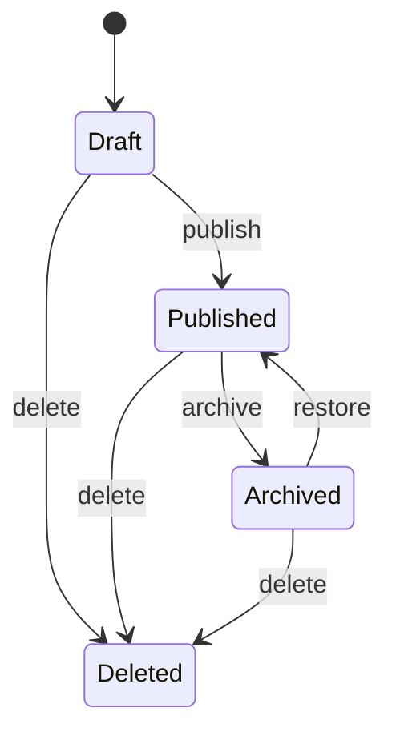

# 总述
实体，是依托于持久化层数据以领域服务功能目标为指导设计的领域对象。持久化PO对象是原子类对象，不具有业务语义，而实体对象是具有业务语义且有唯一标识的对象，跟随于领域服务方法的全生命周期对象。如：用户PO持久化对象，会涵盖，用户的开户实体、授信实体、额度实体对象。也包括如商品下单时候的购物车实体对象。这个对象也通常是领域服务方法的入参对象。

- 概念：实体 = 唯一标识 + 状态属性 + 行为动作（功能），是DDD中的一个基本构建块，它代表了具有唯一标识的领域对象。实体不仅仅包含数据（状态属性），还包含了相关的行为（功能），并且它的标识在整个生命周期中保持不变。
- 特征：
    - **唯一标识**：实体具有一个可以区分其他实体的标识符。这个标识符可以是一个ID、一个复合键或者是一个自然键，关键是它能够唯一地标识实体实例。
    - **领域标识**：实体的标识通常来源于业务领域，例如用户ID、订单ID等。这些标识符在业务上有特定的含义，并且在系统中是唯一的。
    - **委派标识**：在某些情况下，实体的标识可能是由ORM（对象关系映射）框架自动生成的，如数据库中的自增主键。这种标识符虽然可以唯一标识实体，但它并不直接来源于业务领域。
- 用途：
    - **表达业务概念**：实体用于在软件中表达具体的业务概念，如用户、订单、交易等。通过实体的属性和行为，可以描述这些业务对象的特征和能力。
    - **封装业务逻辑**：实体不仅仅承载数据，还封装了业务规则和逻辑。这些逻辑包括验证数据的有效性、执行业务规则、计算属性值等。这样做的目的是保证业务逻辑的集中和一致性。
    - **保持数据一致性**：实体负责维护自身的状态和数据一致性。它确保自己的属性和关联关系在任何时候都是正确和完整的，从而避免数据的不一致性。
- 实现手段：
    - **定义实体类**：在代码中定义一个类，该类包含实体的属性、构造函数、方法等。
    - **实现唯一标识**：为实体类提供一个唯一标识的属性，如ID，并确保在实体的生命周期中这个标识保持不变。
    - **封装行为**：在实体类中实现业务逻辑的方法，这些方法可以操作实体的状态，并执行相关的业务规则。
    - **使用ORM框架**：利用ORM框架将实体映射到数据库表中，这样可以简化数据持久化的操作。
    - **实现领域服务**：对于跨实体或跨聚合的操作，可以实现领域服务来处理这些操作，而不是在实体中直接实现。
    - **使用领域事件**：当实体的状态发生变化时，可以发布领域事件，这样可以通知其他部分的系统进行相应的处理。


![[Pasted image 20260509231921.png]]

# DDD 里的实体对象：Entity

DDD 里的 **实体对象 Entity**，不是简单的数据库 Entity。
它的核心定义是：

> **实体是有唯一身份标识，并且会在生命周期中持续变化的领域对象。**

关键词是：

```text
唯一身份
生命周期
状态变化
业务行为
领域规则
```

---

# 一、实体对象是什么？

在 DDD 中，实体对象代表一个具有业务身份的对象。

比如：

```text
用户 User
订单 Order
文章 Article
课程 Course
账户 Account
商品 Product
帖子 Post
评论 Comment
```

这些对象都有一个共同点：

> 即使它的属性发生变化，我们仍然认为它是同一个对象。

例如一个用户改了昵称：

```text
用户 ID：1001
昵称：SeaFall -> z
邮箱：a@example.com -> b@example.com
```

虽然昵称、邮箱都变了，但只要用户 ID 还是 `1001`，它就是同一个用户。

这就是实体。

---

# 二、实体和普通对象的区别

普通对象可能只是数据容器：

```java
public class User {
    private Long id;
    private String name;
    private String email;
}
```

但 DDD 实体不只是字段集合，它应该承载领域行为：

```java
public class User {

    private UserId id;
    private Username username;
    private Email email;
    private UserStatus status;

    public void changeEmail(Email newEmail) {
        if (this.status == UserStatus.DISABLED) {
            throw new IllegalStateException("禁用用户不能修改邮箱");
        }

        this.email = newEmail;
    }

    public void disable() {
        if (this.status == UserStatus.DISABLED) {
            return;
        }

        this.status = UserStatus.DISABLED;
    }
}
```

DDD 里的实体更强调：

```text
不是“有哪些字段”
而是“这个对象能做什么、必须遵守什么规则”
```

---

# 三、实体的核心特征

## 1. 有唯一身份标识

实体最重要的特点是有 ID。

例如：

```java
public class Article {

    private ArticleId id;
    private ArticleTitle title;
    private ArticleContent content;
    private ArticleStatus status;
}
```

其中：

```java
public record ArticleId(Long value) {
    public ArticleId {
        if (value == null || value <= 0) {
            throw new IllegalArgumentException("文章 ID 不合法");
        }
    }
}
```

这里 `ArticleId` 就是实体的身份。

两个文章对象是否相等，不看标题、内容，而主要看 ID：

```text
Article(id=1, title="DDD 入门")
Article(id=1, title="DDD 进阶")
```

它们仍然是同一篇文章，因为 ID 相同。

---

## 2. 有生命周期

实体通常会经历状态变化。

以文章为例：

```text
草稿 Draft
已发布 Published
已归档 Archived
已删除 Deleted
```

这就是文章实体的生命周期。

可以用状态机理解：



实体不是一次性数据，而是会随着业务流程不断演进。

---

## 3. 有业务行为

DDD 实体不应该只是 getter / setter。

错误写法：

```java
public class Article {

    private Long id;
    private String title;
    private String content;
    private Integer status;

    public void setStatus(Integer status) {
        this.status = status;
    }
}
```

这种写法的问题是：

```text
外部可以随便改状态
业务规则散落在 Service 里
实体本身没有表达业务语义
```

更好的写法：

```java
public class Article {

    private ArticleId id;
    private ArticleTitle title;
    private ArticleContent content;
    private ArticleStatus status;

    public void publish() {
        if (this.status != ArticleStatus.DRAFT) {
            throw new IllegalStateException("只有草稿文章才能发布");
        }

        if (this.content.isBlank()) {
            throw new IllegalStateException("空文章不能发布");
        }

        this.status = ArticleStatus.PUBLISHED;
    }

    public void archive() {
        if (this.status != ArticleStatus.PUBLISHED) {
            throw new IllegalStateException("只有已发布文章才能归档");
        }

        this.status = ArticleStatus.ARCHIVED;
    }

    public void rename(ArticleTitle newTitle) {
        if (this.status == ArticleStatus.DELETED) {
            throw new IllegalStateException("已删除文章不能改标题");
        }

        this.title = newTitle;
    }
}
```

这才是 DDD 实体的味道：

```text
publish()
archive()
rename()
```

这些方法是业务行为，而不是机械 setter。

---

# 四、实体和 Value Object 的区别

你刚问过 VO，这里可以直接对比。

|对比项|Entity 实体|Value Object 值对象|
|---|---|---|
|是否有 ID|有|没有|
|是否有生命周期|有|通常没有|
|是否可变|通常可变|通常不可变|
|相等判断|根据 ID|根据属性值|
|例子|User、Order、Article|Email、Money、Address、ArticleTitle|

例如：

```java
Article article = new Article(
    new ArticleId(1L),
    new ArticleTitle("DDD 入门"),
    new ArticleContent("...")
);
```

这里：

```text
Article       -> 实体 Entity
ArticleId     -> 值对象 Value Object，也可以作为实体身份
ArticleTitle  -> 值对象
ArticleContent -> 值对象
```

---

# 五、实体和数据库 Entity 不是一回事

这是 Java 开发者最容易踩坑的地方。

很多项目里会有：

```java
@TableName("article")
public class ArticleEntity {
    private Long id;
    private String title;
    private String content;
    private Integer status;
}
```

这种对象通常是：

```text
数据库表映射对象
PO
DO
DataObject
Persistence Entity
ORM Entity
```

它不一定是 DDD Entity。

DDD Entity 是领域模型，重点是业务规则。

数据库 Entity 是持久化模型，重点是字段映射。

---

## 对比一下

|对象|关注点|典型位置|
|---|---|---|
|DDD Entity|业务身份、状态、行为、规则|domain/model|
|ORM Entity / PO|数据库字段、表结构、ORM 映射|infrastructure/persistence|
|Response VO|接口返回字段|interfaces/response|
|DTO|跨层传输|application/dto|

---

## 普通 ORM Entity

```java
@TableName("article")
public class ArticlePO {

    private Long id;
    private String title;
    private String content;
    private Integer status;
    private LocalDateTime createdAt;
    private LocalDateTime updatedAt;
}
```

它主要解决：

```text
怎么和 article 表对应
字段名怎么映射
怎么被 MyBatis-Plus 查询
```

---

## DDD Entity

```java
public class Article {

    private ArticleId id;
    private ArticleTitle title;
    private ArticleContent content;
    private ArticleStatus status;

    public void publish() {
        if (status != ArticleStatus.DRAFT) {
            throw new IllegalStateException("只有草稿文章才能发布");
        }

        if (content.isBlank()) {
            throw new IllegalStateException("空文章不能发布");
        }

        this.status = ArticleStatus.PUBLISHED;
    }
}
```

它主要解决：

```text
文章什么时候能发布
文章什么时候能归档
文章标题是否合法
文章状态怎么流转
```

---

# 六、实体应该放业务逻辑，还是 Service 放业务逻辑？

DDD 的倾向是：

> 能放在实体里的领域规则，优先放进实体。

例如：

```java
article.publish();
```

比下面这种更好：

```java
articleService.publish(article);
```

尤其是这种贫血模型：

```java
public void publish(Long articleId) {
    Article article = articleRepository.findById(articleId);

    if (article.getStatus() != ArticleStatus.DRAFT) {
        throw new IllegalStateException("只有草稿文章才能发布");
    }

    if (article.getContent().isBlank()) {
        throw new IllegalStateException("空文章不能发布");
    }

    article.setStatus(ArticleStatus.PUBLISHED);

    articleRepository.save(article);
}
```

这段逻辑并不是不能跑，但问题是：

```text
Article 自己不知道自己如何发布
规则散落在 Service
其他地方也可能绕过规则直接 setStatus
模型表达能力弱
```

更 DDD 的写法：

```java
public void publish(Long articleId) {
    Article article = articleRepository.findById(new ArticleId(articleId));

    article.publish();

    articleRepository.save(article);
}
```

这样 Application Service 负责流程编排：

```text
查文章
调用领域行为
保存文章
发事件
```

而 Article 负责自己的业务规则：

```text
是否能发布
发布后状态怎么变
```

---

# 七、实体不是越大越好

实体要放业务行为，但不是所有逻辑都塞进去。

实体适合放：

```text
和自身状态强相关的业务规则
自身状态变更
自身不变量校验
自身生命周期行为
```

例如 Article 适合放：

```java
publish()
archive()
rename()
changeContent()
delete()
```

不适合放：

```java
sendPublishNotification()
syncToSearchEngine()
calculateAuthorRank()
generateRecommendFeed()
```

这些更适合放在：

```text
Application Service
Domain Service
Event Handler
Infrastructure Service
```

---

# 八、实体和聚合根的关系

在 DDD 里，实体还会涉及一个更重要的概念：

> 聚合 Aggregate。

一个聚合里可以有多个实体和值对象，但只有一个聚合根 Aggregate Root。

外部访问聚合内部对象，必须通过聚合根。

例如订单模型：

```text
Order 订单，聚合根
 ├── OrderItem 订单项，实体
 ├── Money 金额，值对象
 └── Address 收货地址，值对象
```

这里：

```text
Order 是实体，也是聚合根
OrderItem 是实体，但不是聚合根
Money 是值对象
Address 是值对象
```

---

## 示例

```java
public class Order {

    private OrderId id;
    private List<OrderItem> items;
    private OrderStatus status;
    private Address shippingAddress;

    public void addItem(ProductId productId, ProductName productName, Money price, int quantity) {
        if (status != OrderStatus.DRAFT) {
            throw new IllegalStateException("只有草稿订单才能添加商品");
        }

        OrderItem item = new OrderItem(
            OrderItemId.newId(),
            productId,
            productName,
            price,
            quantity
        );

        this.items.add(item);
    }

    public void submit() {
        if (items.isEmpty()) {
            throw new IllegalStateException("空订单不能提交");
        }

        this.status = OrderStatus.SUBMITTED;
    }
}
```

外部不应该直接这样：

```java
order.getItems().add(item);
```

而应该通过聚合根：

```java
order.addItem(productId, productName, price, quantity);
```

原因是：

```text
聚合根负责保护内部一致性
```

---

# 九、实体应该怎么设计？

## 1. 先找业务身份

问自己：

```text
这个对象在业务上是否需要被持续追踪？
它是否有唯一 ID？
属性变了之后，它还是不是同一个东西？
```

例如：

```text
User 改名后还是同一个用户 -> Entity
Order 状态变了还是同一个订单 -> Entity
Article 改标题后还是同一篇文章 -> Entity
Email 变了就是另一个邮箱值 -> Value Object
Money 金额变了就是另一个金额值 -> Value Object
```

---

## 2. 再找生命周期

例如 Article：

```text
Draft -> Published -> Archived -> Deleted
```

Order：

```text
Created -> Submitted -> Paid -> Shipped -> Completed -> Canceled
```

Account：

```text
Active -> Frozen -> Closed
```

实体的行为通常就来自这些状态流转。

---

## 3. 找行为，而不是找字段

不要一上来就想：

```text
Article 有哪些字段？
```

而是先想：

```text
Article 能做什么？
Article 什么时候能发布？
Article 什么时候能修改？
Article 删除后还能不能恢复？
Article 发布后内容能不能修改？
```

字段是为行为服务的。

---

# 十、结合你的 DevWiki / Blog 项目举例

假设你有一个文章系统。

## 领域实体：Article

```java
public class Article {

    private ArticleId id;
    private ArticleTitle title;
    private ArticleContent content;
    private ArticleStatus status;
    private AuthorId authorId;
    private LocalDateTime createdAt;
    private LocalDateTime publishedAt;

    public Article(
            ArticleId id,
            ArticleTitle title,
            ArticleContent content,
            AuthorId authorId
    ) {
        this.id = id;
        this.title = title;
        this.content = content;
        this.authorId = authorId;
        this.status = ArticleStatus.DRAFT;
        this.createdAt = LocalDateTime.now();
    }

    public void rename(ArticleTitle newTitle) {
        ensureNotDeleted();
        this.title = newTitle;
    }

    public void reviseContent(ArticleContent newContent) {
        ensureNotDeleted();
        this.content = newContent;
    }

    public void publish() {
        ensureNotDeleted();

        if (status != ArticleStatus.DRAFT) {
            throw new IllegalStateException("只有草稿文章才能发布");
        }

        if (content.isBlank()) {
            throw new IllegalStateException("文章内容为空，不能发布");
        }

        this.status = ArticleStatus.PUBLISHED;
        this.publishedAt = LocalDateTime.now();
    }

    public void archive() {
        if (status != ArticleStatus.PUBLISHED) {
            throw new IllegalStateException("只有已发布文章才能归档");
        }

        this.status = ArticleStatus.ARCHIVED;
    }

    public void delete() {
        if (status == ArticleStatus.DELETED) {
            return;
        }

        this.status = ArticleStatus.DELETED;
    }

    private void ensureNotDeleted() {
        if (status == ArticleStatus.DELETED) {
            throw new IllegalStateException("已删除文章不能修改");
        }
    }

    public ArticleId getId() {
        return id;
    }

    public ArticleStatus getStatus() {
        return status;
    }
}
```

注意这里没有暴露：

```java
setStatus()
setTitle()
setContent()
```

因为状态改变应该通过业务方法完成。

---

## 值对象：ArticleTitle

```java
public record ArticleTitle(String value) {

    private static final int MAX_LENGTH = 100;

    public ArticleTitle {
        if (value == null || value.isBlank()) {
            throw new IllegalArgumentException("文章标题不能为空");
        }

        if (value.length() > MAX_LENGTH) {
            throw new IllegalArgumentException("文章标题不能超过 100 个字符");
        }
    }
}
```

---

## 值对象：ArticleContent

```java
public record ArticleContent(String value) {

    public ArticleContent {
        if (value == null) {
            throw new IllegalArgumentException("文章内容不能为 null");
        }
    }

    public boolean isBlank() {
        return value.isBlank();
    }
}
```

---

## 枚举：ArticleStatus

```java
public enum ArticleStatus {
    DRAFT,
    PUBLISHED,
    ARCHIVED,
    DELETED
}
```

---

# 十一、Application Service 怎么调用实体？

DDD 不是不要 Service，而是 Service 的职责要清楚。

```java
@Service
public class ArticleApplicationService {

    private final ArticleRepository articleRepository;

    public ArticleApplicationService(ArticleRepository articleRepository) {
        this.articleRepository = articleRepository;
    }

    @Transactional
    public void publishArticle(Long articleId) {
        Article article = articleRepository.findById(new ArticleId(articleId))
                .orElseThrow(() -> new IllegalArgumentException("文章不存在"));

        article.publish();

        articleRepository.save(article);
    }
}
```

这里：

|层|职责|
|---|---|
|Controller|接收 HTTP 请求|
|Application Service|编排用例|
|Entity|执行业务行为和规则|
|Repository|加载和保存聚合|
|Infrastructure|实现数据库访问|

---

# 十二、实体对象的 equals / hashCode 怎么写？

DDD Entity 的相等性通常基于身份 ID。

示意：

```java
public class Article {

    private ArticleId id;

    @Override
    public boolean equals(Object o) {
        if (this == o) {
            return true;
        }

        if (!(o instanceof Article article)) {
            return false;
        }

        return id != null && id.equals(article.id);
    }

    @Override
    public int hashCode() {
        return id != null ? id.hashCode() : System.identityHashCode(this);
    }
}
```

不过实际工程里要注意：

```text
1. 新创建但还没持久化的实体，可能暂时没有 ID
2. 使用 ORM 代理类时 equals 可能有坑
3. 聚合内实体的 ID 可能只在聚合内唯一
```

所以实践中也可以保守处理：

```text
领域模型少依赖 equals/hashCode
明确通过 id 比较
集合去重时小心未持久化实体
```

---

# 十三、实体对象和贫血模型

Java 后端常见的传统写法是贫血模型：

```java
public class Article {
    private Long id;
    private String title;
    private String content;
    private Integer status;

    // getter/setter
}
```

业务逻辑在 Service：

```java
public void publish(Long articleId) {
    Article article = articleMapper.selectById(articleId);

    if (article.getStatus() != 0) {
        throw new RuntimeException("不能发布");
    }

    if (article.getContent() == null || article.getContent().isBlank()) {
        throw new RuntimeException("内容为空");
    }

    article.setStatus(1);
    articleMapper.updateById(article);
}
```

DDD 更倾向于充血模型：

```java
article.publish();
```

区别不是“代码放哪儿”这么简单，而是：

```text
贫血模型：数据和行为分离
充血模型：数据和行为绑定
```

DDD 实体的目标是让领域对象自己保护自己的业务一致性。

---

# 十四、实体对象的常见误区

## 误区 1：把数据库表直接当 DDD Entity

不一定对。

数据库表是数据结构，DDD Entity 是业务模型。

一个领域实体可能对应：

```text
一张表
多张表
部分表字段
甚至不直接对应表
```

---

## 误区 2：实体里只有字段，没有行为

这种更像 POJO / PO / DO，不像 DDD Entity。

实体至少应该有一些业务方法：

```text
publish()
cancel()
pay()
freeze()
rename()
archive()
assignRole()
```

---

## 误区 3：所有对象都设计成 Entity

不是所有对象都需要 ID。

例如：

```text
Email
Money
Address
DateRange
ArticleTitle
Coordinates
```

这些通常应该是 Value Object。

如果滥用实体，会导致：

```text
模型复杂
ID 泛滥
持久化复杂
业务语义变弱
```

---

## 误区 4：实体里调用数据库、HTTP、MQ

一般不建议。

实体应该保持领域纯净：

```java
public class Article {
    public void publish() {
        // 不要在这里发 MQ
        // 不要在这里查数据库
        // 不要在这里调 HTTP
    }
}
```

这些应该交给：

```text
Repository
Application Service
Domain Service
Domain Event Handler
Infrastructure Adapter
```

---

# 十五、什么时候该建 Entity？

你可以用这个判断：

```text
1. 这个对象是否有业务身份？
2. 它是否需要被持续追踪？
3. 它的状态是否会随时间变化？
4. 属性变化后，它是否仍然是同一个对象？
5. 它是否有自己的业务行为？
```

如果答案大多是“是”，它很可能是实体。

例如：

|概念|是否 Entity|原因|
|---|--:|---|
|User|是|有用户 ID，生命周期长|
|Order|是|有订单号，状态持续变化|
|Article|是|有文章 ID，可编辑、发布、归档|
|Comment|通常是|有评论 ID，可删除、审核|
|Email|否|没身份，只是一个值|
|Money|否|金额变了就是另一个值|
|Address|通常否|多数场景只是值|
|OrderItem|可能是|如果需要独立跟踪则是实体，否则也可做值对象|

---

# 十六、一句话总结

DDD 里的实体对象 Entity 是：

> **有唯一身份、有生命周期、会发生状态变化、并且封装业务行为和领域规则的对象。**

它不是简单的数据库表映射对象，也不是 getter/setter 数据壳。

在你的 Java 后端项目里可以这样记：

```text
数据库 Entity / PO：
    关心表结构和字段映射

DDD Entity：
    关心业务身份、生命周期、状态流转和业务规则

Value Object：
    关心值本身和不变量，没有独立身份

Response / VO：
    关心接口返回给前端的数据结构
```

最实用的设计原则是：

```text
让实体对象自己维护自己的合法状态。
不要让外部代码随便 setStatus、setAmount、setOwner。
用 publish()、cancel()、pay()、freeze() 这类业务方法表达状态变化。
```