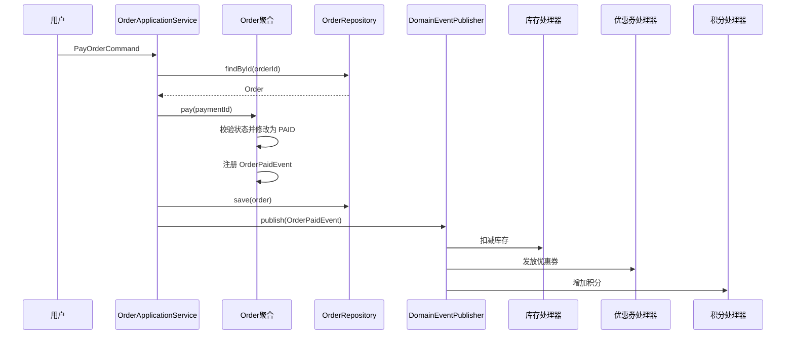

# DDD 里的领域事件：它不是“消息队列事件”那么简单

你前面学了：

- 实体 Entity
    
- 值对象 Value Object
    
- 聚合 Aggregate
    
- 聚合根 Aggregate Root
    
- 充血模型
    
- 仓储 Repository
    
- 应用服务 Application Service
    
- 触发器 Trigger
    
- 限界上下文 Bounded Context
    

这里还缺一个很关键的拼图：

> **领域事件 Domain Event。**

一句话：

> **领域事件表示：领域中已经发生的一件有业务意义的事实。**

注意关键词：**已经发生**、**业务意义**、**事实**。

---

# 1. 领域事件到底是什么？

比如电商订单系统里：

```text
订单已创建
订单已支付
订单已取消
库存已扣减
优惠券已发放
支付已完成
```

这些都可以是领域事件。

对应代码可能是：

```java
OrderPaidEvent
OrderCreatedEvent
OrderCancelledEvent
InventoryDeductedEvent
CouponIssuedEvent
PaymentCompletedEvent
```

它们不是命令，不是在说“请你做什么”。

而是在说：

```text
某件业务事实已经发生了。
```

例如：

```java
public record OrderPaidEvent(
        Long orderId,
        Long userId,
        String paymentId,
        BigDecimal amount,
        LocalDateTime paidAt
) {}
```

这个事件表达的是：

> 订单已经支付成功了。

---

# 2. 领域事件和普通 MQ 消息有什么区别？

很多初学者会把领域事件直接理解成 Kafka、RabbitMQ、RocketMQ 里的消息。

这不完全对。

## 领域事件是领域建模概念

它属于业务模型的一部分。

比如：

```text
OrderPaidEvent
```

它首先表达的是：

> 在订单领域里，“订单已支付”是一个重要业务事实。

至于它最后要不要发 MQ，是技术实现问题。

---

## MQ 消息是技术通信手段

MQ 关注的是：

```text
怎么投递？
怎么消费？
怎么重试？
怎么保证顺序？
怎么处理死信？
怎么保证幂等？
```

而领域事件关注的是：

```text
业务上发生了什么？
谁关心这件事？
这个事实会触发哪些后续业务？
```

所以关系是：

```text
领域事件 ≠ MQ 消息

领域事件可以被转换成 MQ 消息
MQ 消息也可以承载领域事件
但二者不是同一层概念
```

---

# 3. 为什么 DDD 需要领域事件？

核心原因：**降低模型之间的直接耦合。**

假设订单支付成功之后，要做这些事：

```text
1. 修改订单状态为 PAID
2. 扣减库存
3. 增加积分
4. 发优惠券
5. 发送短信
6. 通知物流系统
7. 生成账单
```

如果你在 `Order.pay()` 里面直接写：

```java
public void pay(String paymentId) {
    this.status = OrderStatus.PAID;

    inventoryService.deduct(...);
    pointService.add(...);
    couponService.issue(...);
    smsService.send(...);
    logisticsService.notify(...);
    billService.create(...);
}
```

这就很糟糕。

因为 `Order` 聚合直接知道了库存、积分、优惠券、短信、物流、账单。

这违反了聚合的边界。

订单模型会越来越胖，最后变成一个巨型上帝对象。

---

更好的方式是：

```java
public void pay(String paymentId) {
    if (this.status != OrderStatus.PENDING_PAYMENT) {
        throw new IllegalStateException("订单当前状态不允许支付");
    }

    this.status = OrderStatus.PAID;
    this.paymentId = paymentId;
    this.paidAt = LocalDateTime.now();

    this.registerEvent(new OrderPaidEvent(
            this.id,
            this.userId,
            paymentId,
            this.totalAmount,
            this.paidAt
    ));
}
```

订单聚合只做自己该做的事：

```text
维护订单状态
校验订单支付规则
记录订单已支付这个事实
```

后续谁关心 `OrderPaidEvent`，由事件处理器处理。

---

# 4. 领域事件解决的核心问题

领域事件主要解决四类问题。

## 4.1 解耦聚合与聚合

DDD 有一个重要原则：

> **聚合之间不要直接修改彼此。**

订单支付成功后，不能让 `Order` 直接操作 `Inventory` 聚合：

```java
order.pay();
inventory.deduct();
```

应用服务可以编排，但领域模型之间最好不要互相侵入。

更推荐：

```text
Order 支付成功
  ↓
发布 OrderPaidEvent
  ↓
Inventory 模块监听事件
  ↓
扣减库存
```

这样订单上下文不需要知道库存内部怎么实现。

---

## 4.2 支撑领域外最终一致性

你之前已经接触过这句话：

> **领域内事务一致性，领域外最终一致性。**

这句话和领域事件高度相关。

例如在订单上下文内：

```text
订单状态从 PENDING_PAYMENT -> PAID
```

这必须在一个事务内完成。

但是订单支付后通知库存、积分、优惠券，不一定要和订单状态修改放在一个数据库事务里。

可以是：

```text
订单事务提交成功
  ↓
发布 OrderPaidEvent
  ↓
库存服务异步扣减
  ↓
积分服务异步增加
  ↓
优惠券服务异步发放
```

也就是：

```text
订单上下文内：强一致
订单上下文外：最终一致
```

---

## 4.3 表达业务流程中的重要事实

领域事件本身也是一种建模语言。

当你看到这些事件：

```java
OrderCreatedEvent
OrderPaidEvent
OrderCancelledEvent
OrderRefundedEvent
```

你其实就能看出订单领域的生命周期：

```text
创建 -> 支付 -> 取消 / 退款
```

它不仅是代码，也是业务知识的记录。

---

## 4.4 让副作用处理更清晰

订单支付成功后发短信、发站内信、写操作日志、发积分，这些其实都是副作用。

如果全部塞进应用服务，代码会变成：

```java
@Transactional
public void payOrder(PayOrderCommand command) {
    Order order = orderRepository.findById(command.orderId());
    order.pay(command.paymentId());
    orderRepository.save(order);

    smsService.send(...);
    pointService.add(...);
    couponService.issue(...);
    logService.record(...);
}
```

可以工作，但业务增长后会越来越乱。

用事件后：

```text
OrderPaidEvent
  ├── DeductInventoryHandler
  ├── AddPointHandler
  ├── IssueCouponHandler
  ├── SendSmsHandler
  └── CreateBillHandler
```

每个处理器只关心自己的事情。

---

# 5. 领域事件应该在哪里产生？

一般在**聚合内部产生**。

因为聚合最清楚业务规则什么时候成立。

例如：

```java
public class Order {

    private Long id;
    private Long userId;
    private OrderStatus status;
    private Money totalAmount;
    private String paymentId;
    private LocalDateTime paidAt;

    private final List<DomainEvent> domainEvents = new ArrayList<>();

    public void pay(String paymentId) {
        if (status != OrderStatus.PENDING_PAYMENT) {
            throw new IllegalStateException("只有待支付订单可以支付");
        }

        this.status = OrderStatus.PAID;
        this.paymentId = paymentId;
        this.paidAt = LocalDateTime.now();

        registerEvent(new OrderPaidEvent(
                this.id,
                this.userId,
                paymentId,
                this.totalAmount.amount(),
                this.paidAt
        ));
    }

    private void registerEvent(DomainEvent event) {
        this.domainEvents.add(event);
    }

    public List<DomainEvent> pullDomainEvents() {
        List<DomainEvent> events = new ArrayList<>(domainEvents);
        domainEvents.clear();
        return events;
    }
}
```

关键点：

```text
order.pay() 不只是 setStatus(PAID)
order.pay() 是一个业务行为
这个业务行为内部产生 OrderPaidEvent
```

这就是充血模型的味道。

---

# 6. 领域事件应该由谁发布？

通常有几种方式。

## 方式一：应用服务发布

这是最容易理解的方式。

```java
@Transactional
public void payOrder(PayOrderCommand command) {
    Order order = orderRepository.findById(command.orderId());

    order.pay(command.paymentId());

    orderRepository.save(order);

    domainEventPublisher.publish(order.pullDomainEvents());
}
```

流程是：

```text
应用服务加载聚合
  ↓
调用领域行为
  ↓
保存聚合
  ↓
发布领域事件
```

优点：简单直观。

缺点：如果事件发布失败，事务和事件一致性要额外处理。

---

## 方式二：事务提交后发布

更严谨的做法是：

```text
先提交数据库事务
事务成功后再发布事件
```

因为如果数据库事务回滚了，事件就不应该被外部消费。

例如 Spring 里可以用：

```java
@TransactionalEventListener(phase = TransactionPhase.AFTER_COMMIT)
```

表示事务提交后再处理。

简化示例：

```java
@Component
public class OrderPaidEventHandler {

    @TransactionalEventListener(phase = TransactionPhase.AFTER_COMMIT)
    public void handle(OrderPaidEvent event) {
        // 事务提交后执行
        // 可以发送 MQ、通知其他模块、写日志等
    }
}
```

这比在事务中直接发 MQ 更安全。

---

## 方式三：Outbox Pattern

在企业项目里，更稳的是 **Outbox Pattern**。

流程：

```text
1. 订单状态修改为 PAID
2. 同一个本地事务里，把 OrderPaidEvent 写入 outbox_event 表
3. 事务提交
4. 后台任务扫描 outbox_event 表
5. 投递到 MQ
6. 投递成功后标记事件已发送
```

这样可以解决经典问题：

```text
数据库提交成功了，但 MQ 发送失败怎么办？
MQ 发送成功了，但数据库提交失败怎么办？
```

Outbox 的核心思想是：

> **业务数据和事件记录在同一个本地事务里保存。**

这样至少保证：

```text
只要订单状态成功变成 PAID，事件记录也一定存在。
```

---

# 7. 领域事件的代码结构

一个简化结构可以这样设计。

```java
public interface DomainEvent {
    String eventId();
    LocalDateTime occurredAt();
}
```

```java
public record OrderPaidEvent(
        String eventId,
        Long orderId,
        Long userId,
        String paymentId,
        BigDecimal amount,
        LocalDateTime occurredAt
) implements DomainEvent {}
```

聚合根基类：

```java
public abstract class AggregateRoot {

    private final List<DomainEvent> domainEvents = new ArrayList<>();

    protected void registerEvent(DomainEvent event) {
        domainEvents.add(event);
    }

    public List<DomainEvent> pullDomainEvents() {
        List<DomainEvent> events = new ArrayList<>(domainEvents);
        domainEvents.clear();
        return events;
    }
}
```

订单聚合：

```java
public class Order extends AggregateRoot {

    private Long id;
    private Long userId;
    private OrderStatus status;
    private Money totalAmount;
    private String paymentId;
    private LocalDateTime paidAt;

    public void pay(String paymentId) {
        if (status != OrderStatus.PENDING_PAYMENT) {
            throw new IllegalStateException("订单不是待支付状态");
        }

        this.status = OrderStatus.PAID;
        this.paymentId = paymentId;
        this.paidAt = LocalDateTime.now();

        registerEvent(new OrderPaidEvent(
                UUID.randomUUID().toString(),
                this.id,
                this.userId,
                paymentId,
                this.totalAmount.amount(),
                this.paidAt
        ));
    }
}
```

应用服务：

```java
@Service
public class OrderApplicationService {

    private final OrderRepository orderRepository;
    private final DomainEventPublisher domainEventPublisher;

    @Transactional
    public void payOrder(PayOrderCommand command) {
        Order order = orderRepository.findById(command.orderId());

        order.pay(command.paymentId());

        orderRepository.save(order);

        domainEventPublisher.publish(order.pullDomainEvents());
    }
}
```

---

# 8. 领域事件处理器怎么写？

比如库存模块关心订单支付事件：

```java
@Component
public class DeductInventoryOnOrderPaidHandler {

    private final InventoryApplicationService inventoryApplicationService;

    public void handle(OrderPaidEvent event) {
        inventoryApplicationService.deductByOrder(event.orderId());
    }
}
```

积分模块也关心：

```java
@Component
public class AddPointsOnOrderPaidHandler {

    private final PointsApplicationService pointsApplicationService;

    public void handle(OrderPaidEvent event) {
        pointsApplicationService.addPoints(
                event.userId(),
                event.amount()
        );
    }
}
```

优惠券模块也关心：

```java
@Component
public class IssueCouponOnOrderPaidHandler {

    private final CouponApplicationService couponApplicationService;

    public void handle(OrderPaidEvent event) {
        couponApplicationService.issueAfterPayment(event.userId());
    }
}
```

这时候 `Order` 根本不知道库存、积分、优惠券的存在。

这就是解耦。

---

# 9. 领域事件、应用事件、集成事件的区别

这个很重要。

## 9.1 领域事件 Domain Event

发生在领域模型内部。

```text
OrderPaidEvent
```

它表达领域事实。

通常由聚合产生。

---

## 9.2 应用事件 Application Event

偏应用层，用来解耦应用内部流程。

例如：

```text
用户登录成功后刷新在线状态
文件上传完成后触发解析任务
```

它未必是领域模型里的核心概念。

---

## 9.3 集成事件 Integration Event

用于系统之间通信。

例如订单服务发给库存服务的 MQ 消息：

```java
OrderPaidIntegrationEvent
```

它是对外契约。

它更关心：

```text
跨服务通信
版本兼容
消息格式
序列化
幂等
重试
消费者兼容
```

---

它们的关系可以这么理解：

```text
领域事件：领域内部发生了什么
应用事件：应用流程内部通知什么
集成事件：对外系统广播什么
```

在复杂系统里，通常不是直接把领域事件裸发出去，而是转换一下：

```text
OrderPaidEvent
  ↓
OrderPaidIntegrationEvent
  ↓
MQ
  ↓
其他服务消费
```

为什么要转换？

因为领域事件属于内部模型，不应该直接暴露给外部系统。

---

# 10. 领域事件应该包含什么数据？

原则：

> **包含足够表达业务事实的信息，但不要塞整个聚合对象。**

推荐：

```java
public record OrderPaidEvent(
        String eventId,
        Long orderId,
        Long userId,
        String paymentId,
        BigDecimal amount,
        LocalDateTime paidAt
) {}
```

不推荐：

```java
public record OrderPaidEvent(
        Order order
) {}
```

原因：

1. 聚合对象太重。
    
2. 可能包含敏感字段。
    
3. 序列化困难。
    
4. 事件应该是历史事实，不应该被后续对象状态变化影响。
    
5. 外部消费者不应该依赖你的内部领域对象结构。
    

事件应该像一张业务快照：

```text
在某个时间点，发生了某件事，关键数据是什么。
```

---

# 11. 领域事件命名规则

推荐使用过去式：

```text
OrderCreatedEvent
OrderPaidEvent
OrderCancelledEvent
PaymentCompletedEvent
InventoryDeductedEvent
CouponIssuedEvent
```

不推荐：

```text
PayOrderEvent
CreateOrderEvent
DeductInventoryEvent
```

因为这些更像命令。

区别：

```text
PayOrderCommand：请支付订单
OrderPaidEvent：订单已支付
```

命令是意图，事件是事实。

---

# 12. 命令和事件的区别

这是 DDD 里很容易混的点。

|类型|含义|时间|例子|
|---|---|---|---|
|Command|想让系统做什么|未来|PayOrderCommand|
|Event|系统中已经发生了什么|过去|OrderPaidEvent|

例如：

```text
PayOrderCommand
```

含义是：

> 用户请求支付订单。

它可能成功，也可能失败。

而：

```text
OrderPaidEvent
```

含义是：

> 订单已经支付成功。

它是事实，不应该再失败。

---

# 13. 领域事件和聚合的一致性边界

聚合负责保证自己的不变量。

例如订单聚合保证：

```text
只有待支付订单可以支付
支付后订单状态必须为 PAID
支付金额必须等于订单金额
支付后记录 paymentId 和 paidAt
```

这些规则应该在 `Order.pay()` 内完成。

事件只是结果：

```text
OrderPaidEvent
```

不要用事件处理器去补领域内一致性。

错误示例：

```text
Order.pay()
  ↓
只发事件，不改状态
  ↓
OrderPaidEventHandler 再把订单状态改成 PAID
```

这就把订单自身的核心规则拆散了。

正确方式：

```text
Order.pay()
  ↓
订单状态立刻改成 PAID
  ↓
产生 OrderPaidEvent
  ↓
事件处理器处理外部副作用
```

一句话：

> **聚合内的状态变化由聚合自己完成；事件用于通知聚合外发生了什么。**

---

# 14. 电商订单案例完整流程

以“支付订单”为例。

```text
用户点击支付
  ↓
PayOrderCommand
  ↓
OrderApplicationService.payOrder()
  ↓
加载 Order 聚合
  ↓
order.pay(paymentId)
  ↓
Order 内部校验状态、修改状态、记录支付信息
  ↓
Order 注册 OrderPaidEvent
  ↓
保存 Order
  ↓
提交事务
  ↓
发布 OrderPaidEvent
  ↓
库存、积分、优惠券、短信、账单分别处理
```

可以画成：



---

# 15. 领域事件放在哪一层？

常见分层：

```text
domain
  ├── model
  │   ├── Order
  │   ├── OrderItem
  │   ├── Money
  │   └── OrderStatus
  ├── event
  │   └── OrderPaidEvent
  └── repository
      └── OrderRepository

application
  ├── command
  │   └── PayOrderCommand
  ├── service
  │   └── OrderApplicationService
  └── event
      └── OrderPaidEventHandler

infrastructure
  ├── mq
  ├── persistence
  └── outbox
```

一般建议：

```text
领域事件定义：domain 层
事件发布接口：domain 或 application 层
事件处理器：application 层
MQ、Outbox、具体投递：infrastructure 层
```

为什么事件定义放 domain？

因为 `OrderPaidEvent` 是领域语言的一部分。

为什么处理器多在 application？

因为处理事件通常是在编排其他服务、调用仓储、发 MQ、调外部系统，这些不是领域对象自己的职责。

---

# 16. 常见错误

## 错误一：把领域事件当成万能解耦工具

不是所有东西都要事件化。

简单 CRUD 项目里：

```text
改个用户昵称
更新个文章标题
修改个配置项
```

不一定需要领域事件。

领域事件适合：

```text
业务事实重要
后续动作多
跨聚合
跨上下文
需要最终一致性
需要审计或追踪
```

---

## 错误二：事件命名像命令

错误：

```java
PayOrderEvent
SendSmsEvent
DeductInventoryEvent
```

更好：

```java
OrderPaidEvent
SmsSentEvent
InventoryDeductedEvent
```

但是注意，实际项目里 `SendSms` 更可能是命令或任务，不一定是领域事件。

---

## 错误三：事件里塞整个领域对象

错误：

```java
new OrderPaidEvent(order)
```

更好：

```java
new OrderPaidEvent(orderId, userId, amount, paidAt)
```

---

## 错误四：在事件处理器里修改原聚合的核心状态

错误：

```text
OrderPaidEventHandler 负责把订单状态改成 PAID
```

正确：

```text
Order.pay() 自己把状态改成 PAID
OrderPaidEventHandler 处理订单之外的后续动作
```

---

## 错误五：事务还没提交就发外部 MQ

如果事务回滚了，但 MQ 已经发出去了，就会出现严重不一致。

更稳的方式：

```text
事务提交后发布
或者使用 Outbox Pattern
```

---

# 17. 和你前面学过的“触发器”是什么关系？

你前面提到过 DDD 里的触发动作：

```text
HTTP 接口
RPC 接口
消息监听
定时任务
```

这些是**外部入口**。

它们负责触发应用服务。

例如：

```text
HTTP 支付接口
  ↓
OrderApplicationService.payOrder()
```

而领域事件是**业务内部事实传播机制**。

```text
OrderApplicationService.payOrder()
  ↓
Order.pay()
  ↓
OrderPaidEvent
  ↓
库存、积分、优惠券处理
```

关系是：

```text
触发器：外部世界如何驱动系统
领域事件：系统内部如何传播业务事实
```

可以这么理解：

```text
触发器在前面敲门
领域事件在后面广播
```

---

# 18. 和“领域内事务一致性，领域外最终一致性”的关系

这句话可以更精确地理解为：

```text
聚合内：
必须强一致，由聚合方法保证。

同一限界上下文内的多个聚合：
尽量通过应用服务编排，必要时用领域事件。

跨限界上下文：
优先通过领域事件 / 集成事件实现最终一致性。
```

例如：

```text
订单上下文：
Order.pay() 修改订单状态，强一致。

库存上下文：
监听 OrderPaidEvent 后扣库存，最终一致。

营销上下文：
监听 OrderPaidEvent 后发优惠券，最终一致。

积分上下文：
监听 OrderPaidEvent 后加积分，最终一致。
```

这就是领域事件在 DDD 里的核心位置。

---

# 19. 最简心智模型

你可以先记住这张表。

|概念|作用|
|---|---|
|Entity|有身份、有生命周期的对象|
|Value Object|描述属性，无身份|
|Aggregate|一组强一致对象的边界|
|Aggregate Root|聚合对外入口|
|Repository|保存和加载聚合|
|Application Service|编排用例流程|
|Domain Event|记录领域中已经发生的重要事实|
|Event Handler|对某个事件作出后续反应|
|Integration Event|跨系统传播的事件消息|

---

# 20. 最后给一个判断标准

当你遇到一个业务动作时，可以问：

```text
这件事发生之后，是否有多个后续业务关心它？
这件事是否代表领域里的重要状态变化？
这件事是否需要跨聚合、跨上下文传播？
这件事是否适合用最终一致性处理？
这件事是否值得被审计、追踪、回放？
```

如果答案大多是“是”，就很适合建模成领域事件。

例如：

```text
订单已支付
用户已注册
合同已签署
贷款已审批通过
发票已开具
商品已上架
账户已冻结
```

这些都是典型领域事件。

如果只是：

```text
更新头像
修改备注
切换主题色
保存草稿
```

通常没必要上领域事件。

---

# 结论

领域事件不是为了“显得架构高级”。

它的真正价值是：

```text
用业务语言表达重要事实
让聚合保持边界清晰
让后续业务解耦扩展
支撑跨上下文最终一致性
让系统流程更可追踪
```

你可以把它理解成 DDD 里的这句话：

> **聚合负责做正确的业务决策，领域事件负责把已经发生的业务事实告诉其他关心它的人。**