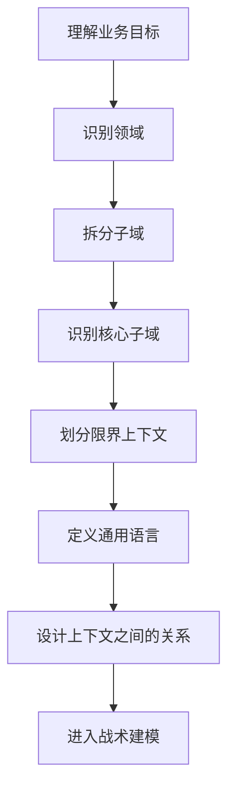
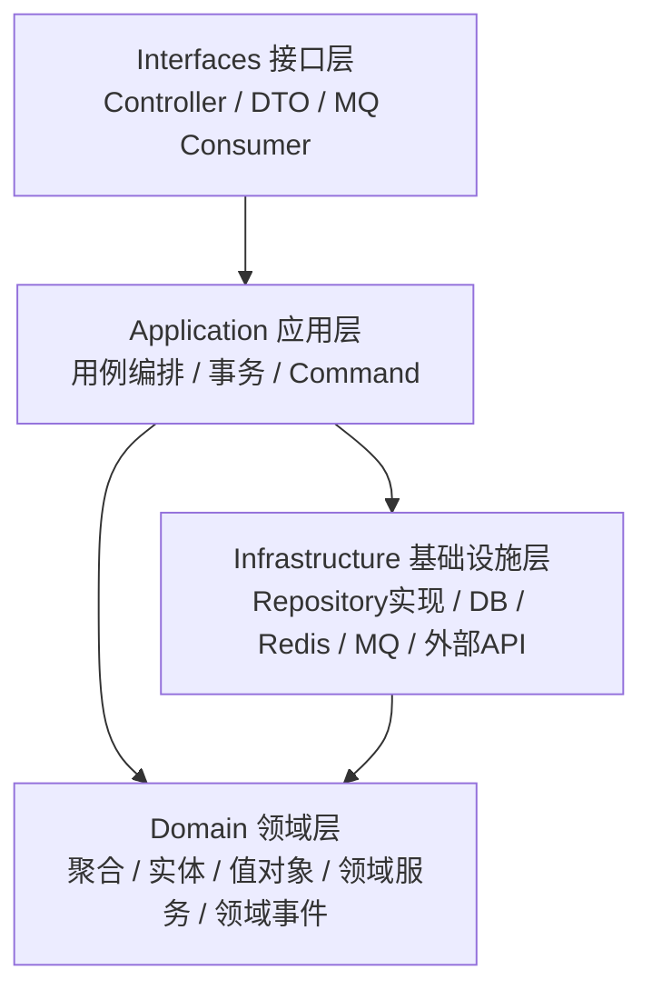
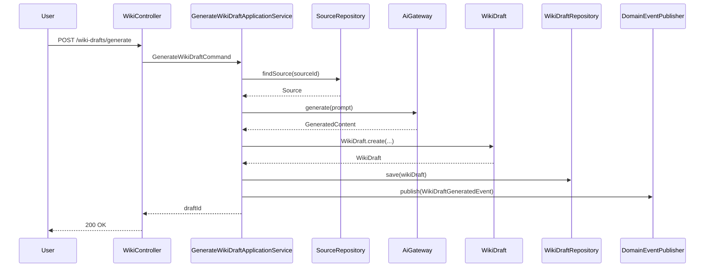

DDD，全称 **Domain-Driven Design，领域驱动设计**。

它不是一种框架，也不是一种代码分层模板，而是一套用于处理**复杂业务系统**的软件设计方法论。

一句话概括：

> DDD 的核心目标是：让软件模型尽可能贴近真实业务，把复杂业务逻辑组织在领域模型中，而不是散落在 Controller、Service、SQL、if-else 里。

---

# 1. 为什么需要 DDD？

很多后端项目一开始都是这样写的：

```text
Controller -> Service -> Mapper -> Database
```

例如：

```java
@PostMapping("/orders")
public Result createOrder(@RequestBody CreateOrderRequest request) {
    orderService.createOrder(request);
    return Result.ok();
}
```

然后所有逻辑都堆在 `OrderService`：

```java
public void createOrder(CreateOrderRequest request) {
    // 校验用户
    // 校验商品
    // 校验库存
    // 计算价格
    // 创建订单
    // 扣库存
    // 发优惠券
    // 发消息
    // 更新积分
    // 写数据库
}
```

随着业务变复杂，Service 会变成：

```text
OrderService
 ├── createOrder()
 ├── cancelOrder()
 ├── payOrder()
 ├── refundOrder()
 ├── checkStock()
 ├── calculatePrice()
 ├── validateCoupon()
 ├── sendMessage()
 ├── syncToErp()
 └── ...
```

最后出现几个问题：

|问题|表现|
|---|---|
|业务逻辑分散|Controller、Service、Mapper、SQL 里都有业务判断|
|Service 过胖|一个 Service 几千行|
|模型贫血|Entity 只有 getter/setter，没有行为|
|代码难改|改一个规则牵动一堆逻辑|
|业务和技术混杂|Redis、MQ、SQL、HTTP 调用和业务规则混在一起|
|沟通困难|产品说“订单已支付”，代码里却叫 `status = 2`|

DDD 解决的不是“代码分层漂亮”的问题，而是：

> 当业务复杂到一定程度后，如何让代码仍然能表达业务，并且可维护、可演进。

---

# 2. DDD 适合什么场景？

DDD 不适合所有项目。

## 适合 DDD 的场景

|场景|是否适合|
|---|---|
|电商订单、库存、支付、售后|适合|
|金融交易、风控、账务|非常适合|
|SaaS 权限、组织、订阅、计费|适合|
|物流调度、运单、结算|适合|
|医疗、保险、供应链|适合|
|AI 知识库、文档处理、项目资产管理|适合|

## 不太适合 DDD 的场景

|场景|原因|
|---|---|
|简单 CRUD 后台|成本过高|
|纯展示型网站|业务规则少|
|一次性脚本|没必要|
|早期验证 Demo|可以先简单做|

判断标准：

> 如果系统的核心难点是业务规则，而不是页面、数据库表、接口转发，那么 DDD 才有价值。

---

# 3. DDD 的两大部分

DDD 通常分为两类设计：

```text
DDD
├── 战略设计 Strategic Design
│   ├── 领域 Domain
│   ├── 子域 Subdomain
│   ├── 限界上下文 Bounded Context
│   ├── 通用语言 Ubiquitous Language
│   └── 上下文映射 Context Mapping
│
└── 战术设计 Tactical Design
    ├── 实体 Entity
    ├── 值对象 Value Object
    ├── 聚合 Aggregate
    ├── 聚合根 Aggregate Root
    ├── 领域服务 Domain Service
    ├── 领域事件 Domain Event
    ├── 仓储 Repository
    ├── 工厂 Factory
    └── 应用服务 Application Service
```

简单理解：

|类型|关注点|
|---|---|
|战略设计|如何划分业务边界|
|战术设计|每个边界内部怎么建模和写代码|

很多人学 DDD 会直接上来讲实体、值对象、聚合根。

但真正重要的是：

> DDD 先划业务边界，再谈代码结构。

---

# 4. 领域 Domain

**领域**就是系统要解决的业务问题空间。

例如：

|系统|领域|
|---|---|
|电商系统|商品、订单、库存、支付、售后|
|博客系统|文章、分类、标签、评论、用户|
|知识库系统|Source、Chunk、Wiki、Artifact、Project|
|外卖系统|商家、商品、订单、配送、骑手调度|
|支付系统|支付、清算、对账、退款、账务|

领域不是数据库表，也不是 Java 包名。

领域来自业务本身。

---

# 5. 子域 Subdomain

一个复杂领域通常可以拆成多个子域。

以电商系统为例：

```text
电商领域
├── 商品子域
├── 订单子域
├── 库存子域
├── 支付子域
├── 营销子域
├── 会员子域
└── 售后子域
```

DDD 中一般把子域分为三类：

|子域类型|含义|示例|
|---|---|---|
|核心子域 Core Domain|系统最有竞争力、最复杂、最值得投入建模的部分|交易、风控、推荐、AI Wiki 生成|
|支撑子域 Supporting Domain|业务重要，但不是核心竞争力|用户、权限、通知|
|通用子域 Generic Domain|通用能力，可买可用|登录、文件存储、短信、邮件|

## 对你的 DevWiki Studio 举例

可以这样划分：

```text
DevWiki Studio
├── 核心子域
│   ├── 知识摄取 Ingestion
│   ├── Source / Chunk 建模
│   ├── Wiki 生成
│   ├── Artifact 管理
│   └── DevWiki Studio 工作流
│
├── 支撑子域
│   ├── 项目管理
│   ├── 用户管理
│   ├── 博客文章管理
│   └── 标签分类
│
└── 通用子域
    ├── 登录认证
    ├── 文件上传
    ├── 系统配置
    ├── AI Provider 配置
    └── 审计日志
```

这一步非常关键。

因为不是所有地方都值得用复杂 DDD。

核心子域应该认真建模，通用子域可以简单 CRUD。

---

# 6. 通用语言 Ubiquitous Language

DDD 非常强调 **通用语言**。

意思是：

> 产品、业务、后端、前端、测试、文档、代码，都尽量使用同一套业务词汇。

例如订单系统中，不要出现：

```text
产品文档：订单已支付
后端代码：status = 2
数据库：state = P
前端展示：付款成功
测试用例：已完成支付
```

应该统一语言：

```text
OrderStatus.PAID
```

代码中也应该表达业务语义：

```java
order.pay(paymentId);
order.cancel(reason);
order.applyRefund(refundRequest);
```

而不是：

```java
order.setStatus(2);
order.setPayFlag(true);
orderMapper.update(order);
```

## 通用语言的价值

|价值|说明|
|---|---|
|减少沟通成本|业务和技术说同一种话|
|提升代码可读性|代码本身就是业务文档|
|降低误解|避免不同角色对同一概念理解不同|
|支持长期演进|模型稳定，技术实现可替换|

---

# 7. 限界上下文 Bounded Context

这是 DDD 最核心的概念之一。
[[DDD限界上下文]]

**限界上下文**是一个明确的业务语义边界。

同一个词，在不同上下文里含义可能不同。

例如“商品”：

|上下文|商品的含义|
|---|---|
|商品上下文|名称、类目、属性、详情、图片|
|库存上下文|SKU、库存数量、仓库、锁定库存|
|订单上下文|下单时的商品快照|
|营销上下文|参与活动的商品、优惠规则|

所以不能简单地全系统共用一个 `Product` 类。

错误做法：

```java
class Product {
    private Long id;
    private String name;
    private BigDecimal price;
    private Integer stock;
    private String category;
    private String image;
    private Boolean onSale;
    private BigDecimal discountPrice;
    private Integer lockedStock;
    private String warehouseCode;
}
```

这个 `Product` 变成了“上帝对象”。

DDD 推荐：

```text
商品上下文：Product
库存上下文：StockItem
订单上下文：OrderItem
营销上下文：PromotionProduct
```

它们可能都和商品有关，但语义不同。

---

# 8. 限界上下文和微服务的关系

很多人误解：

> 一个限界上下文 = 一个微服务。

不一定。

更准确地说：

```text
限界上下文是业务边界
微服务是部署边界
```

两者可以一一对应，也可以不是。

## 单体项目中也可以用 DDD

例如模块化单体：

```text
backend
└── src/main/java/com/example/devwiki
    ├── ingestion
    ├── wiki
    ├── artifact
    ├── project
    ├── blog
    └── user
```

每个包就是一个较清晰的业务上下文。

早期项目没必要一上来拆微服务。

更好的路径通常是：

```text
模块化单体 -> 边界稳定 -> 必要时拆微服务
```

---

# 9. DDD 战略设计流程

可以按这个流程来：



## 举例：DevWiki Studio

```text
业务目标：
帮助开发者把源码、笔记、项目材料沉淀为结构化知识资产。

核心业务对象：
- Source
- Chunk
- Wiki
- Artifact
- Project
- Skill
- Ingestion Job
- AI Provider
```

可能的限界上下文：

```text
DevWiki Studio
├── Source Context
│   ├── Source
│   ├── SourceType
│   └── SourceMetadata
│
├── Ingestion Context
│   ├── IngestionJob
│   ├── Chunk
│   └── Parser
│
├── Wiki Context
│   ├── WikiPage
│   ├── WikiDraft
│   └── WikiSection
│
├── Artifact Context
│   ├── Artifact
│   ├── ArtifactVersion
│   └── ArtifactType
│
├── Blog Context
│   ├── Article
│   ├── Category
│   └── Tag
│
└── System Context
    ├── User
    ├── Role
    ├── ProviderConfig
    └── ApiKeyCredential
```

---

# 10. DDD 战术设计核心概念

下面进入代码层面。

---

# 11. 实体 Entity

**实体**是有唯一身份标识的对象。[[DDD的Entity实体]]

实体的重点不是属性，而是身份和生命周期。

例如：

```java
public class Order {
    private OrderId id;
    private OrderStatus status;
    private List<OrderItem> items;
}
```

即使订单的状态、金额、地址发生变化，只要 `OrderId` 不变，它仍然是同一个订单。

## 实体的特点

|特点|说明|
|---|---|
|有唯一 ID|例如 OrderId、UserId|
|有生命周期|创建、支付、取消、完成|
|可变|状态会变化|
|有业务行为|不只是 getter/setter|

错误写法：

```java
order.setStatus(OrderStatus.PAID);
```

更好的写法：

```java
order.pay(paymentId);
```

实体应该保护自己的业务规则。

```java
public class Order {

    private OrderId id;
    private OrderStatus status;
    private Money totalAmount;

    public void pay(PaymentId paymentId) {
        if (this.status != OrderStatus.CREATED) {
            throw new DomainException("只有待支付订单可以支付");
        }
        this.status = OrderStatus.PAID;
    }

    public void cancel(String reason) {
        if (this.status == OrderStatus.PAID) {
            throw new DomainException("已支付订单不能直接取消");
        }
        this.status = OrderStatus.CANCELLED;
    }
}
```

这就是从“贫血模型”走向“充血模型”。

---

# 12. VO值对象 Value Object

[[DDD里的VO值对象]]
**值对象**没有独立身份，关注的是值本身。

例如：

```text
Money
Address
Email
PhoneNumber
DateRange
SourcePath
ChunkContent
```

两个 Money，只要金额和币种一样，就是相等的。

```java
public record Money(BigDecimal amount, String currency) {

    public Money {
        if (amount == null || amount.compareTo(BigDecimal.ZERO) < 0) {
            throw new IllegalArgumentException("金额不能为负");
        }
        if (currency == null || currency.isBlank()) {
            throw new IllegalArgumentException("币种不能为空");
        }
    }

    public Money add(Money other) {
        if (!this.currency.equals(other.currency)) {
            throw new IllegalArgumentException("币种不一致");
        }
        return new Money(this.amount.add(other.amount), this.currency);
    }
}
```

## 值对象的特点

|特点|说明|
|---|---|
|无 ID|不需要唯一标识|
|不可变|推荐 immutable|
|通过属性判断相等|值一样就是一样|
|封装规则|例如金额不能为负、邮箱格式校验|

## Java 中推荐用 record

```java
public record Email(String value) {

    public Email {
        if (value == null || !value.contains("@")) {
            throw new IllegalArgumentException("邮箱格式不正确");
        }
    }
}
```

这样比到处传 `String email` 更安全。

---

# 13. 聚合 Aggregate

聚合是 DDD 战术设计中最容易误解的概念。
[[DDD的聚合]]

**聚合是一组强一致性的领域对象边界。**

一个聚合内部可以包含：

```text
聚合根 Entity
├── 子实体 Entity
├── 值对象 Value Object
└── 业务规则
```

外部只能通过聚合根访问聚合内部对象。

## 订单聚合示例

```text
Order 聚合
├── Order 聚合根
├── OrderItem 子实体
├── Money 值对象
└── Address 值对象
```

外部不应该直接修改 `OrderItem`。

应该通过 `Order`：

```java
order.addItem(productId, quantity, price);
order.removeItem(orderItemId);
order.changeAddress(address);
```

而不是：

```java
order.getItems().add(item);
order.getItems().get(0).setQuantity(999);
```

## 聚合的核心作用

聚合用于回答一个问题：

> 哪些对象必须一起保证业务一致性？

例如订单创建时：

```text
订单总价 = 所有订单项金额之和
订单至少有一个订单项
订单未支付前可以修改地址
订单支付后不能随便改金额
```

这些规则都属于 `Order` 聚合内部。

---

# 14. 聚合根 Aggregate Root

聚合根是聚合对外暴露的入口。

外部只能持有聚合根 ID，不能直接引用聚合内部对象。

例如：

```java
public class Order {

    private OrderId id;
    private List<OrderItem> items = new ArrayList<>();
    private OrderStatus status;
    private Money totalAmount;

    public void addItem(ProductId productId, int quantity, Money price) {
        if (status != OrderStatus.CREATED) {
            throw new DomainException("只有待支付订单可以修改商品");
        }

        OrderItem item = OrderItem.create(productId, quantity, price);
        this.items.add(item);
        recalculateTotalAmount();
    }

    private void recalculateTotalAmount() {
        this.totalAmount = items.stream()
                .map(OrderItem::subtotal)
                .reduce(Money.zero("CNY"), Money::add);
    }
}
```

`OrderItem` 不应该被外部 Repository 单独保存：

```java
// 不推荐
orderItemRepository.save(orderItem);
```

应该保存整个聚合：

```java
orderRepository.save(order);
```

---

# 15. 聚合设计原则

## 原则一：聚合不要太大

很多人会设计成：

```text
Order
├── OrderItem
├── Payment
├── Invoice
├── Delivery
├── Refund
├── Coupon
└── User
```

这通常是错误的。

聚合太大，会导致：

|问题|说明|
|---|---|
|并发冲突|多个业务同时改一个大聚合|
|加载成本高|每次查订单都加载一堆对象|
|边界混乱|不同生命周期混在一起|
|难以拆分|未来微服务拆不开|

更好的方式：

```text
Order 聚合
Payment 聚合
Delivery 聚合
Refund 聚合
Invoice 聚合
```

通过 ID 和领域事件协作。

## 原则二：聚合之间通过 ID 引用

不推荐：

```java
class Order {
    private User user;
    private Product product;
}
```

推荐：

```java
class Order {
    private UserId userId;
    private List<OrderItem> items;
}
```

原因：

> 聚合之间不能靠对象引用形成一张巨大对象图，否则边界会失控。

## 原则三：聚合内部强一致，聚合之间最终一致

例如：

```text
创建订单：
1. Order 聚合保证订单金额、订单项一致
2. Stock 聚合负责库存扣减
3. Payment 聚合负责支付记录
```

跨聚合一致性通常通过：

```text
应用服务编排
领域事件
本地消息表
Saga
MQ
定时补偿
```

而不是一个巨大事务把所有东西锁死。

---

# 16. 领域服务 Domain Service

有些业务行为不适合放在某个实体或值对象里。

这时可以使用领域服务。[[DDD的领域服务]]

例如：

```text
转账 = 从账户 A 扣钱 + 给账户 B 加钱
```

这个行为涉及两个账户。

它不完全属于某一个 Account。

可以设计：

```java
public class TransferDomainService {

    public void transfer(Account from, Account to, Money amount) {
        from.withdraw(amount);
        to.deposit(amount);
    }
}
```

## 领域服务的特点

|特点|说明|
|---|---|
|表达领域行为|是业务概念，不是技术服务|
|无状态|通常不持有状态|
|操作多个领域对象|常见于跨实体、跨聚合规则|
|不负责事务和 IO|事务通常在应用服务|

注意：

```java
OrderService
UserService
ProductService
```

不一定是领域服务。

很多项目里的 `XxxService` 其实是应用服务。

---

# 17. 应用服务 Application Service

应用服务负责编排用例。[[DDD领域编排]]

它通常做这些事：

```text
1. 接收命令 Command
2. 查询 Repository
3. 调用聚合/领域服务
4. 保存聚合
5. 发布事件
6. 返回结果
```

它不应该承载核心业务规则。

例如：

```java
@Service
public class PayOrderApplicationService {

    private final OrderRepository orderRepository;
    private final PaymentGateway paymentGateway;
    private final DomainEventPublisher eventPublisher;

    @Transactional
    public void pay(PayOrderCommand command) {
        Order order = orderRepository.findById(command.orderId())
                .orElseThrow(() -> new NotFoundException("订单不存在"));

        PaymentResult paymentResult = paymentGateway.pay(
                command.paymentMethod(),
                order.totalAmount()
        );

        order.pay(paymentResult.paymentId());

        orderRepository.save(order);

        eventPublisher.publish(new OrderPaidEvent(order.id()));
    }
}
```

这里的重点是：

```java
order.pay(...)
```

支付状态转换规则在领域模型里，而不是应用服务里。

---

# 18. Repository 仓储
[[DDD的仓储和适配器]]

Repository 用来持久化聚合。

它的接口属于领域层，具体实现属于基础设施层。

```java
public interface OrderRepository {

    Optional<Order> findById(OrderId id);

    void save(Order order);
}
```

基础设施层实现：

```java
@Repository
public class JpaOrderRepository implements OrderRepository {

    private final SpringDataOrderJpaRepository jpaRepository;
    private final OrderMapper mapper;

    @Override
    public Optional<Order> findById(OrderId id) {
        return jpaRepository.findById(id.value())
                .map(mapper::toDomain);
    }

    @Override
    public void save(Order order) {
        OrderJpaEntity entity = mapper.toJpaEntity(order);
        jpaRepository.save(entity);
    }
}
```

## 注意

Repository 不是 DAO 的简单换名。

|DAO / Mapper|Repository|
|---|---|
|面向数据库表|面向聚合|
|返回 PO / Entity|返回领域对象|
|CRUD 思维|领域对象持久化|
|技术视角|业务视角|

错误倾向：

```java
orderRepository.updateStatus(orderId, PAID);
```

更 DDD 的做法：

```java
Order order = orderRepository.findById(orderId);
order.pay(paymentId);
orderRepository.save(order);
```

---

# 19. 领域事件 Domain Event
[[DDD领域事件]]

领域事件表示领域中已经发生的事实。

命名通常使用过去式：

```text
OrderCreatedEvent
OrderPaidEvent
OrderCancelledEvent
WikiDraftGeneratedEvent
SourceIngestedEvent
ArtifactPublishedEvent
```

领域事件不是命令。

|类型|含义|
|---|---|
|Command|要做某事|
|Event|某事已经发生|

例如：

```java
public record OrderPaidEvent(
        OrderId orderId,
        PaymentId paymentId,
        Instant occurredAt
) implements DomainEvent {
}
```

订单支付后：

```java
public void pay(PaymentId paymentId) {
    if (this.status != OrderStatus.CREATED) {
        throw new DomainException("只有待支付订单可以支付");
    }

    this.status = OrderStatus.PAID;

    this.addDomainEvent(new OrderPaidEvent(this.id, paymentId, Instant.now()));
}
```

应用服务保存后发布：

```java
orderRepository.save(order);
domainEventPublisher.publishAll(order.pullDomainEvents());
```

## 领域事件适合什么？

|场景|事件|
|---|---|
|订单支付后扣积分|OrderPaidEvent|
|Source 摄取完成后生成 Wiki 草稿|SourceIngestedEvent|
|Wiki 发布后生成 Artifact|WikiPublishedEvent|
|用户注册后发欢迎邮件|UserRegisteredEvent|
|订单取消后释放库存|OrderCancelledEvent|

领域事件可以降低模块耦合。

---

# 20. 工厂 Factory

当对象创建过程复杂时，可以用 Factory。

例如创建订单需要：

```text
用户 ID
商品项
价格策略
优惠券
地址
库存校验结果
```

如果全部塞到构造函数，会很乱。

可以使用：

```java
public class OrderFactory {

    public Order create(CreateOrderCommand command, PricingResult pricingResult) {
        List<OrderItem> items = command.items().stream()
                .map(item -> OrderItem.create(
                        item.productId(),
                        item.quantity(),
                        pricingResult.priceOf(item.productId())
                ))
                .toList();

        return Order.create(
                command.userId(),
                items,
                pricingResult.totalAmount(),
                command.address()
        );
    }
}
```

Factory 的作用：

> 封装复杂创建逻辑，保证对象一出生就是合法的。

---

# 21. DDD 分层架构

常见 DDD 分层：

```text
interfaces / adapter 层
    对外接口：Controller、DTO、RPC、MQ Consumer

application 层
    用例编排：ApplicationService、Command、Query

domain 层
    领域模型：Entity、ValueObject、Aggregate、DomainService、DomainEvent、Repository接口

infrastructure 层
    技术实现：数据库、Redis、MQ、HTTP Client、Repository实现
```
[[DDD防腐层ACL]]

图示：



更严格一点，依赖方向应该是：

```text
接口层 -> 应用层 -> 领域层
基础设施层 -> 领域层接口
```

领域层不依赖 Spring、不依赖数据库、不依赖 Redis、不依赖 MQ。

---

# 22. 推荐的 Java 包结构

可以按限界上下文组织，而不是按技术类型组织。

## 不推荐：按技术分包

```text
com.example
├── controller
├── service
├── mapper
├── entity
├── dto
└── config
```

这种结构前期简单，后期所有业务混在一起。

## 推荐：按业务上下文分包

```text
com.example.devwiki
├── source
│   ├── interfaces
│   ├── application
│   ├── domain
│   └── infrastructure
│
├── ingestion
│   ├── interfaces
│   ├── application
│   ├── domain
│   └── infrastructure
│
├── wiki
│   ├── interfaces
│   ├── application
│   ├── domain
│   └── infrastructure
│
├── artifact
│   ├── interfaces
│   ├── application
│   ├── domain
│   └── infrastructure
│
└── shared
```

例如 `wiki` 上下文：

```text
wiki
├── interfaces
│   ├── WikiController.java
│   ├── request
│   └── response
│
├── application
│   ├── GenerateWikiDraftUseCase.java
│   ├── PublishWikiUseCase.java
│   ├── command
│   └── query
│
├── domain
│   ├── model
│   │   ├── WikiPage.java
│   │   ├── WikiDraft.java
│   │   ├── WikiSection.java
│   │   └── WikiStatus.java
│   ├── event
│   │   └── WikiPublishedEvent.java
│   ├── repository
│   │   └── WikiRepository.java
│   └── service
│       └── WikiGenerationPolicy.java
│
└── infrastructure
    ├── persistence
    ├── ai
    └── mapper
```

---

# 23. DDD 与传统三层架构对比

|维度|传统三层架构|DDD|
|---|---|---|
|核心组织方式|Controller / Service / DAO|领域 / 上下文 / 聚合|
|主要关注点|数据 CRUD|业务模型|
|业务逻辑位置|Service 层|Domain 层|
|Entity|数据表映射|领域对象|
|Service|容易变胖|应用服务 + 领域服务区分|
|Repository|数据访问|聚合持久化|
|适合场景|简单业务|复杂业务|

传统架构不是错。

问题在于：

> 当业务复杂度上升后，传统三层架构容易退化成事务脚本模式。

事务脚本大概是这样：

```java
public void payOrder(Long orderId) {
    OrderDO order = orderMapper.selectById(orderId);

    if (order.getStatus() != 1) {
        throw new RuntimeException();
    }

    order.setStatus(2);
    orderMapper.updateById(order);

    paymentMapper.insert(...);
    mq.send(...);
}
```

DDD 更关注：

```java
Order order = orderRepository.findById(orderId);
order.pay(paymentId);
orderRepository.save(order);
```

---

# 24. 贫血模型 vs 充血模型

## 贫血模型

```java
public class Order {
    private Long id;
    private Integer status;
    private BigDecimal amount;

    // getter setter
}
```

业务逻辑在 Service：

```java
public void pay(Long orderId) {
    Order order = orderMapper.selectById(orderId);

    if (!order.getStatus().equals(OrderStatus.CREATED)) {
        throw new RuntimeException("状态错误");
    }

    order.setStatus(OrderStatus.PAID);
    orderMapper.update(order);
}
```

## 充血模型
[[DDD充血模型]]

```java
public class Order {
    private OrderId id;
    private OrderStatus status;
    private Money amount;

    public void pay(PaymentId paymentId) {
        if (status != OrderStatus.CREATED) {
            throw new DomainException("只有待支付订单可以支付");
        }
        this.status = OrderStatus.PAID;
    }
}
```

应用服务只编排：

```java
@Transactional
public void pay(PayOrderCommand command) {
    Order order = orderRepository.get(command.orderId());
    order.pay(command.paymentId());
    orderRepository.save(order);
}
```

## 关键区别

|贫血模型|充血模型|
|---|---|
|对象只有数据|对象有数据和行为|
|业务逻辑在 Service|业务逻辑在领域对象|
|容易变成过程式代码|更接近业务建模|
|简单 CRUD 够用|复杂业务更适合|

---

# 25. CQRS：命令查询职责分离

DDD 项目经常结合 CQRS，但不是必须。

CQRS 的意思是：

```text
Command：改变状态
Query：查询数据
```

例如：

```text
命令侧：
- 创建订单
- 支付订单
- 取消订单
- 生成 Wiki 草稿

查询侧：
- 查询订单详情
- 查询订单列表
- 查询 Wiki 页面
- 查询统计报表
```

命令侧使用领域模型：

```java
Order order = orderRepository.findById(orderId);
order.pay(paymentId);
orderRepository.save(order);
```

查询侧可以直接查 DTO，不一定要还原完整聚合：

```java
public OrderDetailDTO getOrderDetail(Long orderId) {
    return orderQueryMapper.selectOrderDetail(orderId);
}
```

这点非常重要。

很多人误以为 DDD 所有查询都必须走领域模型。

不是。

> 写操作关注业务一致性，适合走聚合；读操作关注展示效率，可以走专门的 Query 模型。

---

# 26. DDD 中 Controller 应该怎么写？

Controller 不应该写业务逻辑。

```java
@RestController
@RequestMapping("/api/orders")
public class OrderController {

    private final PayOrderApplicationService payOrderApplicationService;

    @PostMapping("/{orderId}/pay")
    public ResponseEntity<Void> pay(
            @PathVariable Long orderId,
            @RequestBody PayOrderRequest request
    ) {
        PayOrderCommand command = new PayOrderCommand(
                new OrderId(orderId),
                new PaymentMethod(request.paymentMethod())
        );

        payOrderApplicationService.pay(command);

        return ResponseEntity.ok().build();
    }
}
```

Controller 负责：

```text
HTTP 参数接收
DTO 转 Command
调用 Application Service
返回 Response
```

Controller 不负责：

```text
订单状态判断
金额计算
库存扣减规则
领域事件处理
数据库事务细节
```

---

# 27. DDD 中 Application Service 应该怎么写？

以订单支付为例：

```java
@Service
public class PayOrderApplicationService {

    private final OrderRepository orderRepository;
    private final PaymentGateway paymentGateway;
    private final DomainEventPublisher eventPublisher;

    @Transactional
    public void pay(PayOrderCommand command) {
        Order order = orderRepository.findById(command.orderId())
                .orElseThrow(() -> new NotFoundException("订单不存在"));

        PaymentResult result = paymentGateway.pay(
                command.paymentMethod(),
                order.totalAmount()
        );

        order.pay(result.paymentId());

        orderRepository.save(order);

        eventPublisher.publishAll(order.pullDomainEvents());
    }
}
```

Application Service 的职责边界：

|应该做|不应该做|
|---|---|
|事务控制|写复杂业务规则|
|调 Repository|直接拼 SQL|
|调外部服务|把技术细节塞进领域模型|
|编排流程|写大量 if-else 业务状态机|
|发布事件|让 Controller 处理领域逻辑|

---

# 28. DDD 中 Domain 层应该怎么写？

领域层尽量保持纯净。

```java
public class WikiDraft {

    private WikiDraftId id;
    private ProjectId projectId;
    private SourceId sourceId;
    private List<WikiSection> sections;
    private WikiDraftStatus status;

    public void approve() {
        if (status != WikiDraftStatus.PENDING_REVIEW) {
            throw new DomainException("只有待审核的 Wiki 草稿可以通过");
        }
        this.status = WikiDraftStatus.APPROVED;
    }

    public void reject(String reason) {
        if (reason == null || reason.isBlank()) {
            throw new DomainException("拒绝原因不能为空");
        }
        this.status = WikiDraftStatus.REJECTED;
    }

    public void publish() {
        if (status != WikiDraftStatus.APPROVED) {
            throw new DomainException("只有已通过审核的 Wiki 草稿可以发布");
        }
        this.status = WikiDraftStatus.PUBLISHED;
    }
}
```

注意这里没有：

```text
@Autowired
@Mapper
RedisTemplate
RabbitTemplate
HttpClient
```

领域模型不应该知道这些技术细节。

---

# 29. DDD 中 Infrastructure 层应该怎么写？

基础设施层负责技术实现：

```text
数据库
Redis
MQ
文件系统
AI API
第三方 HTTP
JPA / MyBatis
ElasticSearch
对象存储
```

例如 AI Provider：

```java
public interface AiGateway {
    AiResponse generate(AiPrompt prompt);
}
```

领域或应用层依赖接口。

基础设施层实现：

```java
@Component
public class OpenAiGateway implements AiGateway {

    private final OpenAiClient client;

    @Override
    public AiResponse generate(AiPrompt prompt) {
        OpenAiRequest request = OpenAiRequest.from(prompt);
        OpenAiResult result = client.chat(request);
        return AiResponse.from(result);
    }
}
```

这样未来从 OpenAI 切到 Anthropic、DeepSeek、Ollama，不影响核心业务模型。

---

# 30. 一个完整调用链示例

以“生成 Wiki 草稿”为例。



对应分层：

```text
Controller：
接收请求

Application Service：
编排生成流程

Domain：
WikiDraft 的合法性、状态流转、业务规则

Infrastructure：
AI 调用、数据库保存、事件发布实现
```

---

# 31. DDD 和数据库设计的关系

DDD 不是从数据库表开始设计。

传统方式：

```text
先设计表 -> 生成 Entity -> 写 Service -> 写接口
```

DDD 更倾向：

```text
理解业务 -> 设计领域模型 -> 设计聚合 -> 再设计持久化结构
```

但现实中也不是完全不看数据库。

更务实的方式是：

```text
领域模型和数据库模型分别设计，中间通过 Mapper 转换。
```

例如：

```text
Order 领域模型
    不一定等于
orders 数据库表
```

可能有：

```text
orders
order_items
order_events
```

还原成：

```text
Order 聚合
```

---

# 32. DDD 中 MyBatis / JPA 的选择

## JPA

优点：

|优点|说明|
|---|---|
|面向对象映射强|适合聚合持久化|
|Repository 风格自然|和 DDD 概念接近|
|支持级联|适合小聚合|

缺点：

|缺点|说明|
|---|---|
|学习成本高|JPA 状态管理复杂|
|隐式 SQL|性能问题不直观|
|大型复杂查询难控|容易 N+1|

## MyBatis / MyBatis-Plus

优点：

|优点|说明|
|---|---|
|SQL 可控|国内企业常用|
|简单直接|排查问题方便|
|复杂查询灵活|报表、列表很好用|

缺点：

|缺点|说明|
|---|---|
|容易变 CRUD|领域模型容易退化|
|需要手动 Mapper|DO 和 Domain 需要转换|
|聚合持久化要自己组织|没有 JPA 那么自然|

## 我的建议

对于 Java 后端项目，尤其你熟悉 MyBatis-Plus，可以这样做：

```text
写操作：
Controller -> ApplicationService -> Domain Model -> Domain Repository Interface -> MyBatis Repository Impl

读操作：
Controller -> QueryService -> MyBatis Mapper -> DTO
```

也就是：

```text
命令侧偏 DDD
查询侧偏 SQL / DTO
```

这是非常务实的方式。

---

# 33. DDD 中 DTO、DO、PO、Entity 的区别

很多项目混乱的根源是所有对象都叫 Entity。

建议区分：

|类型|所在层|用途|
|---|---|---|
|Request DTO|interfaces|接收前端请求|
|Response DTO|interfaces|返回前端响应|
|Command|application|表达一个用例命令|
|Query|application|表达查询条件|
|Domain Entity|domain|领域实体|
|Value Object|domain|值对象|
|PO / DO|infrastructure|数据库表映射|
|View DTO|application/interfaces|查询结果展示|

例如：

```text
CreateOrderRequest
CreateOrderCommand
Order
OrderItem
Money
OrderDO
OrderItemDO
OrderDetailResponse
```

不要让一个类跨所有层使用。

---

# 34. DDD 的依赖倒置

DDD 通常会用依赖倒置。

领域层定义接口：

```java
public interface WikiDraftRepository {
    void save(WikiDraft draft);
    Optional<WikiDraft> findById(WikiDraftId id);
}
```

基础设施层实现接口：

```java
@Repository
public class MyBatisWikiDraftRepository implements WikiDraftRepository {

    private final WikiDraftMapper mapper;

    @Override
    public void save(WikiDraft draft) {
        WikiDraftDO dataObject = WikiDraftConverter.toDO(draft);
        mapper.insertOrUpdate(dataObject);
    }
}
```

应用服务依赖领域接口：

```java
@Service
public class PublishWikiApplicationService {

    private final WikiDraftRepository wikiDraftRepository;

    public void publish(PublishWikiCommand command) {
        WikiDraft draft = wikiDraftRepository.findById(command.draftId())
                .orElseThrow();

        draft.publish();

        wikiDraftRepository.save(draft);
    }
}
```

这样领域层不依赖数据库实现。

---

# 35. DDD 和六边形架构、整洁架构的关系

DDD 经常和这些架构一起出现：

```text
DDD
Hexagonal Architecture
Clean Architecture
Onion Architecture
CQRS
Event Sourcing
```

它们不是一回事。

|概念|关注点|
|---|---|
|DDD|业务建模|
|六边形架构|输入输出适配器隔离|
|整洁架构|依赖方向和层次|
|CQRS|读写模型分离|
|Event Sourcing|用事件作为状态来源|

可以这样理解：

```text
DDD 负责设计业务核心
六边形架构负责保护业务核心
CQRS 负责优化读写职责
事件驱动负责解耦上下文
```

---

# 36. DDD 的典型代码结构示例

以 `wiki` 上下文为例：

```text
wiki
├── interfaces
│   └── WikiDraftController.java
│
├── application
│   ├── GenerateWikiDraftApplicationService.java
│   ├── PublishWikiApplicationService.java
│   ├── command
│   │   ├── GenerateWikiDraftCommand.java
│   │   └── PublishWikiCommand.java
│   └── dto
│       └── WikiDraftResult.java
│
├── domain
│   ├── model
│   │   ├── WikiDraft.java
│   │   ├── WikiDraftId.java
│   │   ├── WikiSection.java
│   │   └── WikiDraftStatus.java
│   ├── event
│   │   └── WikiDraftPublishedEvent.java
│   ├── repository
│   │   └── WikiDraftRepository.java
│   └── service
│       └── WikiDraftPolicy.java
│
└── infrastructure
    ├── persistence
    │   ├── WikiDraftDO.java
    │   ├── WikiDraftMapper.java
    │   ├── MyBatisWikiDraftRepository.java
    │   └── WikiDraftConverter.java
    └── ai
        └── AiWikiGenerator.java
```

---

# 37. 结合 DevWiki Studio 举一个建模例子

假设有一个需求：

> 用户上传一份 Source，系统解析成 Chunks，然后基于 Chunks 生成 WikiDraft，用户审核后发布为 WikiPage。

可以识别出几个上下文：

```text
Source Context
Ingestion Context
Wiki Context
Artifact Context
```

## Source 聚合

```java
public class Source {

    private SourceId id;
    private ProjectId projectId;
    private SourceType type;
    private SourceStatus status;
    private SourceLocation location;

    public void markUploaded() {
        this.status = SourceStatus.UPLOADED;
    }

    public void markIngesting() {
        if (this.status != SourceStatus.UPLOADED) {
            throw new DomainException("只有已上传 Source 可以开始摄取");
        }
        this.status = SourceStatus.INGESTING;
    }

    public void markIngested() {
        if (this.status != SourceStatus.INGESTING) {
            throw new DomainException("只有摄取中的 Source 可以标记为完成");
        }
        this.status = SourceStatus.INGESTED;
    }
}
```

## IngestionJob 聚合

```java
public class IngestionJob {

    private IngestionJobId id;
    private SourceId sourceId;
    private IngestionStatus status;
    private List<ChunkId> generatedChunkIds;

    public void start() {
        if (status != IngestionStatus.PENDING) {
            throw new DomainException("只有待处理任务可以启动");
        }
        this.status = IngestionStatus.RUNNING;
    }

    public void complete(List<ChunkId> chunkIds) {
        if (status != IngestionStatus.RUNNING) {
            throw new DomainException("只有运行中任务可以完成");
        }
        this.generatedChunkIds = chunkIds;
        this.status = IngestionStatus.COMPLETED;
    }

    public void fail(String reason) {
        this.status = IngestionStatus.FAILED;
    }
}
```

## WikiDraft 聚合

```java
public class WikiDraft {

    private WikiDraftId id;
    private ProjectId projectId;
    private SourceId sourceId;
    private List<WikiSection> sections;
    private WikiDraftStatus status;

    public void submitForReview() {
        if (sections == null || sections.isEmpty()) {
            throw new DomainException("空 Wiki 草稿不能提交审核");
        }
        this.status = WikiDraftStatus.PENDING_REVIEW;
    }

    public void approve() {
        if (status != WikiDraftStatus.PENDING_REVIEW) {
            throw new DomainException("只有待审核草稿可以通过");
        }
        this.status = WikiDraftStatus.APPROVED;
    }

    public void publish() {
        if (status != WikiDraftStatus.APPROVED) {
            throw new DomainException("只有已通过草稿可以发布");
        }
        this.status = WikiDraftStatus.PUBLISHED;
    }
}
```

这就比单纯写：

```java
wikiDraft.setStatus(3);
```

更能表达业务。

---

# 38. DDD 落地步骤

不要一上来就追求“教科书式 DDD”。

推荐按这个顺序落地：

## 第一步：识别核心业务

先问：

```text
这个系统最核心、最复杂、最能形成价值的业务是什么？
```

例如 DevWiki Studio：

```text
Source -> Chunk -> Wiki -> Artifact 的知识沉淀链路
```

这部分值得 DDD。

而登录、角色、菜单管理，可以先简单 CRUD。

---

## 第二步：统一术语

建立一个 `GLOSSARY.md`：

```text
Source：
用户导入的原始资料，可以是 Markdown、代码文件、网页、PDF、笔记。

Chunk：
Source 经过解析和切分后得到的知识片段。

WikiDraft：
由 AI 基于 Source/Chunk 生成的 Wiki 草稿，需要用户审核。

Artifact：
经过确认、发布或导出的知识资产，例如文章、文档、面试表达、项目说明。
```

这个文档很重要。

它会直接影响类名、接口名、数据库字段名、页面文案。

---

## 第三步：划分限界上下文

例如：

```text
source
ingestion
wiki
artifact
blog
system
```

先按模块化单体做，不急着拆微服务。

---

## 第四步：设计聚合

对每个上下文，识别聚合根。

|上下文|聚合根|
|---|---|
|source|Source|
|ingestion|IngestionJob|
|wiki|WikiDraft / WikiPage|
|artifact|Artifact|
|blog|Article|
|system|User / ProviderConfig|

---

## 第五步：写领域行为

不要只有：

```java
setStatus()
setTitle()
setContent()
```

而是写：

```java
source.markIngesting();
job.complete(chunkIds);
draft.submitForReview();
draft.approve();
draft.publish();
article.schedulePublish();
artifact.archive();
```

行为应该表达业务意图。

---

## 第六步：应用服务编排流程

例如：

```java
public class GenerateWikiDraftApplicationService {

    public WikiDraftId generate(GenerateWikiDraftCommand command) {
        Source source = sourceRepository.get(command.sourceId());

        source.ensureIngested();

        List<Chunk> chunks = chunkRepository.findBySourceId(source.id());

        GeneratedWiki generatedWiki = aiWikiGenerator.generate(source, chunks);

        WikiDraft draft = WikiDraft.create(
                command.projectId(),
                source.id(),
                generatedWiki.sections()
        );

        wikiDraftRepository.save(draft);

        return draft.id();
    }
}
```

---

## 第七步：基础设施实现

再考虑：

```text
MyBatis-Plus
PostgreSQL
Redis
RabbitMQ
OpenAI-compatible API
Elasticsearch
Object Storage
```

这些都是支撑领域模型的技术实现，而不是设计起点。

---

# 39. 常见误区

## 误区一：DDD = 分很多包

很多项目只是变成这样：

```text
domain
application
infrastructure
interfaces
```

但里面还是：

```java
order.setStatus(2);
orderMapper.update(order);
```

这不叫 DDD，只是换了包名。

---

## 误区二：所有项目都要 DDD

简单后台：

```text
菜单管理
角色管理
字典管理
系统配置
```

直接 CRUD 就行。

DDD 应该用在业务复杂的核心链路上。

---

## 误区三：领域模型必须和数据库表一一对应

不是。

领域模型是业务模型。

数据库表是持久化模型。

它们可以不同。

---

## 误区四：聚合越大越好

不是。

聚合越大，事务边界越大，并发越差，加载越重。

聚合应该尽量小，但要保证内部业务一致性。

---

## 误区五：领域事件一定要上 MQ

不是。

领域事件可以先在进程内发布。

例如：

```text
Spring ApplicationEvent
本地事件分发器
同步事件处理器
```

当需要跨进程、可靠投递时，再引入：

```text
MQ
Outbox Pattern
本地消息表
事件总线
```

---

## 误区六：DDD 必须配合微服务

不是。

很多项目更适合：

```text
模块化单体 + DDD 边界
```

微服务是部署架构，不是 DDD 的前提。

---

# 40. 后端开发中如何判断自己写得像不像 DDD？

可以用几个问题自查。

## 问题一：业务规则在哪里？

如果大量业务规则在：

```text
Controller
ApplicationService
Mapper XML
SQL
前端
```

说明领域模型偏弱。

更好的状态是：

```text
核心业务规则在 Domain Model 中。
```

---

## 问题二：代码能不能读出业务语义？

差：

```java
order.setStatus(2);
wiki.setState(3);
source.setFlag(true);
```

好：

```java
order.pay(paymentId);
wikiDraft.publish();
source.markIngested();
```

---

## 问题三：对象是否保护自己的不变量？

差：

```java
order.setTotalAmount(new BigDecimal("-100"));
```

好：

```java
new Money(new BigDecimal("-100"), "CNY");
// 直接抛异常
```

---

## 问题四：聚合边界是否清晰？

差：

```java
Order 里面直接引用 User、Product、Payment、Delivery、Refund。
```

好：

```java
Order 只维护自己的订单状态和订单项。
通过 UserId、ProductId、PaymentId 与其他聚合关联。
```

---

## 问题五：技术细节是否污染领域层？

差：

```java
public class Order {
    @Autowired
    private RedisTemplate redisTemplate;
}
```

好：

```java
领域层只表达业务。
Redis、MQ、DB 都放在 Infrastructure。
```

---

# 41. DDD 的本质

DDD 的本质不是：

```text
分层
聚合根
实体
值对象
Repository
领域事件
```

这些只是工具。

DDD 真正关心的是：

> 在复杂业务系统中，建立一个能够表达业务、保护规则、支撑演进的软件模型。

所以 DDD 的核心可以压缩成三句话：

```text
1. 用业务语言建模，而不是用数据库表建模。
2. 把核心业务规则放进领域模型，而不是堆在 Service 里。
3. 通过限界上下文控制复杂度，而不是让全系统共享一套混乱模型。
```

---

# 42. 学习 DDD 的推荐路径

你可以按这个顺序学：

```text
第一阶段：理解思想
- 领域
- 子域
- 限界上下文
- 通用语言

第二阶段：掌握战术建模
- 实体
- 值对象
- 聚合
- 聚合根
- 领域服务
- 领域事件
- Repository

第三阶段：结合 Spring Boot 落地
- 分层架构
- Application Service
- MyBatis/JPA Repository 实现
- DTO / Command / Domain / DO 转换

第四阶段：进阶
- CQRS
- 事件驱动
- Saga
- Outbox Pattern
- 模块化单体
- 微服务拆分
```

---

# 43. 最小可落地实践建议

对于 Java 后端项目，我建议你先这样用 DDD：

```text
1. 不要全项目强行 DDD。
2. 只在核心业务模块使用 DDD。
3. 用模块化单体划分限界上下文。
4. 写操作走领域模型。
5. 查询操作可以直接 DTO + SQL。
6. 领域层不要依赖 Spring、MyBatis、Redis、MQ。
7. 聚合之间只用 ID 关联。
8. 状态变化用行为方法表达，不要裸 setStatus。
9. 建立 GLOSSARY.md 统一业务语言。
10. 复杂跨模块协作用领域事件。
```

一个现实可用的结构是：

```text
interfaces
    Controller / Request / Response

application
    Command / ApplicationService / QueryService

domain
    Entity / ValueObject / AggregateRoot / DomainService / DomainEvent / Repository Interface

infrastructure
    MyBatis Mapper / DO / Repository Impl / MQ / Redis / AI Client
```

---

# 44. 最后用一句工程化判断

当你写业务代码时，看到这种代码：

```java
if (order.getStatus() == 1) {
    order.setStatus(2);
}
```

要警觉。

DDD 会推动你把它改成：

```java
order.pay(paymentId);
```

因为后者表达的是业务。

这就是 DDD 最实际的价值。