先不要记“实体、值对象、聚合根”这些细碎名词。

先建立一个整体判断：

> **DDD 是一套把复杂业务系统拆清楚、说清楚、写清楚的方法。**  
> 它先解决“业务边界怎么划”，再解决“每个边界内部代码怎么组织”。

---

# 1. DDD 的全局地图

![[DDD全局认知图.png]]

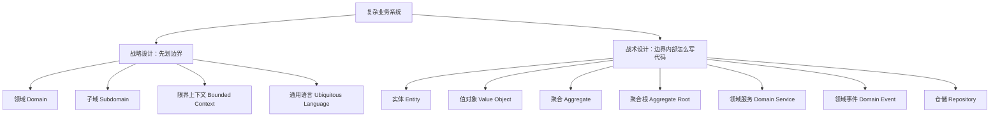

你可以先这样记：

|层次|问题|
|---|---|
|战略设计|业务怎么拆？边界怎么划？|
|战术设计|每个业务模块内部，代码怎么建模？|

---

# 2. DDD 最核心的思路

传统开发容易这样：

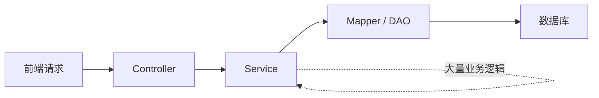

问题是：**Service 越写越胖，业务逻辑都堆在里面。**

DDD 希望变成这样：

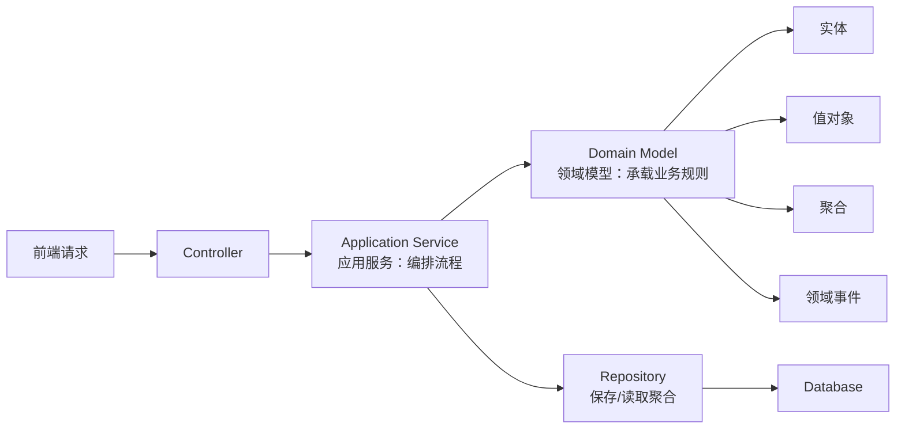

核心区别：

|传统三层|DDD|
|---|---|
|Service 写大量业务逻辑|Domain Model 写核心业务规则|
|Entity 主要映射数据库表|Entity 表达业务对象|
|以数据库表为中心|以业务模型为中心|
|适合 CRUD|适合复杂业务|

---

# 3. DDD 的整体分层图

DDD 落到代码里，常见是四层：

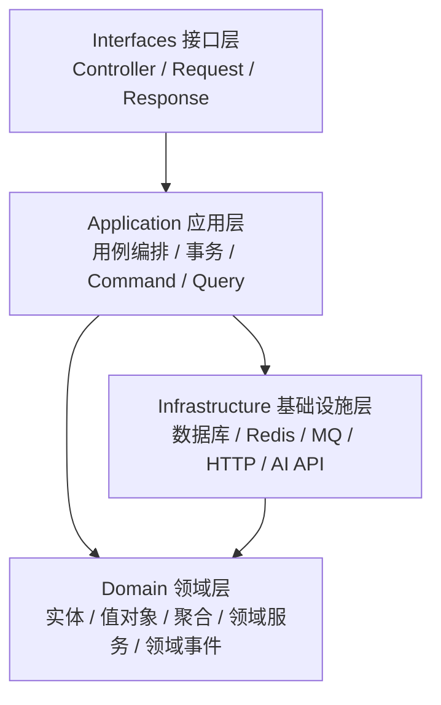

可以简单理解：

|层|职责|
|---|---|
|Interfaces|接 HTTP、RPC、MQ 请求|
|Application|编排一次业务用例|
|Domain|真正的业务规则|
|Infrastructure|技术实现细节|

---

# 4. 用一句话理解每一层

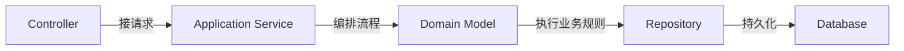

举个“支付订单”的例子：

```text
Controller：
收到 /orders/{id}/pay 请求

Application Service：
查订单 -> 调支付网关 -> 调 order.pay() -> 保存订单 -> 发事件

Domain Model：
判断订单能不能支付，改变订单状态

Repository：
把订单保存到数据库

Infrastructure：
真正执行 SQL、调用支付 API、发 MQ
```

---

# 5. DDD 的两个大脑：战略设计 + 战术设计

## 5.1 战略设计：先拆业务地图

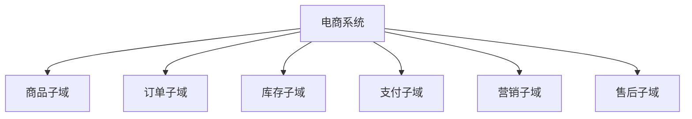

战略设计关注：

> 这个系统里有哪些业务领域？  
> 哪些是核心？  
> 哪些边界应该分开？

例如“商品”这个词，在不同上下文里含义不同：

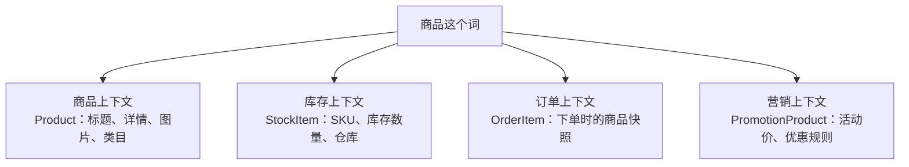

所以 DDD 不鼓励全系统共用一个巨大的 `Product` 对象。

---

## 5.2 战术设计：边界内部怎么建模

以订单上下文为例：

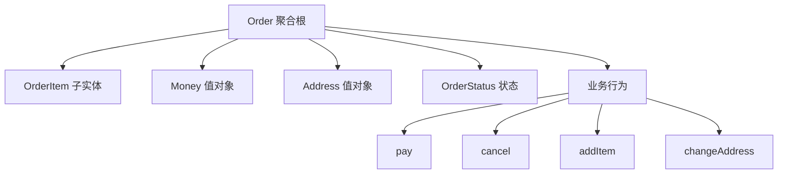

这就是战术设计：

> 在一个业务边界内部，用实体、值对象、聚合、领域事件等对象，把业务规则组织起来。

---

# 6. DDD 中最重要的几个概念关系图

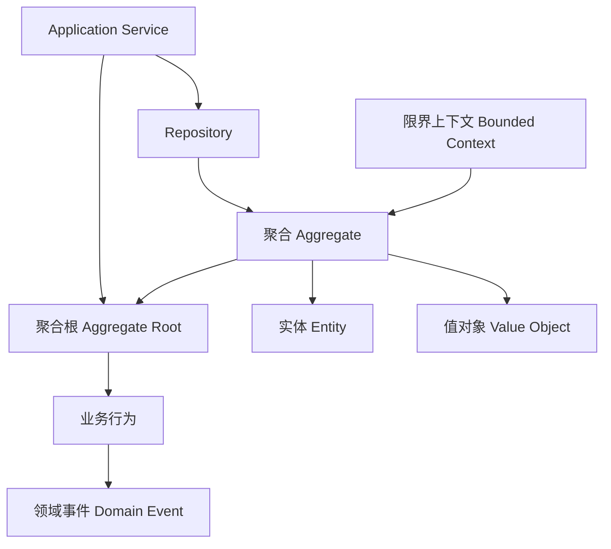

你可以先记住这条主线：

```text
限界上下文里面有聚合
聚合由聚合根负责对外
聚合根里面包含实体和值对象
业务行为写在聚合根或领域对象里
状态变化后可以产生领域事件
Repository 负责保存聚合
Application Service 负责调用它们
```

---

# 7. 实体、值对象、聚合根的区别图

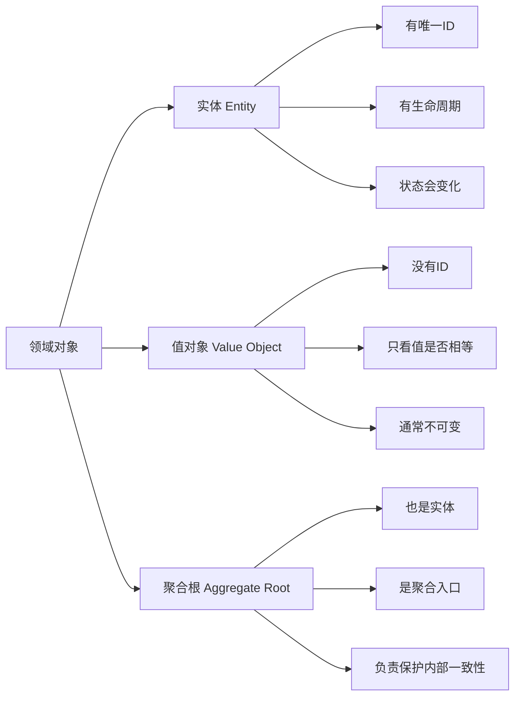

用订单举例：

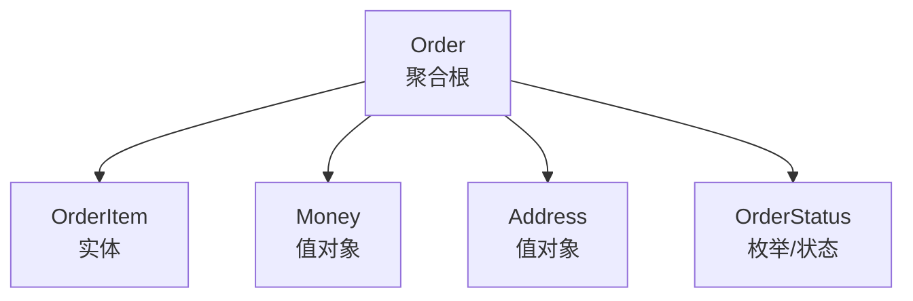

区别：

|概念|例子|特点|
|---|---|---|
|实体|Order、User、Article|有 ID，有生命周期|
|值对象|Money、Address、Email|没 ID，值相等就是相等|
|聚合根|Order|外部访问聚合的唯一入口|

---

# 8. “聚合”到底是什么？

聚合不是随便把对象放在一起。

聚合的本质是：

> 一组必须保持强一致性的领域对象。

例如订单：

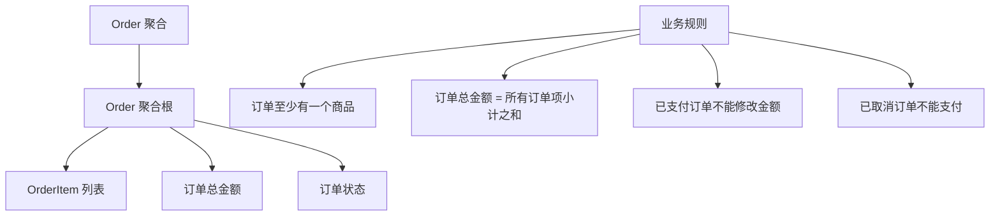

所以外部不能随便这样改：

```java
order.getItems().add(item);
order.setStatus(PAID);
```

而应该这样：

```java
order.addItem(productId, quantity, price);
order.pay(paymentId);
order.cancel(reason);
```

区别在于：

```text
setStatus(PAID) 只是改数据
pay(paymentId) 表达一个业务动作，并且可以校验规则
```

---

# 9. 一次 DDD 调用流程

以“支付订单”为例：

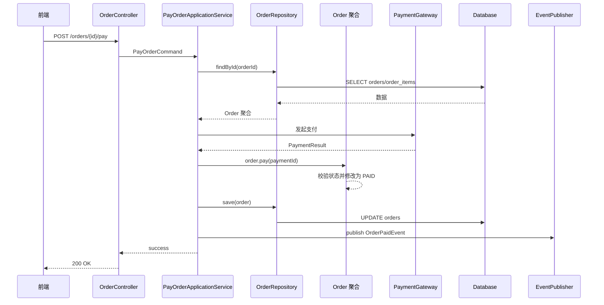

这个流程里：

|角色|职责|
|---|---|
|Controller|接请求|
|Application Service|编排流程|
|Repository|取出和保存聚合|
|Order 聚合|执行业务规则|
|PaymentGateway|调外部支付系统|
|EventPublisher|发布领域事件|

---

# 10. DDD 和 MVC 的位置关系

你之前问过 MVC 和 DDD 的 VO，这里可以顺便对齐一下：

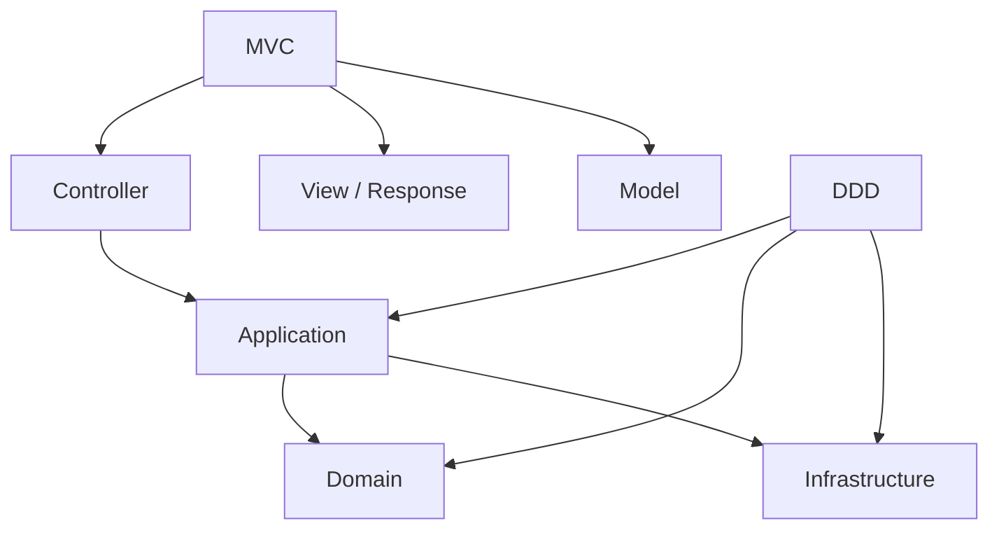

简单说：

|MVC|DDD|
|---|---|
|更偏表现层组织方式|更偏业务建模方式|
|关心请求怎么进来、响应怎么出去|关心业务规则怎么表达|
|Controller 是入口|Domain 是核心|

所以二者不是替代关系。

可以是：

```text
MVC 负责接口入口
DDD 负责业务核心
```

---

# 11. DDD 和数据库的关系

很多人上来就问：

> DDD 的实体是不是数据库 Entity？

答案：**不是一回事。**

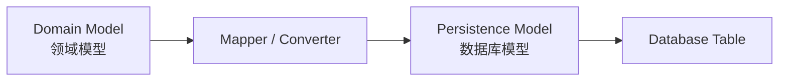

例如：

```text
领域模型：
Order 聚合
- Order
- OrderItem
- Money
- Address

数据库模型：
orders 表
order_items 表
```

它们可以对应，但不应该强行等同。

DDD 更倾向：

```text
先按业务建模，再考虑怎么落库。
```

传统 CRUD 更倾向：

```text
先设计表，再生成 Entity。
```

---

# 12. DDD 推荐的代码结构

不要按技术横切：

```text
controller
service
mapper
entity
dto
```

更推荐按业务上下文纵向切：

```text
com.example.mall
├── order
│   ├── interfaces
│   ├── application
│   ├── domain
│   └── infrastructure
│
├── product
│   ├── interfaces
│   ├── application
│   ├── domain
│   └── infrastructure
│
├── inventory
│   ├── interfaces
│   ├── application
│   ├── domain
│   └── infrastructure
│
└── payment
    ├── interfaces
    ├── application
    ├── domain
    └── infrastructure
```

图示：

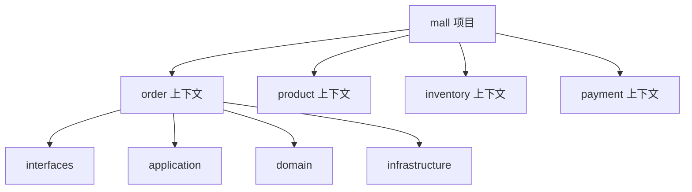

这样代码结构直接反映业务结构。

---

# 13. 用 DevWiki Studio 类比

如果用你的知识库项目来理解，DDD 的边界可能是：

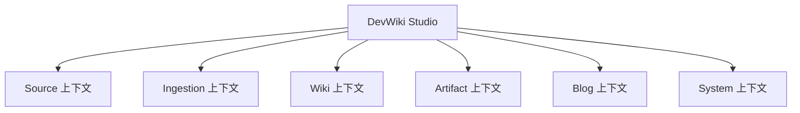

每个上下文内部再建模：

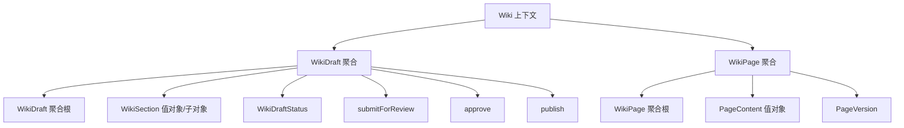

例如：

```java
wikiDraft.approve();
wikiDraft.publish();
```

比下面这种更有业务表达力：

```java
wikiDraft.setStatus(2);
wikiDraftMapper.updateById(wikiDraft);
```

---

# 14. DDD 的一张总结构图

你可以把 DDD 记成这一张图：

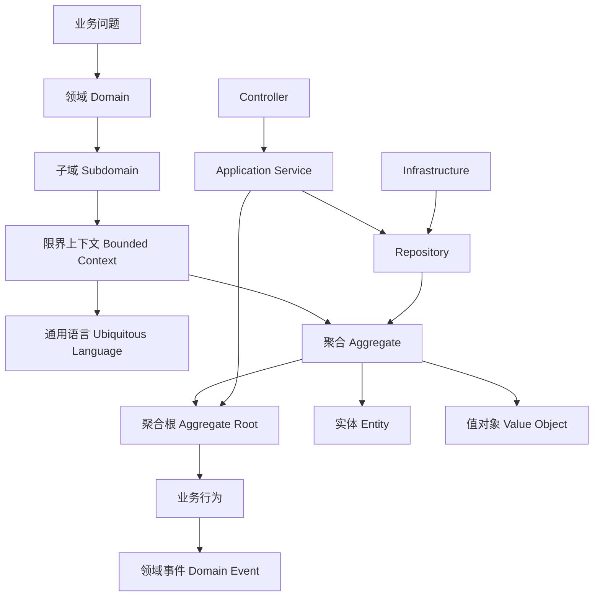

顺序是：

```text
业务问题
  -> 领域
  -> 子域
  -> 限界上下文
  -> 聚合
  -> 聚合根
  -> 实体 / 值对象
  -> 业务行为
  -> 领域事件
```

这条链路比单独背概念重要。

---

# 15. 最小心智模型

先不要背全部术语。你只需要先记住 5 个东西。

## 1. 限界上下文

> 把大系统拆成几个业务语义明确的模块。

例如：

```text
订单上下文
库存上下文
支付上下文
商品上下文
```

---

## 2. 聚合

> 在一个上下文内部，把必须强一致的对象放在一起。

例如：

```text
Order + OrderItem + Money + Address
```

---

## 3. 聚合根

> 聚合的唯一入口。

例如：

```text
外部只能调用 order.pay()，不能直接改 orderItem 或 status。
```

---

## 4. 值对象

> 用小对象表达业务值，而不是到处传 String、BigDecimal、Integer。

例如：

```text
Money
Email
Address
SourcePath
DateRange
```

---

## 5. 应用服务

> 负责流程编排，但不负责核心业务规则。

例如：

```text
查订单 -> 调支付 -> order.pay() -> 保存 -> 发事件
```

---

# 16. 最重要的一句话

DDD 不是让你多写几层代码。

它真正想做的是：

> **把业务复杂度从 Service 的 if-else 里，转移到有边界、有语义、有行为的领域模型里。**

所以你以后看到这种代码：

```java
order.setStatus(PAID);
```

要问一句：

> 这里是不是应该是一个业务行为？

比如：

```java
order.pay(paymentId);
```

这就是 DDD 的核心感觉。