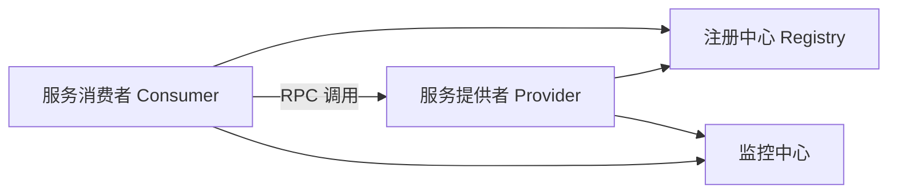
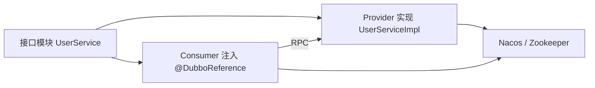
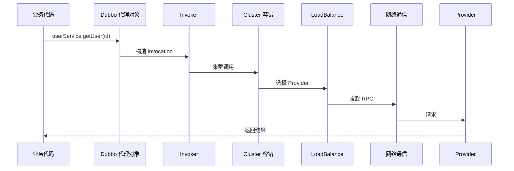
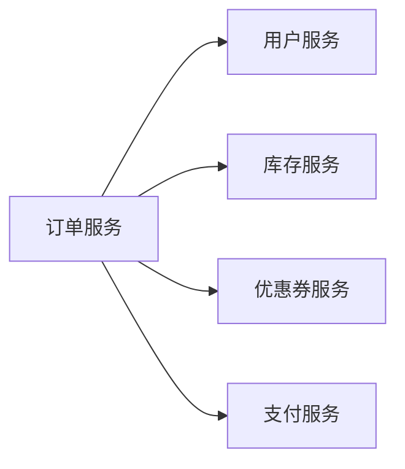
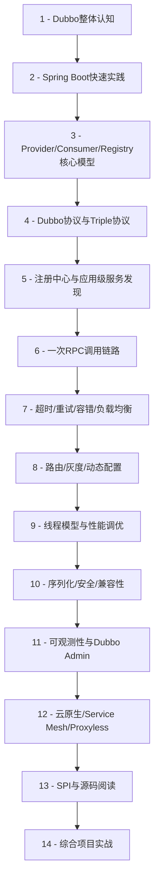

下面这份大纲按 **Dubbo 3.x / 2026 现状** 来设计，适合你这种“之前用过 Dubbo，现在系统复习、查缺补漏”的路径。

Dubbo 现在已经不只是传统 RPC 框架，而是一个面向微服务的 **RPC + 服务发现 + 流量治理 + 可观测性 + 云原生** 框架。官方文档也明确把 Dubbo 定位为多语言 Web/RPC 框架，提供服务发现、流量治理、可观测性、认证授权等能力。([Apache Dubbo](https://dubbo.apache.org/en/overview/home/))

------

# Dubbo 3.x 学习大纲

## 一、先建立整体认知：Dubbo 到底解决什么问题？

### 1. Dubbo 的核心定位

你要先把 Dubbo 看成：

```text
服务间通信框架
+ 服务注册发现
+ 服务治理框架
+ 微服务运行时基础设施
```

重点问题：

| 问题                            | Dubbo 负责什么         |
| ------------------------------- | ---------------------- |
| 服务 A 怎么调用服务 B？         | RPC 调用               |
| 服务 B 有多个实例，A 怎么找到？ | 注册中心 / 服务发现    |
| 多个服务实例怎么选？            | 负载均衡               |
| 调用失败怎么办？                | 超时、重试、容错       |
| 想灰度一部分流量怎么办？        | 路由、标签、动态配置   |
| 线上出问题怎么看？              | Metrics、Tracing、日志 |
| Spring Boot 项目怎么集成？      | Starter、注解、配置    |

### 2. Dubbo 2.x 和 Dubbo 3.x 的关键变化

这一块非常重要。

Dubbo 3.x 不是简单升级版本，它重点强化了：

| 方向        | Dubbo 3.x 变化                               |
| ----------- | -------------------------------------------- |
| 协议        | 引入 Triple 协议，基于 HTTP，兼容 gRPC       |
| 服务发现    | 从接口级服务发现走向应用级服务发现           |
| 云原生      | 更重视 Kubernetes、Service Mesh、Proxyless   |
| 多语言      | Java、Go、Rust、Node、Python 等生态扩展      |
| 可观测性    | 更重视 Metrics、Tracing、Prometheus、Grafana |
| Spring Boot | 官方 Starter 更完善                          |

官方升级文档也提到，Dubbo 3 仍保持 2.x 的经典架构，但增强了稳定性、性能、扩展性和易用性，并继续聚焦服务发现、流量管理等服务治理能力。([Apache Dubbo](https://dubbo.apache.org/en/overview/mannual/java-sdk/reference-manual/upgrades-and-compatibility/version/2.x-to-3.x-compatibility-guide/))

------

# 二、Dubbo 基础模型：先把几个核心角色吃透

## 1. Provider / Consumer / Registry / Monitor

这是 Dubbo 的经典模型：



你需要掌握：

| 角色              | 作用           |
| ----------------- | -------------- |
| Provider          | 暴露服务       |
| Consumer          | 引用远程服务   |
| Registry          | 服务注册与发现 |
| Protocol          | 通信协议       |
| Cluster           | 集群容错       |
| Router            | 路由规则       |
| LoadBalance       | 负载均衡       |
| Filter            | 调用链扩展点   |
| Monitor / Metrics | 监控指标       |

------

# 三、快速实践：Spring Boot 集成 Dubbo 3.x

这一章要直接上手。

## 1. 最小 Dubbo 项目结构

建议用三模块：

```text
dubbo-demo
├── demo-api          # 接口定义
├── demo-provider     # 服务提供者
└── demo-consumer     # 服务消费者
```

## 2. Maven 依赖与 Starter

Dubbo 3.x 推荐使用官方 Spring Boot Starter。官方文档说明，`dubbo-spring-boot-starter` 会引入 Dubbo 核心依赖，并自动扫描 Dubbo 配置和注解。([Apache Dubbo](https://dubbo.apache.org/en/overview/mannual/java-sdk/tasks/develop/springboot/))

典型依赖：

```xml
<dependencyManagement>
    <dependencies>
        <dependency>
            <groupId>org.apache.dubbo</groupId>
            <artifactId>dubbo-bom</artifactId>
            <version>3.3.x</version>
            <type>pom</type>
            <scope>import</scope>
        </dependency>
    </dependencies>
</dependencyManagement>
```

常用 Starter：

| Starter                                        | 用途                   |
| ---------------------------------------------- | ---------------------- |
| `dubbo-spring-boot-starter`                    | Dubbo 核心集成         |
| `dubbo-spring-boot-starter3`                   | Spring Boot 3.2 支持   |
| `dubbo-nacos-spring-boot-starter`              | Nacos 注册中心         |
| `dubbo-zookeeper-curator5-spring-boot-starter` | Zookeeper Curator5     |
| `dubbo-sentinel-spring-boot-starter`           | Sentinel 限流降级      |
| `dubbo-seata-spring-boot-starter`              | Seata 分布式事务       |
| `dubbo-observability-spring-boot-starter`      | Metrics 可观测性       |
| `dubbo-tracing-otel-otlp-spring-boot-starter`  | OpenTelemetry 链路追踪 |

Dubbo 3.3.x 官方 Starter 列表已经包含 Nacos、Zookeeper、Sentinel、Seata、Observability、OpenTelemetry 等集成。([Apache Dubbo](https://dubbo.apache.org/en/overview/mannual/java-sdk/reference-manual/upgrades-and-compatibility/version/3.2-to-3.3-compatibility-guide/))

## 3. 核心注解

重点掌握：

```java
@DubboService
@DubboReference
@EnableDubbo
```

基本关系：



------

# 四、协议体系：Dubbo 协议、Triple、gRPC、HTTP

## 1. 传统 Dubbo 协议

需要理解：

| 点       | 内容                                   |
| -------- | -------------------------------------- |
| 协议名称 | `dubbo://`                             |
| 序列化   | Hessian2、Fastjson2、Kryo、Protobuf 等 |
| 通信模型 | 长连接、NIO                            |
| 适用场景 | Java 内部服务调用                      |

## 2. Triple 协议：Dubbo 3.x 的重点

Dubbo 3.x 必须重点学 Triple。

Triple 是 Dubbo 3 设计的基于 HTTP 的 RPC 协议，兼容 gRPC，支持 Request-Response 和 Streaming，并可运行在 HTTP/1 与 HTTP/2 上。([Apache Dubbo](https://dubbo.apache.org/en/overview/reference/protocols/triple/))

你需要掌握：

| 问题                  | 结论                                     |
| --------------------- | ---------------------------------------- |
| Triple 是什么？       | Dubbo 3.x 的新一代 RPC 协议              |
| 和 gRPC 什么关系？    | 兼容 gRPC                                |
| 和 HTTP 什么关系？    | 基于 HTTP 传输                           |
| 是否必须写 `.proto`？ | 不一定，Java 可以继续用 Interface + POJO |
| 适合什么场景？        | 多语言、网关、云原生、HTTP 友好场景      |

官方文档还提到，Triple 可以让 Dubbo Server 同时处理 Dubbo Client、标准 gRPC Client，以及 cURL、浏览器等 HTTP 请求。([Apache Dubbo](https://dubbo.apache.org/en/overview/reference/protocols/triple/))

建议学习顺序：

```text
传统 dubbo 协议
→ Triple 协议
→ gRPC 兼容
→ HTTP/2
→ Streaming
→ 多语言调用
```

------

# 五、注册中心与服务发现

## 1. 注册中心基础

常见注册中心：

| 注册中心           | 现状                 |
| ------------------ | -------------------- |
| Zookeeper          | 传统 Dubbo 常用      |
| Nacos              | 国内 Java 微服务常用 |
| Kubernetes Service | 云原生场景           |
| Polaris / Etcd     | 特定生态场景         |

## 2. 接口级服务发现 vs 应用级服务发现

这是 Dubbo 3.x 的重点。

传统 Dubbo 更偏 **接口级服务发现**：

```text
com.xxx.UserService -> provider addresses
com.xxx.OrderService -> provider addresses
```

Dubbo 3.x 更强调 **应用级服务发现**：

```text
user-service application -> instance addresses
order-service application -> instance addresses
```

理解差异：

| 维度           | 接口级服务发现         | 应用级服务发现 |
| -------------- | ---------------------- | -------------- |
| 注册粒度       | 接口                   |                |
| 应用级         | 应用实例               |                |
| 数据规模       | 接口越多，注册数据越大 |                |
| 云原生适配     | 一般                   |                |
| Dubbo 3.x 推荐 | 逐步转向应用级         |                |

这一章建议重点学：

```text
服务注册
服务订阅
服务目录
地址推送
元数据中心
应用级服务发现
接口级兼容
```

------

# 六、调用链路：一次 Dubbo 调用到底发生了什么？

这一章要学到源码视角，但不必一开始就深挖源码。

## 1. Consumer 侧调用链



## 2. 必须掌握的调用抽象

| 概念        | 作用                         |
| ----------- | ---------------------------- |
| Proxy       | 把远程调用伪装成本地接口调用 |
| Invocation  | 一次方法调用的上下文         |
| Invoker     | Dubbo 内部核心调用抽象       |
| Directory   | 服务目录，保存可用 Invoker   |
| Router      | 路由筛选                     |
| LoadBalance | 负载均衡                     |
| Cluster     | 容错策略                     |
| Filter      | 调用链增强                   |

------

# 七、服务治理：Dubbo 真正值钱的地方

## 1. 超时、重试、容错

这部分是生产必考点。

| 能力        | 重点                   |
| ----------- | ---------------------- |
| timeout     | 调用超时时间           |
| retries     | 失败重试次数           |
| cluster     | 容错策略               |
| mock        | 服务降级               |
| check       | 启动时是否检查服务可用 |
| actives     | 最大并发调用数         |
| connections | 连接数控制             |

需要重点理解：

```text
不是所有接口都适合重试。
查询接口可以谨慎重试。
写接口、扣款接口、下单接口必须小心重试。
```

## 2. 负载均衡

常见策略：

| 策略             | 说明                       |
| ---------------- | -------------------------- |
| Random           | 随机，默认常见             |
| RoundRobin       | 轮询                       |
| LeastActive      | 最少活跃调用               |
| ConsistentHash   | 一致性 Hash                |
| ShortestResponse | 最短响应时间，部分版本支持 |

重点问题：

```text
为什么同一个用户请求要打到同一个服务实例？
为什么大接口不能和小接口共用同一组线程池？
为什么慢节点会拖垮集群？
```

## 3. 路由与灰度

Dubbo 的流量控制规则可以基于应用、服务、方法、参数等粒度控制流量方向。([Apache Dubbo](https://dubbo.apache.org/en/overview/what/core-features/traffic/?utm_source=chatgpt.com))

重点学习：

| 路由类型 | 用途                         |
| -------- | ---------------------------- |
| 条件路由 | 黑白名单、按方法路由         |
| 标签路由 | 灰度、环境隔离               |
| 脚本路由 | 复杂规则                     |
| 动态配置 | 运行期调整超时、重试、权重等 |

官方文档也提到，Dubbo Admin 支持条件路由、标签路由、动态配置、脚本路由等可视化管理，可用于黑白名单、灰度环境隔离、多套测试环境、金丝雀发布等场景。([Apache Dubbo](https://dubbo.apache.org/en/overview/mannual/java-sdk/tasks/observability/console/?utm_source=chatgpt.com))

------

# 八、线程模型与性能调优

这一块对 Java 后端很有价值。

## 1. Provider 线程模型

需要掌握：

```text
IO 线程
业务线程池
请求队列
序列化/反序列化
响应写回
```

重点参数：

| 参数       | 作用             |
| ---------- | ---------------- |
| threads    | 服务端业务线程数 |
| queues     | 队列大小         |
| dispatcher | 请求派发策略     |
| threadpool | 线程池类型       |
| accepts    | 最大连接数       |
| payload    | 请求体大小限制   |

## 2. Consumer 性能参数

| 参数               | 作用        |
| ------------------ | ----------- |
| timeout            | 超时        |
| retries            | 重试        |
| actives            | 最大并发    |
| connections        | 连接数      |
| async              | 异步调用    |
| future             | Future 调用 |
| onreturn / onthrow | 回调        |

## 3. 性能调优思路

核心不是背参数，而是建立诊断路径：

```text
RT 变高
→ 看 Provider 线程池
→ 看 Consumer 超时
→ 看注册中心地址变化
→ 看慢实例
→ 看重试风暴
→ 看序列化大小
→ 看数据库/缓存下游
```

------

# 九、序列化、安全与兼容性

## 1. 序列化选择

需要掌握：

| 序列化    | 特点                     |
| --------- | ------------------------ |
| Hessian2  | Dubbo 传统常用           |
| Fastjson2 | JSON 生态                |
| Protobuf  | 跨语言、Triple/gRPC 友好 |
| Kryo/FST  | 性能取向，但兼容性要注意 |

## 2. DTO 兼容性

重点规则：

```text
字段只能加，少改名，慎删字段。
不要随便改包名、类名、字段类型。
接口入参出参要稳定。
```

## 3. 安全

需要关注：

```text
反序列化安全
Token / 认证
接口暴露范围
注册中心权限
Admin 权限
公网暴露风险
```

------

# 十、Dubbo 与 Spring Cloud / gRPC / Istio 的关系

这一章用于建立技术选型能力。

## 1. Dubbo vs Spring Cloud

| 维度         | Dubbo                      | Spring Cloud |
| ------------ | -------------------------- | ------------ |
| 核心         | RPC + 服务治理             |              |
| Spring Cloud | 微服务组件生态             |              |
| 调用方式     | RPC / Triple / HTTP        |              |
| 典型注册中心 | Nacos / Zookeeper          |              |
| 优势         | 高性能 RPC、治理能力强     |              |
| 劣势         | HTTP 生态直观性不如纯 REST |              |

## 2. Dubbo vs gRPC

| 维度          | Dubbo Triple     | gRPC |
| ------------- | ---------------- | ---- |
| 协议          | HTTP/1、HTTP/2   |      |
| gRPC 兼容     | 是               |      |
| Java 接口开发 | 支持             |      |
| IDL           | 可选             |      |
| 服务治理      | Dubbo 内建更完整 |      |
| 多语言        | 都支持           |      |

## 3. Dubbo vs Service Mesh

Dubbo 3.x 有 Proxy、Proxyless 等云原生方向。官方 Service Mesh 文档提到，在 Proxy 模式下，Dubbo 3 使用 Triple、gRPC、REST 等基于 HTTP 的协议，可以获得更好的网关穿透和性能体验。([Apache Dubbo](https://dubbo.apache.org/en/overview/what/core-features/service-mesh/?utm_source=chatgpt.com))

你需要知道：

```text
传统 Dubbo：治理逻辑在 SDK 内
Service Mesh：治理逻辑下沉到 Sidecar / 控制面
Proxyless：应用直接接入控制面，减少 Sidecar 成本
```

------

# 十一、可观测性：生产环境必须会

## 1. Metrics

Dubbo 的可观测性文档提到，Dubbo 会采集 QPS、RT、总调用数、成功调用、失败调用、失败原因、线程池数量、服务健康状态等指标，并可通过 Grafana 可视化。([Apache Dubbo](https://dubbo.apache.org/en/overview/what/core-features/observability/?utm_source=chatgpt.com))

重点指标：

| 指标                  | 意义       |
| --------------------- | ---------- |
| QPS                   | 请求量     |
| RT                    | 响应时间   |
| Error Rate            | 错误率     |
| Timeout Count         | 超时次数   |
| Thread Pool Active    | 活跃线程数 |
| Queue Size            | 队列积压   |
| Provider Availability | 服务可用性 |

## 2. Tracing

重点掌握：

```text
TraceId
SpanId
Consumer Span
Provider Span
跨服务调用链
OpenTelemetry
Zipkin
Prometheus
Grafana
```

## 3. 日志排障

建议形成固定排障模板：

```text
1. 哪个 Consumer 调哪个 Provider？
2. 是所有实例失败，还是部分实例失败？
3. 是超时、连接失败、反序列化失败，还是业务异常？
4. 有没有重试？
5. 有没有流量规则？
6. 注册中心地址是否正常？
7. Provider 线程池是否打满？
8. 下游数据库/Redis/MQ 是否慢？
```

------

# 十二、Dubbo Admin 与治理平台

Dubbo Admin 不是核心调用链必需品，但生产治理很重要。

你需要学习：

| 功能            | 用途                   |
| --------------- | ---------------------- |
| 服务查询        | 看 Provider / Consumer |
| 路由规则        | 灰度、黑白名单         |
| 动态配置        | 超时、重试、权重调整   |
| 服务测试        | 简单接口调用           |
| 可观测性集成    | 指标、链路、状态       |
| Kubernetes 支持 | 云原生治理             |

Dubbo Admin 新版本后端用 Go 重写，前端用 Vue3 重写，并引入 Kubernetes 原生支持、可观测系统集成和表单化流量规则发布等能力。([GitHub](https://github.com/apache/dubbo-admin/releases?utm_source=chatgpt.com))

------

# 十三、源码阅读路线：不要一上来啃全源码

建议只读核心链路。

## 第一阶段：会用

```text
@DubboService
@DubboReference
服务导出
服务引用
注册中心配置
协议配置
超时重试配置
```

## 第二阶段：理解调用链

源码重点：

```text
ServiceConfig
ReferenceConfig
Protocol
Invoker
ProxyFactory
Cluster
Directory
Router
LoadBalance
Filter
ExchangeClient
```

## 第三阶段：理解扩展机制

重点看：

```text
SPI
ExtensionLoader
Adaptive
Wrapper
Filter Chain
Protocol 扩展
LoadBalance 扩展
Router 扩展
```

Dubbo SPI 是源码学习的核心。你不理解 SPI，就很难理解 Dubbo 为什么能高度可插拔。

------

# 十四、项目实践路线：建议你做 4 个小项目

## 项目 1：最小 Dubbo RPC Demo

目标：

```text
Spring Boot + Dubbo 3.x + Nacos/Zookeeper
```

实现：

```text
user-api
user-provider
order-consumer
```

练习点：

```text
@DubboService
@DubboReference
timeout
retries
check=false
version
group
```

------

## 项目 2：电商订单微服务调用链

目标：

```text
订单服务调用用户服务、库存服务、优惠券服务
```

结构：



练习点：

```text
多服务调用
接口拆分
DTO 设计
异常处理
超时配置
幂等设计
```

------

## 项目 3：Dubbo 服务治理实验室

目标：模拟生产治理。

练习：

```text
负载均衡
权重调整
超时重试
Mock 降级
标签路由
灰度发布
限流降级
```

可以设计两个 Provider：

```text
provider-v1
provider-v2
```

然后做：

```text
10% 流量打到 v2
指定用户打到 v2
压测慢节点
观察重试风暴
```

------

## 项目 4：Dubbo 可观测性实战

目标：

```text
Dubbo + Prometheus + Grafana + OpenTelemetry
```

练习：

```text
采集 QPS
采集 RT
采集错误率
查看调用链
模拟超时
模拟线程池耗尽
定位慢服务
```

------

# 十五、最终学习路线图

建议按这个顺序学：



------

# 十六、这轮复习的学习重点排序

如果时间有限，优先级如下：

| 优先级 | 内容                           | 原因           |
| ------ | ------------------------------ | -------------- |
| P0     | Spring Boot 集成 Dubbo 3.x     | 必须会用       |
| P0     | Provider / Consumer / Registry | 基本模型       |
| P0     | 超时、重试、容错               | 生产最常见     |
| P0     | 注册中心与服务发现             | Dubbo 核心     |
| P1     | Triple 协议                    | Dubbo 3.x 重点 |
| P1     | 应用级服务发现                 | 3.x 核心变化   |
| P1     | 路由、灰度、动态配置           | 服务治理核心   |
| P1     | 可观测性                       | 生产排障必备   |
| P2     | SPI                            | 源码与扩展必备 |
| P2     | Service Mesh / Proxyless       | 架构视野       |
| P2     | 多语言 / gRPC 兼容             | 新场景需要     |

------

# 一句话总结

这次复习 Dubbo，不要只按“RPC 框架”来学。

更准确的学习主线是：

```text
Dubbo 3.x = 高性能 RPC 调用
         + 注册发现
         + 服务治理
         + 可观测性
         + Triple/gRPC/HTTP 友好协议
         + 云原生微服务运行时
```

下一步最适合直接进入：

```text
Dubbo 3.x 最小 Spring Boot 项目：
Provider + Consumer + Nacos/Zookeeper + Triple 协议
```

然后再从这个 Demo 扩展到超时、重试、负载均衡、灰度、Metrics 和源码。