# Java 21 新特性系统学习大纲

Java 21 是 **LTS 长期支持版本**，也是 Java 17 之后最重要的企业级升级版本之一。

如果你是 Java 后端开发者，Java 21 最值得关注的不是“语法糖”，而是：

> **虚拟线程 + 结构化并发 + 模式匹配 + Record 模型增强 + JVM 性能演进**

它标志着 Java 在高并发服务端开发、数据建模、函数式风格、可维护性方面进入了一个新的阶段。

---

# 1. Java 21 新特性总览

## 1.1 核心分类

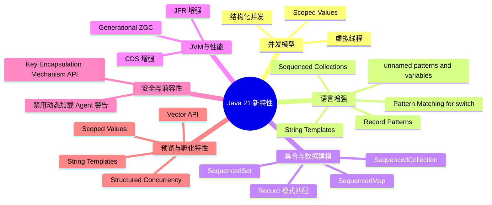

---

# 2. 必学特性优先级

从 Java 后端工程实践角度，建议按下面优先级学习。

|优先级|特性|状态|后端价值|
|---|---|---|---|
|S|Virtual Threads 虚拟线程|正式特性|极大简化高并发 I/O 编程|
|S|Pattern Matching for switch|正式特性|提升复杂分支逻辑可读性|
|S|Record Patterns|正式特性|改善 DTO、领域对象解构|
|A|Sequenced Collections|正式特性|统一有序集合访问模型|
|A|Generational ZGC|正式特性|改善大堆内存服务 GC 表现|
|A|Structured Concurrency|预览特性|更好管理并发任务生命周期|
|A|Scoped Values|预览特性|替代部分 ThreadLocal 场景|
|B|String Templates|预览特性|更安全、更清晰的字符串构造|
|B|Key Encapsulation Mechanism API|正式特性|安全通信、加密场景使用|
|B|Vector API|孵化特性|高性能计算、AI、向量处理场景|
|C|Unnamed Patterns and Variables|预览特性|减少无用变量声明|
|C|JVM/JFR/CDS 增强|正式/内部增强|运维、性能诊断、启动优化|

---

# 3. 学习主线一：并发模型升级

这是 Java 21 最重要的部分。

## 3.1 Virtual Threads：虚拟线程

**关键词：轻量线程、阻塞式编程、高并发 I/O、Project Loom。**

虚拟线程是 Java 21 的核心特性，正式从预览变成稳定能力。

它解决的问题是：

> 传统 Java 平台线程太重，导致高并发 I/O 服务需要依赖复杂的异步编程模型。

典型应用场景：

- 高并发 HTTP 接口
    
- RPC 调用聚合
    
- 数据库查询
    
- Redis 查询
    
- 外部 API 调用
    
- 文件上传下载
    
- 后台批处理任务
    

后续重点展开：

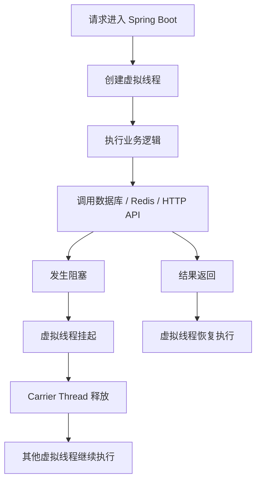

后续会重点讲：

- 虚拟线程和平台线程的区别
    
- 为什么虚拟线程适合阻塞 I/O
    
- 为什么不是“线程池越大越好”
    
- Spring Boot 3.2+ 如何启用虚拟线程
    
- 企业级接口聚合代码
    
- 虚拟线程常见坑点：pinning、ThreadLocal、连接池瓶颈、CPU 密集任务误用
    

---

## 3.2 Structured Concurrency：结构化并发

**关键词：并发任务生命周期管理、任务编排、失败传播、统一取消。**

结构化并发解决的问题是：

> 多个并发任务之间缺少清晰的父子关系，失败、取消、超时难以统一管理。

典型场景：

```java
// 一个商品详情页，需要同时查询：
// 1. 商品基础信息
// 2. 库存
// 3. 价格
// 4. 推荐商品
// 5. 用户优惠券
```

后续重点展开：

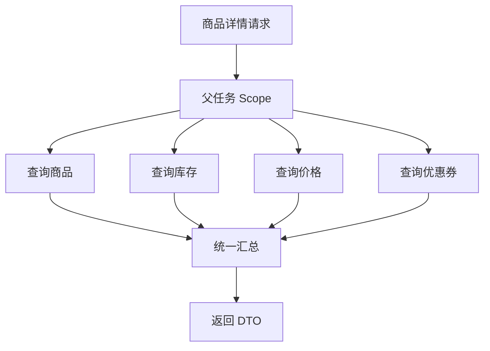

后续会重点讲：

- StructuredTaskScope 是什么
    
- 它和 CompletableFuture 的区别
    
- 如何做并发查询聚合
    
- 失败一个任务时如何取消其他任务
    
- 如何结合虚拟线程使用
    
- 企业级接口聚合代码
    

注意：Java 21 中结构化并发仍是 **预览特性**。

---

## 3.3 Scoped Values：作用域值

**关键词：ThreadLocal 替代方案、上下文传递、不可变上下文、虚拟线程友好。**

Scoped Values 主要解决：

> ThreadLocal 在虚拟线程时代可能带来内存、生命周期、上下文污染问题。

典型场景：

- TraceId 传递
    
- TenantId 多租户上下文
    
- UserContext 用户上下文
    
- RequestContext 请求上下文
    
- 安全认证信息传递
    

后续会重点讲：

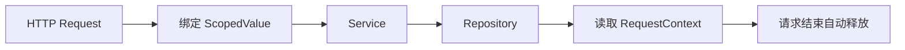

后续会展开：

- ThreadLocal 的问题
    
- ScopedValue 的设计思想
    
- ScopedValue 和虚拟线程为什么更适配
    
- 在日志、审计、多租户系统里的用法
    
- 企业级封装示例
    

注意：Java 21 中 Scoped Values 是 **预览特性**。

---

# 4. 学习主线二：语言表达能力增强

## 4.1 Pattern Matching for switch

**关键词：类型模式匹配、switch 增强、复杂分支简化。**

它解决的问题是：

> 传统 `instanceof + 强转 + if-else` 写法冗长、可读性差、容易漏分支。

典型场景：

- 订单状态流转
    
- 支付结果处理
    
- 风控事件处理
    
- 消息事件分发
    
- 异常分类处理
    

示意：

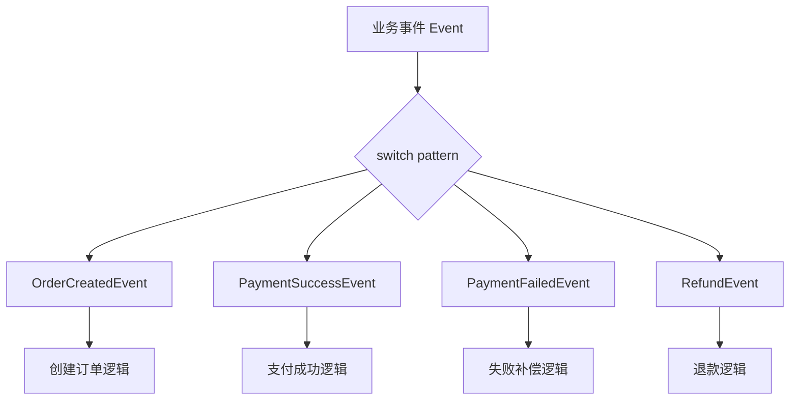

后续会展开：

- switch 支持类型匹配
    
- switch 支持 null case
    
- guard 条件
    
- sealed class 配合 switch 的完整性检查
    
- 企业级事件分发代码
    

---

## 4.2 Record Patterns

**关键词：数据解构、Record、DTO、模式匹配。**

Record Patterns 解决的问题是：

> 对 Record 类型对象进行解构时，不需要手动 `obj.xxx()` 一层层取值。

典型场景：

- DTO 解构
    
- 事件对象处理
    
- 响应结果处理
    
- 嵌套数据模型处理
    
- 领域值对象建模
    

示意：

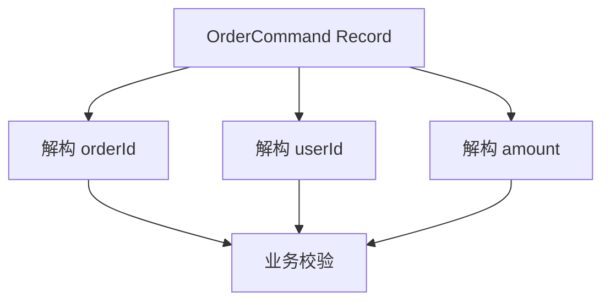

后续会展开：

- Record Pattern 基础语法
    
- 嵌套 Record 解构
    
- 和 switch pattern 组合使用
    
- 在 DDD 值对象、Command、Event 中的应用
    

---

## 4.3 Unnamed Patterns and Variables

**关键词：忽略变量、减少噪音、模式匹配辅助能力。**

它解决的是：

> 某些变量只是为了语法完整性存在，但业务上不需要使用。

典型场景：

- catch 中忽略异常变量
    
- lambda 中忽略参数
    
- record pattern 中忽略部分字段
    
- switch pattern 中忽略无用结构
    

后续会展开：

- `_` 变量的使用
    
- 哪些场景适合用
    
- 哪些场景会损害可读性
    
- 和 Record Pattern 的组合
    

注意：Java 21 中该特性是 **预览特性**。

---

## 4.4 String Templates

**关键词：字符串模板、安全插值、SQL/JSON/日志字符串构造。**

它解决的问题是：

> 字符串拼接和格式化代码可读性差，而且容易带来注入、安全和转义问题。

典型场景：

- 日志消息构造
    
- JSON 字符串构造
    
- SQL 片段构造
    
- HTML 文本构造
    
- Prompt 模板构造
    

后续会展开：

```java
// 预览特性示意
String message = STR."User \{userId} created order \{orderId}";
```

重点会讲：

- 它和 `String.format`、`+` 拼接的区别
    
- 模板处理器是什么
    
- 为什么它对 SQL、JSON、Prompt 构造有价值
    
- 在企业代码里是否建议立即使用
    

注意：Java 21 中 String Templates 是 **预览特性**，且后续版本有变化，生产项目需要谨慎。

---

# 5. 学习主线三：集合框架增强

## 5.1 Sequenced Collections

**关键词：有序集合统一接口、first、last、reversed。**

Java 21 引入了：

- `SequencedCollection`
    
- `SequencedSet`
    
- `SequencedMap`
    

它解决的问题是：

> 很多集合天然有顺序，但 Java 之前没有统一的首尾访问接口。

典型场景：

- 最近访问记录
    
- LRU 缓存辅助结构
    
- 时间线消息
    
- 审计日志
    
- 有序订单状态流
    
- 首页 Feed 流
    

示意：

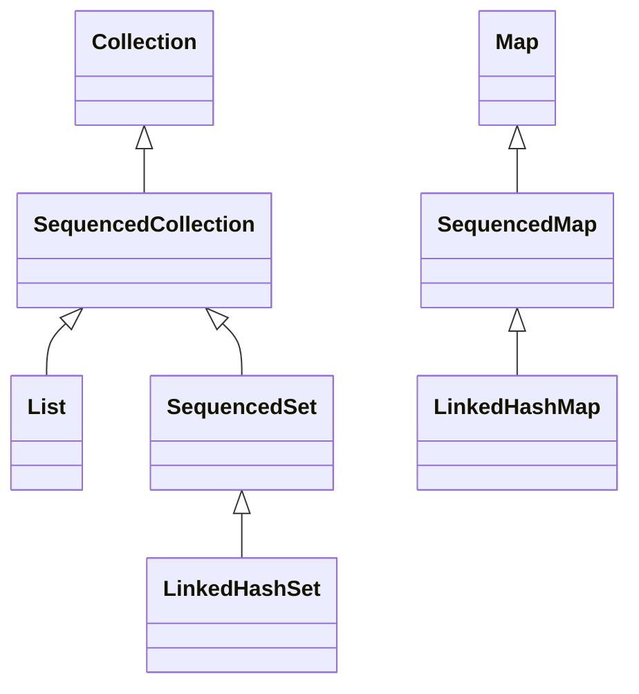

后续会展开：

- `getFirst()`
    
- `getLast()`
    
- `addFirst()`
    
- `addLast()`
    
- `reversed()`
    
- 为什么 `LinkedHashMap` 在 Java 21 更好用了
    
- 用它实现订单轨迹、最近访问记录
    

---

# 6. 学习主线四：JVM 与性能增强

## 6.1 Generational ZGC

**关键词：低延迟 GC、分代 ZGC、大堆内存、服务端性能。**

Java 21 的 ZGC 支持分代回收。

它解决的问题是：

> 原先 ZGC 是低延迟 GC，但对年轻对象密集型应用的吞吐和内存回收效率还有优化空间。

典型场景：

- 大堆内存服务
    
- 低延迟交易系统
    
- 搜索服务
    
- 推荐系统
    
- 实时风控
    
- 高 QPS 网关
    
- 大量短生命周期对象的服务
    

后续会展开：

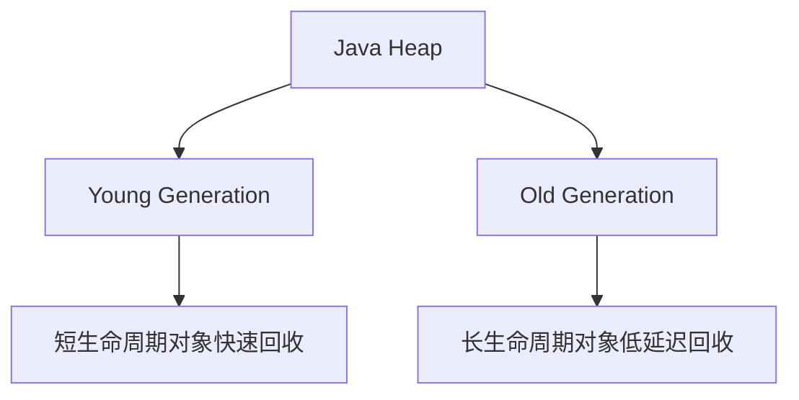

后续会讲：

- ZGC 是什么
    
- G1、ZGC、Shenandoah 的区别
    
- 分代 ZGC 为什么重要
    
- Java 21 服务端 JVM 参数建议
    
- 如何结合 JFR 分析 GC
    

---

## 6.2 JFR / JVM 诊断增强

**关键词：线上诊断、低开销 profiling、GC 分析、线程分析。**

重点关注：

- JFR 对虚拟线程的观测能力
    
- 线程 dump 对虚拟线程的支持
    
- 高并发场景下如何定位阻塞点
    
- 生产环境如何采集 JFR
    
- 如何识别虚拟线程 pinning
    

后续会结合：

- Spring Boot 服务
    
- 高并发接口
    
- 数据库连接池阻塞
    
- Redis 慢查询
    
- 外部 HTTP 调用耗时
    

---

## 6.3 CDS 增强

**关键词：启动优化、类数据共享、容器化部署。**

CDS 对云原生 Java 应用有价值。

典型场景：

- Spring Boot 应用启动优化
    
- Serverless Java
    
- 容器冷启动
    
- K8s 弹性扩缩容
    
- 微服务频繁发布
    

后续会展开：

- CDS 是什么
    
- AppCDS 是什么
    
- 和 GraalVM Native Image 的区别
    
- 容器化场景是否值得做
    

---

# 7. 学习主线五：安全与底层 API

## 7.1 Key Encapsulation Mechanism API

**关键词：密钥封装、后量子密码、TLS、安全通信。**

这个特性偏底层，不是普通业务开发每天都会用，但适合安全、网关、中间件方向了解。

典型场景：

- 安全通信协议
    
- 密钥交换
    
- TLS 底层机制
    
- 后量子密码迁移
    
- 加密 SDK
    

后续可作为扩展内容讲，不作为主线重点。

---

## 7.2 动态 Agent 加载警告

**关键词：Java Agent、字节码增强、可观测性、APM、Mock 框架。**

Java 21 开始，对运行时动态加载 Java Agent 给出更明确的警告。

影响场景：

- Arthas
    
- SkyWalking
    
- OpenTelemetry Java Agent
    
- ByteBuddy
    
- Mockito
    
- Jacoco
    
- 热更新工具
    
- APM 探针
    

后续会讲：

- Java Agent 是什么
    
- 为什么动态加载 Agent 会被限制
    
- 对线上诊断工具的影响
    
- 如何正确配置 JVM 参数
    

---

# 8. 学习主线六：高性能计算与 AI 相关能力

## 8.1 Vector API

**关键词：SIMD、向量化计算、AI 推理、Embedding 相似度计算。**

Vector API 对普通 CRUD 后端不是主线，但对 AI 后端、搜索、推荐、向量计算有启发。

典型场景：

- Embedding 向量相似度
    
- 余弦相似度计算
    
- 图像处理
    
- 音频处理
    
- 数值计算
    
- 推荐系统召回
    

示意：

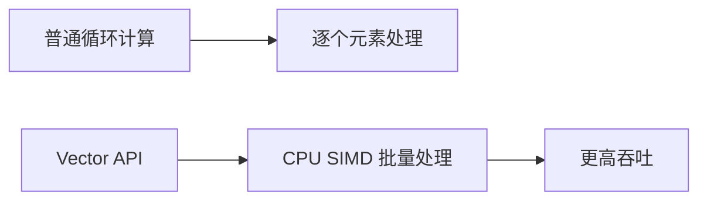

后续可讲：

- SIMD 是什么
    
- Vector API 的基本使用
    
- Java 计算 embedding cosine similarity
    
- 为什么很多场景仍然交给 Milvus / Faiss / GPU
    

注意：Java 21 中 Vector API 仍是 **孵化特性**。

---

# 9. 企业项目迁移视角

## 9.1 从 Java 8 / 11 / 17 升级到 Java 21

后续可以专门展开：

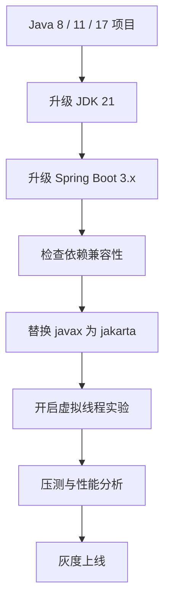

重点内容：

- Java 8 升 Java 21 的主要风险
    
- Spring Boot 2 升 Spring Boot 3 的 `javax -> jakarta` 问题
    
- Maven / Gradle 配置
    
- Docker 镜像选择
    
- CI/CD 配置
    
- 线上压测方法
    
- 兼容性排查清单
    

---

# 10. 企业级应用场景总览

|场景|推荐关注特性|
|---|---|
|高并发 Web API|虚拟线程|
|商品详情页接口聚合|虚拟线程 + 结构化并发|
|支付 / 订单事件分发|switch pattern + sealed class|
|DTO / Command / Event 建模|Record + Record Pattern|
|最近访问记录 / Feed 流|Sequenced Collections|
|大堆内存低延迟服务|Generational ZGC|
|多租户上下文传递|Scoped Values|
|日志 / Prompt 模板|String Templates|
|APM / 线上诊断|JFR + Java Agent 机制|
|Embedding 数值计算|Vector API|

---

# 11. 建议学习顺序

## 第一阶段：必须掌握

1. Java 21 整体定位：为什么它是重要 LTS
    
2. Virtual Threads 虚拟线程
    
3. Spring Boot 3.2+ 如何启用虚拟线程
    
4. Pattern Matching for switch
    
5. Record Patterns
    
6. Sequenced Collections
    

---

## 第二阶段：工程进阶

7. Structured Concurrency
    
8. Scoped Values
    
9. Generational ZGC
    
10. JFR 诊断虚拟线程
    
11. Java 17 / 21 项目迁移
    

---

## 第三阶段：扩展能力

12. String Templates
    
13. Vector API
    
14. KEM API
    
15. Java Agent 限制变化
    
16. CDS / AppCDS / 启动优化
    

---

# 12. 本系列后续展开建议

建议后续按这个顺序逐个展开：

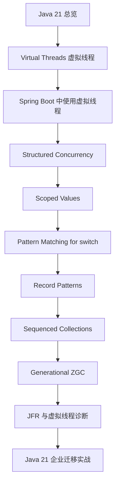

---

# 13. Keyword

```text
Java 21
LTS
Project Loom
Virtual Threads
Platform Threads
Carrier Thread
Structured Concurrency
Scoped Values
ThreadLocal
Pattern Matching
switch expression
Record Patterns
Record
Sealed Class
SequencedCollection
SequencedMap
SequencedSet
Generational ZGC
JFR
CDS
String Templates
Vector API
KEM API
Java Agent
Spring Boot 3.2
High Concurrency
Blocking I/O
```

---

# 14. 可扩展知识点

后续可以扩展到：

1. **Java 17 到 Java 21 的完整差异**
    
2. **Java 8 到 Java 21 的企业迁移路径**
    
3. **虚拟线程与 Netty / WebFlux / Reactor 的关系**
    
4. **虚拟线程是否会替代异步编程**
    
5. **虚拟线程和数据库连接池的真实瓶颈**
    
6. **Java 21 + Spring Boot 3.2 高并发接口实战**
    
7. **Java 21 在微服务架构中的落地方式**
    
8. **Java 21 与 Go 协程模型对比**
    
9. **Java 21 与 Kotlin 协程对比**
    
10. **Java 21 对传统 Java 后端面试的影响**
    
11. **Java 21 + Docker + K8s 部署实践**
    
12. **Java 21 + GraalVM Native Image 的组合使用**
    
13. **Java 21 在 AI 后端系统中的价值**
    
14. **Java 21 对 RAG / Agent / MCP 后端服务的帮助**
    

---

# 15. 面试加分项

## 15.1 虚拟线程相关

面试中重点讲清楚：

- 虚拟线程不是 OS 线程
    
- 虚拟线程适合 I/O 密集型任务，不适合 CPU 密集型任务
    
- 虚拟线程不是无限并发，瓶颈会转移到：
    
    - 数据库连接池
        
    - Redis 连接池
        
    - 下游服务限流
        
    - CPU
        
    - 内存
        
- 虚拟线程可以让阻塞式代码重新具备高并发能力
    
- 虚拟线程不等于 WebFlux 的完全替代品
    

---

## 15.2 结构化并发相关

可以这样表达：

> CompletableFuture 解决的是异步任务编排问题，而 Structured Concurrency 更强调并发任务的生命周期管理。它让多个子任务有明确的父级作用域，便于统一取消、失败传播和资源释放。

---

## 15.3 ScopedValue 相关

可以这样表达：

> ScopedValue 可以看作虚拟线程时代更安全的上下文传递机制。相比 ThreadLocal，它强调作用域绑定、不可变值、生命周期清晰，更适合请求级上下文传递。

---

## 15.4 ZGC 相关

可以这样表达：

> Generational ZGC 的意义在于把 ZGC 的低延迟优势和分代回收思想结合起来，更适合现代服务端应用中大量短生命周期对象的内存分配模式。

---

## 15.5 Java 21 企业落地相关

面试中可以补充：

> Java 21 的核心价值不是简单增加语法，而是改善服务端开发的并发模型、数据建模方式和运行时性能。实际落地时，我会优先评估虚拟线程、Spring Boot 3.2 兼容性、连接池配置、JFR 观测、GC 策略和灰度压测结果，而不是盲目升级。