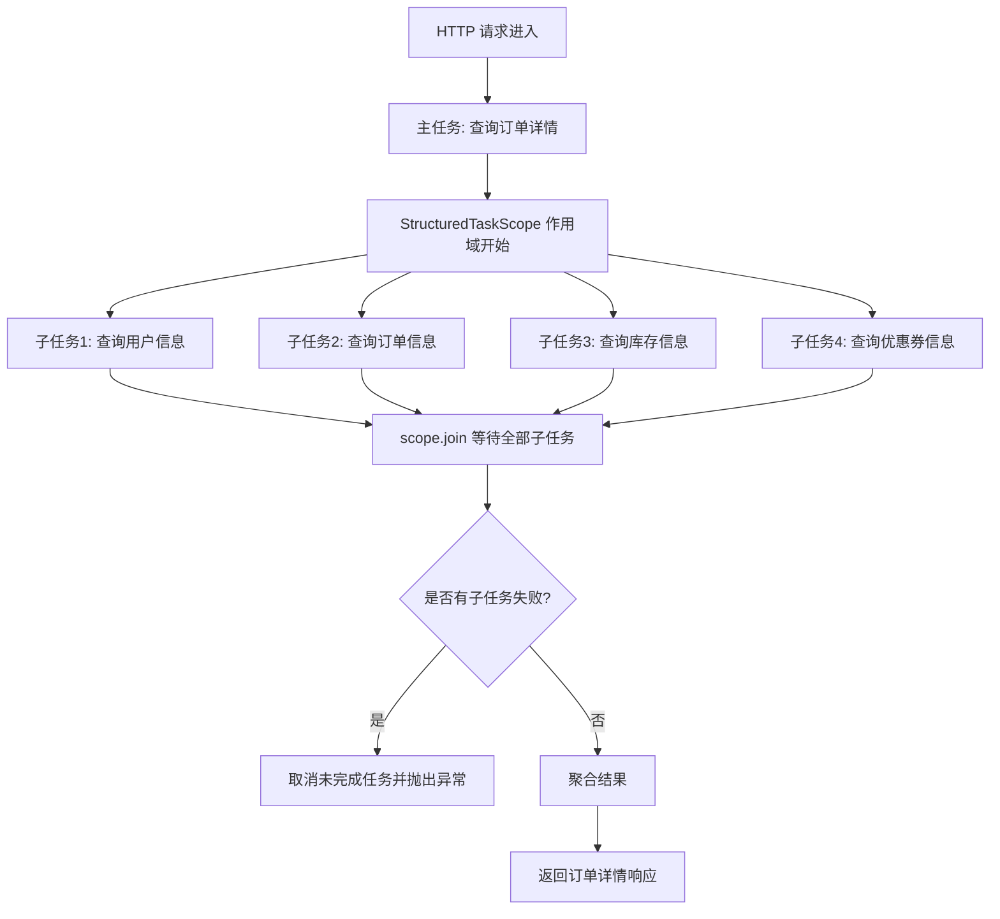
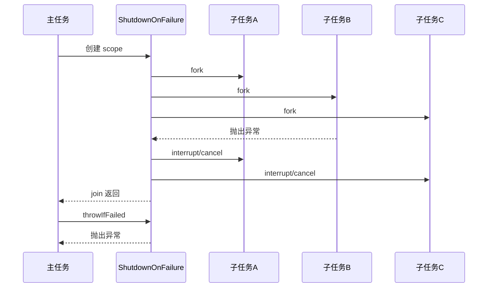

## 0. 本章定位

你已经学完 **虚拟线程 Virtual Threads**，接下来学 **Structured Concurrency** 是合理的。

一句话：

> **虚拟线程解决“线程很贵”的问题；结构化并发解决“并发任务不好管理”的问题。**

Java 21 中的结构化并发由 `StructuredTaskScope` 提供，是 **Preview API**，使用时必须开启 preview 特性。Oracle JDK 21 文档明确说明：`StructuredTaskScope` 是 Java 平台的 preview API，程序必须启用 preview features 才能使用。([Oracle Docs](https://docs.oracle.com/en/java/javase/21/docs/api/java.base/java/util/concurrent/StructuredTaskScope.html?utm_source=chatgpt.com "StructuredTaskScope (Java SE 21 & JDK 21)"))

---

# 1. 为什么需要结构化并发？

## 1.1 传统并发的问题

假设一个后端接口需要聚合多个远程服务：

```text
GET /api/order/detail/{orderId}

需要并发调用：
1. 用户服务 user-service
2. 订单服务 order-service
3. 库存服务 inventory-service
4. 优惠券服务 coupon-service
```

传统写法可能使用：

```java
ExecutorService
Future
CompletableFuture
CountDownLatch
```

问题是：

|问题|说明|
|---|---|
|生命周期不清晰|子任务什么时候结束？是否有泄漏？|
|异常处理分散|每个 `Future.get()` 都可能抛异常|
|取消困难|一个任务失败后，其他任务可能还在跑|
|可观测性差|线程之间没有天然的父子关系|
|代码结构不直观|并发逻辑被拆散，业务代码变复杂|

JEP 453 的目标就是：把一组相关并发任务当作一个整体处理，简化错误处理、取消逻辑，提高可靠性和可观测性。([OpenJDK](https://openjdk.org/jeps/453 "JEP 453: Structured Concurrency (Preview)"))

---

# 2. 什么是结构化并发？

## 2.1 核心定义

**Structured Concurrency** 的核心思想：

> 如果一个任务拆分出多个并发子任务，那么这些子任务必须在同一个代码块中启动、等待、收尾。

OpenJDK 对它的描述是：结构化并发保留任务与子任务之间的自然关系，使并发代码更易读、更易维护、更可靠。它要求子任务的生命周期被限制在父任务的语法代码块中。([OpenJDK](https://openjdk.org/jeps/453 "JEP 453: Structured Concurrency (Preview)"))

也就是说，它把并发代码从这种“散养模式”：

```text
主任务
 ├── 提交任务A到线程池，不知道何时结束
 ├── 提交任务B到线程池，不知道何时结束
 └── 主线程继续跑，异常和取消到处散落
```

变成这种“父子作用域模式”：

```text
主任务 scope
 ├── 子任务A
 ├── 子任务B
 ├── 子任务C
 └── scope 结束前，所有子任务必须完成、失败或被取消
```

---

## 2.2 Mermaid 理解



---

# 3. 和虚拟线程的关系

## 3.1 虚拟线程负责“跑得起”

虚拟线程让 Java 可以低成本创建大量线程，尤其适合：

```text
数据库查询
HTTP 调用
RPC 调用
文件 IO
消息队列阻塞消费
```

OpenJDK 的 JEP 453 也明确提到，虚拟线程使得为每个 I/O 操作分配一个线程变得经济，但大量线程仍然需要良好的管理；结构化并发正是用来协调这些线程的。([OpenJDK](https://openjdk.org/jeps/453 "JEP 453: Structured Concurrency (Preview)"))

## 3.2 结构化并发负责“管得住”

虚拟线程解决：

```text
能不能开很多线程？
```

结构化并发解决：

```text
这些线程之间是什么关系？
谁失败了怎么办？
谁负责取消？
什么时候统一结束？
日志、追踪、诊断怎么看？
```

所以它们的关系是：

```text
Virtual Threads = 并发执行能力
Structured Concurrency = 并发组织能力
```

---

# 4. 核心 API：StructuredTaskScope

Java 21 中核心类是：

```java
java.util.concurrent.StructuredTaskScope
```

官方文档说明，`StructuredTaskScope` 支持把一个任务拆成多个并发子任务，子任务完成后主任务再继续；它通常配合 `try-with-resources` 使用，并通过 `fork()` 启动子任务，通过 `join()` 等待子任务完成。([Oracle Docs](https://docs.oracle.com/en/java/javase/21/docs/api/java.base/java/util/concurrent/StructuredTaskScope.html "StructuredTaskScope (Java SE 21 & JDK 21)"))

常用方法：

|API|作用|
|---|---|
|`fork(Callable<T>)`|启动一个子任务|
|`join()`|等待 scope 内子任务完成|
|`joinUntil(Instant)`|等待到指定 deadline|
|`throwIfFailed()`|如果有子任务失败，统一抛异常|
|`shutdown()`|取消未完成子任务|
|`close()`|关闭 scope，通常由 `try-with-resources` 自动完成|

两个常用子类：

|子类|适用场景|
|---|---|
|`StructuredTaskScope.ShutdownOnFailure`|所有子任务都必须成功；任意失败则取消其他任务|
|`StructuredTaskScope.ShutdownOnSuccess<T>`|任意一个子任务成功即可；成功后取消其他任务|

官方文档也明确区分这两个策略：`ShutdownOnSuccess` 用于“任意一个结果可用即可”的场景；`ShutdownOnFailure` 用于“所有结果都需要”的场景。([Oracle Docs](https://docs.oracle.com/en/java/javase/21/docs/api/java.base/java/util/concurrent/StructuredTaskScope.html "StructuredTaskScope (Java SE 21 & JDK 21)"))

---

# 5. 第一个基础案例：并发查询用户和订单

## 5.1 编译运行要求

因为 Java 21 中结构化并发是 preview API，所以需要开启：

```bash
javac --release 21 --enable-preview Demo.java
java --enable-preview Demo
```

Maven 配置：

```xml
<build>
    <plugins>
        <plugin>
            <groupId>org.apache.maven.plugins</groupId>
            <artifactId>maven-compiler-plugin</artifactId>
            <version>3.11.0</version>
            <configuration>
                <release>21</release>
                <compilerArgs>
                    <arg>--enable-preview</arg>
                </compilerArgs>
            </configuration>
        </plugin>
    </plugins>
</build>
```

---

## 5.2 示例代码

```java
import java.util.concurrent.ExecutionException;
import java.util.concurrent.StructuredTaskScope;

public class StructuredConcurrencyDemo {

    public static void main(String[] args) throws Exception {
        Response response = handle("user-1001", "order-9001");
        System.out.println(response);
    }

    /**
     * 模拟一个后端聚合接口：
     * 1. 查询用户信息
     * 2. 查询订单信息
     * 两个任务互相独立，可以并发执行。
     */
    public static Response handle(String userId, String orderId)
            throws InterruptedException, ExecutionException {

        // ShutdownOnFailure 表示：
        // 只要任意一个子任务失败，scope 会取消其他还没完成的子任务。
        try (var scope = new StructuredTaskScope.ShutdownOnFailure()) {

            // fork 会启动子任务，通常会运行在虚拟线程中。
            var userTask = scope.fork(() -> findUser(userId));
            var orderTask = scope.fork(() -> findOrder(orderId));

            // 等待所有子任务完成，或者某个任务失败后触发 scope 的失败策略。
            scope.join();

            // 如果任意子任务失败，这里统一抛出异常。
            // 这比多个 Future.get() 分散处理异常更清晰。
            scope.throwIfFailed();

            // join + throwIfFailed 之后，可以安全获取结果。
            User user = userTask.get();
            Order order = orderTask.get();

            return new Response(user, order);
        }
    }

    private static User findUser(String userId) throws InterruptedException {
        Thread.sleep(300);
        return new User(userId, "Alice");
    }

    private static Order findOrder(String orderId) throws InterruptedException {
        Thread.sleep(500);
        return new Order(orderId, 1999);
    }

    record User(String id, String name) {}
    record Order(String id, int amount) {}
    record Response(User user, Order order) {}
}
```

---

# 6. 企业级场景：订单详情聚合接口

## 6.1 场景描述

在真实后端系统中，经常有这种接口：

```text
OrderDetailService.getOrderDetail(orderId)
```

它需要调用：

```text
订单服务
用户服务
库存服务
优惠券服务
物流服务
```

这些服务之间大多是 **I/O 型调用**，非常适合：

```text
虚拟线程 + 结构化并发
```

---

## 6.2 DTO 设计

```java
public record OrderDetailResponse(
        OrderInfo orderInfo,
        UserInfo userInfo,
        InventoryInfo inventoryInfo,
        CouponInfo couponInfo
) {}

public record OrderInfo(String orderId, String userId, String skuId, int amount) {}

public record UserInfo(String userId, String username, String level) {}

public record InventoryInfo(String skuId, int stock) {}

public record CouponInfo(String userId, int availableCount) {}
```

---

## 6.3 Client 模拟

```java
public class OrderClient {

    public OrderInfo getOrder(String orderId) throws InterruptedException {
        // 模拟远程 HTTP/RPC 调用
        Thread.sleep(120);
        return new OrderInfo(orderId, "user-1001", "sku-2001", 399);
    }
}

public class UserClient {

    public UserInfo getUser(String userId) throws InterruptedException {
        Thread.sleep(100);
        return new UserInfo(userId, "z", "VIP");
    }
}

public class InventoryClient {

    public InventoryInfo getInventory(String skuId) throws InterruptedException {
        Thread.sleep(150);
        return new InventoryInfo(skuId, 128);
    }
}

public class CouponClient {

    public CouponInfo getCoupon(String userId) throws InterruptedException {
        Thread.sleep(80);
        return new CouponInfo(userId, 3);
    }
}
```

---

## 6.4 Service：结构化并发聚合

```java
import java.util.concurrent.ExecutionException;
import java.util.concurrent.StructuredTaskScope;

public class OrderDetailService {

    private final OrderClient orderClient = new OrderClient();
    private final UserClient userClient = new UserClient();
    private final InventoryClient inventoryClient = new InventoryClient();
    private final CouponClient couponClient = new CouponClient();

    /**
     * 查询订单详情。
     *
     * 设计重点：
     * 1. 先查询 order，因为 userId、skuId 来自 order。
     * 2. 拿到 order 后，并发查询 user、inventory、coupon。
     * 3. 任意核心子任务失败，则整体失败。
     */
    public OrderDetailResponse getOrderDetail(String orderId)
            throws InterruptedException, ExecutionException {

        OrderInfo orderInfo = orderClient.getOrder(orderId);

        try (var scope = new StructuredTaskScope.ShutdownOnFailure()) {

            var userTask = scope.fork(() ->
                    userClient.getUser(orderInfo.userId())
            );

            var inventoryTask = scope.fork(() ->
                    inventoryClient.getInventory(orderInfo.skuId())
            );

            var couponTask = scope.fork(() ->
                    couponClient.getCoupon(orderInfo.userId())
            );

            // 等待所有子任务完成。
            scope.join();

            // 任意失败，统一抛出。
            scope.throwIfFailed();

            return new OrderDetailResponse(
                    orderInfo,
                    userTask.get(),
                    inventoryTask.get(),
                    couponTask.get()
            );
        }
    }
}
```

---

# 7. 加入超时控制：joinUntil

生产环境不能无限等待远程服务。

## 7.1 带 deadline 的代码

```java
import java.time.Instant;
import java.util.concurrent.ExecutionException;
import java.util.concurrent.StructuredTaskScope;
import java.util.concurrent.TimeoutException;

public class OrderDetailServiceWithTimeout {

    private final UserClient userClient = new UserClient();
    private final InventoryClient inventoryClient = new InventoryClient();
    private final CouponClient couponClient = new CouponClient();

    public OrderDetailResponse queryWithTimeout(OrderInfo orderInfo)
            throws InterruptedException, ExecutionException, TimeoutException {

        try (var scope = new StructuredTaskScope.ShutdownOnFailure()) {

            var userTask = scope.fork(() ->
                    userClient.getUser(orderInfo.userId())
            );

            var inventoryTask = scope.fork(() ->
                    inventoryClient.getInventory(orderInfo.skuId())
            );

            var couponTask = scope.fork(() ->
                    couponClient.getCoupon(orderInfo.userId())
            );

            // 设置整个并发作用域的 deadline。
            // 注意：这是对一组子任务整体设置 deadline，而不是每个 Future 分散设置。
            scope.joinUntil(Instant.now().plusMillis(300));

            scope.throwIfFailed();

            return new OrderDetailResponse(
                    orderInfo,
                    userTask.get(),
                    inventoryTask.get(),
                    couponTask.get()
            );
        }
    }
}
```

## 7.2 关键点

这段代码的工程价值在于：

```text
不是给每个任务单独设置超时，
而是给“这一组任务”设置统一超时。
```

这符合真实接口的 SLA 思维：

```text
订单详情接口整体 300ms 内必须完成。
```

而不是：

```text
用户服务 300ms
库存服务 300ms
优惠券服务 300ms
最后总耗时可能远超预期
```

---

# 8. ShutdownOnFailure：最常用策略

## 8.1 适合场景

```text
所有子任务都必须成功。
任意一个失败，整体失败。
```

典型场景：

|场景|说明|
|---|---|
|订单详情聚合|用户、订单、库存都需要|
|支付确认|订单、支付流水、风控结果都需要|
|报表查询|多个数据源缺一不可|
|权限校验|用户、角色、权限策略都必须成功|

## 8.2 行为



官方文档说明，`ShutdownOnFailure` 会捕获第一个失败子任务的异常，并关闭 scope，从而中断未完成的线程，适合“所有结果都需要”的场景。([Oracle Docs](https://docs.oracle.com/en/java/javase/21/docs/api/java.base/java/util/concurrent/StructuredTaskScope.html "StructuredTaskScope (Java SE 21 & JDK 21)"))

---

# 9. ShutdownOnSuccess：谁先成功用谁

## 9.1 适合场景

```text
多个任务只要一个成功即可。
```

典型场景：

|场景|说明|
|---|---|
|多数据源容灾查询|主库、缓存、备库谁先返回用谁|
|多供应商报价|谁先给出有效报价用谁|
|多搜索渠道|ES、缓存、推荐服务谁先命中用谁|
|多模型调用|多个 LLM provider 竞速，谁先成功用谁|

---

## 9.2 示例：多渠道查询商品价格

```java
import java.util.concurrent.ExecutionException;
import java.util.concurrent.StructuredTaskScope;

public class PriceQueryService {

    public PriceResponse queryBestAvailablePrice(String skuId)
            throws InterruptedException, ExecutionException {

        try (var scope = new StructuredTaskScope.ShutdownOnSuccess<PriceResponse>()) {

            scope.fork(() -> queryFromCache(skuId));
            scope.fork(() -> queryFromPrimaryPriceService(skuId));
            scope.fork(() -> queryFromBackupPriceService(skuId));

            // 等到第一个成功结果，或者所有任务都失败。
            scope.join();

            // 获取第一个成功结果。
            // 如果全部失败，这里会抛出异常。
            return scope.result();
        }
    }

    private PriceResponse queryFromCache(String skuId) throws InterruptedException {
        Thread.sleep(50);
        throw new RuntimeException("cache miss");
    }

    private PriceResponse queryFromPrimaryPriceService(String skuId) throws InterruptedException {
        Thread.sleep(120);
        return new PriceResponse(skuId, 399);
    }

    private PriceResponse queryFromBackupPriceService(String skuId) throws InterruptedException {
        Thread.sleep(200);
        return new PriceResponse(skuId, 405);
    }

    public record PriceResponse(String skuId, int price) {}
}
```

## 9.3 注意

`ShutdownOnSuccess` 不是“取最快结果”这么简单。

更准确地说：

```text
取第一个成功完成的结果。
```

失败的任务不会直接让整体失败，除非所有任务都失败。

---

# 10. 和 CompletableFuture 的对比

## 10.1 CompletableFuture 写法

```java
CompletableFuture<UserInfo> userFuture =
        CompletableFuture.supplyAsync(() -> userClient.getUser(userId), executor);

CompletableFuture<InventoryInfo> inventoryFuture =
        CompletableFuture.supplyAsync(() -> inventoryClient.getInventory(skuId), executor);

CompletableFuture<CouponInfo> couponFuture =
        CompletableFuture.supplyAsync(() -> couponClient.getCoupon(userId), executor);

CompletableFuture.allOf(userFuture, inventoryFuture, couponFuture).join();

UserInfo user = userFuture.join();
InventoryInfo inventory = inventoryFuture.join();
CouponInfo coupon = couponFuture.join();
```

这种写法不是不能用，而是有几个问题：

|问题|CompletableFuture|StructuredTaskScope|
|---|---|---|
|子任务生命周期|容易逃逸|限制在 scope 内|
|取消传播|需要手写|scope 统一管理|
|异常处理|分散|集中|
|可读性|链式复杂|类似同步代码|
|适合模型|异步回调模型|阻塞式直写模型|
|和虚拟线程搭配|可以但不自然|更自然|

JEP 453 明确提到，`CompletableFuture` 是为异步编程范式设计的，而 `StructuredTaskScope` 鼓励阻塞式编程范式；结构化并发要把多个线程中的相关任务视为一个工作单元，而不是把每个 `Future` 当作独立任务处理。([OpenJDK](https://openjdk.org/jeps/453 "JEP 453: Structured Concurrency (Preview)"))

---

# 11. 结构化并发的本质

## 11.1 不是“更快的线程池”

结构化并发不是用来替代线程池的简单工具。

它的本质是：

```text
用代码块表达并发任务的生命周期边界。
```

也就是：

```java
try (var scope = new StructuredTaskScope.ShutdownOnFailure()) {
    // 所有 fork 出去的任务，都属于这个 scope
    // scope 不结束，任务不逃逸
}
```

这和普通结构化编程类似：

```java
if (...) {
    // 分支逻辑有明确边界
}

for (...) {
    // 循环逻辑有明确边界
}

try (...) {
    // 资源生命周期有明确边界
}
```

结构化并发就是把这个思想推广到并发任务：

```text
并发任务也应该有明确边界。
```

---

# 12. 常见坑点

## 12.1 忘记开启 preview

错误现象：

```text
StructuredTaskScope is a preview API and is disabled by default
```

解决：

```bash
--enable-preview
```

---

## 12.2 fork 后不 join

错误写法：

```java
try (var scope = new StructuredTaskScope.ShutdownOnFailure()) {
    var task = scope.fork(() -> query());
    return task.get(); // 错误：还没有 join
}
```

正确写法：

```java
try (var scope = new StructuredTaskScope.ShutdownOnFailure()) {
    var task = scope.fork(() -> query());
    scope.join();
    scope.throwIfFailed();
    return task.get();
}
```

---

## 12.3 把它当成线程池替代品

不要这样理解：

```text
ExecutorService 过时了，全部换成 StructuredTaskScope
```

JEP 453 明确说明，结构化并发的目标不是替代 `java.util.concurrent` 包中的所有并发构造，例如 `ExecutorService` 和 `Future`。([OpenJDK](https://openjdk.org/jeps/453 "JEP 453: Structured Concurrency (Preview)"))

更准确的选择是：

|需求|推荐|
|---|---|
|请求内并发聚合|`StructuredTaskScope`|
|后台任务池|`ExecutorService`|
|定时任务|`ScheduledExecutorService` / 调度框架|
|事件流处理|Reactor / MQ / Stream|
|CPU 密集型并行计算|ForkJoinPool / 并行流 / 专用线程池|
|大量 I/O 阻塞任务|虚拟线程|

---

## 12.4 子任务不响应中断

结构化并发取消子任务主要依赖中断。

如果你的代码这样写：

```java
try {
    Thread.sleep(1000);
} catch (InterruptedException e) {
    // 错误：吞掉中断
}
```

会导致取消不及时。

正确写法：

```java
try {
    Thread.sleep(1000);
} catch (InterruptedException e) {
    Thread.currentThread().interrupt();
    throw e;
}
```

---

## 12.5 在子任务中修改共享状态

不推荐：

```java
List<String> result = new ArrayList<>();

try (var scope = new StructuredTaskScope.ShutdownOnFailure()) {
    scope.fork(() -> {
        result.add("A"); // 非线程安全
        return null;
    });
}
```

推荐：

```java
try (var scope = new StructuredTaskScope.ShutdownOnFailure()) {
    var taskA = scope.fork(() -> queryA());
    var taskB = scope.fork(() -> queryB());

    scope.join();
    scope.throwIfFailed();

    List<String> result = List.of(taskA.get(), taskB.get());
}
```

原则：

```text
子任务返回结果，不要随便共享可变状态。
```

---

# 13. 适合用结构化并发的场景

## 13.1 很适合

|场景|原因|
|---|---|
|BFF 聚合接口|多个后端服务并发查询|
|微服务聚合查询|RPC/HTTP 调用多，I/O 阻塞明显|
|AI 应用多 Provider 调用|OpenAI、Anthropic、DeepSeek 竞速或降级|
|RAG 多阶段查询|metadata、vector、keyword 并发召回|
|权限聚合校验|用户、角色、策略并发查询|
|订单详情页|订单、用户、库存、优惠券并发聚合|

---

## 13.2 不适合

|场景|原因|
|---|---|
|长生命周期后台任务|scope 生命周期应短小明确|
|MQ 消费主循环|更适合消费者线程模型|
|CPU 密集型计算|虚拟线程和结构化并发不能提高 CPU 算力|
|无边界任务|结构化并发要求明确作用域|
|响应式全链路|Reactor/WebFlux 已经有自己的调度模型|

---

# 14. 和 Spring Boot 项目的结合方式

## 14.1 Controller

```java
@RestController
@RequestMapping("/api/orders")
public class OrderController {

    private final OrderAggregateService orderAggregateService;

    public OrderController(OrderAggregateService orderAggregateService) {
        this.orderAggregateService = orderAggregateService;
    }

    @GetMapping("/{orderId}/detail")
    public OrderDetailResponse getOrderDetail(@PathVariable String orderId)
            throws Exception {
        return orderAggregateService.getOrderDetail(orderId);
    }
}
```

---

## 14.2 Service

```java
@Service
public class OrderAggregateService {

    private final OrderClient orderClient;
    private final UserClient userClient;
    private final InventoryClient inventoryClient;
    private final CouponClient couponClient;

    public OrderAggregateService(
            OrderClient orderClient,
            UserClient userClient,
            InventoryClient inventoryClient,
            CouponClient couponClient
    ) {
        this.orderClient = orderClient;
        this.userClient = userClient;
        this.inventoryClient = inventoryClient;
        this.couponClient = couponClient;
    }

    public OrderDetailResponse getOrderDetail(String orderId) throws Exception {
        OrderInfo order = orderClient.getOrder(orderId);

        try (var scope = new StructuredTaskScope.ShutdownOnFailure()) {

            var userTask = scope.fork(() ->
                    userClient.getUser(order.userId())
            );

            var inventoryTask = scope.fork(() ->
                    inventoryClient.getInventory(order.skuId())
            );

            var couponTask = scope.fork(() ->
                    couponClient.getCoupons(order.userId())
            );

            scope.join();
            scope.throwIfFailed();

            return new OrderDetailResponse(
                    order,
                    userTask.get(),
                    inventoryTask.get(),
                    couponTask.get()
            );
        }
    }
}
```

---

# 15. 工程设计建议

## 15.1 推荐分层

```text
Controller
  ↓
Application Service / Aggregate Service
  ↓
StructuredTaskScope 并发聚合
  ↓
Client / Repository
  ↓
Remote Service / DB / Cache
```

不要把 `StructuredTaskScope` 写得到处都是。

更推荐集中在：

```text
聚合服务层
编排服务层
Application Service 层
```

---

## 15.2 推荐异常策略

```java
try {
    return orderAggregateService.getOrderDetail(orderId);
} catch (InterruptedException e) {
    Thread.currentThread().interrupt();
    throw new ServiceUnavailableException("request interrupted", e);
} catch (ExecutionException e) {
    throw new RemoteCallException("failed to query order detail", e.getCause());
}
```

重点：

```text
InterruptedException 不要吞。
ExecutionException 要拆 cause。
```

---

## 15.3 推荐超时策略

优先设置整体 deadline：

```java
scope.joinUntil(Instant.now().plusMillis(300));
```

而不是每个子调用随便设置自己的超时。

真实项目中建议分层控制：

|层级|控制内容|
|---|---|
|网关层|整体 HTTP 请求超时|
|Controller/Service|业务 SLA deadline|
|Client 层|单个远程调用超时|
|Resilience4j|熔断、限流、隔离、重试|
|日志/Tracing|记录慢调用和失败子任务|

---

# 16. 面试加分项

## 16.1 一句话回答

> Java 21 的 Structured Concurrency 用 `StructuredTaskScope` 把一组相关并发子任务组织成一个有明确生命周期的工作单元，使子任务的启动、等待、取消、异常处理都限制在同一个作用域内。它特别适合虚拟线程场景下的请求内并发聚合。

---

## 16.2 和虚拟线程的关系

可以这样答：

> 虚拟线程降低线程创建和阻塞成本，让“一个任务一个线程”变得可行；结构化并发解决这些任务的组织问题，把多个虚拟线程形成父子结构，统一 join、统一失败处理、统一取消，避免线程泄漏和异常分散。

---

## 16.3 和 CompletableFuture 的区别

可以这样答：

> `CompletableFuture` 偏异步回调和任务编排，任务生命周期容易逃逸；`StructuredTaskScope` 偏结构化阻塞式编程，子任务生命周期被限制在词法作用域中，异常和取消更集中，适合虚拟线程时代的同步风格服务端代码。

---

## 16.4 为什么不是替代 ExecutorService？

可以这样答：

> `ExecutorService` 是通用任务执行框架，适合线程池、后台任务、异步提交；`StructuredTaskScope` 不是通用线程池，而是请求内并发编排工具，强调父子任务关系和作用域生命周期。JEP 453 也明确它不是为了替代 `ExecutorService`。([OpenJDK](https://openjdk.org/jeps/453 "JEP 453: Structured Concurrency (Preview)"))

---

# 17. Keyword

```text
Structured Concurrency
StructuredTaskScope
ShutdownOnFailure
ShutdownOnSuccess
fork
join
joinUntil
throwIfFailed
Subtask
Virtual Thread
Preview API
Task Scope
Cancellation Propagation
Deadline
Request Fan-out
Fan-in
Parent-child Task Relationship
Observability
```

---

# 18. 可扩展知识点

后续可以继续展开：

1. **StructuredTaskScope 源码设计**
    
    - owner thread
        
    - subtask state
        
    - shutdown policy
        
    - interrupt cancellation
        
2. **虚拟线程 + 结构化并发 + ScopedValue**
    
    - 替代部分 `ThreadLocal` 场景
        
    - 请求上下文传递
        
    - TraceId / UserContext 传递
        
3. **和 Spring Boot 3.2+ 虚拟线程配置结合**
    
    - `spring.threads.virtual.enabled=true`
        
    - Tomcat/Jetty 请求处理线程模型变化
        
4. **和 Resilience4j 结合**
    
    - timeout
        
    - bulkhead
        
    - circuit breaker
        
    - retry
        
5. **和 RAG/AI Gateway 项目结合**
    
    - 多路召回并发
        
    - 多模型竞速
        
    - embedding metadata 并发查询
        
    - provider fallback
        

---

# 19. 本章总结

结构化并发的核心不是“并发执行”，而是：

```text
让并发任务有结构、有边界、有父子关系、有统一失败处理。
```

你可以这样建立心智模型：

```text
虚拟线程：让 Java 后端敢于大量使用阻塞式并发。
结构化并发：让这些并发任务不失控。
```

在企业后端里，它最适合的场景是：

```text
一次请求内，需要并发调用多个下游服务，然后统一聚合结果。
```

下一章建议推进：

> **第三章 Scoped Values：作用域值**  
> 它和虚拟线程、结构化并发是一组组合拳，主要解决虚拟线程时代 `ThreadLocal` 的上下文传递问题。