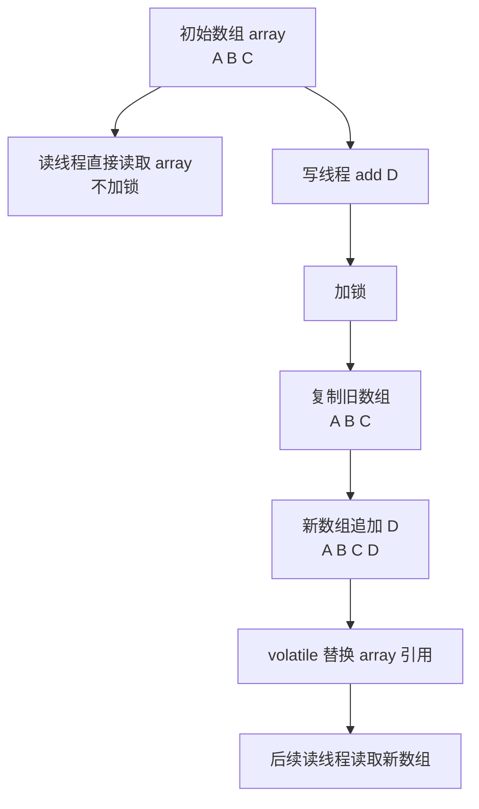
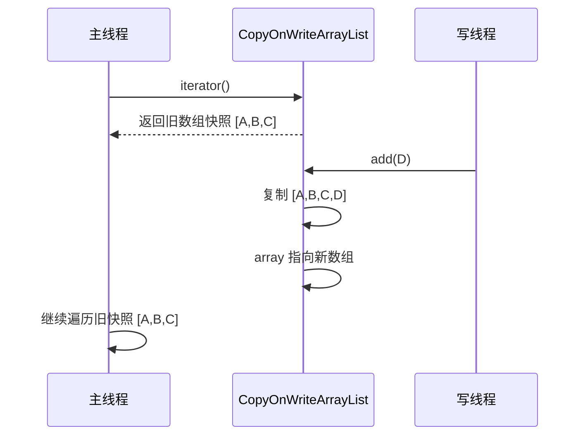
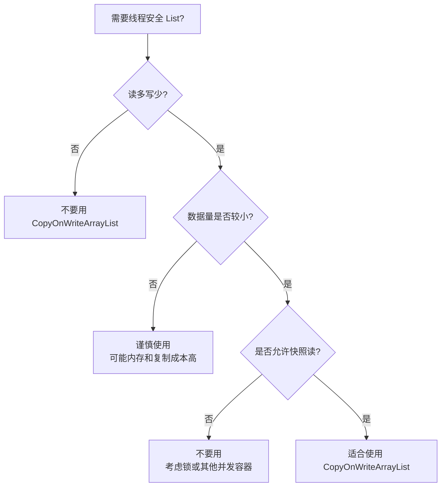

## 1. 先给结论

`CopyOnWriteArrayList` 是 Java 并发包 `java.util.concurrent` 下的线程安全 List。

它的核心思想是：

> **读操作不加锁，写操作加锁，并且写入时复制一份新数组，修改完成后再替换原数组。**

所以它非常适合：

> **读多写少、数据量不大、允许读到旧快照的场景。**

典型场景：

```java
事件监听器列表
配置快照
白名单 / 黑名单
路由规则
插件列表
观察者模式中的 subscriber 列表
```

不适合：

```java
高频写入
大集合
强实时一致性读
需要频繁 add/remove 的业务
```

---

# 2. CopyOnWrite 是什么思想？

`CopyOnWrite` 字面意思是：

> **写时复制。**

也就是说：

- 平时大家读同一个数组；
    
- 有线程要修改时，不在原数组上直接改；
    
- 而是复制一个新数组；
    
- 在新数组上完成修改；
    
- 最后把内部引用指向新数组。
    

可以把它理解为一种 **快照机制**。

---

## 2.1 普通 ArrayList 的问题

普通 `ArrayList` 不是线程安全的。

例如：

```java
List<String> list = new ArrayList<>();

// 线程 A
list.add("A");

// 线程 B
list.add("B");
```

可能出现：

- 数据覆盖；
    
- 数组扩容冲突；
    
- `size` 不一致；
    
- 遍历时抛出 `ConcurrentModificationException`。
    

例如：

```java
List<String> list = new ArrayList<>();
list.add("A");
list.add("B");

for (String item : list) {
    if ("A".equals(item)) {
        list.remove(item);
    }
}
```

可能抛出：

```java
ConcurrentModificationException
```

---

## 2.2 Vector / Collections.synchronizedList 的问题

可以用同步 List：

```java
List<String> list = Collections.synchronizedList(new ArrayList<>());
```

或者老的：

```java
Vector<String> vector = new Vector<>();
```

它们的核心问题是：

> **读写都加锁。**

在读多写少场景下，读操作明明只是读数据，却也要竞争锁，吞吐量会下降。

---

## 2.3 CopyOnWriteArrayList 的设计取舍

`CopyOnWriteArrayList` 选择了另一种路线：

|操作|行为|
|---|---|
|读|不加锁，直接读数组|
|写|加锁，复制新数组，修改后替换|
|遍历|遍历创建迭代器时的快照|
|一致性|弱一致性 / 快照一致性|
|性能特点|读快，写慢|

它牺牲的是：

- 写入性能；
    
- 内存占用；
    
- 数据实时一致性。
    

换来的是：

- 读操作无锁；
    
- 遍历安全；
    
- 实现简单；
    
- 在读多写少场景下性能很好。
    

---

# 3. 底层数据结构

`CopyOnWriteArrayList` 底层本质还是数组。

简化理解：

```java
public class CopyOnWriteArrayList<E> {
    private transient volatile Object[] array;

    final Object[] getArray() {
        return array;
    }

    final void setArray(Object[] a) {
        array = a;
    }
}
```

重点是这个字段：

```java
private transient volatile Object[] array;
```

这里有两个关键点：

## 3.1 array 是数组

说明它和 `ArrayList` 一样，本质是基于数组存储：

```java
["A", "B", "C"]
```

随机访问性能很好：

```java
list.get(0)
```

时间复杂度是：

```text
O(1)
```

---

## 3.2 array 使用 volatile 修饰

`volatile` 的作用是：

> 保证数组引用的可见性。

注意，不是保证数组内部元素的所有操作都原子，而是保证：

```java
array = newArray;
```

这个引用替换操作对其他线程可见。

写线程修改完成后：

```java
setArray(newElements);
```

其他读线程马上能看到新的数组引用。

---

# 4. 核心原理图



关键点：

> 修改的不是原数组，而是新数组。

---

# 5. add 方法底层原理

示例：

```java
CopyOnWriteArrayList<String> list = new CopyOnWriteArrayList<>();
list.add("A");
list.add("B");
list.add("C");
```

内部大致过程：

```java
public boolean add(E e) {
    synchronized (lock) {
        Object[] elements = getArray();
        int len = elements.length;

        Object[] newElements = Arrays.copyOf(elements, len + 1);
        newElements[len] = e;

        setArray(newElements);
        return true;
    }
}
```

真实 JDK 版本实现细节可能略有不同，但核心逻辑就是：

```text
加锁 → 获取旧数组 → 复制新数组 → 修改新数组 → 替换数组引用
```

---

## 5.1 add 的执行过程

假设当前数组是：

```text
array -> ["A", "B", "C"]
```

执行：

```java
list.add("D");
```

过程：

```text
1. 写线程加锁
2. 获取旧数组 ["A", "B", "C"]
3. 创建新数组 ["A", "B", "C", null]
4. 在最后放入 "D"
5. 新数组变成 ["A", "B", "C", "D"]
6. array 引用指向新数组
```

结果：

```text
array -> ["A", "B", "C", "D"]
```

旧数组不会立即被修改，它会等待没有引用后被 GC 回收。

---

# 6. get 方法为什么快？

读取方法类似：

```java
public E get(int index) {
    return elementAt(getArray(), index);
}
```

核心就是：

```java
Object[] elements = array;
return elements[index];
```

特点：

```text
不加锁
不复制
直接数组访问
```

所以读操作非常快。

---

# 7. remove 方法底层原理

示例：

```java
list.remove("B");
```

假设原数组：

```text
["A", "B", "C", "D"]
```

删除后：

```text
["A", "C", "D"]
```

底层不是在原数组上移动元素，而是创建新数组。

简化逻辑：

```java
public boolean remove(Object o) {
    synchronized (lock) {
        Object[] elements = getArray();
        int len = elements.length;

        int index = indexOf(o, elements, 0, len);
        if (index < 0) {
            return false;
        }

        Object[] newElements = new Object[len - 1];

        System.arraycopy(elements, 0, newElements, 0, index);
        System.arraycopy(elements, index + 1, newElements, index, len - index - 1);

        setArray(newElements);
        return true;
    }
}
```

本质：

```text
加锁 → 找到元素 → 创建新数组 → 拷贝保留元素 → 替换引用
```

---

# 8. 迭代器为什么不会抛 ConcurrentModificationException？

这是 `CopyOnWriteArrayList` 的一个重要特性。

示例：

```java
CopyOnWriteArrayList<String> list = new CopyOnWriteArrayList<>();
list.add("A");
list.add("B");
list.add("C");

for (String item : list) {
    if ("B".equals(item)) {
        list.add("D");
    }
    System.out.println(item);
}

System.out.println(list);
```

输出可能是：

```text
A
B
C
[A, B, C, D]
```

注意：

遍历时没有输出 `D`。

原因是：

> 迭代器遍历的是创建迭代器那一刻的数组快照。

---

## 8.1 快照迭代器

当执行：

```java
Iterator<String> iterator = list.iterator();
```

内部类似：

```java
return new COWIterator<>(getArray(), 0);
```

也就是说，迭代器持有的是当前数组引用：

```java
private final Object[] snapshot;
```

后续即使其他线程修改了 List，`iterator` 仍然遍历旧数组。

---

## 8.2 示例图



所以：

```java
for (String item : list) {
    list.add("X");
}
```

不会抛 `ConcurrentModificationException`。

但是要注意：

> 遍历过程中看不到新增数据。

---

# 9. 和 ArrayList / Vector / synchronizedList 对比

|特性|ArrayList|Vector|synchronizedList|CopyOnWriteArrayList|
|---|--:|--:|--:|--:|
|线程安全|否|是|是|是|
|读操作是否加锁|否|是|是|否|
|写操作是否加锁|否|是|是|是|
|写入是否复制数组|否|否|否|是|
|遍历时并发修改|可能异常|需要外部同步|需要外部同步|不异常|
|适合场景|单线程|老代码|普通同步场景|读多写少|
|写性能|高|一般|一般|低|
|读性能|高|较低|较低|高|

---

# 10. 为什么读不用加锁也线程安全？

因为它遵循以下机制：

## 10.1 数组引用不可变式使用

每次写入都创建新数组。

读线程拿到的是某一刻的数组引用：

```java
Object[] snapshot = array;
```

这个数组对读线程来说不会被原地修改。

---

## 10.2 volatile 保证新引用可见

写线程执行：

```java
array = newArray;
```

由于 `array` 是 `volatile`，所以其他线程能够看到最新数组引用。

---

## 10.3 写操作加锁保证写写互斥

多个写线程同时修改时，通过锁保证串行化。

例如：

```java
线程 A add("A")
线程 B add("B")
```

不会同时复制同一个数组并覆盖彼此的结果。

写操作大致是：

```java
synchronized (lock) {
    // copy
    // modify
    // setArray
}
```

或者在某些 JDK 实现中使用 `ReentrantLock`。

---

# 11. 时间复杂度分析

|操作|时间复杂度|原因|
|---|--:|---|
|`get(index)`|O(1)|数组随机访问|
|`size()`|O(1)|直接读取数组长度|
|`add(e)`|O(n)|需要复制整个数组|
|`remove(e)`|O(n)|查找 + 复制|
|`contains(e)`|O(n)|顺序扫描|
|`iterator()`|O(1)|只是持有当前数组引用|
|遍历|O(n)|遍历快照数组|

核心结论：

> `CopyOnWriteArrayList` 的读很便宜，写很贵。

---

# 12. 内存成本分析

假设当前 List 有 100 万个元素。

执行一次：

```java
list.add(newItem);
```

会创建一个新数组：

```text
旧数组：100 万个元素引用
新数组：100 万 + 1 个元素引用
```

在短时间内，内存里可能同时存在：

```text
旧数组 + 新数组
```

如果写操作频繁，会导致：

- 内存瞬时占用升高；
    
- GC 压力变大；
    
- 大数组复制耗时明显；
    
- 甚至可能触发 `OutOfMemoryError`。
    

所以它不适合大集合高频写入。

---

# 13. 典型使用场景

## 13.1 事件监听器列表

这是最经典场景。

监听器一般：

- 注册很少；
    
- 删除很少；
    
- 触发事件时遍历很多。
    

非常适合 `CopyOnWriteArrayList`。

```java
import java.util.List;
import java.util.concurrent.CopyOnWriteArrayList;

public class EventBus {

    private final List<EventListener> listeners = new CopyOnWriteArrayList<>();

    /**
     * 注册监听器。
     * 写操作较少，可以接受 CopyOnWrite 成本。
     */
    public void register(EventListener listener) {
        listeners.add(listener);
    }

    /**
     * 移除监听器。
     */
    public void unregister(EventListener listener) {
        listeners.remove(listener);
    }

    /**
     * 发布事件。
     * 读操作频繁，遍历过程中即使有新增/删除监听器，也不会影响本次通知。
     */
    public void publish(Event event) {
        for (EventListener listener : listeners) {
            listener.onEvent(event);
        }
    }

    public interface EventListener {
        void onEvent(Event event);
    }

    public record Event(String type, String payload) {}
}
```

优点：

```text
发布事件时不需要加锁
遍历稳定
不会 ConcurrentModificationException
监听器变更不会影响当前事件分发
```

---

## 13.2 配置快照

例如系统维护一组动态规则：

```java
public class RuleManager {

    private final CopyOnWriteArrayList<String> rules = new CopyOnWriteArrayList<>();

    public void addRule(String rule) {
        rules.add(rule);
    }

    public void removeRule(String rule) {
        rules.remove(rule);
    }

    public boolean match(String input) {
        for (String rule : rules) {
            if (input.contains(rule)) {
                return true;
            }
        }
        return false;
    }
}
```

适合：

```text
规则不经常变
请求匹配非常频繁
允许某一次请求使用旧规则快照
```

---

## 13.3 白名单 / 黑名单

```java
public class IpWhitelist {

    private final CopyOnWriteArrayList<String> whitelist = new CopyOnWriteArrayList<>();

    public void addIp(String ip) {
        whitelist.addIfAbsent(ip);
    }

    public void removeIp(String ip) {
        whitelist.remove(ip);
    }

    public boolean isAllowed(String ip) {
        return whitelist.contains(ip);
    }
}
```

注意：

如果数据量很大，或者查询非常频繁，更推荐：

```java
ConcurrentHashMap.newKeySet()
```

因为 `contains` 是 O(n)。

---

# 14. 企业级场景示例：订单状态变更监听器

假设一个电商系统中，订单状态变化时，需要通知多个模块：

- 积分模块；
    
- 优惠券模块；
    
- 消息通知模块；
    
- 风控模块；
    
- 数据埋点模块。
    

监听器数量不多，但每次订单状态变化都会遍历调用。

适合用 `CopyOnWriteArrayList`。

```java
import java.util.List;
import java.util.concurrent.CopyOnWriteArrayList;

/**
 * 订单状态事件发布器。
 *
 * 适用场景：
 * 1. 监听器数量较少；
 * 2. 注册/注销监听器不频繁；
 * 3. 发布事件非常频繁；
 * 4. 不希望事件分发过程中因为监听器变化导致并发异常。
 */
public class OrderEventPublisher {

    private final List<OrderStatusListener> listeners = new CopyOnWriteArrayList<>();

    /**
     * 注册监听器。
     * 使用 addIfAbsent 防止重复注册。
     */
    public void register(OrderStatusListener listener) {
        if (listener == null) {
            throw new IllegalArgumentException("listener must not be null");
        }
        listeners.addIfAbsent(listener);
    }

    /**
     * 移除监听器。
     */
    public void unregister(OrderStatusListener listener) {
        if (listener == null) {
            return;
        }
        listeners.remove(listener);
    }

    /**
     * 发布订单状态变化事件。
     *
     * CopyOnWriteArrayList 的快照遍历特性可以保证：
     * - 本次发布过程中新增的监听器不会收到本次事件；
     * - 本次发布过程中删除的监听器仍可能收到本次事件；
     * - 不会抛 ConcurrentModificationException。
     */
    public void publish(OrderStatusChangedEvent event) {
        for (OrderStatusListener listener : listeners) {
            try {
                listener.onOrderStatusChanged(event);
            } catch (Exception ex) {
                // 企业级代码中，单个监听器失败不应该影响其他监听器。
                // 实际项目中应接入日志系统，例如 log.error(...)
                System.err.println("listener execute failed: " + ex.getMessage());
            }
        }
    }

    public interface OrderStatusListener {
        void onOrderStatusChanged(OrderStatusChangedEvent event);
    }

    public record OrderStatusChangedEvent(
            Long orderId,
            String oldStatus,
            String newStatus
    ) {}
}
```

使用示例：

```java
public class Demo {

    public static void main(String[] args) {
        OrderEventPublisher publisher = new OrderEventPublisher();

        publisher.register(event -> {
            System.out.println("send message for order: " + event.orderId());
        });

        publisher.register(event -> {
            System.out.println("update points for order: " + event.orderId());
        });

        publisher.publish(new OrderEventPublisher.OrderStatusChangedEvent(
                1001L,
                "CREATED",
                "PAID"
        ));
    }
}
```

输出：

```text
send message for order: 1001
update points for order: 1001
```

---

# 15. 快照一致性问题

这是 `CopyOnWriteArrayList` 最容易被忽略的点。

## 15.1 遍历期间新增元素

```java
CopyOnWriteArrayList<String> list = new CopyOnWriteArrayList<>();
list.add("A");
list.add("B");

for (String item : list) {
    System.out.println(item);
    list.add("C");
}

System.out.println(list);
```

遍历输出：

```text
A
B
```

最终 List：

```text
[A, B, C, C]
```

解释：

```text
for-each 使用的是遍历开始时的快照 [A, B]
遍历期间 add 的 C 不会进入当前快照
```

---

## 15.2 遍历期间删除元素

```java
CopyOnWriteArrayList<String> list = new CopyOnWriteArrayList<>();
list.add("A");
list.add("B");
list.add("C");

for (String item : list) {
    if ("B".equals(item)) {
        list.remove("B");
    }
    System.out.println(item);
}

System.out.println(list);
```

输出：

```text
A
B
C
[A, C]
```

注意：

虽然 `B` 被删除了，但本次遍历仍然输出了 `B`。

原因是本次遍历的快照仍是：

```text
[A, B, C]
```

---

# 16. 迭代器不支持 remove

普通 `ArrayList` 的迭代器可以：

```java
Iterator<String> iterator = list.iterator();

while (iterator.hasNext()) {
    String item = iterator.next();
    if ("A".equals(item)) {
        iterator.remove();
    }
}
```

但是 `CopyOnWriteArrayList` 的迭代器不支持：

```java
Iterator<String> iterator = list.iterator();

while (iterator.hasNext()) {
    String item = iterator.next();
    if ("A".equals(item)) {
        iterator.remove(); // UnsupportedOperationException
    }
}
```

会抛出：

```java
UnsupportedOperationException
```

原因：

> 迭代器操作的是快照数组，不允许通过快照修改真实 List。

正确写法：

```java
for (String item : list) {
    if ("A".equals(item)) {
        list.remove(item);
    }
}
```

这种写法不会抛并发修改异常。

不过要注意，删除的是真实 List，不影响当前遍历快照。

---

# 17. addIfAbsent 方法

`CopyOnWriteArrayList` 提供了一个很实用的方法：

```java
addIfAbsent(E e)
```

含义：

> 如果元素不存在，则添加。

示例：

```java
CopyOnWriteArrayList<String> list = new CopyOnWriteArrayList<>();

list.addIfAbsent("A");
list.addIfAbsent("A");
list.addIfAbsent("B");

System.out.println(list);
```

输出：

```text
[A, B]
```

适合：

```text
监听器去重
白名单去重
插件去重
规则去重
```

---

## 17.1 addIfAbsent 的并发意义

不要自己写：

```java
if (!list.contains("A")) {
    list.add("A");
}
```

这个写法不是原子操作。

两个线程可能同时执行：

```text
线程 1: contains("A") -> false
线程 2: contains("A") -> false
线程 1: add("A")
线程 2: add("A")
```

最终出现重复数据。

应该使用：

```java
list.addIfAbsent("A");
```

它内部会在锁保护下完成检查和添加。

---

# 18. CopyOnWriteArraySet

JDK 还提供了：

```java
CopyOnWriteArraySet
```

它底层就是基于：

```java
CopyOnWriteArrayList
```

适合需要去重的读多写少集合。

示例：

```java
import java.util.Set;
import java.util.concurrent.CopyOnWriteArraySet;

public class ListenerRegistry {

    private final Set<String> listeners = new CopyOnWriteArraySet<>();

    public void register(String listenerName) {
        listeners.add(listenerName);
    }

    public void unregister(String listenerName) {
        listeners.remove(listenerName);
    }

    public void printAll() {
        for (String listener : listeners) {
            System.out.println(listener);
        }
    }
}
```

如果你天然需要去重，用 `CopyOnWriteArraySet` 会比 `CopyOnWriteArrayList + addIfAbsent` 更直观。

---

# 19. 什么时候用 CopyOnWriteArrayList？

## 19.1 适合使用

满足以下特征时可以考虑：

```text
读远多于写
数据量不大
遍历操作多
允许短时间读到旧数据
需要避免 ConcurrentModificationException
写操作不在核心高频链路
```

典型例子：

```java
private final List<Listener> listeners = new CopyOnWriteArrayList<>();
```

---

## 19.2 不适合使用

以下场景不要用：

```text
写操作频繁
元素数量很大
对内存敏感
要求读取必须看到最新数据
需要复杂条件删除和实时遍历一致性
contains 查询非常频繁且集合较大
```

例如：

```java
用户在线列表
秒杀库存列表
订单列表
聊天消息列表
实时任务队列
大规模黑名单
高频埋点缓存
```

---

# 20. 和 ConcurrentHashMap.newKeySet 的选择

很多时候你需要的是一个线程安全 Set，而不是 List。

例如 IP 黑名单：

```java
Set<String> blacklist = ConcurrentHashMap.newKeySet();
```

对比：

|场景|推荐|
|---|---|
|监听器列表，数量小，遍历多|`CopyOnWriteArrayList`|
|需要去重，数量小，遍历多|`CopyOnWriteArraySet`|
|大量元素，频繁 contains|`ConcurrentHashMap.newKeySet()`|
|高频增删改查|`ConcurrentHashMap`|
|需要阻塞队列|`BlockingQueue`|
|需要按顺序频繁写入|`ConcurrentLinkedQueue`|

例如：

```java
Set<String> onlineUsers = ConcurrentHashMap.newKeySet();
```

比下面这个更合适：

```java
CopyOnWriteArrayList<String> onlineUsers = new CopyOnWriteArrayList<>();
```

因为在线用户会频繁上下线。

---

# 21. Spring 项目中的实际使用

## 21.1 管理策略列表

例如风控系统中维护一批策略：

```java
@Component
public class RiskStrategyRegistry {

    private final CopyOnWriteArrayList<RiskStrategy> strategies = new CopyOnWriteArrayList<>();

    public void register(RiskStrategy strategy) {
        strategies.addIfAbsent(strategy);
    }

    public void unregister(RiskStrategy strategy) {
        strategies.remove(strategy);
    }

    public RiskResult check(RiskContext context) {
        for (RiskStrategy strategy : strategies) {
            RiskResult result = strategy.check(context);
            if (!result.passed()) {
                return result;
            }
        }
        return RiskResult.pass();
    }
}
```

策略接口：

```java
public interface RiskStrategy {
    RiskResult check(RiskContext context);
}
```

结果对象：

```java
public record RiskResult(boolean passed, String reason) {

    public static RiskResult pass() {
        return new RiskResult(true, "PASS");
    }

    public static RiskResult reject(String reason) {
        return new RiskResult(false, reason);
    }
}
```

上下文：

```java
public record RiskContext(
        Long userId,
        Long orderId,
        Long amount
) {}
```

这种设计适合：

```text
策略数量少
策略变更少
每次请求都要遍历策略
运行期可能动态增删策略
```

---

# 22. 常见坑点

## 22.1 坑点一：误用于高频写场景

错误示例：

```java
CopyOnWriteArrayList<Long> orderIds = new CopyOnWriteArrayList<>();

public void addOrder(Long orderId) {
    orderIds.add(orderId);
}
```

如果订单每秒几千、几万写入，这会非常糟糕。

每次 `add` 都复制数组，写入成本极高。

更合适的选择：

```java
Queue<Long> orderIds = new ConcurrentLinkedQueue<>();
```

或者：

```java
BlockingQueue<Long> orderQueue = new LinkedBlockingQueue<>();
```

---

## 22.2 坑点二：以为遍历能看到最新数据

错误理解：

```text
遍历过程中新增的数据应该马上被遍历到
```

实际上不会。

```java
for (String item : list) {
    list.add("new");
}
```

当前遍历只看旧快照。

---

## 22.3 坑点三：大集合使用导致内存问题

例如：

```java
CopyOnWriteArrayList<User> users = new CopyOnWriteArrayList<>();
```

如果有几十万、几百万用户，并且还频繁更新，内存和 GC 压力会很大。

---

## 22.4 坑点四：contains 是 O(n)

```java
list.contains(userId)
```

不是哈希查询，而是数组线性扫描。

如果你要频繁判断是否存在，且元素数量较大，应使用：

```java
Set<Long> userIds = ConcurrentHashMap.newKeySet();
```

---

## 22.5 坑点五：复合操作不一定符合业务原子性

例如：

```java
if (!list.contains("A")) {
    list.add("A");
}
```

这不是原子操作。

应该用：

```java
list.addIfAbsent("A");
```

但更复杂的复合业务逻辑仍需要外部锁或换数据结构。

---

# 23. 面试高频问题

## 23.1 CopyOnWriteArrayList 为什么线程安全？

答：

`CopyOnWriteArrayList` 内部使用数组存储元素。读操作不加锁，直接读取当前数组；写操作加锁，并复制一份新数组，在新数组上修改后，通过 `volatile` 数组引用替换旧数组。写锁保证写写互斥，`volatile` 保证新数组引用对读线程可见，因此可以保证线程安全。

---

## 23.2 它为什么不会抛 ConcurrentModificationException？

答：

因为它的迭代器是快照迭代器。创建迭代器时会保存当时的数组引用，后续 List 修改会产生新数组，不影响迭代器持有的旧数组。因此遍历过程中并发修改不会影响当前遍历，也不会抛 `ConcurrentModificationException`。

---

## 23.3 CopyOnWriteArrayList 的缺点是什么？

答：

主要缺点有三个：

1. 写操作成本高，每次写入都需要复制数组；
    
2. 内存占用高，写入时新旧数组可能同时存在；
    
3. 读操作是快照读，不能保证实时看到最新数据。
    

---

## 23.4 它适合什么场景？

答：

适合读多写少、集合较小、遍历频繁、允许读到旧快照的场景。例如事件监听器列表、配置快照、插件列表、白名单、小规模规则列表等。

---

## 23.5 和 synchronizedList 有什么区别？

答：

`synchronizedList` 是对普通 List 加同步包装，读写都要加锁；`CopyOnWriteArrayList` 是读无锁、写加锁并复制数组。前者适合一般同步场景，后者适合读多写少场景。

---

# 24. 选择建议

可以用下面这个判断逻辑：



---

# 25. 简化记忆

可以这样记：

```text
CopyOnWriteArrayList = 读无锁 + 写复制 + 快照遍历
```

再压缩一点：

```text
读多写少用它，写多别碰它。
```

---

# 26. Keyword

```text
CopyOnWrite
写时复制
快照读
快照迭代器
volatile
读无锁
写加锁
弱一致性
读多写少
ConcurrentModificationException
addIfAbsent
CopyOnWriteArraySet
```

---

# 27. 面试加分总结

可以这样回答：

> `CopyOnWriteArrayList` 本质上是用空间换读性能的并发容器。它内部维护一个 `volatile Object[] array`，读操作直接读取数组，不加锁；写操作通过锁串行化，然后复制旧数组，在新数组上完成修改，最后用 volatile 写替换数组引用。它的迭代器是快照迭代器，因此遍历时不会抛 `ConcurrentModificationException`，但也无法保证遍历过程中看到最新修改。它适合监听器、配置快照、白名单等读多写少场景，不适合高频写、大集合、强实时一致性场景。